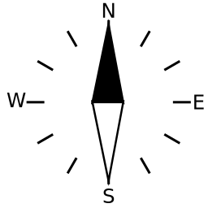
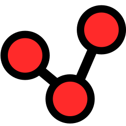
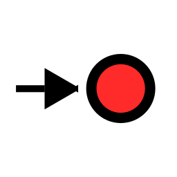
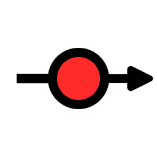

Buttons
====
|Name|File|IconName|IconFile|Icon|shortText|longText|
| --- | --- | --- | --- | --- | --- | --- |
|[__AddonConfigAddOns__](../viewer/components/ButtonDefs.ts#L44)|[gui/AddOnConfigPageButtons.ts](../viewer/gui/AddOnConfigPageButtons.ts#L31)|AddOns|[apps.svg](../viewer/style/icons.less#L137)||[Conf](../viewer/style/button_text.less#L39)|configure app|
|[__AddonConfigImages__](../viewer/components/ButtonDefs.ts#L52)|[gui/AddOnConfigPageButtons.ts](../viewer/gui/AddOnConfigPageButtons.ts#L37)|Images|[image-icon.svg](../viewer/style/icons.less#L4)||[Images](../viewer/style/button_text.less#L45)|image/icon files|
|[__AddonConfigPlus__](../viewer/components/ButtonDefs.ts#L56)|[gui/AddOnConfigPageButtons.ts](../viewer/gui/AddOnConfigPageButtons.ts#L40)|Plus|[ic_add.svg](../viewer/style/icons.less#L80)||[Add](../viewer/style/button_text.less#L48)|add user app|
|[__AddonConfigUser__](../viewer/components/ButtonDefs.ts#L48)|[gui/AddOnConfigPageButtons.ts](../viewer/gui/AddOnConfigPageButtons.ts#L34)|User|[folder_shared.svg](../viewer/style/icons.less#L7)||[User](../viewer/style/button_text.less#L42)|user files|
|[__AisInfoHide__](../viewer/components/ButtonDefs.ts#L136)|[components/AisInfoDisplay.tsx](../viewer/components/AisInfoDisplay.tsx#L253)|AisInfoHide|[ic_hide.svg](../viewer/style/icons.less#L134)||[Hide](../viewer/style/button_text.less#L90)|hide target|
|[__AisInfoLocate__](../viewer/components/ButtonDefs.ts#L132)|[components/AisInfoDisplay.tsx](../viewer/components/AisInfoDisplay.tsx#L239)|Center|[center.svg](../viewer/style/icons.less#L107)||[Locate](../viewer/style/button_text.less#L87)|center to target|
|[__AisItems__](../viewer/components/ButtonDefs.ts#L128)|[gui/AisCfgPageButtons.ts](../viewer/gui/AisCfgPageButtons.ts#L33)|Items|[list-200.svg](../viewer/style/icons.less#L92)||[Targets](../viewer/style/button_text.less#L84)|ais targets|
|[AisItems](../viewer/components/ButtonDefs.ts#L128)|[components/AisInfoDisplay.tsx](../viewer/components/AisInfoDisplay.tsx#L272)|||||
|[__AisLock__](../viewer/components/ButtonDefs.ts#L120)|[gui/AisPageButtons.ts](../viewer/gui/AisPageButtons.ts#L39)|Lock|[update_disabled.svg](../viewer/style/icons.less#L101)||[Pause](../viewer/style/button_text.less#L78)|pause updates|
|[__AisNearest__](../viewer/components/ButtonDefs.ts#L112)|[gui/AisPageButtons.ts](../viewer/gui/AisPageButtons.ts#L30)|AisNearest|[ais-nearest.svg](../viewer/style/icons.less#L140)||[Nearest](../viewer/style/button_text.less#L72)|nearest target|
|[AisNearest](../viewer/components/ButtonDefs.ts#L112)|[components/AisInfoDisplay.tsx](../viewer/components/AisInfoDisplay.tsx#L228)|||||
|[__AisSearch__](../viewer/components/ButtonDefs.ts#L124)|[gui/AisPageButtons.ts](../viewer/gui/AisPageButtons.ts#L45)|Search|[search.svg](../viewer/style/icons.less#L104)||[Search](../viewer/style/button_text.less#L81)||
|[__AisSort__](../viewer/components/ButtonDefs.ts#L116)|[gui/AisPageButtons.ts](../viewer/gui/AisPageButtons.ts#L34)|Sort|[sort.svg](../viewer/style/icons.less#L98)||[Sort](../viewer/style/button_text.less#L75)||
|[__AnchorWatch__](../viewer/components/ButtonDefs.ts#L231)|[components/AnchorWatchDialog.jsx](../viewer/components/AnchorWatchDialog.jsx#L181)|Anchor|[anchor.svg](../viewer/style/icons.less#L198)||[Anchor](../viewer/style/button_text.less#L162)|anchor watch|
|[__AndroidBrowser__](../viewer/components/ButtonDefs.ts#L339)|[gui/ServerPageButtons.ts](../viewer/gui/ServerPageButtons.ts#L55)|Browser|[internet-web-browser.svg](../viewer/style/icons.less#L86)||[Browser](../viewer/style/button_text.less#L245)|external browser|
|[__Back__](../viewer/components/ButtonDefs.ts#L65)|[gui/AddOnPageButtons.ts](../viewer/gui/AddOnPageButtons.ts#L30)|Back|[ic_arrow_back.svg](../viewer/style/icons.less#L77)||[Back](../viewer/style/button_text.less#L55)|go back|
|[__Cancel__](../viewer/components/ButtonDefs.ts#L39)|[gui/GpsPageButtons.ts](../viewer/gui/GpsPageButtons.ts#L50)|Cancel|[ic_clear.svg](../viewer/style/icons.less#L74)||[Cancel](../viewer/style/button_text.less#L16)|leave / cancel|
|[Cancel](../viewer/components/ButtonDefs.ts#L39)|[gui/GeneralButtons.ts](../viewer/gui/GeneralButtons.ts#L35)|||||
|[Cancel](../viewer/components/ButtonDefs.ts#L39)|[components/UploadHandler.tsx](../viewer/components/UploadHandler.tsx#L313)|||||
|[__CenterAction__](../viewer/components/ButtonDefs.ts#L227)|[components/FeatureInfoDialog.jsx](../viewer/components/FeatureInfoDialog.jsx#L388)|CenterAction|[center-action.svg](../viewer/style/icons.less#L192)||[Action](../viewer/style/button_text.less#L159)|map action|
|[__ChartsView__](../viewer/components/ButtonDefs.ts#L146)|[gui/ChartsPageButtons.ts](../viewer/gui/ChartsPageButtons.ts#L37)|Charts|[map2.svg](../viewer/style/icons.less#L10)||[Charts](../viewer/style/button_text.less#L98)|list charts|
|[__Connected__](../viewer/components/ButtonDefs.ts#L310)|[gui/GeneralButtons.ts](../viewer/gui/GeneralButtons.ts#L41)|Connected|[plug.svg](../viewer/style/icons.less#L31)||[Conn](../viewer/style/button_text.less#L223)|connected mode|
|[__CourseUp__](../viewer/components/ButtonDefs.ts#L243)|[gui/NavPage.tsx](../viewer/gui/NavPage.tsx#L831)|CourseUp|[compass.svg](../viewer/style/icons.less#L161)||[Course](../viewer/style/button_text.less#L171)|course up|
|[CourseUp](../viewer/components/ButtonDefs.ts#L243)|[gui/NavPageButtons.ts](../viewer/gui/NavPageButtons.ts#L75)|||||
|[__CreateFile__](../viewer/components/ButtonDefs.ts#L427)|[components/DownloadItemList.tsx](../viewer/components/DownloadItemList.tsx#L277)|Plus|[ic_add.svg](../viewer/style/icons.less#L80)||[New](../viewer/style/button_text.less#L313)|create file|
|[__DBAccept__](../viewer/components/ButtonDefs.ts#L600)|[components/EulaDialog.jsx](../viewer/components/EulaDialog.jsx#L31)|Ok|[ic_done.svg](../viewer/style/icons.less#L267)||[Accept](../viewer/style/button_text.less#L453)||
|[__DBActivate__](../viewer/components/ButtonDefs.ts#L680)|[components/FileDialog.jsx](../viewer/components/FileDialog.jsx#L1541)|Open|[ic_open.svg](../viewer/style/icons.less#L252)||[Activate](../viewer/style/button_text.less#L505)||
|[DBActivate](../viewer/components/ButtonDefs.ts#L680)|[components/FileDialog.jsx](../viewer/components/FileDialog.jsx#L1619)|||||
|[__DBAdd__](../viewer/components/ButtonDefs.ts#L464)|[gui/NavPage.tsx](../viewer/gui/NavPage.tsx#L252)|Plus|[ic_add.svg](../viewer/style/icons.less#L80)||[Add](../viewer/style/button_text.less#L342)||
|[__DBAddSub__](../viewer/components/ButtonDefs.ts#L573)|[components/CombinedWidget.jsx](../viewer/components/CombinedWidget.jsx#L106)|Plus|[ic_add.svg](../viewer/style/icons.less#L80)||[+Sub](../viewer/style/button_text.less#L432)||
|[__DBAfter__](../viewer/components/ButtonDefs.ts#L587)|[components/EditWidgetDialog.jsx](../viewer/components/EditWidgetDialog.jsx#L190)|After|[navigate_next.svg](../viewer/style/icons.less#L285)||[After](../viewer/style/button_text.less#L443)||
|[__DBAnchorBoat__](../viewer/components/ButtonDefs.ts#L524)|[components/AnchorWatchDialog.jsx](../viewer/components/AnchorWatchDialog.jsx#L93)|Boat|[boat.svg](../viewer/style/icons.less#L201)||[Boat](../viewer/style/button_text.less#L407)|at boat pos|
|[__DBAnchorCenter__](../viewer/components/ButtonDefs.ts#L528)|[components/AnchorWatchDialog.jsx](../viewer/components/AnchorWatchDialog.jsx#L97)|Center|[center.svg](../viewer/style/icons.less#L107)||[Center](../viewer/style/button_text.less#L410)|at map center|
|[__DBAutoReload__](../viewer/components/ButtonDefs.ts#L632)|[components/LogDialog.tsx](../viewer/components/LogDialog.tsx#L78)|Reload|[ic_refresh.svg](../viewer/style/icons.less#L131)||[Auto](../viewer/style/button_text.less#L477)||
|[__DBBefore__](../viewer/components/ButtonDefs.ts#L583)|[components/EditWidgetDialog.jsx](../viewer/components/EditWidgetDialog.jsx#L189)|Before|[navigate_before.svg](../viewer/style/icons.less#L282)||[Before](../viewer/style/button_text.less#L440)||
|[__DBCancel__](../viewer/components/ButtonDefs.ts#L440)|[gui/EditRoutePage.jsx](../viewer/gui/EditRoutePage.jsx#L512)|Cancel|[ic_clear.svg](../viewer/style/icons.less#L74)||[Cancel](../viewer/style/button_text.less#L324)||
|[DBCancel](../viewer/components/ButtonDefs.ts#L440)|[gui/NavPage.tsx](../viewer/gui/NavPage.tsx#L264)|||||
|[DBCancel](../viewer/components/ButtonDefs.ts#L440)|[components/EditHandlerDialog.jsx](../viewer/components/EditHandlerDialog.jsx#L180)|||||
|[DBCancel](../viewer/components/ButtonDefs.ts#L440)|[components/ImporterView.tsx](../viewer/components/ImporterView.tsx#L242)|||||
|[DBCancel](../viewer/components/ButtonDefs.ts#L440)|[components/ImporterView.tsx](../viewer/components/ImporterView.tsx#L329)|||||
|[DBCancel](../viewer/components/ButtonDefs.ts#L440)|[components/OverlayDialog.tsx](../viewer/components/OverlayDialog.tsx#L357)|||||
|[DBCancel](../viewer/components/ButtonDefs.ts#L440)|[components/EditOverlaysDialog.jsx](../viewer/components/EditOverlaysDialog.jsx#L274)|||||
|[DBCancel](../viewer/components/ButtonDefs.ts#L440)|[components/EditOverlaysDialog.jsx](../viewer/components/EditOverlaysDialog.jsx#L759)|||||
|[DBCancel](../viewer/components/ButtonDefs.ts#L440)|[components/EulaDialog.jsx](../viewer/components/EulaDialog.jsx#L30)|||||
|[DBCancel](../viewer/components/ButtonDefs.ts#L440)|[components/ImportDialog.jsx](../viewer/components/ImportDialog.jsx#L80)|||||
|[DBCancel](../viewer/components/ButtonDefs.ts#L440)|[components/FileDialog.jsx](../viewer/components/FileDialog.jsx#L2069)|||||
|[DBCancel](../viewer/components/ButtonDefs.ts#L440)|[components/FileDialog.jsx](../viewer/components/FileDialog.jsx#L2139)|||||
|[DBCancel](../viewer/components/ButtonDefs.ts#L440)|[components/WaypointDialog.jsx](../viewer/components/WaypointDialog.jsx#L135)|||||
|[DBCancel](../viewer/components/ButtonDefs.ts#L440)|[components/ColorDialog.jsx](../viewer/components/ColorDialog.jsx#L55)|||||
|[DBCancel](../viewer/components/ButtonDefs.ts#L440)|[components/TrackConvertDialog.jsx](../viewer/components/TrackConvertDialog.jsx#L453)|||||
|[DBCancel](../viewer/components/ButtonDefs.ts#L440)|[components/RemoteChannelDialog.tsx](../viewer/components/RemoteChannelDialog.tsx#L58)|||||
|[DBCancel](../viewer/components/ButtonDefs.ts#L440)|[components/LayoutFinishedDialog.jsx](../viewer/components/LayoutFinishedDialog.jsx#L62)|||||
|[DBCancel](../viewer/components/ButtonDefs.ts#L440)|[components/EditWidgetDialog.jsx](../viewer/components/EditWidgetDialog.jsx#L199)|||||
|[DBCancel](../viewer/components/ButtonDefs.ts#L440)|[components/FeatureInfoDialog.jsx](../viewer/components/FeatureInfoDialog.jsx#L325)|||||
|[DBCancel](../viewer/components/ButtonDefs.ts#L440)|[components/BasicDialogs.tsx](../viewer/components/BasicDialogs.tsx#L106)|||||
|[DBCancel](../viewer/components/ButtonDefs.ts#L440)|[components/BasicDialogs.tsx](../viewer/components/BasicDialogs.tsx#L189)|||||
|[DBCancel](../viewer/components/ButtonDefs.ts#L440)|[components/EditPageDialog.tsx](../viewer/components/EditPageDialog.tsx#L177)|||||
|[__DBCenter__](../viewer/components/ButtonDefs.ts#L693)|[gui/NavPage.tsx](../viewer/gui/NavPage.tsx#L653)|Center|[center.svg](../viewer/style/icons.less#L107)||[Center](../viewer/style/button_text.less#L515)||
|[__DBCleanTrack__](../viewer/components/ButtonDefs.ts#L701)|[gui/NavPage.tsx](../viewer/gui/NavPage.tsx#L701)|Delete|[ic_delete.svg](../viewer/style/icons.less#L273)||[Clean track](../viewer/style/button_text.less#L518)||
|[__DBClear__](../viewer/components/ButtonDefs.ts#L537)|[components/BasicDialogs.tsx](../viewer/components/BasicDialogs.tsx#L187)|Delete|[ic_delete.svg](../viewer/style/icons.less#L273)||[Clear](../viewer/style/button_text.less#L363)||
|[DBClear](../viewer/components/ButtonDefs.ts#L537)|[components/ItemNameDialog.jsx](../viewer/components/ItemNameDialog.jsx#L123)|||||
|[__DBColorUnset__](../viewer/components/ButtonDefs.ts#L568)|[components/ColorDialog.jsx](../viewer/components/ColorDialog.jsx#L52)|ColorReset|[format_color_reset.svg](../viewer/style/icons.less#L315)||||
|[__DBCompute__](../viewer/components/ButtonDefs.ts#L651)|[components/TrackConvertDialog.jsx](../viewer/components/TrackConvertDialog.jsx#L446)|Start|[play_arrow.svg](../viewer/style/icons.less#L294)||[Compute](../viewer/style/button_text.less#L489)||
|[__DBConfig__](../viewer/components/ButtonDefs.ts#L676)|[components/FileDialog.jsx](../viewer/components/FileDialog.jsx#L666)|Edit|[ic_edit.svg](../viewer/style/icons.less#L25)||[Config](../viewer/style/button_text.less#L502)||
|[__DBConnect__](../viewer/components/ButtonDefs.ts#L641)|[components/RemoteChannelDialog.tsx](../viewer/components/RemoteChannelDialog.tsx#L53)|Connect|[plug.svg](../viewer/style/icons.less#L326)||[Connect](../viewer/style/button_text.less#L351)||
|[__DBCopy__](../viewer/components/ButtonDefs.ts#L668)|[components/FileDialog.jsx](../viewer/components/FileDialog.jsx#L596)|Copy|[content_copy.svg](../viewer/style/icons.less#L279)||[Copy](../viewer/style/button_text.less#L369)||
|[__DBDelete__](../viewer/components/ButtonDefs.ts#L452)|[gui/EditRoutePage.jsx](../viewer/gui/EditRoutePage.jsx#L479)|Delete|[ic_delete.svg](../viewer/style/icons.less#L273)||[Delete](../viewer/style/button_text.less#L333)||
|[DBDelete](../viewer/components/ButtonDefs.ts#L452)|[components/EditHandlerDialog.jsx](../viewer/components/EditHandlerDialog.jsx#L173)|||||
|[DBDelete](../viewer/components/ButtonDefs.ts#L452)|[components/ImporterView.tsx](../viewer/components/ImporterView.tsx#L153)|||||
|[DBDelete](../viewer/components/ButtonDefs.ts#L452)|[components/EditOverlaysDialog.jsx](../viewer/components/EditOverlaysDialog.jsx#L736)|||||
|[DBDelete](../viewer/components/ButtonDefs.ts#L452)|[components/FileDialog.jsx](../viewer/components/FileDialog.jsx#L555)|||||
|[DBDelete](../viewer/components/ButtonDefs.ts#L452)|[components/WaypointDialog.jsx](../viewer/components/WaypointDialog.jsx#L126)|||||
|[DBDelete](../viewer/components/ButtonDefs.ts#L452)|[components/UserAppDialog.tsx](../viewer/components/UserAppDialog.tsx#L415)|||||
|[DBDelete](../viewer/components/ButtonDefs.ts#L452)|[components/EditWidgetDialog.jsx](../viewer/components/EditWidgetDialog.jsx#L196)|||||
|[__DBDisable__](../viewer/components/ButtonDefs.ts#L476)|[components/ImporterView.tsx](../viewer/components/ImporterView.tsx#L168)|Disable|[ic_hide.svg](../viewer/style/icons.less#L288)||[Disable](../viewer/style/button_text.less#L384)||
|[__DBDiscard__](../viewer/components/ButtonDefs.ts#L627)|[components/LayoutFinishedDialog.jsx](../viewer/components/LayoutFinishedDialog.jsx#L61)|Delete|[ic_delete.svg](../viewer/style/icons.less#L273)||[Discard changes](../viewer/style/button_text.less#L474)||
|[__DBDisconnect__](../viewer/components/ButtonDefs.ts#L637)|[components/RemoteChannelDialog.tsx](../viewer/components/RemoteChannelDialog.tsx#L48)|Disconnect|[plug-disconnect.svg](../viewer/style/icons.less#L323)||[Disconnect](../viewer/style/button_text.less#L481)||
|[__DBDownload__](../viewer/components/ButtonDefs.ts#L444)|[components/FileDialog.jsx](../viewer/components/FileDialog.jsx#L650)|Download|[ic_file_download.svg](../viewer/style/icons.less#L270)||[Download](../viewer/style/button_text.less#L327)||
|[DBDownload](../viewer/components/ButtonDefs.ts#L444)|[components/DownloadButton.tsx](../viewer/components/DownloadButton.tsx#L107)|||||
|[__DBEditCss__](../viewer/components/ButtonDefs.ts#L623)|[components/LayoutFinishedDialog.jsx](../viewer/components/LayoutFinishedDialog.jsx#L60)|Edit|[ic_edit.svg](../viewer/style/icons.less#L25)||[Edit CSS](../viewer/style/button_text.less#L471)||
|[__DBEditLayout__](../viewer/components/ButtonDefs.ts#L646)|[components/Settings.tsx](../viewer/components/Settings.tsx#L525)|Layout|[ballot.svg](../viewer/style/icons.less#L207)||[Edit](../viewer/style/button_text.less#L485)||
|[DBEditLayout](../viewer/components/ButtonDefs.ts#L646)|[components/FileDialog.jsx](../viewer/components/FileDialog.jsx#L1554)|||||
|[__DBEditRoute__](../viewer/components/ButtonDefs.ts#L697)|[gui/NavPage.tsx](../viewer/gui/NavPage.tsx#L674)|Route|[route.svg](../viewer/style/icons.less#L22)||||
|[DBEditRoute](../viewer/components/ButtonDefs.ts#L697)|[gui/NavPage.tsx](../viewer/gui/NavPage.tsx#L691)|||||
|[__DBEmptyRoute__](../viewer/components/ButtonDefs.ts#L483)|[gui/EditRoutePage.jsx](../viewer/gui/EditRoutePage.jsx#L172)|EmptyRoute|[delete_sweep.svg](../viewer/style/icons.less#L301)||[Empty](../viewer/style/button_text.less#L388)||
|[__DBFeatureNewRoute__](../viewer/components/ButtonDefs.ts#L689)|[gui/NavPage.tsx](../viewer/gui/NavPage.tsx#L414)|Route|[route.svg](../viewer/style/icons.less#L22)||[New route](../viewer/style/button_text.less#L512)||
|[__DBHide__](../viewer/components/ButtonDefs.ts#L721)|[components/FeatureInfoDialog.jsx](../viewer/components/FeatureInfoDialog.jsx#L346)|Hide|[visibility_off.svg](../viewer/style/icons.less#L297)||[Hide](../viewer/style/button_text.less#L533)||
|[__DBHideAllOverlays__](../viewer/components/ButtonDefs.ts#L555)|[components/EditOverlaysDialog.jsx](../viewer/components/EditOverlaysDialog.jsx#L731)|HideOverlays|[layers-black-off.svg](../viewer/style/icons.less#L19)||[Hide all](../viewer/style/button_text.less#L424)||
|[__DBHideOverlays__](../viewer/components/ButtonDefs.ts#L546)|[components/MapPage.tsx](../viewer/components/MapPage.tsx#L388)|HideOverlays|[layers-black-off.svg](../viewer/style/icons.less#L19)||[Hide overlays](../viewer/style/button_text.less#L417)||
|[__DBIgnore__](../viewer/components/ButtonDefs.ts#L480)|[components/Settings.tsx](../viewer/components/Settings.tsx#L678)|||[Ignore](../viewer/style/button_text.less#L354)||
|[DBIgnore](../viewer/components/ButtonDefs.ts#L480)|[components/TitleIcons.tsx](../viewer/components/TitleIcons.tsx#L97)|||||
|[__DBInfo__](../viewer/components/ButtonDefs.ts#L717)|[components/FeatureInfoDialog.jsx](../viewer/components/FeatureInfoDialog.jsx#L364)|Info|[ic_info.svg](../viewer/style/icons.less#L28)||[Info](../viewer/style/button_text.less#L530)||
|[__DBInsert__](../viewer/components/ButtonDefs.ts#L591)|[components/EditWidgetDialog.jsx](../viewer/components/EditWidgetDialog.jsx#L191)|After|[navigate_next.svg](../viewer/style/icons.less#L285)||[Insert](../viewer/style/button_text.less#L446)||
|[__DBInsertAfter__](../viewer/components/ButtonDefs.ts#L563)|[components/EditOverlaysDialog.jsx](../viewer/components/EditOverlaysDialog.jsx#L751)|After|[navigate_next.svg](../viewer/style/icons.less#L285)||[Insert after](../viewer/style/button_text.less#L378)||
|[__DBInsertBefore__](../viewer/components/ButtonDefs.ts#L559)|[components/EditOverlaysDialog.jsx](../viewer/components/EditOverlaysDialog.jsx#L750)|Before|[navigate_before.svg](../viewer/style/icons.less#L282)||[Insert before](../viewer/style/button_text.less#L375)||
|[__DBInsertRouteAfter__](../viewer/components/ButtonDefs.ts#L729)|[gui/EditRoutePage.jsx](../viewer/gui/EditRoutePage.jsx#L860)|NavAddAfter|[wpplus.svg](../viewer/style/icons.less#L167)||[Route after](../viewer/style/button_text.less#L539)||
|[__DBInsertRouteBefore__](../viewer/components/ButtonDefs.ts#L725)|[gui/EditRoutePage.jsx](../viewer/gui/EditRoutePage.jsx#L850)|NavAdd|[wpplus.svg](../viewer/style/icons.less#L164)||[Route before](../viewer/style/button_text.less#L536)||
|[__DBInvertRoute__](../viewer/components/ButtonDefs.ts#L487)|[gui/EditRoutePage.jsx](../viewer/gui/EditRoutePage.jsx#L184)|InvertRoute|[invertroute.svg](../viewer/style/icons.less#L304)||[Invert](../viewer/style/button_text.less#L391)||
|[__DBLoadRoute__](../viewer/components/ButtonDefs.ts#L499)|[gui/EditRoutePage.jsx](../viewer/gui/EditRoutePage.jsx#L435)|Open|[ic_open.svg](../viewer/style/icons.less#L252)||[Load](../viewer/style/button_text.less#L400)||
|[__DBLog__](../viewer/components/ButtonDefs.ts#L613)|[components/ImporterView.tsx](../viewer/components/ImporterView.tsx#L224)|Log|[ic_text_snippet.svg](../viewer/style/icons.less#L228)||[Log](../viewer/style/button_text.less#L463)||
|[DBLog](../viewer/components/ButtonDefs.ts#L613)|[components/FileDialog.jsx](../viewer/components/FileDialog.jsx#L1001)|||||
|[__DBMeasure__](../viewer/components/ButtonDefs.ts#L705)|[gui/NavPage.tsx](../viewer/gui/NavPage.tsx#L732)|Measure|[straighten.svg](../viewer/style/icons.less#L334)||[Measure](../viewer/style/button_text.less#L521)||
|[__DBMeasureAdd__](../viewer/components/ButtonDefs.ts#L709)|[gui/NavPage.tsx](../viewer/gui/NavPage.tsx#L732)|Measure|[straighten.svg](../viewer/style/icons.less#L334)||[+Measure](../viewer/style/button_text.less#L524)||
|[__DBMeasureOff__](../viewer/components/ButtonDefs.ts#L713)|[gui/NavPage.tsx](../viewer/gui/NavPage.tsx#L751)|MeasureOff|[straighten-off.svg](../viewer/style/icons.less#L337)||[Measure](../viewer/style/button_text.less#L527)||
|[__DBNew__](../viewer/components/ButtonDefs.ts#L468)|[components/UserAppDialog.tsx](../viewer/components/UserAppDialog.tsx#L108)|Plus|[ic_add.svg](../viewer/style/icons.less#L80)||[New](../viewer/style/button_text.less#L366)||
|[DBNew](../viewer/components/ButtonDefs.ts#L468)|[components/UserAppDialog.tsx](../viewer/components/UserAppDialog.tsx#L188)|||||
|[__DBNewRoute__](../viewer/components/ButtonDefs.ts#L495)|[gui/EditRoutePage.jsx](../viewer/gui/EditRoutePage.jsx#L424)|Plus|[ic_add.svg](../viewer/style/icons.less#L80)||[New](../viewer/style/button_text.less#L397)||
|[__DBOk__](../viewer/components/ButtonDefs.ts#L436)|[gui/EditRoutePage.jsx](../viewer/gui/EditRoutePage.jsx#L513)|Ok|[ic_done.svg](../viewer/style/icons.less#L267)||[Ok](../viewer/style/button_text.less#L321)||
|[DBOk](../viewer/components/ButtonDefs.ts#L436)|[components/EditHandlerDialog.jsx](../viewer/components/EditHandlerDialog.jsx#L181)|||||
|[DBOk](../viewer/components/ButtonDefs.ts#L436)|[components/OverlayDialog.tsx](../viewer/components/OverlayDialog.tsx#L360)|||||
|[DBOk](../viewer/components/ButtonDefs.ts#L436)|[components/EditOverlaysDialog.jsx](../viewer/components/EditOverlaysDialog.jsx#L277)|||||
|[DBOk](../viewer/components/ButtonDefs.ts#L436)|[components/EditOverlaysDialog.jsx](../viewer/components/EditOverlaysDialog.jsx#L656)|||||
|[DBOk](../viewer/components/ButtonDefs.ts#L436)|[components/ImportDialog.jsx](../viewer/components/ImportDialog.jsx#L81)|||||
|[DBOk](../viewer/components/ButtonDefs.ts#L436)|[components/FileDialog.jsx](../viewer/components/FileDialog.jsx#L2072)|||||
|[DBOk](../viewer/components/ButtonDefs.ts#L436)|[components/LogDialog.tsx](../viewer/components/LogDialog.tsx#L96)|||||
|[DBOk](../viewer/components/ButtonDefs.ts#L436)|[components/WaypointDialog.jsx](../viewer/components/WaypointDialog.jsx#L136)|||||
|[DBOk](../viewer/components/ButtonDefs.ts#L436)|[components/ColorDialog.jsx](../viewer/components/ColorDialog.jsx#L56)|||||
|[DBOk](../viewer/components/ButtonDefs.ts#L436)|[components/LayoutFinishedDialog.jsx](../viewer/components/LayoutFinishedDialog.jsx#L63)|||||
|[DBOk](../viewer/components/ButtonDefs.ts#L436)|[components/BasicDialogs.tsx](../viewer/components/BasicDialogs.tsx#L190)|||||
|[DBOk](../viewer/components/ButtonDefs.ts#L436)|[components/EditPageDialog.tsx](../viewer/components/EditPageDialog.tsx#L178)|||||
|[__DBOpenChart__](../viewer/components/ButtonDefs.ts#L656)|[components/FileDialog.jsx](../viewer/components/FileDialog.jsx#L956)|Charts|[map2.svg](../viewer/style/icons.less#L10)||||
|[__DBOverlays__](../viewer/components/ButtonDefs.ts#L664)|[components/FileDialog.jsx](../viewer/components/FileDialog.jsx#L699)|Overlays|[layers-black.svg](../viewer/style/icons.less#L16)||[Overlays](../viewer/style/button_text.less#L499)||
|[DBOverlays](../viewer/components/ButtonDefs.ts#L664)|[components/FileDialog.jsx](../viewer/components/FileDialog.jsx#L993)|||||
|[__DBPreview__](../viewer/components/ButtonDefs.ts#L578)|[components/EditDialog.tsx](../viewer/components/EditDialog.tsx#L79)|View|[visibility.svg](../viewer/style/icons.less#L83)||[Preview](../viewer/style/button_text.less#L436)||
|[__DBPropose__](../viewer/components/ButtonDefs.ts#L618)|[components/ItemNameDialog.jsx](../viewer/components/ItemNameDialog.jsx#L138)|Propose|[prompt_suggestion.svg](../viewer/style/icons.less#L319)||[Propose](../viewer/style/button_text.less#L467)|propose new name|
|[__DBReload__](../viewer/components/ButtonDefs.ts#L472)|[components/ImporterView.tsx](../viewer/components/ImporterView.tsx#L315)|Reload|[ic_refresh.svg](../viewer/style/icons.less#L131)||[Reload](../viewer/style/button_text.less#L381)||
|[DBReload](../viewer/components/ButtonDefs.ts#L472)|[components/LogDialog.tsx](../viewer/components/LogDialog.tsx#L93)|||||
|[DBReload](../viewer/components/ButtonDefs.ts#L472)|[components/ErrorListDialog.jsx](../viewer/components/ErrorListDialog.jsx#L39)|||||
|[__DBRename__](../viewer/components/ButtonDefs.ts#L448)|[gui/EditRoutePage.jsx](../viewer/gui/EditRoutePage.jsx#L444)|Edit|[ic_edit.svg](../viewer/style/icons.less#L25)||[Rename](../viewer/style/button_text.less#L330)||
|[DBRename](../viewer/components/ButtonDefs.ts#L448)|[components/FileDialog.jsx](../viewer/components/FileDialog.jsx#L571)|||||
|[__DBRenumberRoute__](../viewer/components/ButtonDefs.ts#L491)|[gui/EditRoutePage.jsx](../viewer/gui/EditRoutePage.jsx#L195)|RenumberRoute|[format_list_numbered.svg](../viewer/style/icons.less#L307)||[Renumber](../viewer/style/button_text.less#L394)||
|[__DBReset__](../viewer/components/ButtonDefs.ts#L533)|[components/Settings.tsx](../viewer/components/Settings.tsx#L362)|Reset|[ic_delete.svg](../viewer/style/icons.less#L237)||[Reset](../viewer/style/button_text.less#L360)||
|[DBReset](../viewer/components/ButtonDefs.ts#L533)|[components/EditOverlaysDialog.jsx](../viewer/components/EditOverlaysDialog.jsx#L755)|||||
|[DBReset](../viewer/components/ButtonDefs.ts#L533)|[components/ColorDialog.jsx](../viewer/components/ColorDialog.jsx#L48)|||||
|[DBReset](../viewer/components/ButtonDefs.ts#L533)|[components/BasicDialogs.tsx](../viewer/components/BasicDialogs.tsx#L102)|||||
|[__DBRestart__](../viewer/components/ButtonDefs.ts#L609)|[components/ImporterView.tsx](../viewer/components/ImporterView.tsx#L198)|Reload|[ic_refresh.svg](../viewer/style/icons.less#L131)||[Restart](../viewer/style/button_text.less#L460)||
|[__DBRoutePoints__](../viewer/components/ButtonDefs.ts#L503)|[gui/EditRoutePage.jsx](../viewer/gui/EditRoutePage.jsx#L453)|Route|[route.svg](../viewer/style/icons.less#L22)||[Points](../viewer/style/button_text.less#L403)||
|[__DBSave__](../viewer/components/ButtonDefs.ts#L460)|[components/EditDialog.tsx](../viewer/components/EditDialog.tsx#L90)|Save|[save.svg](../viewer/style/icons.less#L255)||[Save](../viewer/style/button_text.less#L339)||
|[DBSave](../viewer/components/ButtonDefs.ts#L460)|[components/EditOverlaysDialog.jsx](../viewer/components/EditOverlaysDialog.jsx#L656)|||||
|[DBSave](../viewer/components/ButtonDefs.ts#L460)|[components/TrackConvertDialog.jsx](../viewer/components/TrackConvertDialog.jsx#L454)|||||
|[__DBSaveAs__](../viewer/components/ButtonDefs.ts#L456)|[gui/EditRoutePage.jsx](../viewer/gui/EditRoutePage.jsx#L496)|SaveAs|[content_copy.svg](../viewer/style/icons.less#L276)||[Save As](../viewer/style/button_text.less#L336)||
|[__DBScheme__](../viewer/components/ButtonDefs.ts#L660)|[components/FileDialog.jsx](../viewer/components/FileDialog.jsx#L967)|ChartScheme|[table_convert.svg](../viewer/style/icons.less#L330)||[Scheme](../viewer/style/button_text.less#L496)||
|[__DBShowAllOverlays__](../viewer/components/ButtonDefs.ts#L551)|[components/EditOverlaysDialog.jsx](../viewer/components/EditOverlaysDialog.jsx#L727)|Overlays|[layers-black.svg](../viewer/style/icons.less#L16)||[Show all](../viewer/style/button_text.less#L421)||
|[__DBShowOverlays__](../viewer/components/ButtonDefs.ts#L542)|[components/MapPage.tsx](../viewer/components/MapPage.tsx#L381)|Overlays|[layers-black.svg](../viewer/style/icons.less#L16)||[Show overlays](../viewer/style/button_text.less#L414)||
|[__DBStartRoute__](../viewer/components/ButtonDefs.ts#L733)|[gui/NavPage.tsx](../viewer/gui/NavPage.tsx#L641)|NavGoto|[wpgoto.svg](../viewer/style/icons.less#L174)||[Start route](../viewer/style/button_text.less#L542)||
|[__DBStop__](../viewer/components/ButtonDefs.ts#L605)|[components/ImporterView.tsx](../viewer/components/ImporterView.tsx#L183)|Stop|[stop_circle.svg](../viewer/style/icons.less#L291)||[Stop](../viewer/style/button_text.less#L457)||
|[__DBToRoute__](../viewer/components/ButtonDefs.ts#L684)|[gui/NavPage.tsx](../viewer/gui/NavPage.tsx#L414)|Route|[route.svg](../viewer/style/icons.less#L22)||[To route](../viewer/style/button_text.less#L508)||
|[DBToRoute](../viewer/components/ButtonDefs.ts#L684)|[gui/NavPage.tsx](../viewer/gui/NavPage.tsx#L664)|||||
|[DBToRoute](../viewer/components/ButtonDefs.ts#L684)|[components/FileDialog.jsx](../viewer/components/FileDialog.jsx#L1416)|||||
|[__DBUpdate__](../viewer/components/ButtonDefs.ts#L595)|[components/EditWidgetDialog.jsx](../viewer/components/EditWidgetDialog.jsx#L201)|Ok|[ic_done.svg](../viewer/style/icons.less#L267)||[Update](../viewer/style/button_text.less#L449)||
|[__DBView__](../viewer/components/ButtonDefs.ts#L672)|[components/FileDialog.jsx](../viewer/components/FileDialog.jsx#L635)|View|[visibility.svg](../viewer/style/icons.less#L83)||[View](../viewer/style/button_text.less#L372)||
|[__DBWpaConnect__](../viewer/components/ButtonDefs.ts#L519)|[gui/WpaPage.jsx](../viewer/gui/WpaPage.jsx#L110)|WpaConnect|[play_arrow.svg](../viewer/style/icons.less#L311)||||
|[__DBWpaDisable__](../viewer/components/ButtonDefs.ts#L515)|[gui/WpaPage.jsx](../viewer/gui/WpaPage.jsx#L103)|WifiOff|[wifi_off.svg](../viewer/style/icons.less#L216)||||
|[__DBWpaEnable__](../viewer/components/ButtonDefs.ts#L511)|[gui/WpaPage.jsx](../viewer/gui/WpaPage.jsx#L96)|Wifi|[wifi.svg](../viewer/style/icons.less#L213)||||
|[__DBWpaRemove__](../viewer/components/ButtonDefs.ts#L507)|[gui/WpaPage.jsx](../viewer/gui/WpaPage.jsx#L89)|Delete|[ic_delete.svg](../viewer/style/icons.less#L273)||||
|[__DefaultValue__](../viewer/components/ButtonDefs.ts#L419)|[components/EditableParameterUI.jsx](../viewer/components/EditableParameterUI.jsx#L109)|Reset|[ic_delete.svg](../viewer/style/icons.less#L237)||[Default](../viewer/style/button_text.less#L307)|default value|
|[__Dim__](../viewer/components/ButtonDefs.ts#L82)|[util/dimhandler.ts](../viewer/util/dimhandler.ts#L164)|Dim|[brightness_low.svg](../viewer/style/icons.less#L110)||[Dim](../viewer/style/button_text.less#L68)|dim backlight|
|[__Edit__](../viewer/components/ButtonDefs.ts#L423)|[components/EditOverlaysDialog.jsx](../viewer/components/EditOverlaysDialog.jsx#L355)|Edit|[ic_edit.svg](../viewer/style/icons.less#L25)||[Edit](../viewer/style/button_text.less#L310)|edit item|
|[Edit](../viewer/components/ButtonDefs.ts#L423)|[components/EditOverlaysDialog.jsx](../viewer/components/EditOverlaysDialog.jsx#L738)|||||
|[Edit](../viewer/components/ButtonDefs.ts#L423)|[components/FileDialog.jsx](../viewer/components/FileDialog.jsx#L684)|||||
|[Edit](../viewer/components/ButtonDefs.ts#L423)|[components/UserAppDialog.tsx](../viewer/components/UserAppDialog.tsx#L383)|||||
|[Edit](../viewer/components/ButtonDefs.ts#L423)|[components/StatusItems.tsx](../viewer/components/StatusItems.tsx#L48)|||||
|[__EditPage__](../viewer/components/ButtonDefs.ts#L398)|[components/EditPageDialog.tsx](../viewer/components/EditPageDialog.tsx#L217)|EditPage|[tune.svg](../viewer/style/icons.less#L204)||[Config](../viewer/style/button_text.less#L290)|page layout config|
|[__FullScreen__](../viewer/components/ButtonDefs.ts#L95)|[util/Fullscreen.ts](../viewer/util/Fullscreen.ts#L84)|FullScreen|[fullscreen.svg](../viewer/style/icons.less#L125)||[Full](../viewer/style/button_text.less#L26)|fullscreen|
|[__Gps1__](../viewer/components/ButtonDefs.ts#L256)|[gui/GpsPageButtons.ts](../viewer/gui/GpsPageButtons.ts#L34)|Num1|[num-1.svg](../viewer/style/icons.less#L43)|||dashboard 1|
|[__Gps10__](../viewer/components/ButtonDefs.ts#L292)|[gui/GpsPageButtons.ts](../viewer/gui/GpsPageButtons.ts#L43)|Num10|[num-10.svg](../viewer/style/icons.less#L70)|||dashboard 10|
|[__Gps2__](../viewer/components/ButtonDefs.ts#L260)|[gui/GpsPageButtons.ts](../viewer/gui/GpsPageButtons.ts#L35)|Num2|[num-2.svg](../viewer/style/icons.less#L46)|||dashboard 2|
|[__Gps3__](../viewer/components/ButtonDefs.ts#L264)|[gui/GpsPageButtons.ts](../viewer/gui/GpsPageButtons.ts#L36)|Num3|[num-3.svg](../viewer/style/icons.less#L49)|||dashboard 3|
|[__Gps4__](../viewer/components/ButtonDefs.ts#L268)|[gui/GpsPageButtons.ts](../viewer/gui/GpsPageButtons.ts#L37)|Num4|[num-4.svg](../viewer/style/icons.less#L52)|||dashboard 4|
|[__Gps5__](../viewer/components/ButtonDefs.ts#L272)|[gui/GpsPageButtons.ts](../viewer/gui/GpsPageButtons.ts#L38)|Num5|[num-5.svg](../viewer/style/icons.less#L55)|||dashboard 5|
|[__Gps6__](../viewer/components/ButtonDefs.ts#L276)|[gui/GpsPageButtons.ts](../viewer/gui/GpsPageButtons.ts#L39)|Num6|[num-6.svg](../viewer/style/icons.less#L58)|||dashboard 6|
|[__Gps7__](../viewer/components/ButtonDefs.ts#L280)|[gui/GpsPageButtons.ts](../viewer/gui/GpsPageButtons.ts#L40)|Num7|[num-7.svg](../viewer/style/icons.less#L61)|||dashboard 7|
|[__Gps8__](../viewer/components/ButtonDefs.ts#L284)|[gui/GpsPageButtons.ts](../viewer/gui/GpsPageButtons.ts#L41)|Num8|[num-8.svg](../viewer/style/icons.less#L64)|||dashboard 8|
|[__Gps9__](../viewer/components/ButtonDefs.ts#L288)|[gui/GpsPageButtons.ts](../viewer/gui/GpsPageButtons.ts#L42)|Num9|[num-9.svg](../viewer/style/icons.less#L67)|||dashboard 9|
|[__GpsCenter__](../viewer/components/ButtonDefs.ts#L251)|[gui/NavPage.tsx](../viewer/gui/NavPage.tsx#L851)|Center|[center.svg](../viewer/style/icons.less#L107)||[GPS](../viewer/style/button_text.less#L177)|center to gps|
|[GpsCenter](../viewer/components/ButtonDefs.ts#L251)|[gui/NavPageButtons.ts](../viewer/gui/NavPageButtons.ts#L88)|||||
|[__Help__](../viewer/components/ButtonDefs.ts#L415)|[components/EditableParameterUI.jsx](../viewer/components/EditableParameterUI.jsx#L70)|Help|[ic_help_outline.svg](../viewer/style/icons.less#L261)||[Help](../viewer/style/button_text.less#L304)||
|[__ImportsView__](../viewer/components/ButtonDefs.ts#L150)|[gui/ChartsPageButtons.ts](../viewer/gui/ChartsPageButtons.ts#L40)|Imports|[swap_horiz.svg](../viewer/style/icons.less#L13)||[Imports](../viewer/style/button_text.less#L101)|chart imports|
|[__Layout__](../viewer/components/ButtonDefs.ts#L394)|[gui/LayoutsPage.tsx](../viewer/gui/LayoutsPage.tsx#L86)|Layout|[ballot.svg](../viewer/style/icons.less#L207)||[Layout](../viewer/style/button_text.less#L287)|select / edit layout|
|[__LayoutFinished__](../viewer/components/ButtonDefs.ts#L402)|[components/LayoutFinishedDialog.jsx](../viewer/components/LayoutFinishedDialog.jsx#L80)|Layout|[ballot.svg](../viewer/style/icons.less#L207)||[Layout](../viewer/style/button_text.less#L293)|finish layout|
|[__LockMarker__](../viewer/components/ButtonDefs.ts#L239)|[gui/NavPage.tsx](../viewer/gui/NavPage.tsx#L813)|LockMarker|[waypoint.svg](../viewer/style/icons.less#L158)||[Start](../viewer/style/button_text.less#L168)|start to wp|
|[LockMarker](../viewer/components/ButtonDefs.ts#L239)|[gui/NavPageButtons.ts](../viewer/gui/NavPageButtons.ts#L56)|||||
|[__LockPos__](../viewer/components/ButtonDefs.ts#L235)|[gui/NavPage.tsx](../viewer/gui/NavPage.tsx#L791)|LockPos|[boat.svg](../viewer/style/icons.less#L195)||[Lock](../viewer/style/button_text.less#L165)|lock to GPS|
|[LockPos](../viewer/components/ButtonDefs.ts#L235)|[gui/NavPageButtons.ts](../viewer/gui/NavPageButtons.ts#L48)|||||
|[__MOB__](../viewer/components/ButtonDefs.ts#L35)|[components/Mob.ts](../viewer/components/Mob.ts#L59)|MOB|[drowning.svg](../viewer/style/icons.less#L210)||[MOB](../viewer/style/button_text.less#L13)|man over board|
|[__MainExit__](../viewer/components/ButtonDefs.ts#L107)|[gui/MainActionButtons.tsx](../viewer/gui/MainActionButtons.tsx#L93)|Cancel|[ic_clear.svg](../viewer/style/icons.less#L74)||[Exit](../viewer/style/button_text.less#L35)|exit AvNav|
|[MainExit](../viewer/components/ButtonDefs.ts#L107)|[gui/WarningPage.tsx](../viewer/gui/WarningPage.tsx#L125)|||||
|[__MainInfo__](../viewer/components/ButtonDefs.ts#L319)|[gui/ServerPageButtons.ts](../viewer/gui/ServerPageButtons.ts#L32)|Info|[ic_info.svg](../viewer/style/icons.less#L28)||[Info](../viewer/style/button_text.less#L230)|version and license|
|[__MainNav__](../viewer/components/ButtonDefs.ts#L297)|[gui/MainNav.tsx](../viewer/gui/MainNav.tsx#L348)|MainNav|[menu-200.svg](../viewer/style/icons.less#L258)||[Menu](../viewer/style/button_text.less#L213)|main menu|
|[__NavAdd__](../viewer/components/ButtonDefs.ts#L191)|[gui/EditRoutePage.jsx](../viewer/gui/EditRoutePage.jsx#L773)|NavAdd|[wpplus.svg](../viewer/style/icons.less#L164)||[+ Before](../viewer/style/button_text.less#L132)|add before current|
|[NavAdd](../viewer/components/ButtonDefs.ts#L191)|[gui/EditRoutePage.jsx](../viewer/gui/EditRoutePage.jsx#L913)|||||
|[__NavAddAfter__](../viewer/components/ButtonDefs.ts#L187)|[gui/EditRoutePage.jsx](../viewer/gui/EditRoutePage.jsx#L786)|NavAddAfter|[wpplus.svg](../viewer/style/icons.less#L167)||[+ After](../viewer/style/button_text.less#L129)|add after current|
|[NavAddAfter](../viewer/components/ButtonDefs.ts#L187)|[gui/EditRoutePage.jsx](../viewer/gui/EditRoutePage.jsx#L896)|||||
|[__NavDelete__](../viewer/components/ButtonDefs.ts#L195)|[gui/EditRoutePage.jsx](../viewer/gui/EditRoutePage.jsx#L930)|NavDelete|[wpminus.svg](../viewer/style/icons.less#L171)||[Delete](../viewer/style/button_text.less#L135)|delete current|
|[__NavGoto__](../viewer/components/ButtonDefs.ts#L203)|[gui/EditRoutePage.jsx](../viewer/gui/EditRoutePage.jsx#L957)|NavGoto|[wpgoto.svg](../viewer/style/icons.less#L174)||[Start](../viewer/style/button_text.less#L141)|start routing|
|[NavGoto](../viewer/components/ButtonDefs.ts#L203)|[gui/NavPage.tsx](../viewer/gui/NavPage.tsx#L630)|||||
|[NavGoto](../viewer/components/ButtonDefs.ts#L203)|[gui/NavPage.tsx](../viewer/gui/NavPage.tsx#L720)|||||
|[NavGoto](../viewer/components/ButtonDefs.ts#L203)|[components/WaypointDialog.jsx](../viewer/components/WaypointDialog.jsx#L117)|||||
|[__NavMapWidgets__](../viewer/components/ButtonDefs.ts#L410)|[gui/NavPage.tsx](../viewer/gui/NavPage.tsx#L775)|NavMapWidgets|[assistant_nav.svg](../viewer/style/icons.less#L246)||[On Map](../viewer/style/button_text.less#L299)|map widgets|
|[__NavNext__](../viewer/components/ButtonDefs.ts#L207)|[gui/NavPage.tsx](../viewer/gui/NavPage.tsx#L320)|NavNext|[nextwp.svg](../viewer/style/icons.less#L155)||[Next](../viewer/style/button_text.less#L144)|goto next wp|
|[__NavOverlays__](../viewer/components/ButtonDefs.ts#L175)|[gui/EditRoutePage.jsx](../viewer/gui/EditRoutePage.jsx#L880)|SelectChart|[layers-black.svg](../viewer/style/icons.less#L183)||[Charts](../viewer/style/button_text.less#L120)|charts/ overlays|
|[NavOverlays](../viewer/components/ButtonDefs.ts#L175)|[gui/NavPage.tsx](../viewer/gui/NavPage.tsx#L847)|||||
|[NavOverlays](../viewer/components/ButtonDefs.ts#L175)|[gui/NavPageButtons.ts](../viewer/gui/NavPageButtons.ts#L37)|||||
|[NavOverlays](../viewer/components/ButtonDefs.ts#L175)|[components/MapPage.tsx](../viewer/components/MapPage.tsx#L130)|||||
|[__NavRestart__](../viewer/components/ButtonDefs.ts#L215)|[gui/NavPage.tsx](../viewer/gui/NavPage.tsx#L335)|WpGoto|[wpgoto.svg](../viewer/style/icons.less#L152)||[Restart](../viewer/style/button_text.less#L150)|restart routing|
|[__NavToCenter__](../viewer/components/ButtonDefs.ts#L199)|[gui/EditRoutePage.jsx](../viewer/gui/EditRoutePage.jsx#L799)|WpLocate|[center.svg](../viewer/style/icons.less#L143)||[Center](../viewer/style/button_text.less#L138)|wp to map center|
|[NavToCenter](../viewer/components/ButtonDefs.ts#L199)|[gui/EditRoutePage.jsx](../viewer/gui/EditRoutePage.jsx#L944)|||||
|[__Night__](../viewer/components/ButtonDefs.ts#L87)|[gui/MainActionButtons.tsx](../viewer/gui/MainActionButtons.tsx#L43)|Night|[night.svg](../viewer/style/icons.less#L119)||[Night](../viewer/style/button_text.less#L20)|night mode|
|[__Overflow__](../viewer/components/ButtonDefs.ts#L431)|[components/ButtonList.tsx](../viewer/components/ButtonList.tsx#L169)|Overflow|[more_left.svg](../viewer/style/icons.less#L264)||[More](../viewer/style/button_text.less#L316)|more buttons|
|[__OverlaysView__](../viewer/components/ButtonDefs.ts#L154)|[gui/ChartsPageButtons.ts](../viewer/gui/ChartsPageButtons.ts#L54)|Overlays|[layers-black.svg](../viewer/style/icons.less#L16)||[Overlays](../viewer/style/button_text.less#L104)|overlay files|
|[__ReloadUI__](../viewer/components/ButtonDefs.ts#L103)|[gui/MainActionButtons.tsx](../viewer/gui/MainActionButtons.tsx#L65)|Reload|[ic_refresh.svg](../viewer/style/icons.less#L131)||[Reload](../viewer/style/button_text.less#L32)|reload AvNav UI|
|[__RemoteChannel__](../viewer/components/ButtonDefs.ts#L91)|[components/RemoteChannelDialog.tsx](../viewer/components/RemoteChannelDialog.tsx#L95)|RemoteChannel|[settings_remote.svg](../viewer/style/icons.less#L122)||[Remote](../viewer/style/button_text.less#L23)|remote control|
|[__RevertLayout__](../viewer/components/ButtonDefs.ts#L406)|[util/layouthandler.ts](../viewer/util/layouthandler.ts#L1133)|Undo|[ic_undo.svg](../viewer/style/icons.less#L249)||[Undo](../viewer/style/button_text.less#L296)|undo layout change|
|[__RouteAdd__](../viewer/components/ButtonDefs.ts#L302)|[gui/RoutesPageButtons.ts](../viewer/gui/RoutesPageButtons.ts#L31)|Plus|[ic_add.svg](../viewer/style/icons.less#L80)||[Add](../viewer/style/button_text.less#L217)|add route|
|[__RouteMenu__](../viewer/components/ButtonDefs.ts#L223)|[gui/EditRoutePage.jsx](../viewer/gui/EditRoutePage.jsx#L976)|RouteMenu|[menu_open.svg](../viewer/style/icons.less#L180)||[Menu](../viewer/style/button_text.less#L156)|route menu|
|[__SectionView__](../viewer/components/ButtonDefs.ts#L360)|[gui/SettingsPageButtons.ts](../viewer/gui/SettingsPageButtons.ts#L32)|Section|[category-200.svg](../viewer/style/icons.less#L234)||[Groups](../viewer/style/button_text.less#L261)|settings groups|
|[__ServerView__](../viewer/components/ButtonDefs.ts#L70)|[gui/TracksPageButtons.ts](../viewer/gui/TracksPageButtons.ts#L31)|Server|[database-200.svg](../viewer/style/icons.less#L89)||[Server](../viewer/style/button_text.less#L59)|server settings|
|[ServerView](../viewer/components/ButtonDefs.ts#L70)|[gui/AisCfgPageButtons.ts](../viewer/gui/AisCfgPageButtons.ts#L30)|||||
|[ServerView](../viewer/components/ButtonDefs.ts#L70)|[gui/RoutesPageButtons.ts](../viewer/gui/RoutesPageButtons.ts#L60)|||||
|[ServerView](../viewer/components/ButtonDefs.ts#L70)|[gui/ChartsPageButtons.ts](../viewer/gui/ChartsPageButtons.ts#L31)|||||
|[__SettingsDefaults__](../viewer/components/ButtonDefs.ts#L368)|[gui/SettingsPageButtons.ts](../viewer/gui/SettingsPageButtons.ts#L38)|Reset|[ic_delete.svg](../viewer/style/icons.less#L237)||[Defaults](../viewer/style/button_text.less#L267)|reset to defaults|
|[__SettingsItems__](../viewer/components/ButtonDefs.ts#L364)|[gui/SettingsPageButtons.ts](../viewer/gui/SettingsPageButtons.ts#L35)|Items|[list-200.svg](../viewer/style/icons.less#L92)||[List](../viewer/style/button_text.less#L264)|stored settings|
|[__SettingsLayoutOff__](../viewer/components/ButtonDefs.ts#L384)|[components/Settings.tsx](../viewer/components/Settings.tsx#L296)|LayoutOff|[ballot-off.svg](../viewer/style/icons.less#L243)||[Rem](../viewer/style/button_text.less#L279)|remove from layout|
|[__SettingsLoad__](../viewer/components/ButtonDefs.ts#L372)|[gui/SettingsPageButtons.ts](../viewer/gui/SettingsPageButtons.ts#L42)|Open|[ic_open.svg](../viewer/style/icons.less#L252)||[Load](../viewer/style/button_text.less#L270)|load settings|
|[__SettingsSave__](../viewer/components/ButtonDefs.ts#L376)|[gui/SettingsPageButtons.ts](../viewer/gui/SettingsPageButtons.ts#L56)|Save|[save.svg](../viewer/style/icons.less#L255)||[Save](../viewer/style/button_text.less#L273)|save settings|
|[__SettingsSplitReset__](../viewer/components/ButtonDefs.ts#L380)|[gui/SettingsPageButtons.ts](../viewer/gui/SettingsPageButtons.ts#L85)|SplitReset|[reset_split.svg](../viewer/style/icons.less#L240)||[Reset](../viewer/style/button_text.less#L276)|reset split settings|
|[__ShowRoutePanel__](../viewer/components/ButtonDefs.ts#L247)|[gui/NavPage.tsx](../viewer/gui/NavPage.tsx#L838)|Route|[route.svg](../viewer/style/icons.less#L22)||[Route](../viewer/style/button_text.less#L174)|edit route|
|[ShowRoutePanel](../viewer/components/ButtonDefs.ts#L247)|[gui/NavPageButtons.ts](../viewer/gui/NavPageButtons.ts#L83)|||||
|[__ShowSettings__](../viewer/components/ButtonDefs.ts#L74)|[gui/LayoutsPageButtons.ts](../viewer/gui/LayoutsPageButtons.ts#L43)|Settings|[ic_settings.svg](../viewer/style/icons.less#L95)||[Display](../viewer/style/button_text.less#L62)|display settings|
|[ShowSettings](../viewer/components/ButtonDefs.ts#L74)|[gui/TracksPageButtons.ts](../viewer/gui/TracksPageButtons.ts#L52)|||||
|[ShowSettings](../viewer/components/ButtonDefs.ts#L74)|[gui/AisCfgPageButtons.ts](../viewer/gui/AisCfgPageButtons.ts#L38)|||||
|[ShowSettings](../viewer/components/ButtonDefs.ts#L74)|[gui/RemotePageButtons.ts](../viewer/gui/RemotePageButtons.ts#L31)|||||
|[ShowSettings](../viewer/components/ButtonDefs.ts#L74)|[gui/RoutesPageButtons.ts](../viewer/gui/RoutesPageButtons.ts#L81)|||||
|[ShowSettings](../viewer/components/ButtonDefs.ts#L74)|[gui/ChartsPageButtons.ts](../viewer/gui/ChartsPageButtons.ts#L57)|||||
|[__Split__](../viewer/components/ButtonDefs.ts#L99)|[util/splitsupport.ts](../viewer/util/splitsupport.ts#L122)|Split|[vertical_split.svg](../viewer/style/icons.less#L128)||[Split](../viewer/style/button_text.less#L29)|split display|
|[__StatusAdd__](../viewer/components/ButtonDefs.ts#L141)|[gui/ChannelsPageButtons.ts](../viewer/gui/ChannelsPageButtons.ts#L31)|Plus|[ic_add.svg](../viewer/style/icons.less#L80)||[Add](../viewer/style/button_text.less#L94)|add connection|
|[StatusAdd](../viewer/components/ButtonDefs.ts#L141)|[gui/ServerPageButtons.ts](../viewer/gui/ServerPageButtons.ts#L88)|||||
|[__StatusAddresses__](../viewer/components/ButtonDefs.ts#L331)|[gui/ServerPageButtons.ts](../viewer/gui/ServerPageButtons.ts#L45)|QRCode|[qrcode.svg](../viewer/style/icons.less#L222)||[Net](../viewer/style/button_text.less#L239)|own networks|
|[__StatusAll__](../viewer/components/ButtonDefs.ts#L323)|[gui/ServerPageButtons.ts](../viewer/gui/ServerPageButtons.ts#L36)|Expand|[expand-all-200.svg](../viewer/style/icons.less#L40)||[Expand](../viewer/style/button_text.less#L233)|show all|
|[__StatusAndroid__](../viewer/components/ButtonDefs.ts#L335)|[gui/ServerPageButtons.ts](../viewer/gui/ServerPageButtons.ts#L50)|Android|[ic_android.svg](../viewer/style/icons.less#L219)||[Android](../viewer/style/button_text.less#L242)|android settings|
|[__StatusDebug__](../viewer/components/ButtonDefs.ts#L355)|[gui/ServerPageButtons.ts](../viewer/gui/ServerPageButtons.ts#L73)|Debug|[bug_report.svg](../viewer/style/icons.less#L231)||[Debug](../viewer/style/button_text.less#L257)|enable debug|
|[__StatusLog__](../viewer/components/ButtonDefs.ts#L351)|[gui/ServerPageButtons.ts](../viewer/gui/ServerPageButtons.ts#L66)|Log|[ic_text_snippet.svg](../viewer/style/icons.less#L228)||[Log](../viewer/style/button_text.less#L254)|AvNav log|
|[__StatusRestart__](../viewer/components/ButtonDefs.ts#L347)|[gui/ServerPageButtons.ts](../viewer/gui/ServerPageButtons.ts#L62)|Reload|[ic_refresh.svg](../viewer/style/icons.less#L131)||[Restart](../viewer/style/button_text.less#L251)|restart AvNav server|
|[__StatusShutdown__](../viewer/components/ButtonDefs.ts#L343)|[gui/MainActionButtons.tsx](../viewer/gui/MainActionButtons.tsx#L124)|Shutdown|[ic_power.svg](../viewer/style/icons.less#L225)||[Halt](../viewer/style/button_text.less#L248)|shutdown server|
|[__StatusWpa__](../viewer/components/ButtonDefs.ts#L327)|[gui/ServerPageButtons.ts](../viewer/gui/ServerPageButtons.ts#L40)|Wifi|[wifi.svg](../viewer/style/icons.less#L213)||[Wifi](../viewer/style/button_text.less#L236)|configure Wifi|
|[__StopNav__](../viewer/components/ButtonDefs.ts#L219)|[gui/EditRoutePage.jsx](../viewer/gui/EditRoutePage.jsx#L465)|NavStop|[stop-nav.svg](../viewer/style/icons.less#L177)||[Stop](../viewer/style/button_text.less#L153)|stop routing|
|[StopNav](../viewer/components/ButtonDefs.ts#L219)|[gui/EditRoutePage.jsx](../viewer/gui/EditRoutePage.jsx#L965)|||||
|[StopNav](../viewer/components/ButtonDefs.ts#L219)|[gui/NavPage.tsx](../viewer/gui/NavPage.tsx#L623)|||||
|[StopNav](../viewer/components/ButtonDefs.ts#L219)|[gui/NavPage.tsx](../viewer/gui/NavPage.tsx#L825)|||||
|[StopNav](../viewer/components/ButtonDefs.ts#L219)|[gui/NavPageButtons.ts](../viewer/gui/NavPageButtons.ts#L66)|||||
|[__StoredRoutes__](../viewer/components/ButtonDefs.ts#L314)|[gui/RoutesPageButtons.ts](../viewer/gui/RoutesPageButtons.ts#L63)|Items|[list-200.svg](../viewer/style/icons.less#L92)||[List](../viewer/style/button_text.less#L226)|list stored routes|
|[__SyncRoutes__](../viewer/components/ButtonDefs.ts#L306)|[gui/RoutesPageButtons.ts](../viewer/gui/RoutesPageButtons.ts#L44)|Sync|[sync.svg](../viewer/style/icons.less#L116)||[Sync](../viewer/style/button_text.less#L220)|sync to server|
|[__TrackItems__](../viewer/components/ButtonDefs.ts#L389)|[gui/TracksPageButtons.ts](../viewer/gui/TracksPageButtons.ts#L34)|Items|[list-200.svg](../viewer/style/icons.less#L92)||[List](../viewer/style/button_text.less#L283)|list tracks / logs|
|[__Upload__](../viewer/components/ButtonDefs.ts#L78)|[gui/SettingsPageButtons.ts](../viewer/gui/SettingsPageButtons.ts#L70)|Upload|[ic_file_upload.svg](../viewer/style/icons.less#L113)||[Upload](../viewer/style/button_text.less#L65)|import file|
|[Upload](../viewer/components/ButtonDefs.ts#L78)|[gui/LayoutsPageButtons.ts](../viewer/gui/LayoutsPageButtons.ts#L29)|||||
|[Upload](../viewer/components/ButtonDefs.ts#L78)|[gui/TracksPageButtons.ts](../viewer/gui/TracksPageButtons.ts#L37)|||||
|[Upload](../viewer/components/ButtonDefs.ts#L78)|[gui/EditRoutePage.jsx](../viewer/gui/EditRoutePage.jsx#L298)|||||
|[Upload](../viewer/components/ButtonDefs.ts#L78)|[gui/RoutesPageButtons.ts](../viewer/gui/RoutesPageButtons.ts#L66)|||||
|[Upload](../viewer/components/ButtonDefs.ts#L78)|[gui/PluginsPageButtons.ts](../viewer/gui/PluginsPageButtons.ts#L31)|||||
|[Upload](../viewer/components/ButtonDefs.ts#L78)|[components/EditDialog.tsx](../viewer/components/EditDialog.tsx#L63)|||||
|[Upload](../viewer/components/ButtonDefs.ts#L78)|[components/FileDialog.jsx](../viewer/components/FileDialog.jsx#L1192)|||||
|[Upload](../viewer/components/ButtonDefs.ts#L78)|[components/DownloadItemList.tsx](../viewer/components/DownloadItemList.tsx#L342)|||||
|[Upload](../viewer/components/ButtonDefs.ts#L78)|[components/UserAppDialog.tsx](../viewer/components/UserAppDialog.tsx#L100)|||||
|[Upload](../viewer/components/ButtonDefs.ts#L78)|[components/IconDialog.jsx](../viewer/components/IconDialog.jsx#L144)|||||
|[__WpEdit__](../viewer/components/ButtonDefs.ts#L163)|[gui/EditRoutePage.jsx](../viewer/gui/EditRoutePage.jsx#L683)|Edit|[ic_edit.svg](../viewer/style/icons.less#L25)||[Edit](../viewer/style/button_text.less#L111)|edit wp|
|[WpEdit](../viewer/components/ButtonDefs.ts#L163)|[gui/NavPage.tsx](../viewer/gui/NavPage.tsx#L289)|||||
|[__WpGoto__](../viewer/components/ButtonDefs.ts#L211)|[gui/NavPage.tsx](../viewer/gui/NavPage.tsx#L306)|WpGoto|[wpgoto.svg](../viewer/style/icons.less#L152)||[Start](../viewer/style/button_text.less#L147)|start wp routing|
|[__WpLocate__](../viewer/components/ButtonDefs.ts#L159)|[gui/EditRoutePage.jsx](../viewer/gui/EditRoutePage.jsx#L674)|WpLocate|[center.svg](../viewer/style/icons.less#L143)||[Locate](../viewer/style/button_text.less#L108)|center to wp|
|[WpLocate](../viewer/components/ButtonDefs.ts#L159)|[gui/NavPage.tsx](../viewer/gui/NavPage.tsx#L278)|||||
|[__WpNext__](../viewer/components/ButtonDefs.ts#L167)|[gui/EditRoutePage.jsx](../viewer/gui/EditRoutePage.jsx#L692)|WpNext|[ic_arrow_forward.svg](../viewer/style/icons.less#L149)||[Next](../viewer/style/button_text.less#L114)|next wp|
|[WpNext](../viewer/components/ButtonDefs.ts#L167)|[gui/NavPage.tsx](../viewer/gui/NavPage.tsx#L348)|||||
|[__WpPrevious__](../viewer/components/ButtonDefs.ts#L171)|[gui/EditRoutePage.jsx](../viewer/gui/EditRoutePage.jsx#L707)|WpPrevious|[ic_arrow_back.svg](../viewer/style/icons.less#L146)||[Previous](../viewer/style/button_text.less#L117)|previous wp|
|[WpPrevious](../viewer/components/ButtonDefs.ts#L171)|[gui/NavPage.tsx](../viewer/gui/NavPage.tsx#L365)|||||
|[__ZoomIn__](../viewer/components/ButtonDefs.ts#L179)|[gui/EditRoutePage.jsx](../viewer/gui/EditRoutePage.jsx#L884)|ZoomIn|[ic_zoom_in.svg](../viewer/style/icons.less#L186)||[Zoom +](../viewer/style/button_text.less#L123)|zoom in|
|[ZoomIn](../viewer/components/ButtonDefs.ts#L179)|[gui/NavPage.tsx](../viewer/gui/NavPage.tsx#L783)|||||
|[ZoomIn](../viewer/components/ButtonDefs.ts#L179)|[gui/NavPageButtons.ts](../viewer/gui/NavPageButtons.ts#L40)|||||
|[__ZoomOut__](../viewer/components/ButtonDefs.ts#L183)|[gui/EditRoutePage.jsx](../viewer/gui/EditRoutePage.jsx#L890)|ZoomOut|[ic_zoom_out.svg](../viewer/style/icons.less#L189)||[Zoom -](../viewer/style/button_text.less#L126)|zoom out|
|[ZoomOut](../viewer/components/ButtonDefs.ts#L183)|[gui/NavPage.tsx](../viewer/gui/NavPage.tsx#L787)|||||
|[ZoomOut](../viewer/components/ButtonDefs.ts#L183)|[gui/NavPageButtons.ts](../viewer/gui/NavPageButtons.ts#L44)|||||

Icons
====
|Name|Usage|IconFile|Icon|
| --- | --- | --- | --- |
|[__Anchor__](../viewer/images/icons-new#L198)|[components/TitleIcons.tsx](../viewer/components/TitleIcons.tsx#L68)|[anchor.svg](../viewer/style/icons.less#L198)|
|[Anchor](../viewer/images/icons-new#L198)|[components/FeatureInfoDialog.jsx](../viewer/components/FeatureInfoDialog.jsx#L152)
|[__Boat__](../viewer/images/icons-new#L201)|[components/CenterDisplayWidget.jsx](../viewer/components/CenterDisplayWidget.jsx#L56)|[boat.svg](../viewer/style/icons.less#L201)|
|[__Browser__](../viewer/images/icons-new#L86)|[gui/AddressPage.tsx](../viewer/gui/AddressPage.tsx#L40)|[internet-web-browser.svg](../viewer/style/icons.less#L86)|
|[__Charts__](../viewer/images/icons-new#L10)|[util/itemFunctions.ts](../viewer/util/itemFunctions.ts#L145)|[map2.svg](../viewer/style/icons.less#L10)|
|[Charts](../viewer/images/icons-new#L10)|[components/FeatureInfoDialog.jsx](../viewer/components/FeatureInfoDialog.jsx#L149)
|[__Checked__](../viewer/images/icons-new#L354)|[components/Inputs.tsx](../viewer/components/Inputs.tsx#L103)|[checkbox-marked-outline.svg](../viewer/style/icons.less#L354)|
|[__Disconnect__](../viewer/images/icons-new#L323)|[components/TitleIcons.tsx](../viewer/components/TitleIcons.tsx#L86)|[plug-disconnect.svg](../viewer/style/icons.less#L323)|
|[__Edit__](../viewer/images/icons-new#L25)|[components/DownloadItemList.tsx](../viewer/components/DownloadItemList.tsx#L103)|[ic_edit.svg](../viewer/style/icons.less#L25)|
|[__Empty__](../viewer/images/icons-new#L345)|[components/WayPointItem.jsx](../viewer/components/WayPointItem.jsx#L24)|[None](../viewer/style/icons.less#L345)|
|[Empty](../viewer/images/icons-new#L345)|[components/DownloadItemList.tsx](../viewer/components/DownloadItemList.tsx#L102)
|[Empty](../viewer/images/icons-new#L345)|[components/DownloadItemList.tsx](../viewer/components/DownloadItemList.tsx#L103)
|[Empty](../viewer/images/icons-new#L345)|[components/DownloadItemList.tsx](../viewer/components/DownloadItemList.tsx#L104)
|[Empty](../viewer/images/icons-new#L345)|[components/MultiView.tsx](../viewer/components/MultiView.tsx#L157)
|[Empty](../viewer/images/icons-new#L345)|[components/MultiView.tsx](../viewer/components/MultiView.tsx#L163)
|[Empty](../viewer/images/icons-new#L345)|[components/FeatureInfoDialog.jsx](../viewer/components/FeatureInfoDialog.jsx#L157)
|[__ITDirectory__](../viewer/images/icons-new#L390)|[util/itemFunctions.ts](../viewer/util/itemFunctions.ts#L157)|[folder_shared.svg](../viewer/style/icons.less#L390)|
|[__ITHtml__](../viewer/images/icons-new#L384)|[util/itemFunctions.ts](../viewer/util/itemFunctions.ts#L155)|[internet-web-browser.svg](../viewer/style/icons.less#L384)|
|[__ITOther__](../viewer/images/icons-new#L393)|[util/itemFunctions.ts](../viewer/util/itemFunctions.ts#L158)|[draft.svg](../viewer/style/icons.less#L393)|
|[__ITServer__](../viewer/images/icons-new#L378)|[components/DownloadItemList.tsx](../viewer/components/DownloadItemList.tsx#L102)|[plug.svg](../viewer/style/icons.less#L378)|
|[__ITText__](../viewer/images/icons-new#L387)|[util/itemFunctions.ts](../viewer/util/itemFunctions.ts#L156)|[ic_text_snippet.svg](../viewer/style/icons.less#L387)|
|[__ITUserSpecial__](../viewer/images/icons-new#L381)|[util/itemFunctions.ts](../viewer/util/itemFunctions.ts#L154)|[ic_settings.svg](../viewer/style/icons.less#L381)|
|[__Images__](../viewer/images/icons-new#L4)|[util/itemFunctions.ts](../viewer/util/itemFunctions.ts#L151)|[image-icon.svg](../viewer/style/icons.less#L4)|
|[__JSChanged__](../viewer/images/icons-new#L411)|[components/TitleIcons.tsx](../viewer/components/TitleIcons.tsx#L69)|[javascript.svg](../viewer/style/icons.less#L411)|
|[__Layout__](../viewer/images/icons-new#L207)|[util/itemFunctions.ts](../viewer/util/itemFunctions.ts#L148)|[ballot.svg](../viewer/style/icons.less#L207)|
|[__Left__](../viewer/images/icons-new#L398)|[components/MultiView.tsx](../viewer/components/MultiView.tsx#L157)|[navigate_before.svg](../viewer/style/icons.less#L398)|
|[__MNCatNav__](../viewer/images/icons-new#L371)|[gui/MainNav.tsx](../viewer/gui/MainNav.tsx#L74)|[boat.svg](../viewer/style/icons.less#L371)|
|[__MNCatSet__](../viewer/images/icons-new#L374)|[gui/MainNav.tsx](../viewer/gui/MainNav.tsx#L75)|[build-200.svg](../viewer/style/icons.less#L374)|
|[__MNCollapsed__](../viewer/images/icons-new#L363)|[gui/MainNav.tsx](../viewer/gui/MainNav.tsx#L198)|[navigate_next.svg](../viewer/style/icons.less#L363)|
|[MNCollapsed](../viewer/images/icons-new#L363)|[gui/MainNav.tsx](../viewer/gui/MainNav.tsx#L264)
|[__MNExpanded__](../viewer/images/icons-new#L367)|[gui/MainNav.tsx](../viewer/gui/MainNav.tsx#L198)|[navigate_next.svg](../viewer/style/icons.less#L367)|
|[MNExpanded](../viewer/images/icons-new#L367)|[gui/MainNav.tsx](../viewer/gui/MainNav.tsx#L272)
|[__Measure__](../viewer/images/icons-new#L334)|[components/TitleIcons.tsx](../viewer/components/TitleIcons.tsx#L65)|[straighten.svg](../viewer/style/icons.less#L334)|
|[Measure](../viewer/images/icons-new#L334)|[components/FeatureInfoDialog.jsx](../viewer/components/FeatureInfoDialog.jsx#L153)
|[__MeasureFlag__](../viewer/images/icons-new#L340)|[components/CenterDisplayWidget.jsx](../viewer/components/CenterDisplayWidget.jsx#L27)|[outlined_flag.svg](../viewer/style/icons.less#L340)|
|[__More__](../viewer/images/icons-new#L348)|[components/WayPointItem.jsx](../viewer/components/WayPointItem.jsx#L24)|[ic_chevron_right.svg](../viewer/style/icons.less#L348)|
|[__NavStop__](../viewer/images/icons-new#L177)|[gui/EditRoutePage.jsx](../viewer/gui/EditRoutePage.jsx#L466)|[stop-nav.svg](../viewer/style/icons.less#L177)|
|[__Overlays__](../viewer/images/icons-new#L16)|[util/itemFunctions.ts](../viewer/util/itemFunctions.ts#L152)|[layers-black.svg](../viewer/style/icons.less#L16)|
|[Overlays](../viewer/images/icons-new#L16)|[components/ChartsSelectDialog.tsx](../viewer/components/ChartsSelectDialog.tsx#L67)
|[Overlays](../viewer/images/icons-new#L16)|[components/FeatureInfoDialog.jsx](../viewer/components/FeatureInfoDialog.jsx#L150)
|[Overlays](../viewer/images/icons-new#L16)|[components/FeatureInfoDialog.jsx](../viewer/components/FeatureInfoDialog.jsx#L157)
|[__Plugins__](../viewer/images/icons-new#L37)|[util/itemFunctions.ts](../viewer/util/itemFunctions.ts#L153)|[extension.svg](../viewer/style/icons.less#L37)|
|[__RadioChecked__](../viewer/images/icons-new#L360)|[components/Inputs.tsx](../viewer/components/Inputs.tsx#L130)|[radio_button_checked.svg](../viewer/style/icons.less#L360)|
|[__RadioUnchecked__](../viewer/images/icons-new#L357)|[components/Inputs.tsx](../viewer/components/Inputs.tsx#L130)|[radio_button_unchecked.svg](../viewer/style/icons.less#L357)|
|[__Right__](../viewer/images/icons-new#L401)|[components/MultiView.tsx](../viewer/components/MultiView.tsx#L163)|[navigate_next.svg](../viewer/style/icons.less#L401)|
|[__Route__](../viewer/images/icons-new#L22)|[util/itemFunctions.ts](../viewer/util/itemFunctions.ts#L146)|[route.svg](../viewer/style/icons.less#L22)|
|[Route](../viewer/images/icons-new#L22)|[components/FeatureInfoDialog.jsx](../viewer/components/FeatureInfoDialog.jsx#L147)
|[__Satellite__](../viewer/images/icons-new#L416)|[components/TimeStatusWidget.tsx](../viewer/components/TimeStatusWidget.tsx#L58)|[satellite-alt-200.svg](../viewer/style/icons.less#L416)|
|[__Settings__](../viewer/images/icons-new#L95)|[gui/MainNav.tsx](../viewer/gui/MainNav.tsx#L281)|[ic_settings.svg](../viewer/style/icons.less#L95)|
|[Settings](../viewer/images/icons-new#L95)|[util/itemFunctions.ts](../viewer/util/itemFunctions.ts#L149)
|[Settings](../viewer/images/icons-new#L95)|[components/TitleIcons.tsx](../viewer/components/TitleIcons.tsx#L92)
|[__Track__](../viewer/images/icons-new#L34)|[util/itemFunctions.ts](../viewer/util/itemFunctions.ts#L147)|[track.svg](../viewer/style/icons.less#L34)|
|[Track](../viewer/images/icons-new#L34)|[components/FeatureInfoDialog.jsx](../viewer/components/FeatureInfoDialog.jsx#L148)
|[__UnChecked__](../viewer/images/icons-new#L351)|[components/Inputs.tsx](../viewer/components/Inputs.tsx#L103)|[checkbox-blank-outline.svg](../viewer/style/icons.less#L351)|
|[__User__](../viewer/images/icons-new#L7)|[util/itemFunctions.ts](../viewer/util/itemFunctions.ts#L150)|[folder_shared.svg](../viewer/style/icons.less#L7)|
|[__View__](../viewer/images/icons-new#L83)|[components/DownloadItemList.tsx](../viewer/components/DownloadItemList.tsx#L104)|[visibility.svg](../viewer/style/icons.less#L83)|
|[__Waypoint__](../viewer/images/icons-new#L406)|[components/CenterDisplayWidget.jsx](../viewer/components/CenterDisplayWidget.jsx#L42)|[waypoint.svg](../viewer/style/icons.less#L406)|
|[Waypoint](../viewer/images/icons-new#L406)|[components/FeatureInfoDialog.jsx](../viewer/components/FeatureInfoDialog.jsx#L151)

IconUsage
====
|Name|IconFile|Icon|Usage
| --- | --- | --- | --- |
|AddOns|[apps.svg](../viewer/style/icons.less#L137)||AddonConfigAddOns|
|After|[navigate_next.svg](../viewer/style/icons.less#L285)||DBInsertAfter,DBAfter,DBInsert|
|AisInfoHide|[ic_hide.svg](../viewer/style/icons.less#L134)||AisInfoHide|
|AisNearest|[ais-nearest.svg](../viewer/style/icons.less#L140)||AisNearest|
|Anchor|[anchor.svg](../viewer/style/icons.less#L198)||AnchorWatch,code|
|Android|[ic_android.svg](../viewer/style/icons.less#L219)||StatusAndroid|
|Back|[ic_arrow_back.svg](../viewer/style/icons.less#L77)||Back|
|Before|[navigate_before.svg](../viewer/style/icons.less#L282)||DBInsertBefore,DBBefore|
|Boat|[boat.svg](../viewer/style/icons.less#L201)||DBAnchorBoat,code|
|Browser|[internet-web-browser.svg](../viewer/style/icons.less#L86)||AndroidBrowser,code|
|Cancel|[ic_clear.svg](../viewer/style/icons.less#L74)||Cancel,MainExit,DBCancel|
|Center|[center.svg](../viewer/style/icons.less#L107)||AisInfoLocate,GpsCenter,DBAnchorCenter,DBCenter|
|CenterAction|[center-action.svg](../viewer/style/icons.less#L192)||CenterAction|
|ChartScheme|[table_convert.svg](../viewer/style/icons.less#L330)||DBScheme|
|Charts|[map2.svg](../viewer/style/icons.less#L10)||ChartsView,DBOpenChart,code|
|Checked|[checkbox-marked-outline.svg](../viewer/style/icons.less#L354)||code|
|ColorReset|[format_color_reset.svg](../viewer/style/icons.less#L315)||DBColorUnset|
|Connect|[plug.svg](../viewer/style/icons.less#L326)||DBConnect|
|Connected|[plug.svg](../viewer/style/icons.less#L31)||Connected|
|Copy|[content_copy.svg](../viewer/style/icons.less#L279)||DBCopy|
|CourseUp|[compass.svg](../viewer/style/icons.less#L161)||CourseUp|
|Debug|[bug_report.svg](../viewer/style/icons.less#L231)||StatusDebug|
|Delete|[ic_delete.svg](../viewer/style/icons.less#L273)||DBDelete,DBWpaRemove,DBClear,DBDiscard,DBCleanTrack|
|Dim|[brightness_low.svg](../viewer/style/icons.less#L110)||Dim|
|Disable|[ic_hide.svg](../viewer/style/icons.less#L288)||DBDisable|
|Disconnect|[plug-disconnect.svg](../viewer/style/icons.less#L323)||DBDisconnect,code|
|Download|[ic_file_download.svg](../viewer/style/icons.less#L270)||DBDownload|
|Edit|[ic_edit.svg](../viewer/style/icons.less#L25)||WpEdit,Edit,DBRename,DBEditCss,DBConfig,code|
|EditPage|[tune.svg](../viewer/style/icons.less#L204)||EditPage|
|Empty|[None](../viewer/style/icons.less#L345)||code|
|EmptyRoute|[delete_sweep.svg](../viewer/style/icons.less#L301)||DBEmptyRoute|
|Expand|[expand-all-200.svg](../viewer/style/icons.less#L40)||StatusAll|
|FullScreen|[fullscreen.svg](../viewer/style/icons.less#L125)||FullScreen|
|Help|[ic_help_outline.svg](../viewer/style/icons.less#L261)||Help|
|Hide|[visibility_off.svg](../viewer/style/icons.less#L297)||DBHide|
|HideOverlays|[layers-black-off.svg](../viewer/style/icons.less#L19)||DBHideOverlays,DBHideAllOverlays|
|ITDirectory|[folder_shared.svg](../viewer/style/icons.less#L390)||code|
|ITHtml|[internet-web-browser.svg](../viewer/style/icons.less#L384)||code|
|ITOther|[draft.svg](../viewer/style/icons.less#L393)||code|
|ITServer|[plug.svg](../viewer/style/icons.less#L378)||code|
|ITText|[ic_text_snippet.svg](../viewer/style/icons.less#L387)||code|
|ITUserSpecial|[ic_settings.svg](../viewer/style/icons.less#L381)||code|
|Images|[image-icon.svg](../viewer/style/icons.less#L4)||AddonConfigImages,code|
|Imports|[swap_horiz.svg](../viewer/style/icons.less#L13)||ImportsView|
|Info|[ic_info.svg](../viewer/style/icons.less#L28)||MainInfo,DBInfo|
|InvertRoute|[invertroute.svg](../viewer/style/icons.less#L304)||DBInvertRoute|
|Items|[list-200.svg](../viewer/style/icons.less#L92)||AisItems,StoredRoutes,SettingsItems,TrackItems|
|JSChanged|[javascript.svg](../viewer/style/icons.less#L411)||code|
|Layout|[ballot.svg](../viewer/style/icons.less#L207)||Layout,LayoutFinished,DBEditLayout,code|
|LayoutOff|[ballot-off.svg](../viewer/style/icons.less#L243)||SettingsLayoutOff|
|Left|[navigate_before.svg](../viewer/style/icons.less#L398)||code|
|Lock|[update_disabled.svg](../viewer/style/icons.less#L101)||AisLock|
|LockMarker|[waypoint.svg](../viewer/style/icons.less#L158)||LockMarker|
|LockPos|[boat.svg](../viewer/style/icons.less#L195)||LockPos|
|Log|[ic_text_snippet.svg](../viewer/style/icons.less#L228)||StatusLog,DBLog|
|MNCatNav|[boat.svg](../viewer/style/icons.less#L371)||code|
|MNCatSet|[build-200.svg](../viewer/style/icons.less#L374)||code|
|MNCollapsed|[navigate_next.svg](../viewer/style/icons.less#L363)||code|
|MNExpanded|[navigate_next.svg](../viewer/style/icons.less#L367)||code|
|MOB|[drowning.svg](../viewer/style/icons.less#L210)||MOB|
|MainNav|[menu-200.svg](../viewer/style/icons.less#L258)||MainNav|
|Measure|[straighten.svg](../viewer/style/icons.less#L334)||DBMeasure,DBMeasureAdd,code|
|MeasureFlag|[outlined_flag.svg](../viewer/style/icons.less#L340)||code|
|MeasureOff|[straighten-off.svg](../viewer/style/icons.less#L337)||DBMeasureOff|
|More|[ic_chevron_right.svg](../viewer/style/icons.less#L348)||code|
|NavAdd|[wpplus.svg](../viewer/style/icons.less#L164)||NavAdd,DBInsertRouteBefore|
|NavAddAfter|[wpplus.svg](../viewer/style/icons.less#L167)||NavAddAfter,DBInsertRouteAfter|
|NavDelete|[wpminus.svg](../viewer/style/icons.less#L171)||NavDelete|
|NavGoto|[wpgoto.svg](../viewer/style/icons.less#L174)||NavGoto,DBStartRoute|
|NavMapWidgets|[assistant_nav.svg](../viewer/style/icons.less#L246)||NavMapWidgets|
|NavNext|[nextwp.svg](../viewer/style/icons.less#L155)||NavNext|
|NavStop|[stop-nav.svg](../viewer/style/icons.less#L177)||StopNav,code|
|Night|[night.svg](../viewer/style/icons.less#L119)||Night|
|Num1|[num-1.svg](../viewer/style/icons.less#L43)||Gps1|
|Num10|[num-10.svg](../viewer/style/icons.less#L70)||Gps10|
|Num2|[num-2.svg](../viewer/style/icons.less#L46)||Gps2|
|Num3|[num-3.svg](../viewer/style/icons.less#L49)||Gps3|
|Num4|[num-4.svg](../viewer/style/icons.less#L52)||Gps4|
|Num5|[num-5.svg](../viewer/style/icons.less#L55)||Gps5|
|Num6|[num-6.svg](../viewer/style/icons.less#L58)||Gps6|
|Num7|[num-7.svg](../viewer/style/icons.less#L61)||Gps7|
|Num8|[num-8.svg](../viewer/style/icons.less#L64)||Gps8|
|Num9|[num-9.svg](../viewer/style/icons.less#L67)||Gps9|
|Ok|[ic_done.svg](../viewer/style/icons.less#L267)||DBOk,DBUpdate,DBAccept|
|Open|[ic_open.svg](../viewer/style/icons.less#L252)||SettingsLoad,DBLoadRoute,DBActivate|
|Overflow|[more_left.svg](../viewer/style/icons.less#L264)||Overflow|
|Overlays|[layers-black.svg](../viewer/style/icons.less#L16)||OverlaysView,DBShowOverlays,DBShowAllOverlays,DBOverlays,code|
|Plugins|[extension.svg](../viewer/style/icons.less#L37)||code|
|Plus|[ic_add.svg](../viewer/style/icons.less#L80)||AddonConfigPlus,StatusAdd,RouteAdd,CreateFile,DBAdd,DBNew,DBNewRoute,DBAddSub|
|Propose|[prompt_suggestion.svg](../viewer/style/icons.less#L319)||DBPropose|
|QRCode|[qrcode.svg](../viewer/style/icons.less#L222)||StatusAddresses|
|RadioChecked|[radio_button_checked.svg](../viewer/style/icons.less#L360)||code|
|RadioUnchecked|[radio_button_unchecked.svg](../viewer/style/icons.less#L357)||code|
|Reload|[ic_refresh.svg](../viewer/style/icons.less#L131)||ReloadUI,StatusRestart,DBReload,DBRestart,DBAutoReload|
|RemoteChannel|[settings_remote.svg](../viewer/style/icons.less#L122)||RemoteChannel|
|RenumberRoute|[format_list_numbered.svg](../viewer/style/icons.less#L307)||DBRenumberRoute|
|Reset|[ic_delete.svg](../viewer/style/icons.less#L237)||SettingsDefaults,DefaultValue,DBReset|
|Right|[navigate_next.svg](../viewer/style/icons.less#L401)||code|
|Route|[route.svg](../viewer/style/icons.less#L22)||ShowRoutePanel,DBRoutePoints,DBToRoute,DBFeatureNewRoute,DBEditRoute,code|
|RouteMenu|[menu_open.svg](../viewer/style/icons.less#L180)||RouteMenu|
|Satellite|[satellite-alt-200.svg](../viewer/style/icons.less#L416)||code|
|Save|[save.svg](../viewer/style/icons.less#L255)||SettingsSave,DBSave|
|SaveAs|[content_copy.svg](../viewer/style/icons.less#L276)||DBSaveAs|
|Search|[search.svg](../viewer/style/icons.less#L104)||AisSearch|
|Section|[category-200.svg](../viewer/style/icons.less#L234)||SectionView|
|SelectChart|[layers-black.svg](../viewer/style/icons.less#L183)||NavOverlays|
|Server|[database-200.svg](../viewer/style/icons.less#L89)||ServerView|
|Settings|[ic_settings.svg](../viewer/style/icons.less#L95)||ShowSettings,code|
|Shutdown|[ic_power.svg](../viewer/style/icons.less#L225)||StatusShutdown|
|Sort|[sort.svg](../viewer/style/icons.less#L98)||AisSort|
|Split|[vertical_split.svg](../viewer/style/icons.less#L128)||Split|
|SplitReset|[reset_split.svg](../viewer/style/icons.less#L240)||SettingsSplitReset|
|Start|[play_arrow.svg](../viewer/style/icons.less#L294)||DBCompute|
|Stop|[stop_circle.svg](../viewer/style/icons.less#L291)||DBStop|
|Sync|[sync.svg](../viewer/style/icons.less#L116)||SyncRoutes|
|Track|[track.svg](../viewer/style/icons.less#L34)||code|
|UnChecked|[checkbox-blank-outline.svg](../viewer/style/icons.less#L351)||code|
|Undo|[ic_undo.svg](../viewer/style/icons.less#L249)||RevertLayout|
|Upload|[ic_file_upload.svg](../viewer/style/icons.less#L113)||Upload|
|User|[folder_shared.svg](../viewer/style/icons.less#L7)||AddonConfigUser,code|
|View|[visibility.svg](../viewer/style/icons.less#L83)||AddonConfigView,DBPreview,DBView,code|
|Waypoint|[waypoint.svg](../viewer/style/icons.less#L406)||code|
|Wifi|[wifi.svg](../viewer/style/icons.less#L213)||StatusWpa,DBWpaEnable|
|WifiOff|[wifi_off.svg](../viewer/style/icons.less#L216)||DBWpaDisable|
|WpGoto|[wpgoto.svg](../viewer/style/icons.less#L152)||WpGoto,NavRestart|
|WpLocate|[center.svg](../viewer/style/icons.less#L143)||WpLocate,NavToCenter|
|WpNext|[ic_arrow_forward.svg](../viewer/style/icons.less#L149)||WpNext|
|WpPrevious|[ic_arrow_back.svg](../viewer/style/icons.less#L146)||WpPrevious|
|WpaConnect|[play_arrow.svg](../viewer/style/icons.less#L311)||DBWpaConnect|
|ZoomIn|[ic_zoom_in.svg](../viewer/style/icons.less#L186)||ZoomIn|
|ZoomOut|[ic_zoom_out.svg](../viewer/style/icons.less#L189)||ZoomOut|
