Buttons
====
|Name|File|IconName|Icon|IconNew|shortText|longText|
| --- | --- | --- | --- | --- | --- | --- |
|[__ABShowMeasure__](../viewer/components/ButtonDefs.ts#L275)|[gui/NavPage.tsx](../viewer/gui/NavPage.tsx#L964)|[Measure](../viewer/style/icons.less#L188)|||[Measure](../viewer/style/button_text.less#L192)|Show measure buttons|
|[__ABShowWpButtons__](../viewer/components/ButtonDefs.ts#L271)|[gui/EditRoutePage.tsx](../viewer/gui/EditRoutePage.tsx#L1069)|[Waypoint](../viewer/style/icons.less#L383)|||[Wp](../viewer/style/button_text.less#L189)|Show wp buttons|
|[ABShowWpButtons](../viewer/components/ButtonDefs.ts#L271)|[gui/NavPage.tsx](../viewer/gui/NavPage.tsx#L947)|||||
|[__AddonConfigAddOns__](../viewer/components/ButtonDefs.ts#L44)|[gui/AddOnConfigPageButtons.ts](../viewer/gui/AddOnConfigPageButtons.ts#L29)|[AddOns](../viewer/style/icons.less#L8)|||[Config](../viewer/style/button_text.less#L39)|Configure user apps|
|[__AddonConfigImages__](../viewer/components/ButtonDefs.ts#L52)|[gui/AddOnConfigPageButtons.ts](../viewer/gui/AddOnConfigPageButtons.ts#L35)|[Images](../viewer/style/icons.less#L134)|||[Images](../viewer/style/button_text.less#L45)|Edit image files|
|[__AddonConfigUser__](../viewer/components/ButtonDefs.ts#L48)|[gui/AddOnConfigPageButtons.ts](../viewer/gui/AddOnConfigPageButtons.ts#L32)|[User](../viewer/style/icons.less#L377)|||[User](../viewer/style/button_text.less#L42)|Edit user files|
|[__AisInfoHide__](../viewer/components/ButtonDefs.ts#L132)|[components/AisInfoDisplay.tsx](../viewer/components/AisInfoDisplay.tsx#L256)|[AisInfoHide](../viewer/style/icons.less#L17)|||[Hide](../viewer/style/button_text.less#L87)|Hide target info|
|[__AisInfoLocate__](../viewer/components/ButtonDefs.ts#L128)|[components/AisInfoDisplay.tsx](../viewer/components/AisInfoDisplay.tsx#L242)|[Center](../viewer/style/icons.less#L47)|||[Locate](../viewer/style/button_text.less#L84)|Center to target|
|[__AisItems__](../viewer/components/ButtonDefs.ts#L124)|[gui/AisCfgPageButtons.ts](../viewer/gui/AisCfgPageButtons.ts#L33)|[Items](../viewer/style/icons.less#L146)|||[Targets](../viewer/style/button_text.less#L81)|List AIS targets|
|[AisItems](../viewer/components/ButtonDefs.ts#L124)|[components/AisInfoDisplay.tsx](../viewer/components/AisInfoDisplay.tsx#L275)|||||
|[__AisLock__](../viewer/components/ButtonDefs.ts#L116)|[gui/AisPageButtons.ts](../viewer/gui/AisPageButtons.ts#L39)|[Lock](../viewer/style/icons.less#L161)|||[Pause](../viewer/style/button_text.less#L75)|Pause lsiting targets|
|[__AisNearest__](../viewer/components/ButtonDefs.ts#L108)|[gui/AisPageButtons.ts](../viewer/gui/AisPageButtons.ts#L30)|[AisNearest](../viewer/style/icons.less#L20)|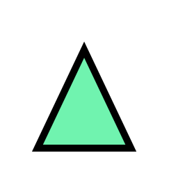|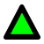|[Nearest](../viewer/style/button_text.less#L69)|Show nearest target|
|[AisNearest](../viewer/components/ButtonDefs.ts#L108)|[components/AisInfoDisplay.tsx](../viewer/components/AisInfoDisplay.tsx#L233)|||||
|[__AisSearch__](../viewer/components/ButtonDefs.ts#L120)|[gui/AisPageButtons.ts](../viewer/gui/AisPageButtons.ts#L45)|[Search](../viewer/style/icons.less#L323)|||[Search](../viewer/style/button_text.less#L78)|Search AIS targets|
|[__AisSort__](../viewer/components/ButtonDefs.ts#L112)|[gui/AisPageButtons.ts](../viewer/gui/AisPageButtons.ts#L34)|[Sort](../viewer/style/icons.less#L341)|||[Sort](../viewer/style/button_text.less#L72)|Sort AIS targets|
|[__AnchorWatch__](../viewer/components/ButtonDefs.ts#L237)|[components/AnchorWatchDialog.jsx](../viewer/components/AnchorWatchDialog.jsx#L181)|[Anchor](../viewer/style/icons.less#L23)|||[Anchor](../viewer/style/button_text.less#L165)|Anchor watch|
|[__AndroidBrowser__](../viewer/components/ButtonDefs.ts#L379)|[gui/ServerPageButtons.ts](../viewer/gui/ServerPageButtons.ts#L55)|[Browser](../viewer/style/icons.less#L41)|||[Browser](../viewer/style/button_text.less#L271)|Start external browser|
|[__Back__](../viewer/components/ButtonDefs.ts#L61)|[gui/AddOnPageButtons.ts](../viewer/gui/AddOnPageButtons.ts#L30)|[Back](../viewer/style/icons.less#L32)|||[Back](../viewer/style/button_text.less#L52)|Back|
|[__Cancel__](../viewer/components/ButtonDefs.ts#L39)|[gui/EditRoutePage.tsx](../viewer/gui/EditRoutePage.tsx#L616)|[Cancel](../viewer/style/icons.less#L44)|||[Close](../viewer/style/button_text.less#L16)|Close page|
|[Cancel](../viewer/components/ButtonDefs.ts#L39)|[gui/GpsPageButtons.ts](../viewer/gui/GpsPageButtons.ts#L50)|||||
|[Cancel](../viewer/components/ButtonDefs.ts#L39)|[gui/NavPage.tsx](../viewer/gui/NavPage.tsx#L266)|||||
|[Cancel](../viewer/components/ButtonDefs.ts#L39)|[gui/NavPage.tsx](../viewer/gui/NavPage.tsx#L428)|||||
|[Cancel](../viewer/components/ButtonDefs.ts#L39)|[gui/GeneralButtons.ts](../viewer/gui/GeneralButtons.ts#L35)|||||
|[Cancel](../viewer/components/ButtonDefs.ts#L39)|[components/UploadHandler.tsx](../viewer/components/UploadHandler.tsx#L313)|||||
|[Cancel](../viewer/components/ButtonDefs.ts#L39)|[components/AnchorWatchDialog.jsx](../viewer/components/AnchorWatchDialog.jsx#L115)|||||
|[__CenterAction__](../viewer/components/ButtonDefs.ts#L233)|[components/FeatureInfoDialog.jsx](../viewer/components/FeatureInfoDialog.jsx#L388)|[CenterAction](../viewer/style/icons.less#L50)|||[Info](../viewer/style/button_text.less#L162)|Info at Crosshair|
|[__ChartsView__](../viewer/components/ButtonDefs.ts#L142)|[gui/ChartsPageButtons.ts](../viewer/gui/ChartsPageButtons.ts#L37)|[Charts](../viewer/style/icons.less#L56)|||[Charts](../viewer/style/button_text.less#L95)|Select & upload charts|
|[__Connected__](../viewer/components/ButtonDefs.ts#L350)|[gui/GeneralButtons.ts](../viewer/gui/GeneralButtons.ts#L41)|[Connected](../viewer/style/icons.less#L65)|||[Connect](../viewer/style/button_text.less#L249)|Connect to server|
|[__CourseUp__](../viewer/components/ButtonDefs.ts#L255)|[gui/NavPage.tsx](../viewer/gui/NavPage.tsx#L916)|[CourseUp](../viewer/style/icons.less#L71)|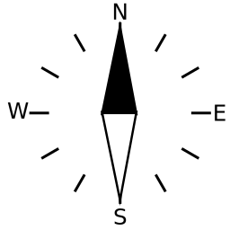||[Course](../viewer/style/button_text.less#L177)|Course up / north up|
|[CourseUp](../viewer/components/ButtonDefs.ts#L255)|[gui/NavPageButtons.ts](../viewer/gui/NavPageButtons.ts#L81)|||||
|[__CreateFile__](../viewer/components/ButtonDefs.ts#L471)|[components/DownloadItemList.tsx](../viewer/components/DownloadItemList.tsx#L287)|[Plus](../viewer/style/icons.less#L275)|||[New](../viewer/style/button_text.less#L342)|Create file|
|[__DBAccept__](../viewer/components/ButtonDefs.ts#L639)|[components/EulaDialog.jsx](../viewer/components/EulaDialog.jsx#L31)|[Ok](../viewer/style/icons.less#L260)|||[Accept](../viewer/style/button_text.less#L478)||
|[__DBActivate__](../viewer/components/ButtonDefs.ts#L719)|[components/FileDialog.jsx](../viewer/components/FileDialog.jsx#L1566)|[Open](../viewer/style/icons.less#L263)|||[Activate](../viewer/style/button_text.less#L530)||
|[DBActivate](../viewer/components/ButtonDefs.ts#L719)|[components/FileDialog.jsx](../viewer/components/FileDialog.jsx#L1644)|||||
|[__DBAdd__](../viewer/components/ButtonDefs.ts#L508)|[gui/NavPage.tsx](../viewer/gui/NavPage.tsx#L238)|[Plus](../viewer/style/icons.less#L275)|||[Add](../viewer/style/button_text.less#L371)||
|[__DBAddSub__](../viewer/components/ButtonDefs.ts#L612)|[components/CombinedWidget.jsx](../viewer/components/CombinedWidget.jsx#L107)|[Plus](../viewer/style/icons.less#L275)|||[+Sub](../viewer/style/button_text.less#L457)||
|[__DBAfter__](../viewer/components/ButtonDefs.ts#L626)|[components/EditWidgetDialog.jsx](../viewer/components/EditWidgetDialog.jsx#L190)|[After](../viewer/style/icons.less#L14)|||[After](../viewer/style/button_text.less#L468)||
|[__DBAnchorBoat__](../viewer/components/ButtonDefs.ts#L568)|[components/AnchorWatchDialog.jsx](../viewer/components/AnchorWatchDialog.jsx#L93)|[Boat](../viewer/style/icons.less#L38)|||[Boat](../viewer/style/button_text.less#L436)|at boat pos|
|[__DBAnchorCenter__](../viewer/components/ButtonDefs.ts#L572)|[components/AnchorWatchDialog.jsx](../viewer/components/AnchorWatchDialog.jsx#L97)|[Center](../viewer/style/icons.less#L47)|||[Center](../viewer/style/button_text.less#L439)|at map center|
|[__DBAutoReload__](../viewer/components/ButtonDefs.ts#L671)|[components/LogDialog.tsx](../viewer/components/LogDialog.tsx#L78)|[Reload](../viewer/style/icons.less#L290)|||[Auto](../viewer/style/button_text.less#L502)||
|[__DBBefore__](../viewer/components/ButtonDefs.ts#L622)|[components/EditWidgetDialog.jsx](../viewer/components/EditWidgetDialog.jsx#L189)|[Before](../viewer/style/icons.less#L35)|||[Before](../viewer/style/button_text.less#L465)||
|[__DBCancel__](../viewer/components/ButtonDefs.ts#L484)|[gui/EditRoutePage.tsx](../viewer/gui/EditRoutePage.tsx#L541)|[Cancel](../viewer/style/icons.less#L44)|||[Cancel](../viewer/style/button_text.less#L353)||
|[DBCancel](../viewer/components/ButtonDefs.ts#L484)|[gui/NavPage.tsx](../viewer/gui/NavPage.tsx#L250)|||||
|[DBCancel](../viewer/components/ButtonDefs.ts#L484)|[components/EditHandlerDialog.jsx](../viewer/components/EditHandlerDialog.jsx#L180)|||||
|[DBCancel](../viewer/components/ButtonDefs.ts#L484)|[components/ImporterView.tsx](../viewer/components/ImporterView.tsx#L242)|||||
|[DBCancel](../viewer/components/ButtonDefs.ts#L484)|[components/ImporterView.tsx](../viewer/components/ImporterView.tsx#L329)|||||
|[DBCancel](../viewer/components/ButtonDefs.ts#L484)|[components/OverlayDialog.tsx](../viewer/components/OverlayDialog.tsx#L366)|||||
|[DBCancel](../viewer/components/ButtonDefs.ts#L484)|[components/EditOverlaysDialog.jsx](../viewer/components/EditOverlaysDialog.jsx#L274)|||||
|[DBCancel](../viewer/components/ButtonDefs.ts#L484)|[components/EditOverlaysDialog.jsx](../viewer/components/EditOverlaysDialog.jsx#L759)|||||
|[DBCancel](../viewer/components/ButtonDefs.ts#L484)|[components/EulaDialog.jsx](../viewer/components/EulaDialog.jsx#L30)|||||
|[DBCancel](../viewer/components/ButtonDefs.ts#L484)|[components/ImportDialog.jsx](../viewer/components/ImportDialog.jsx#L80)|||||
|[DBCancel](../viewer/components/ButtonDefs.ts#L484)|[components/FileDialog.jsx](../viewer/components/FileDialog.jsx#L2112)|||||
|[DBCancel](../viewer/components/ButtonDefs.ts#L484)|[components/FileDialog.jsx](../viewer/components/FileDialog.jsx#L2182)|||||
|[DBCancel](../viewer/components/ButtonDefs.ts#L484)|[components/WaypointDialog.jsx](../viewer/components/WaypointDialog.jsx#L135)|||||
|[DBCancel](../viewer/components/ButtonDefs.ts#L484)|[components/ColorDialog.jsx](../viewer/components/ColorDialog.jsx#L51)|||||
|[DBCancel](../viewer/components/ButtonDefs.ts#L484)|[components/TrackConvertDialog.jsx](../viewer/components/TrackConvertDialog.jsx#L453)|||||
|[DBCancel](../viewer/components/ButtonDefs.ts#L484)|[components/RemoteChannelDialog.tsx](../viewer/components/RemoteChannelDialog.tsx#L58)|||||
|[DBCancel](../viewer/components/ButtonDefs.ts#L484)|[components/LayoutFinishedDialog.jsx](../viewer/components/LayoutFinishedDialog.jsx#L62)|||||
|[DBCancel](../viewer/components/ButtonDefs.ts#L484)|[components/EditWidgetDialog.jsx](../viewer/components/EditWidgetDialog.jsx#L199)|||||
|[DBCancel](../viewer/components/ButtonDefs.ts#L484)|[components/FeatureInfoDialog.jsx](../viewer/components/FeatureInfoDialog.jsx#L325)|||||
|[DBCancel](../viewer/components/ButtonDefs.ts#L484)|[components/BasicDialogs.tsx](../viewer/components/BasicDialogs.tsx#L106)|||||
|[DBCancel](../viewer/components/ButtonDefs.ts#L484)|[components/BasicDialogs.tsx](../viewer/components/BasicDialogs.tsx#L189)|||||
|[DBCancel](../viewer/components/ButtonDefs.ts#L484)|[components/EditPageDialog.tsx](../viewer/components/EditPageDialog.tsx#L177)|||||
|[__DBCenter__](../viewer/components/ButtonDefs.ts#L737)|[gui/NavPage.tsx](../viewer/gui/NavPage.tsx#L139)|[Center](../viewer/style/icons.less#L47)|||[Center](../viewer/style/button_text.less#L544)||
|[DBCenter](../viewer/components/ButtonDefs.ts#L737)|[gui/NavPage.tsx](../viewer/gui/NavPage.tsx#L759)|||||
|[__DBCleanTrack__](../viewer/components/ButtonDefs.ts#L745)|[gui/NavPage.tsx](../viewer/gui/NavPage.tsx#L807)|[Delete](../viewer/style/icons.less#L77)|||[Clean track](../viewer/style/button_text.less#L547)||
|[__DBClear__](../viewer/components/ButtonDefs.ts#L581)|[components/BasicDialogs.tsx](../viewer/components/BasicDialogs.tsx#L187)|[Delete](../viewer/style/icons.less#L77)|||[Clear](../viewer/style/button_text.less#L392)||
|[DBClear](../viewer/components/ButtonDefs.ts#L581)|[components/ItemNameDialog.jsx](../viewer/components/ItemNameDialog.jsx#L123)|||||
|[__DBCompute__](../viewer/components/ButtonDefs.ts#L690)|[components/TrackConvertDialog.jsx](../viewer/components/TrackConvertDialog.jsx#L446)|[Start](../viewer/style/icons.less#L350)|||[Compute](../viewer/style/button_text.less#L514)||
|[__DBConfig__](../viewer/components/ButtonDefs.ts#L715)|[components/FileDialog.jsx](../viewer/components/FileDialog.jsx#L677)|[Edit](../viewer/style/icons.less#L92)|||[Config](../viewer/style/button_text.less#L527)||
|[__DBConnect__](../viewer/components/ButtonDefs.ts#L680)|[components/RemoteChannelDialog.tsx](../viewer/components/RemoteChannelDialog.tsx#L53)|[Connect](../viewer/style/icons.less#L62)|||[Connect](../viewer/style/button_text.less#L380)||
|[__DBCopy__](../viewer/components/ButtonDefs.ts#L707)|[components/FileDialog.jsx](../viewer/components/FileDialog.jsx#L607)|[Copy](../viewer/style/icons.less#L68)|||[Copy](../viewer/style/button_text.less#L398)||
|[__DBCurrent__](../viewer/components/ButtonDefs.ts#L728)|[gui/NavPage.tsx](../viewer/gui/NavPage.tsx#L133)|[Boat](../viewer/style/icons.less#L38)|||[Current](../viewer/style/button_text.less#L537)||
|[__DBDelete__](../viewer/components/ButtonDefs.ts#L496)|[gui/EditRoutePage.tsx](../viewer/gui/EditRoutePage.tsx#L508)|[Delete](../viewer/style/icons.less#L77)|||[Delete](../viewer/style/button_text.less#L362)||
|[DBDelete](../viewer/components/ButtonDefs.ts#L496)|[components/EditHandlerDialog.jsx](../viewer/components/EditHandlerDialog.jsx#L173)|||||
|[DBDelete](../viewer/components/ButtonDefs.ts#L496)|[components/ImporterView.tsx](../viewer/components/ImporterView.tsx#L153)|||||
|[DBDelete](../viewer/components/ButtonDefs.ts#L496)|[components/EditOverlaysDialog.jsx](../viewer/components/EditOverlaysDialog.jsx#L736)|||||
|[DBDelete](../viewer/components/ButtonDefs.ts#L496)|[components/FileDialog.jsx](../viewer/components/FileDialog.jsx#L566)|||||
|[DBDelete](../viewer/components/ButtonDefs.ts#L496)|[components/FileDialog.jsx](../viewer/components/FileDialog.jsx#L1717)|||||
|[DBDelete](../viewer/components/ButtonDefs.ts#L496)|[components/WaypointDialog.jsx](../viewer/components/WaypointDialog.jsx#L126)|||||
|[DBDelete](../viewer/components/ButtonDefs.ts#L496)|[components/UserAppDialog.tsx](../viewer/components/UserAppDialog.tsx#L468)|||||
|[DBDelete](../viewer/components/ButtonDefs.ts#L496)|[components/EditWidgetDialog.jsx](../viewer/components/EditWidgetDialog.jsx#L196)|||||
|[__DBDisable__](../viewer/components/ButtonDefs.ts#L520)|[components/ImporterView.tsx](../viewer/components/ImporterView.tsx#L168)|[Disable](../viewer/style/icons.less#L83)|||[Disable](../viewer/style/button_text.less#L413)||
|[__DBDiscard__](../viewer/components/ButtonDefs.ts#L666)|[components/LayoutFinishedDialog.jsx](../viewer/components/LayoutFinishedDialog.jsx#L61)|[Delete](../viewer/style/icons.less#L77)|||[Discard changes](../viewer/style/button_text.less#L499)||
|[__DBDisconnect__](../viewer/components/ButtonDefs.ts#L676)|[components/RemoteChannelDialog.tsx](../viewer/components/RemoteChannelDialog.tsx#L48)|[Disconnect](../viewer/style/icons.less#L86)|||[Disconnect](../viewer/style/button_text.less#L506)||
|[__DBDownload__](../viewer/components/ButtonDefs.ts#L488)|[components/FileDialog.jsx](../viewer/components/FileDialog.jsx#L661)|[Download](../viewer/style/icons.less#L89)|||[Download](../viewer/style/button_text.less#L356)||
|[DBDownload](../viewer/components/ButtonDefs.ts#L488)|[components/DownloadButton.tsx](../viewer/components/DownloadButton.tsx#L107)|||||
|[__DBEditCss__](../viewer/components/ButtonDefs.ts#L662)|[components/LayoutFinishedDialog.jsx](../viewer/components/LayoutFinishedDialog.jsx#L60)|[Edit](../viewer/style/icons.less#L92)|||[Edit CSS](../viewer/style/button_text.less#L496)||
|[__DBEditLayout__](../viewer/components/ButtonDefs.ts#L685)|[components/Settings.tsx](../viewer/components/Settings.tsx#L536)|[Layout](../viewer/style/icons.less#L152)|||[Edit](../viewer/style/button_text.less#L510)||
|[DBEditLayout](../viewer/components/ButtonDefs.ts#L685)|[components/FileDialog.jsx](../viewer/components/FileDialog.jsx#L1579)|||||
|[__DBEditRoute__](../viewer/components/ButtonDefs.ts#L741)|[gui/NavPage.tsx](../viewer/gui/NavPage.tsx#L780)|[Route](../viewer/style/icons.less#L305)|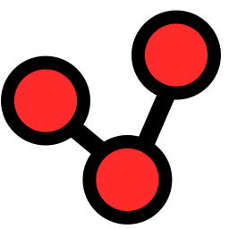|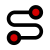|[Edit](../viewer/style/button_text.less#L339)|Edit item|
|[DBEditRoute](../viewer/components/ButtonDefs.ts#L741)|[gui/NavPage.tsx](../viewer/gui/NavPage.tsx#L797)|||||
|[__DBEmptyRoute__](../viewer/components/ButtonDefs.ts#L527)|[gui/EditRoutePage.tsx](../viewer/gui/EditRoutePage.tsx#L193)|[EmptyRoute](../viewer/style/icons.less#L98)||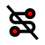|[Empty](../viewer/style/button_text.less#L417)||
|[__DBFeatureNewRoute__](../viewer/components/ButtonDefs.ts#L733)|[gui/NavPage.tsx](../viewer/gui/NavPage.tsx#L519)|[Route](../viewer/style/icons.less#L305)|||[New route](../viewer/style/button_text.less#L541)||
|[__DBHide__](../viewer/components/ButtonDefs.ts#L753)|[components/FeatureInfoDialog.jsx](../viewer/components/FeatureInfoDialog.jsx#L346)|[Hide](../viewer/style/icons.less#L110)|||[Hide](../viewer/style/button_text.less#L553)||
|[__DBHideAllOverlays__](../viewer/components/ButtonDefs.ts#L599)|[components/EditOverlaysDialog.jsx](../viewer/components/EditOverlaysDialog.jsx#L731)|[HideOverlays](../viewer/style/icons.less#L113)|||[Hide all](../viewer/style/button_text.less#L453)||
|[__DBHideOverlays__](../viewer/components/ButtonDefs.ts#L590)|[components/MapPage.tsx](../viewer/components/MapPage.tsx#L390)|[HideOverlays](../viewer/style/icons.less#L113)|||[Hide overlays](../viewer/style/button_text.less#L446)||
|[__DBIgnore__](../viewer/components/ButtonDefs.ts#L524)|[components/Settings.tsx](../viewer/components/Settings.tsx#L722)||||[Ignore](../viewer/style/button_text.less#L383)||
|[DBIgnore](../viewer/components/ButtonDefs.ts#L524)|[components/TitleIcons.tsx](../viewer/components/TitleIcons.tsx#L97)|||||
|[__DBInfo__](../viewer/components/ButtonDefs.ts#L749)|[components/FeatureInfoDialog.jsx](../viewer/components/FeatureInfoDialog.jsx#L364)|[Info](../viewer/style/icons.less#L140)|||[Info](../viewer/style/button_text.less#L550)||
|[__DBInsert__](../viewer/components/ButtonDefs.ts#L630)|[components/EditWidgetDialog.jsx](../viewer/components/EditWidgetDialog.jsx#L191)|[After](../viewer/style/icons.less#L14)|||[Insert](../viewer/style/button_text.less#L471)||
|[__DBInsertAfter__](../viewer/components/ButtonDefs.ts#L607)|[components/EditOverlaysDialog.jsx](../viewer/components/EditOverlaysDialog.jsx#L751)|[After](../viewer/style/icons.less#L14)|||[Insert after](../viewer/style/button_text.less#L407)||
|[__DBInsertBefore__](../viewer/components/ButtonDefs.ts#L603)|[components/EditOverlaysDialog.jsx](../viewer/components/EditOverlaysDialog.jsx#L750)|[Before](../viewer/style/icons.less#L35)|||[Insert before](../viewer/style/button_text.less#L404)||
|[__DBInsertRouteAfter__](../viewer/components/ButtonDefs.ts#L761)|[gui/EditRoutePage.tsx](../viewer/gui/EditRoutePage.tsx#L927)|[NavAddAfter](../viewer/style/icons.less#L203)|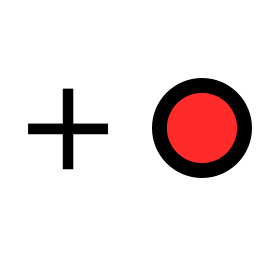||[Route after](../viewer/style/button_text.less#L559)||
|[__DBInsertRouteBefore__](../viewer/components/ButtonDefs.ts#L757)|[gui/EditRoutePage.tsx](../viewer/gui/EditRoutePage.tsx#L916)|[NavAdd](../viewer/style/icons.less#L200)|||[Route before](../viewer/style/button_text.less#L556)||
|[__DBInvertRoute__](../viewer/components/ButtonDefs.ts#L531)|[gui/EditRoutePage.tsx](../viewer/gui/EditRoutePage.tsx#L206)|[InvertRoute](../viewer/style/icons.less#L143)|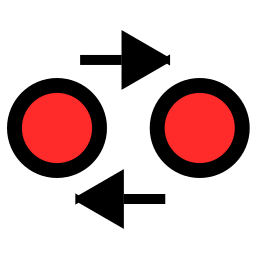||[Invert](../viewer/style/button_text.less#L420)||
|[__DBLoadRoute__](../viewer/components/ButtonDefs.ts#L543)|[gui/EditRoutePage.tsx](../viewer/gui/EditRoutePage.tsx#L464)|[Open](../viewer/style/icons.less#L263)|||[Load](../viewer/style/button_text.less#L429)||
|[__DBLog__](../viewer/components/ButtonDefs.ts#L652)|[components/ImporterView.tsx](../viewer/components/ImporterView.tsx#L224)|[Log](../viewer/style/icons.less#L167)|||[Log](../viewer/style/button_text.less#L488)||
|[DBLog](../viewer/components/ButtonDefs.ts#L652)|[components/FileDialog.jsx](../viewer/components/FileDialog.jsx#L1026)|||||
|[__DBNew__](../viewer/components/ButtonDefs.ts#L512)|[components/UserAppDialog.tsx](../viewer/components/UserAppDialog.tsx#L123)|[Plus](../viewer/style/icons.less#L275)|||[New](../viewer/style/button_text.less#L395)||
|[DBNew](../viewer/components/ButtonDefs.ts#L512)|[components/UserAppDialog.tsx](../viewer/components/UserAppDialog.tsx#L217)|||||
|[__DBNewRoute__](../viewer/components/ButtonDefs.ts#L539)|[gui/EditRoutePage.tsx](../viewer/gui/EditRoutePage.tsx#L453)|[Plus](../viewer/style/icons.less#L275)|||[New](../viewer/style/button_text.less#L426)||
|[__DBOk__](../viewer/components/ButtonDefs.ts#L480)|[gui/EditRoutePage.tsx](../viewer/gui/EditRoutePage.tsx#L542)|[Ok](../viewer/style/icons.less#L260)|||[Ok](../viewer/style/button_text.less#L350)||
|[DBOk](../viewer/components/ButtonDefs.ts#L480)|[components/EditHandlerDialog.jsx](../viewer/components/EditHandlerDialog.jsx#L181)|||||
|[DBOk](../viewer/components/ButtonDefs.ts#L480)|[components/OverlayDialog.tsx](../viewer/components/OverlayDialog.tsx#L369)|||||
|[DBOk](../viewer/components/ButtonDefs.ts#L480)|[components/EditOverlaysDialog.jsx](../viewer/components/EditOverlaysDialog.jsx#L277)|||||
|[DBOk](../viewer/components/ButtonDefs.ts#L480)|[components/EditOverlaysDialog.jsx](../viewer/components/EditOverlaysDialog.jsx#L656)|||||
|[DBOk](../viewer/components/ButtonDefs.ts#L480)|[components/ImportDialog.jsx](../viewer/components/ImportDialog.jsx#L81)|||||
|[DBOk](../viewer/components/ButtonDefs.ts#L480)|[components/FileDialog.jsx](../viewer/components/FileDialog.jsx#L2115)|||||
|[DBOk](../viewer/components/ButtonDefs.ts#L480)|[components/LogDialog.tsx](../viewer/components/LogDialog.tsx#L96)|||||
|[DBOk](../viewer/components/ButtonDefs.ts#L480)|[components/WaypointDialog.jsx](../viewer/components/WaypointDialog.jsx#L136)|||||
|[DBOk](../viewer/components/ButtonDefs.ts#L480)|[components/ColorDialog.jsx](../viewer/components/ColorDialog.jsx#L52)|||||
|[DBOk](../viewer/components/ButtonDefs.ts#L480)|[components/LayoutFinishedDialog.jsx](../viewer/components/LayoutFinishedDialog.jsx#L63)|||||
|[DBOk](../viewer/components/ButtonDefs.ts#L480)|[components/BasicDialogs.tsx](../viewer/components/BasicDialogs.tsx#L190)|||||
|[DBOk](../viewer/components/ButtonDefs.ts#L480)|[components/EditPageDialog.tsx](../viewer/components/EditPageDialog.tsx#L178)|||||
|[__DBOpenChart__](../viewer/components/ButtonDefs.ts#L695)|[components/FileDialog.jsx](../viewer/components/FileDialog.jsx#L979)|[Charts](../viewer/style/icons.less#L56)|||[Open](../viewer/style/button_text.less#L518)||
|[__DBOverlays__](../viewer/components/ButtonDefs.ts#L703)|[components/FileDialog.jsx](../viewer/components/FileDialog.jsx#L710)|[Overlays](../viewer/style/icons.less#L269)|||[Overlays](../viewer/style/button_text.less#L524)||
|[DBOverlays](../viewer/components/ButtonDefs.ts#L703)|[components/FileDialog.jsx](../viewer/components/FileDialog.jsx#L1018)|||||
|[__DBPreview__](../viewer/components/ButtonDefs.ts#L617)|[components/EditDialog.tsx](../viewer/components/EditDialog.tsx#L79)|[View](../viewer/style/icons.less#L380)|||[Preview](../viewer/style/button_text.less#L461)||
|[__DBPropose__](../viewer/components/ButtonDefs.ts#L657)|[components/ItemNameDialog.jsx](../viewer/components/ItemNameDialog.jsx#L138)|[Propose](../viewer/style/icons.less#L278)|||[Propose](../viewer/style/button_text.less#L492)|Propose new name|
|[__DBReload__](../viewer/components/ButtonDefs.ts#L516)|[components/ImporterView.tsx](../viewer/components/ImporterView.tsx#L315)|[Reload](../viewer/style/icons.less#L290)|||[Reload](../viewer/style/button_text.less#L410)||
|[DBReload](../viewer/components/ButtonDefs.ts#L516)|[components/LogDialog.tsx](../viewer/components/LogDialog.tsx#L93)|||||
|[DBReload](../viewer/components/ButtonDefs.ts#L516)|[components/ErrorListDialog.jsx](../viewer/components/ErrorListDialog.jsx#L39)|||||
|[__DBRename__](../viewer/components/ButtonDefs.ts#L492)|[gui/EditRoutePage.tsx](../viewer/gui/EditRoutePage.tsx#L473)|[Edit](../viewer/style/icons.less#L92)|||[Rename](../viewer/style/button_text.less#L359)||
|[DBRename](../viewer/components/ButtonDefs.ts#L492)|[components/FileDialog.jsx](../viewer/components/FileDialog.jsx#L582)|||||
|[__DBRenumberRoute__](../viewer/components/ButtonDefs.ts#L535)|[gui/EditRoutePage.tsx](../viewer/gui/EditRoutePage.tsx#L218)|[RenumberRoute](../viewer/style/icons.less#L296)|||[Renumber](../viewer/style/button_text.less#L423)||
|[__DBReset__](../viewer/components/ButtonDefs.ts#L577)|[components/Settings.tsx](../viewer/components/Settings.tsx#L372)|[Reset](../viewer/style/icons.less#L299)|||[Reset](../viewer/style/button_text.less#L389)||
|[DBReset](../viewer/components/ButtonDefs.ts#L577)|[components/EditOverlaysDialog.jsx](../viewer/components/EditOverlaysDialog.jsx#L755)|||||
|[DBReset](../viewer/components/ButtonDefs.ts#L577)|[components/ColorDialog.jsx](../viewer/components/ColorDialog.jsx#L48)|||||
|[DBReset](../viewer/components/ButtonDefs.ts#L577)|[components/BasicDialogs.tsx](../viewer/components/BasicDialogs.tsx#L102)|||||
|[__DBRestart__](../viewer/components/ButtonDefs.ts#L648)|[components/ImporterView.tsx](../viewer/components/ImporterView.tsx#L198)|[Reload](../viewer/style/icons.less#L290)|||[Restart](../viewer/style/button_text.less#L485)||
|[__DBRoutePoints__](../viewer/components/ButtonDefs.ts#L547)|[gui/EditRoutePage.tsx](../viewer/gui/EditRoutePage.tsx#L482)|[Route](../viewer/style/icons.less#L305)|||[Points](../viewer/style/button_text.less#L432)||
|[__DBSave__](../viewer/components/ButtonDefs.ts#L504)|[components/EditDialog.tsx](../viewer/components/EditDialog.tsx#L90)|[Save](../viewer/style/icons.less#L317)|||[Save](../viewer/style/button_text.less#L368)||
|[DBSave](../viewer/components/ButtonDefs.ts#L504)|[components/EditOverlaysDialog.jsx](../viewer/components/EditOverlaysDialog.jsx#L656)|||||
|[DBSave](../viewer/components/ButtonDefs.ts#L504)|[components/TrackConvertDialog.jsx](../viewer/components/TrackConvertDialog.jsx#L454)|||||
|[__DBSaveAs__](../viewer/components/ButtonDefs.ts#L500)|[gui/EditRoutePage.tsx](../viewer/gui/EditRoutePage.tsx#L525)|[SaveAs](../viewer/style/icons.less#L320)|||[Save as](../viewer/style/button_text.less#L365)||
|[__DBScheme__](../viewer/components/ButtonDefs.ts#L699)|[components/FileDialog.jsx](../viewer/components/FileDialog.jsx#L991)|[ChartScheme](../viewer/style/icons.less#L53)|||[Scheme](../viewer/style/button_text.less#L521)||
|[__DBShowAllOverlays__](../viewer/components/ButtonDefs.ts#L595)|[components/EditOverlaysDialog.jsx](../viewer/components/EditOverlaysDialog.jsx#L727)|[Overlays](../viewer/style/icons.less#L269)|||[Show all](../viewer/style/button_text.less#L450)||
|[__DBShowOverlays__](../viewer/components/ButtonDefs.ts#L586)|[components/MapPage.tsx](../viewer/components/MapPage.tsx#L383)|[Overlays](../viewer/style/icons.less#L269)|||[Show overlays](../viewer/style/button_text.less#L443)||
|[__DBStartRoute__](../viewer/components/ButtonDefs.ts#L765)|[gui/NavPage.tsx](../viewer/gui/NavPage.tsx#L747)|[NavGoto](../viewer/style/icons.less#L209)|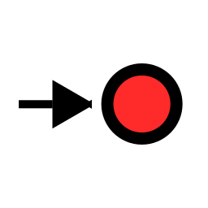||[Start route](../viewer/style/button_text.less#L562)||
|[__DBStop__](../viewer/components/ButtonDefs.ts#L644)|[components/ImporterView.tsx](../viewer/components/ImporterView.tsx#L183)|[Stop](../viewer/style/icons.less#L359)|||[Stop](../viewer/style/button_text.less#L482)||
|[__DBUpdate__](../viewer/components/ButtonDefs.ts#L634)|[components/EditWidgetDialog.jsx](../viewer/components/EditWidgetDialog.jsx#L201)|[Ok](../viewer/style/icons.less#L260)|||[Update](../viewer/style/button_text.less#L474)||
|[__DBUserApp__](../viewer/components/ButtonDefs.ts#L723)|[components/FileDialog.jsx](../viewer/components/FileDialog.jsx#L1750)|[AddOns](../viewer/style/icons.less#L8)|||[User App](../viewer/style/button_text.less#L533)||
|[__DBView__](../viewer/components/ButtonDefs.ts#L711)|[components/FileDialog.jsx](../viewer/components/FileDialog.jsx#L646)|[View](../viewer/style/icons.less#L380)|||[View](../viewer/style/button_text.less#L401)||
|[__DBWpaConnect__](../viewer/components/ButtonDefs.ts#L563)|[gui/WpaPage.jsx](../viewer/gui/WpaPage.jsx#L110)|[WpaConnect](../viewer/style/icons.less#L410)|||[Connect](../viewer/style/button_text.less#L380)||
|[__DBWpaDisable__](../viewer/components/ButtonDefs.ts#L559)|[gui/WpaPage.jsx](../viewer/gui/WpaPage.jsx#L103)|[WifiOff](../viewer/style/icons.less#L389)|||[Disable](../viewer/style/button_text.less#L413)||
|[__DBWpaEnable__](../viewer/components/ButtonDefs.ts#L555)|[gui/WpaPage.jsx](../viewer/gui/WpaPage.jsx#L96)|[Wifi](../viewer/style/icons.less#L386)|||[Enable](../viewer/style/button_text.less#L374)||
|[__DBWpaRemove__](../viewer/components/ButtonDefs.ts#L551)|[gui/WpaPage.jsx](../viewer/gui/WpaPage.jsx#L89)|[Delete](../viewer/style/icons.less#L77)|||[Remove](../viewer/style/button_text.less#L386)||
|[__DefaultValue__](../viewer/components/ButtonDefs.ts#L463)|[components/EditableParameterUI.jsx](../viewer/components/EditableParameterUI.jsx#L109)|[Reset](../viewer/style/icons.less#L299)|||[Default](../viewer/style/button_text.less#L336)|Default value|
|[__Dim__](../viewer/components/ButtonDefs.ts#L78)|[util/dimhandler.ts](../viewer/util/dimhandler.ts#L166)|[Dim](../viewer/style/icons.less#L80)|||[Dim](../viewer/style/button_text.less#L65)|Dim backlight|
|[__Edit__](../viewer/components/ButtonDefs.ts#L467)|[components/EditOverlaysDialog.jsx](../viewer/components/EditOverlaysDialog.jsx#L355)|[Edit](../viewer/style/icons.less#L92)|||[Edit](../viewer/style/button_text.less#L339)|Edit item|
|[Edit](../viewer/components/ButtonDefs.ts#L467)|[components/EditOverlaysDialog.jsx](../viewer/components/EditOverlaysDialog.jsx#L738)|||||
|[Edit](../viewer/components/ButtonDefs.ts#L467)|[components/FileDialog.jsx](../viewer/components/FileDialog.jsx#L695)|||||
|[Edit](../viewer/components/ButtonDefs.ts#L467)|[components/UserAppDialog.tsx](../viewer/components/UserAppDialog.tsx#L435)|||||
|[Edit](../viewer/components/ButtonDefs.ts#L467)|[components/StatusItems.tsx](../viewer/components/StatusItems.tsx#L48)|||||
|[__EditLayout__](../viewer/components/ButtonDefs.ts#L438)|[gui/LayoutsPageButtons.ts](../viewer/gui/LayoutsPageButtons.ts#L29)|[Layout](../viewer/style/icons.less#L152)|||[Edit](../viewer/style/button_text.less#L316)|Edit layout|
|[__EditPage__](../viewer/components/ButtonDefs.ts#L442)|[components/EditPageDialog.tsx](../viewer/components/EditPageDialog.tsx#L217)|[EditPage](../viewer/style/icons.less#L95)|||[Config](../viewer/style/button_text.less#L319)|Page layout config|
|[__FullScreen__](../viewer/components/ButtonDefs.ts#L91)|[util/Fullscreen.ts](../viewer/util/Fullscreen.ts#L84)|[FullScreen](../viewer/style/icons.less#L104)|||[Full](../viewer/style/button_text.less#L26)|Full screen|
|[__Gps1__](../viewer/components/ButtonDefs.ts#L296)|[gui/GpsPageButtons.ts](../viewer/gui/GpsPageButtons.ts#L34)|[Num1](../viewer/style/icons.less#L230)|||[Dash 1](../viewer/style/button_text.less#L208)|Dashboard 1|
|[__Gps10__](../viewer/components/ButtonDefs.ts#L332)|[gui/GpsPageButtons.ts](../viewer/gui/GpsPageButtons.ts#L43)|[Num10](../viewer/style/icons.less#L233)|||[Dash 10](../viewer/style/button_text.less#L235)|Dashboard 10|
|[__Gps2__](../viewer/components/ButtonDefs.ts#L300)|[gui/GpsPageButtons.ts](../viewer/gui/GpsPageButtons.ts#L35)|[Num2](../viewer/style/icons.less#L236)|||[Dash 2](../viewer/style/button_text.less#L211)|Dashboard 2|
|[__Gps3__](../viewer/components/ButtonDefs.ts#L304)|[gui/GpsPageButtons.ts](../viewer/gui/GpsPageButtons.ts#L36)|[Num3](../viewer/style/icons.less#L239)|||[Dash 3](../viewer/style/button_text.less#L214)|Dashboard 3|
|[__Gps4__](../viewer/components/ButtonDefs.ts#L308)|[gui/GpsPageButtons.ts](../viewer/gui/GpsPageButtons.ts#L37)|[Num4](../viewer/style/icons.less#L242)|||[Dash 4](../viewer/style/button_text.less#L217)|Dashboard 4|
|[__Gps5__](../viewer/components/ButtonDefs.ts#L312)|[gui/GpsPageButtons.ts](../viewer/gui/GpsPageButtons.ts#L38)|[Num5](../viewer/style/icons.less#L245)|||[Dash 5](../viewer/style/button_text.less#L220)|Dashboard 5|
|[__Gps6__](../viewer/components/ButtonDefs.ts#L316)|[gui/GpsPageButtons.ts](../viewer/gui/GpsPageButtons.ts#L39)|[Num6](../viewer/style/icons.less#L248)|||[Dash 6](../viewer/style/button_text.less#L223)|Dashboard 6|
|[__Gps7__](../viewer/components/ButtonDefs.ts#L320)|[gui/GpsPageButtons.ts](../viewer/gui/GpsPageButtons.ts#L40)|[Num7](../viewer/style/icons.less#L251)|||[Dash 7](../viewer/style/button_text.less#L226)|Dashboard 7|
|[__Gps8__](../viewer/components/ButtonDefs.ts#L324)|[gui/GpsPageButtons.ts](../viewer/gui/GpsPageButtons.ts#L41)|[Num8](../viewer/style/icons.less#L254)|||[Dash 8](../viewer/style/button_text.less#L229)|Dashboard 8|
|[__Gps9__](../viewer/components/ButtonDefs.ts#L328)|[gui/GpsPageButtons.ts](../viewer/gui/GpsPageButtons.ts#L42)|[Num9](../viewer/style/icons.less#L257)|||[Dash 9](../viewer/style/button_text.less#L232)|Dashboard 9|
|[__GpsCenter__](../viewer/components/ButtonDefs.ts#L263)|[gui/EditRoutePage.tsx](../viewer/gui/EditRoutePage.tsx#L1080)|[Center](../viewer/style/icons.less#L47)|||[GPS](../viewer/style/button_text.less#L183)|Center chart to GPS|
|[GpsCenter](../viewer/components/ButtonDefs.ts#L263)|[gui/NavPage.tsx](../viewer/gui/NavPage.tsx#L957)|||||
|[__Help__](../viewer/components/ButtonDefs.ts#L459)|[components/EditableParameterUI.jsx](../viewer/components/EditableParameterUI.jsx#L70)|[Help](../viewer/style/icons.less#L107)|||[Help](../viewer/style/button_text.less#L333)||
|[__ImportsView__](../viewer/components/ButtonDefs.ts#L146)|[gui/ChartsPageButtons.ts](../viewer/gui/ChartsPageButtons.ts#L40)|[Imports](../viewer/style/icons.less#L137)|||[Import](../viewer/style/button_text.less#L98)|Import charts & overlays|
|[__Layout__](../viewer/components/ButtonDefs.ts#L434)|[gui/LayoutsPage.tsx](../viewer/gui/LayoutsPage.tsx#L106)|[Layout](../viewer/style/icons.less#L152)|||[Layout](../viewer/style/button_text.less#L313)|Select / edit layout|
|[__LayoutFinished__](../viewer/components/ButtonDefs.ts#L446)|[components/LayoutFinishedDialog.jsx](../viewer/components/LayoutFinishedDialog.jsx#L80)|[Layout](../viewer/style/icons.less#L152)|||[Finished](../viewer/style/button_text.less#L322)|Finish layout|
|[__LockPos__](../viewer/components/ButtonDefs.ts#L245)|[gui/NavPage.tsx](../viewer/gui/NavPage.tsx#L870)|[LockPos](../viewer/style/icons.less#L164)|||[Follow](../viewer/style/button_text.less#L171)|Chart follows GPS|
|[LockPos](../viewer/components/ButtonDefs.ts#L245)|[gui/NavPageButtons.ts](../viewer/gui/NavPageButtons.ts#L45)|||||
|[__MOB__](../viewer/components/ButtonDefs.ts#L35)|[components/Mob.ts](../viewer/components/Mob.ts#L57)|[MOB](../viewer/style/icons.less#L182)|||[MOB](../viewer/style/button_text.less#L13)|Person over board|
|[__MainExit__](../viewer/components/ButtonDefs.ts#L103)|[gui/MainActionButtons.tsx](../viewer/gui/MainActionButtons.tsx#L93)|[Cancel](../viewer/style/icons.less#L44)|||[Exit](../viewer/style/button_text.less#L35)|Exit AvNav|
|[MainExit](../viewer/components/ButtonDefs.ts#L103)|[gui/WarningPage.tsx](../viewer/gui/WarningPage.tsx#L125)|||||
|[__MainInfo__](../viewer/components/ButtonDefs.ts#L359)|[gui/ServerPageButtons.ts](../viewer/gui/ServerPageButtons.ts#L32)|[Info](../viewer/style/icons.less#L140)|||[Info](../viewer/style/button_text.less#L256)|App version & license|
|[__MainNav__](../viewer/components/ButtonDefs.ts#L337)|[gui/MainNav.tsx](../viewer/gui/MainNav.tsx#L418)|[MainNav](../viewer/style/icons.less#L185)|||[Menu](../viewer/style/button_text.less#L239)|Main menu|
|[__Measure__](../viewer/components/ButtonDefs.ts#L279)|[gui/NavPage.tsx](../viewer/gui/NavPage.tsx#L442)|[Measure](../viewer/style/icons.less#L188)|||[Start](../viewer/style/button_text.less#L195)|Start measurement|
|[__MeasureAdd__](../viewer/components/ButtonDefs.ts#L283)|[gui/NavPage.tsx](../viewer/gui/NavPage.tsx#L449)|[Measure](../viewer/style/icons.less#L188)|||[Add](../viewer/style/button_text.less#L198)|Add measurement|
|[__MeasureOff__](../viewer/components/ButtonDefs.ts#L287)|[gui/NavPage.tsx](../viewer/gui/NavPage.tsx#L435)|[MeasureOff](../viewer/style/icons.less#L194)|||[Off](../viewer/style/button_text.less#L201)|Measurement off|
|[__NavActions__](../viewer/components/ButtonDefs.ts#L267)|[gui/EditRoutePage.tsx](../viewer/gui/EditRoutePage.tsx#L1062)|[Navigation](../viewer/style/icons.less#L224)|||[Tools](../viewer/style/button_text.less#L186)|Show nav tools|
|[NavActions](../viewer/components/ButtonDefs.ts#L267)|[gui/NavPage.tsx](../viewer/gui/NavPage.tsx#L937)|||||
|[NavActions](../viewer/components/ButtonDefs.ts#L267)|[gui/NavPageButtons.ts](../viewer/gui/NavPageButtons.ts#L94)|||||
|[__NavAdd__](../viewer/components/ButtonDefs.ts#L187)|[gui/EditRoutePage.tsx](../viewer/gui/EditRoutePage.tsx#L829)|[NavAdd](../viewer/style/icons.less#L200)|||[Before](../viewer/style/button_text.less#L129)|Add wp before selected|
|[NavAdd](../viewer/components/ButtonDefs.ts#L187)|[gui/EditRoutePage.tsx](../viewer/gui/EditRoutePage.tsx#L980)|||||
|[__NavAddAfter__](../viewer/components/ButtonDefs.ts#L183)|[gui/EditRoutePage.tsx](../viewer/gui/EditRoutePage.tsx#L843)|[NavAddAfter](../viewer/style/icons.less#L203)|||[After](../viewer/style/button_text.less#L126)|Add wp after selected|
|[NavAddAfter](../viewer/components/ButtonDefs.ts#L183)|[gui/EditRoutePage.tsx](../viewer/gui/EditRoutePage.tsx#L964)|||||
|[__NavDelete__](../viewer/components/ButtonDefs.ts#L191)|[gui/EditRoutePage.tsx](../viewer/gui/EditRoutePage.tsx#L996)|[NavDelete](../viewer/style/icons.less#L206)|||[Delete](../viewer/style/button_text.less#L132)|Delete wp|
|[__NavGoto__](../viewer/components/ButtonDefs.ts#L200)|[gui/EditRoutePage.tsx](../viewer/gui/EditRoutePage.tsx#L1023)|[NavGoto](../viewer/style/icons.less#L209)|||[Start](../viewer/style/button_text.less#L138)|Start routing|
|[NavGoto](../viewer/components/ButtonDefs.ts#L200)|[gui/NavPage.tsx](../viewer/gui/NavPage.tsx#L299)|||||
|[NavGoto](../viewer/components/ButtonDefs.ts#L200)|[components/WaypointDialog.jsx](../viewer/components/WaypointDialog.jsx#L117)|||||
|[__NavMapWidgets__](../viewer/components/ButtonDefs.ts#L454)|[gui/NavPage.tsx](../viewer/gui/NavPage.tsx#L854)|[NavMapWidgets](../viewer/style/icons.less#L212)|||[On Map](../viewer/style/button_text.less#L328)|Map widgets|
|[__NavNext__](../viewer/components/ButtonDefs.ts#L205)|[gui/NavPage.tsx](../viewer/gui/NavPage.tsx#L340)|[NavNext](../viewer/style/icons.less#L215)|||[Skip](../viewer/style/button_text.less#L141)|Skip current wp|
|[__NavRestart__](../viewer/components/ButtonDefs.ts#L210)|[gui/EditRoutePage.tsx](../viewer/gui/EditRoutePage.tsx#L1040)|[NavGoto](../viewer/style/icons.less#L209)|||[Restart](../viewer/style/button_text.less#L147)|Restart routing|
|[NavRestart](../viewer/components/ButtonDefs.ts#L210)|[gui/NavPage.tsx](../viewer/gui/NavPage.tsx#L315)|||||
|[__NavSelectChart__](../viewer/components/ButtonDefs.ts#L171)|[gui/EditRoutePage.tsx](../viewer/gui/EditRoutePage.tsx#L948)|[SelectChart](../viewer/style/icons.less#L329)|||[Charts](../viewer/style/button_text.less#L117)|Select charts & overlays|
|[NavSelectChart](../viewer/components/ButtonDefs.ts#L171)|[gui/NavPage.tsx](../viewer/gui/NavPage.tsx#L932)|||||
|[NavSelectChart](../viewer/components/ButtonDefs.ts#L171)|[gui/NavPageButtons.ts](../viewer/gui/NavPageButtons.ts#L34)|||||
|[NavSelectChart](../viewer/components/ButtonDefs.ts#L171)|[components/MapPage.tsx](../viewer/components/MapPage.tsx#L130)|||||
|[__NavToCenter__](../viewer/components/ButtonDefs.ts#L195)|[gui/EditRoutePage.tsx](../viewer/gui/EditRoutePage.tsx#L859)|[NavToCenter](../viewer/style/icons.less#L221)|||[Shift](../viewer/style/button_text.less#L135)|Shift wp to center|
|[NavToCenter](../viewer/components/ButtonDefs.ts#L195)|[gui/EditRoutePage.tsx](../viewer/gui/EditRoutePage.tsx#L1010)|||||
|[__Night__](../viewer/components/ButtonDefs.ts#L83)|[gui/MainActionButtons.tsx](../viewer/gui/MainActionButtons.tsx#L43)|[Night](../viewer/style/icons.less#L227)|||[Night](../viewer/style/button_text.less#L20)|Night/Day|
|[__Overflow__](../viewer/components/ButtonDefs.ts#L475)|[components/ButtonList.tsx](../viewer/components/ButtonList.tsx#L167)|[Overflow](../viewer/style/icons.less#L266)|||[More](../viewer/style/button_text.less#L345)|More buttons|
|[__OverlaysView__](../viewer/components/ButtonDefs.ts#L150)|[gui/ChartsPageButtons.ts](../viewer/gui/ChartsPageButtons.ts#L54)|[Overlays](../viewer/style/icons.less#L269)|||[Overlays](../viewer/style/button_text.less#L101)|Edit overlay files|
|[__ReloadUI__](../viewer/components/ButtonDefs.ts#L99)|[gui/MainActionButtons.tsx](../viewer/gui/MainActionButtons.tsx#L65)|[Reload](../viewer/style/icons.less#L290)|||[Reload](../viewer/style/button_text.less#L32)|Reload UI|
|[__RemoteChannel__](../viewer/components/ButtonDefs.ts#L87)|[components/RemoteChannelDialog.tsx](../viewer/components/RemoteChannelDialog.tsx#L95)|[RemoteChannel](../viewer/style/icons.less#L293)|||[Remote](../viewer/style/button_text.less#L23)|Remote control|
|[__RevertLayout__](../viewer/components/ButtonDefs.ts#L450)|[util/layouthandler.ts](../viewer/util/layouthandler.ts#L1133)|[Undo](../viewer/style/icons.less#L371)|||[Undo](../viewer/style/button_text.less#L325)|Undo layout change|
|[__RouteAdd__](../viewer/components/ButtonDefs.ts#L342)|[gui/RoutesPageButtons.ts](../viewer/gui/RoutesPageButtons.ts#L31)|[RouteAdd](../viewer/style/icons.less#L308)|||[Add](../viewer/style/button_text.less#L243)|Add route|
|[__RouteMenu__](../viewer/components/ButtonDefs.ts#L229)|[gui/EditRoutePage.tsx](../viewer/gui/EditRoutePage.tsx#L1087)|[RouteMenu](../viewer/style/icons.less#L311)|||[Edit](../viewer/style/button_text.less#L159)|Edit route|
|[__SectionView__](../viewer/components/ButtonDefs.ts#L400)|[gui/SettingsPageButtons.ts](../viewer/gui/SettingsPageButtons.ts#L32)|[Section](../viewer/style/icons.less#L326)|||[Groups](../viewer/style/button_text.less#L287)|Settings groups|
|[__ServerView__](../viewer/components/ButtonDefs.ts#L66)|[gui/TracksPageButtons.ts](../viewer/gui/TracksPageButtons.ts#L31)|[Server](../viewer/style/icons.less#L332)|||[Server](../viewer/style/button_text.less#L56)|Server settings|
|[ServerView](../viewer/components/ButtonDefs.ts#L66)|[gui/AisCfgPageButtons.ts](../viewer/gui/AisCfgPageButtons.ts#L30)|||||
|[ServerView](../viewer/components/ButtonDefs.ts#L66)|[gui/RoutesPageButtons.ts](../viewer/gui/RoutesPageButtons.ts#L60)|||||
|[ServerView](../viewer/components/ButtonDefs.ts#L66)|[gui/ChartsPageButtons.ts](../viewer/gui/ChartsPageButtons.ts#L31)|||||
|[__SettingsDefaults__](../viewer/components/ButtonDefs.ts#L408)|[gui/SettingsPageButtons.ts](../viewer/gui/SettingsPageButtons.ts#L38)|[Reset](../viewer/style/icons.less#L299)|||[Default](../viewer/style/button_text.less#L293)|Reset to default values|
|[__SettingsItems__](../viewer/components/ButtonDefs.ts#L404)|[gui/SettingsPageButtons.ts](../viewer/gui/SettingsPageButtons.ts#L35)|[Items](../viewer/style/icons.less#L146)|||[List](../viewer/style/button_text.less#L290)|List settings|
|[__SettingsLayoutOff__](../viewer/components/ButtonDefs.ts#L424)|[components/Settings.tsx](../viewer/components/Settings.tsx#L306)|[LayoutOff](../viewer/style/icons.less#L155)|||[Remove](../viewer/style/button_text.less#L305)|Remove from layout|
|[__SettingsLoad__](../viewer/components/ButtonDefs.ts#L412)|[gui/SettingsPageButtons.ts](../viewer/gui/SettingsPageButtons.ts#L42)|[Open](../viewer/style/icons.less#L263)|||[Load](../viewer/style/button_text.less#L296)|Load settings|
|[__SettingsSave__](../viewer/components/ButtonDefs.ts#L416)|[gui/SettingsPageButtons.ts](../viewer/gui/SettingsPageButtons.ts#L56)|[Save](../viewer/style/icons.less#L317)|||[Save](../viewer/style/button_text.less#L299)|Save settings|
|[__SettingsSplitReset__](../viewer/components/ButtonDefs.ts#L420)|[gui/SettingsPageButtons.ts](../viewer/gui/SettingsPageButtons.ts#L85)|[SplitReset](../viewer/style/icons.less#L347)|||[Reset](../viewer/style/button_text.less#L302)|Reset split settings|
|[__ShowRoutePanel__](../viewer/components/ButtonDefs.ts#L259)|[gui/NavPage.tsx](../viewer/gui/NavPage.tsx#L923)|[Route](../viewer/style/icons.less#L305)|||[Route](../viewer/style/button_text.less#L180)|Open route editor|
|[ShowRoutePanel](../viewer/components/ButtonDefs.ts#L259)|[gui/NavPageButtons.ts](../viewer/gui/NavPageButtons.ts#L89)|||||
|[__ShowSettings__](../viewer/components/ButtonDefs.ts#L70)|[gui/LayoutsPageButtons.ts](../viewer/gui/LayoutsPageButtons.ts#L47)|[Settings](../viewer/style/icons.less#L335)|||[Display](../viewer/style/button_text.less#L59)|Display settings|
|[ShowSettings](../viewer/components/ButtonDefs.ts#L70)|[gui/TracksPageButtons.ts](../viewer/gui/TracksPageButtons.ts#L52)|||||
|[ShowSettings](../viewer/components/ButtonDefs.ts#L70)|[gui/AisCfgPageButtons.ts](../viewer/gui/AisCfgPageButtons.ts#L38)|||||
|[ShowSettings](../viewer/components/ButtonDefs.ts#L70)|[gui/RemotePageButtons.ts](../viewer/gui/RemotePageButtons.ts#L31)|||||
|[ShowSettings](../viewer/components/ButtonDefs.ts#L70)|[gui/RoutesPageButtons.ts](../viewer/gui/RoutesPageButtons.ts#L81)|||||
|[ShowSettings](../viewer/components/ButtonDefs.ts#L70)|[gui/ChartsPageButtons.ts](../viewer/gui/ChartsPageButtons.ts#L57)|||||
|[__Split__](../viewer/components/ButtonDefs.ts#L95)|[util/splitsupport.ts](../viewer/util/splitsupport.ts#L122)|[Split](../viewer/style/icons.less#L344)|||[Split](../viewer/style/button_text.less#L29)|Split screen|
|[__StatusAdd__](../viewer/components/ButtonDefs.ts#L137)|[gui/ChannelsPageButtons.ts](../viewer/gui/ChannelsPageButtons.ts#L31)|[StatusAdd](../viewer/style/icons.less#L353)|||[Add](../viewer/style/button_text.less#L91)|Add connection|
|[StatusAdd](../viewer/components/ButtonDefs.ts#L137)|[gui/ServerPageButtons.ts](../viewer/gui/ServerPageButtons.ts#L97)|||||
|[__StatusAddresses__](../viewer/components/ButtonDefs.ts#L371)|[gui/ServerPageButtons.ts](../viewer/gui/ServerPageButtons.ts#L45)|[QRCode](../viewer/style/icons.less#L281)|||[Net](../viewer/style/button_text.less#L265)|Network addresses|
|[__StatusAll__](../viewer/components/ButtonDefs.ts#L363)|[gui/ServerPageButtons.ts](../viewer/gui/ServerPageButtons.ts#L36)|[Expand](../viewer/style/icons.less#L101)|||[Expand](../viewer/style/button_text.less#L259)|List all handlers|
|[__StatusAndroid__](../viewer/components/ButtonDefs.ts#L375)|[gui/ServerPageButtons.ts](../viewer/gui/ServerPageButtons.ts#L50)|[Android](../viewer/style/icons.less#L29)|||[Android](../viewer/style/button_text.less#L268)|Android settings|
|[__StatusDebug__](../viewer/components/ButtonDefs.ts#L395)|[gui/ServerPageButtons.ts](../viewer/gui/ServerPageButtons.ts#L82)|[Debug](../viewer/style/icons.less#L74)|||[Debug](../viewer/style/button_text.less#L283)|Enable debugging|
|[__StatusLog__](../viewer/components/ButtonDefs.ts#L391)|[gui/ServerPageButtons.ts](../viewer/gui/ServerPageButtons.ts#L75)|[Log](../viewer/style/icons.less#L167)|||[Log](../viewer/style/button_text.less#L280)|AvNav log|
|[__StatusRestart__](../viewer/components/ButtonDefs.ts#L387)|[gui/ServerPageButtons.ts](../viewer/gui/ServerPageButtons.ts#L62)|[StatusRestart](../viewer/style/icons.less#L356)|||[Restart](../viewer/style/button_text.less#L277)|Restart AvNav server|
|[__StatusShutdown__](../viewer/components/ButtonDefs.ts#L383)|[gui/MainActionButtons.tsx](../viewer/gui/MainActionButtons.tsx#L124)|[Shutdown](../viewer/style/icons.less#L338)|||[Halt](../viewer/style/button_text.less#L274)|Shutdown server computer|
|[__StatusWpa__](../viewer/components/ButtonDefs.ts#L367)|[gui/ServerPageButtons.ts](../viewer/gui/ServerPageButtons.ts#L40)|[Wifi](../viewer/style/icons.less#L386)|||[Wifi](../viewer/style/button_text.less#L262)|Configure Wifi|
|[__StopAnchorWatch__](../viewer/components/ButtonDefs.ts#L241)|[components/AnchorWatchDialog.jsx](../viewer/components/AnchorWatchDialog.jsx#L102)|[AnchorEnd](../viewer/style/icons.less#L26)|||[Stop](../viewer/style/button_text.less#L168)|Stop anchor watch|
|[__StopNav__](../viewer/components/ButtonDefs.ts#L220)|[gui/EditRoutePage.tsx](../viewer/gui/EditRoutePage.tsx#L494)|[NavStop](../viewer/style/icons.less#L218)|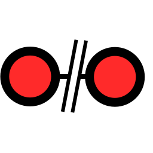||[Stop](../viewer/style/button_text.less#L153)|Stop routing|
|[StopNav](../viewer/components/ButtonDefs.ts#L220)|[gui/EditRoutePage.tsx](../viewer/gui/EditRoutePage.tsx#L1094)|||||
|[StopNav](../viewer/components/ButtonDefs.ts#L220)|[gui/NavPage.tsx](../viewer/gui/NavPage.tsx#L729)|||||
|[StopNav](../viewer/components/ButtonDefs.ts#L220)|[gui/NavPage.tsx](../viewer/gui/NavPage.tsx#L904)|||||
|[StopNav](../viewer/components/ButtonDefs.ts#L220)|[gui/NavPageButtons.ts](../viewer/gui/NavPageButtons.ts#L63)|||||
|[__StopWp__](../viewer/components/ButtonDefs.ts#L225)|[gui/NavPage.tsx](../viewer/gui/NavPage.tsx#L910)|[WpStop](../viewer/style/icons.less#L407)|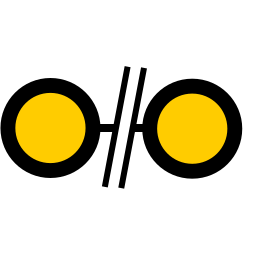||[Stop](../viewer/style/button_text.less#L156)|Stop routing|
|[StopWp](../viewer/components/ButtonDefs.ts#L225)|[gui/NavPageButtons.ts](../viewer/gui/NavPageButtons.ts#L72)|||||
|[__StoredRoutes__](../viewer/components/ButtonDefs.ts#L354)|[gui/RoutesPageButtons.ts](../viewer/gui/RoutesPageButtons.ts#L63)|[Items](../viewer/style/icons.less#L146)|||[List](../viewer/style/button_text.less#L252)|Edit stored routes|
|[__SyncRoutes__](../viewer/components/ButtonDefs.ts#L346)|[gui/RoutesPageButtons.ts](../viewer/gui/RoutesPageButtons.ts#L44)|[Sync](../viewer/style/icons.less#L362)|||[Sync](../viewer/style/button_text.less#L246)|Sync routes to server|
|[__ToRoute__](../viewer/components/ButtonDefs.ts#L291)|[gui/NavPage.tsx](../viewer/gui/NavPage.tsx#L456)|[Route](../viewer/style/icons.less#L305)|||[Route](../viewer/style/button_text.less#L204)|To route|
|[ToRoute](../viewer/components/ButtonDefs.ts#L291)|[gui/NavPage.tsx](../viewer/gui/NavPage.tsx#L519)|||||
|[ToRoute](../viewer/components/ButtonDefs.ts#L291)|[gui/NavPage.tsx](../viewer/gui/NavPage.tsx#L770)|||||
|[ToRoute](../viewer/components/ButtonDefs.ts#L291)|[components/FileDialog.jsx](../viewer/components/FileDialog.jsx#L1441)|||||
|[__TrackItems__](../viewer/components/ButtonDefs.ts#L429)|[gui/TracksPageButtons.ts](../viewer/gui/TracksPageButtons.ts#L34)|[Items](../viewer/style/icons.less#L146)|||[List](../viewer/style/button_text.less#L309)|Edit tracks / logs|
|[__Upload__](../viewer/components/ButtonDefs.ts#L74)|[gui/SettingsPageButtons.ts](../viewer/gui/SettingsPageButtons.ts#L70)|[Upload](../viewer/style/icons.less#L374)|||[Upload](../viewer/style/button_text.less#L62)|Upload file|
|[Upload](../viewer/components/ButtonDefs.ts#L74)|[gui/LayoutsPageButtons.ts](../viewer/gui/LayoutsPageButtons.ts#L33)|||||
|[Upload](../viewer/components/ButtonDefs.ts#L74)|[gui/EditRoutePage.tsx](../viewer/gui/EditRoutePage.tsx#L324)|||||
|[Upload](../viewer/components/ButtonDefs.ts#L74)|[gui/TracksPageButtons.ts](../viewer/gui/TracksPageButtons.ts#L37)|||||
|[Upload](../viewer/components/ButtonDefs.ts#L74)|[gui/RoutesPageButtons.ts](../viewer/gui/RoutesPageButtons.ts#L66)|||||
|[Upload](../viewer/components/ButtonDefs.ts#L74)|[gui/PluginsPageButtons.ts](../viewer/gui/PluginsPageButtons.ts#L31)|||||
|[Upload](../viewer/components/ButtonDefs.ts#L74)|[components/EditDialog.tsx](../viewer/components/EditDialog.tsx#L63)|||||
|[Upload](../viewer/components/ButtonDefs.ts#L74)|[components/FileDialog.jsx](../viewer/components/FileDialog.jsx#L1217)|||||
|[Upload](../viewer/components/ButtonDefs.ts#L74)|[components/DownloadItemList.tsx](../viewer/components/DownloadItemList.tsx#L344)|||||
|[Upload](../viewer/components/ButtonDefs.ts#L74)|[components/DownloadItemList.tsx](../viewer/components/DownloadItemList.tsx#L365)|||||
|[Upload](../viewer/components/ButtonDefs.ts#L74)|[components/UserAppDialog.tsx](../viewer/components/UserAppDialog.tsx#L115)|||||
|[Upload](../viewer/components/ButtonDefs.ts#L74)|[components/IconDialog.jsx](../viewer/components/IconDialog.jsx#L144)|||||
|[__WpEdit__](../viewer/components/ButtonDefs.ts#L159)|[gui/EditRoutePage.tsx](../viewer/gui/EditRoutePage.tsx#L631)|[Edit](../viewer/style/icons.less#L92)|||[Edit](../viewer/style/button_text.less#L108)|Edit wp|
|[WpEdit](../viewer/components/ButtonDefs.ts#L159)|[gui/NavPage.tsx](../viewer/gui/NavPage.tsx#L284)|||||
|[__WpGoto__](../viewer/components/ButtonDefs.ts#L251)|[gui/NavPage.tsx](../viewer/gui/NavPage.tsx#L736)|[WpGoto](../viewer/style/icons.less#L392)|||[Start](../viewer/style/button_text.less#L174)|Start to wp|
|[WpGoto](../viewer/components/ButtonDefs.ts#L251)|[gui/NavPage.tsx](../viewer/gui/NavPage.tsx#L826)|||||
|[WpGoto](../viewer/components/ButtonDefs.ts#L251)|[gui/NavPage.tsx](../viewer/gui/NavPage.tsx#L892)|||||
|[WpGoto](../viewer/components/ButtonDefs.ts#L251)|[gui/NavPageButtons.ts](../viewer/gui/NavPageButtons.ts#L53)|||||
|[__WpLocate__](../viewer/components/ButtonDefs.ts#L155)|[gui/EditRoutePage.tsx](../viewer/gui/EditRoutePage.tsx#L623)|[WpLocate](../viewer/style/icons.less#L395)|||[Locate](../viewer/style/button_text.less#L105)|Center to wp|
|[WpLocate](../viewer/components/ButtonDefs.ts#L155)|[gui/NavPage.tsx](../viewer/gui/NavPage.tsx#L274)|||||
|[__WpNext__](../viewer/components/ButtonDefs.ts#L163)|[gui/EditRoutePage.tsx](../viewer/gui/EditRoutePage.tsx#L639)|[WpNext](../viewer/style/icons.less#L398)|||[Next](../viewer/style/button_text.less#L111)|Next wp|
|[WpNext](../viewer/components/ButtonDefs.ts#L163)|[gui/NavPage.tsx](../viewer/gui/NavPage.tsx#L355)|||||
|[__WpPrevious__](../viewer/components/ButtonDefs.ts#L167)|[gui/EditRoutePage.tsx](../viewer/gui/EditRoutePage.tsx#L659)|[WpPrevious](../viewer/style/icons.less#L401)|||[Previous](../viewer/style/button_text.less#L114)|Previous wp|
|[WpPrevious](../viewer/components/ButtonDefs.ts#L167)|[gui/NavPage.tsx](../viewer/gui/NavPage.tsx#L371)|||||
|[__WpRestart__](../viewer/components/ButtonDefs.ts#L215)|[gui/NavPage.tsx](../viewer/gui/NavPage.tsx#L328)|[WpRestart](../viewer/style/icons.less#L404)|||[Restart](../viewer/style/button_text.less#L150)|Restart wp routing|
|[__ZoomIn__](../viewer/components/ButtonDefs.ts#L175)|[gui/EditRoutePage.tsx](../viewer/gui/EditRoutePage.tsx#L952)|[ZoomIn](../viewer/style/icons.less#L413)|||[Zoom](../viewer/style/button_text.less#L120)|Zoom in|
|[ZoomIn](../viewer/components/ButtonDefs.ts#L175)|[gui/NavPage.tsx](../viewer/gui/NavPage.tsx#L862)|||||
|[ZoomIn](../viewer/components/ButtonDefs.ts#L175)|[gui/NavPageButtons.ts](../viewer/gui/NavPageButtons.ts#L37)|||||
|[__ZoomOut__](../viewer/components/ButtonDefs.ts#L179)|[gui/EditRoutePage.tsx](../viewer/gui/EditRoutePage.tsx#L958)|[ZoomOut](../viewer/style/icons.less#L416)|||[Zoom](../viewer/style/button_text.less#L123)|Zoom out|
|[ZoomOut](../viewer/components/ButtonDefs.ts#L179)|[gui/NavPage.tsx](../viewer/gui/NavPage.tsx#L866)|||||
|[ZoomOut](../viewer/components/ButtonDefs.ts#L179)|[gui/NavPageButtons.ts](../viewer/gui/NavPageButtons.ts#L41)|||||

Icons
====
|Name|Usage|Name|Icon|IconNew|
| --- | --- | --- | --- | --- |
|[__Anchor__](../viewer/images/icons-new#L23)|[components/TitleIcons.tsx](../viewer/components/TitleIcons.tsx#L68)|[Anchor](../viewer/style/icons.less#L23)||
|[Anchor](../viewer/images/icons-new#L23)|[components/FeatureInfoDialog.jsx](../viewer/components/FeatureInfoDialog.jsx#L152)
|[__Boat__](../viewer/images/icons-new#L38)|[components/CenterDisplayWidget.jsx](../viewer/components/CenterDisplayWidget.jsx#L56)|[Boat](../viewer/style/icons.less#L38)||
|[__Browser__](../viewer/images/icons-new#L41)|[gui/AddressPage.tsx](../viewer/gui/AddressPage.tsx#L40)|[Browser](../viewer/style/icons.less#L41)||
|[__Cancel__](../viewer/images/icons-new#L44)|[components/ParameterDialog.tsx](../viewer/components/ParameterDialog.tsx#L184)|[Cancel](../viewer/style/icons.less#L44)||
|[__Charts__](../viewer/images/icons-new#L56)|[gui/MainNav.tsx](../viewer/gui/MainNav.tsx#L117)|[Charts](../viewer/style/icons.less#L56)||
|[Charts](../viewer/images/icons-new#L56)|[util/itemFunctions.ts](../viewer/util/itemFunctions.ts#L145)
|[Charts](../viewer/images/icons-new#L56)|[components/FeatureInfoDialog.jsx](../viewer/components/FeatureInfoDialog.jsx#L149)
|[__Checked__](../viewer/images/icons-new#L59)|[components/Inputs.tsx](../viewer/components/Inputs.tsx#L105)|[Checked](../viewer/style/icons.less#L59)||
|[__Disconnect__](../viewer/images/icons-new#L86)|[components/TitleIcons.tsx](../viewer/components/TitleIcons.tsx#L86)|[Disconnect](../viewer/style/icons.less#L86)||
|[__Edit__](../viewer/images/icons-new#L92)|[components/DownloadItemList.tsx](../viewer/components/DownloadItemList.tsx#L103)|[Edit](../viewer/style/icons.less#L92)||
|[Edit](../viewer/images/icons-new#L92)|[components/UserAppDialog.tsx](../viewer/components/UserAppDialog.tsx#L581)
|__Empty__|[components/WayPointItem.jsx](../viewer/components/WayPointItem.jsx#L24)
|__Empty__|[components/DownloadItemList.tsx](../viewer/components/DownloadItemList.tsx#L102)
|__Empty__|[components/DownloadItemList.tsx](../viewer/components/DownloadItemList.tsx#L103)
|__Empty__|[components/DownloadItemList.tsx](../viewer/components/DownloadItemList.tsx#L104)
|__Empty__|[components/MultiView.tsx](../viewer/components/MultiView.tsx#L166)
|__Empty__|[components/MultiView.tsx](../viewer/components/MultiView.tsx#L172)
|__Empty__|[components/FeatureInfoDialog.jsx](../viewer/components/FeatureInfoDialog.jsx#L157)
|[__ITDirectory__](../viewer/images/icons-new#L116)|[util/itemFunctions.ts](../viewer/util/itemFunctions.ts#L157)|[ITDirectory](../viewer/style/icons.less#L116)||
|[__ITHtml__](../viewer/images/icons-new#L119)|[util/itemFunctions.ts](../viewer/util/itemFunctions.ts#L155)|[ITHtml](../viewer/style/icons.less#L119)||
|[__ITOther__](../viewer/images/icons-new#L122)|[util/itemFunctions.ts](../viewer/util/itemFunctions.ts#L158)|[ITOther](../viewer/style/icons.less#L122)||
|[__ITServer__](../viewer/images/icons-new#L125)|[components/DownloadItemList.tsx](../viewer/components/DownloadItemList.tsx#L102)|[ITServer](../viewer/style/icons.less#L125)||
|[__ITText__](../viewer/images/icons-new#L128)|[util/itemFunctions.ts](../viewer/util/itemFunctions.ts#L156)|[ITText](../viewer/style/icons.less#L128)||
|[__ITUserSpecial__](../viewer/images/icons-new#L131)|[util/itemFunctions.ts](../viewer/util/itemFunctions.ts#L154)|[ITUserSpecial](../viewer/style/icons.less#L131)||
|[__Images__](../viewer/images/icons-new#L134)|[util/itemFunctions.ts](../viewer/util/itemFunctions.ts#L151)|[Images](../viewer/style/icons.less#L134)||
|[__JSChanged__](../viewer/images/icons-new#L149)|[components/TitleIcons.tsx](../viewer/components/TitleIcons.tsx#L69)|[JSChanged](../viewer/style/icons.less#L149)||
|[__Layout__](../viewer/images/icons-new#L152)|[gui/MainNav.tsx](../viewer/gui/MainNav.tsx#L127)|[Layout](../viewer/style/icons.less#L152)||
|[Layout](../viewer/images/icons-new#L152)|[util/itemFunctions.ts](../viewer/util/itemFunctions.ts#L148)
|[__Left__](../viewer/images/icons-new#L158)|[components/MultiView.tsx](../viewer/components/MultiView.tsx#L166)|[Left](../viewer/style/icons.less#L158)||
|[__MNCatNav__](../viewer/images/icons-new#L170)|[gui/MainNav.tsx](../viewer/gui/MainNav.tsx#L99)|[MNCatNav](../viewer/style/icons.less#L170)||
|[MNCatNav](../viewer/images/icons-new#L170)|[gui/MainNav.tsx](../viewer/gui/MainNav.tsx#L111)
|[MNCatNav](../viewer/images/icons-new#L170)|[gui/MainNav.tsx](../viewer/gui/MainNav.tsx#L113)
|[MNCatNav](../viewer/images/icons-new#L170)|[gui/MainNav.tsx](../viewer/gui/MainNav.tsx#L115)
|[__MNCatSet__](../viewer/images/icons-new#L173)|[gui/MainNav.tsx](../viewer/gui/MainNav.tsx#L123)|[MNCatSet](../viewer/style/icons.less#L173)||
|[MNCatSet](../viewer/images/icons-new#L173)|[gui/MainNav.tsx](../viewer/gui/MainNav.tsx#L131)
|[MNCatSet](../viewer/images/icons-new#L173)|[gui/MainNav.tsx](../viewer/gui/MainNav.tsx#L133)
|[MNCatSet](../viewer/images/icons-new#L173)|[gui/MainNav.tsx](../viewer/gui/MainNav.tsx#L135)
|[MNCatSet](../viewer/images/icons-new#L173)|[gui/MainNav.tsx](../viewer/gui/MainNav.tsx#L137)
|[__MNCollapsed__](../viewer/images/icons-new#L176)|[gui/MainNav.tsx](../viewer/gui/MainNav.tsx#L198)|[MNCollapsed](../viewer/style/icons.less#L176)||
|[MNCollapsed](../viewer/images/icons-new#L176)|[gui/MainNav.tsx](../viewer/gui/MainNav.tsx#L336)
|[__MNExpanded__](../viewer/images/icons-new#L179)|[gui/MainNav.tsx](../viewer/gui/MainNav.tsx#L198)|[MNExpanded](../viewer/style/icons.less#L179)||
|[MNExpanded](../viewer/images/icons-new#L179)|[gui/MainNav.tsx](../viewer/gui/MainNav.tsx#L344)
|[__Measure__](../viewer/images/icons-new#L188)|[components/TitleIcons.tsx](../viewer/components/TitleIcons.tsx#L65)|[Measure](../viewer/style/icons.less#L188)||
|[Measure](../viewer/images/icons-new#L188)|[components/FeatureInfoDialog.jsx](../viewer/components/FeatureInfoDialog.jsx#L153)
|[__MeasureFlag__](../viewer/images/icons-new#L191)|[components/CenterDisplayWidget.jsx](../viewer/components/CenterDisplayWidget.jsx#L27)|[MeasureFlag](../viewer/style/icons.less#L191)||
|[__More__](../viewer/images/icons-new#L197)|[components/WayPointItem.jsx](../viewer/components/WayPointItem.jsx#L24)|[More](../viewer/style/icons.less#L197)||
|[__NavStop__](../viewer/images/icons-new#L218)|[gui/EditRoutePage.tsx](../viewer/gui/EditRoutePage.tsx#L495)|[NavStop](../viewer/style/icons.less#L218)||
|[__Ok__](../viewer/images/icons-new#L260)|[components/ParameterDialog.tsx](../viewer/components/ParameterDialog.tsx#L183)|[Ok](../viewer/style/icons.less#L260)||
|[__Overlays__](../viewer/images/icons-new#L269)|[util/itemFunctions.ts](../viewer/util/itemFunctions.ts#L152)|[Overlays](../viewer/style/icons.less#L269)||
|[Overlays](../viewer/images/icons-new#L269)|[components/ChartsSelectDialog.tsx](../viewer/components/ChartsSelectDialog.tsx#L70)
|[Overlays](../viewer/images/icons-new#L269)|[components/FeatureInfoDialog.jsx](../viewer/components/FeatureInfoDialog.jsx#L150)
|[Overlays](../viewer/images/icons-new#L269)|[components/FeatureInfoDialog.jsx](../viewer/components/FeatureInfoDialog.jsx#L157)
|[__Plugins__](../viewer/images/icons-new#L272)|[gui/MainNav.tsx](../viewer/gui/MainNav.tsx#L129)|[Plugins](../viewer/style/icons.less#L272)||
|[Plugins](../viewer/images/icons-new#L272)|[util/itemFunctions.ts](../viewer/util/itemFunctions.ts#L153)
|[__RadioChecked__](../viewer/images/icons-new#L284)|[components/Inputs.tsx](../viewer/components/Inputs.tsx#L132)|[RadioChecked](../viewer/style/icons.less#L284)||
|[__RadioUnchecked__](../viewer/images/icons-new#L287)|[components/Inputs.tsx](../viewer/components/Inputs.tsx#L132)|[RadioUnchecked](../viewer/style/icons.less#L287)||
|[__Right__](../viewer/images/icons-new#L302)|[components/MultiView.tsx](../viewer/components/MultiView.tsx#L172)|[Right](../viewer/style/icons.less#L302)||
|[__Route__](../viewer/images/icons-new#L305)|[gui/MainNav.tsx](../viewer/gui/MainNav.tsx#L119)|[Route](../viewer/style/icons.less#L305)||
|[Route](../viewer/images/icons-new#L305)|[util/itemFunctions.ts](../viewer/util/itemFunctions.ts#L146)
|[Route](../viewer/images/icons-new#L305)|[components/FeatureInfoDialog.jsx](../viewer/components/FeatureInfoDialog.jsx#L147)
|[__Satellite__](../viewer/images/icons-new#L314)|[components/TimeStatusWidget.tsx](../viewer/components/TimeStatusWidget.tsx#L58)|[Satellite](../viewer/style/icons.less#L314)||
|[__Settings__](../viewer/images/icons-new#L335)|[gui/MainNav.tsx](../viewer/gui/MainNav.tsx#L125)|[Settings](../viewer/style/icons.less#L335)||
|[Settings](../viewer/images/icons-new#L335)|[gui/MainNav.tsx](../viewer/gui/MainNav.tsx#L353)
|[Settings](../viewer/images/icons-new#L335)|[util/itemFunctions.ts](../viewer/util/itemFunctions.ts#L149)
|[Settings](../viewer/images/icons-new#L335)|[components/TitleIcons.tsx](../viewer/components/TitleIcons.tsx#L92)
|[__Track__](../viewer/images/icons-new#L365)|[gui/MainNav.tsx](../viewer/gui/MainNav.tsx#L121)|[Track](../viewer/style/icons.less#L365)||
|[Track](../viewer/images/icons-new#L365)|[util/itemFunctions.ts](../viewer/util/itemFunctions.ts#L147)
|[Track](../viewer/images/icons-new#L365)|[components/FeatureInfoDialog.jsx](../viewer/components/FeatureInfoDialog.jsx#L148)
|[__UnChecked__](../viewer/images/icons-new#L368)|[components/Inputs.tsx](../viewer/components/Inputs.tsx#L105)|[UnChecked](../viewer/style/icons.less#L368)||
|[__User__](../viewer/images/icons-new#L377)|[util/itemFunctions.ts](../viewer/util/itemFunctions.ts#L150)|[User](../viewer/style/icons.less#L377)||
|[__View__](../viewer/images/icons-new#L380)|[components/DownloadItemList.tsx](../viewer/components/DownloadItemList.tsx#L104)|[View](../viewer/style/icons.less#L380)||
|[__Waypoint__](../viewer/images/icons-new#L383)|[components/CenterDisplayWidget.jsx](../viewer/components/CenterDisplayWidget.jsx#L42)|[Waypoint](../viewer/style/icons.less#L383)||
|[Waypoint](../viewer/images/icons-new#L383)|[components/FeatureInfoDialog.jsx](../viewer/components/FeatureInfoDialog.jsx#L151)

IconUsage
====
|Name|Icon|IconNew|Usage|
| --- | --- | --- | --- |
|[AddOns](../viewer/style/icons.less#L8)|||AddonConfigAddOns,DBUserApp|
|[AddonConfigPlus](../viewer/style/icons.less#L11)|||AddonConfigPlus|
|[After](../viewer/style/icons.less#L14)|||DBInsertAfter,DBAfter,DBInsert|
|[AisInfoHide](../viewer/style/icons.less#L17)|||AisInfoHide|
|[AisNearest](../viewer/style/icons.less#L20)|||AisNearest|
|[Anchor](../viewer/style/icons.less#L23)|||AnchorWatch,code|
|[AnchorEnd](../viewer/style/icons.less#L26)|||StopAnchorWatch|
|[Android](../viewer/style/icons.less#L29)|||StatusAndroid|
|[Back](../viewer/style/icons.less#L32)|||Back|
|[Before](../viewer/style/icons.less#L35)|||DBInsertBefore,DBBefore|
|[Boat](../viewer/style/icons.less#L38)|||DBAnchorBoat,DBCurrent,code|
|[Browser](../viewer/style/icons.less#L41)|||AndroidBrowser,code|
|[Cancel](../viewer/style/icons.less#L44)|||Cancel,MainExit,DBCancel,code|
|[Center](../viewer/style/icons.less#L47)|||AisInfoLocate,GpsCenter,DBAnchorCenter,DBCenter|
|[CenterAction](../viewer/style/icons.less#L50)|||CenterAction|
|[ChartScheme](../viewer/style/icons.less#L53)|||DBScheme|
|[Charts](../viewer/style/icons.less#L56)|||ChartsView,DBOpenChart,code|
|[Checked](../viewer/style/icons.less#L59)|||code|
|[Connect](../viewer/style/icons.less#L62)|||DBConnect|
|[Connected](../viewer/style/icons.less#L65)|||Connected|
|[Copy](../viewer/style/icons.less#L68)|||DBCopy|
|[CourseUp](../viewer/style/icons.less#L71)|||CourseUp|
|[Debug](../viewer/style/icons.less#L74)|||StatusDebug|
|[Delete](../viewer/style/icons.less#L77)|||DBDelete,DBWpaRemove,DBClear,DBDiscard,DBCleanTrack|
|[Dim](../viewer/style/icons.less#L80)|||Dim|
|[Disable](../viewer/style/icons.less#L83)|||DBDisable|
|[Disconnect](../viewer/style/icons.less#L86)|||DBDisconnect,code|
|[Download](../viewer/style/icons.less#L89)|||DBDownload|
|[Edit](../viewer/style/icons.less#L92)|||WpEdit,Edit,DBRename,DBEditCss,DBConfig,code|
|[EditPage](../viewer/style/icons.less#L95)|||EditPage|
|[EmptyRoute](../viewer/style/icons.less#L98)|||DBEmptyRoute|
|[Expand](../viewer/style/icons.less#L101)|||StatusAll|
|[FullScreen](../viewer/style/icons.less#L104)|||FullScreen|
|[Help](../viewer/style/icons.less#L107)|||Help|
|[Hide](../viewer/style/icons.less#L110)|||DBHide|
|[HideOverlays](../viewer/style/icons.less#L113)|||DBHideOverlays,DBHideAllOverlays|
|[ITDirectory](../viewer/style/icons.less#L116)|||code|
|[ITHtml](../viewer/style/icons.less#L119)|||code|
|[ITOther](../viewer/style/icons.less#L122)|||code|
|[ITServer](../viewer/style/icons.less#L125)|||code|
|[ITText](../viewer/style/icons.less#L128)|||code|
|[ITUserSpecial](../viewer/style/icons.less#L131)|||code|
|[Images](../viewer/style/icons.less#L134)|||AddonConfigImages,code|
|[Imports](../viewer/style/icons.less#L137)|||ImportsView|
|[Info](../viewer/style/icons.less#L140)|||MainInfo,DBInfo|
|[InvertRoute](../viewer/style/icons.less#L143)|||DBInvertRoute|
|[Items](../viewer/style/icons.less#L146)|||AisItems,StoredRoutes,SettingsItems,TrackItems|
|[JSChanged](../viewer/style/icons.less#L149)|||code|
|[Layout](../viewer/style/icons.less#L152)|||Layout,EditLayout,LayoutFinished,DBEditLayout,code|
|[LayoutOff](../viewer/style/icons.less#L155)|||SettingsLayoutOff|
|[Left](../viewer/style/icons.less#L158)|||code|
|[Lock](../viewer/style/icons.less#L161)|||AisLock|
|[LockPos](../viewer/style/icons.less#L164)|||LockPos|
|[Log](../viewer/style/icons.less#L167)|||StatusLog,DBLog|
|[MNCatNav](../viewer/style/icons.less#L170)|||code|
|[MNCatSet](../viewer/style/icons.less#L173)|||code|
|[MNCollapsed](../viewer/style/icons.less#L176)|||code|
|[MNExpanded](../viewer/style/icons.less#L179)|||code|
|[MOB](../viewer/style/icons.less#L182)|||MOB|
|[MainNav](../viewer/style/icons.less#L185)|||MainNav|
|[Measure](../viewer/style/icons.less#L188)|||ABShowMeasure,Measure,MeasureAdd,code|
|[MeasureFlag](../viewer/style/icons.less#L191)|||code|
|[MeasureOff](../viewer/style/icons.less#L194)|||MeasureOff|
|[More](../viewer/style/icons.less#L197)|||code|
|[NavAdd](../viewer/style/icons.less#L200)|||NavAdd,DBInsertRouteBefore|
|[NavAddAfter](../viewer/style/icons.less#L203)|||NavAddAfter,DBInsertRouteAfter|
|[NavDelete](../viewer/style/icons.less#L206)|||NavDelete|
|[NavGoto](../viewer/style/icons.less#L209)|||NavGoto,NavRestart,DBStartRoute|
|[NavMapWidgets](../viewer/style/icons.less#L212)|||NavMapWidgets|
|[NavNext](../viewer/style/icons.less#L215)|||NavNext|
|[NavStop](../viewer/style/icons.less#L218)|||StopNav,code|
|[NavToCenter](../viewer/style/icons.less#L221)|||NavToCenter|
|[Navigation](../viewer/style/icons.less#L224)|||NavActions|
|[Night](../viewer/style/icons.less#L227)|||Night|
|[Num1](../viewer/style/icons.less#L230)|||Gps1|
|[Num10](../viewer/style/icons.less#L233)|||Gps10|
|[Num2](../viewer/style/icons.less#L236)|||Gps2|
|[Num3](../viewer/style/icons.less#L239)|||Gps3|
|[Num4](../viewer/style/icons.less#L242)|||Gps4|
|[Num5](../viewer/style/icons.less#L245)|||Gps5|
|[Num6](../viewer/style/icons.less#L248)|||Gps6|
|[Num7](../viewer/style/icons.less#L251)|||Gps7|
|[Num8](../viewer/style/icons.less#L254)|||Gps8|
|[Num9](../viewer/style/icons.less#L257)|||Gps9|
|[Ok](../viewer/style/icons.less#L260)|||DBOk,DBUpdate,DBAccept,code|
|[Open](../viewer/style/icons.less#L263)|||SettingsLoad,DBLoadRoute,DBActivate|
|[Overflow](../viewer/style/icons.less#L266)|||Overflow|
|[Overlays](../viewer/style/icons.less#L269)|||OverlaysView,DBShowOverlays,DBShowAllOverlays,DBOverlays,code|
|[Plugins](../viewer/style/icons.less#L272)|||code|
|[Plus](../viewer/style/icons.less#L275)|||CreateFile,DBAdd,DBNew,DBNewRoute,DBAddSub|
|[Propose](../viewer/style/icons.less#L278)|||DBPropose|
|[QRCode](../viewer/style/icons.less#L281)|||StatusAddresses|
|[RadioChecked](../viewer/style/icons.less#L284)|||code|
|[RadioUnchecked](../viewer/style/icons.less#L287)|||code|
|[Reload](../viewer/style/icons.less#L290)|||ReloadUI,DBReload,DBRestart,DBAutoReload|
|[RemoteChannel](../viewer/style/icons.less#L293)|||RemoteChannel|
|[RenumberRoute](../viewer/style/icons.less#L296)|||DBRenumberRoute|
|[Reset](../viewer/style/icons.less#L299)|||SettingsDefaults,DefaultValue,DBReset|
|[Right](../viewer/style/icons.less#L302)|||code|
|[Route](../viewer/style/icons.less#L305)|||ShowRoutePanel,ToRoute,DBRoutePoints,DBFeatureNewRoute,DBEditRoute,code|
|[RouteAdd](../viewer/style/icons.less#L308)|||RouteAdd|
|[RouteMenu](../viewer/style/icons.less#L311)|||RouteMenu|
|[Satellite](../viewer/style/icons.less#L314)|||code|
|[Save](../viewer/style/icons.less#L317)|||SettingsSave,DBSave|
|[SaveAs](../viewer/style/icons.less#L320)|||DBSaveAs|
|[Search](../viewer/style/icons.less#L323)|||AisSearch|
|[Section](../viewer/style/icons.less#L326)|||SectionView|
|[SelectChart](../viewer/style/icons.less#L329)|||NavSelectChart|
|[Server](../viewer/style/icons.less#L332)|||ServerView|
|[Settings](../viewer/style/icons.less#L335)|||ShowSettings,code|
|[Shutdown](../viewer/style/icons.less#L338)|||StatusShutdown|
|[Sort](../viewer/style/icons.less#L341)|||AisSort|
|[Split](../viewer/style/icons.less#L344)|||Split|
|[SplitReset](../viewer/style/icons.less#L347)|||SettingsSplitReset|
|[Start](../viewer/style/icons.less#L350)|||DBCompute|
|[StatusAdd](../viewer/style/icons.less#L353)|||StatusAdd|
|[StatusRestart](../viewer/style/icons.less#L356)|||StatusRestart|
|[Stop](../viewer/style/icons.less#L359)|||DBStop|
|[Sync](../viewer/style/icons.less#L362)|||SyncRoutes|
|[Track](../viewer/style/icons.less#L365)|||code|
|[UnChecked](../viewer/style/icons.less#L368)|||code|
|[Undo](../viewer/style/icons.less#L371)|||RevertLayout|
|[Upload](../viewer/style/icons.less#L374)|||Upload|
|[User](../viewer/style/icons.less#L377)|||AddonConfigUser,code|
|[View](../viewer/style/icons.less#L380)|||DBPreview,DBView,code|
|[Waypoint](../viewer/style/icons.less#L383)|||ABShowWpButtons,code|
|[Wifi](../viewer/style/icons.less#L386)|||StatusWpa,DBWpaEnable|
|[WifiOff](../viewer/style/icons.less#L389)|||DBWpaDisable|
|[WpGoto](../viewer/style/icons.less#L392)|||WpGoto|
|[WpLocate](../viewer/style/icons.less#L395)|||WpLocate|
|[WpNext](../viewer/style/icons.less#L398)|||WpNext|
|[WpPrevious](../viewer/style/icons.less#L401)|||WpPrevious|
|[WpRestart](../viewer/style/icons.less#L404)|||WpRestart|
|[WpStop](../viewer/style/icons.less#L407)|||StopWp|
|[WpaConnect](../viewer/style/icons.less#L410)|||DBWpaConnect|
|[ZoomIn](../viewer/style/icons.less#L413)|||ZoomIn|
|[ZoomOut](../viewer/style/icons.less#L416)|||ZoomOut|
