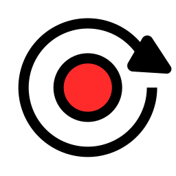

Buttons
====
|Name|File|IconName|IconFile|Icon|shortText|longText|
| --- | --- | --- | --- | --- | --- | --- |
|[__ABShowMeasure__](../viewer/components/ButtonDefs.ts#L275)|[gui/NavPage.tsx](../viewer/gui/NavPage.tsx#L989)|Measure|[straighten.svg](../viewer/style/icons.less#L361)||[Measure](../viewer/style/button_text.less#L192)|Show measure buttons|
|[__ABShowWpButtons__](../viewer/components/ButtonDefs.ts#L271)|[gui/EditRoutePage.jsx](../viewer/gui/EditRoutePage.jsx#L1008)|Waypoint|[waypoint.svg](../viewer/style/icons.less#L433)||[Wp](../viewer/style/button_text.less#L189)|Show wp buttons|
|[ABShowWpButtons](../viewer/components/ButtonDefs.ts#L271)|[gui/NavPage.tsx](../viewer/gui/NavPage.tsx#L975)|||||
|[__AddonConfigAddOns__](../viewer/components/ButtonDefs.ts#L44)|[gui/AddOnConfigPageButtons.ts](../viewer/gui/AddOnConfigPageButtons.ts#L31)|AddOns|[apps.svg](../viewer/style/icons.less#L146)||[Config](../viewer/style/button_text.less#L39)|Configure user apps|
|[__AddonConfigImages__](../viewer/components/ButtonDefs.ts#L52)|[gui/AddOnConfigPageButtons.ts](../viewer/gui/AddOnConfigPageButtons.ts#L37)|Images|[image-icon.svg](../viewer/style/icons.less#L4)||[Images](../viewer/style/button_text.less#L45)|Edit image files|
|[__AddonConfigPlus__](../viewer/components/ButtonDefs.ts#L56)|[gui/AddOnConfigPageButtons.ts](../viewer/gui/AddOnConfigPageButtons.ts#L40)|AddonConfigPlus|[ic_add.svg](../viewer/style/icons.less#L86)||[Add](../viewer/style/button_text.less#L48)|Add user app|
|[__AddonConfigUser__](../viewer/components/ButtonDefs.ts#L48)|[gui/AddOnConfigPageButtons.ts](../viewer/gui/AddOnConfigPageButtons.ts#L34)|User|[folder_shared.svg](../viewer/style/icons.less#L7)||[User](../viewer/style/button_text.less#L42)|Edit user files|
|[__AisInfoHide__](../viewer/components/ButtonDefs.ts#L132)|[components/AisInfoDisplay.tsx](../viewer/components/AisInfoDisplay.tsx#L256)|AisInfoHide|[ic_hide.svg](../viewer/style/icons.less#L143)||[Hide](../viewer/style/button_text.less#L87)|Hide target info|
|[__AisInfoLocate__](../viewer/components/ButtonDefs.ts#L128)|[components/AisInfoDisplay.tsx](../viewer/components/AisInfoDisplay.tsx#L242)|Center|[center.svg](../viewer/style/icons.less#L116)||[Locate](../viewer/style/button_text.less#L84)|Center to target|
|[__AisItems__](../viewer/components/ButtonDefs.ts#L124)|[gui/AisCfgPageButtons.ts](../viewer/gui/AisCfgPageButtons.ts#L33)|Items|[list-200.svg](../viewer/style/icons.less#L101)||[Targets](../viewer/style/button_text.less#L81)|List AIS targets|
|[AisItems](../viewer/components/ButtonDefs.ts#L124)|[components/AisInfoDisplay.tsx](../viewer/components/AisInfoDisplay.tsx#L275)|||||
|[__AisLock__](../viewer/components/ButtonDefs.ts#L116)|[gui/AisPageButtons.ts](../viewer/gui/AisPageButtons.ts#L39)|Lock|[update_disabled.svg](../viewer/style/icons.less#L110)||[Pause](../viewer/style/button_text.less#L75)|Pause lsiting targets|
|[__AisNearest__](../viewer/components/ButtonDefs.ts#L108)|[gui/AisPageButtons.ts](../viewer/gui/AisPageButtons.ts#L30)|AisNearest|[ais-nearest.svg](../viewer/style/icons.less#L149)||[Nearest](../viewer/style/button_text.less#L69)|Show nearest target|
|[AisNearest](../viewer/components/ButtonDefs.ts#L108)|[components/AisInfoDisplay.tsx](../viewer/components/AisInfoDisplay.tsx#L233)|||||
|[__AisSearch__](../viewer/components/ButtonDefs.ts#L120)|[gui/AisPageButtons.ts](../viewer/gui/AisPageButtons.ts#L45)|Search|[search.svg](../viewer/style/icons.less#L113)||[Search](../viewer/style/button_text.less#L78)|Search AIS targets|
|[__AisSort__](../viewer/components/ButtonDefs.ts#L112)|[gui/AisPageButtons.ts](../viewer/gui/AisPageButtons.ts#L34)|Sort|[sort.svg](../viewer/style/icons.less#L107)||[Sort](../viewer/style/button_text.less#L72)|Sort AIS targets|
|[__AnchorWatch__](../viewer/components/ButtonDefs.ts#L237)|[components/AnchorWatchDialog.jsx](../viewer/components/AnchorWatchDialog.jsx#L181)|Anchor|[anchor.svg](../viewer/style/icons.less#L222)||[Anchor](../viewer/style/button_text.less#L165)|Anchor watch|
|[__AndroidBrowser__](../viewer/components/ButtonDefs.ts#L379)|[gui/ServerPageButtons.ts](../viewer/gui/ServerPageButtons.ts#L55)|Browser|[internet-web-browser.svg](../viewer/style/icons.less#L95)||[Browser](../viewer/style/button_text.less#L271)|Start external browser|
|[__Back__](../viewer/components/ButtonDefs.ts#L61)|[gui/AddOnPageButtons.ts](../viewer/gui/AddOnPageButtons.ts#L30)|Back|[ic_arrow_back.svg](../viewer/style/icons.less#L77)||[Back](../viewer/style/button_text.less#L52)|Back|
|[__Cancel__](../viewer/components/ButtonDefs.ts#L39)|[gui/GpsPageButtons.ts](../viewer/gui/GpsPageButtons.ts#L50)|Cancel|[ic_clear.svg](../viewer/style/icons.less#L74)||[Close](../viewer/style/button_text.less#L16)|Close page|
|[Cancel](../viewer/components/ButtonDefs.ts#L39)|[gui/EditRoutePage.jsx](../viewer/gui/EditRoutePage.jsx#L597)|||||
|[Cancel](../viewer/components/ButtonDefs.ts#L39)|[gui/NavPage.tsx](../viewer/gui/NavPage.tsx#L279)|||||
|[Cancel](../viewer/components/ButtonDefs.ts#L39)|[gui/NavPage.tsx](../viewer/gui/NavPage.tsx#L441)|||||
|[Cancel](../viewer/components/ButtonDefs.ts#L39)|[gui/GeneralButtons.ts](../viewer/gui/GeneralButtons.ts#L35)|||||
|[Cancel](../viewer/components/ButtonDefs.ts#L39)|[components/UploadHandler.tsx](../viewer/components/UploadHandler.tsx#L313)|||||
|[Cancel](../viewer/components/ButtonDefs.ts#L39)|[components/AnchorWatchDialog.jsx](../viewer/components/AnchorWatchDialog.jsx#L115)|||||
|[__CenterAction__](../viewer/components/ButtonDefs.ts#L233)|[components/FeatureInfoDialog.jsx](../viewer/components/FeatureInfoDialog.jsx#L388)|CenterAction|[center-action.svg](../viewer/style/icons.less#L216)||[Info](../viewer/style/button_text.less#L162)|Info at Crosshair|
|[__ChartsView__](../viewer/components/ButtonDefs.ts#L142)|[gui/ChartsPageButtons.ts](../viewer/gui/ChartsPageButtons.ts#L37)|Charts|[map2.svg](../viewer/style/icons.less#L10)||[Charts](../viewer/style/button_text.less#L95)|Select & upload charts|
|[__Connected__](../viewer/components/ButtonDefs.ts#L350)|[gui/GeneralButtons.ts](../viewer/gui/GeneralButtons.ts#L41)|Connected|[plug.svg](../viewer/style/icons.less#L31)||[Connect](../viewer/style/button_text.less#L249)|Connect to server|
|[__CourseUp__](../viewer/components/ButtonDefs.ts#L255)|[gui/NavPage.tsx](../viewer/gui/NavPage.tsx#L946)|CourseUp|[compass.svg](../viewer/style/icons.less#L176)||[Course](../viewer/style/button_text.less#L177)|Course up / north up|
|[CourseUp](../viewer/components/ButtonDefs.ts#L255)|[gui/NavPageButtons.ts](../viewer/gui/NavPageButtons.ts#L84)|||||
|[__CreateFile__](../viewer/components/ButtonDefs.ts#L471)|[components/DownloadItemList.tsx](../viewer/components/DownloadItemList.tsx#L277)|Plus|[ic_add.svg](../viewer/style/icons.less#L80)||[New](../viewer/style/button_text.less#L342)|Create file|
|[__DBAccept__](../viewer/components/ButtonDefs.ts#L639)|[components/EulaDialog.jsx](../viewer/components/EulaDialog.jsx#L31)|Ok|[ic_done.svg](../viewer/style/icons.less#L297)||[Accept](../viewer/style/button_text.less#L478)||
|[__DBActivate__](../viewer/components/ButtonDefs.ts#L719)|[components/FileDialog.jsx](../viewer/components/FileDialog.jsx#L1541)|Open|[ic_open.svg](../viewer/style/icons.less#L282)||[Activate](../viewer/style/button_text.less#L530)||
|[DBActivate](../viewer/components/ButtonDefs.ts#L719)|[components/FileDialog.jsx](../viewer/components/FileDialog.jsx#L1619)|||||
|[__DBAdd__](../viewer/components/ButtonDefs.ts#L508)|[gui/NavPage.tsx](../viewer/gui/NavPage.tsx#L251)|Plus|[ic_add.svg](../viewer/style/icons.less#L80)||[Add](../viewer/style/button_text.less#L371)||
|[__DBAddSub__](../viewer/components/ButtonDefs.ts#L612)|[components/CombinedWidget.jsx](../viewer/components/CombinedWidget.jsx#L107)|Plus|[ic_add.svg](../viewer/style/icons.less#L80)||[+Sub](../viewer/style/button_text.less#L457)||
|[__DBAfter__](../viewer/components/ButtonDefs.ts#L626)|[components/EditWidgetDialog.jsx](../viewer/components/EditWidgetDialog.jsx#L190)|After|[navigate_next.svg](../viewer/style/icons.less#L315)||[After](../viewer/style/button_text.less#L468)||
|[__DBAnchorBoat__](../viewer/components/ButtonDefs.ts#L568)|[components/AnchorWatchDialog.jsx](../viewer/components/AnchorWatchDialog.jsx#L93)|Boat|[boat.svg](../viewer/style/icons.less#L228)||[Boat](../viewer/style/button_text.less#L436)|at boat pos|
|[__DBAnchorCenter__](../viewer/components/ButtonDefs.ts#L572)|[components/AnchorWatchDialog.jsx](../viewer/components/AnchorWatchDialog.jsx#L97)|Center|[center.svg](../viewer/style/icons.less#L116)||[Center](../viewer/style/button_text.less#L439)|at map center|
|[__DBAutoReload__](../viewer/components/ButtonDefs.ts#L671)|[components/LogDialog.tsx](../viewer/components/LogDialog.tsx#L78)|Reload|[ic_refresh.svg](../viewer/style/icons.less#L140)||[Auto](../viewer/style/button_text.less#L502)||
|[__DBBefore__](../viewer/components/ButtonDefs.ts#L622)|[components/EditWidgetDialog.jsx](../viewer/components/EditWidgetDialog.jsx#L189)|Before|[navigate_before.svg](../viewer/style/icons.less#L312)||[Before](../viewer/style/button_text.less#L465)||
|[__DBCancel__](../viewer/components/ButtonDefs.ts#L484)|[gui/EditRoutePage.jsx](../viewer/gui/EditRoutePage.jsx#L520)|Cancel|[ic_clear.svg](../viewer/style/icons.less#L74)||[Cancel](../viewer/style/button_text.less#L353)||
|[DBCancel](../viewer/components/ButtonDefs.ts#L484)|[gui/NavPage.tsx](../viewer/gui/NavPage.tsx#L263)|||||
|[DBCancel](../viewer/components/ButtonDefs.ts#L484)|[components/EditHandlerDialog.jsx](../viewer/components/EditHandlerDialog.jsx#L180)|||||
|[DBCancel](../viewer/components/ButtonDefs.ts#L484)|[components/ImporterView.tsx](../viewer/components/ImporterView.tsx#L242)|||||
|[DBCancel](../viewer/components/ButtonDefs.ts#L484)|[components/ImporterView.tsx](../viewer/components/ImporterView.tsx#L329)|||||
|[DBCancel](../viewer/components/ButtonDefs.ts#L484)|[components/OverlayDialog.tsx](../viewer/components/OverlayDialog.tsx#L366)|||||
|[DBCancel](../viewer/components/ButtonDefs.ts#L484)|[components/EditOverlaysDialog.jsx](../viewer/components/EditOverlaysDialog.jsx#L274)|||||
|[DBCancel](../viewer/components/ButtonDefs.ts#L484)|[components/EditOverlaysDialog.jsx](../viewer/components/EditOverlaysDialog.jsx#L759)|||||
|[DBCancel](../viewer/components/ButtonDefs.ts#L484)|[components/EulaDialog.jsx](../viewer/components/EulaDialog.jsx#L30)|||||
|[DBCancel](../viewer/components/ButtonDefs.ts#L484)|[components/ImportDialog.jsx](../viewer/components/ImportDialog.jsx#L80)|||||
|[DBCancel](../viewer/components/ButtonDefs.ts#L484)|[components/FileDialog.jsx](../viewer/components/FileDialog.jsx#L2068)|||||
|[DBCancel](../viewer/components/ButtonDefs.ts#L484)|[components/FileDialog.jsx](../viewer/components/FileDialog.jsx#L2138)|||||
|[DBCancel](../viewer/components/ButtonDefs.ts#L484)|[components/WaypointDialog.jsx](../viewer/components/WaypointDialog.jsx#L135)|||||
|[DBCancel](../viewer/components/ButtonDefs.ts#L484)|[components/ColorDialog.jsx](../viewer/components/ColorDialog.jsx#L51)|||||
|[DBCancel](../viewer/components/ButtonDefs.ts#L484)|[components/TrackConvertDialog.jsx](../viewer/components/TrackConvertDialog.jsx#L453)|||||
|[DBCancel](../viewer/components/ButtonDefs.ts#L484)|[components/RemoteChannelDialog.tsx](../viewer/components/RemoteChannelDialog.tsx#L58)|||||
|[DBCancel](../viewer/components/ButtonDefs.ts#L484)|[components/LayoutFinishedDialog.jsx](../viewer/components/LayoutFinishedDialog.jsx#L62)|||||
|[DBCancel](../viewer/components/ButtonDefs.ts#L484)|[components/EditWidgetDialog.jsx](../viewer/components/EditWidgetDialog.jsx#L199)|||||
|[DBCancel](../viewer/components/ButtonDefs.ts#L484)|[components/FeatureInfoDialog.jsx](../viewer/components/FeatureInfoDialog.jsx#L325)|||||
|[DBCancel](../viewer/components/ButtonDefs.ts#L484)|[components/BasicDialogs.tsx](../viewer/components/BasicDialogs.tsx#L106)|||||
|[DBCancel](../viewer/components/ButtonDefs.ts#L484)|[components/BasicDialogs.tsx](../viewer/components/BasicDialogs.tsx#L189)|||||
|[DBCancel](../viewer/components/ButtonDefs.ts#L484)|[components/EditPageDialog.tsx](../viewer/components/EditPageDialog.tsx#L177)|||||
|[__DBCenter__](../viewer/components/ButtonDefs.ts#L732)|[gui/NavPage.tsx](../viewer/gui/NavPage.tsx#L772)|Center|[center.svg](../viewer/style/icons.less#L116)||[Center](../viewer/style/button_text.less#L540)||
|[__DBCleanTrack__](../viewer/components/ButtonDefs.ts#L740)|[gui/NavPage.tsx](../viewer/gui/NavPage.tsx#L820)|Delete|[ic_delete.svg](../viewer/style/icons.less#L303)||[Clean track](../viewer/style/button_text.less#L543)||
|[__DBClear__](../viewer/components/ButtonDefs.ts#L581)|[components/BasicDialogs.tsx](../viewer/components/BasicDialogs.tsx#L187)|Delete|[ic_delete.svg](../viewer/style/icons.less#L303)||[Clear](../viewer/style/button_text.less#L392)||
|[DBClear](../viewer/components/ButtonDefs.ts#L581)|[components/ItemNameDialog.jsx](../viewer/components/ItemNameDialog.jsx#L123)|||||
|[__DBCompute__](../viewer/components/ButtonDefs.ts#L690)|[components/TrackConvertDialog.jsx](../viewer/components/TrackConvertDialog.jsx#L446)|Start|[play_arrow.svg](../viewer/style/icons.less#L324)||[Compute](../viewer/style/button_text.less#L514)||
|[__DBConfig__](../viewer/components/ButtonDefs.ts#L715)|[components/FileDialog.jsx](../viewer/components/FileDialog.jsx#L666)|Edit|[ic_edit.svg](../viewer/style/icons.less#L25)||[Config](../viewer/style/button_text.less#L527)||
|[__DBConnect__](../viewer/components/ButtonDefs.ts#L680)|[components/RemoteChannelDialog.tsx](../viewer/components/RemoteChannelDialog.tsx#L53)|Connect|[plug.svg](../viewer/style/icons.less#L353)||[Connect](../viewer/style/button_text.less#L380)||
|[__DBCopy__](../viewer/components/ButtonDefs.ts#L707)|[components/FileDialog.jsx](../viewer/components/FileDialog.jsx#L596)|Copy|[content_copy.svg](../viewer/style/icons.less#L309)||[Copy](../viewer/style/button_text.less#L398)||
|[__DBDelete__](../viewer/components/ButtonDefs.ts#L496)|[gui/EditRoutePage.jsx](../viewer/gui/EditRoutePage.jsx#L487)|Delete|[ic_delete.svg](../viewer/style/icons.less#L303)||[Delete](../viewer/style/button_text.less#L362)||
|[DBDelete](../viewer/components/ButtonDefs.ts#L496)|[components/EditHandlerDialog.jsx](../viewer/components/EditHandlerDialog.jsx#L173)|||||
|[DBDelete](../viewer/components/ButtonDefs.ts#L496)|[components/ImporterView.tsx](../viewer/components/ImporterView.tsx#L153)|||||
|[DBDelete](../viewer/components/ButtonDefs.ts#L496)|[components/EditOverlaysDialog.jsx](../viewer/components/EditOverlaysDialog.jsx#L736)|||||
|[DBDelete](../viewer/components/ButtonDefs.ts#L496)|[components/FileDialog.jsx](../viewer/components/FileDialog.jsx#L555)|||||
|[DBDelete](../viewer/components/ButtonDefs.ts#L496)|[components/WaypointDialog.jsx](../viewer/components/WaypointDialog.jsx#L126)|||||
|[DBDelete](../viewer/components/ButtonDefs.ts#L496)|[components/UserAppDialog.tsx](../viewer/components/UserAppDialog.tsx#L422)|||||
|[DBDelete](../viewer/components/ButtonDefs.ts#L496)|[components/EditWidgetDialog.jsx](../viewer/components/EditWidgetDialog.jsx#L196)|||||
|[__DBDisable__](../viewer/components/ButtonDefs.ts#L520)|[components/ImporterView.tsx](../viewer/components/ImporterView.tsx#L168)|Disable|[ic_hide.svg](../viewer/style/icons.less#L318)||[Disable](../viewer/style/button_text.less#L413)||
|[__DBDiscard__](../viewer/components/ButtonDefs.ts#L666)|[components/LayoutFinishedDialog.jsx](../viewer/components/LayoutFinishedDialog.jsx#L61)|Delete|[ic_delete.svg](../viewer/style/icons.less#L303)||[Discard changes](../viewer/style/button_text.less#L499)||
|[__DBDisconnect__](../viewer/components/ButtonDefs.ts#L676)|[components/RemoteChannelDialog.tsx](../viewer/components/RemoteChannelDialog.tsx#L48)|Disconnect|[plug-disconnect.svg](../viewer/style/icons.less#L350)||[Disconnect](../viewer/style/button_text.less#L506)||
|[__DBDownload__](../viewer/components/ButtonDefs.ts#L488)|[components/FileDialog.jsx](../viewer/components/FileDialog.jsx#L650)|Download|[ic_file_download.svg](../viewer/style/icons.less#L300)||[Download](../viewer/style/button_text.less#L356)||
|[DBDownload](../viewer/components/ButtonDefs.ts#L488)|[components/DownloadButton.tsx](../viewer/components/DownloadButton.tsx#L107)|||||
|[__DBEditCss__](../viewer/components/ButtonDefs.ts#L662)|[components/LayoutFinishedDialog.jsx](../viewer/components/LayoutFinishedDialog.jsx#L60)|Edit|[ic_edit.svg](../viewer/style/icons.less#L25)||[Edit CSS](../viewer/style/button_text.less#L496)||
|[__DBEditLayout__](../viewer/components/ButtonDefs.ts#L685)|[components/Settings.tsx](../viewer/components/Settings.tsx#L533)|Layout|[ballot.svg](../viewer/style/icons.less#L234)||[Edit](../viewer/style/button_text.less#L510)||
|[DBEditLayout](../viewer/components/ButtonDefs.ts#L685)|[components/FileDialog.jsx](../viewer/components/FileDialog.jsx#L1554)|||||
|[__DBEditRoute__](../viewer/components/ButtonDefs.ts#L736)|[gui/NavPage.tsx](../viewer/gui/NavPage.tsx#L793)|Route|[route.svg](../viewer/style/icons.less#L22)||[Edit](../viewer/style/button_text.less#L339)|Edit item|
|[DBEditRoute](../viewer/components/ButtonDefs.ts#L736)|[gui/NavPage.tsx](../viewer/gui/NavPage.tsx#L810)|||||
|[__DBEmptyRoute__](../viewer/components/ButtonDefs.ts#L527)|[gui/EditRoutePage.jsx](../viewer/gui/EditRoutePage.jsx#L180)|EmptyRoute|[delete_sweep.svg](../viewer/style/icons.less#L331)||[Empty](../viewer/style/button_text.less#L417)||
|[__DBFeatureNewRoute__](../viewer/components/ButtonDefs.ts#L728)|[gui/NavPage.tsx](../viewer/gui/NavPage.tsx#L532)|Route|[route.svg](../viewer/style/icons.less#L22)||[New route](../viewer/style/button_text.less#L537)||
|[__DBHide__](../viewer/components/ButtonDefs.ts#L748)|[components/FeatureInfoDialog.jsx](../viewer/components/FeatureInfoDialog.jsx#L346)|Hide|[visibility_off.svg](../viewer/style/icons.less#L327)||[Hide](../viewer/style/button_text.less#L549)||
|[__DBHideAllOverlays__](../viewer/components/ButtonDefs.ts#L599)|[components/EditOverlaysDialog.jsx](../viewer/components/EditOverlaysDialog.jsx#L731)|HideOverlays|[layers-black-off.svg](../viewer/style/icons.less#L19)||[Hide all](../viewer/style/button_text.less#L453)||
|[__DBHideOverlays__](../viewer/components/ButtonDefs.ts#L590)|[components/MapPage.tsx](../viewer/components/MapPage.tsx#L390)|HideOverlays|[layers-black-off.svg](../viewer/style/icons.less#L19)||[Hide overlays](../viewer/style/button_text.less#L446)||
|[__DBIgnore__](../viewer/components/ButtonDefs.ts#L524)|[components/Settings.tsx](../viewer/components/Settings.tsx#L716)|||[Ignore](../viewer/style/button_text.less#L383)||
|[DBIgnore](../viewer/components/ButtonDefs.ts#L524)|[components/TitleIcons.tsx](../viewer/components/TitleIcons.tsx#L97)|||||
|[__DBInfo__](../viewer/components/ButtonDefs.ts#L744)|[components/FeatureInfoDialog.jsx](../viewer/components/FeatureInfoDialog.jsx#L364)|Info|[ic_info.svg](../viewer/style/icons.less#L28)||[Info](../viewer/style/button_text.less#L546)||
|[__DBInsert__](../viewer/components/ButtonDefs.ts#L630)|[components/EditWidgetDialog.jsx](../viewer/components/EditWidgetDialog.jsx#L191)|After|[navigate_next.svg](../viewer/style/icons.less#L315)||[Insert](../viewer/style/button_text.less#L471)||
|[__DBInsertAfter__](../viewer/components/ButtonDefs.ts#L607)|[components/EditOverlaysDialog.jsx](../viewer/components/EditOverlaysDialog.jsx#L751)|After|[navigate_next.svg](../viewer/style/icons.less#L315)||[Insert after](../viewer/style/button_text.less#L407)||
|[__DBInsertBefore__](../viewer/components/ButtonDefs.ts#L603)|[components/EditOverlaysDialog.jsx](../viewer/components/EditOverlaysDialog.jsx#L750)|Before|[navigate_before.svg](../viewer/style/icons.less#L312)||[Insert before](../viewer/style/button_text.less#L404)||
|[__DBInsertRouteAfter__](../viewer/components/ButtonDefs.ts#L756)|[gui/EditRoutePage.jsx](../viewer/gui/EditRoutePage.jsx#L892)|NavAddAfter|[wpplus.svg](../viewer/style/icons.less#L182)||[Route after](../viewer/style/button_text.less#L555)||
|[__DBInsertRouteBefore__](../viewer/components/ButtonDefs.ts#L752)|[gui/EditRoutePage.jsx](../viewer/gui/EditRoutePage.jsx#L881)|NavAdd|[wpplus.svg](../viewer/style/icons.less#L179)||[Route before](../viewer/style/button_text.less#L552)||
|[__DBInvertRoute__](../viewer/components/ButtonDefs.ts#L531)|[gui/EditRoutePage.jsx](../viewer/gui/EditRoutePage.jsx#L192)|InvertRoute|[invertroute.svg](../viewer/style/icons.less#L334)||[Invert](../viewer/style/button_text.less#L420)||
|[__DBLoadRoute__](../viewer/components/ButtonDefs.ts#L543)|[gui/EditRoutePage.jsx](../viewer/gui/EditRoutePage.jsx#L443)|Open|[ic_open.svg](../viewer/style/icons.less#L282)||[Load](../viewer/style/button_text.less#L429)||
|[__DBLog__](../viewer/components/ButtonDefs.ts#L652)|[components/ImporterView.tsx](../viewer/components/ImporterView.tsx#L224)|Log|[ic_text_snippet.svg](../viewer/style/icons.less#L258)||[Log](../viewer/style/button_text.less#L488)||
|[DBLog](../viewer/components/ButtonDefs.ts#L652)|[components/FileDialog.jsx](../viewer/components/FileDialog.jsx#L1001)|||||
|[__DBNew__](../viewer/components/ButtonDefs.ts#L512)|[components/UserAppDialog.tsx](../viewer/components/UserAppDialog.tsx#L108)|Plus|[ic_add.svg](../viewer/style/icons.less#L80)||[New](../viewer/style/button_text.less#L395)||
|[DBNew](../viewer/components/ButtonDefs.ts#L512)|[components/UserAppDialog.tsx](../viewer/components/UserAppDialog.tsx#L188)|||||
|[__DBNewRoute__](../viewer/components/ButtonDefs.ts#L539)|[gui/EditRoutePage.jsx](../viewer/gui/EditRoutePage.jsx#L432)|Plus|[ic_add.svg](../viewer/style/icons.less#L80)||[New](../viewer/style/button_text.less#L426)||
|[__DBOk__](../viewer/components/ButtonDefs.ts#L480)|[gui/EditRoutePage.jsx](../viewer/gui/EditRoutePage.jsx#L521)|Ok|[ic_done.svg](../viewer/style/icons.less#L297)||[Ok](../viewer/style/button_text.less#L350)||
|[DBOk](../viewer/components/ButtonDefs.ts#L480)|[components/EditHandlerDialog.jsx](../viewer/components/EditHandlerDialog.jsx#L181)|||||
|[DBOk](../viewer/components/ButtonDefs.ts#L480)|[components/OverlayDialog.tsx](../viewer/components/OverlayDialog.tsx#L369)|||||
|[DBOk](../viewer/components/ButtonDefs.ts#L480)|[components/EditOverlaysDialog.jsx](../viewer/components/EditOverlaysDialog.jsx#L277)|||||
|[DBOk](../viewer/components/ButtonDefs.ts#L480)|[components/EditOverlaysDialog.jsx](../viewer/components/EditOverlaysDialog.jsx#L656)|||||
|[DBOk](../viewer/components/ButtonDefs.ts#L480)|[components/ImportDialog.jsx](../viewer/components/ImportDialog.jsx#L81)|||||
|[DBOk](../viewer/components/ButtonDefs.ts#L480)|[components/FileDialog.jsx](../viewer/components/FileDialog.jsx#L2071)|||||
|[DBOk](../viewer/components/ButtonDefs.ts#L480)|[components/LogDialog.tsx](../viewer/components/LogDialog.tsx#L96)|||||
|[DBOk](../viewer/components/ButtonDefs.ts#L480)|[components/WaypointDialog.jsx](../viewer/components/WaypointDialog.jsx#L136)|||||
|[DBOk](../viewer/components/ButtonDefs.ts#L480)|[components/ColorDialog.jsx](../viewer/components/ColorDialog.jsx#L52)|||||
|[DBOk](../viewer/components/ButtonDefs.ts#L480)|[components/LayoutFinishedDialog.jsx](../viewer/components/LayoutFinishedDialog.jsx#L63)|||||
|[DBOk](../viewer/components/ButtonDefs.ts#L480)|[components/BasicDialogs.tsx](../viewer/components/BasicDialogs.tsx#L190)|||||
|[DBOk](../viewer/components/ButtonDefs.ts#L480)|[components/EditPageDialog.tsx](../viewer/components/EditPageDialog.tsx#L178)|||||
|[__DBOpenChart__](../viewer/components/ButtonDefs.ts#L695)|[components/FileDialog.jsx](../viewer/components/FileDialog.jsx#L956)|Charts|[map2.svg](../viewer/style/icons.less#L10)||[Open](../viewer/style/button_text.less#L518)||
|[__DBOverlays__](../viewer/components/ButtonDefs.ts#L703)|[components/FileDialog.jsx](../viewer/components/FileDialog.jsx#L699)|Overlays|[layers-black.svg](../viewer/style/icons.less#L16)||[Overlays](../viewer/style/button_text.less#L524)||
|[DBOverlays](../viewer/components/ButtonDefs.ts#L703)|[components/FileDialog.jsx](../viewer/components/FileDialog.jsx#L993)|||||
|[__DBPreview__](../viewer/components/ButtonDefs.ts#L617)|[components/EditDialog.tsx](../viewer/components/EditDialog.tsx#L79)|View|[visibility.svg](../viewer/style/icons.less#L92)||[Preview](../viewer/style/button_text.less#L461)||
|[__DBPropose__](../viewer/components/ButtonDefs.ts#L657)|[components/ItemNameDialog.jsx](../viewer/components/ItemNameDialog.jsx#L138)|Propose|[prompt_suggestion.svg](../viewer/style/icons.less#L346)||[Propose](../viewer/style/button_text.less#L492)|Propose new name|
|[__DBReload__](../viewer/components/ButtonDefs.ts#L516)|[components/ImporterView.tsx](../viewer/components/ImporterView.tsx#L315)|Reload|[ic_refresh.svg](../viewer/style/icons.less#L140)||[Reload](../viewer/style/button_text.less#L410)||
|[DBReload](../viewer/components/ButtonDefs.ts#L516)|[components/LogDialog.tsx](../viewer/components/LogDialog.tsx#L93)|||||
|[DBReload](../viewer/components/ButtonDefs.ts#L516)|[components/ErrorListDialog.jsx](../viewer/components/ErrorListDialog.jsx#L39)|||||
|[__DBRename__](../viewer/components/ButtonDefs.ts#L492)|[gui/EditRoutePage.jsx](../viewer/gui/EditRoutePage.jsx#L452)|Edit|[ic_edit.svg](../viewer/style/icons.less#L25)||[Rename](../viewer/style/button_text.less#L359)||
|[DBRename](../viewer/components/ButtonDefs.ts#L492)|[components/FileDialog.jsx](../viewer/components/FileDialog.jsx#L571)|||||
|[__DBRenumberRoute__](../viewer/components/ButtonDefs.ts#L535)|[gui/EditRoutePage.jsx](../viewer/gui/EditRoutePage.jsx#L203)|RenumberRoute|[format_list_numbered.svg](../viewer/style/icons.less#L337)||[Renumber](../viewer/style/button_text.less#L423)||
|[__DBReset__](../viewer/components/ButtonDefs.ts#L577)|[components/Settings.tsx](../viewer/components/Settings.tsx#L370)|Reset|[ic_delete.svg](../viewer/style/icons.less#L267)||[Reset](../viewer/style/button_text.less#L389)||
|[DBReset](../viewer/components/ButtonDefs.ts#L577)|[components/EditOverlaysDialog.jsx](../viewer/components/EditOverlaysDialog.jsx#L755)|||||
|[DBReset](../viewer/components/ButtonDefs.ts#L577)|[components/ColorDialog.jsx](../viewer/components/ColorDialog.jsx#L48)|||||
|[DBReset](../viewer/components/ButtonDefs.ts#L577)|[components/BasicDialogs.tsx](../viewer/components/BasicDialogs.tsx#L102)|||||
|[__DBRestart__](../viewer/components/ButtonDefs.ts#L648)|[components/ImporterView.tsx](../viewer/components/ImporterView.tsx#L198)|Reload|[ic_refresh.svg](../viewer/style/icons.less#L140)||[Restart](../viewer/style/button_text.less#L485)||
|[__DBRoutePoints__](../viewer/components/ButtonDefs.ts#L547)|[gui/EditRoutePage.jsx](../viewer/gui/EditRoutePage.jsx#L461)|Route|[route.svg](../viewer/style/icons.less#L22)||[Points](../viewer/style/button_text.less#L432)||
|[__DBSave__](../viewer/components/ButtonDefs.ts#L504)|[components/EditDialog.tsx](../viewer/components/EditDialog.tsx#L90)|Save|[save.svg](../viewer/style/icons.less#L285)||[Save](../viewer/style/button_text.less#L368)||
|[DBSave](../viewer/components/ButtonDefs.ts#L504)|[components/EditOverlaysDialog.jsx](../viewer/components/EditOverlaysDialog.jsx#L656)|||||
|[DBSave](../viewer/components/ButtonDefs.ts#L504)|[components/TrackConvertDialog.jsx](../viewer/components/TrackConvertDialog.jsx#L454)|||||
|[__DBSaveAs__](../viewer/components/ButtonDefs.ts#L500)|[gui/EditRoutePage.jsx](../viewer/gui/EditRoutePage.jsx#L504)|SaveAs|[content_copy.svg](../viewer/style/icons.less#L306)||[Save as](../viewer/style/button_text.less#L365)||
|[__DBScheme__](../viewer/components/ButtonDefs.ts#L699)|[components/FileDialog.jsx](../viewer/components/FileDialog.jsx#L967)|ChartScheme|[table_convert.svg](../viewer/style/icons.less#L357)||[Scheme](../viewer/style/button_text.less#L521)||
|[__DBShowAllOverlays__](../viewer/components/ButtonDefs.ts#L595)|[components/EditOverlaysDialog.jsx](../viewer/components/EditOverlaysDialog.jsx#L727)|Overlays|[layers-black.svg](../viewer/style/icons.less#L16)||[Show all](../viewer/style/button_text.less#L450)||
|[__DBShowOverlays__](../viewer/components/ButtonDefs.ts#L586)|[components/MapPage.tsx](../viewer/components/MapPage.tsx#L383)|Overlays|[layers-black.svg](../viewer/style/icons.less#L16)||[Show overlays](../viewer/style/button_text.less#L443)||
|[__DBStartRoute__](../viewer/components/ButtonDefs.ts#L760)|[gui/NavPage.tsx](../viewer/gui/NavPage.tsx#L760)|NavGoto|[wpgoto.svg](../viewer/style/icons.less#L192)||[Start route](../viewer/style/button_text.less#L558)||
|[__DBStop__](../viewer/components/ButtonDefs.ts#L644)|[components/ImporterView.tsx](../viewer/components/ImporterView.tsx#L183)|Stop|[stop_circle.svg](../viewer/style/icons.less#L321)||[Stop](../viewer/style/button_text.less#L482)||
|[__DBUpdate__](../viewer/components/ButtonDefs.ts#L634)|[components/EditWidgetDialog.jsx](../viewer/components/EditWidgetDialog.jsx#L201)|Ok|[ic_done.svg](../viewer/style/icons.less#L297)||[Update](../viewer/style/button_text.less#L474)||
|[__DBUserApp__](../viewer/components/ButtonDefs.ts#L723)|[components/FileDialog.jsx](../viewer/components/FileDialog.jsx#L1709)|AddOns|[apps.svg](../viewer/style/icons.less#L146)||[User App](../viewer/style/button_text.less#L533)||
|[__DBView__](../viewer/components/ButtonDefs.ts#L711)|[components/FileDialog.jsx](../viewer/components/FileDialog.jsx#L635)|View|[visibility.svg](../viewer/style/icons.less#L92)||[View](../viewer/style/button_text.less#L401)||
|[__DBWpaConnect__](../viewer/components/ButtonDefs.ts#L563)|[gui/WpaPage.jsx](../viewer/gui/WpaPage.jsx#L110)|WpaConnect|[play_arrow.svg](../viewer/style/icons.less#L341)||[Connect](../viewer/style/button_text.less#L380)||
|[__DBWpaDisable__](../viewer/components/ButtonDefs.ts#L559)|[gui/WpaPage.jsx](../viewer/gui/WpaPage.jsx#L103)|WifiOff|[wifi_off.svg](../viewer/style/icons.less#L243)||[Disable](../viewer/style/button_text.less#L413)||
|[__DBWpaEnable__](../viewer/components/ButtonDefs.ts#L555)|[gui/WpaPage.jsx](../viewer/gui/WpaPage.jsx#L96)|Wifi|[wifi.svg](../viewer/style/icons.less#L240)||[Enable](../viewer/style/button_text.less#L374)||
|[__DBWpaRemove__](../viewer/components/ButtonDefs.ts#L551)|[gui/WpaPage.jsx](../viewer/gui/WpaPage.jsx#L89)|Delete|[ic_delete.svg](../viewer/style/icons.less#L303)||[Remove](../viewer/style/button_text.less#L386)||
|[__DefaultValue__](../viewer/components/ButtonDefs.ts#L463)|[components/EditableParameterUI.jsx](../viewer/components/EditableParameterUI.jsx#L109)|Reset|[ic_delete.svg](../viewer/style/icons.less#L267)||[Default](../viewer/style/button_text.less#L336)|Default value|
|[__Dim__](../viewer/components/ButtonDefs.ts#L78)|[util/dimhandler.ts](../viewer/util/dimhandler.ts#L164)|Dim|[brightness_low.svg](../viewer/style/icons.less#L119)||[Dim](../viewer/style/button_text.less#L65)|Dim backlight|
|[__Edit__](../viewer/components/ButtonDefs.ts#L467)|[components/EditOverlaysDialog.jsx](../viewer/components/EditOverlaysDialog.jsx#L355)|Edit|[ic_edit.svg](../viewer/style/icons.less#L25)||[Edit](../viewer/style/button_text.less#L339)|Edit item|
|[Edit](../viewer/components/ButtonDefs.ts#L467)|[components/EditOverlaysDialog.jsx](../viewer/components/EditOverlaysDialog.jsx#L738)|||||
|[Edit](../viewer/components/ButtonDefs.ts#L467)|[components/FileDialog.jsx](../viewer/components/FileDialog.jsx#L684)|||||
|[Edit](../viewer/components/ButtonDefs.ts#L467)|[components/UserAppDialog.tsx](../viewer/components/UserAppDialog.tsx#L390)|||||
|[Edit](../viewer/components/ButtonDefs.ts#L467)|[components/StatusItems.tsx](../viewer/components/StatusItems.tsx#L48)|||||
|[__EditLayout__](../viewer/components/ButtonDefs.ts#L438)|[gui/LayoutsPageButtons.ts](../viewer/gui/LayoutsPageButtons.ts#L29)|Layout|[ballot.svg](../viewer/style/icons.less#L234)||[Edit](../viewer/style/button_text.less#L316)|Edit layout|
|[__EditPage__](../viewer/components/ButtonDefs.ts#L442)|[components/EditPageDialog.tsx](../viewer/components/EditPageDialog.tsx#L217)|EditPage|[tune.svg](../viewer/style/icons.less#L231)||[Config](../viewer/style/button_text.less#L319)|Page layout config|
|[__FullScreen__](../viewer/components/ButtonDefs.ts#L91)|[util/Fullscreen.ts](../viewer/util/Fullscreen.ts#L84)|FullScreen|[fullscreen.svg](../viewer/style/icons.less#L134)||[Full](../viewer/style/button_text.less#L26)|Full screen|
|[__Gps1__](../viewer/components/ButtonDefs.ts#L296)|[gui/GpsPageButtons.ts](../viewer/gui/GpsPageButtons.ts#L34)|Num1|[num-1.svg](../viewer/style/icons.less#L43)||[Dash 1](../viewer/style/button_text.less#L208)|Dashboard 1|
|[__Gps10__](../viewer/components/ButtonDefs.ts#L332)|[gui/GpsPageButtons.ts](../viewer/gui/GpsPageButtons.ts#L43)|Num10|[num-10.svg](../viewer/style/icons.less#L70)||[Dash 10](../viewer/style/button_text.less#L235)|Dashboard 10|
|[__Gps2__](../viewer/components/ButtonDefs.ts#L300)|[gui/GpsPageButtons.ts](../viewer/gui/GpsPageButtons.ts#L35)|Num2|[num-2.svg](../viewer/style/icons.less#L46)||[Dash 2](../viewer/style/button_text.less#L211)|Dashboard 2|
|[__Gps3__](../viewer/components/ButtonDefs.ts#L304)|[gui/GpsPageButtons.ts](../viewer/gui/GpsPageButtons.ts#L36)|Num3|[num-3.svg](../viewer/style/icons.less#L49)||[Dash 3](../viewer/style/button_text.less#L214)|Dashboard 3|
|[__Gps4__](../viewer/components/ButtonDefs.ts#L308)|[gui/GpsPageButtons.ts](../viewer/gui/GpsPageButtons.ts#L37)|Num4|[num-4.svg](../viewer/style/icons.less#L52)||[Dash 4](../viewer/style/button_text.less#L217)|Dashboard 4|
|[__Gps5__](../viewer/components/ButtonDefs.ts#L312)|[gui/GpsPageButtons.ts](../viewer/gui/GpsPageButtons.ts#L38)|Num5|[num-5.svg](../viewer/style/icons.less#L55)||[Dash 5](../viewer/style/button_text.less#L220)|Dashboard 5|
|[__Gps6__](../viewer/components/ButtonDefs.ts#L316)|[gui/GpsPageButtons.ts](../viewer/gui/GpsPageButtons.ts#L39)|Num6|[num-6.svg](../viewer/style/icons.less#L58)||[Dash 6](../viewer/style/button_text.less#L223)|Dashboard 6|
|[__Gps7__](../viewer/components/ButtonDefs.ts#L320)|[gui/GpsPageButtons.ts](../viewer/gui/GpsPageButtons.ts#L40)|Num7|[num-7.svg](../viewer/style/icons.less#L61)||[Dash 7](../viewer/style/button_text.less#L226)|Dashboard 7|
|[__Gps8__](../viewer/components/ButtonDefs.ts#L324)|[gui/GpsPageButtons.ts](../viewer/gui/GpsPageButtons.ts#L41)|Num8|[num-8.svg](../viewer/style/icons.less#L64)||[Dash 8](../viewer/style/button_text.less#L229)|Dashboard 8|
|[__Gps9__](../viewer/components/ButtonDefs.ts#L328)|[gui/GpsPageButtons.ts](../viewer/gui/GpsPageButtons.ts#L42)|Num9|[num-9.svg](../viewer/style/icons.less#L67)||[Dash 9](../viewer/style/button_text.less#L232)|Dashboard 9|
|[__GpsCenter__](../viewer/components/ButtonDefs.ts#L263)|[gui/EditRoutePage.jsx](../viewer/gui/EditRoutePage.jsx#L1019)|Center|[center.svg](../viewer/style/icons.less#L116)||[GPS](../viewer/style/button_text.less#L183)|Center chart to GPS|
|[GpsCenter](../viewer/components/ButtonDefs.ts#L263)|[gui/NavPage.tsx](../viewer/gui/NavPage.tsx#L982)|||||
|[__Help__](../viewer/components/ButtonDefs.ts#L459)|[components/EditableParameterUI.jsx](../viewer/components/EditableParameterUI.jsx#L70)|Help|[ic_help_outline.svg](../viewer/style/icons.less#L291)||[Help](../viewer/style/button_text.less#L333)||
|[__ImportsView__](../viewer/components/ButtonDefs.ts#L146)|[gui/ChartsPageButtons.ts](../viewer/gui/ChartsPageButtons.ts#L40)|Imports|[swap_horiz.svg](../viewer/style/icons.less#L13)||[Import](../viewer/style/button_text.less#L98)|Import charts & overlays|
|[__Layout__](../viewer/components/ButtonDefs.ts#L434)|[gui/LayoutsPage.tsx](../viewer/gui/LayoutsPage.tsx#L103)|Layout|[ballot.svg](../viewer/style/icons.less#L234)||[Layout](../viewer/style/button_text.less#L313)|Select / edit layout|
|[__LayoutFinished__](../viewer/components/ButtonDefs.ts#L446)|[components/LayoutFinishedDialog.jsx](../viewer/components/LayoutFinishedDialog.jsx#L80)|Layout|[ballot.svg](../viewer/style/icons.less#L234)||[Finished](../viewer/style/button_text.less#L322)|Finish layout|
|[__LockPos__](../viewer/components/ButtonDefs.ts#L245)|[gui/NavPage.tsx](../viewer/gui/NavPage.tsx#L900)|LockPos|[boat.svg](../viewer/style/icons.less#L219)||[Follow](../viewer/style/button_text.less#L171)|Chart follows GPS|
|[LockPos](../viewer/components/ButtonDefs.ts#L245)|[gui/NavPageButtons.ts](../viewer/gui/NavPageButtons.ts#L48)|||||
|[__MOB__](../viewer/components/ButtonDefs.ts#L35)|[components/Mob.ts](../viewer/components/Mob.ts#L59)|MOB|[drowning.svg](../viewer/style/icons.less#L237)||[MOB](../viewer/style/button_text.less#L13)|Person over board|
|[__MainExit__](../viewer/components/ButtonDefs.ts#L103)|[gui/MainActionButtons.tsx](../viewer/gui/MainActionButtons.tsx#L93)|Cancel|[ic_clear.svg](../viewer/style/icons.less#L74)||[Exit](../viewer/style/button_text.less#L35)|Exit AvNav|
|[MainExit](../viewer/components/ButtonDefs.ts#L103)|[gui/WarningPage.tsx](../viewer/gui/WarningPage.tsx#L125)|||||
|[__MainInfo__](../viewer/components/ButtonDefs.ts#L359)|[gui/ServerPageButtons.ts](../viewer/gui/ServerPageButtons.ts#L32)|Info|[ic_info.svg](../viewer/style/icons.less#L28)||[Info](../viewer/style/button_text.less#L256)|App version & license|
|[__MainNav__](../viewer/components/ButtonDefs.ts#L337)|[gui/MainNav.tsx](../viewer/gui/MainNav.tsx#L418)|MainNav|[menu-200.svg](../viewer/style/icons.less#L288)||[Menu](../viewer/style/button_text.less#L239)|Main menu|
|[__Measure__](../viewer/components/ButtonDefs.ts#L279)|[gui/NavPage.tsx](../viewer/gui/NavPage.tsx#L455)|Measure|[straighten.svg](../viewer/style/icons.less#L361)||[Start](../viewer/style/button_text.less#L195)|Start measurement|
|[Measure](../viewer/components/ButtonDefs.ts#L279)|[gui/NavPage.tsx](../viewer/gui/NavPage.tsx#L851)|||||
|[__MeasureAdd__](../viewer/components/ButtonDefs.ts#L283)|[gui/NavPage.tsx](../viewer/gui/NavPage.tsx#L462)|Measure|[straighten.svg](../viewer/style/icons.less#L361)||[Add](../viewer/style/button_text.less#L198)|Add measurement|
|[MeasureAdd](../viewer/components/ButtonDefs.ts#L283)|[gui/NavPage.tsx](../viewer/gui/NavPage.tsx#L851)|||||
|[__MeasureOff__](../viewer/components/ButtonDefs.ts#L287)|[gui/NavPage.tsx](../viewer/gui/NavPage.tsx#L448)|MeasureOff|[straighten-off.svg](../viewer/style/icons.less#L364)||[Off](../viewer/style/button_text.less#L201)|Measurement off|
|[MeasureOff](../viewer/components/ButtonDefs.ts#L287)|[gui/NavPage.tsx](../viewer/gui/NavPage.tsx#L860)|||||
|[__NavActions__](../viewer/components/ButtonDefs.ts#L267)|[gui/EditRoutePage.jsx](../viewer/gui/EditRoutePage.jsx#L1003)|Navigation|[navigation.svg](../viewer/style/icons.less#L207)||[Actions](../viewer/style/button_text.less#L186)|Show nav actions|
|[NavActions](../viewer/components/ButtonDefs.ts#L267)|[gui/NavPage.tsx](../viewer/gui/NavPage.tsx#L967)|||||
|[NavActions](../viewer/components/ButtonDefs.ts#L267)|[gui/NavPageButtons.ts](../viewer/gui/NavPageButtons.ts#L97)|||||
|[__NavAdd__](../viewer/components/ButtonDefs.ts#L187)|[gui/EditRoutePage.jsx](../viewer/gui/EditRoutePage.jsx#L798)|NavAdd|[wpplus.svg](../viewer/style/icons.less#L179)||[Before](../viewer/style/button_text.less#L129)|Add wp before selected|
|[NavAdd](../viewer/components/ButtonDefs.ts#L187)|[gui/EditRoutePage.jsx](../viewer/gui/EditRoutePage.jsx#L946)|||||
|[__NavAddAfter__](../viewer/components/ButtonDefs.ts#L183)|[gui/EditRoutePage.jsx](../viewer/gui/EditRoutePage.jsx#L811)|NavAddAfter|[wpplus.svg](../viewer/style/icons.less#L182)||[After](../viewer/style/button_text.less#L126)|Add wp after selected|
|[NavAddAfter](../viewer/components/ButtonDefs.ts#L183)|[gui/EditRoutePage.jsx](../viewer/gui/EditRoutePage.jsx#L929)|||||
|[__NavDelete__](../viewer/components/ButtonDefs.ts#L191)|[gui/EditRoutePage.jsx](../viewer/gui/EditRoutePage.jsx#L963)|NavDelete|[wpminus.svg](../viewer/style/icons.less#L186)||[Delete](../viewer/style/button_text.less#L132)|Delete wp|
|[__NavGoto__](../viewer/components/ButtonDefs.ts#L200)|[gui/EditRoutePage.jsx](../viewer/gui/EditRoutePage.jsx#L990)|NavGoto|[wpgoto.svg](../viewer/style/icons.less#L192)||[Start](../viewer/style/button_text.less#L138)|Start routing|
|[NavGoto](../viewer/components/ButtonDefs.ts#L200)|[gui/NavPage.tsx](../viewer/gui/NavPage.tsx#L312)|||||
|[NavGoto](../viewer/components/ButtonDefs.ts#L200)|[components/WaypointDialog.jsx](../viewer/components/WaypointDialog.jsx#L117)|||||
|[__NavMapWidgets__](../viewer/components/ButtonDefs.ts#L454)|[gui/NavPage.tsx](../viewer/gui/NavPage.tsx#L884)|NavMapWidgets|[assistant_nav.svg](../viewer/style/icons.less#L276)||[On Map](../viewer/style/button_text.less#L328)|Map widgets|
|[__NavNext__](../viewer/components/ButtonDefs.ts#L205)|[gui/NavPage.tsx](../viewer/gui/NavPage.tsx#L353)|NavNext|[nextwp.svg](../viewer/style/icons.less#L170)||[Skip](../viewer/style/button_text.less#L141)|Skip current wp|
|[__NavRestart__](../viewer/components/ButtonDefs.ts#L210)|[gui/NavPage.tsx](../viewer/gui/NavPage.tsx#L328)|NavGoto|[wpgoto.svg](../viewer/style/icons.less#L192)||[Restart](../viewer/style/button_text.less#L147)|Restart routing|
|[__NavSelectChart__](../viewer/components/ButtonDefs.ts#L171)|[gui/EditRoutePage.jsx](../viewer/gui/EditRoutePage.jsx#L913)|SelectChart|[layers-black.svg](../viewer/style/icons.less#L204)||[Charts](../viewer/style/button_text.less#L117)|Select charts & overlays|
|[NavSelectChart](../viewer/components/ButtonDefs.ts#L171)|[gui/NavPage.tsx](../viewer/gui/NavPage.tsx#L962)|||||
|[NavSelectChart](../viewer/components/ButtonDefs.ts#L171)|[gui/NavPageButtons.ts](../viewer/gui/NavPageButtons.ts#L37)|||||
|[NavSelectChart](../viewer/components/ButtonDefs.ts#L171)|[components/MapPage.tsx](../viewer/components/MapPage.tsx#L130)|||||
|[__NavToCenter__](../viewer/components/ButtonDefs.ts#L195)|[gui/EditRoutePage.jsx](../viewer/gui/EditRoutePage.jsx#L824)|NavToCenter|[center.svg](../viewer/style/icons.less#L189)||[Shift](../viewer/style/button_text.less#L135)|Shift wp to center|
|[NavToCenter](../viewer/components/ButtonDefs.ts#L195)|[gui/EditRoutePage.jsx](../viewer/gui/EditRoutePage.jsx#L977)|||||
|[__Night__](../viewer/components/ButtonDefs.ts#L83)|[gui/MainActionButtons.tsx](../viewer/gui/MainActionButtons.tsx#L43)|Night|[night.svg](../viewer/style/icons.less#L128)||[Night](../viewer/style/button_text.less#L20)|Night/Day|
|[__Overflow__](../viewer/components/ButtonDefs.ts#L475)|[components/ButtonList.tsx](../viewer/components/ButtonList.tsx#L167)|Overflow|[more_left.svg](../viewer/style/icons.less#L294)||[More](../viewer/style/button_text.less#L345)|More buttons|
|[__OverlaysView__](../viewer/components/ButtonDefs.ts#L150)|[gui/ChartsPageButtons.ts](../viewer/gui/ChartsPageButtons.ts#L54)|Overlays|[layers-black.svg](../viewer/style/icons.less#L16)||[Overlays](../viewer/style/button_text.less#L101)|Edit overlay files|
|[__ReloadUI__](../viewer/components/ButtonDefs.ts#L99)|[gui/MainActionButtons.tsx](../viewer/gui/MainActionButtons.tsx#L65)|Reload|[ic_refresh.svg](../viewer/style/icons.less#L140)||[Reload](../viewer/style/button_text.less#L32)|Reload UI|
|[__RemoteChannel__](../viewer/components/ButtonDefs.ts#L87)|[components/RemoteChannelDialog.tsx](../viewer/components/RemoteChannelDialog.tsx#L95)|RemoteChannel|[settings_remote.svg](../viewer/style/icons.less#L131)||[Remote](../viewer/style/button_text.less#L23)|Remote control|
|[__RevertLayout__](../viewer/components/ButtonDefs.ts#L450)|[util/layouthandler.ts](../viewer/util/layouthandler.ts#L1133)|Undo|[ic_undo.svg](../viewer/style/icons.less#L279)||[Undo](../viewer/style/button_text.less#L325)|Undo layout change|
|[__RouteAdd__](../viewer/components/ButtonDefs.ts#L342)|[gui/RoutesPageButtons.ts](../viewer/gui/RoutesPageButtons.ts#L31)|RouteAdd|[ic_add.svg](../viewer/style/icons.less#L83)||[Add](../viewer/style/button_text.less#L243)|Add route|
|[__RouteMenu__](../viewer/components/ButtonDefs.ts#L229)|[gui/EditRoutePage.jsx](../viewer/gui/EditRoutePage.jsx#L1026)|RouteMenu|[menu_open.svg](../viewer/style/icons.less#L201)||[Edit](../viewer/style/button_text.less#L159)|Edit route|
|[__SectionView__](../viewer/components/ButtonDefs.ts#L400)|[gui/SettingsPageButtons.ts](../viewer/gui/SettingsPageButtons.ts#L32)|Section|[category-200.svg](../viewer/style/icons.less#L264)||[Groups](../viewer/style/button_text.less#L287)|Settings groups|
|[__ServerView__](../viewer/components/ButtonDefs.ts#L66)|[gui/TracksPageButtons.ts](../viewer/gui/TracksPageButtons.ts#L31)|Server|[database-200.svg](../viewer/style/icons.less#L98)||[Server](../viewer/style/button_text.less#L56)|Server settings|
|[ServerView](../viewer/components/ButtonDefs.ts#L66)|[gui/AisCfgPageButtons.ts](../viewer/gui/AisCfgPageButtons.ts#L30)|||||
|[ServerView](../viewer/components/ButtonDefs.ts#L66)|[gui/RoutesPageButtons.ts](../viewer/gui/RoutesPageButtons.ts#L60)|||||
|[ServerView](../viewer/components/ButtonDefs.ts#L66)|[gui/ChartsPageButtons.ts](../viewer/gui/ChartsPageButtons.ts#L31)|||||
|[__SettingsDefaults__](../viewer/components/ButtonDefs.ts#L408)|[gui/SettingsPageButtons.ts](../viewer/gui/SettingsPageButtons.ts#L38)|Reset|[ic_delete.svg](../viewer/style/icons.less#L267)||[Default](../viewer/style/button_text.less#L293)|Reset to default values|
|[__SettingsItems__](../viewer/components/ButtonDefs.ts#L404)|[gui/SettingsPageButtons.ts](../viewer/gui/SettingsPageButtons.ts#L35)|Items|[list-200.svg](../viewer/style/icons.less#L101)||[List](../viewer/style/button_text.less#L290)|List settings|
|[__SettingsLayoutOff__](../viewer/components/ButtonDefs.ts#L424)|[components/Settings.tsx](../viewer/components/Settings.tsx#L304)|LayoutOff|[ballot-off.svg](../viewer/style/icons.less#L273)||[Remove](../viewer/style/button_text.less#L305)|Remove from layout|
|[__SettingsLoad__](../viewer/components/ButtonDefs.ts#L412)|[gui/SettingsPageButtons.ts](../viewer/gui/SettingsPageButtons.ts#L42)|Open|[ic_open.svg](../viewer/style/icons.less#L282)||[Load](../viewer/style/button_text.less#L296)|Load settings|
|[__SettingsSave__](../viewer/components/ButtonDefs.ts#L416)|[gui/SettingsPageButtons.ts](../viewer/gui/SettingsPageButtons.ts#L56)|Save|[save.svg](../viewer/style/icons.less#L285)||[Save](../viewer/style/button_text.less#L299)|Save settings|
|[__SettingsSplitReset__](../viewer/components/ButtonDefs.ts#L420)|[gui/SettingsPageButtons.ts](../viewer/gui/SettingsPageButtons.ts#L85)|SplitReset|[reset_split.svg](../viewer/style/icons.less#L270)||[Reset](../viewer/style/button_text.less#L302)|Reset split settings|
|[__ShowRoutePanel__](../viewer/components/ButtonDefs.ts#L259)|[gui/NavPage.tsx](../viewer/gui/NavPage.tsx#L953)|Route|[route.svg](../viewer/style/icons.less#L22)||[Route](../viewer/style/button_text.less#L180)|Open route editor|
|[ShowRoutePanel](../viewer/components/ButtonDefs.ts#L259)|[gui/NavPageButtons.ts](../viewer/gui/NavPageButtons.ts#L92)|||||
|[__ShowSettings__](../viewer/components/ButtonDefs.ts#L70)|[gui/LayoutsPageButtons.ts](../viewer/gui/LayoutsPageButtons.ts#L47)|Settings|[ic_settings.svg](../viewer/style/icons.less#L104)||[Display](../viewer/style/button_text.less#L59)|Display settings|
|[ShowSettings](../viewer/components/ButtonDefs.ts#L70)|[gui/TracksPageButtons.ts](../viewer/gui/TracksPageButtons.ts#L52)|||||
|[ShowSettings](../viewer/components/ButtonDefs.ts#L70)|[gui/AisCfgPageButtons.ts](../viewer/gui/AisCfgPageButtons.ts#L38)|||||
|[ShowSettings](../viewer/components/ButtonDefs.ts#L70)|[gui/RemotePageButtons.ts](../viewer/gui/RemotePageButtons.ts#L31)|||||
|[ShowSettings](../viewer/components/ButtonDefs.ts#L70)|[gui/RoutesPageButtons.ts](../viewer/gui/RoutesPageButtons.ts#L81)|||||
|[ShowSettings](../viewer/components/ButtonDefs.ts#L70)|[gui/ChartsPageButtons.ts](../viewer/gui/ChartsPageButtons.ts#L57)|||||
|[__Split__](../viewer/components/ButtonDefs.ts#L95)|[util/splitsupport.ts](../viewer/util/splitsupport.ts#L122)|Split|[vertical_split.svg](../viewer/style/icons.less#L137)||[Split](../viewer/style/button_text.less#L29)|Split screen|
|[__StatusAdd__](../viewer/components/ButtonDefs.ts#L137)|[gui/ChannelsPageButtons.ts](../viewer/gui/ChannelsPageButtons.ts#L31)|StatusAdd|[ic_add.svg](../viewer/style/icons.less#L89)||[Add](../viewer/style/button_text.less#L91)|Add connection|
|[StatusAdd](../viewer/components/ButtonDefs.ts#L137)|[gui/ServerPageButtons.ts](../viewer/gui/ServerPageButtons.ts#L97)|||||
|[__StatusAddresses__](../viewer/components/ButtonDefs.ts#L371)|[gui/ServerPageButtons.ts](../viewer/gui/ServerPageButtons.ts#L45)|QRCode|[qrcode.svg](../viewer/style/icons.less#L249)||[Net](../viewer/style/button_text.less#L265)|Network addresses|
|[__StatusAll__](../viewer/components/ButtonDefs.ts#L363)|[gui/ServerPageButtons.ts](../viewer/gui/ServerPageButtons.ts#L36)|Expand|[expand-all-200.svg](../viewer/style/icons.less#L40)||[Expand](../viewer/style/button_text.less#L259)|List all handlers|
|[__StatusAndroid__](../viewer/components/ButtonDefs.ts#L375)|[gui/ServerPageButtons.ts](../viewer/gui/ServerPageButtons.ts#L50)|Android|[ic_android.svg](../viewer/style/icons.less#L246)||[Android](../viewer/style/button_text.less#L268)|Android settings|
|[__StatusDebug__](../viewer/components/ButtonDefs.ts#L395)|[gui/ServerPageButtons.ts](../viewer/gui/ServerPageButtons.ts#L82)|Debug|[bug_report.svg](../viewer/style/icons.less#L261)||[Debug](../viewer/style/button_text.less#L283)|Enable debugging|
|[__StatusLog__](../viewer/components/ButtonDefs.ts#L391)|[gui/ServerPageButtons.ts](../viewer/gui/ServerPageButtons.ts#L75)|Log|[ic_text_snippet.svg](../viewer/style/icons.less#L258)||[Log](../viewer/style/button_text.less#L280)|AvNav log|
|[__StatusRestart__](../viewer/components/ButtonDefs.ts#L387)|[gui/ServerPageButtons.ts](../viewer/gui/ServerPageButtons.ts#L62)|StatusRestart|[ic_refresh.svg](../viewer/style/icons.less#L255)||[Restart](../viewer/style/button_text.less#L277)|Restart AvNav server|
|[__StatusShutdown__](../viewer/components/ButtonDefs.ts#L383)|[gui/MainActionButtons.tsx](../viewer/gui/MainActionButtons.tsx#L124)|Shutdown|[ic_power.svg](../viewer/style/icons.less#L252)||[Halt](../viewer/style/button_text.less#L274)|Shutdown server computer|
|[__StatusWpa__](../viewer/components/ButtonDefs.ts#L367)|[gui/ServerPageButtons.ts](../viewer/gui/ServerPageButtons.ts#L40)|Wifi|[wifi.svg](../viewer/style/icons.less#L240)||[Wifi](../viewer/style/button_text.less#L262)|Configure Wifi|
|[__StopAnchorWatch__](../viewer/components/ButtonDefs.ts#L241)|[components/AnchorWatchDialog.jsx](../viewer/components/AnchorWatchDialog.jsx#L102)|AnchorEnd|[anchor-end.svg](../viewer/style/icons.less#L225)||[Stop](../viewer/style/button_text.less#L168)|Stop anchor watch|
|[__StopNav__](../viewer/components/ButtonDefs.ts#L220)|[gui/EditRoutePage.jsx](../viewer/gui/EditRoutePage.jsx#L473)|NavStop|[stop-nav.svg](../viewer/style/icons.less#L195)||[Stop](../viewer/style/button_text.less#L153)|Stop routing|
|[StopNav](../viewer/components/ButtonDefs.ts#L220)|[gui/EditRoutePage.jsx](../viewer/gui/EditRoutePage.jsx#L1033)|||||
|[StopNav](../viewer/components/ButtonDefs.ts#L220)|[gui/NavPage.tsx](../viewer/gui/NavPage.tsx#L742)|||||
|[StopNav](../viewer/components/ButtonDefs.ts#L220)|[gui/NavPage.tsx](../viewer/gui/NavPage.tsx#L934)|||||
|[StopNav](../viewer/components/ButtonDefs.ts#L220)|[gui/NavPageButtons.ts](../viewer/gui/NavPageButtons.ts#L66)|||||
|[__StopWp__](../viewer/components/ButtonDefs.ts#L225)|[gui/NavPage.tsx](../viewer/gui/NavPage.tsx#L940)|WpStop|[stop-wp.svg](../viewer/style/icons.less#L198)||[Stop](../viewer/style/button_text.less#L156)|Stop routing|
|[StopWp](../viewer/components/ButtonDefs.ts#L225)|[gui/NavPageButtons.ts](../viewer/gui/NavPageButtons.ts#L75)|||||
|[__StoredRoutes__](../viewer/components/ButtonDefs.ts#L354)|[gui/RoutesPageButtons.ts](../viewer/gui/RoutesPageButtons.ts#L63)|Items|[list-200.svg](../viewer/style/icons.less#L101)||[List](../viewer/style/button_text.less#L252)|Edit stored routes|
|[__SyncRoutes__](../viewer/components/ButtonDefs.ts#L346)|[gui/RoutesPageButtons.ts](../viewer/gui/RoutesPageButtons.ts#L44)|Sync|[sync.svg](../viewer/style/icons.less#L125)||[Sync](../viewer/style/button_text.less#L246)|Sync routes to server|
|[__ToRoute__](../viewer/components/ButtonDefs.ts#L291)|[gui/NavPage.tsx](../viewer/gui/NavPage.tsx#L469)|Route|[route.svg](../viewer/style/icons.less#L22)||[Route](../viewer/style/button_text.less#L204)|To route|
|[ToRoute](../viewer/components/ButtonDefs.ts#L291)|[gui/NavPage.tsx](../viewer/gui/NavPage.tsx#L532)|||||
|[ToRoute](../viewer/components/ButtonDefs.ts#L291)|[gui/NavPage.tsx](../viewer/gui/NavPage.tsx#L783)|||||
|[ToRoute](../viewer/components/ButtonDefs.ts#L291)|[components/FileDialog.jsx](../viewer/components/FileDialog.jsx#L1416)|||||
|[__TrackItems__](../viewer/components/ButtonDefs.ts#L429)|[gui/TracksPageButtons.ts](../viewer/gui/TracksPageButtons.ts#L34)|Items|[list-200.svg](../viewer/style/icons.less#L101)||[List](../viewer/style/button_text.less#L309)|Edit tracks / logs|
|[__Upload__](../viewer/components/ButtonDefs.ts#L74)|[gui/SettingsPageButtons.ts](../viewer/gui/SettingsPageButtons.ts#L70)|Upload|[ic_file_upload.svg](../viewer/style/icons.less#L122)||[Upload](../viewer/style/button_text.less#L62)|Upload file|
|[Upload](../viewer/components/ButtonDefs.ts#L74)|[gui/LayoutsPageButtons.ts](../viewer/gui/LayoutsPageButtons.ts#L33)|||||
|[Upload](../viewer/components/ButtonDefs.ts#L74)|[gui/TracksPageButtons.ts](../viewer/gui/TracksPageButtons.ts#L37)|||||
|[Upload](../viewer/components/ButtonDefs.ts#L74)|[gui/EditRoutePage.jsx](../viewer/gui/EditRoutePage.jsx#L306)|||||
|[Upload](../viewer/components/ButtonDefs.ts#L74)|[gui/RoutesPageButtons.ts](../viewer/gui/RoutesPageButtons.ts#L66)|||||
|[Upload](../viewer/components/ButtonDefs.ts#L74)|[gui/PluginsPageButtons.ts](../viewer/gui/PluginsPageButtons.ts#L31)|||||
|[Upload](../viewer/components/ButtonDefs.ts#L74)|[components/EditDialog.tsx](../viewer/components/EditDialog.tsx#L63)|||||
|[Upload](../viewer/components/ButtonDefs.ts#L74)|[components/FileDialog.jsx](../viewer/components/FileDialog.jsx#L1192)|||||
|[Upload](../viewer/components/ButtonDefs.ts#L74)|[components/DownloadItemList.tsx](../viewer/components/DownloadItemList.tsx#L342)|||||
|[Upload](../viewer/components/ButtonDefs.ts#L74)|[components/UserAppDialog.tsx](../viewer/components/UserAppDialog.tsx#L100)|||||
|[Upload](../viewer/components/ButtonDefs.ts#L74)|[components/IconDialog.jsx](../viewer/components/IconDialog.jsx#L144)|||||
|[__WpEdit__](../viewer/components/ButtonDefs.ts#L159)|[gui/EditRoutePage.jsx](../viewer/gui/EditRoutePage.jsx#L612)|Edit|[ic_edit.svg](../viewer/style/icons.less#L25)||[Edit](../viewer/style/button_text.less#L108)|Edit wp|
|[WpEdit](../viewer/components/ButtonDefs.ts#L159)|[gui/NavPage.tsx](../viewer/gui/NavPage.tsx#L297)|||||
|[__WpGoto__](../viewer/components/ButtonDefs.ts#L251)|[gui/NavPage.tsx](../viewer/gui/NavPage.tsx#L749)|WpGoto|[waypoint.svg](../viewer/style/icons.less#L173)||[Start](../viewer/style/button_text.less#L174)|Start to wp|
|[WpGoto](../viewer/components/ButtonDefs.ts#L251)|[gui/NavPage.tsx](../viewer/gui/NavPage.tsx#L839)|||||
|[WpGoto](../viewer/components/ButtonDefs.ts#L251)|[gui/NavPage.tsx](../viewer/gui/NavPage.tsx#L922)|||||
|[WpGoto](../viewer/components/ButtonDefs.ts#L251)|[gui/NavPageButtons.ts](../viewer/gui/NavPageButtons.ts#L56)|||||
|[__WpLocate__](../viewer/components/ButtonDefs.ts#L155)|[gui/EditRoutePage.jsx](../viewer/gui/EditRoutePage.jsx#L604)|WpLocate|[center.svg](../viewer/style/icons.less#L152)||[Locate](../viewer/style/button_text.less#L105)|Center to wp|
|[WpLocate](../viewer/components/ButtonDefs.ts#L155)|[gui/NavPage.tsx](../viewer/gui/NavPage.tsx#L287)|||||
|[__WpNext__](../viewer/components/ButtonDefs.ts#L163)|[gui/EditRoutePage.jsx](../viewer/gui/EditRoutePage.jsx#L620)|WpNext|[ic_arrow_forward.svg](../viewer/style/icons.less#L158)||[Next](../viewer/style/button_text.less#L111)|Next wp|
|[WpNext](../viewer/components/ButtonDefs.ts#L163)|[gui/NavPage.tsx](../viewer/gui/NavPage.tsx#L368)|||||
|[__WpPrevious__](../viewer/components/ButtonDefs.ts#L167)|[gui/EditRoutePage.jsx](../viewer/gui/EditRoutePage.jsx#L640)|WpPrevious|[ic_arrow_back.svg](../viewer/style/icons.less#L155)||[Previous](../viewer/style/button_text.less#L114)|Previous wp|
|[WpPrevious](../viewer/components/ButtonDefs.ts#L167)|[gui/NavPage.tsx](../viewer/gui/NavPage.tsx#L384)|||||
|[__WpRestart__](../viewer/components/ButtonDefs.ts#L215)|[gui/NavPage.tsx](../viewer/gui/NavPage.tsx#L341)|WpRestart|[wprestart.svg](../viewer/style/icons.less#L167)||[Restart](../viewer/style/button_text.less#L150)|Restart wp routing|
|[__ZoomIn__](../viewer/components/ButtonDefs.ts#L175)|[gui/EditRoutePage.jsx](../viewer/gui/EditRoutePage.jsx#L917)|ZoomIn|[ic_zoom_in.svg](../viewer/style/icons.less#L210)||[Zoom](../viewer/style/button_text.less#L120)|Zoom in|
|[ZoomIn](../viewer/components/ButtonDefs.ts#L175)|[gui/NavPage.tsx](../viewer/gui/NavPage.tsx#L892)|||||
|[ZoomIn](../viewer/components/ButtonDefs.ts#L175)|[gui/NavPageButtons.ts](../viewer/gui/NavPageButtons.ts#L40)|||||
|[__ZoomOut__](../viewer/components/ButtonDefs.ts#L179)|[gui/EditRoutePage.jsx](../viewer/gui/EditRoutePage.jsx#L923)|ZoomOut|[ic_zoom_out.svg](../viewer/style/icons.less#L213)||[Zoom](../viewer/style/button_text.less#L123)|Zoom out|
|[ZoomOut](../viewer/components/ButtonDefs.ts#L179)|[gui/NavPage.tsx](../viewer/gui/NavPage.tsx#L896)|||||
|[ZoomOut](../viewer/components/ButtonDefs.ts#L179)|[gui/NavPageButtons.ts](../viewer/gui/NavPageButtons.ts#L44)|||||

Icons
====
|Name|Usage|IconFile|Icon|
| --- | --- | --- | --- |
|[__Anchor__](../viewer/images/icons-new#L222)|[components/TitleIcons.tsx](../viewer/components/TitleIcons.tsx#L68)|[anchor.svg](../viewer/style/icons.less#L222)|
|[Anchor](../viewer/images/icons-new#L222)|[components/FeatureInfoDialog.jsx](../viewer/components/FeatureInfoDialog.jsx#L152)
|[__Boat__](../viewer/images/icons-new#L228)|[components/CenterDisplayWidget.jsx](../viewer/components/CenterDisplayWidget.jsx#L56)|[boat.svg](../viewer/style/icons.less#L228)|
|[__Browser__](../viewer/images/icons-new#L95)|[gui/AddressPage.tsx](../viewer/gui/AddressPage.tsx#L40)|[internet-web-browser.svg](../viewer/style/icons.less#L95)|
|[__Cancel__](../viewer/images/icons-new#L74)|[components/ParameterDialog.tsx](../viewer/components/ParameterDialog.tsx#L121)|[ic_clear.svg](../viewer/style/icons.less#L74)|
|[__Charts__](../viewer/images/icons-new#L10)|[gui/MainNav.tsx](../viewer/gui/MainNav.tsx#L117)|[map2.svg](../viewer/style/icons.less#L10)|
|[Charts](../viewer/images/icons-new#L10)|[util/itemFunctions.ts](../viewer/util/itemFunctions.ts#L145)
|[Charts](../viewer/images/icons-new#L10)|[components/FeatureInfoDialog.jsx](../viewer/components/FeatureInfoDialog.jsx#L149)
|[__Checked__](../viewer/images/icons-new#L381)|[components/Inputs.tsx](../viewer/components/Inputs.tsx#L103)|[checkbox-marked-outline.svg](../viewer/style/icons.less#L381)|
|[__Disconnect__](../viewer/images/icons-new#L350)|[components/TitleIcons.tsx](../viewer/components/TitleIcons.tsx#L86)|[plug-disconnect.svg](../viewer/style/icons.less#L350)|
|[__Edit__](../viewer/images/icons-new#L25)|[components/DownloadItemList.tsx](../viewer/components/DownloadItemList.tsx#L103)|[ic_edit.svg](../viewer/style/icons.less#L25)|
|[__Empty__](../viewer/images/icons-new#L372)|[components/WayPointItem.jsx](../viewer/components/WayPointItem.jsx#L24)|[None](../viewer/style/icons.less#L372)|
|[Empty](../viewer/images/icons-new#L372)|[components/DownloadItemList.tsx](../viewer/components/DownloadItemList.tsx#L102)
|[Empty](../viewer/images/icons-new#L372)|[components/DownloadItemList.tsx](../viewer/components/DownloadItemList.tsx#L103)
|[Empty](../viewer/images/icons-new#L372)|[components/DownloadItemList.tsx](../viewer/components/DownloadItemList.tsx#L104)
|[Empty](../viewer/images/icons-new#L372)|[components/MultiView.tsx](../viewer/components/MultiView.tsx#L166)
|[Empty](../viewer/images/icons-new#L372)|[components/MultiView.tsx](../viewer/components/MultiView.tsx#L172)
|[Empty](../viewer/images/icons-new#L372)|[components/FeatureInfoDialog.jsx](../viewer/components/FeatureInfoDialog.jsx#L157)
|[__ITDirectory__](../viewer/images/icons-new#L417)|[util/itemFunctions.ts](../viewer/util/itemFunctions.ts#L157)|[folder_shared.svg](../viewer/style/icons.less#L417)|
|[__ITHtml__](../viewer/images/icons-new#L411)|[util/itemFunctions.ts](../viewer/util/itemFunctions.ts#L155)|[internet-web-browser.svg](../viewer/style/icons.less#L411)|
|[__ITOther__](../viewer/images/icons-new#L420)|[util/itemFunctions.ts](../viewer/util/itemFunctions.ts#L158)|[draft.svg](../viewer/style/icons.less#L420)|
|[__ITServer__](../viewer/images/icons-new#L405)|[components/DownloadItemList.tsx](../viewer/components/DownloadItemList.tsx#L102)|[plug.svg](../viewer/style/icons.less#L405)|
|[__ITText__](../viewer/images/icons-new#L414)|[util/itemFunctions.ts](../viewer/util/itemFunctions.ts#L156)|[ic_text_snippet.svg](../viewer/style/icons.less#L414)|
|[__ITUserSpecial__](../viewer/images/icons-new#L408)|[util/itemFunctions.ts](../viewer/util/itemFunctions.ts#L154)|[ic_settings.svg](../viewer/style/icons.less#L408)|
|[__Images__](../viewer/images/icons-new#L4)|[util/itemFunctions.ts](../viewer/util/itemFunctions.ts#L151)|[image-icon.svg](../viewer/style/icons.less#L4)|
|[__JSChanged__](../viewer/images/icons-new#L438)|[components/TitleIcons.tsx](../viewer/components/TitleIcons.tsx#L69)|[javascript.svg](../viewer/style/icons.less#L438)|
|[__Layout__](../viewer/images/icons-new#L234)|[gui/MainNav.tsx](../viewer/gui/MainNav.tsx#L127)|[ballot.svg](../viewer/style/icons.less#L234)|
|[Layout](../viewer/images/icons-new#L234)|[util/itemFunctions.ts](../viewer/util/itemFunctions.ts#L148)
|[__Left__](../viewer/images/icons-new#L425)|[components/MultiView.tsx](../viewer/components/MultiView.tsx#L166)|[navigate_before.svg](../viewer/style/icons.less#L425)|
|[__MNCatNav__](../viewer/images/icons-new#L398)|[gui/MainNav.tsx](../viewer/gui/MainNav.tsx#L99)|[boat.svg](../viewer/style/icons.less#L398)|
|[MNCatNav](../viewer/images/icons-new#L398)|[gui/MainNav.tsx](../viewer/gui/MainNav.tsx#L111)
|[MNCatNav](../viewer/images/icons-new#L398)|[gui/MainNav.tsx](../viewer/gui/MainNav.tsx#L113)
|[MNCatNav](../viewer/images/icons-new#L398)|[gui/MainNav.tsx](../viewer/gui/MainNav.tsx#L115)
|[__MNCatSet__](../viewer/images/icons-new#L401)|[gui/MainNav.tsx](../viewer/gui/MainNav.tsx#L123)|[build-200.svg](../viewer/style/icons.less#L401)|
|[MNCatSet](../viewer/images/icons-new#L401)|[gui/MainNav.tsx](../viewer/gui/MainNav.tsx#L131)
|[MNCatSet](../viewer/images/icons-new#L401)|[gui/MainNav.tsx](../viewer/gui/MainNav.tsx#L133)
|[MNCatSet](../viewer/images/icons-new#L401)|[gui/MainNav.tsx](../viewer/gui/MainNav.tsx#L135)
|[MNCatSet](../viewer/images/icons-new#L401)|[gui/MainNav.tsx](../viewer/gui/MainNav.tsx#L137)
|[__MNCollapsed__](../viewer/images/icons-new#L390)|[gui/MainNav.tsx](../viewer/gui/MainNav.tsx#L198)|[navigate_next.svg](../viewer/style/icons.less#L390)|
|[MNCollapsed](../viewer/images/icons-new#L390)|[gui/MainNav.tsx](../viewer/gui/MainNav.tsx#L336)
|[__MNExpanded__](../viewer/images/icons-new#L394)|[gui/MainNav.tsx](../viewer/gui/MainNav.tsx#L198)|[navigate_next.svg](../viewer/style/icons.less#L394)|
|[MNExpanded](../viewer/images/icons-new#L394)|[gui/MainNav.tsx](../viewer/gui/MainNav.tsx#L344)
|[__Measure__](../viewer/images/icons-new#L361)|[components/TitleIcons.tsx](../viewer/components/TitleIcons.tsx#L65)|[straighten.svg](../viewer/style/icons.less#L361)|
|[Measure](../viewer/images/icons-new#L361)|[components/FeatureInfoDialog.jsx](../viewer/components/FeatureInfoDialog.jsx#L153)
|[__MeasureFlag__](../viewer/images/icons-new#L367)|[components/CenterDisplayWidget.jsx](../viewer/components/CenterDisplayWidget.jsx#L27)|[outlined_flag.svg](../viewer/style/icons.less#L367)|
|[__More__](../viewer/images/icons-new#L375)|[components/WayPointItem.jsx](../viewer/components/WayPointItem.jsx#L24)|[ic_chevron_right.svg](../viewer/style/icons.less#L375)|
|[__NavStop__](../viewer/images/icons-new#L195)|[gui/EditRoutePage.jsx](../viewer/gui/EditRoutePage.jsx#L474)|[stop-nav.svg](../viewer/style/icons.less#L195)|
|[__Ok__](../viewer/images/icons-new#L297)|[components/ParameterDialog.tsx](../viewer/components/ParameterDialog.tsx#L120)|[ic_done.svg](../viewer/style/icons.less#L297)|
|[__Overlays__](../viewer/images/icons-new#L16)|[util/itemFunctions.ts](../viewer/util/itemFunctions.ts#L152)|[layers-black.svg](../viewer/style/icons.less#L16)|
|[Overlays](../viewer/images/icons-new#L16)|[components/ChartsSelectDialog.tsx](../viewer/components/ChartsSelectDialog.tsx#L68)
|[Overlays](../viewer/images/icons-new#L16)|[components/FeatureInfoDialog.jsx](../viewer/components/FeatureInfoDialog.jsx#L150)
|[Overlays](../viewer/images/icons-new#L16)|[components/FeatureInfoDialog.jsx](../viewer/components/FeatureInfoDialog.jsx#L157)
|[__Plugins__](../viewer/images/icons-new#L37)|[gui/MainNav.tsx](../viewer/gui/MainNav.tsx#L129)|[extension.svg](../viewer/style/icons.less#L37)|
|[Plugins](../viewer/images/icons-new#L37)|[util/itemFunctions.ts](../viewer/util/itemFunctions.ts#L153)
|[__RadioChecked__](../viewer/images/icons-new#L387)|[components/Inputs.tsx](../viewer/components/Inputs.tsx#L130)|[radio_button_checked.svg](../viewer/style/icons.less#L387)|
|[__RadioUnchecked__](../viewer/images/icons-new#L384)|[components/Inputs.tsx](../viewer/components/Inputs.tsx#L130)|[radio_button_unchecked.svg](../viewer/style/icons.less#L384)|
|[__Right__](../viewer/images/icons-new#L428)|[components/MultiView.tsx](../viewer/components/MultiView.tsx#L172)|[navigate_next.svg](../viewer/style/icons.less#L428)|
|[__Route__](../viewer/images/icons-new#L22)|[gui/MainNav.tsx](../viewer/gui/MainNav.tsx#L119)|[route.svg](../viewer/style/icons.less#L22)|
|[Route](../viewer/images/icons-new#L22)|[util/itemFunctions.ts](../viewer/util/itemFunctions.ts#L146)
|[Route](../viewer/images/icons-new#L22)|[components/FeatureInfoDialog.jsx](../viewer/components/FeatureInfoDialog.jsx#L147)
|[__Satellite__](../viewer/images/icons-new#L443)|[components/TimeStatusWidget.tsx](../viewer/components/TimeStatusWidget.tsx#L58)|[satellite-alt-200.svg](../viewer/style/icons.less#L443)|
|[__Settings__](../viewer/images/icons-new#L104)|[gui/MainNav.tsx](../viewer/gui/MainNav.tsx#L125)|[ic_settings.svg](../viewer/style/icons.less#L104)|
|[Settings](../viewer/images/icons-new#L104)|[gui/MainNav.tsx](../viewer/gui/MainNav.tsx#L353)
|[Settings](../viewer/images/icons-new#L104)|[util/itemFunctions.ts](../viewer/util/itemFunctions.ts#L149)
|[Settings](../viewer/images/icons-new#L104)|[components/TitleIcons.tsx](../viewer/components/TitleIcons.tsx#L92)
|[__Track__](../viewer/images/icons-new#L34)|[gui/MainNav.tsx](../viewer/gui/MainNav.tsx#L121)|[track.svg](../viewer/style/icons.less#L34)|
|[Track](../viewer/images/icons-new#L34)|[util/itemFunctions.ts](../viewer/util/itemFunctions.ts#L147)
|[Track](../viewer/images/icons-new#L34)|[components/FeatureInfoDialog.jsx](../viewer/components/FeatureInfoDialog.jsx#L148)
|[__UnChecked__](../viewer/images/icons-new#L378)|[components/Inputs.tsx](../viewer/components/Inputs.tsx#L103)|[checkbox-blank-outline.svg](../viewer/style/icons.less#L378)|
|[__User__](../viewer/images/icons-new#L7)|[util/itemFunctions.ts](../viewer/util/itemFunctions.ts#L150)|[folder_shared.svg](../viewer/style/icons.less#L7)|
|[__View__](../viewer/images/icons-new#L92)|[components/DownloadItemList.tsx](../viewer/components/DownloadItemList.tsx#L104)|[visibility.svg](../viewer/style/icons.less#L92)|
|[__Waypoint__](../viewer/images/icons-new#L433)|[components/CenterDisplayWidget.jsx](../viewer/components/CenterDisplayWidget.jsx#L42)|[waypoint.svg](../viewer/style/icons.less#L433)|
|[Waypoint](../viewer/images/icons-new#L433)|[components/FeatureInfoDialog.jsx](../viewer/components/FeatureInfoDialog.jsx#L151)

IconUsage
====
|Name|IconFile|Icon|Usage
| --- | --- | --- | --- |
|AddOns|[apps.svg](../viewer/style/icons.less#L146)||AddonConfigAddOns,DBUserApp|
|AddonConfigPlus|[ic_add.svg](../viewer/style/icons.less#L86)||AddonConfigPlus|
|After|[navigate_next.svg](../viewer/style/icons.less#L315)||DBInsertAfter,DBAfter,DBInsert|
|AisInfoHide|[ic_hide.svg](../viewer/style/icons.less#L143)||AisInfoHide|
|AisNearest|[ais-nearest.svg](../viewer/style/icons.less#L149)||AisNearest|
|Anchor|[anchor.svg](../viewer/style/icons.less#L222)||AnchorWatch,code|
|AnchorEnd|[anchor-end.svg](../viewer/style/icons.less#L225)||StopAnchorWatch|
|Android|[ic_android.svg](../viewer/style/icons.less#L246)||StatusAndroid|
|Back|[ic_arrow_back.svg](../viewer/style/icons.less#L77)||Back|
|Before|[navigate_before.svg](../viewer/style/icons.less#L312)||DBInsertBefore,DBBefore|
|Boat|[boat.svg](../viewer/style/icons.less#L228)||DBAnchorBoat,code|
|Browser|[internet-web-browser.svg](../viewer/style/icons.less#L95)||AndroidBrowser,code|
|Cancel|[ic_clear.svg](../viewer/style/icons.less#L74)||Cancel,MainExit,DBCancel,code|
|Center|[center.svg](../viewer/style/icons.less#L116)||AisInfoLocate,GpsCenter,DBAnchorCenter,DBCenter|
|CenterAction|[center-action.svg](../viewer/style/icons.less#L216)||CenterAction|
|ChartScheme|[table_convert.svg](../viewer/style/icons.less#L357)||DBScheme|
|Charts|[map2.svg](../viewer/style/icons.less#L10)||ChartsView,DBOpenChart,code|
|Checked|[checkbox-marked-outline.svg](../viewer/style/icons.less#L381)||code|
|Connect|[plug.svg](../viewer/style/icons.less#L353)||DBConnect|
|Connected|[plug.svg](../viewer/style/icons.less#L31)||Connected|
|Copy|[content_copy.svg](../viewer/style/icons.less#L309)||DBCopy|
|CourseUp|[compass.svg](../viewer/style/icons.less#L176)||CourseUp|
|Debug|[bug_report.svg](../viewer/style/icons.less#L261)||StatusDebug|
|Delete|[ic_delete.svg](../viewer/style/icons.less#L303)||DBDelete,DBWpaRemove,DBClear,DBDiscard,DBCleanTrack|
|Dim|[brightness_low.svg](../viewer/style/icons.less#L119)||Dim|
|Disable|[ic_hide.svg](../viewer/style/icons.less#L318)||DBDisable|
|Disconnect|[plug-disconnect.svg](../viewer/style/icons.less#L350)||DBDisconnect,code|
|Download|[ic_file_download.svg](../viewer/style/icons.less#L300)||DBDownload|
|Edit|[ic_edit.svg](../viewer/style/icons.less#L25)||WpEdit,Edit,DBRename,DBEditCss,DBConfig,code|
|EditPage|[tune.svg](../viewer/style/icons.less#L231)||EditPage|
|Empty|[None](../viewer/style/icons.less#L372)||code|
|EmptyRoute|[delete_sweep.svg](../viewer/style/icons.less#L331)||DBEmptyRoute|
|Expand|[expand-all-200.svg](../viewer/style/icons.less#L40)||StatusAll|
|FullScreen|[fullscreen.svg](../viewer/style/icons.less#L134)||FullScreen|
|Help|[ic_help_outline.svg](../viewer/style/icons.less#L291)||Help|
|Hide|[visibility_off.svg](../viewer/style/icons.less#L327)||DBHide|
|HideOverlays|[layers-black-off.svg](../viewer/style/icons.less#L19)||DBHideOverlays,DBHideAllOverlays|
|ITDirectory|[folder_shared.svg](../viewer/style/icons.less#L417)||code|
|ITHtml|[internet-web-browser.svg](../viewer/style/icons.less#L411)||code|
|ITOther|[draft.svg](../viewer/style/icons.less#L420)||code|
|ITServer|[plug.svg](../viewer/style/icons.less#L405)||code|
|ITText|[ic_text_snippet.svg](../viewer/style/icons.less#L414)||code|
|ITUserSpecial|[ic_settings.svg](../viewer/style/icons.less#L408)||code|
|Images|[image-icon.svg](../viewer/style/icons.less#L4)||AddonConfigImages,code|
|Imports|[swap_horiz.svg](../viewer/style/icons.less#L13)||ImportsView|
|Info|[ic_info.svg](../viewer/style/icons.less#L28)||MainInfo,DBInfo|
|InvertRoute|[invertroute.svg](../viewer/style/icons.less#L334)||DBInvertRoute|
|Items|[list-200.svg](../viewer/style/icons.less#L101)||AisItems,StoredRoutes,SettingsItems,TrackItems|
|JSChanged|[javascript.svg](../viewer/style/icons.less#L438)||code|
|Layout|[ballot.svg](../viewer/style/icons.less#L234)||Layout,EditLayout,LayoutFinished,DBEditLayout,code|
|LayoutOff|[ballot-off.svg](../viewer/style/icons.less#L273)||SettingsLayoutOff|
|Left|[navigate_before.svg](../viewer/style/icons.less#L425)||code|
|Lock|[update_disabled.svg](../viewer/style/icons.less#L110)||AisLock|
|LockPos|[boat.svg](../viewer/style/icons.less#L219)||LockPos|
|Log|[ic_text_snippet.svg](../viewer/style/icons.less#L258)||StatusLog,DBLog|
|MNCatNav|[boat.svg](../viewer/style/icons.less#L398)||code|
|MNCatSet|[build-200.svg](../viewer/style/icons.less#L401)||code|
|MNCollapsed|[navigate_next.svg](../viewer/style/icons.less#L390)||code|
|MNExpanded|[navigate_next.svg](../viewer/style/icons.less#L394)||code|
|MOB|[drowning.svg](../viewer/style/icons.less#L237)||MOB|
|MainNav|[menu-200.svg](../viewer/style/icons.less#L288)||MainNav|
|Measure|[straighten.svg](../viewer/style/icons.less#L361)||ABShowMeasure,Measure,MeasureAdd,code|
|MeasureFlag|[outlined_flag.svg](../viewer/style/icons.less#L367)||code|
|MeasureOff|[straighten-off.svg](../viewer/style/icons.less#L364)||MeasureOff|
|More|[ic_chevron_right.svg](../viewer/style/icons.less#L375)||code|
|NavAdd|[wpplus.svg](../viewer/style/icons.less#L179)||NavAdd,DBInsertRouteBefore|
|NavAddAfter|[wpplus.svg](../viewer/style/icons.less#L182)||NavAddAfter,DBInsertRouteAfter|
|NavDelete|[wpminus.svg](../viewer/style/icons.less#L186)||NavDelete|
|NavGoto|[wpgoto.svg](../viewer/style/icons.less#L192)||NavGoto,NavRestart,DBStartRoute|
|NavMapWidgets|[assistant_nav.svg](../viewer/style/icons.less#L276)||NavMapWidgets|
|NavNext|[nextwp.svg](../viewer/style/icons.less#L170)||NavNext|
|NavRestart|[navrestart.svg](../viewer/style/icons.less#L164)|||
|NavStop|[stop-nav.svg](../viewer/style/icons.less#L195)||StopNav,code|
|NavToCenter|[center.svg](../viewer/style/icons.less#L189)||NavToCenter|
|Navigation|[navigation.svg](../viewer/style/icons.less#L207)||NavActions|
|Night|[night.svg](../viewer/style/icons.less#L128)||Night|
|Num1|[num-1.svg](../viewer/style/icons.less#L43)||Gps1|
|Num10|[num-10.svg](../viewer/style/icons.less#L70)||Gps10|
|Num2|[num-2.svg](../viewer/style/icons.less#L46)||Gps2|
|Num3|[num-3.svg](../viewer/style/icons.less#L49)||Gps3|
|Num4|[num-4.svg](../viewer/style/icons.less#L52)||Gps4|
|Num5|[num-5.svg](../viewer/style/icons.less#L55)||Gps5|
|Num6|[num-6.svg](../viewer/style/icons.less#L58)||Gps6|
|Num7|[num-7.svg](../viewer/style/icons.less#L61)||Gps7|
|Num8|[num-8.svg](../viewer/style/icons.less#L64)||Gps8|
|Num9|[num-9.svg](../viewer/style/icons.less#L67)||Gps9|
|Ok|[ic_done.svg](../viewer/style/icons.less#L297)||DBOk,DBUpdate,DBAccept,code|
|Open|[ic_open.svg](../viewer/style/icons.less#L282)||SettingsLoad,DBLoadRoute,DBActivate|
|Overflow|[more_left.svg](../viewer/style/icons.less#L294)||Overflow|
|Overlays|[layers-black.svg](../viewer/style/icons.less#L16)||OverlaysView,DBShowOverlays,DBShowAllOverlays,DBOverlays,code|
|Plugins|[extension.svg](../viewer/style/icons.less#L37)||code|
|Plus|[ic_add.svg](../viewer/style/icons.less#L80)||CreateFile,DBAdd,DBNew,DBNewRoute,DBAddSub|
|Propose|[prompt_suggestion.svg](../viewer/style/icons.less#L346)||DBPropose|
|QRCode|[qrcode.svg](../viewer/style/icons.less#L249)||StatusAddresses|
|RadioChecked|[radio_button_checked.svg](../viewer/style/icons.less#L387)||code|
|RadioUnchecked|[radio_button_unchecked.svg](../viewer/style/icons.less#L384)||code|
|Reload|[ic_refresh.svg](../viewer/style/icons.less#L140)||ReloadUI,DBReload,DBRestart,DBAutoReload|
|RemoteChannel|[settings_remote.svg](../viewer/style/icons.less#L131)||RemoteChannel|
|RenumberRoute|[format_list_numbered.svg](../viewer/style/icons.less#L337)||DBRenumberRoute|
|Reset|[ic_delete.svg](../viewer/style/icons.less#L267)||SettingsDefaults,DefaultValue,DBReset|
|Right|[navigate_next.svg](../viewer/style/icons.less#L428)||code|
|Route|[route.svg](../viewer/style/icons.less#L22)||ShowRoutePanel,ToRoute,DBRoutePoints,DBFeatureNewRoute,DBEditRoute,code|
|RouteAdd|[ic_add.svg](../viewer/style/icons.less#L83)||RouteAdd|
|RouteMenu|[menu_open.svg](../viewer/style/icons.less#L201)||RouteMenu|
|Satellite|[satellite-alt-200.svg](../viewer/style/icons.less#L443)||code|
|Save|[save.svg](../viewer/style/icons.less#L285)||SettingsSave,DBSave|
|SaveAs|[content_copy.svg](../viewer/style/icons.less#L306)||DBSaveAs|
|Search|[search.svg](../viewer/style/icons.less#L113)||AisSearch|
|Section|[category-200.svg](../viewer/style/icons.less#L264)||SectionView|
|SelectChart|[layers-black.svg](../viewer/style/icons.less#L204)||NavSelectChart|
|Server|[database-200.svg](../viewer/style/icons.less#L98)||ServerView|
|Settings|[ic_settings.svg](../viewer/style/icons.less#L104)||ShowSettings,code|
|Shutdown|[ic_power.svg](../viewer/style/icons.less#L252)||StatusShutdown|
|Sort|[sort.svg](../viewer/style/icons.less#L107)||AisSort|
|Split|[vertical_split.svg](../viewer/style/icons.less#L137)||Split|
|SplitReset|[reset_split.svg](../viewer/style/icons.less#L270)||SettingsSplitReset|
|Start|[play_arrow.svg](../viewer/style/icons.less#L324)||DBCompute|
|StatusAdd|[ic_add.svg](../viewer/style/icons.less#L89)||StatusAdd|
|StatusRestart|[ic_refresh.svg](../viewer/style/icons.less#L255)||StatusRestart|
|Stop|[stop_circle.svg](../viewer/style/icons.less#L321)||DBStop|
|Sync|[sync.svg](../viewer/style/icons.less#L125)||SyncRoutes|
|Track|[track.svg](../viewer/style/icons.less#L34)||code|
|UnChecked|[checkbox-blank-outline.svg](../viewer/style/icons.less#L378)||code|
|Undo|[ic_undo.svg](../viewer/style/icons.less#L279)||RevertLayout|
|Upload|[ic_file_upload.svg](../viewer/style/icons.less#L122)||Upload|
|User|[folder_shared.svg](../viewer/style/icons.less#L7)||AddonConfigUser,code|
|View|[visibility.svg](../viewer/style/icons.less#L92)||DBPreview,DBView,code|
|Waypoint|[waypoint.svg](../viewer/style/icons.less#L433)||ABShowWpButtons,code|
|Wifi|[wifi.svg](../viewer/style/icons.less#L240)||StatusWpa,DBWpaEnable|
|WifiOff|[wifi_off.svg](../viewer/style/icons.less#L243)||DBWpaDisable|
|WpGoto|[waypoint.svg](../viewer/style/icons.less#L173)||WpGoto|
|WpLocate|[center.svg](../viewer/style/icons.less#L152)||WpLocate|
|WpNext|[ic_arrow_forward.svg](../viewer/style/icons.less#L158)||WpNext|
|WpPrevious|[ic_arrow_back.svg](../viewer/style/icons.less#L155)||WpPrevious|
|WpRestart|[wprestart.svg](../viewer/style/icons.less#L167)||WpRestart|
|WpStop|[stop-wp.svg](../viewer/style/icons.less#L198)||StopWp|
|WpaConnect|[play_arrow.svg](../viewer/style/icons.less#L341)||DBWpaConnect|
|ZoomIn|[ic_zoom_in.svg](../viewer/style/icons.less#L210)||ZoomIn|
|ZoomOut|[ic_zoom_out.svg](../viewer/style/icons.less#L213)||ZoomOut|
