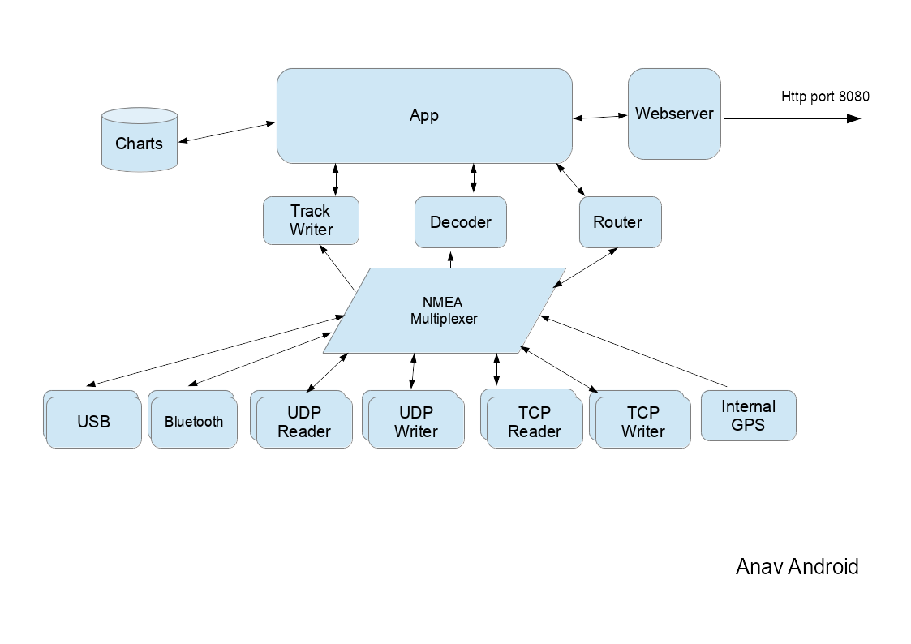
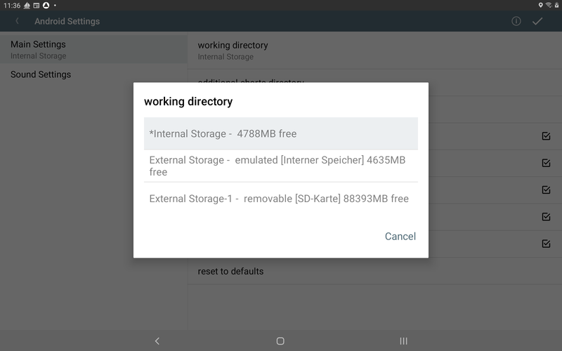
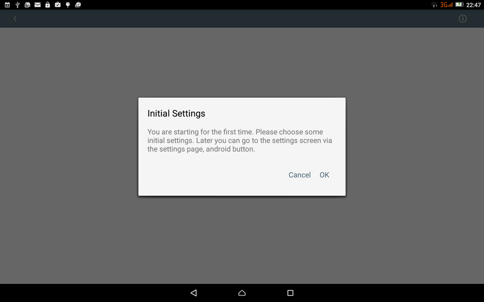
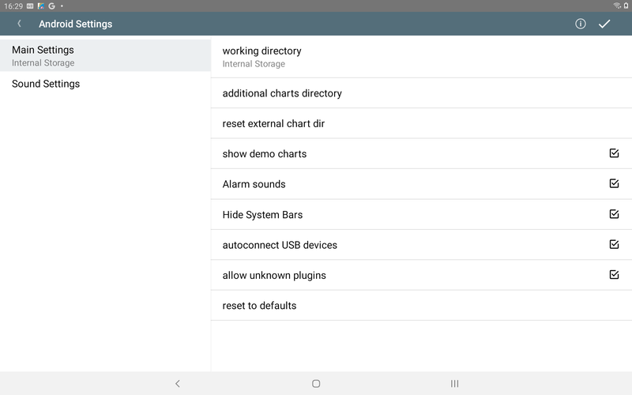
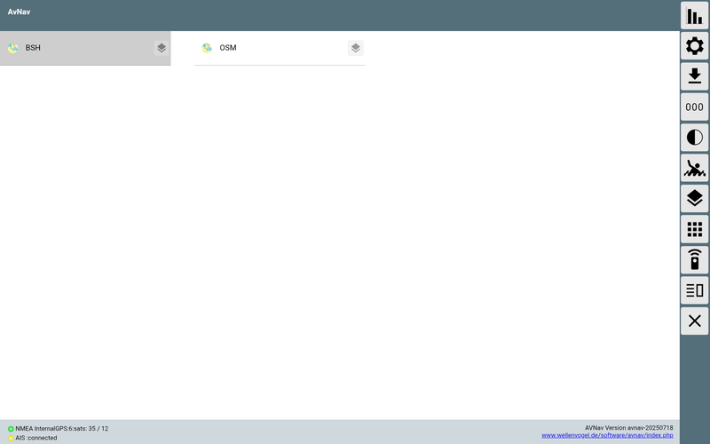
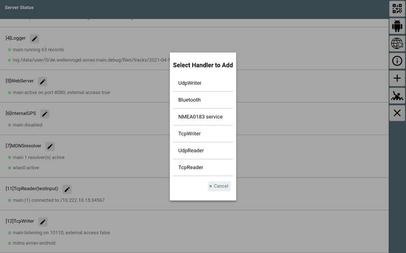
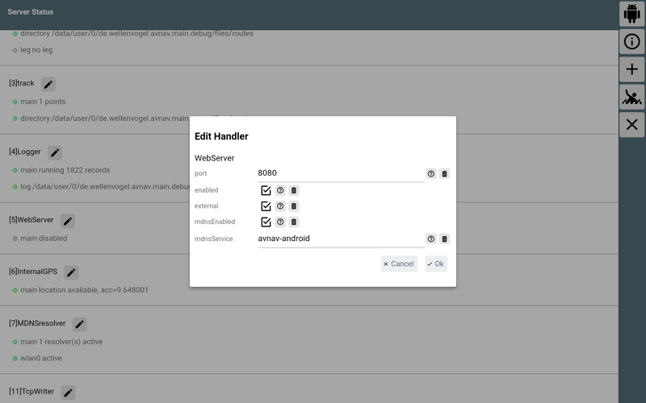
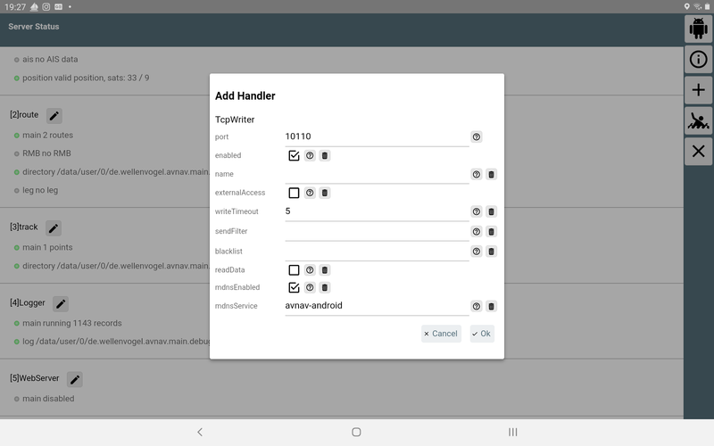
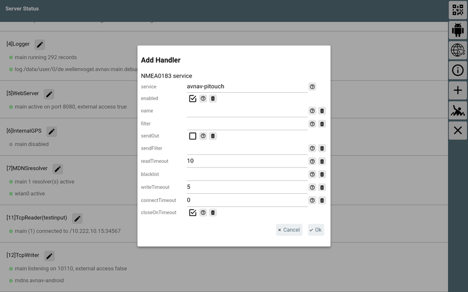
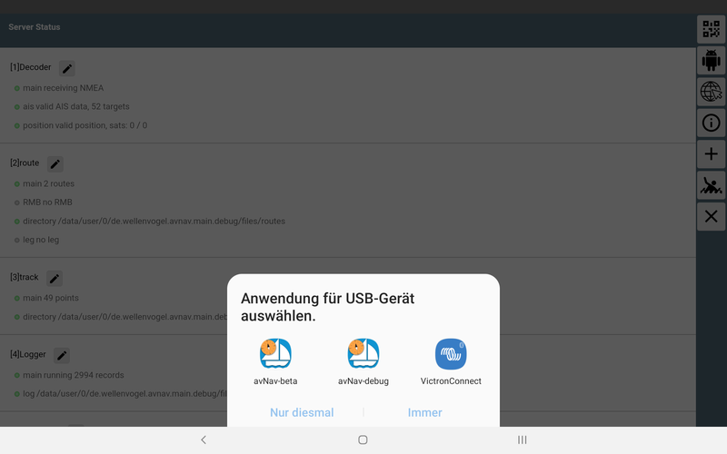

AvNav-Android

AvNav Android
=============

Nachdem die Navigations-App für die [Nutzung
mit dem Raspberry Pi](../beschreibung.md)  bereits einige Jahre erfolgreich im
Einsatz ist, gibt es jetzt auch eine Version, die direkt (ohne einen
Raspberry) auf Geräten mit Android läuft, z.B Tablets oder Handys. Sie
erfordert Android ab 4.4 (KitKat).

Die aktuellste Version kann man unter [Downloads](../../downloads/release/latest)
herunterladen oder im [AppStore](https://play.google.com/store/apps/details?id=de.wellenvogel.avnav.main).  
Ältere Versionen oder "daily builds" findet man über die [Installationsbeschreibung](../install.md).

Sie verpackt im Wesentlichen die Web App (siehe [Beschreibung](../userdoc/index.md))
in eine Android Applikation - siehe dort auch die Verfahren zum [Erzeugen/Konvertieren](../charts.md)
der Karten.

Funktion
--------

(neu ab 20210424)

Die App besteht intern aus mehreren Funktionsblöcken .

Der NMEA-Multiplexer verarbeitet NMEA0183-Daten von den verschiedenen
Quellen. Neben dem internen Geräte-GPS können die Daten von Quellen wie
TCP-Verbindungen, UDP Ports, USB-Geräten oder Bluetooth-Verbindungen
kommen. Die meisten Quellen unterstützen das gleichzeitige Senden und
Empfangen von Daten. Es können jeweils mehrere Quellen des gleichen Typs
konfiguriert werden (in der App-Konfiguration existiert für jede Quelle
ein sogenannter "Handler").

|  |  |
| --- | --- |
| Name in der App | Beschreibung |
| InternalGPS | Die Daten des internen GPS werden als NMEA-Daten eingespeist. |
| TcpReader | Eine TCP-Verbindung zu einem externen System. AvNav ist dabei ein TCP-Client und öffnet die Verbindung.  Als Adresse kann sowohl eine IP-Adresse, als auch ein Hostname angegeben werden. Auch ein mDNS-Name wie avnav.local kann benutzt werden. |
| TcpWriter | AvNav ermöglicht es einer anderen App oder einem anderen System, sich zu verbinden und Daten zu empfangen. AvNav ist hier der TCP-Server. |
| UdpReader | AvNav empfängt UDP-Daten auf dem konfigurierten Port. |
| UdpWriter | AvNav sendet UDP-Daten zur konfigurierten Adresse und zum konfigurierten Port. |
| UsbConnection | Daten können über einen angeschlossenen USB-Seriell-Wandler gesendet umd empfangen werden. Das erfordert allerdings USB-OTG-Funktionalität auf dem Gerät. |
| Bluetooth | Eine Verbindung zu einem Bluetooth-Gerät. Das Pairing des Gerätes muss vorher außerhalb von AvNav erfolgen. |
| NMEA0183 service | Eine Verbindung zu einem System, das seine NMEA0183-Daten als TCP-Service über mDNS (Bonjour/[Avahi](https://de.wikipedia.org/wiki/Avahi_%28Software%29)) bereit stellt.   AvNav öffnet eine TCP-Verbindung zu einem solchen Gerät. |

  

Der NMEA-Multiplexer kann sehr flexibel konfiguriert werden. Zu jeder
Verbindung lassen sich Eingangs- und Ausgangsfilter festlegen.

Der Multiplexer reicht intern die Daten auch an die anderen Bereiche der
App weiter. Der Dekoder bereitet die Daten dann für die Nutzung innerhalb
der App auf.

Die eigentliche App mit der Kartendarstellung und den Anzeigen kann
einerseits ganz normal als Android-App genutzt werden. Parallel dazu kann
der integrierte Webserver aktiviert werden. Das ermöglicht den Zugriff mit
einem Browser von weiteren Geräten aus, so wie auch in der [Server-Variante](../beschreibung.md).

Der Anzeige-Teil der App kann beendet werden, sodass der Multiplexer
allein im Hintergrund weiter läuft. Damit kann AvNav auch genutzt werden,
um NMEA-Daten für andere Android-Apps bereitzustellen. In AvNav
konfiguriert man dazu einen TcpWriter, in den zugreifenden Apps verbindet
man sich über die Adresse 127.0.0.1 und den vorher konfigurierten Port).

Karten und gespeicherte Daten (Arbeitsverzeichnis)
--------------------------------------------------

AvNav speichert alle
seine Daten und die Karten in einem Arbeitsverzeichnis.

Von den Android Einstellungen kann man das Arbeitsverzeichnis (working
directory) auswählen (erweitert ab 20250822).

Je nach Gerät können Sie verschiedene Speicherorte für Ihre Daten
auswählen (technische Informationen finden Sie in der [Android-Dokumentation](https://developer.android.com/training/data-storage/app-specific?hl=de)).
Wenn Ihr Gerät über eine SD-Karte verfügt, wird die oben gezeigte Auswahl
angezeigt:

|  |  |
| --- | --- |
| Name | Erklärung |
| Internal Storage | Dies ist ein Speicherort im internen Flash-Speicher Ihres Geräts. Er ist vollständig privat und (sofern Ihr Gerät nicht gerootet ist) nicht für andere Apps wie z. B. einen Dateimanager zugänglich.  Dies ist die Standardeinstellung. Es ist auch in Versionen vor 20250822 verfügbar.  Das "\*" vor dem Eintrag zeigt an, dass dieses Verzeichnis bereits als Arbeitsverzeichnis verwendet wurde und Daten enthält. |
| External Storage | Dieser Speicher befindet sich weiterhin im internen Flash-Speicher, wird jedoch vom Android-System anders behandelt (und daher als "extern - emuliert" bezeichnet). Andere Apps können auf diesen Speicherort zugreifen.  Sie können diesen Speicherort auswählen, wenn andere Apps (z. B. ein Dateimanager) auf die Daten zugreifen sollen (er ist auch vor 20250822 verfügbar). Der Pfad für einen Dateimanager lautet typischerweise [interner Speicher]/Android/data/de.wellenvogel.avnav.main/files (oder [interner Speicher]/Android/data/de.wellenvogel.avnav.main.beta/files für eine Beta-Version). |
| External Storage-1 | Dieser Pfad ist nur sichtbar, wenn Ihr Gerät eine SD-Karte installiert hat. Als Erklärung wird auch „removable [SD-Karte]“ angezeigt.  Falls verfügbar, befindet sich dieses Verzeichnis tatsächlich auf einer externen SD-Karte. Wenn Sie es verwenden möchten, muss die SD-Karte immer installiert ist, wenn AvNav läuft. Falls die SD Karten entfernt wird, während AvNav läuft, kann es zum Absturz kommen.  Andere Apps wie ein Dateimanager können auf die Daten zugreifen.  Der Speicherort ist [SD-Karte]/Android/data/de.wellenvogel.avnav.main/files (oder [SD-Karte]/Android/data/de.wellenvogel.avnav.main.beta/files).  Nicht verfügbar vor Version 20250822. |

Wenn man das Arbeitsverzeichnis ändert, werden alle Ihre Daten im alten
Arbeitsverzeichnis für AvNav unsichtbar (sie bleiben jedoch verfügbar und
man kann jederzeit zum alten Verzeichnis zurückkehren).

Beim Start von AvNav wird geprüft, ob das ausgewählte Arbeitsverzeichnis
noch verfügbar ist (und man wird aufgefordert, ein anderes auszuwählen,
falls nicht).

Für externe Verzeichnisse kann man grundsätzlich einen Dateimanager
verwenden, um Daten dorthin und von dort zu kopieren. AvNav erkennt diese
Daten jedoch potentiell nicht, wenn es gerade läuft. Daher empfiehlt es
sich, die Daten direkt in der App hochzuladen. Man kann aber z.B. eine
Zip-Datei mit diesen Daten als Backup erstellen.

Alle WorkDir-Verzeichnisse werden geleert, wenn man AvNav deinstalliert
(oder die Daten bereinigt).

Wichtiger Hinweis: Einstellungen (z. B. die Konfiguration des
Multiplexers und andere Android-Einstellungen) werden nicht im WorkDir
gespeichert.

Wenn man ein zusätzliches Kartenverzeichnis wählt, befindet sich dieses
außerhalb von AvNav. Dort kann man Karten im Gemf- oder XML-Format
speichern. Dieses Verzeichnis kann außerhalb von AvNav erstellt und
aufgerufen werden. Es wird bei der Deinstallation von AvNav oder beim
Entfernen der Daten nicht berührt.

Karten müssen im Gemf- [Format](../charts.md#chartformats)
verfügbar sein. Seit dem 20200305 sind auch "mbtiles"- oder
"\*.xml"-Dateien möglich.

Kopieren Sie die Karten entweder in das "Zusätzliche Kartenverzeichnis"
(nur Gemf oder XML) oder [laden Sie
sie in die App hoch](../userdoc/downloadpage.md). Einige Demo-Karten sind vorinstalliert,
benötigen aber eine Online-Verbindung.  
Um O-Charts (oder S57-Karten) zu verwenden, muss man  [avocharts](../hints/ochartsng.md#android)
installieren und die Karten dort installieren.

Benutzung
---------

Nach dem erstmaligen Start der App befindet man sich auf einer
Einführungsseite:

  
Nach dem Klick kommt man auf die Einstellungsseite:  
  
Hier können neben anderen Einstellungen z. B. das interne oder externe
Arbeitsverzeichnis gewählt sowie das externe Karten-Verzeichnis gesetzt
werden.  
Außerdem können hier auch alle Einstellungen zurückgesetzt werden.  
Eine Liste aller Einstellungen findet sich [hier](#Settings).  
Die Einstellungen für die NMEA-Datenquellen und einige weitere erreicht man
in der App über die ["Server/Status"-Seite](../userdoc/statuspage.md)
.  

Die "Settings"-Seite kann über den "OK"-Button (oben rechts) oder über
den "Zurück"-Button verlassen werden.   
Immer wenn die Einstellungen verlassen werden, prüft AvNav, ob die
notwendigen Berechtigungen erteilt wurden.  
AvNav braucht die folgenden Berechtigungen:

* genauer Standort (GPS) während der Nutzung der App
* Benachrichtigungen für eine Anzeige, dass AvNav läuft, auch wenn es im
  Hintergrund ist

Zusätzlich prüft AvNav, ob der Energiesparmodus aktiv ist. Falls ja, kann
AvNav im Hintergrund nicht das interne GPS des Gerätes nutzen. AvNav zeigt
dann eine Warnung an.

Anschließend wird die [Hauptseite](../userdoc/mainpage.md)
der App aufgerufen. Beim ersten Start erhält man vorher noch einen Dialog,
um den Nutzungsbedingungen zuzustimmen, und es wird eine Liste der zur
Verfügung stehenden Layouts zur Auswahl angeboten.

Das Bild zeigt den Empfang einer gültigen Position (oberer grüner Punkt),
aber bisher keinen Empfang von gültigen AIS-Daten (unterer gelber Punkt).  
Um zu den Android Einstellungen zu gelangen, muss zunächst die [Einstellungsseite](../userdoc/settingspage.md)
in der App aufgerufen werden, dort klickt man dann auf den "Android"-Button.  
Bei weiteren Starts erreicht man sofort die Hauptseite der App.  
Für eine Beschreibung der Benutzung siehe [hier](../userdoc/mainpage.md).  
  

Externer Zugriff
----------------

(neu ab 20210424).

Die App ermöglicht es, dass man sich mit einem Browser von anderen
Geräten verbinden kann. Dazu muss in der App der Web-Server aktiviert
werden ([Status/Server Seite](../userdoc/statuspage.md) ).  
Bei der Aktivierung des Web-Servers muss zunächst "externalAccess"
aktiviert werden. Mit "mdnsEnabled wird dafür gesorgt, dass sich eine
Bonjour-fähige App (z.B. [BonjourBrowser](https://play.google.com/store/apps/details?id=de.wellenvogel.bonjourbrowser))sich
mit dem Server der App verbinden kann.

In älteren Versionen hat die App dafür 2 Modi genutzt.

 

* Normal
* External Browser

 Im Normal-Modus ist der Browser in die App
integriert, sie wird wie eine normale Android-App genutzt.  
Im "External-Browser"-Modus startet die App einen kleinen Webserver über
einen einstellbaren Port (voreingestellt: 34567).  
  
  

Hintergrund
-----------

Der NMEA-Multiplexer und auch der Web-Server von AvNav können ohne
Anzeige nur im Hintergrund laufen. Das kann genuzt werden, wenn die
Anzeige für Benutzer auf einem anderen Gerät erfolgen soll - oder wenn
eine andere App für die Navigation genutzt wird und nur der Multiplexer
von AvNav benötigt wird.  
Dazu wird nach dem Start auf der Hauptseite über {{BT("MainExit")}}der Beenden-Dialog aufgerufen und dort
"BACKGROUND" ausgewählt.  
Über die Benachrichtigung (in der Android-Nachrichtenzeile) kann die App
wieder in den Vordergrund geholt - oder direkt beendet werden.

  

Einstellungen {: #Settings}
---------------------------

Die Einstellungen gliedern sich in zwei Teile:

* Spezielle Android-Einstellungen
* Einstellungen für den Multiplexer und andere Hauptbestandteile

Die Android-Einstellungen erreicht man über den {{BT("StatusAndroid")}}Button auf der [Einstellungsseite](../userdoc/settingspage.md)
bzw. der [Server/Status](../userdoc/statuspage.md) Seite.

### Android Main Einstellungen

|  |  |  |
| --- | --- | --- |
| Name | Bedeutung | Default |
| working directory | man kann auswählen, wo das AvNav [Arbeitsverzeichnis](#workingdirectory) liegen soll (internal storage oder external storage) | internal storage |
| additional charts directory | ein zusätzliches Kartenverzeichnis, das sinnvollerweise auf einer externen SD-Karte angelegt werden sollte | --- |
| reset external chart dir | setze das zusätzliche Kartenverzeichnis zurück |  |
| show demo charts | Anzeige der Demo-Karten. Das erfordert eine aktive Internetverbindung) | ein |
| Alarm-Sounds | Hier können die durch den Server erzeugten Alarm-Sounds abgeschaltet werden. Im Browser müssen diese ggf. zusätzlich abgeschaltet werden. | ein |
| Hide System Bars | Verberge die Android Kopf- und Fußzeile | ein |
| autoconnect USB devices | Wenn eingeschaltet wird AvNav gestartet, sobald ein unterstütztes USB-Gerät verbunden wird. Falls dieser Schalter ausgeschaltet ist, kann man USB-Geräte auch über den + Button auf der Server/Status Seite konfigurieren. | ein |
| allow unknown plugins | AvNav hat ein (experimentelles) Plugin Interface, das es anderen Apps ermöglicht, AvNav über bereitgestellte Funktionen zu informieren (im Moment nur Karten). Mit diesem Schalter können das auch Plugins, die noch nicht in AvNav bekannt sind. Anmerkung: avocharts benötigt das nicht. | ein |
| reset to defaults | Rücksetzen der Multiplexer-Einstellungen auf Default-Werte |  |

### Android Sound-Einstellungen

|  |  |  |
| --- | --- | --- |
| Name | Bedeutung | Default |
| Sound for XXX alarm | Hier kann der Ton für die verschiedenen Alarme gewählt werden |  |
| reset to defaults | Rücksetzen der Sound-Einstellungen auf Defaults |  |

### Multiplexer Einstellungen {: #MuxConfig}

(neu ab 20210424)

Die Einstellungen für den Multiplexer sind auf der [Status/Server
Seite](../userdoc/statuspage.md) verfügbar.
Für jede Funktion, z.B. für jede Quelle im Multiplexer, ist ein
sogenannter "Handler" vorhanden, der hier konfiguriert werden kann.

Weitere Quellen können über den {{BT("StatusAdd")}}Button hinzugefügt werden. Es werden dann die
Handler angeboten, die möglich sind, z.B. wird "UsbConnection" nur
angezeigt, wenn auch ein USB-Gerät angeschlossen ist.

Neben den angezeigten Handlern in der Statusübersicht existiert im
Normalfall ein {{BT("WpEdit")}}Button,
mit dem man den Handler bearbeiten kann.  
Die im Bearbeitungs-Dialog angezeigten Parameter haben meist einen {{BT("Help")}} Button, über den eine Hilfe angezeigt wird. Mit dem Button {{BT("SettingsDefaults")}}kann
der jeweilige Parameter auf seinen Default-Wert zurückgesetzt werden.

Einige Parameter tauchen bei mehreren Handlern auf:

|  |  |  |
| --- | --- | --- |
| Name | Beschreibung | default |
| enabled | aktviert/deaktiviert diesen Handler | je nach Handler |
| name | Name für den Handler. Dieser kann in Blacklists verwendet werden. | leer |
| port | TCP- oder UDP-Port |  |
| filter/readerFilter/ sendFilter | Das ist ein NMEA-Filter. Hier kann definiert werden, welche NMEA-Daten durchgelassen werden sollen. Mehrere Filter werden durch ein Komma (,) getrennt. Für Datensätze, die mit dem Dollarzeichen ($) beginnen, werden die nächsten beiden Zeichen ignoriert (die Talker-Id). Ein Filter für alle RMC-Sätze sieht z.B. so aus:  $RMC  Ausschließlich für alle AIS-Daten:  !  Alle RMC- und RMB-Sätze:  $RMC,$RMB  Falls der Filter negiert werden soll, muss ein ^ dem Ausdruck vorangestellt werden.  ^$RMB,^$APB | leer |
| blacklist | eine durch Kommas (,) getrennte Liste von Namen. NMEA-Daten von diesen Quellen werden nicht ausgesendet. |  |
| priority | Falls dieser Handler Daten liest (oder erzeugt), werden sie vom Dekoder potenziell gelesen und in den internen Speicher von AvNav geschrieben. Falls mehrere Handler die gleichen Daten liefern (z.B. Position), muss entschieden werden, welche davon in den internen Speicher geschrieben werden sollen. Dazu wird diese Einstellung genutzt. Daten mit höherer Priorität gewinnen. |  |
| queueAge | AvNav hat eine interne Warteschlage (queue), die empfangene Daten aufnimmt und an die Ausgänge weiterreicht. Wenn ein Ausgang zu langsam ist, kann er potenziell nicht alle einlaufenden Daten sofort weiterleiten und diese verbleiben längere Zeit in der Warteschlange. Wenn die Daten älter sind als die hier eingestellte Zeit (in ms), werden sie aus der Warteschlange gelöscht. | 3000 |

Die vorhandenen "Handler" und ihre Parameter. Es werden nur die
spezifischen Parameter beschrieben.

#### Decoder

|  |  |  |
| --- | --- | --- |
| Parameter | Beschreibung | default |
| ownMMSI | eigene MMSI, diese wird in der AIS-Anzeige ausgeblendet | leer |
| posAge | erlaubtes Alter für die GPS-Position (in sec), nach dieser Zeit wird der Eintrag gelöscht, wenn keine neuen GPS-Daten empfangen wurden | 10 |
| nmeaAge | erlaubtes Alter für NMEA-Daten (in sec), die keine Positionsdaten enthalten | 600 |
| aisAge | erlaubtes Alter für AIS-Daten (in sec) | 1200 |

#### Route

|  |  |  |
| --- | --- | --- |
| Parameter | Beschreibung | default |
| computeRMB | erzeuge NMEA-RMB-Datensätze, wenn ein Routing aktiv ist. | an |
| computeAPB | rezeuge NMEA-APB Datensätze, wenn ein Routing aktiv ist | an |
| useRhumbLine | setze den [Routing Mode](../quickstart.md#routes) auf rhumbLine | aus |
| nextWpMode | setze den [Modus zum Wegepunkt Weiterschalten](../quickstart.md#routes) - late/early/90 | late |
| nextWpTime | im Modus "early" die Zeit (in s) nach dem Wegepunkt-Alarm bis zum Weiterschalten auf den nächsten Wegepunkt | 10 |

#### Track

|  |  |  |
| --- | --- | --- |
| Parameter | Beschreibung | default |
| interval | Intervall (in sec) für das Schreiben des Tracks als "gpx"-Datei. | 300 |
| distance | Minimaler Abstand (in m), bevor ein neuer Trackpunkt geschrieben wird | 25 |
| minTime | Minimale Zeit (in sec), bevor ein neuer Trackpunkt geschrieben wird | 10 |
| length | Länge des angezeigten Tracks in Stunden (h). | 25 |

#### Logger

NMEA-Logger

#### WebServer

|  |  |  |
| --- | --- | --- |
| Parameter | Beschreibung | default |
| port | der TCP-Port, auf dem der Server Verbindungen annimmt. | 8080 |
| external | Wenn aktiv, dann können sich auch andere Geräte verbinden (sonst nur auf dem eigenen Gerät).   Hinweis: Dieser Parameter sollte mit Vorsicht und nur in vetrauenswürdigen Netzen aktiviert werden. Innerhalb der App gibt es keinen weiteren Schutz! | aus |
| mdnsEnabled | macht den Service per "mDNS" (Bonjour) bekannt. | an |
| mdnsService | Der Name, unter dem die App per mDNS/Bonjour erreichbar ist. | avnav-android |

#### InternalGPS

Das GPS des Gerätes.

#### MDNSResolver

Der Handler für die Auflösung und das Bekanntmachen von "mDNS"
(Bonjour/Avahi) Services.

#### Remote Channel

Der Handler für die [Fernsteuerung](../hints/RemoteControl.md)
.

#### TcpReader

|  |  |  |
| --- | --- | --- |
| Parameter | Beschreibung | default |
| ipAddress | Die IP-Adresse oder der Hostname für den Server, der kontaktiert werden soll. Das kann auch ein mDNS Name wie z.B. avnav.local sein. | --- |
| port | Der Ip-Port, zu dem eine Verbindung aufgebaut werden soll. | --- |
| sendOut | Wenn aktiviert, werden auch NMEA-Daten gesendet. Ansonsten wird nur emfangen. | aus |
| readTimeout | Markiere die Verbindung als inaktiv, wenn keine Daten nach der eingestellten Zeit (sec) eingegangen sind. | 10 |
| writeTimeout | Schließe die Verbindung, wenn ein NMEA-Datensatz nicht innerhalb der eingestellten Zeit (sec) geschrieben werden konnte. | 5 |
| connectTimeout | Timeout für den Verbindungsaufbau (in sec, 0 = System-default) | 0 |
| closeOnTimeout | Schließe die Verbindung und öffne sie erneut, wenn das readTimeout erreicht wird. | an |
| stripLeading | entfernt alle Zeichen in einer empfangenen Zeile vor einem ! oder $ | aus |

#### TcpWriter

Ein TCPWriter stellt die NMEA-Daten für andere Anwendungen bereit.

|  |  |  |
| --- | --- | --- |
| Parameter | Beschreibung | default |
| port | Der Port, auf dem der Server Verbindungen annimmt | --- |
| externalAccess | Wenn aktiv, können sich auch andere Geräte verbinden. Andernfalls können sich nur Apps auf dem selben Gerät verbinden. | aus |
| writeTimeout | Schließe die Verbindung, wenn ein NMEA-Datensatz nicht innerhalb der eingestellten Zeit (sec) geschrieben werden konnte. | 5 |
| readData | Wenn aktiv, empfängt AvNav auch NMEA-Daten über eine aufgebaute Verbindung | aus |
| stripLeading | entfernt alle Zeichen in einer empfangenen Zeile vor einem ! oder $ (nur wenn readData aktiv ist) | aus |
| sendOwn | Sende Daten, die auf der gleichen Verbindung empfangen wurden (nur sichtbar, wenn readData an ist). Normalerweise sollte man das nicht einschalten, weil man sonst sehr leicht Schleifen erzeugen kann. | an |
| mdnsEnabled | mache den Service per mDNS im Netz bekannt (type: \_nmea-0183.\_tcp) | aus |
| mdnsService | Der Name, unter dem dieser Server per mDNS erreichbar ist |  |

#### UdpReader

Ein UDP-Reader empfängt Daten von anderen Apps/Systemen.

|  |  |  |
| --- | --- | --- |
| Parameter | Beschreibung | default |
| port | der UDP-Port, auf dem Daten empfangen werden | --- |
| externalAccess | wenn aktiv, können Daten von anderen Geräten empfangen werden, sonst nur innerhalb des selben Gerätes. | aus |
| readTimeout | zeige die Verbindung als inaktiv, wenn für die eingestellte Zeit (sec) keine Daten empfangen wurden. | 10 |
| stripLeading | entfernt alle Zeichen in einer empfangenen Zeile vor einem ! oder $ | aus |

Wichtiger Hinweis: Aufgrund von
Einschränkungen des Android Systems können UDP Nachrichten an eine
Broadcast-Adresse nicht empfangen werden, wenn das Gerät in den
Standby-Modus (Bildschirm aus) geht. Nachrichten direkt an die IP Adresse
des Gerätes werden auch im Standby weiterhin empfangen. Falls also solche
Broadcast UDP Sender genutzt werden sollen, muss des Gerät aktiv bleiben.
Man kann aber den {{BT("Dim")}}Dim Button in AvNav nutzen um die
Hintergrundbeleuchtung zu dimmen und den Stromverbrauch zu reduzieren.
Siehe auch das [GitHub
Issue #510](https://github.com/wellenvogel/avnav/issues/510).

#### UdpWriter

Ein UDP-Writer sendet NMEA-Daten per UDP an eine andere App.

|  |  |  |
| --- | --- | --- |
| Parameter | Beschreibung | default |
| ipaddress | die IP-Adresse oder der Hostname des Ziel-Computers. Es kann auch ein mDNS-Name wie "avnav.local" genutzt werden. | --- |
| port | Der Ziel-Port , an den Daten gesendet werden sollen | --- |
| broadcast | Sende die Daten als Broadcast, die IP-Adresse muss dann eine gültige Broadcast-Adresse sein. | aus |

#### NMEA0183Service

Ein NMEA0183-Service arbeitet im Wesentlichen wie ein TcpReader.
Allerdings werden hier nicht Zieladresse und Port vorgegeben. Stattdessen
wird der Name eines (mDNS) Services (type: \_nmea-0183.\_tcp) aus einer
Liste der verfügbaren Services gewählt. Falls z.B. im Netz ein
SignalK-Server oder ein AvNav-Server (> 20210415) vorhanden sind, geben
diese ihre NMEA-Ausgänge auf diese Weise im Netzwerk bekannt.  
Der Vorteil ist, dass auch bei Wechsel des Netzwerkes der Zugriff im
Normalfall wieder funktionieren wird und Verbindungen so automatisch
wieder aufgebaut werden können.

|  |  |  |
| --- | --- | --- |
| Parameter | Beschreibung | default |
| service | der Name des Service (Auswahl aus der Liste der gefundenen) | --- |
| sendOut | sende NMEA-Daten auf dieser Verbindung |  |
| readTimeout | Markiere die Verbindung als inaktiv, wenn keine Daten nach der eingestellten Zeit (sec) aufgelaufen sind. | 10 |
| writeTimeout | Schließe die Verbindung, wenn ein Satz nicht innerhalb der eingestellten Zeit (sec) geschrieben werden konnte | 5 |
| connectTimeout | Timeout für den Verbindungsaufbau (in sec, 0 = System-default) | 0 |
| closeOnTimeout | Schließe die Verbindung und öffne sie erneut, wenn das readTimeout erreicht wird. | an |

#### UsbConnection

AvNav wird aktiv, wenn ein USB-Gerät angeschlossen wird (wenn man das in
den Einstellungen aktiviert hat). Es ist daher sinnvoll, zunächst AvNav zu
starten und danach das USB-Gerät anzuschließen. Das Gerät kann dann direkt
so konfiguriert werden, dass AvNav immer auf dieses Gerät zugreifen darf.
AvNav startet dann sofort den Dialog zur Konfiguration des Gerätes.

|  |  |  |
| --- | --- | --- |
| Parameter | Beschreibung | default |
| device | Das angeschlossene USB-Gerät, genauer: der Anschluss des Gerätes, Auswahl aus einer Liste | --- |
| baud rate | Die Baudrate | 9600 |
| flowControl | none|xon/xoff|rts/cts - Auswahl der Flusssteuerung (muss vom Adapter unterstützt werden) | none |
| sendOut | sende NMEA-Daten auf dieser Verbindung | aus |
| readTimeout | Markiere die Verbindung als inaktiv, wenn keine Daten nach der eingestellten Zeit (sec) aufgelaufen sind. | 10 |

#### Bluetooth

Zum Verbinden z.B.  mit einem Bluetooth-GPS. Das Gerät muss zunächst
über die Bluetooth-Einstellungen des Android-Geräts verbunden werden
("pairen").  

|  |  |  |
| --- | --- | --- |
| Parameter | Beschreibung | default |
| device | Das Bluetooth-Gerät. Bei der Einrichtung werden alle Geräte angeboten, die bereits bekannt sind, erst danach wird versucht, das Gerät zu erreichen. | --- |
| sendOut | sende NMEA-Daten auf dieser Verbindung | aus |
| readTimeout | Markiere die Verbindung als inaktiv, wenn keine Daten nach der eingestellten Zeit (sec) aufgelaufen sind. | 10 |