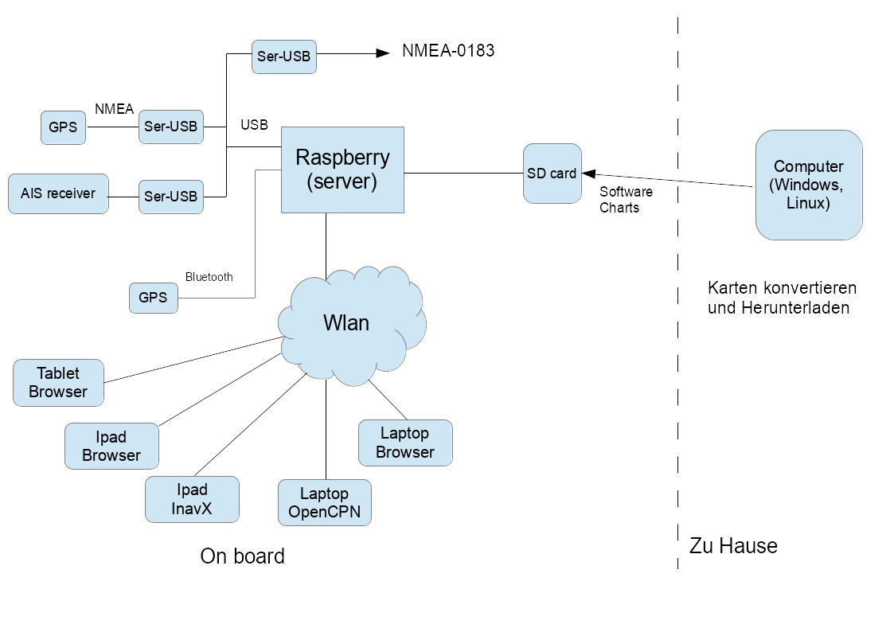
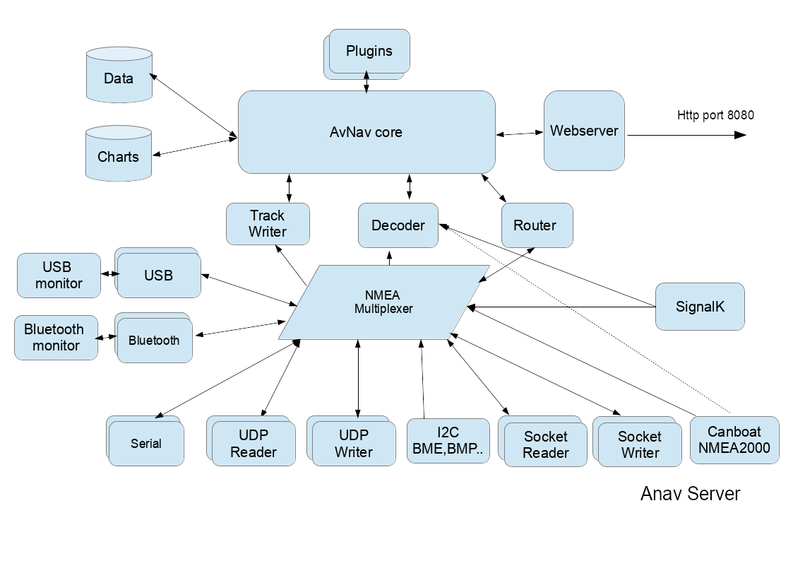

Beschreibung avNav

Navigation im Browser
=====================

AvNav ist eine kostenlose Navigationssoftware für Sportbootfahrer. Wie
andere Anwendungen in diesem Bereich kann man elektronische Seekarten
laden und mit angeschlossenen GPS-Geräten schauen, wo sich das eigene Boot
befindet. Es ist natürlich möglich, Marker zu setzen, Routen zu erstellen
und AIS-Signale einzubinden. Besonderes Merkmal von AvNav ist das
Serverkonzept: AvNav lässt sich auf einem Raspberry oder einem
Windows-Gerät installieren und als Navigationszentrale betreiben, die alle
relevanten Daten einsammelt und Seekarten bereit stellt. Der Zugriff auf
den Server im Boots-Netz und damit die eigentliche Darstellung von Karten
und Daten läuft auf einem Webbrowser und ist so unabhängig vom jeweiligen
Betriebssystem der zugreifenden Geräte. AvNav ist konsequent für die
Bedienung per Touchscreen ausgelegt. Darüber hinaus bietet AvNav die
Möglichkeit, für jedes Gerät, das man benutzen möchte, Layouts zu
definieren, um so das Aussehen der App z.B. auf unterschiedliche
Bildschirmgrößen anzupassen.

Karten
------

Einmal können Rasterkarten, die nicht herstellerverschlüsselt sind,
verwendet werden. Vektorkarten des Typs OESenc können ebenfalls genutzt
werden. Sie sind allerdings nicht kostenlos und können über den
O-Charts-Shop bezogen werden. Für Details siehe unter [Karten](charts.md).

Varianten
---------

Es gibt nicht nur die Server-Variante von AvNav: Ebenfalls zur Verfügung
stehen ein „StandAlone-AvNav“ für den Raspberry (AvNav Touch) und eine
Android-App. Eine Besonderheit ergibt sich beim Einsatz eines
OpenPlotter-Image auf einem Raspberry: Die Installationsvariante „AvNav
für Openplotter“ sorgt automatisch für die richtigen Verbindungen zwischen
dem Herzstück von Openplotter, dem SignalK-Server und AvNav. Die gesamte
Software steht zum Download unter einer Open Source Lizenz bereit.

Für einen schnellen Einstieg: [Quickstart](quickstart.md)

16.07.2025

* [Komplette
  Dokumentation als PDF](../downloads/de_AvNavDoc.pdf)
* [YouTube
  Videos](https://www.youtube.com/playlist?list=PLxNyj_GYzonmrSgnqtHogY7XK-TANk6q3)
* [AvNav
  auf der Boot 2020 in Düsseldorf bei open-boat-projects](https://open-boat-projects.org/ "open-boat-projects")
* Datenschutz: [english](../viewern/privacy-en.md),[deutsch](../viewern/privacy-de.md)
* [Thread
  im Segeln Forum](https://www.segeln-forum.de/thread/43757-raspberry-pi-als-bordcomputer-spielzeug-f%C3%BCr-den-winter/)
* [Source Code auf GitHub](https://github.com/wellenvogel/avnav)
* [Nutzer-Beschreibung](userdoc/index.md)
* [Android App](android/android.md)
* [Karten](charts.md)
* [Installation](install.md)
* [Release-Notes](release.md)
* [Demo](demo.md)
* [Foliensatz(PDF)](./AvNavPraesi.pdf)

Ein Hinweis vorweg:

***Ich kann keine Garantie für die Funktion der App übernehmen,
insbesondere die Nutzung zu Navigationszwecken geschieht auf eigenes
Risiko. In jedem Falle empfehle ich einen intensiven Test der
Genauigkeit der Darstellung und des verwendeten Kartenmaterials.***

Überblick
---------

avnav-raspi-2020  
Wie im Bild zu sehen, besteht die gesamte Lösung aus mehreren Teilen:

* Raspberry Pi mit einer Server-Software, die die angeschlossenen
  Geräte abfragt, die Daten aufbereitet und per WLAN zur Verfügung
  stellt
* Software für Windows/OSx/Linux, die zum Vorbereiten und Konvertieren
  der Karten dient

Über ein WLAN, das der Raspberry Pi als Access Point bereitstellt, können
verschiedene Geräte auf die Daten zugreifen. Dabei gibt es mehrere
Varianten:

* Variante 1: Auf den Geräten (z.B. Ipad oder Laptop) kann eine
  Navigationssoftware laufen (getestet: InavX,OpenCPN), diese greift
  über TCP auf die NMEA-Daten zu. Navigationssoftware und Karten müssen
  natürlich auf den Geräten installiert sein.
* Variante 2: Auf den Geräten läuft nur ein Browser, die Navigation
  erfolgt per Java Script App, die vom Raspberry bereitgestellt wird.
  Dazu muss nur die entsprechende URL aufgerufen werden. In diesem Fall
  ist auf den Geräten keine Software installiert, nur ein aktueller
  Browser muss vorhanden sein (getestet: Chrome unter Windows, OSX,
  Safari, Android ab 4.x – Chrom/Stock/Boat Browser, IOS, Blackberry
  stockBrowser, WebBrowser mini).

"Unter der Haube"
-----------------

Die Server Software auf dem Raspberry ist in Python geschrieben und über
eine XML-Datei konfigurierbar - was im Normalfall aber nicht notwendig
sein sollte. Neben dieser Software steht auch ein fertiges Image für den
Raspberry zur Verfügung, das nur noch auf eine SD-Karte installiert werden
muss (Empfehlung: mindestens 8GB, mehr ist besser...).

Die Web Applikation bietet eine  Navigation mit Rasterkarten ([gemf,mbtiles](charts.md#chartformats)) 
oder [OESenc Vektorkarten](hints/ocharts.md) inklusive
AIS-Darstellung, Wegpunkt-Navigation und Routing. Falls die
Web-Applikation verwendet werden soll, müssen die Karten dafür auch auf
dem Raspberry installiert werden.

[OESenc Karten](hints/ocharts.md) können im Shop von [o-charts](https://www.o-charts.org/)
erworben werden.

Karten, die die Software nicht direkt verarbeiten kann (siehe [Karten](charts.md)),
müssen vorher auf dem PC (Windows, Osx, Linux) oder direkt auf dem
Raspberry (innerhalb der App) in das [gemf](http://www.cgtk.co.uk/gemf)
Format [konvertiert](charts.md) werden. Im Wesentlichen
können die folgenden Kartenquellen verarbeitet werden:

* Alle Kartentypen, die die GDAL-Software lesen kann (also insbesondere
  BSB-Karten)
* Mit Mobile Atlas Creator heruntergeladene Karten

Daneben gibt es noch eine [Android-App](android/android.md),
die eine weitgehend identische Funktionalität bereitstellt: Der
Server-Anteil ist hier nativ in Java geschrieben, die Anzeige-Funktionen
sind identisch zur Raspberry-Variante.

In den folgenden Abschnitten gehe ich auf die Funktion der einzelnen
Teile ein wenig genauer ein.

Die Server-Software (avnav\_server.py)
--------------------------------------

Auf dem Raspberry Pi ist zunächst ein[ganz normales Debian Image](http://www.raspberrypi.org/downloads) installiert (ca. 2GB). Dazu kommen einige
Zusatzpakete (Liste siehe unten) und meine AvNav-Software.

Der Hauptbestandteil der Sofware auf dem Raspberry Pi ist ein in Python
geschriebener Server. Im Folgenden beschreibe ich in groben Zügen, was
dieser Server intern tut.

  
  
Der Server versucht, alle am Raspberry angeschlossenen seriellen Geräte zu
erkennen und deren NMEA-Daten zu lesen. Typisch werden die Geräte über
Seriell-USB Wandler angeschlossen (z.B. PL2303). Man muss ein wenig
aufpassen, dass man einen Wandler hat, der vom Raspberry auch sauber
unterstützt wird - siehe z.B. [hier](http://elinux.org/RPi_VerifiedPeripherals#USB_UART_and_USB_to_Serial_.28RS-232.29_adapters).
Da das Verwalten der seriellen Schnittstellen unter Linux etwas magisch
ist, scannt der Server die angeschlossenen Geräte auf eine entsprechende
serielle Klasse und ermittelt deren Schnittstelle (device). Anschliessend
versucht er ein "auto bauding" zwischen 4800 und 34000 Baud und bemüht
sich, NMEA Daten zu erkennen. Falls keine Daten empfangen werden, wird die
Schnittstelle geschlossen und das Spiel beginnt von vorn. Damit „überlebt“
der Server auch das Anschließen/Abstecken von Wandlern während des
Betriebes oder das An- bzw. Abschalten von Geräten. Bei mir hängt ein
RO4800 mit AIS-Decoder an einem Seriell-USB-Wandler, die GPS Daten werden
durchgereicht. Alternativ versucht AvNav auch Kontakt zu seriellen
Bluetooth-Geräten aufzunehmen. Falls die App per "discovery" Geräte
findet, versucht sie, von diesen ebenfalls NMEA-Daten zu lesen. Das wurde
z.B. mit einer Holux GPS Slim236 getestet. In diesem Sinne arbeitet der
AvNav-Server auch als NMEA-Multiplexer.

Alle GPS-Daten werden intern in eine Liste eingefügt und per TCP
bereitgestellt. Verbundene TCP-Empfänger (z.B. OpenCPN) bekommen so jeden
empfangenen Datensatz weitergereicht. Per Default "lauscht" der Server
(intern:SocketWriter) auf Port 34567.

Daneben lassen sich Daten auch per TCP, UDP oder direkt über die
seriellen Schnittstellen des Raspberry lesen und schreiben.

Anschliessend werden die NMEA-Daten an den Decoder weitergereicht. Die
dekodierten GPS- und AIS-Daten werden im Server abgelegt ("NMEA decoded
data") und für den Zugriff per HTTP aus der WebApp bereitgestellt.
Zusätzlich werden die dekodierten Daten auch benutzt, um Trackdateien zu
schreiben.

Über den integrierten WebServer kann der Zugriff auf diese dekodierten
Daten erfolgen (per HTTP GET, Antwort als json).

Der Route Handler wertet eingestellte Routen (bzw. Wegpunkte) aus und
berechnet daraus die Daten für eine Autopilot-Steuerung. Diese werden als
RMB-NMEA-Datensätze wieder in die internen NMEA-Daten eingespeist und
stehen so an allen Schnittstellen zur Verfügung.

Falls gültige GPS-Zeitinformationen empfangen werden, wird die Systemzeit
des Raspberry entsprechend eingestellt.

Auf dem Raspberry gibt es noch einen Service, der den AvNav-Server beim
Systemstart automatisch startet und der es auch ermöglicht, ihn geordnet
zu beenden.

Da der gesamte Server in Python geschrieben ist, kann er auch (vor allem
zu Testzwecken) unter Windows, Osx (Mac) oder Linux laufen. Dazu muss
Python ab 3.7 installiert sein (die Windows-Installation bringt das selbst
mit). Falls reale serielle Daten gelesen werden sollen, muss dazu noch [pyserial](http://pyserial.sourceforge.net/) installiert werden.

Der Server kann in weiten Grenzen durch eine XML-Datei konfiguriert
werden. Für die verschiedenen Nutzungsfälle liegen dokumentierte Beispiele
vor. In den Versionen ab 20210322 können die meisten Einstellungen auch
direkt in der App vorgenommen werden.

Die ausgelieferte avnav\_server.xml-Datei enthält Kommentare, sodass
Anpassungen an die eigenen Bedürfnisse einfach möglich sein sollten.

Die Software ist auf [github](https://github.com/wellenvogel/avnav)
verfügbar - für die Installation sei die separate [Beschreibung
verwiesen.](install.md).

### Software auf dem Raspberry

Auf dem Raspberry ist die Software in der folgenden Verzeichnisstruktur
installiert:

| Verzeichnis | Inhalt |
| --- | --- |
| /usr/lib/avnav | die Software nach der Installation |
| /home/pi/avnav/data/ | Basis für die Nutzer-Daten |
| .../data/charts | Verzeichnis für die Kartendateien -siehe[Karten konvertieren](charts.md). |
| .../data/log | logfiles |
| .../data/tracks | Die trackfiles (gpx). Sie werden pro Tag in einem File gespeichert, ausserdem werden Nmea-Logs aufgezeichnet. |
| .../data/routes | Routen - xxx.gpx und das aktuelle Segment (Leg) currentLeg.json |
| .../data/import | Hier abgelegte Karten werden konvertiert in das "gemf"-Format, sodass die WebApp sie verarbeiten kann |

Bis auf die "systemd"-Scripte läuft die gesamte Software unter dem Nutzer
pi (auf dem Raspberry) oder als beliebiger anderer Nutzer ("avnav" als
default). Die Installation muss allerdings als "root" erfolgen.

Die Web App
-----------

Zur Navigation mit den auf dem Raspberry Pi vorhandenen Karten gibt es eine
Web App. Diese ist mit [ReactJs](https://reactjs.org/)
realisiert.  

Die App kommuniziert mit dem in AvNav integrierten Webserver auf dem Pi.
Die Einstiegsseite ist unter der url [http://avnav.avnav.de/viewer/avnav\_viewer.html](http://avnav.avnav.de/viewer/avnav_viewer.md)
erreichbar. Es ist eine sogenannte „single page app“, d.h. die weitere
Kommunikation mit dem Server geschieht per Ajax durch den
JavaScript-Anteil. Das Layout ist optimiert für die Darstellung auf einem
7 Zoll-Tablet oder größer, bei mir momentan im Einsatz: Nexus 7 am
Navitisch und Blackberry Playbook draussen. Sie läuft aber natürlich auch
auf größeren Tablets (Ipad) oder auf einem Laptop/Desktop. Eine sinnvolle
Nutzung ist ab etwa 900x540 Pixel möglich.

URL Parameter {: #urlParameters}
--------------------------------

Die Web App unterstützt eine Reihe von URL-Parametern, mit denen man
einige Funktionen steuern kann.

|  |  |
| --- | --- |
| Parameter | Beschreibung |
| defaultLayout | Der Name eines existierenden [Layouts](hints/layouts.md), das als initiales Layout genutzt wird. |
| defaultSettings | Der Name einer existierenden Einstellungsdatei (regex möglich). Diese wird genutzt als default, wenn AvNav das erste Mal in diesem Browser für diese URL startet.  Beispiel: defaultSettings=.\*localFirefox |
| fullscreen | Man kann einen Parameter in der Form "server:<command>" angeben. Command muss ein existierendes Kommando sein, das beim  [AVNCommandHandler](hints/configfile.md#AVNCommandHandler) konfiguriert wurde. Das wird ausgeführt, wenn der Fullscreen Button geklickt wird (anstelle der Fullscreen-Funktion im Browser).  Beispiel: fullscreen=server:fullCommand |
| dimm | Man kann einen Parameter in der Form "server:<command>" angeben. Command muss ein existierendes Kommando sein, das beim  [AVNCommandHandler](hints/configfile.md#AVNCommandHandler) konfiguriert wurde. Das wird ausgeführt, wenn der Dimm Button geklickt wird (anstelle der Nutzung einer Dimm-Funktion in Java Script - wie bei AvNav auf Android)  Beispiel: dimm=server:dimmCommand |
| noCloseDialog | Abschalten des Dialogs, der davor warnt, dass die AvNav-Seite verlassen werden soll.  Beispiel: noCloseDialog=true |
| splitMode | Starte AvNav im Split Mode.  Beispiel: splitMode=yes |
| preventAlarms | Zeige keine Alarme.  Beispiel: preventAlarms=true |  |

  
Zur Beschreibung der WebApp [hier](userdoc/index.md).  
  