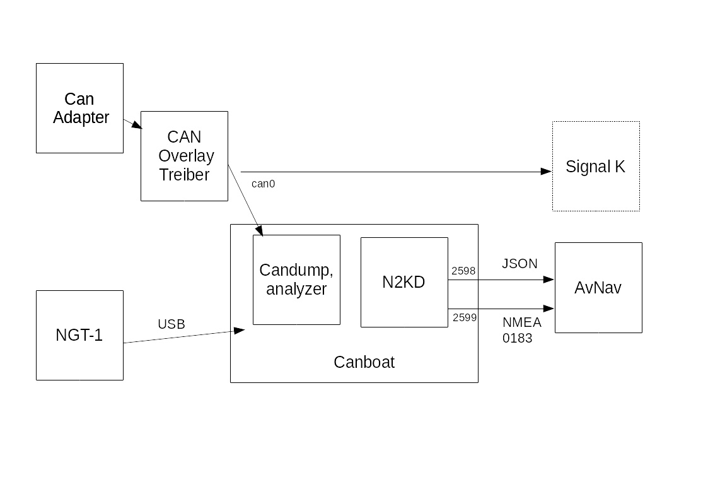
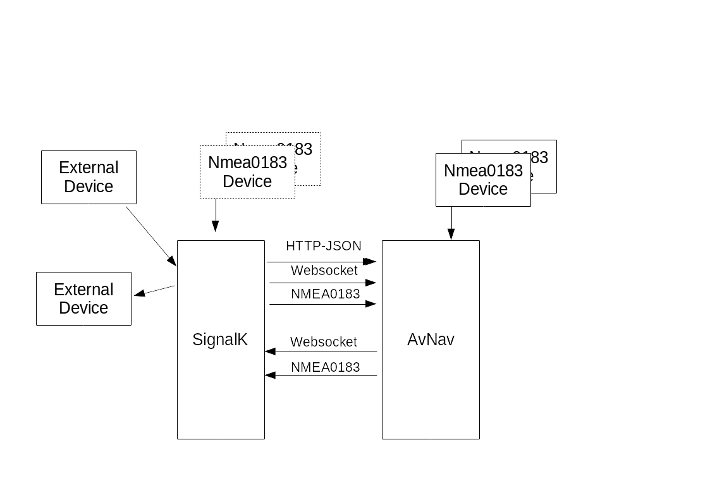

Canboat and SignalK


Zusammenwirken mit Canboat und SignalK
======================================

Ab Release 20200204 kann AvNav mit [canboat](#Canboat)
(NMEA2000) und [SignalK](#SignalK) zusammenarbeiten.

Wichtiger Hinweis: Ab Version 20220421 hat sich das Handling für [SignalK](#SignalK)
stark verändert.

Canboat (NMEA2000) {: #Canboat}
-------------------------------

Mit [canboat](https://github.com/canboat/canboat) können an
den Raspberry angeschlossene CAN-Adapter (z.B. mit [MCP2515](https://www.reichelt.de/entwicklerboards-can-modul-mcp2515-mcp2562-debo-can-modul-p239277.md)
oder ein [Waveshare
RS485 CAN-HAT](https://www.waveshare.com/wiki/RS485_CAN_HAT) ) oder per USB angeschlossene Adapter (z.B. Actisene
NGT-1) genutzt werden. Für die einfachen CAN-Adapter muss darauf geachtet
werden, dass sie 2 Spannungsversorgungen haben (3,3V und 5V) - viele ganz
einfache haben das nicht!



Im Bild ist das prinzipielle Setup zu sehen, so wie es von den [headless
Images](../install.md#Headless) bereitgestellt wird.

Für einen per [SPI](https://www.raspberrypi.org/documentation/hardware/raspberrypi/spi/README.md)
angeschlossenen [CAN-Adapter](https://www.raspberrypi.org/forums/viewtopic.php?t=141052)
muss meist noch ein Overlay in /boot/config.txt eingeschaltet werden. Für
den MCP2515 sind entsprechende Einträge bereits vorbereitet, diese müssen
auskommentiert werden. Gegebenenfalls müssen die Taktfrequenz und der für den Interrupt
genutzte GPIO Pin geändert werden.

Dieser CAN-Adapter erscheint dann als Netzwerk-Interface (ggf. muss er
noch entsprechend konfiguriert werden - in den Images ist das bereits
vorbereitet).

Das Interface sollte mit

```
ifconfig can0
```

sichtbar sein.

Für einen per USB angeschlossenen Actisense NGT-1 siehe die [Beschreibung
bei Canboat](https://github.com/canboat/canboat/wiki/actisense-serial).

AvNav kommuniziert mit dem [n2kd](https://github.com/canboat/canboat/wiki/n2kd).
Dieser konvertiert empfangene NMEA2000 Daten in NMEA0183 (nicht ganz
vollständig). Die Konfiguration für n2kd erfolgt über die Datei

```
/etc/default/n2kd
```

In den Images ist hier eine Verbindung zu can0 vorbereitet. Für einen per
USB angeschlossenen Adapter muss diese Datei geändert werden. Falls ein
solcher USB-Adapter für NMEA2000 angeschlossen wird, sollte er einen
Eintrag in der avnav\_server.xml bekommen, damit er dort nicht genutzt wird
(bei Einstecken die Status-Seite beobachten und die USB-Id von dort
kopieren), dann entsprechend eintragen:

```
<AVNUsbSerialReader .....>  
<UsbDevice usbid="x:y.z" type="ignore"/>   
....
```

Wenn alles korrekt konfiguriert ist, sollten auf den Ports 2599 und 2598
NMEA-Daten bzw. json-Daten zu sehen sein, wenn auf dem Bus NMEA2000-Datenverkehr vorhanden ist. Kontrolle z.B.

```
nc localhost 2599
```

Sonst den Zustand von Canboat mit

```
sudo systemctl status canboat
```

prüfen.

Für AvNav sollten 2 Verbindungen zum n2kd konfiguriert werden. Über eine
Verbindung (Port 2599) empfängt der Server die NMEA0183-Daten und über die andere
Verbindung (Port 2598)  direkt einige JSON-Daten. Das ist notwendig,
da n2kd keinen NMEA-Datensatz mit Datum ausgibt (z.B. RMC). Um das Datum
zu erhalten, kann AvNav direkt die pgns 126992,129029 lesen, um intern
Datum und Zeit zu setzen. AvNav kann daraus auch einen RMC Datensatz
generieren (wenn über NMEA gültige Positionsdaten empfangen werden).

Dazu sind in der avnav\_server.xml einige Konfigurationen nötig. Diese
werden bei einer Image-Installation automatisch aufgesetzt, sonst sind sie
im Template unter /usr/lib/avnav/raspberry/avnav\_server.xml zu finden und
können von dort kopiert werden.

```
<AVNSocketWriter port="34568" maxDevices="5"   
 filter=""read="true" minTime="50"   
 name="nmea0183tosignalk"   
 blackList="canboatnmea0183,canboatgen"/>
<AVNSocketReader port="2599" host="localhost" filter="" name="canboatnmea0183"/>
<AVNPluginHandler>  
 <builtin-canboat enabled="true" allowKeyOverwrite="true" autoSendRMC="30" sourceName="canboatgen"/>  
</AVNPluginHandler>
```

Mit dem ersten Eintrag wird ein zusätzlicher Port erzeugt, auf dem AvNav
seine NMEA-Daten ausgibt - aber ohne die per canboat empfangenen Daten.
Das wird für die Integration mit SignalK genutzt, wenn SignalK die
NMEA2000-Daten bereits selbst empfängt.

Der Socketreader localhost:2599 empfängt die konvertierten Daten vom
n2kd.

Die direkte Abfrage der NMEA2000-Daten erfolgt über ein Plugin, daher
muss ein Eintrag im AVNPluginHandler gemacht werden. Mit den Settings
im Beispiel wird das Plugin aktiviert, allowKeyOverwrite erlaubt das
Überschreiben der internen Zeit durch das Plugin und autoSendRMC=30 sorgt
dafür, das (wenn 30s kein RMC im NMEA Datenstrom aufgetaucht ist) im
Intervall 1s ein RMC geschrieben wird. Für die Parameter des Plugins siehe
den [source
code](https://github.com/wellenvogel/avnav/blob/master/server/plugins/canboat/plugin.py).

Ein Senden von Daten über NMEA2000 ist bisher nicht vorgesehen, das kann
ggf. über SignalK konfiguriert werden.

SignalK {: #SignalK}
--------------------

Mit der Version 20220421 ist die Integration von AvNav mit  [SignalK](http://signalk.org/)
stark erweitert worden.



Für die Integration zwischen AvNav und SignalK ist es zunächst wichtig
zu entscheiden, wie die Daten fließen sollen.  
Dafür gibt es 2 grundsätzliche Möglichkeiten:

1. NMEA-Daten landen zunächst in AvNav und werden von dort zu SignalK
   weiter geleitet. Dieses Setup wird in den [AvNav
   Headless Images](../install.md#Headless) genutzt. Die SignalK-Daten können (per HTTP-Json
   und websocket) wieder zu AvNav geschickt werden und dann dort auch
   angezeigt werden.  
   Die Daten, die AvNav zur Navigation nutzt (inklusive der AIS Daten),
   werden hier direkt von AvNav aus den NMEA-Daten dekodiert.  
   Ausnahme: NMEA2000-Daten, die über Canboat kommen, müssen parallel auch zu
   SignalK geschickt werden.
2. NMEA-Daten landen zunächst in SignalK und können von dort per
   HTTP-Json und websocket zu AvNav weiter geleitet werden.  
   Das ist das Setup, was z.B. in OpenPlotter verwendet wird.

Für beide Varianten kann AvNav auch eigene Daten an SignalK schicken. Im
Moment sind das die Routing-Daten zum nächsten Wegepunkt (entweder als
RMB/APB NMEA0183-Daten oder als SignalK Update - s.u.).

Außerdem können Notifications (Alarme) von SignalK gelesen und dorthin
gesendet werden.

Mit der Version 20220421 wird das Handling nicht mehr durch ein Plugin
von AvNav erledigt, sondern durch einen eigenen "Handler", den AVNSignalKHandler.
Die [Konfiguration](#configuration) muss daher dort
erfolgen.

### 1. NMEA zu AvNav und von dort zu SignalK {: #flow1}

Die Konfiguration ist in den [AvNav
Headless Images](../install.md#Headless) vorbereitet.

Für diese Konfiguration ist in AvNav ein AVNSocketWriter vorgesehen
(Standard: port 34568), der empfangene NMEA-Daten weiterleitet. Über
Blacklist-Einträge werden Daten von canboat (NMEA2000) nicht mit
ausgesendet.

```
<AVNSocketWriter port="34568" maxDevices="5" filter="" read="true" minTime="50" name="nmea0183tosignalk" blackList="canboatnmea0183,canboatgen"/>
```

In SignalK muss dazu eine entsprechende data connection für NMEA0183, TCP
client angelegt werden.

Der AVNSignalKHandler ist per default so konfiguriert, dass er SignalK
über localhost:3000 erreicht und alle Daten von vessels.self liest. Diese
werden dann unter gps.signalk,... in AvNav abgespeichert und können so in
[Anzeigen](layouts.md) verwendet werden.  
Dabei wird eine Mischung aus polling per HTTP-Json und einer Websocket-Verbindung genutzt. Das Polling sorgt für eine sichere Aktualisierung, die
Websocket-Verbindung für ein zeitnahes Update.

Auf der obigen SocketWriter-Verbindung schickt AvNav auch seine Routing-Daten als RMB- bzw. APB-Sätze zu SignalK.  
Zusätzlich kann beim SignalKHandler noch die Integration von Alarmen
(SignalK: Notifications) aktiviert werden.

Daten, die über andere Wege direkt in SignalK ankommen, werden zwar wie
beschrieben zu AvNav geleitet, **sind dort jedoch nicht direkt für die
Navigation nutzbar**.

Wenn man möchte, dass Daten zunächst in SignalK ankommen und von dort zu AvNav weiter gehen, sollte man überlegen, ob der andere Signalfluss (2) nicht besser geeignet ist..

Vorteil an Signalfluss 1 (NMEA erst zu AvNav) ist , das auch, wenn SignalK
nicht verfügbar ist oder Probleme macht, die Navigationsfunktionen von
AvNav noch arbeiten können.

### 2. NMEA-Daten zuerst zu SignalK {: #flow2}

In diesem Signalfluss, der unter OpenPlotter der Default ist (ab AvNavInstaller
Version xxxx), werden NMEA Daten zunächst in SignalK empfangen und
gespeichert. Dazu müssen in SignalK die entsprechenden data connections
konfiguriert werden.

In AvNav wird der AVNSignalKHandler so konfiguriert, dass er die Daten von
SignalK in einer Kombination von HTTP-Json und einer Websocket-Verbindung
abholt.  
Es sind die Flags "decodeData" und "fetchAis" (siehe [Konfiguration](#configuration))
gesetzt. Damit werden empfangene Daten intern in AvNav für die Navigation
gespeichert. Zusätzlich werden sie wie bei [(1)](#flow1) noch
einmal unter gps.signalk.... gespeichert, damit die Anzeigen genauso
funktionieren.  
Für das Mapping der Daten siehe [[Mapping](#mapping)].

Im AVNSignalKhandler ist außerdem das Senden von Daten aktiviert
("sendData"). Es werden die Daten für den aktuellen Wegepunkt sowie Alarme
zu SignalK gesendet.  
Außerdem werden Notifications von SignalK empfangen.  
Für das Schreiben von Daten zu SignalK muss ein unter SignalK verfügbarer
Nutzer mit Schreibrechten konfiguriert werden (siehe [Konfiguration](#configuration)).

Die in früheren Versionen nötigen NMEA-Verbindungen von SignalK (port
10110) zu AvNav und zurück sind mit dieser Version nicht mehr nötig. Es
ist auf SignalK-Seite auch kein Plugin zum Erzeugen von NMEA-Daten
erforderlich.

Wenn man ein Update von einer älteren Version macht, kann man die NMEA-Verbindungen zu SignalK einfach deaktivieren und am AVNSignalKHandler die
neuen Einstellungen vornehmen.

### Auswahl des Datenflusses

Für die Entscheidung, ob der [Datenfluss 1](#flow1) (erst zu
AvNav) oder der [Datenfluss 2](#flow2) (erst zu SignalK)
genutzt werden soll, kann man zunächst von den defaults ausgehen, je
nachdem, auf welcher Basis man aufsetzt.

Man sollte nur dann davon abweichen, wenn es gute Gründe dafür gibt.
Durch Konfiguration auf der   [Status/Server
Seite](../userdoc/statuspage.md) kann man jeden dieser Flüsse einstellen, es sind sogar
Mischformen möglich.

Man muss dabei nur darauf achten, dass man keine Schleifen erzeugt - also
z.B. Daten von AvNav per NMEA0183 zu SignalK schickt und diese dann wieder
von dort zurückholt.  
AvNav versucht, solche Probleme mit einer "sourcePriority" an jeder
Verbindung zu vermeiden. Alle NMEA-Verbindungen haben per default eine
Priority von 50, der AVNSignalKHandler 40 - damit "gewinnen" direkt
empfangene NMEA Daten immer gegenüber den von SignalK geholten Daten.

### Konfiguration {: #configuration}

Der AVNSignalK Handler hat die folgenden Konfigurationen.

|  |  |  |
| --- | --- | --- |
| Name | Beschreibung | Default |
| name | Ein Name für den Handler. Wird auf der Status-Seite angezeigt und im Log verwendet. | leer (signalk) |
| enabled | Wenn ausgeschaltet, wird die SignalK-Integration deaktiviert. Ggf. konfigurierte NMEA-Verbindungen sind davon nicht betroffen. | ein |
| decodeData | Wenn eingeschaltet, werden die empfangenen Daten von SignalK auch für die Navigationsfunktionen in AvNav verwendet. Siehe [Mapping](#mapping). | aus (ein auf OpenPlotter) |
| fetchAis | Wenn eingeschaltet, werden alle 10s (aisQueryPeriod) die AIS-Daten von SignalK geholt und in AvNav als AIS-Daten gespeichert. | aus (ein auf OpenPlotter) |
| priority | Die Priorität der dekodierten SignalK-Daten | 40 |
| port | Der SignalK HTTP Port. | 3000 |
| host | Der SignalK server hostname/die IP-Adresse. | localhost |
| aisQueryPeriod | Intervall (in s) für die Abfrage der AIS-Daten | 10 |
| period | Periode in ms für die HTTP-Json-Abfrage auf SignalK. Wenn die python websocket-Bibliotheken verfügbar sind (der Normalfall), wird dieses Intervall auf nahezu die expiryTime der Daten in AvNav vergrößert. | 1000 |
| fetchCharts | Hole die Informationen über die bei SignalK installierten Karten. Dazu muss dort der signalk-chart-provider installiert sein. | ein |
| chartQueryPeriod | Intervall (in s) für die Abfrage der Karten. | 10 |
| chartProxyMode | Wenn SignalK auf einem anderen Rechner läuft als AvNav, kann es sein, dass der Browser diesen anderen Rechner nicht direkt erreichen kann. Daher besteht die Möglichkeit, dass das Laden der Karten über einen Proxy in AvNav erfolgt. Das erzeugt allerdings etwas zusätzliche Last und kann daher abgeschaltet werden.  *sameHost*: nur Proxy, wenn SignalK nicht auf dem gleichen Server läuft wie AvNav  *never*: kein Proxy (kann genutzt werden, wenn auch vom Browser aus der SignalK Server unter der hier eingetragenen Adresse erreicht werden kann)  *always*: Immer proxy. Kann genutzt werden, wenn der SignalK Port (3000) nicht direkt von außerhalb erreichbar ist. | sameHost |
| ignoreTimestamp | Im Normalfall wertet der Handler den Timestamp der SignalK Daten aus und ignoriert Daten, die zu alt sind (expiryPeriod in AVNConfig). Eine potenzielle Zeitdifferenz zwischen dem eigenen Server und dem SignalK Server wird dabei berücksichtigt.  SignalK nutzt allerdings manchmal nicht seine lokale Zeit als Basis für diesen Zeitstempel, sondern nimmt den Zeitstempel aus empfangenen Daten. Der kann insbesondere bei der Verwendung von Simulationsdaten weit in der Vergangenheit liegen - und AvNav würde solche Daten ignorieren.  Durch Setzen dieses Flags ignoriert AvNav diese Zeitstempel und trägt als Zeitstempel seine lokale Zeit der letzten Änderung eines Wertes ein.  Das ist natürlich nicht so genau wie der originale Zeitstempel in SignalK, führt aber dazu, das auch ältere Simulationsdaten genutzt werden könen. | aus |
| sendData | Sende Daten an SignalK.  Es kann jeweils noch konfiguriert werden, ob Alarme oder/und Wegepunkt-Daten gesendet werden können. Diese Einstellungen werden aber erst sichtbar, wenn sendData aktiviert wurde.  Das steuert **nicht das Senden von NMEA-Daten** zu SignalK! | aus (ein auf OpenPlotter) |
| userName | Der Name eines SignalK-Nutzers mit Schreibrechten auf dem SignalK Server. Dieser Nutzer muss vorher mit den entsprechenden Rechten bei SignalK angelegt worden sein.  Leider hat SignalK kein Interface, um direkt prüfen zu können, ob ein bestimmter Nutzer die gewünschten Pfade schreiben kann, nur für "localhost" wird geprüft, ob Schreibrechte vorliegen. | admin |
| password | Das Passwort für den konfigurierten Nutzer. Dieses Passwort ist im Normalfall für eine SignalK-Installation auf dem gleichen Server nicht erforderlich (sofern die Konfiguration auf dem Standardpfad $HOME/.signalk/security.json liegt).  Wenn in der Status-Anzeige unter "authentication" ein Fehler auftritt, kann u.U. auch lokal das Setzen des Passwortes das Problem lösen.  Achtung: Das Passwort wird im Klartext in der avnav\_server.xml gespeichert. | <leer> |
| sendWp | Sende Wegepunkt-Daten zu SignalK. Siehe auch [Mapping](#mapping). | ein |
| sendNotifications | Sende AvNav-Alarme als Notifications zu SignalK - siehe [Mapping](#mapping). | ein |
| receiveNotifications | Empfange Notifications von SignalK als Alarme. | aus |
| notifyWhiteList | Eine Komma-separierte Liste von SignalK notifications, die emfangen werden sollen. Anzugeben sind jeweils die Pfade ohne "notification." - als z.B. navigation.arrivalCircleEntered,mob,fire,sinking.  Wenn die Liste leer ist, werden alle Notifications empfangen - aber es wird noch die notificationBlacklist betrachtet, | <leer> |
| notifyBlackList | Eine Komma-separierte Liste von SignalK notifications, die nicht empfangen werden sollen. | server.newVersion |
| webSocketRetry | Interval (in s), in dem versucht wird, eine erneute Websocket-Verbindung aufzubauen, wenn die vorige geschlossen wurde. | 20 |

### 

Einige der Parameter werden erst sichtbar, wenn der jeweils
"übergeordnete" Parameter aktiviert wurde.

  

### Mapping {: #mapping}

Die SignalK-Pfade werden wie folgt auf AvNav-Datenpfade gemappt:

/vessels/self/... => gps.signalk....

Diese Pfade werden in AvNav intern nicht verwendet, können aber angezeigt
werden.

Wenn "decodeData" aktiviert ist, wird wie folgt gemappt (siehe [im
code](https://github.com/wellenvogel/avnav/blob/e36087aac3df717d084eebab8725f237176286a0/server/avnav_nmea.py#L64)).

Anmerkung: Kurse/Winkel werden intern in AvNav in ° gespeichert, in
SignalK in rad. Wenn mehrere SignalK-Pfade angegebn sind, wird der jeweils
erste bei SignalK vorhandene genutzt.

|  |  |
| --- | --- |
| SignalK unter /vessels/self/ | AvNav |
| navigation.headingMagnetic | gps.headingMag |
| navigation.headingTrue | gps.headingTrue |
| environment.water.temperature | gps.waterTemp |
| navigation.speedThroughWater | gps.waterSpeed |
| environment.wind.speedTrue | gps.trueWindSpeed |
| environment.wind.speedApparent | gps.windSpeed |
| environment.wind.angleApparent | gps.windAngle |
| environment.wind.angleTrueWater (since 20240520) | gps.trueWindAngle |
| navigation.position.latitude | gps.lat |
| navigation.position.longitude | gps.lon |
| navigation.courseOverGroundTrue | gps.track |
| navigation.speedOverGround | gps.speed |
| environment.depth.belowTransducer | gps.depthBelowTransducer |
| environment.depth.belowSurface | gps.depthBelowWaterline |
| environment.depth.belowKeel | gps.depthBelowKeel |
| navigation.datetime | gps.time |
| navigation.gnss.satellitesInView.count | gps.satInview |
| navigation.gnss.satellites | gps.satUsed |
| navigation.magneticDeviation (since 20240520) | gps.magDeviation |
| navigation.magneticVariation (since 20240520) | gps.magVariation |
| environment.current.setTrue (since 20240520) | gps.currentSet |
| environment.current.drift (since 20240520) | gps.currentDrift |

AIS-Daten werden wie folgt gemappt ("fetchAis" ein):

|  |  |  |
| --- | --- | --- |
| SignalK vessels/\*/ | AvNav ais | Bemerkung |
| mmsi | mmsi | nur wenn mmsi gesetzt ist, werden die Daten übernommen |
| name | shipname |  |
| navigation.speedOverGround | speed |  |
| navigation.courseOverGroundTrue | course |  |
| communication.callsignVhf | callsign |  |
| design.aisShipType | shiptype |  |
| navigation.position.longitude | lon |  |
| navigation.position.latitude | lat |  |
| navigation.destination | destination |  |
| sensors.ais.class | type | class A -> type 1  class B -> type 18  other -> type other |
| design.beam | beam |  |
| design.length | length |  |
| design.draft | draught |  |
| navigation.state | status |  |
| navigation.headingTrue | heading |  |
| atonType | aid\_type |  |

Wenn "sendWp" aktiv ist, werden die
Daten wie folgt gemappt:

|  |  |
| --- | --- |
| AvNav | SignalK vessels/self/ |
| currentLeg.to.lon | navigation.courseGreatCircle.nextPoint.position.longitude  und  navigation.courseGreatCircle.nextPoint.longitude |
| currentLeg.to.lat | navigation.courseGreatCircle.nextPoint.position.latitude  und  navigation.courseGreatCircle.nextPoint.latitude |
| currentLeg.from.lon | navigation.courseGreatCircle.previousPoint.position.longitude |
| currentLeg.from.lon | navigation.courseGreatCircle.previousPoint.position.latitude |
| currentLeg.distance | navigation.courseGreatCircle.nextPoint.distance |
| currentleg.dstBearing | navigation.courseGreatCircle.nextPoint.bearingTrue  und  navigation.courseGreatCircle.bearingToDestinationTrue |
| currentLeg.xte | navigation.courseGreatCircle.crossTrackError |
| currentLeg.approachDistance | navigation.courseGreatCircle.nextPoint.arrivalCircle |
| currentLeg.bearing | navigation.courseGreatCircle.bearingTrackTrue  und  navigation.courseGreatCircle.bearingOriginToDestinationTru |

Wenn der AvNav Routing Mode Rhumbline ist, wird  "courseGreatCircle"
durch "courseRhumbline" ersetzt. Das mehrfache Senden einiger Werte mit
anderen Pfaden ist ein Workaround für einige SignalK-Fehler(wie <https://github.com/SignalK/signalk-to-nmea2000/issues/94>).

Für Notifications gibt es einige wenige Mappings, ungemappte
Notifications werden in AvNav mit ihrem Namen und "sk:" vorangestellt
gehandelt. Also z.B. notifications.sinking wird zu sk:sinking.

|  |  |  |
| --- | --- | --- |
| AvNav | SignalK vessels/self/notifications | Value |
| mob | mob | 'state':'emergency',   'method':['visual','sound'],   'message':'man overboard' |
| waypoint | arrivalCircleEntered | 'state': 'normal',  'method': ['visual','sound'],  'message': 'arrival circle entered' |
| anchor | navigation.anchor | 'state':'emergency',  'method': ['visual','sound'],  'message': 'anchor drags' |

SignalK Notifications ohne ein direktes Mapping werden basierend auf
ihrem state einer Kategorie zugeordnet (darüber kann im AVNCommandHandler
das auszuführende Kommando und der Sound definiert werden).

emergency -> critical  
normal -> normal

  

### SignalK - Karten {: #SignalKCharts}

Ab Version 202011xx ist auch der [SignalK
chart provider](https://github.com/SignalK/charts-plugin) integriert. Karten, die von dort angeboten werden,
können auf der Einstiegsseite ebenfalls ausgewählt werden. Dazu muss
natürlich innerhalb von SignalK das entsprechende Plugin installiert und
aktiviert sein - und Karten müssen dort verfügbar sein.

Im Normalfall werden durch AvNav nur die Informationen über die Karten
bereitgestellt, der Zugriff auf die Karten erfolgt direkt vom Browser zu
SignalK.

Falls das z.B. durch Firewall-Einstellungen verhindert wird, kann man
auch alle Karten-Zugriffe über AvNav leiten (Proxy) - siehe [Konfiguration](#configuration).

  