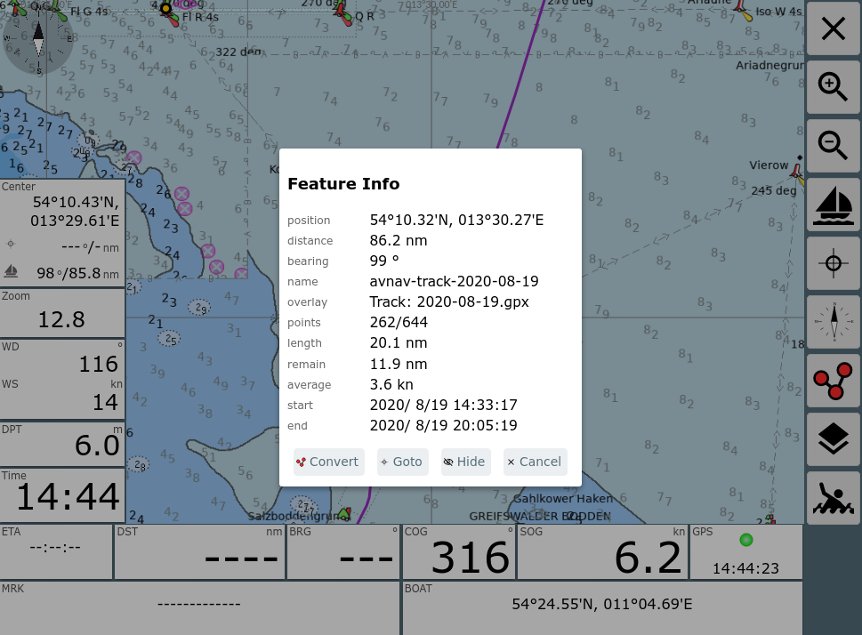
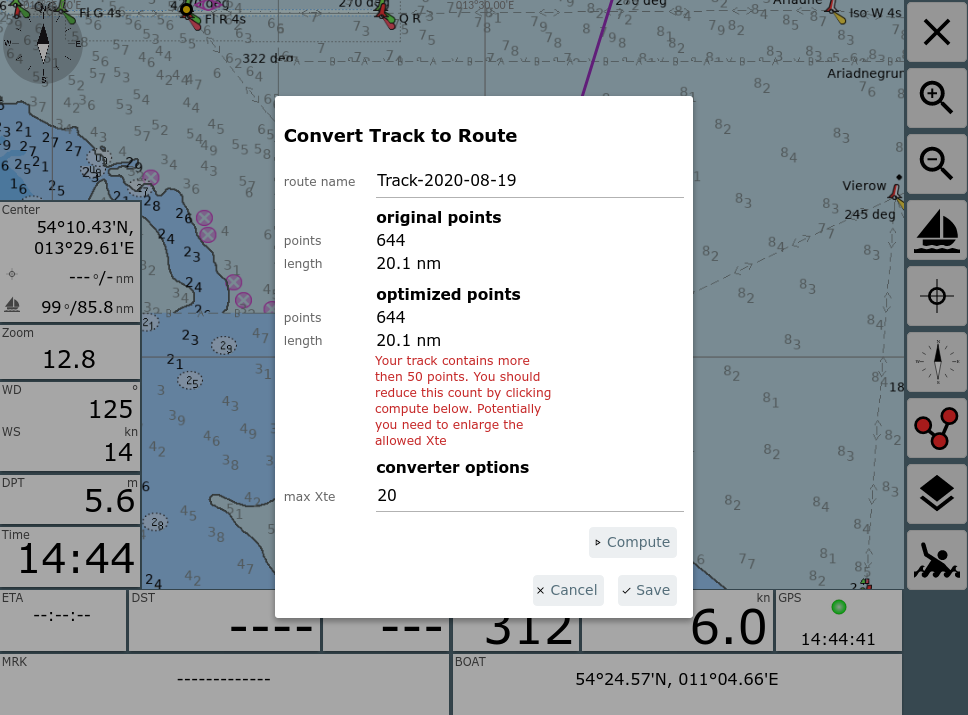
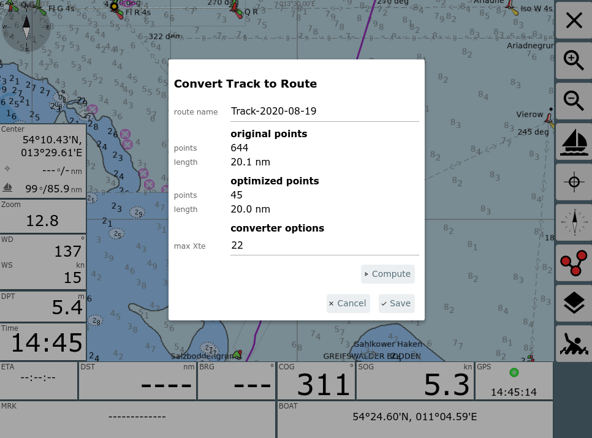
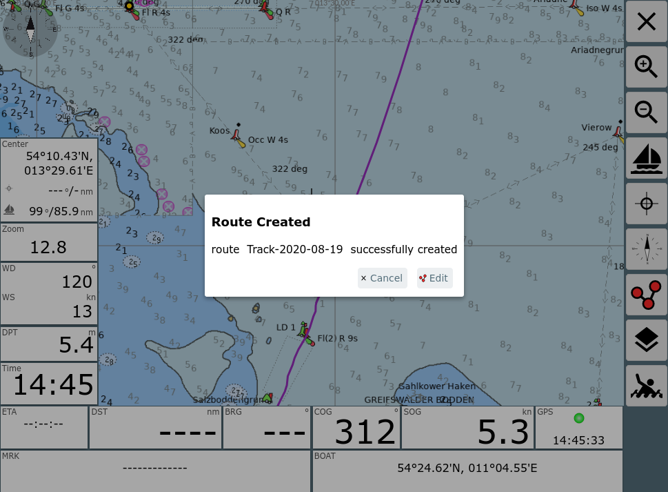
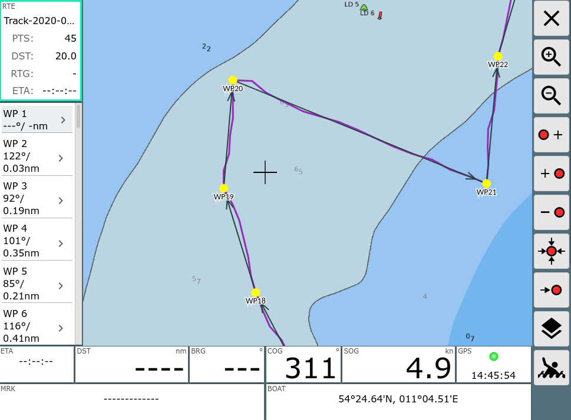

Tracks zu Routen

Konvertierung von Tracks zu Routen
==================================

AvNav zeichnet permanent [Tracks](../quickstart.md#tracks)
auf. Für jeden Tag wird eine neue gpx Datei mit dem aktuellen Datum
geschrieben.

Diese Tracks (oder auch Tracks, die auf der [Files/Download](../userdoc/downloadpage.md)
Seite hochgeladen wurden) können in Routen umgewandelt werden, um sie zur
Navigation zu nutzen.

Verfahren
---------

Für diese Umwandlung ist es typischerweise nötig, die Zahl der Punkte im
Track zu verringern (Tracks haben oft weit über 1000 Punkte). Sonst ist
eine sinnvolle Nutzung einer solchen Route kaum möglich.

AvNav nutzt dazu ein Reduktionsverfahren, das an [GPS
Babel](https://www.gpsbabel.org/htmldoc-development/filter_simplify.md) angelehnt ist. Es werden nacheinander die Punkte entfernt, bei
denen die Abweichung zur neu entstehenden Strecke zwischen den
Nachbarpunkten am kleinsten ist.

Man kann für dieses Verfahren eine maximale Abweichung (xte) angeben, die
man tolerieren möchte. Je größer man diese zulässige Abweichung wählt, um
so weniger Punkte bleiben am Ende übrig. Man sollte typischerweise
versuchen, Routen auf ca. 50 Punkte zu begrenzen.

Nach der Umwandlung kann man die Route im [Routen-Editor](../userdoc/editroutepage.md)
ggf. noch etwas nachbearbeiten.

Ablauf
------

Man kann den Dialog für die Konvertierung entweder von der Files/Download
Seite aus dem [Track Info](../userdoc/downloadpage.md#tracks)
Dialog erreichen ({{BT("ToRoute")}}Convert
Button) oder aus dem Info Dialog, falls man einen Track als [Overlay](overlays.md#usage)
auf der Karte hat, und einen Punkt in diesem anklickt. Im Info Dialog
wieder den {{BT("ToRoute")}}Convert
Button nutzen - siehe Bild.

Nach Klick auf den Convert Button erhält man den Konverter-Dialog.

Wie im Bild zu sehen, wird man typischerweise eine Warnung bekommen, dass
die Anzahl der Punkte über 50 liegt.

Über max Xte stellt man die maximal zulässige Abweichung ein und kann mit
"Compute" eine Konvertierung starten. Falls das Ergebnis (Zahl der Punkte)
noch nicht passend ist, kann man mehrere Durchläufe machen, mit veränderter
Abweichung.

Im Beispiel wurde mit einer Abweichung von 22m eine ausreichend kleine
Route erstellt.

Man kann im Dialog noch den Namen der enstehenden Route ändern (und ggf.
entscheiden, ob eine bestehende Route gleichen Namens überschrieben werden
soll).

Nach dem Speichern kann man ggf. die enstandene Route direkt bearbeiten.

Hier ist es von Vorteil, wenn man den Track vorher als Overlay auf der
Karte hatte, dann kann man jetzt leicht vergleichen, ob die Route alle
wichtigen Punkte enthält.

