avnav-layouts

Layout-Anpassung
================

Die Anzeigen auf der Navigationsseite und im Dashboard werden über eine
Konfigurationsdatei ("layout") gesteuert. Das ist eine Json-Datei. AvNav
bringt selbst einige solcher Dateien mit (zu erkennen am Namens-Prefix
system.). Der Benutzer kann eigene Layouts speichern (Namensprefix:
user.). Diese Dateien werden unterhalb des Datenverzeichnisses
(/home/pi/avnav/data auf dem raspberry) im Ordner "layout" abgelegt. Man
kann diese Dateien direkt bearbeiten (innerhalb von avnav), sie
herunterladen (und wieder hochladen) oder man kann das Layout innerhalb
von AvNav editieren ("layout editor").

Der bevorzugte Weg sollte hierbei der Layout-Editor sein, da dieser die
wenigsten Fehlerquellen bietet.

Die Auswahl des aktuell genutzten Layouts erfolgt über Einstellungen {{BT("ShowSettings")}}
/Layout

Layout Editor
-------------

Der Start des Layout-Editors erfolgt über die Einstellungsseite {{BT("ShowSettings")}}, Layouts {{BT("LayoutFinished")}}.

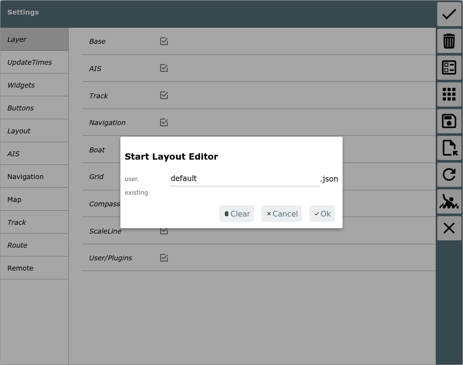dashboard
pagesAnpassung von AvNav

Hier wird der Name für das layout-File vergeben. Wenn bisher ein
System-Layout aktiv war, wird ein user-Layout mit dem gleichen Namen
erzeugt und aktiviert. Falls das Layout schon existiert, wird gefragt, ob
es überschrieben werden soll (das kann am Ende noch verhindert werden, in
dem alle Änderungen verworfen werden).

Nach dem Start bekommt die App einen roten Rand und es sind nur noch die
Seiten sichtbar, auf denen das Layout angepasst werden kann.

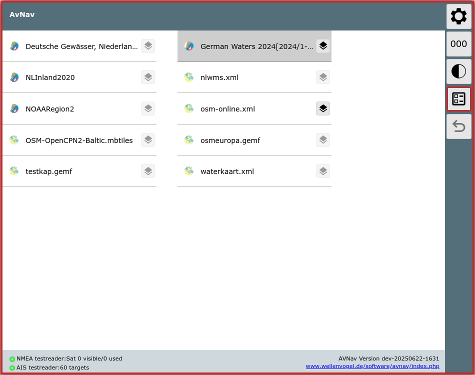

Durch Auswahl einer Karte gelangt man wie immer zur Navigationsseite.

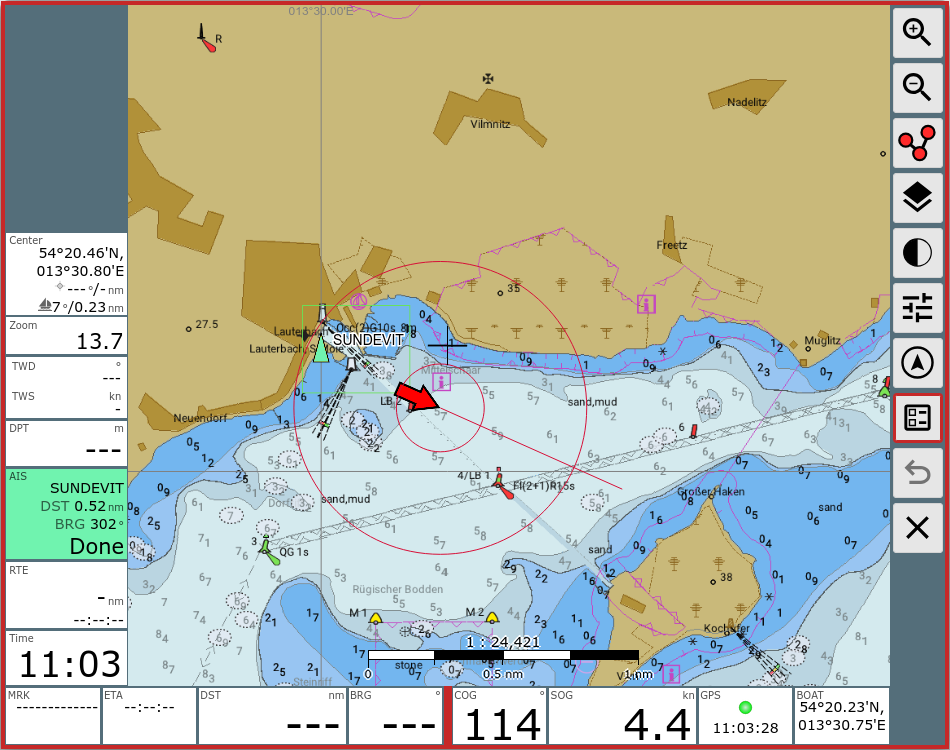

Die Anzeigen sind auf allen relevanten Seiten in sogenannten "Panels"
angeordnet.  
Im Editor-Modus können die Anzeigen einfach verschoben werden.  
Auf der Navigationsseite können die Panels unterschiedlich belegt werden,
je nachdem ob ein eher schmales Display vorhanden ist (small) oder ein
breiteres (die Grenze dafür kann in den Settings eingestellt werden). Auch
für den Zustand "Ankerwache" können die Anzeigen separat konfiguriert
werden.

Über {{BT("EditPage")}}kann
die Konfiguration für die Panels auf der jeweiligen Seite aufgerufen
werden.

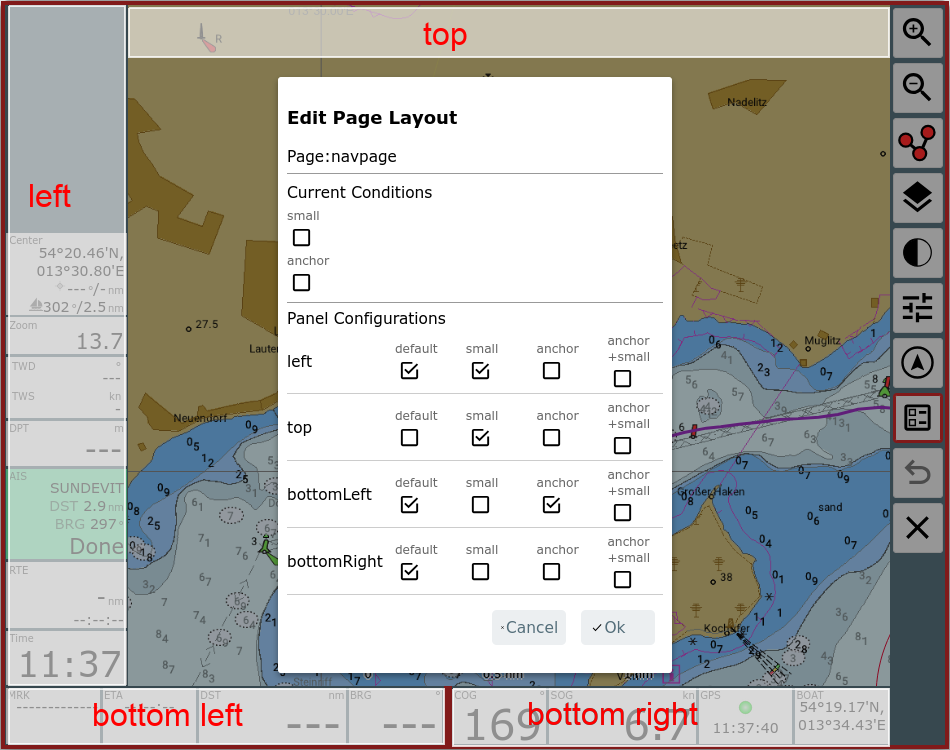

Im Bild sind die vorhandenen Panels markiert. Im Dialog kann ausgewählt
werden, welche der Panels jeweils sichtbar sein sollen. Wenn in der Spalte
"small" ein Häkchen gesetzt ist, bedeutet das, dass bei schmalem
Bildschirm das Panel anders belegt werden kann. Gleiches für den Zustand
"anchor" - also Ankerwache aktiv. Im Beispiel ist das Top-Panel im
normalen Modus nicht sichtbar, sondern nur im schmalen, das Left-Panel ist
jeweils unterschiedlich belegt. Die beiden unteren Panels sind in beiden
Modi gleich belegt. Wenn die Ankerwache aktiv ist, hat das Panel links
unten andere Anzeigen. Unter "Current Conditions" kann ausgewählt werden,
ob die Panels für die Normal-Ansicht oder für die schmale Ansicht bzw. die
Ankerwache bearbeitet werden sollen. Im Beispiel benötigt man also
nacheinander 3 Bearbeitungsschritte um für alle Modi das Layout fertig zu
stellen.

Die beiden unteren Panels können potentiell 2 Reihen von Anzeigen
aufnehmen (Einstellung: "2 widget rows"), nicht mehr passende Anzeigen
werden ausgeblendet.

Widget Dialog
-------------

Zum Ändern oder Einfügen eines Widgets klickt man auf ein vorhandenes
oder auf ein freies Feld in einem Panel.

Man erhält den folgenden Dialog.

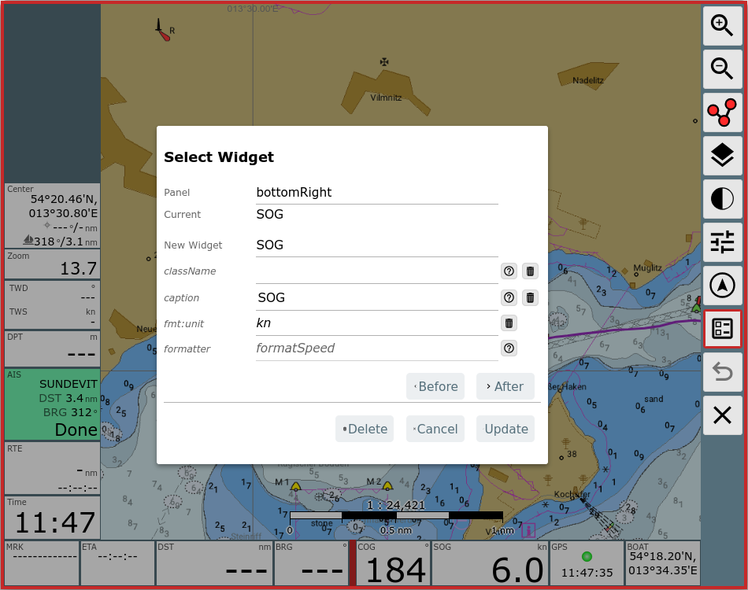

Je nach Art des Widgets sind hier unterschiedliche Werte sichtbar bzw.
änderbar. Nicht ausgefüllte Werte haben meist defaults.

Falls das Widget in ein anderes Panel verschoben werden soll, kann man
oben das neue Panel auswählen.

Änderungen schliesst man mit "Update" ab.

Unter "New Widget" kann man ein anderes Widget aus der Liste der
vorhandenen Widgets auswählen.

Jedes Widget benötigt eine Information, welche Daten es anzeigen soll.
Die verfügbaren Daten sind intern in einem Speicher verfügbar und werden
über einen Schlüssel (Key) ausgewählt.

Je nach Art des Widgets ist dieser Key (oder auch mehrere) fest im Widget
eingebaut, bei anderen kann man das frei wählen. Fast immer wählbar sind
der Titel (caption), die Einheit (unit) und die css Klasse (falls man das
[Aussehen per css anpassen möchte](usercss.md)).

Formatierer (formatter) {: #formatter}
--------------------------------------

Die meisten Widgets benötigen für die Darstellung einen Formatierer, der
den internen Wert in die gewünschte Darstellung wandelt. Meist ist der
beim Widget fest vorgegeben. Einige Formatierer akzeptieren Parameter um
ihr Verhalten anzupassen (z.B. m/s statt kn).

Die Parameter für einen Formatierer sind im Dialog mit dem Prefix "fmt:"
sichtbar - "fmt:unit" im Beispiel.  
Die Liste der verfügbaren Parameter wird in der Implementierung des
Formatierers definiert (siehe [Benutzer
Formatierer](userjs.md#formatter)).

Wenn ein Formatierer einen "unit" Parameter ha, wird der Wert dieses
Parameter benutzt, um ihn als "unit" in der Anzeige darzustellen (Einige
Anzeigen erlauben ein Überschreiben dieses Wertes im Dialog).

Die folgenden Formatierer sind vorhanden:

|  |  |  |
| --- | --- | --- |
| Name | Beschreibung | Parameter |
| formatDecimal | einfache Formatierung als Dezimalzahl | fix: minimale Zahl der ganzzahligen Ziffern  fract: Zahl der Ziffern nach dem Komma  addSpace: setze ein Leerzeichen vor positive Zahlen  prefixZero: setze 0 als Prefix, um die Zahl der Vorkommastellen zu erreichen |
| formatDecimalOpt | Formatierung einer Dezimalzahl. Nachkommastellen werden nur für nicht ganzzahlige Werte dargestellt. | wie bei formatDecimal |
| formatDistance | Entfernung in nm|m|km | unit:  nm - Enterfnung in nm  m - Entfernung in m statt nm  km - Entfernung in km statt nm |
| formatSpeed | Geschwindigkeit in kn|m/s|km/h | unit:  kn - knoten  ms - m/s statt kn  kmh - km/h statt kn |
| formatDirection | Formatiere einen Gradwert | inputRadian: - Input in rad statt Grad  range180: zeige +/- 180° statt 0...360°  leadingZero: zeige immer 3 Stellen |
| formatDirection360 | Formatiere einen Gradwert | leadingZero: zeige immer 3 Stellen |
| formatTime | Formatiere einen Zeitwert (Wert muss intern ein Date Wert sein) (hh:mm:ss) |  |
| formatClock | Formatiere einen Zeitwert (Wert muss intern ein Date Wert sein) (hh:mm) |  |
| formatDateTime | Formatiere Datum und Uhrzeit (Wert muss intern ein Date Wert sein) |  |
| formatDate | Formatiere Datum (Wert muss intern ein Date Wert sein) |  |
| formatString | gibt den Input unverändert weiter |  |
| formatTemperature | Formatiere eine Temperatur (seit 20210106), Input in Kelvin | unit:  celsius, kelvin |
| formatPressure | Formatiere einen Druck (seit 20210106), input in Pa | unit:  pa, hpa, bar |

Plugins oder eigene Erweiterungen können ggf. weitere Formatierer
hinzufügen.

Falls man das vorhandene Widget nicht ersetzen möchte, kann man das
geänderte Widget davor oder danach einfügen (Before/After).

Falls das Widget weitere Parameter unterstützt, dann werden diese im
Dialog angezeigt.

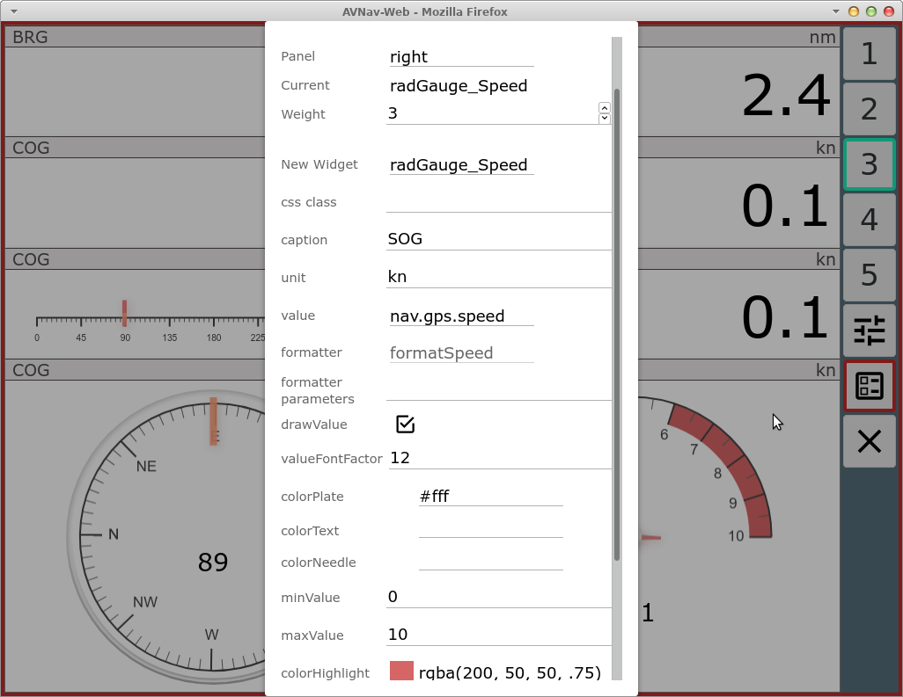

Im Beispiel die Konfiguration für eine grafische Anzeige (avnav nutzt
hierzu [canvas-gauges](https://canvas-gauges.com/)).

Von der Navigationsseite kann über die Hauptseite zu den Dashboard Seiten
gewechselt werden.

Dashboard Seiten

Es können bis zu 5 Dashboard Seiten konfiguriert werden. Auf jeder Seite
sind bis zu 5 Panels möglich.

Auf einer leeren Dashboard Seite muss zunächst die Panel-Konfiguration
erfolgen - {{BT("EditPage")}}.

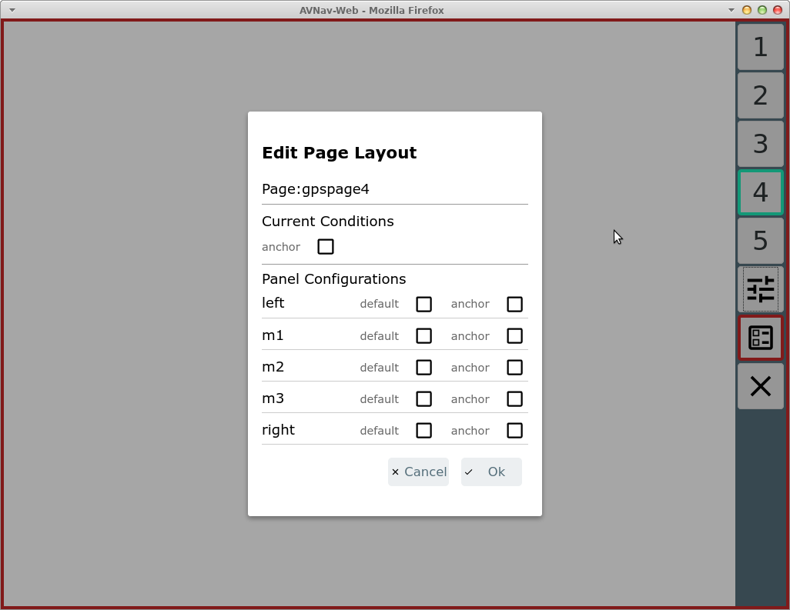

Auf den Dashboard Seiten kann eine abweichende Konfiguration eingestellt
werden, wenn die Ankerwache aktiv ist (im default layout z.B. auf
Dashboard Seite 1 genutzt).

Leere Dashboard Seiten erscheinen später nicht in der Anzeige.

Es ist auch eine Konfiguration auf der Seite des Routen-Editors ({{BT("ToRoute")}}von der Navigationsseite aus) möglich, hier
muss allerdings die Liste der Wegepunkte und die Anzeige der editierten
Route immer sichtbar bleiben.

Nach Abschluss der Layoutbearbeitung muss das Layout noch gespeichert
werden - rot umrandeter Button {{BT("LayoutFinished")}}auf jeder Seite.

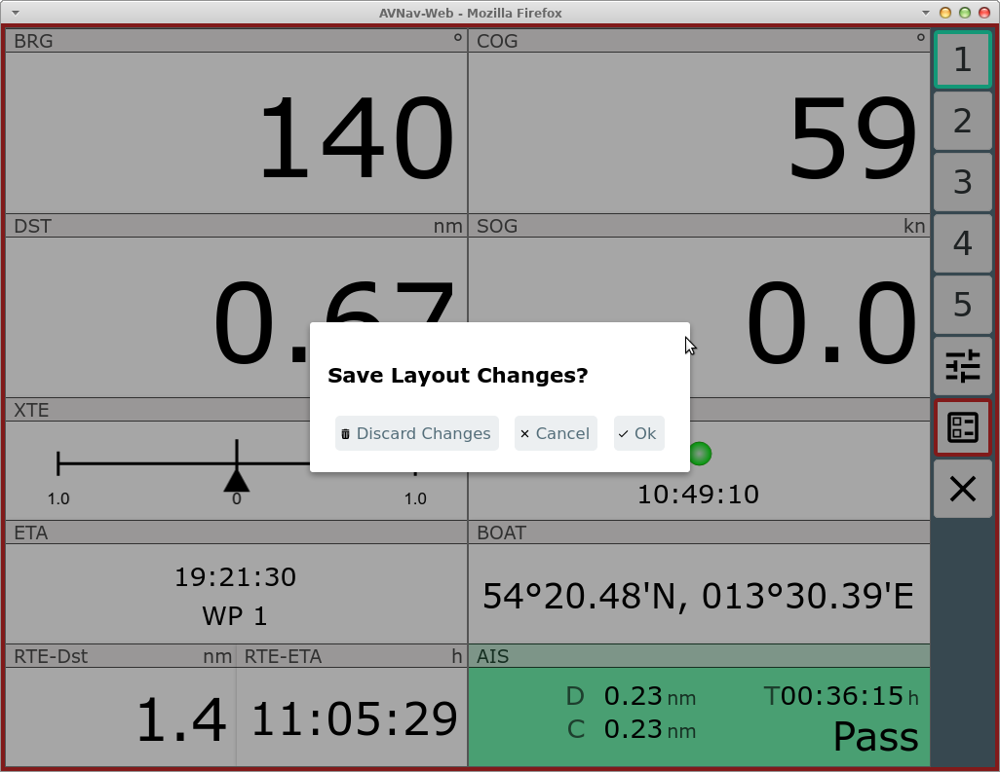

Hier kann ggf. noch einmal entschieden werden, die Änderungen zu
verwerfen.

Das Layout wird im aktuellen Browser sofort aktiv (und auf dem Server
gespeichert). Andere Browser erhalten es erst, wenn dort die App neu
geladen wird oder das Layout gewechselt wird.

Roll Back
---------

Beim Bearbeiten eines Layouts hat man einen {{BT("RevertLayout")}}RollBack Button. Mit diesem kann man Schritt
für Schritt die gemachten Layout-Änderungen zurücknehmen.

Combined Widget {: #combinedwidget}
-----------------------------------

Um mehr Flexibilität beim Anordnen der Anzeigen zu bekommen, gibt es ein
CombinedWidget das weitere Widgets als "Kinder" enthalten kann. Diese
können horizontal oder vertical angeordnet werden. Damit kann man die zur
Verfügung stehende Anzeigefläche (z.B. auf den Dashboard-Seiten) besser
ausnutzen.  
Um ein CombinedWidget zu plazieren nutzt man den normalen Widget Dialog
und wählt "CombinedWidget" als New Widget.  
Danach kann man mit "+Sub" Kind-Widgets hinzufügen - das öffnet jeweils
den normalen Widget Dialog für diese.

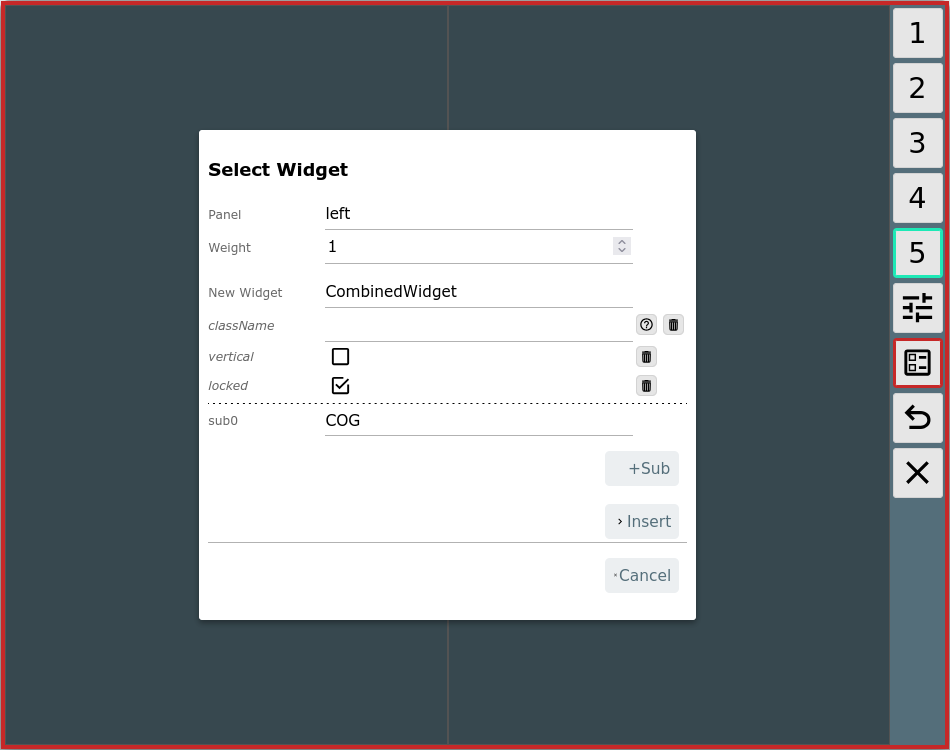

Man kann auswählen, ob die Widgets horizontal oder vertical angezeigt
werden sollen.  
Mit "locked" entscheidet man, wie sich das Widget für Drag&Drop
verhalten soll. Wenn "locked" aktiv ist, wird das CombinedWidget als
Ganzes verschoben - sonst kann man die Kinder einzeln bewegen (und damit
auch entfernen oder hinzufügen).

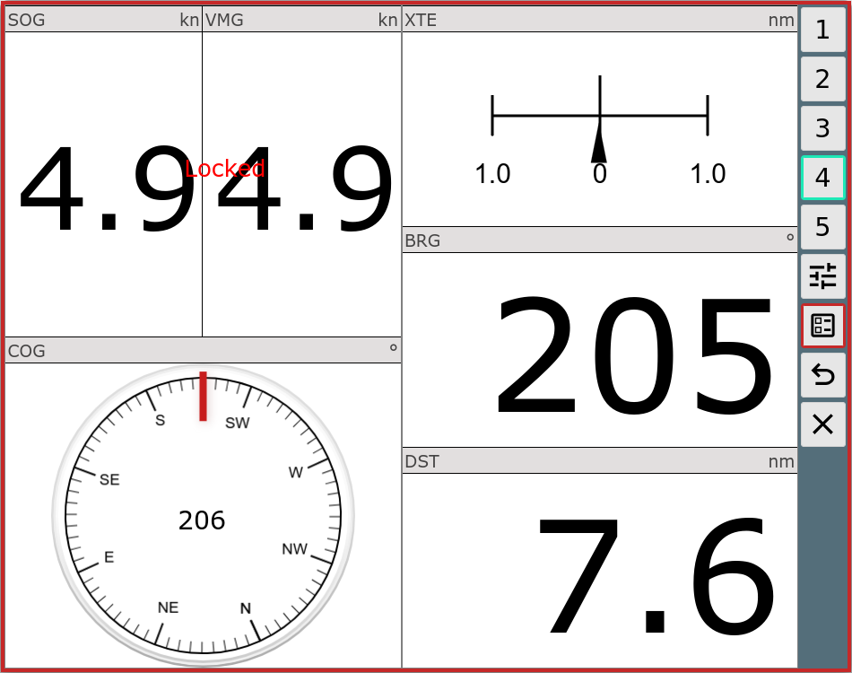

Das Beispiel zeigt eine Dashboard Seite mit einigen "normalen" Widgets
und einem CombinedWidget mit horizontaler Anordnung.

Layout Download/Upload
----------------------

Über die Files/Download Seite {{BT("DBDownload")}}können unter {{BT("LayoutFinished")}}die Layout-Files
heruntergeladen/hochgeladen/gelöscht bzw. als Datei bearbeitet werden.

Das momentan aktive Layout kann hier allerdings nur heruntergeladen
werden.

Wenn ein Layout gelöscht wird, das momentan in einem anderen Browser noch
aktiv ist, wird dieser es wieder zum Server hochladen, wenn dort die App
neu geladen wird. Das muss man ggf. beachten.

Spezielle Widgets
-----------------

Neben einer ganzen Liste von vorkonfigurierten Widgets (wie z.B. SOG,
COG, BRG, AisTargetWidget,...) bei denen ggf. nur die Beschriftung und die
Parameterisierung des Formatters geändert werden kann, gibt es einige
spezielle Widgets

### Default

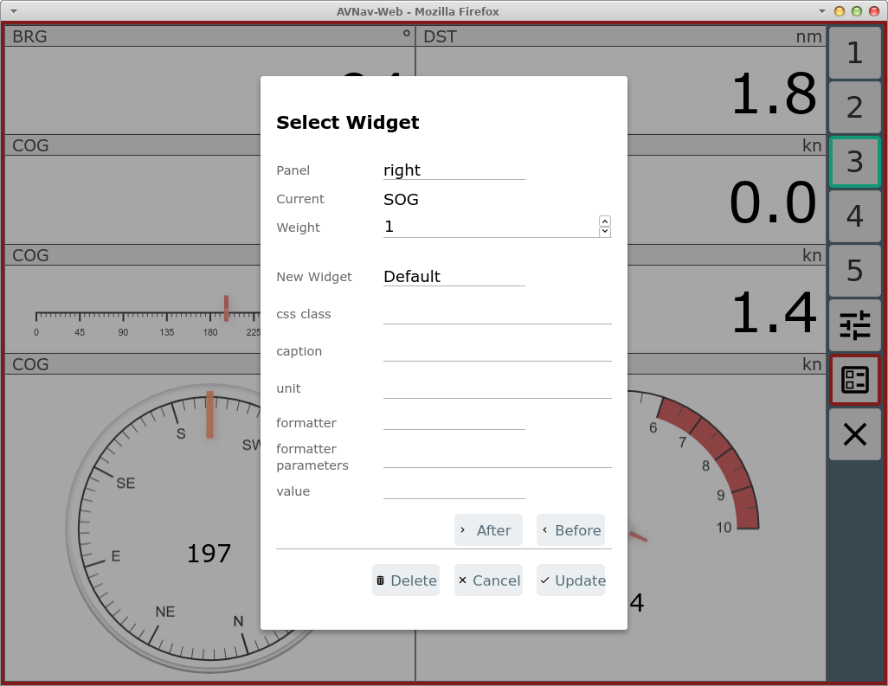

Dieses Widget ist intern die Basis für die meisten anderen Widgets. Man
kann damit recht einfach Anzeigen für bestimmte Werte realisieren.

Wichtig ist hier, dass in jedem Falle ein Formatter und ein "value"
gewählt werden müssen.

Unter Value bekommt man eine Liste der zur Verfügung stehenden
Anzeige-Daten.

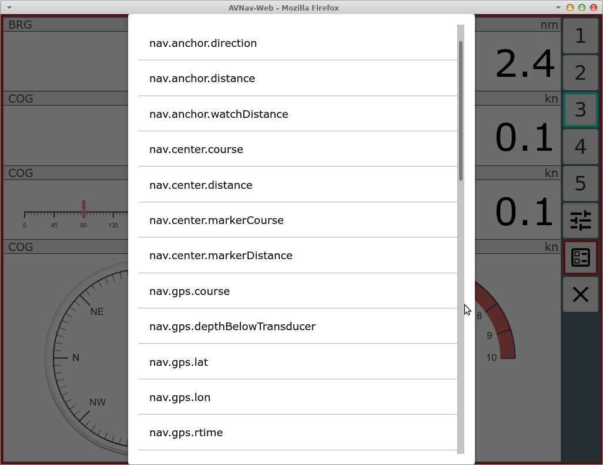Das sind
einmal die in AvNav intern vorhandenen Daten. Falls die [signalk
Integration](CanboatAndSignalk.md) aktiv ist (nicht unter Android), erscheinen hier auch
vorhandene Werte unter vessels/self mit dem Prefix nav.gps.signalk.

Die Auswahl des Formatters muss passend zum Wert erfolgen.

### Gauges {: #gauges}

Wie oben bereits erwähnt, stellt AvNav eine Integration von [canvas-gauges](https://canvas-gauges.com/)
bereit. Basierend auf dieser Bibliothek bringt AvNav einige vorbereitete
Widgets mit, deren Parameter jeweils konfigurierbar sind.

Es gibt lineare Anzeigen (linGauge...) oder radiale Anzeigen
(radGauge...).  
Über den Layout-Editor sind nur bestimmte Parameter direkt anpassbar.

Falls die Anzeigen weitergehend verändert werden sollen, sollte dazu eine
[Anpassung über nutzerspezifischen JavaScript code](userjs.md) erfolgen.

### SignalK

Das SignalK plugin bringt auch einige Widgets mit, die insbesondere
Formatter für Daten enthalten, die so in avnav sonst nicht verfügbar sind
- z.B. signalKCelsius zur Anzeige von Temperaturen. Diese machen natürlich
nur Sinn, wenn entsprechende SignalK Daten vorhanden sind.

### MapWidgets

Nutzer oder plugins können [Map Widgets](userjs.md#widgets)
erzeugen. Diese werden direkt auf der Karte gezeichnet und können
Informationen über die aktuelle Position und den Zoom der Karte benutzen.
Ein Beispiel ist das SailInstrumentOverlay Widget vom [Sail
Instrument plugin](https://github.com/kdschmidt1/Sail_Instrument).

Um diese Widgets zu bearbeiten nutzt man den {{BT("NavMapWidgets")}}MapWidget Button auf der Navigationsseite.

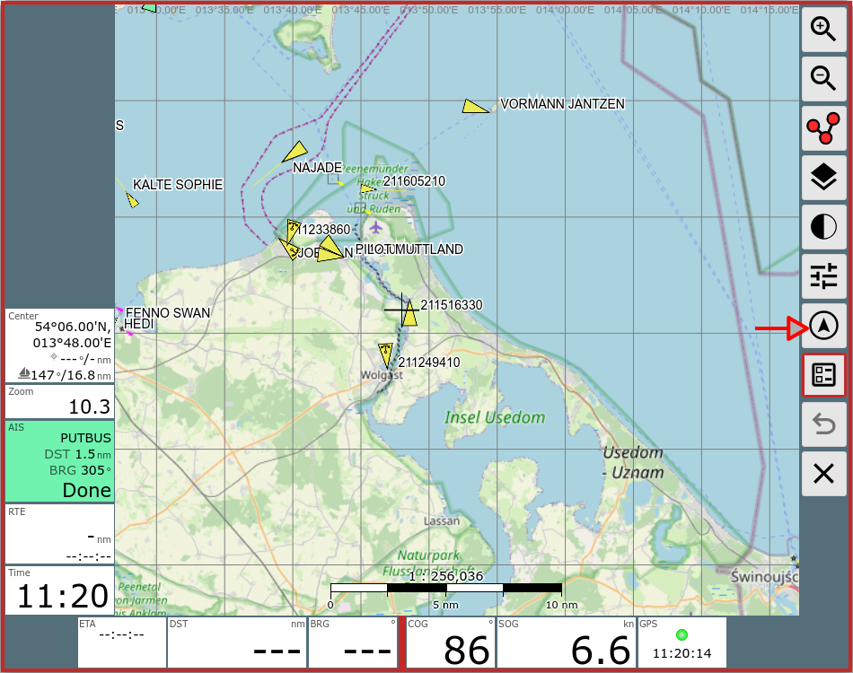

Man erhält einen Dialog in dem man die Widgets hinzufügen/bearbeiten oder
löschen kann.

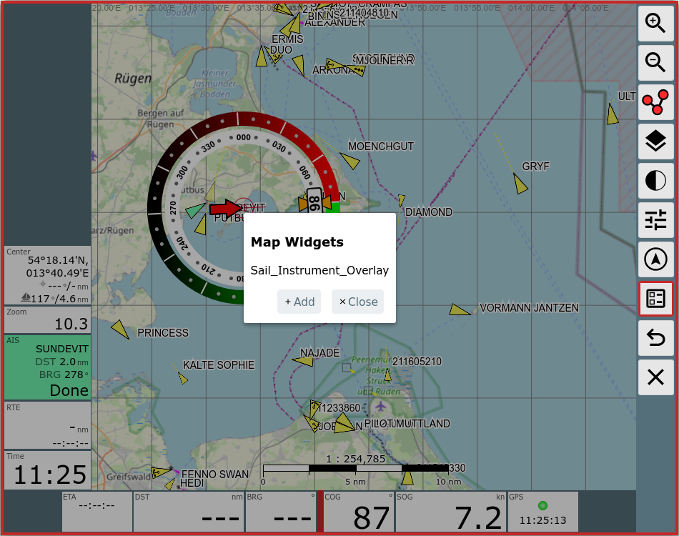

Man sollte beachten, das ein Klick auf ein solches Map Widget NICHT den
Dialog zum Bearbeiten anzeigt. Statt dessen muss man immer den {{BT("NavMapWidgets")}}MapWidget Button benutzen. Da die Position
auf der Karte durch das Widget selbst festgelegt wird, gibt es auch keine
Drag und Drop Funktionalität für diese Widgets.

Anpassung des Aussehens
-----------------------

Falls man das Aussehen eines Widgets anpassen möchte, empfiehlt es sich,
eine neue css class zu vergeben - auf diese kann man dann mit [nutzerspezifischem
css](usercss.md) zugreifen.

Eigene Widgets
--------------

Mit [nutzerspezifischem Java Script Code](userjs.md) kann
man relativ leicht auch eigene Anzeigen einbauen - sowohl mit simplem HTML
als auch mit grafischen Elementen.