AvNav OCharts


Avnav Ocharts
=============

Hinweis: ab 2024/02/17 gibt es eine neue
(Beta) Version für den Ocharts-Support. Diese läuft auch unter Android.
Für eine Beschreibung siehe [OchartsNG](ochartsng.md).

=== nicht für Android ===

### Inhalt

AvNav kann Karten in den verschiedenen Raster-Formaten verarbeiten.
Bisher war es aber nicht in der Lage, offiziell verfügbare Seekarten zu
lesen und anzuzeigen. Seit einiger Zeit gibt es die Firma [o-charts](https://o-charts.org/),
die Karten für viele Gebiete der Erde für OpenCPN bereitstellt.

Nach einigen Absprachen mit der Firma können diese Karten nun (ab Version
20200515 mit einem Plugin - [s.u.](#Installation)) auch für
AvNav genutzt werden. Bisher können die oesenc Vektor-Karten genutzt
werden und ab Version 20220225 (und den zugehörigen Änderungen im o-charts
shop - siehe unter releases) können die oeRNC Raster Karten genutzt
werden.

Um die Karten in AvNav darzustellen, müssen sie zunächst einmal in Raster
Karten umgewandelt werden. Das erledigt ein neues Plugin für AvNav
(avnav-ocharts). Die Umwandlung erfolgt dabei im laufenden Betrieb immer
dann, wenn die Karten dargestellt werden sollen (teilweise initial in
einen cache). Damit kann mit diesen Karten weitgehend normal gearbeitet
werden ohne dass man sich um diesen Prozess kümmern muss.

Das Handling der Karten erfolgt dabei vollständig durch das Plugin - das
betrifft auch die Installation (die Karten können nicht über die normale [Download-Seite](../userdoc/downloadpage.md) hochgeladen
werden). Das Plugin hat dazu eine eigene GUI, die von der Hauptseite über
den Button {{BT("DBUserApp")}}(User
Apps) und dort über den Button Ocharts-Provider   erreichbar ist.

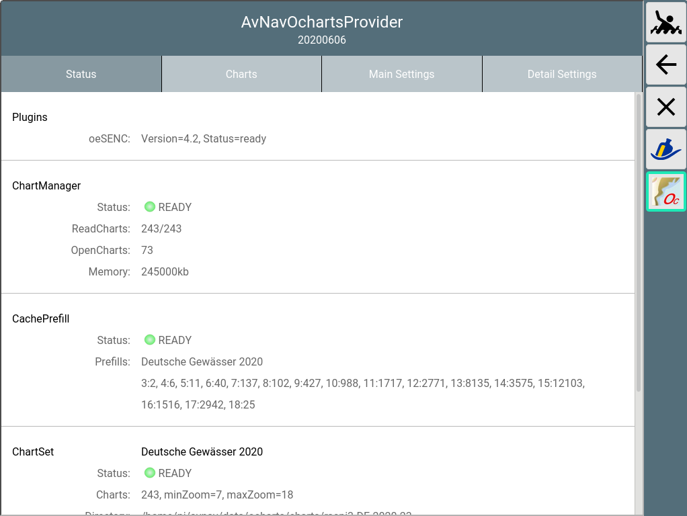  

Erwerb und Installation der Karten {: #Charts}
----------------------------------------------

Wichtiger Hinweis: Wenn man keinen Dongle
von o-charts hat, sind die Karten an das System gebunden. Wenn es daher
beim Einbringen oder bei der Nutzung der Karten Probleme gibt, bitte **nicht**
das System neu aufsetzen - sondern eine Reparatur versuchen. Wenn man
das System neu aufsetzt, werden die Lizenzen ungültig. Ich helfe gerne
bei Problemen - Kontakt z.B. per [email](mailto:andreas@wellenvogel.net).

Nur bei Nutzung der AvNav Images ist auch ein update der Images möglich.
Bitte im Zweifel vorher testen.

Um bei ocharts Karten kaufen zu können, muss [dort](https://o-charts.org/shop/de/autenticacion?back=my-account)
zunächst ein Konto angelegt werden.

Anschliessend muss man seine Systeme, auf denen man die Karten nutzen
möchte [auf der Seite von
o-charts](https://o-charts.org/shop/en/8-oesenc) registrieren. AvNav benutzt dabei den ["Offline"
Prozess](https://o-charts.org/manuals/?lng=de) .

Dieser besteht aus den folgenden Schritten:

1. Erzeugung eines "Fingerprints" für das System, auf dem die Karten
   genutzt werden sollen. Dieser kann in AvNav über die Bedienoberfläche
   des Plugins erzeugt und heruntergeladen werden.
2. Hochladen dieses Fingerprints zu o-charts und Anlegen eines Systems
   (im Wesentlichen Vergabe eines Namens)
3. Kaufen von Karten
4. Zuordnen zu dem angelegten System
5. Nach kurzer Zeit gibt es eine Mail von o-charts mit einem
   Download-Link für die Karten (Zip-File)
6. Hochladen der Karten in AvNav (wieder über die Bedienoberfläche des
   Plugins).

Für Updates werden die Schritte 4,5 und 6 wiederholt (bei 4 nur
Anforderung des Updates).

Für weitere Kartensätze Schritte 3-6.

Für die Schritte 2,3,4 und 5 wird natürlich ein System mit
Internet-Verbindung benötigt. Das kann z.B. ein Laptop oder auch ein
Android Tablet sein.

Für den Ablauf des Prozesses habe ich ein [Video](https://www.youtube.com/watch?v=q24VRAtbbEE)
gemacht, um ihn zu verdeutlichen. Hier noch einmal eine kurze Beschreibung
dazu.

**Hinweis**: Wenn die Karten auf dem gleichen System bereits für
OpenCPN registriert sind, dann kann man direkt mit Schritt 6 starten. Als
Alternative der Zugriff auf die OpenCPN Kartenverzeichniss mit o-charts
Karten auch im [Plugin konfiguriert](#PluginConfig) werden.

### 1. Erzeugung des Fingerprints

Über {{BT("DBUserApp")}}->auf die Oberfläche des
Plugins gehen, dort den Tab "Charts" auswählen.

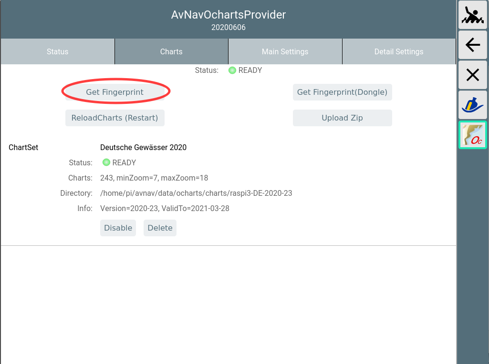

Mit "Get Fingerprint" die Erzeugung des Fingerprints anstossen. Falls man
einen Dongle von o-charts benutzt, den Fingerprint über "Get
Fingerprint(Dongle)" erzeugen.

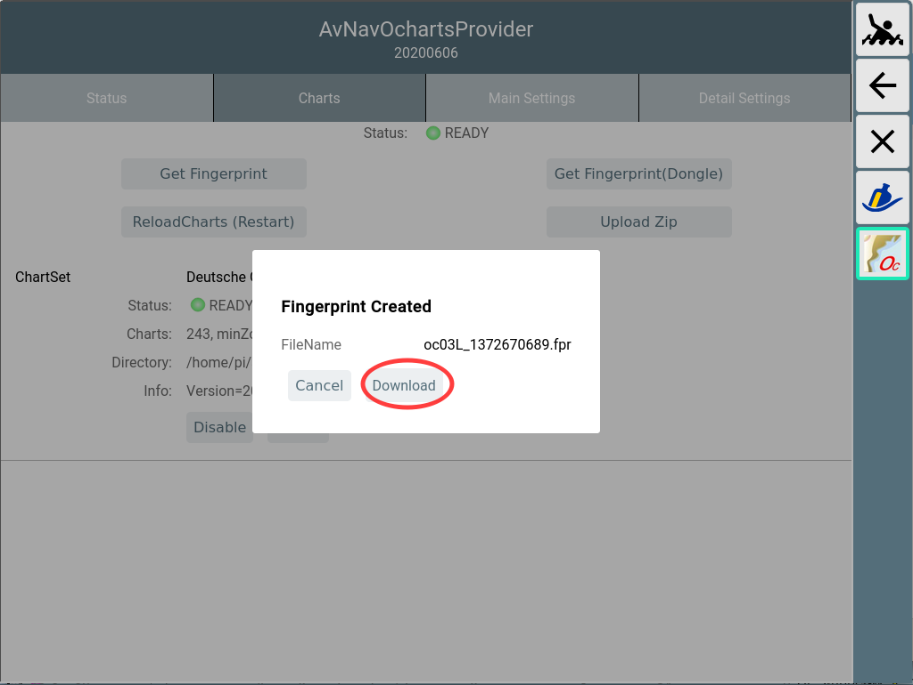

Im Dialog die erzeugte Datei auf meinem Gerät speichern.

### 2. Hochladen des Fingerprints zu o-charts

Auf die [o-charts Seit](https://o-charts.org/shop/en/8-oesenc)e
gehen und den Fingerprint hochladen.


Mit Choose File die unter 2. gespeicherte Datei wählen. Dazu einen
sinnvollen Namen vergeben (dieser findet sich später in den Mails mit den
Download Links).

### 3. Kaufen von Karten

Bei o-charts aus den verfügbaren [oeSENC
Karten](https://o-charts.org/shop/de/8-oesenc) die gewünschten kaufen.

### 4. Zuordnen zum angelegten System


Bei 1 kann die Zuordnung zu einem angelegten System erfolgen (hier nicht
mehr möglich, weil die Karten bereits zu den 2 maximal verfügbaren
Systemen zugeordnet sind). Bei 2 wird dann die Mail mit dem Download-Link
angefordert (das erfolgt auch bei Updates - hier im Bild zu sehen: Die
letzte abgerufene Version ist 21, verfügbar ist 23).

### 5. Herunterladen der Karten


Nach kurzer Zeit erhält man von o-charts eine Mail mit dem Download-Link.
Diese Datei (zip) herunterladen.

6. Hochladen der Zip-Datei zu AvNav.

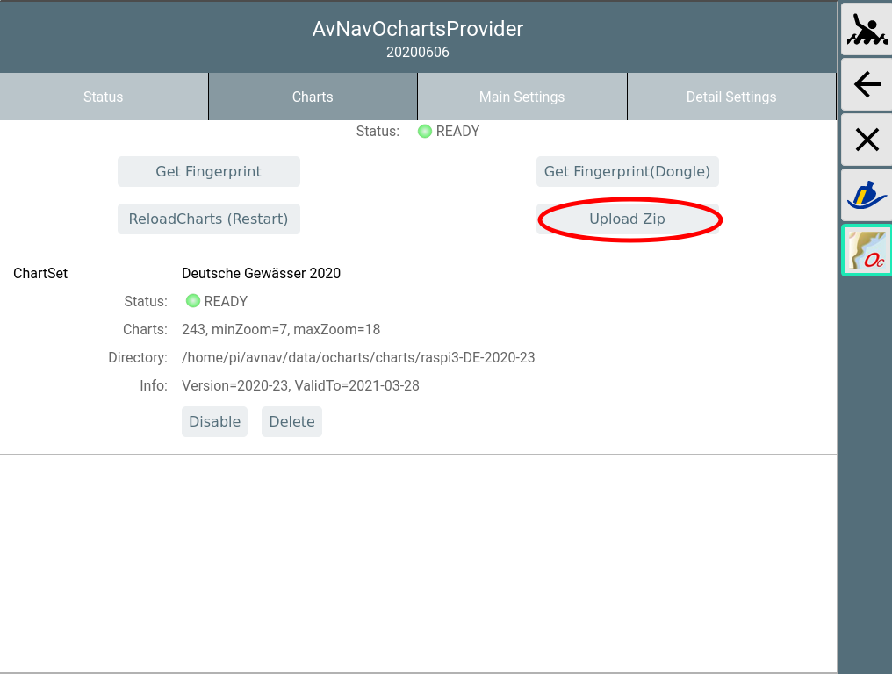

In der GUI des o-chart plugins über "Upload Zip" die im Schritt 5.
heruntergeladene Datei zu AvNav hochladen.

Während des Uploads wird ein Fortschritt angezeigt.

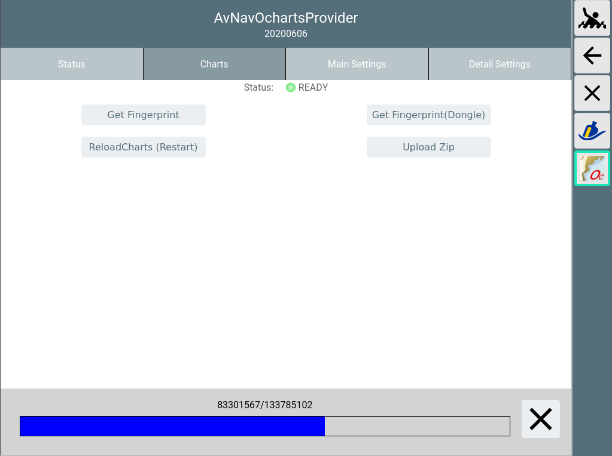

Am Ende des Uploads wird auf dem AvNav Server die Datei ausgepackt, und
es werden einige Prüfungen durchgeführt (das kann einige Sekunden dauern).

Die Karten werden (falls nicht anders konfiguriert) in das Verzeichnis
/home/pi/avnav/data/ocharts/charts hochgeladen.

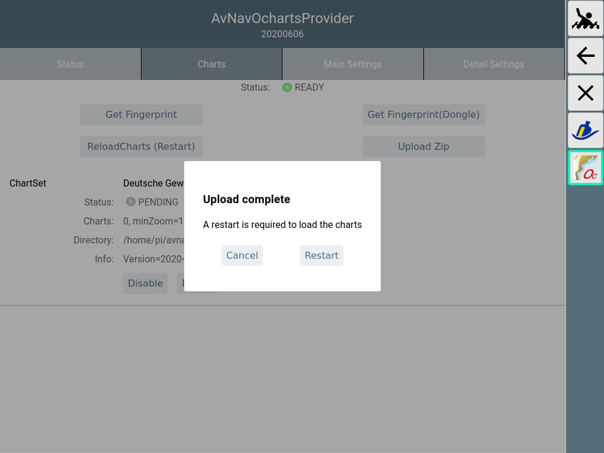

Wenn alle Prüfungen erfolgreich waren, wird angeboten sofort das Plugin
zu restarten um die Karten nutzen zu können.

Falls es sich bei den neu hochgeladenen Karten um ein Update schon
vorhandener Karten handelt, wírd der vorhandene Satz deaktiviert und der
neue Satz aktiviert (beim Restart). Das kann in der GUI später geändert
werden. Nicht mehr benötigte Sätze können hier gelöscht werden.

Beim Restart kommt es kurzzeitig zu einigen Fehlermeldungen, aber nach
max. 30s sollte der Status zumindest wieder gelb sein (das Plugin liest
jetzt alle vorhandenen Karten).

Wenn die Karten erfolgreich geladen werden konnten, sollte am Ende der
Status für die Karten auf grün (READY) gehen.

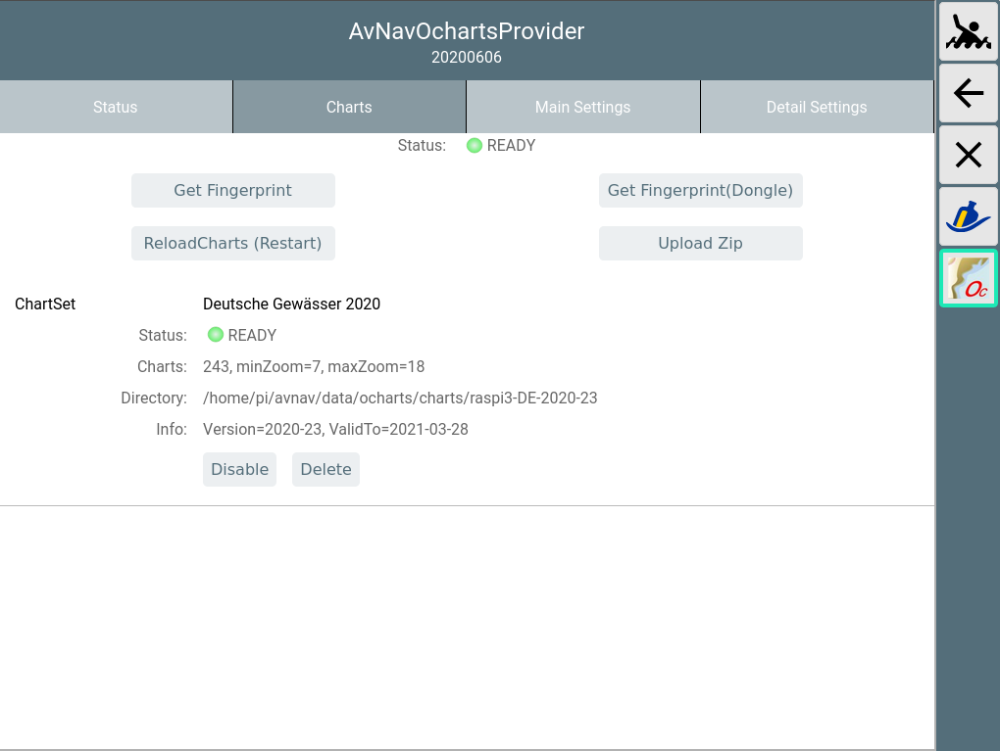

Falls der Status zu "ERROR" (rot) wird, wurde u.U. ein Zip-File
hochgeladen, was für ein anderes System zugeordnet war. Details kann man
im Log File (/home/pi/avnav/data/ocharts/provider.log) sehen.

Nun sind die Karten verfügbar und können genutzt werden.  
Unter dem Tab Status kann man etwas mehr Details erhalten.

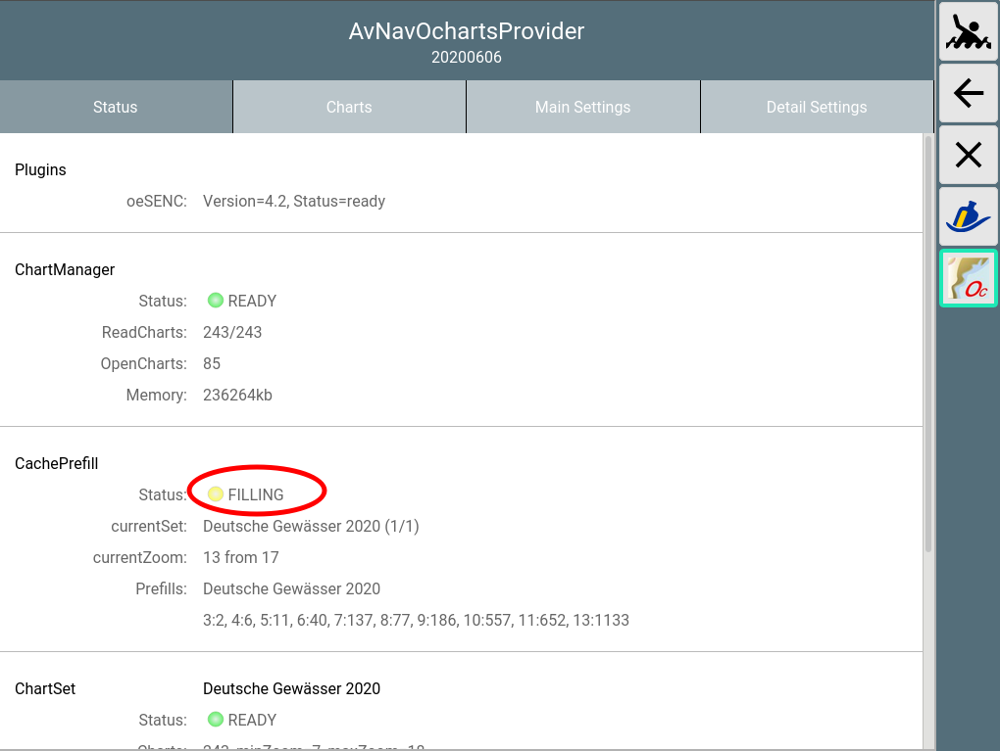

Im Bild ist zu sehen, das nach dem Hochladen jetzt automatisch bereits
eine Erzeugung von Kartenkacheln angelaufen ist ("Cache Prefill"). Das
sorgt dafür, das die Verzögerungen, die sonst bei der Nutzung durch die
begrenzten Resourcen des Raspberry Pi entstehen können, verringert werden.
Dazu wird nach einem bestimmten Verfahren ein Teil der Kacheln im Bereich
des Kartensatzes vorab erzeugt und in einem Cache File gespeichert.

Trotzdem können die Karten auch bereits unmittelbar genutzt werden.


Wie bereits erwähnt, kann es bei der erstmaligen Nutzung in einem
bestimmten Bereich zu Verzögerungen kommen (insbesondere auf den
kleineren/älteren Pi's) - nach der erstmaligen Nutzung sind die Kacheln
für den Bereich aber im Cache-Speicher und die Verzögerungen sind minimal.

Anpassung des Aussehens {: #MainSettings}
-----------------------------------------

Da die O-charts Karten zunächst als Vektorkarten vorhanden sind, kann in
weiten Bereichen das Aussehen der Karten angepasst werden. Dabei sind
allerdings einige Einschränkungen zu beachten:

1. Die Anpassung erfolgt auf der Server-Seite und ist damit für alle
   verbundenen Displays gleichartig wirksam
2. Wenn das Aussehen geändert wird, müssen alle bereits im Cache
   vorhandenen Daten gelöscht werden und alle Karten-Kacheln müssen neu
   berechnet werden. Das kann auf langsamen Systemen wieder zu
   Verzögerungen führen. Es läuft sofort wieder der automatische
   Prefill-Prozess an, um möglichst viele Kacheln schon vorberechnet zur
   Verfügung zu haben.

Die Veränderung der Parameter erfolgt über die GUI des Plugins ({{BT("DBUserApp")}}->),
Tab "Main Settings".

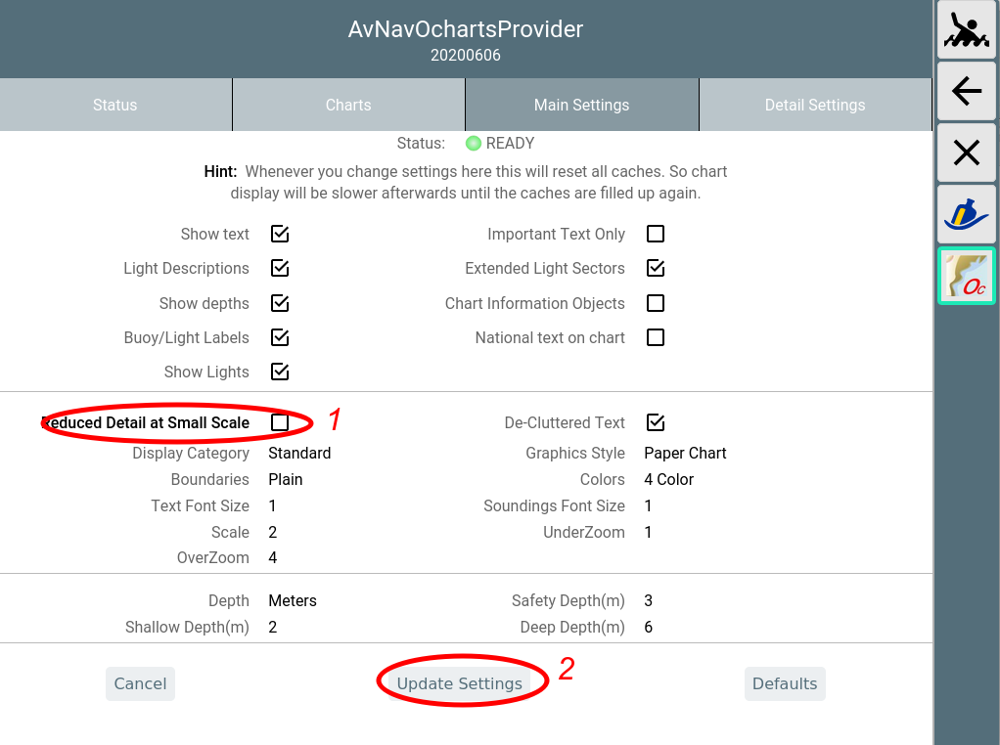

Wenn eine Einstellung geändert wird (1) wird der Parameter fett
dargestellt. Die Änderungen werden erst wirksam, wenn "Update Settings"(2)
angeklickt wird.

Mit Cancel können die Änderungen zurückgenommen werden, Defaults setzt
die Einstellungen auf Default-Werte. Die Parameter entsprechen weitgehend
den bei [OpenCPN
vorhandenen Settings](https://opencpn.org/wiki/dokuwiki/doku.php?id=opencpn:opencpn_user_manual:options_setting).

Die folgende Tabelle listet die Einstellungen.

|  |  |  |
| --- | --- | --- |
| Name | Bedeutung | Default |
| Show Text | Zeige Texte zu den Objekten auf der Karte | true |
| Important Text Only | Verberge weniger wichtige Texte | false |
| Light Descriptions | Beschreibungen für Feuer | true |
| Extended Light Sectors | Sektoren für Feuer | true |
| Show Depth | Zeige Tiefen Werte | true |
| Chart Information Objects | spezielle Objekte auf der Karte | true |
| Buoy/Light Labels | Bezeichnungen für Feuer/Tonnen | true |
| National text on chart | Nationale Texte | true |
| Show Lights | Zeige Feuer | true |
| Reduced Detail at Small Scale | Reduziere die Details auf geringeren Zoom-Leveln | true |
| De-Cluttered Text | Bessere Anordnung der Texte | true |
| Display Category | Art der Darstellung (Base,Standard,All,User Standard) | All |
| Graphics Style | Grafische Darstellung (Paper Chart, Simplified) | Paper Chart |
| Boundaries | Art der Begrenzungen (Plain, Symbolized) | Plain |
| Colors | Farben (4 Color, 2 Color) | 4 Color |
| Text Font Size | Skalierung für die Text-Grösse | 1 (ca. 12px) |
| Soundings Font Size | Skalierung für die Tiefen-Angaben (ab oesenc-pi 4.2.x) | 1 (ca. 12px) |
| Scale | Basis Skalierung. Höhere Werte sorgen für mehr Details auf kleineren Zoom-Stufen | 2 |
| UnderZoom | Anzahl der Zoom Stufen, die eine höher aufgelöste Karte verkleinert wird, wenn auf dem gewünschten Level keine Karte vorhanden ist | 1 |
| OverZoom | Anzahl der Zoom Stufen, die eine niedriger aufgelöste Karte vergrößert wird,wenn es keine besser aufgelöste Karte gibt.  **Hinweis**: Scale,UnderZoom und OverZoom bestimmen massgeblich, wie aufwendig der Render-Vorgang ist, d.h. wieviele Karten an der Erzeugung einer Kachel beteiligt werden müssen. Kleinere Werte führen zu weniger Karten (schneller) können aber in bestimmten Bereichen zu weissen Flächen zwischen Karten-Teilen führen. Die Defaults sollten ein guter Kompromiss sein. | 4 |
| Depth | Einheit für die Tiefen-Angaben (Meters, Feet, Fathoms) | Meters |
| Shallow Depth | Tiefe für Flachwasser | 2 |
| Safety Depth | Tiefe für Sicherheits-Kontur | 3 |
| Deep Depth | Tiefe für Tiefwasser | 6 |

Unter dem Tab "Detail Settings" können gezielt einzelne Karten-Features
an- oder abgeschaltet werden.

Feature Info (Object Query) {: #featureinfo}
--------------------------------------------

Ab der Version 20201219 (erfordert entsprechende Version von AvNav und
vom plugin) gibt es eine Information zu den Objekt Eigenschaften bei Klick
auf die Karte.


Es wird in dieser Darstellung zunächst die komprimierte Information zu
einem Objekt angezeigt. Diese ist jedoch nur für Lichter, Tonnen und
einige andere ausgewählte Klassen so verfügbar.

Über "Info" können die Roh-Informationen der Karten angezeigt werden.

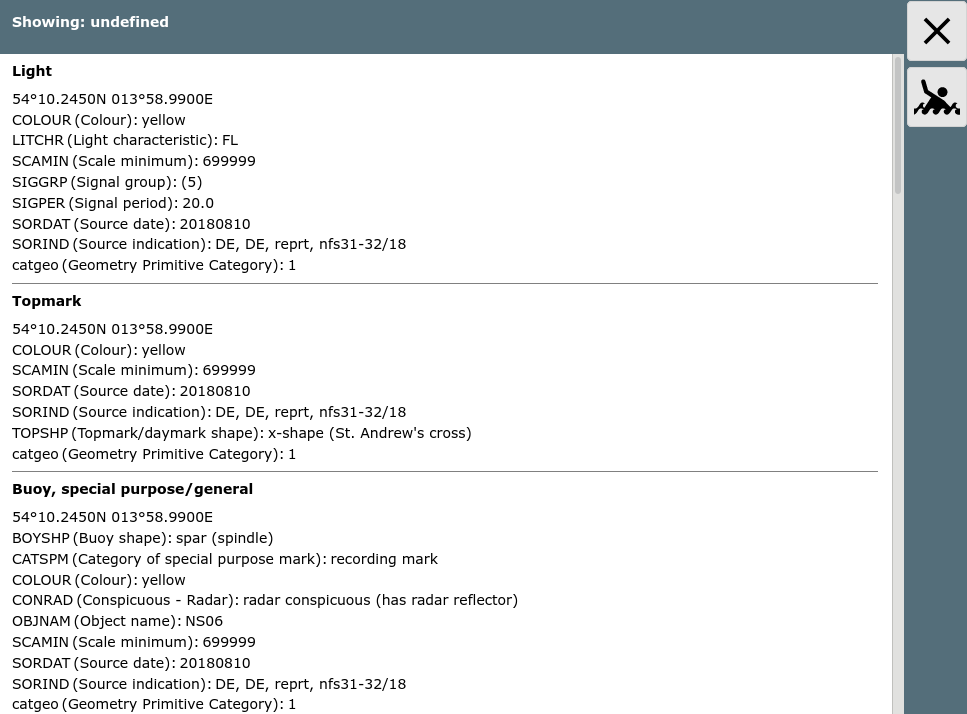

  

Installation {: #Installation}
------------------------------

Die Installation kann normal als Paket in den AvNav Images erfolgen. Für
die [Headless Images](../install.md#Headless) sind die
nötigen Pakete bereits installiert. Zusätzlich sind die Pakete auch im
Repository vorhanden. Es müssen die Pakete

* avnav-ocharts-plugin
* avnav-oesenc

installiert werden. Für das Paket avnav-ocharts-provider ist mindestens
die Version 20200606 nötig. Das Paket avnav-oesenc ist das oesenc-pi
plugin - allerdings so verpackt, das es nach
/usr/lib/avnav/plugins/ocharts installiert wird, um Konflikte mit einer
OpenCPN Installation zu vermeiden.

```
sudo apt-get update  
sudo apt-get install avnav-ocharts-plugin avnav-oesenc  
sudo systemctl restart avnav
```

Falls auf anderen Images gearbeitet wird, sollte das Repository von
free-x hinzugefügt werden.

```
deb https://www.free-x.de/debian buster main contrib non-free
```

Die Pakete sind auch in der Release Liste hier darunter zu finden. Um ein
solches Paket zu installieren (falls es noch nicht im Repo ist - oder um
ein älteres zu verwenden) - das Paket herunterladen und installieren (die
Version durch die jeweils aktuelle ersetzen).

```
cd /home/pi/avnav  
wget -O avnav-ocharts-plugin_20200606-raspbian-buster_armhf.deb https://www.wellenvogel.net/software/avnav/downloads/release-ochartsplugin/20200606/avnav-ocharts-plugin_20200606-raspbian-buster_armhf.deb   
sudo dpkg -i /home/pi/avnav/avnav-ocharts-plugin_20200606-raspbian-buster_armhf.deb  
sudo systemctl restart avnav
```
Alternativ kann man das Paket natürlich auch auf einem PC herunterladen und
dann z.B. per scp/WinScp auf den pi kopieren und dann dort installieren.  

Releases
--------

Alle Releases und auch zwischenzeitlich eventuell gebaute
Entwickler-Versionen (daily builds) findet man unter:

* [Releases](../../downloads/release-ochartsplugin)
* [Daily Builds](../../downloads/daily-ochartsplugin)


### Release Versionen

* 20260703 [packages](../../downloads/release-ochartsplugin/20260703)

+ Vorbereitung auf neue AvNav Versionen

* 20230706 [packages](../../downloads/release-ochartsplugin/20230706)

+ Fehlerkorrektur: Checkboxen in den Einstellungen wieder sichtbar

* 20230702 [packages](../../downloads/release-ochartsplugin/20230702)

+ Fehlerkorrektur [#41](https://github.com/wellenvogel/avnav-ocharts-provider/issues/41):
  Korrektes Handling von SENC overlays
+ Fehlerkorrektur [#47](https://github.com/wellenvogel/avnav-ocharts-provider/issues/47):
  Korrektes Handling von obsoleten Karten (open error 3)
+ Verbesserung: Erlaube das Setzen eines Render-Timeouts in den
  Plugin-Einstellungen
+ Nutzung von OpenCPN Karten sollte besser funktionieren

* 20220605 [packages](../../downloads/release-ochartsplugin/20220605)

+ Fehlerkorrektur [#36](https://github.com/wellenvogel/avnav-ocharts-provider/issues/36):
  Probleme unter OpenPlotter mit OpenCPN auf flatpak

* 20220421 [packages](../../downloads/release-ochartsplugin/20220421)

+ Fehlerkorrektur: Fehler beim restart des providers
+ dependencies to avnav-ocharts

* 20220307 [packages](../../downloads/release-ochartsplugin/20220307)

+ Fehlerkorrektur [#31](https://github.com/wellenvogel/avnav-ocharts-provider/issues/31):
  Checkbox für OpenCPN Integration nicht angezeigt
+ Fehlerkorrektur: falsche Version angezeigt
+ besseres Fehlerhandling beim Nutzen der Karten, Anzeige solcher
  Fehler im Status
+ korrekter Bereich für "memPercent" bei der Konfiguration

* 20220225 [packages](../../downloads/release-ochartsplugin/20220225)

+ Neuer [O-charts shop](https://o-charts.org/shop/en/)  
  In den nächsten Tagen wird im o-charts Shop ein neues
  Verschlüsselungsschema eingeführt.  
  Das erfordert diese neue Version für das AvNav plugin. **Ausserdem
  muss man das neue avnav-ocharts Paket installieren** - mindestens
  in der Version 0.9.0.72 (sinnvoll nutzt man dafür das avnav update
  plugin). Das (alte) Paket avnav-oesenc ist jetzt überflüssig und kann
  deinstalliert werden. Es kann aber auch problemlos auf dem System
  verbleiben.  
  Die Benutzung der Karten und der Kaufprozess haben sich nicht
  geändert. Ebenso funktionieren alle vorhandenen Karten weiter. Wenn
  die Änderung im Shop vollzogen ist, können allerdings keine Karten
  mehr heruntergeladen und mit dem alten plugin genutzt werden.  
  Mit dem neuen plugin(und dem neuen Shop) **ist AvNav jetzt auch in
  der Lage oeRNC Karten zu nutzen**  (wie z.B. die Imray Karten
  für das Mittelmeer).
+ Es gibt jetzt auch Pakete für die raspberry debian bullseye OS
  Versionen (sowohl 32 bit als auch 64 bit)
+ Der Schalter "reduce details on lower zoom levels" funktioniert
  jetzt korrekt
+ Die "under zoom" Einstellung arbeitet jetzt effitzineter, so das der
  erlaubte Bereich vergrössert und der default auf 4 gesetzt wurde. Das
  vermeidet potentielle weisse Flächen, wenn es keine Karten direkt für
  den gewählten zoom level gibt.
+ Man kann jetzt direkt die Nutzung der ggf. unter OpenCPN auf dem
  gleichen System installierten Karten direkt in den AvNav plugin
  Einstellungen aktivieren (man muss nicht mehr die Konfig-Datei
  bearbeiten). Das funktioniert aber nur für Karten, die mit dem neuen
  ocharts\_pi plugin bei OpenCPN installiert wurden.

* 20210711 [Pakete](../../downloads/release-ochartsplugin/20210711)

+ Fehlerkorrektur: Caches werden nicht neu gebaut nach
  Parameter-Änderung

* 20210328 [Pakete](../../downloads/release-ochartsplugin/20210328)

+ Parameter handling in AvNav (erfordert AvNav ebenfalls ab 20210322)
+ Limit für Zip-Grösse auf 3GB erweitert
+ Fehler beim Restart behoben

* 20210115 [Paket](../../downloads/release-ochartsplugin/20210115/avnav-ocharts-plugin_20210115-raspbian-buster_armhf.deb)

+ Umstellung auf python3 (erfordert AvNav ebenfalls ab 20210115)
+ besseres Handling von Fehlern beim Laden der Karten

* 20201219 [Paket](../../downloads/release-ochartsplugin/20201219/avnav-ocharts-plugin_20201219-raspbian-buster_armhf.deb)

+ Anzeige von Objekt-Informationen (erfordert AvNav ebenfalls ab
  20201219)

* 2020115 [Paket](../../downloads/release-ochartsplugin/20201105/avnav-ocharts-plugin_20201105-raspbian-buster_armhf.deb)

+ Verbessertes Memory Handling: Der Xvfb wird überwacht und restartet,
  wenn er > 120 MB Speicher braucht
+ Schnellerer Start: Die Karteninformationen werden in einem Cache
  gehalten, es wird nur neu gelesen, wenn sich an den Karten etwas
  ändert
+ Speicherleak im OpenCPN plugin beseitigt (workaround) - damit wächst
  der Speicherverbrauch vom Xvfb nicht mehr so stark
+ Hinweis: Nach Installation per Hand mit dpkg (erzeugt einen Fehler)
  müssen ggf mit
  ```
  sudo apt-get install -f
  ```
  die neuen Abhängigkeiten nachinstalliert werden.

* 20200710 [Paket](https://www.wellenvogel.net/software/avnav/downloads/release-ochartsplugin/20200710/avnav-ocharts-plugin_20200710-raspbian-buster_armhf.deb)

+ Das Verzeichnis für die Karten kann separat eingestellt werden -
  siehe [Details](#Upload)
+ Beim Hochladen von Karten wird jetzt sofort geprüft, ob die Karten
  gelesen werden können, sonst wird das Hochladen verweigert
+ Keine Fehler mehr in der GUI beim Restart des Providers
+ Funktioniert auch auf einer vfat Partition wie sie von avnav-touch
  genutzt wird

* 20200705 [Paket](https://www.wellenvogel.net/software/avnav/downloads/release-ochartsplugin/20200705/avnav-ocharts-plugin_20200705-raspbian-buster_armhf.deb)

+ Korrektur für ein Problem im OpenCPN plugin das potentiell dafür
  sorgt, das nach längerer Laufzeit keine Karten mehr dekodiert werden
  können.

* 20200606 [Paket](https://www.wellenvogel.net/software/avnav/downloads/release-ochartsplugin/20200606/avnav-ocharts-plugin_20200606-raspbian-buster_armhf.deb)

+ erste Version

Lizenzhinweise {: #License}
---------------------------

Die Nutzung der Karten für AvNav mit dem oesenc-pi Plugin ist so mit
o-charts diskutiert und abgestimmt worden und ist damit legal im Sinne der
Lizenzen.  
Die [Lizenzbedingungen](https://o-charts.org/manuals/docs/EN_rrc_eula_ChartSetsForOpenCPN.md)
von [o-charts](https://o-charts.org/shop/en/content/3-our-conditions)
sind dabei unbedingt zu beachten. Es ist insbesondere nicht gestattet, die
Karten zu kopieren oder auf anderen als den lizensierten Systemen
einzusetzen.

Der Zugriff auf die Karten innerhalb von AvNav ist nur aus dem lokalen
Netz möglich, maximal können 5 Geräte (Clients) gleichzeitig die o-charts
von einem AvNav Server nutzen.

Für die Software-Lizenzen siehe die [Readme.](https://github.com/wellenvogel/avnav-ocharts-provider/blob/master/Readme.md)

Konfiguration des Plugins {: #PluginConfig}
-------------------------------------------

Einige Konfigurationen des plugins können über die Server/Status 
Seite unter "plugins/system-ocharts" vorgenommen werden (AvNav >=
20210322).

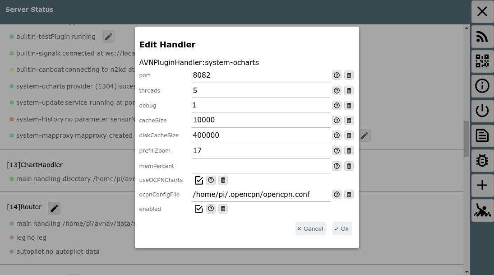

Das sind die folgenden Parameter:

|  |  |  |
| --- | --- | --- |
| Name | Bedeutung | Default |
| port | Http port für das plugin | 8082 |
| threads | Zahl der zu nutzenden Threads | 5 |
| debug | Level für das logging (<datadir>/ocharts/provider.log).  <datadir> ist auf einem RaspBerry Pi /home/pi/avnav/data | 1 |
| cacheSize | Maximale Zahl von Karten-Kacheln, die im Speicher gehalten werden sollen. Der Provider berücksichtigt aber auch noch den erlaubten Speicher und verringert diese Zahl potentiell | 10000 |
| diskCacheSize | Maximale Zahl von Kartenkacheln für einen Kartensatz, die im Cache-File auf der SD Karte gehalten werden sollen | 400000 |
| prefillZoom | Bis zu welchem Zoomlevel sollen beim Prefill schon Kacheln berechnet werden. Wenn man diesen Wert höher setzt, dauert der Prefill entsprechend länger. | 17 |
| memPercent | Der prozentuale Anteil des Systemspeichers, den der Provider maximal nutzen soll. Wenn man diesen nicht setzt (oder zu klein) berechnet der Provider intern einen Minimalwert und nutzt diesen.  Der kann u.U. insbesondere bei der Nutzung von Rasterkarten sehr klein sein und ihn damit zwingen ständig Karten-Dateien zu öffnen und zu schliessen - was die Geschwindigkeit stark reduzieren kann. Wenn man ausreichend Speicher hat (z.B. > 2GB), wird das Arbeiten beschleunigt, wenn man  den Speicher auf 1GB setzt. | --- |
| useOCPNCharts  (seit 20220225) | Wenn dieses Flag gesetzt ist, können Karten, die von OpenCPN auf dem gleichen System genutzt werden, auch in AvNav direkt verwendet werden. Das geht allerdings nur mit den Karten, die mit dem neuen o-charts\_pi Plugin installiert wurden (ab 1.3. 2022). | aus |
| ocpnConfigFile  (seit 20220225) | Der Pfad zum OpenCPN config file (normalerweise $HOME/.opencpn/opencpn.conf). Diese Datei muss gelesen werden, um die installierten Karten zu finden. | $HOME/.opencpn/opencpn.conf |

Technische Details {: #Details}
-------------------------------

Die eigentliche Bereitstellung der Karten erfolgt durch ein executable
auf dem Raspberry, das standardmäßig über den Port 8082 erreichbar ist.
Dieses executable lädt das oesenc-pi OpenCPN plugin.   
Die Kommunikation mit AvNav erfolgt über ein [plugin](plugins.md)
in AvNav.

Die GUI ist eine reactjs Anwendung, die ebenfalls durch das executable
bereitgestellt wird und in AvNav als [User
App](../userdoc/addonpage.md) integriert ist.

Der Code ist verfügbar auf [GitHub](https://github.com/wellenvogel/avnav-ocharts-provider).

Die Installation erfolgt in das Verzeichnis
/usr/lib/avnav/plugins/ocharts. Die Daten liegen im Verzeichnis
/home/pi/avnav/data/ocharts. Für das Plugin können in der [avnav\_server.xml](configfile.md)noch einige weitere Konfigurationen vorgenommen werden (die meisten
direkt in der UI - siehe weiter oben). Im Normalfall ist das aber nicht
nötig. Falls solche Konfigurationen erfolgen sollen, müssen sie unterhalb
des Plugin-Managers stattfinden.

Ab Version 20200709 kann auch das Verzeichnis für die Karten separat gesetzt
werden:
```
<AVNPluginHandler>  
...  
<system-ocharts uploadDir="$DATADIR/charts/ocharts"/>  
</AVNPluginHandler>
```

Hier wird das Verzeichnis auf /home/pi/avnav/data/charts/ocharts gesetzt
(es liegt sonst auf /home/pi/avnav/data/ocharts/charts). Das kann z.B. auf
dem [touch image](../install.md#Touch) hilfreich sein, da
dort nur im Verzeichnis /home/pi/avnav/data/charts ausreichend Platz
verfügbar ist.