AvNav OCharts


Avnav Ocharts(NG)
=================

AvNav ochartsng ist eine neue Implementierung als Ersatz für das [AvNav
ocharts plugin](ocharts.md).  
Diese hat eine Reihe von neuen Funktionen:

* Sie läuft jetzt auch unter Android (siehe [unten](#android))
* Es gibt eine direkte Onlineverbindung zum O-Charts Shop
* Es können jetzt auch unverschlüsselte S57 Karten verwendet werden
  (nach einer einmaligen [Konvertierung](#chartconversions))
* Die Anzeige kann noch stärker angepasst werden
* Es werden keine großen Disk-Caches mehr angelegt. Das verringert die
  Schreiblast auf der SD Karte und die CPU Last.
* Es braucht keinen Restart mehr, wenn neue Karten hinzugefügt werden.
* Es können mehr Prozessorkerne genutzt werden und es sollte auf den
  meisten Systemen schneller laufen.
* Es werden wesentlich weniger externe Pakete benötigt. Insbesondere
  auch keine lauffähige X11 Umgebung.
* Es wird weniger Speicher benötigt.

Gegenüber dem alten ocharts plugin gibt es die
folgenden Einschränkungen:

* Es können keine oeRNC Karten (Rasterkarten
  von o-charts) gelesen werden
* Karten von OpenCPN können nicht direkt genutzt werden. Da OpenCPN
  keine definierte Struktur der Konfiguration bietet, müssen die Karten
  noch einmal parallel im plugin installiert werden. Ausser auf Android
  wird allerdings der gleiche Key genutzt.

Übersicht
---------

AvNav kann Karten in verschiedenen Raster-Formaten verarbeiten. Bisher
war es aber nicht in der Lage, offiziell verfügbare Seekarten zu lesen und
anzuzeigen. Seit einiger Zeit gibt es die Firma [o-charts](https://o-charts.org/),
die Karten für viele Gebiete der Erde für OpenCPN bereitstellt.

Nach einigen Absprachen mit der Firma können diese Karten nun auch für
AvNav genutzt werden (ab Version  2024xxx mit diesem neuen plugin - [siehe unten](#Installation)).

Bisher können die oesenc Vektor-Karten genutzt werden.   
Ausserdem kann das Plugin freie S57 Karten nutzen (nach [Konvertierung](#chartconversions)).

Die Umwandlung in die für AvNav notwendigen Raster-Karten erfolgt dabei
im laufenden Betrieb immer dann, wenn die Karten dargestellt werden
sollen. Ein gewisser Teil der Kartenkacheln wird im Server im Speicher
aufbewahrt, so das diese sehr schnell erneut bereitgestellt werden können.
Das beschleunigt die Anzeige, wenn man zwischen verschiedenen Zoom Stufen
wechselt oder mehrere Displays angeschlossen sind.

Das Handling der Karten erfolgt dabei vollständig durch das Plugin - das
betrifft auch die Installation (die Karten können nicht über die normale [Download-Seite](../userdoc/downloadpage.md) hochgeladen
werden). Das Plugin hat dazu eine eigene GUI, die von der Hauptseite über
den Button {{BT("DBUserApp")}}(User
Apps) und dort über den Button OchartsNG  erreichbar ist.

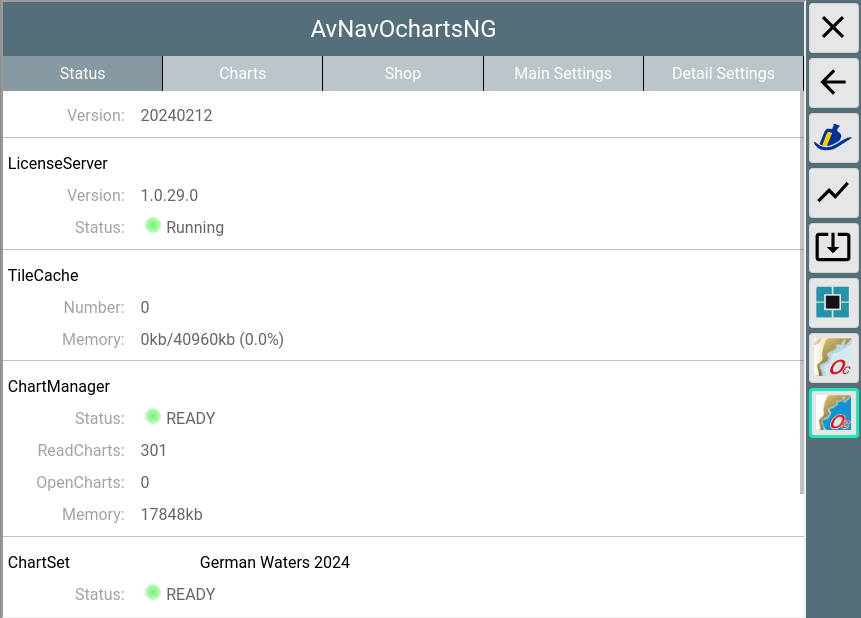

  

Karten Typen
------------

AvNav ochartsng kann die o-chart Vektorkarten darstellen (oeusenc) - so
wie in diesem Dokument beschrieben.  
Ausserdem können unverschlüsselte Vektorkarten (S57) benutzt werden. Diese
sind für verschiedene Regionen frei zum Download verfügbar.  
Um solche S57 Karten nutzen zu können, müssen sie zunächst in das genutzte
OpenCPN SENC Format umgewandelt werden.  
Für eine Anleitung zur Konvertierung siehe [Karten
Konvertierungen](#chartconversions).

Erwerb und Installation der Karten {: #Charts}
----------------------------------------------

Wichtiger Hinweis: Wenn man keinen Dongle
von o-charts hat, sind die Karten an das System gebunden. Wenn es daher
beim Einbringen oder bei der Nutzung der Karten Probleme gibt, bitte **nicht**
das System neu aufsetzen - sondern eine Reparatur versuchen. Wenn man
das System neu aufsetzt, werden u.U. die Lizenzen ungültig. Ich helfe
gerne bei Problemen - Kontakt z.B. per [email](mailto:andreas@wellenvogel.net).

Nur bei Nutzung der AvNav Images ist auch ein update der Images möglich.
Bitte im Zweifel vorher testen.

Um bei ocharts Karten kaufen zu können, muss [dort](https://o-charts.org/shop/de/autenticacion?back=my-account)
zunächst ein Konto angelegt werden.  
Anschliessend muss man seine Systeme, auf denen man die Karten nutzen möchte
[auf der Seite von o-charts](https://o-charts.org/shop/en/8-oesenc)
registrieren.

Für den gesamten Prozeß gibt es zwei Wege - den "[Online
Proceß](https://o-charts.org/manuals/?lng=en) " und den ["Offline
Prozeß"](https://o-charts.org/manuals/offline.php?lng=en) .   
Der online Prozeß erfordert, das das System (auf dem der AvNav Server
läuft - das muss nicht das System sein, auf dem der Browser läuft) mit dem
Internet verbunden ist.  
Für Android ist die Registrierung eines neuen Systems nur über den online
Prozeß möglich.

### Der Offline Prozeß {: #offlineprocess}

Dieser besteht aus den folgenden Schritten:

1. Erzeugung eines "Fingerprints" für das System, auf dem die Karten
   genutzt werden sollen. Dieser kann in AvNav über die Bedienoberfläche
   des Plugins erzeugt und heruntergeladen werden.
2. Hochladen dieses Fingerprints zu o-charts und Anlegen eines Systems
   (im Wesentlichen Vergabe eines Namens)
3. Kaufen von Karten
4. Zuordnen zu dem angelegten System
5. Nach kurzer Zeit gibt es eine Mail von o-charts mit einem
   Download-Link für die Karten (Zip-File)
6. Hochladen der Karten in AvNav (wieder über die Bedienoberfläche des
   Plugins).

Für Updates werden die Schritte 4,5 und 6 wiederholt (bei 4 nur
Anforderung des Updates).

Für weitere Kartensätze Schritte 3-6.

Für die Schritte 2,3,4 und 5 wird natürlich ein System mit
Internet-Verbindung benötigt. Das kann z.B. ein Laptop oder auch ein Android
Tablet sein.  


Wichtiger Hinweis für Android: Die
Registrierung eines Systems (Schritte 1 und 2) können nur im [Online
Prozeß](#onlineprocess) erledigt werden.

Für den Ablauf des Offline-Prozesses habe ich ein [Video](https://www.youtube.com/watch?v=q24VRAtbbEE)
gemacht, um ihn zu verdeutlichen. Hier noch einmal eine kurze Beschreibung
dazu.

**Hinweis**: Wenn die Karten auf dem gleichen System bereits für
OpenCPN registriert sind, dann kann man direkt mit Schritt 6 starten (aber
nicht für Android - siehe die  [Einschränkungen](#restrictions)
oben).

#### Erzeugung des Fingerprints

Über {{BT("DBUserApp")}}-> auf die Oberfläche des
Plugins gehen, dort den Tab "Charts" auswählen.

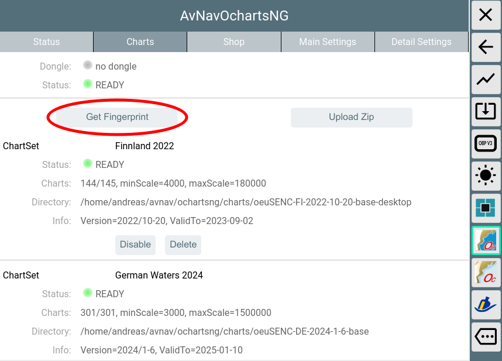

Mit "Get Fingerprint" die Erzeugung des Fingerprints anstossen. Falls man
einen Dongle von o-charts benutzt, den Fingerprint über "Get
Fingerprint(Dongle)" erzeugen. Dieser wird nur sichtbar, wenn ein dongle
erkannt wurde (Dongle Zeile grün).

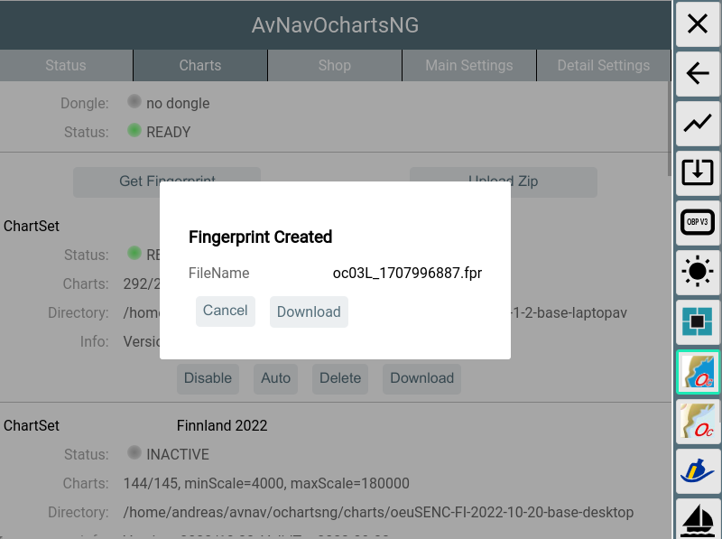

Im Dialog die erzeugte Datei auf meinem Gerät speichern.

#### Hochladen des Fingerprints zu o-charts

Auf die [o-charts Seit](https://o-charts.org/shop/en/8-oesenc)e
gehen und den Fingerprint hochladen.

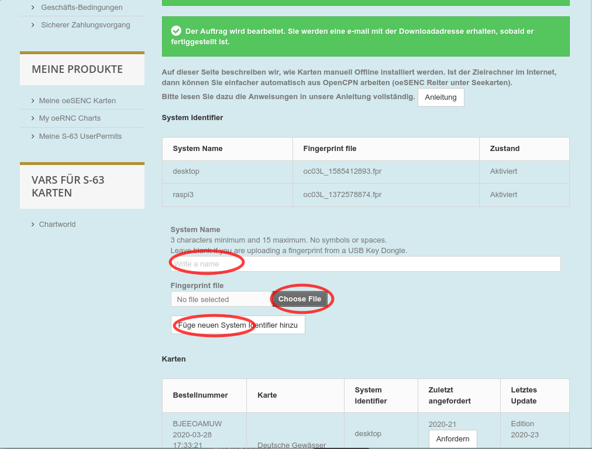

Mit Choose File die unter 2. gespeicherte Datei wählen. Dazu einen
sinnvollen Namen vergeben (dieser findet sich später in den Mails mit den
Download Links).

#### Kaufen von Karten

Bei o-charts aus den verfügbaren [oeSENC
Karten](https://o-charts.org/shop/de/8-oesenc) die gewünschten kaufen.

#### Zuordnen zum angelegten System

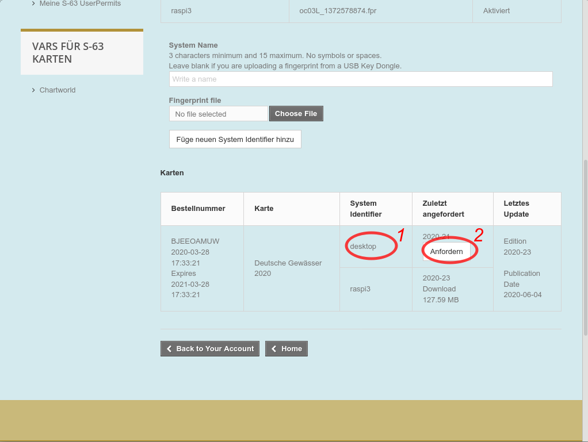

Bei 1 kann die Zuordnung zu einem angelegten System erfolgen (hier nicht
mehr möglich, weil die Karten bereits zu den 2 maximal verfügbaren
Systemen zugeordnet sind). Bei 2 wird dann die Mail mit dem Download-Link
angefordert (das erfolgt auch bei Updates - hier im Bild zu sehen: Die
letzte abgerufene Version ist 21, verfügbar ist 23).

#### Herunterladen der Karten

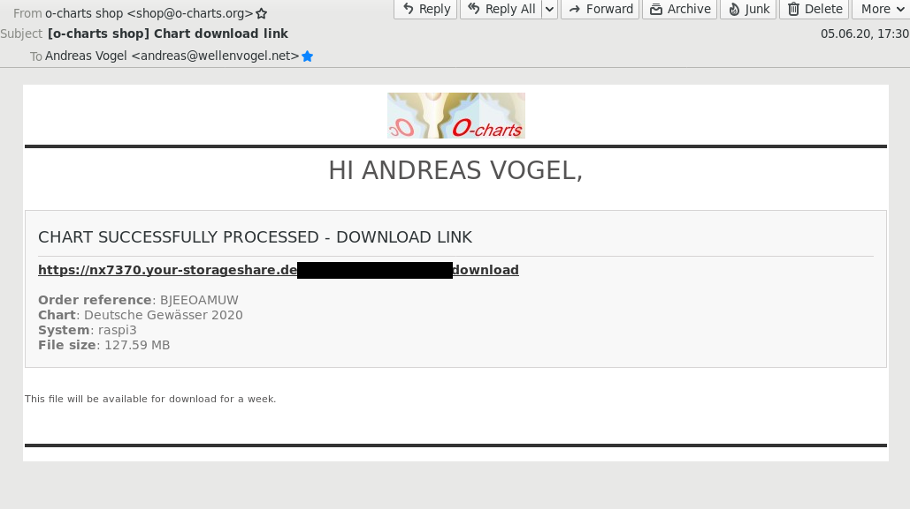

Nach kurzer Zeit erhält man von o-charts eine Mail mit dem Download-Link.
Diese Datei (zip) herunterladen.

#### Hochladen der Zip-Datei zu AvNav

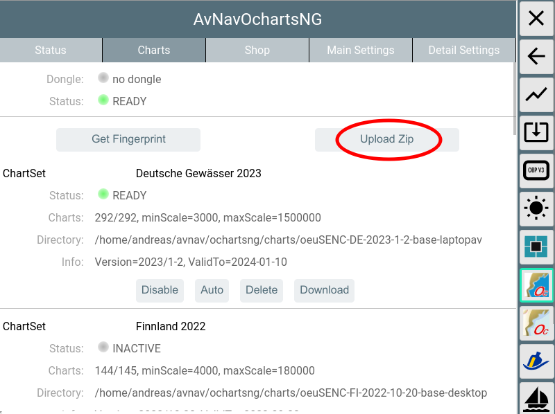

In der GUI des o-chart plugins über "Upload Zip" die im Schritt 5.
heruntergeladene Datei zu AvNav hochladen.   
Während des Uploads wird ein Fortschritt angezeigt.

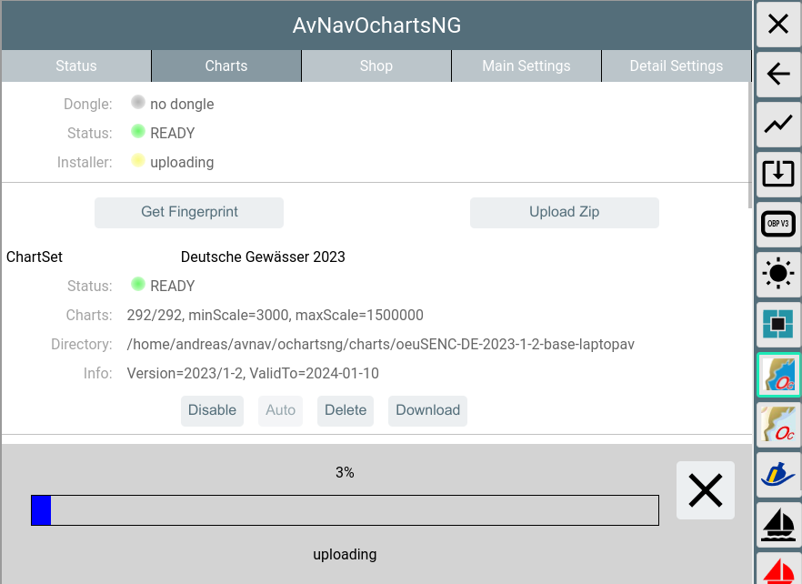

Am Ende des Uploads wird auf dem AvNav Server die Datei ausgepackt, und
es werden einige Prüfungen durchgeführt (das kann einige Sekunden dauern).

Die Karten werden (falls nicht anders konfiguriert) in das Verzeichnis
/home/pi/avnav/data/ocharts/charts hochgeladen.

Wenn die neu hochgeladenen Karten ein Update für einen bereits
existierenden Kartensatz enthalten, wird der existierende Satz
deaktiviert. Das kann man später mit Enable/Disable/Auto ändern.
Kartensätze, die nicht mehr benötigt werden, können gelöscht werden.

Wichtiger Hinweis: Die Karten stehen auf
der o-charts Seite nur während ihres Gültigkeitszeiraumes (1 Jahr) zum
Download bereit. Daher sollte die zip Datei noch einmal sicher aufbewahrt
werden. Man kann diese auch zu AvNav hochladen und nutzen, wenn dieser
Gültigkeitszeitraum abgelaufen ist. Man hat dann natürlich keine Updates
mehr.

Wenn alle Karten erfolgreich eingelesen wurden, wird der Status sich zu
grün ändern (READY).

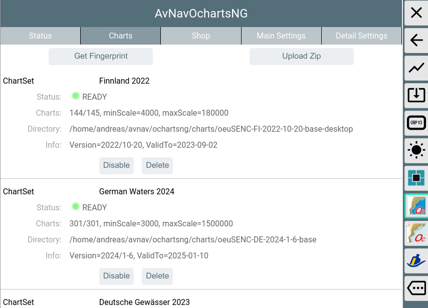

Falls der Status zu "ERROR" (rot) wird, wurde u.U. ein Zip-File hochgeladen,
was für ein anderes System zugeordnet war. Details kann man im Log File
(/home/pi/avnav/data/ocharts/provider.log) sehen.   
Nun sind die Karten verfügbar und können genutzt werden.

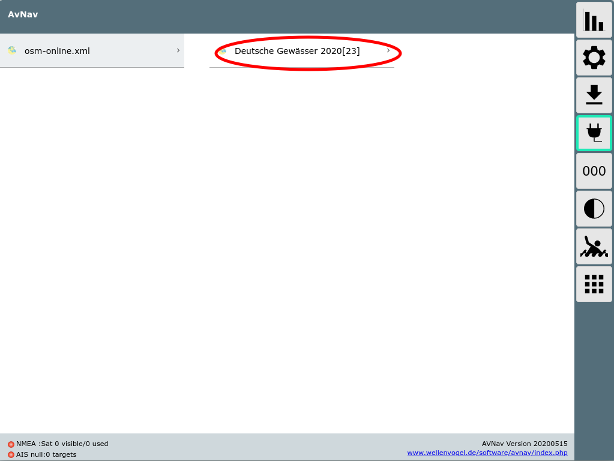

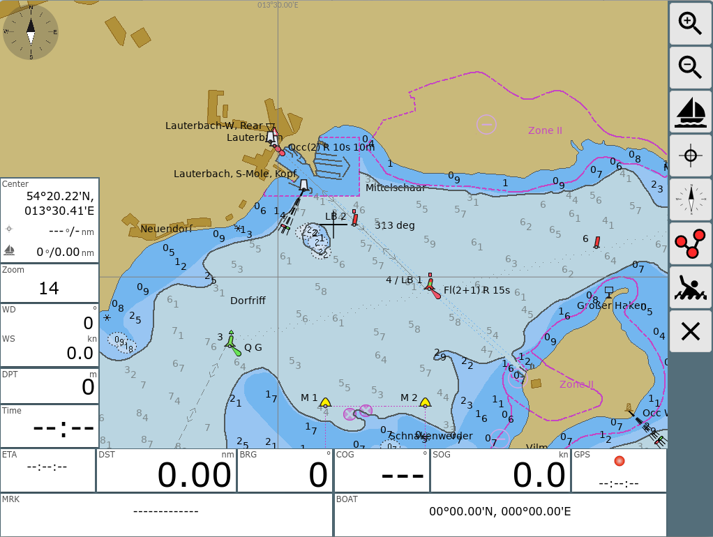

### Der Online Prozeß {: #onlineprocess}

Damit man den Online Prozeß nutzen kann, muss das System, auf dem AvNav
läuft(der Server, nicht der Browser!) mit dem Internet verbunden sein.

Der Prozeß erlaubt es, ein System zu registrieren, zu prüfen, ob das
aktuelle System im Shop bekannt ist und sich die Karten, die diesem System
zugeordnet wurden anzeigen zu lassen. Man kann diese dann direkt
herunterladen und installieren.  
Das eigentliche Kaufen der Karten und die Zuordnung zum System muss über
die o-charts Webseite vorgenommen werden. In der ochartsng Weboberfläche
ist ein Link-Button vorhanden, der einen direkt dort hin bringt.  
AvNav ochartsng speichert keine Login-Daten für den Shop. Da aber die
Applikation im Browser läuft, können die Login Daten dort gespeichert
werden (wie für jede andere Webseite).

Sicherheitshinweis: Die Kommunikation
zwischen AvNav ochartsng und dem o-charts Shop ist verschlüsselt. Die
Kommunikation zwischen dem Browser und dem AvNav Server aber nicht. Daher
darf der Online Prozeß nur verwendet werden, wenn man sich in einem
sicheren WLAN befindet (z.B. hinter einem LTE Router oder einem mobilen
Hotspot) - niemals aber direkt in einem öffentlichen WLAN wenn der Browser
und der Server nicht auf dem gleichen Rechner laufen.

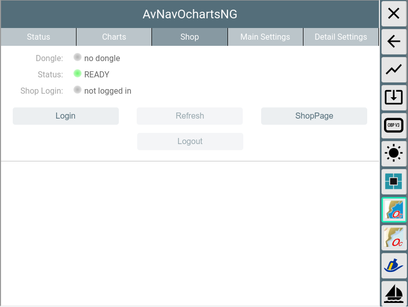

Wenn man den "Shop" Reiter öffnet ist man zunächst nicht im Shop
eingelogged. Man kann sehen, ob momentan ein Dongle aktiv ist oder nicht.
Über den "ShopPage" Button gelangt man direkt zur o-charts Webseite (aber
es macht mehr Sinn, sich zunächst einzuloggen).

Mit einem Klick auf "Login" und eingabe von Nutzername und Passwort
logged man sich im o-charts Shop ein.

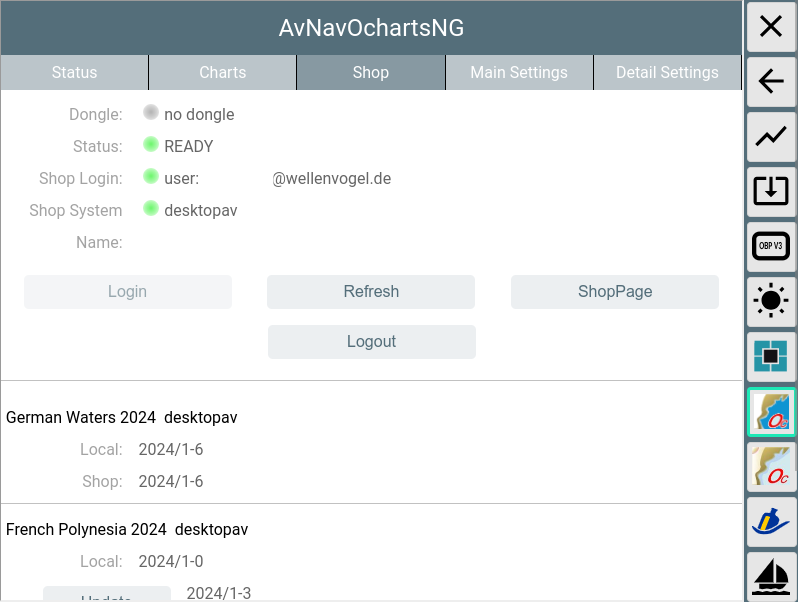

Wenn das System bereits im Shop registriert wurde, wird der "Shop name"
(d.h. der dort genutzte Name für das System) angezeigt und die Liste der
Karten/Updates die dem System zugeordnet wurden(siehe [Offline
Prozeß](#offlineprocess)) wird angezeigt.  
Wenn eine Version einer Karte im Shop neuer ist als die lokale (oder eine
Karten lokal noch nicht vorhanden ist) kann man sie direkt installieren.

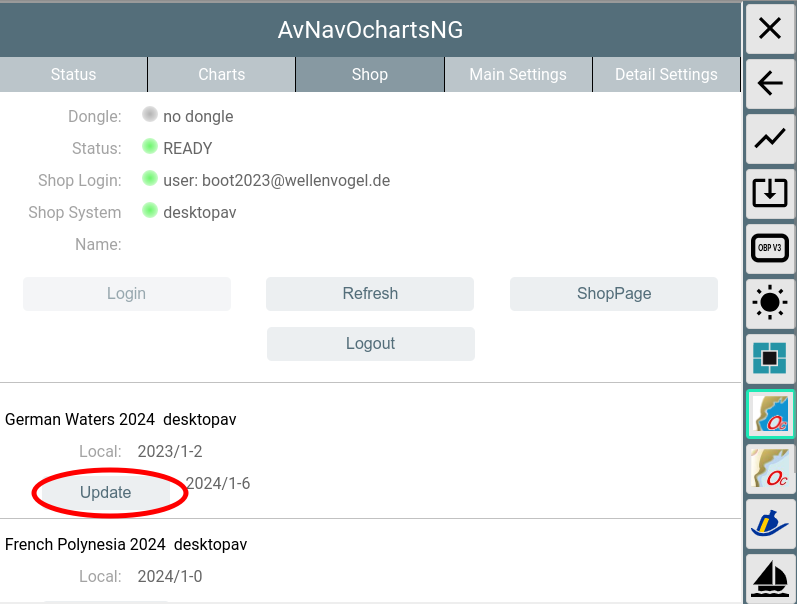

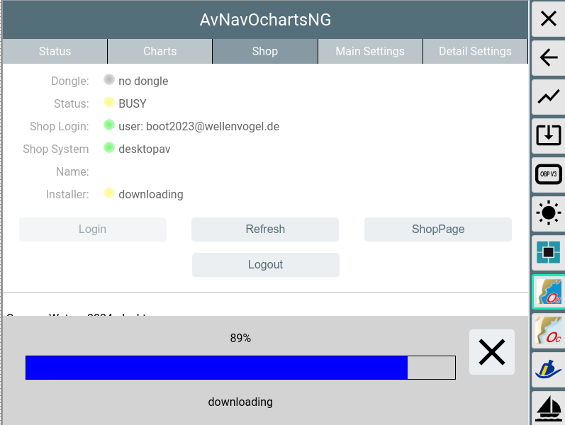

Nach dem Herunterladen wird die Karten entpackt und kann sofort genutzt
werden. Wenn es ein update für eine existierende Karte ist, wird die neue
Version aktiv und die alte wird "disabled" (gleiches Verhalten wie beim
Hochladen einer Karte). Auf dem "Charts" Reiter kann man später die alte
Version löschen, wenn man sie nicht mehr benötigt.

Wichtiger Hinweis:  
Die Karten im Shop bleiben nur während ihrer Gültigkeitsdauer (1 Jahr)
verfügbar. Bitte daher die Karten noch einmal lokal sicher aufbewahren.
Das kann man entweder durch Anforderung auf der Shop-Webseite tun (wie im
Offline Prozeß) oder man kann die ZIP Datei direkt vom "Charts" Reiter
herunterladen.

Wenn das System im Shop noch nicht bekannt ist, kann man es hier
registrieren.

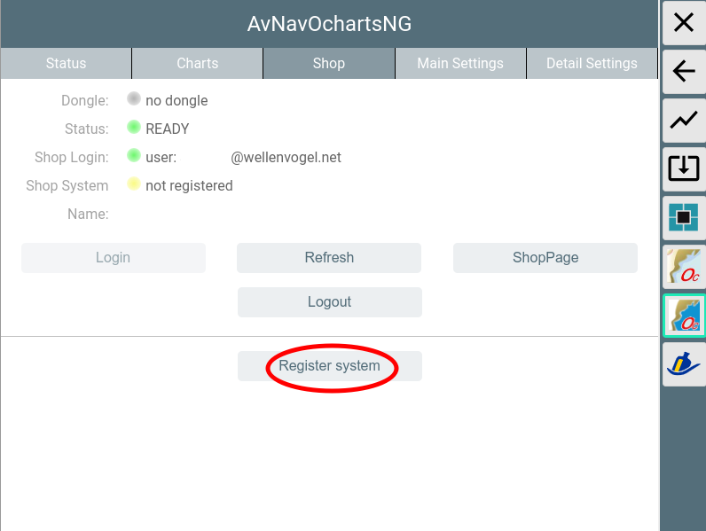

Auf einem Linux System wird man nach einem Namen für das System gefragt,
unter Android ist der Name voreingestellt und kann nicht geändert werden.  

Wenn man das System registriert hat, kann man über "ShopPage" direkt zur
Shop Webseite gehen und Karten kaufen bzw. zuordnen. Wenn man von dort
zurückkehrt muss man über "Refresh" die Liste der zugeordneten Karten
aktualisieren.

Anpassung des Aussehens {: #MainSettings}
-----------------------------------------

Da die O-charts Karten als Vektorkarten vorhanden sind, kann in weiten
Bereichen das Aussehen der Karten angepasst werden. Dabei sind allerdings
einige Einschränkungen zu beachten:

1. Die Anpassung erfolgt auf der Server-Seite und ist damit für alle
   verbundenen Displays gleichartig wirksam
2. Wenn das Aussehen geändert wird, werden die im internen Cache
   gespeicherten Kartenkacheln gelöscht, so das es auf langsamen Systemen
   danach leichte Verzögerungen geben kann.

Die Veränderung der Parameter erfolgt über die Oberfläche des Plugins({{BT("DBUserApp")}}->), Reiter "Main Settings".

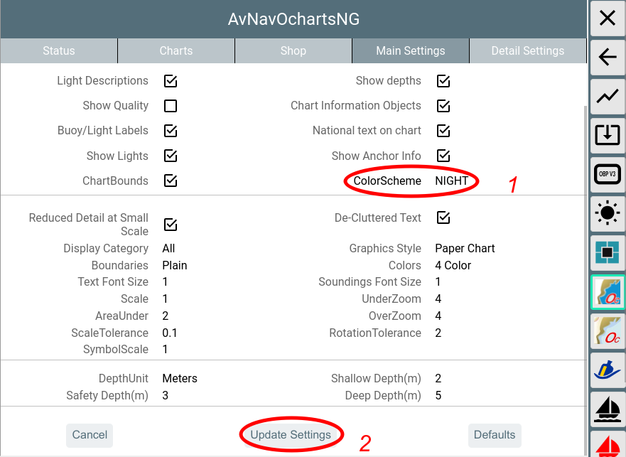Wenn eine Einstellung
geändert wird (1) wird der Parameter fett dargestellt. Die Änderungen werden
erst wirksam, wenn "Update Settings"(2) angeklickt wird.

Mit Cancel können die Änderungen zurückgenommen werden, Defaults setzt
die Einstellungen auf Default-Werte. Die Parameter entsprechen weitgehend
den bei [OpenCPN
vorhandenen Settings](https://opencpn.org/wiki/dokuwiki/doku.php?id=opencpn:opencpn_user_manual:options_setting).

Die folgende Tabelle listet die Einstellungen.

|  |  |  |
| --- | --- | --- |
| Name | Bedeutung | Default |
| Show Text | Zeige Texte zu den Objekten auf der Karte | an |
| Important Text Only | Verberge weniger wichtige Texte | aus |
| Light Descriptions | Beschreibungen für Feuer | an |
| Show Depths | Zeige Tiefen Werte | an |
| Show Quality | Zeige extra Objekte für die Karten-Qualität | aus |
| Chart Information Objects | spezielle Objekte auf der Karte | an |
| Buoy/Light Labels | Bezeichnungen für Feuer/Tonnen | an |
| National text on chart | Nationale Texte | an |
| Show Lights | Zeige Feuer | an |
| Show Anchor Info | Zeige Informationen über den Ankergrund | an |
| Color Scheme | Das Farbschema für die Darstellung | DAY\_BRIGHT |
| Chart Bounds | Zeige die Ränder der Karten | an |
| Reduced Detail at Small Scale | Reduziere die Details auf geringeren Zoom-Leveln | an |
| De-Cluttered Text | Bessere Anordnung der Texte | an |
| Display Category | Art der Darstellung (Base, Standard, All, User Standard) | Standard |
| Graphics Style | Grafische Darstellung (Paper Chart, Simplified) | Paper Chart |
| Boundaries | Art der Begrenzungen(Plain, Symbolized) | Plain |
| Colors | 4Color, 2 Color | 4 Color |
| Text Font Size | Skalierung für die Text-Grösse | 1 (ca. 12px) |
| Soundings Font Size | Skalierung für die Tiefen-Angaben | 1 (ca. 12px) |
| Scale | Basis Skalierung. Höhere Werte sorgen für mehr Details auf kleineren Zoom-Stufen | 1 |
| UnderZoom | Anzahl der Zoom Stufen, die eine höher aufgelöste Karte verkleinert wird, wenn auf dem gewünschten Level keine Karte vorhanden ist | 4 |
| AreaUnder | Wenn im Bereich "UnderZoom" immer noch keine Karte für den Bereich gefunden wurde, benutzte weitere (höhere) zoom level. Für diese Karten werden dann nur If with in the under zoom range still no charts have been found, just try some lower zoom layers - but only display the areas (land, depth) - no other information.  Be careful when increasing this as this could impact the performance a lot. | 2 |
| OverZoom | Anzahl der Zoom Stufen, die eine niedriger aufgelöste Karte vergrößert wird,wenn es keine besser aufgelöste Karte gibt.  **Hinweis**: UnderZoom,AreaUnder und OverZoom bestimmen massgeblich, wie aufwendig der Render-Vorgang ist, d.h. wieviele Karten an der Erzeugung einer Kachel beteiligt werden müssen. Kleinere Werte führen zu weniger Karten (schneller) können aber in bestimmten Bereichen zu weissen Flächen zwischen Karten-Teilen führen. Die Defaults sollten ein guter Kompromiss sein. | 4 |
| Scale Tolerance | Wenn die Symbole in unterschiedlichen Größen benötigt werden oder die Karte skaliert wird, müssen jeweils neue Symbole intern berechnet werden. MIt einer Toleranz kann man die Anzahl dieser Neuberechnungen etwas verringern. | 0.1 |
| Rotation Tolerance | Auf der Karte werden viele Objekte (insbesondere auch Linien) in verschiedenen Rotations-Winkeln benötigt. Um die Zahl der zu erzeugenden Objekte zu verringern, macht eine gewisse Toleranz für den Winkel Sinn. | 2 |
| SymbolScale | Skalierung der Symbolgrößen. Da einige Symbole auf Raster-Bildern basieren, ist eine Skalierung > 2 meist nicht sinnvoll. | 1 |
| Depth | Einheit für die Tiefen-Angaben (Meters, Feet, Fathoms) | Meters |
| Shallow Depth | Tiefe für Flachwasser | 2 |
| Safety Depth | Tiefe für Sicherheits-Kontur | 3 |
| Deep Depth | Tiefe für Tiefwasser | 5 |

Unter dem Tab "Detail Settings" können gezielt einzelne Karten-Features
an- oder abgeschaltet werden. Diese Einstellungen werden nur im
Anzeige-Modus "User Standard" wirksam.

Feature Info (Object Abfrage) {: #featureinfo}
----------------------------------------------

Wenn man auf die Karte klickt, bekommt man die "Feature Info" von AvNav.
Diese wird angereichert um wichtige Informationen (Tonne, Feuer) in der
Nähe des Klick-Punktes.

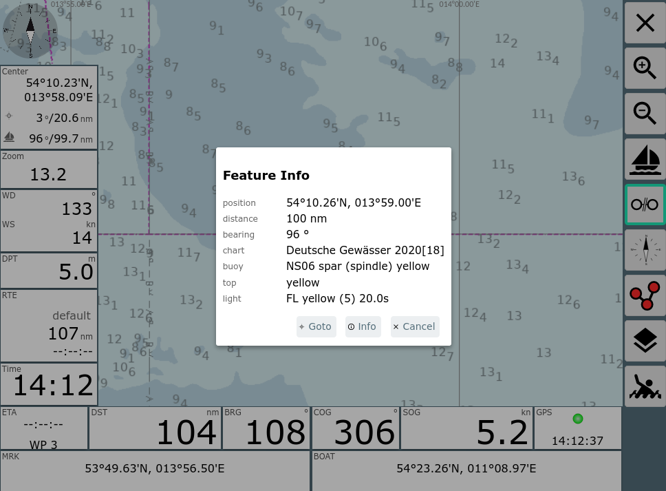

Über "Info" können die Roh-Informationen der Karten angezeigt werden.

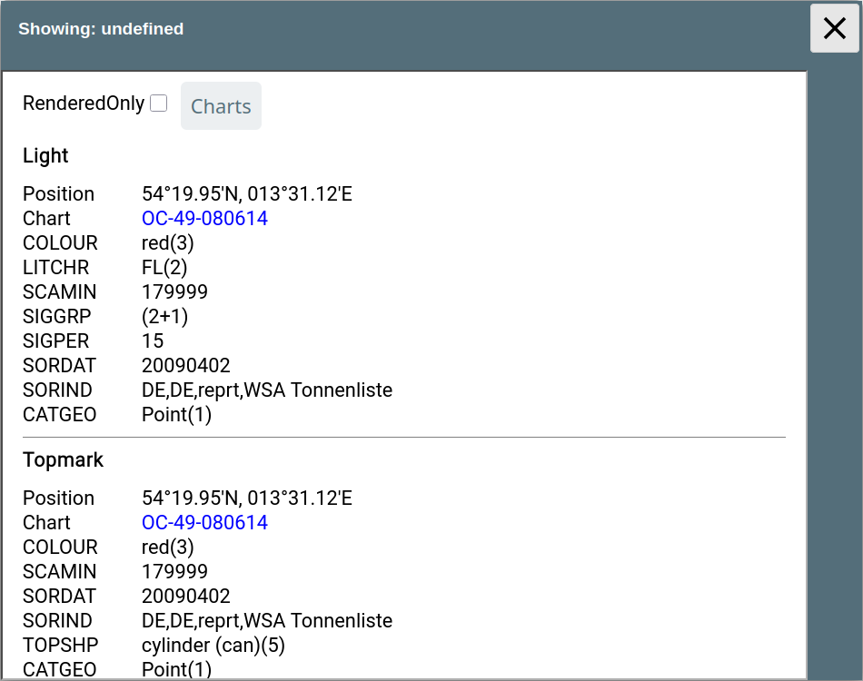

Mit einem Klick auf den (blauen) Karten-Namen bekommt man einige weitere
Informationen zur Karte.

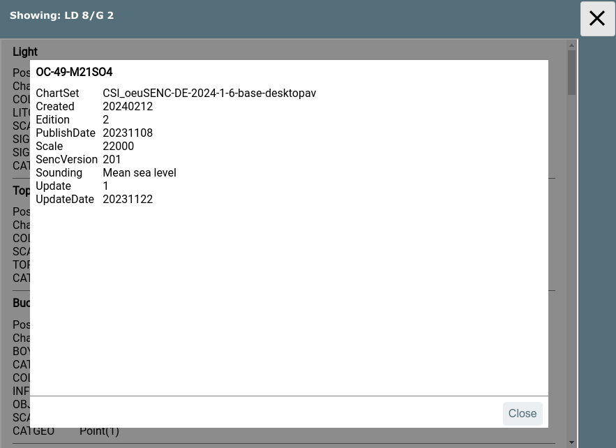

Mit dem Button "Charts" kann man sich eine Liste der an dieser Stelle
genutzten Karten anzeigen lassen.  
Mit dem Schalter "RenderedOnly" werden nur die Objekte aus den Karten in der
Liste angezeigt, die auch momentan im Bild dargestellt wurden (sonst werden
alle Objekte in der Nähe des Klicks angezeigt).  

Installation {: #Installation}
------------------------------

### Linux/Raspberry

Das Plugin ist als debian Paket vorhanden.  
Es ist in den normalen Repositories(Verzeichnissen) vorhanden.

Für die [AvNav Images](../install.md#Headless)  kann
man die Pakete mit dem avnav-updater installieren:

* avnav-ochartsng

Neue Images (nach 202508nn) haben das Paket bereits standardmässig
installiert.

Wenn man es direkt von der Kommandozeile machen möchte, kann man das mit
den folgenden Kommandos tun:


```
sudo apt-get update  
sudo apt-get install avnav-ochartsng  
sudo systemctl restart avnav
```

Falls man mit anderen Images arbeitet, sollte man das Verzeichnis von
free-x einrichten ("bullseye" an die eigene Debian Version anpassen):

Siehe die  [AvNav
Paket-Installationsbeschreibung](../install.md#Packages).

```
deb https://www.free-x.de/debpreview bullseye main contrib non-free
```

Alternativ kann man die Pakete auch aus dem [daily
builds Verzeichnis](../../downloads/daily-ochartsng) bzw. [Release
Verzeichnis](../../downloads/release-ochartsng) herunterladen und installieren.

Das kann man z.B. mit den folgenden Kommandos tun (die Version durch die
gewünschte ersetzen):

```
cd /home/pi/avnav  
wget -O avnav-ochartsng_20240214-raspbian-bullseye_armhf.deb https://www.wellenvogel.net/software/avnav/downloads/daily-ochartsng/20240214/avnav-ochartsng_20240214-raspbian-bullseye_armhf.deb  
sudo apt install ./avnav-ochartsng_20240214-raspbian-bullseye_armhf.deb  
sudo systemctl restart avnav
```

Man kann natürlich auch die Pakete zunächst auf einen PC herunterladen
und sie von dort z.B. mit WinSCP auf den Raspberry Pi übertragen und dann
dort installieren.

#### AvNav-ocharts und AvNav-ochartsng zusammen

Wenn man das neue ochartsng Plugin installiert, benutzt es initial einen
anderen Port (8083)  als das alte Plugin, so das es keine Konflikte
gibt. (Achtung: Beta Versionen vor 20250804 nutzen initial Port 8082 so
das es einen Konflikt mit dem bisherigen ocharts Plugin geben wird - dann
umstallen).  
Im Normalfall sollte man das alte Plugin auf der  [server/status
Seite](../userdoc/statuspage.md) disablen.  
Im neuen Plugin kann man den Schalter "useLegacy" aktivieren (in der [Plugin
Konfiguration)](#PluginConfig). Mit diesem Schalter aktiviert benutzt das neue
Plugin auch alle Karten, die vorher mit dem alten installiert wurden.
Alternativ kann man die Karten auch erneut zum neuen Plugin hochladen
(oder direkt aus dem Shop, wenn sie noch gültig sind).

Wenn man beide Plugins parallel nutzen möchte, muss man z.B. beim neuen
Plugin den Port ändern (beispielsweise auf 8083). Um beide gemeinsam
laufen zu lassen, sollte das System über ausreichend RAM verfügen (2GB).

### Android

Für Android git es eine eigene App (avocharts) die ochartsng enthält.
Diese muss separat installiert werden.

Siehe [AndroidApp](#android) weiter unten..

Releases {: #Releases}
----------------------

Alle Releases und alle Beta-Versionen (Entwickler Versionen oder daily
builds) findet man unter:

* [Releases](../../downloads/release-ochartsng)
* [Daily Builds](../../downloads/daily-ochartsng)


### Release Versionen

20260703 [link](../../downloads/release-ochartsng/20260703 "release/20260703")

Vorbereitung für neue AvNav Versionen

20260531 [link](../../downloads/release-ochartsng/20260531 "release/20260531")

Bugfixes

* [#40](https://github.com/wellenvogel/ochartsng/issues/40):
  Kaputtes Layout der Startseite auf Android 16
* [#39](https://github.com/wellenvogel/ochartsng/issues/39):
  Ältere Browser bleiben beim shop login hängen
* [#36](https://github.com/wellenvogel/ochartsng/issues/36):
  Extinguished lights sollten in der Karte markiert werden
* [#38](https://github.com/wellenvogel/ochartsng/issues/40):
  Fehlender Access-Control-Allow-Methods Header in Token HTTP Responses

20260303 [link](../../downloads/release-ochartsng/20260303 "release/20260303")

Anpassung an das ocharts plugin Version 2.1.5 (der Shop Zugang erfordert
diese Version).  
**Hinweis**: Das o-charts Plugin in OpenCPN erlaubt die Nutzung eines
TPM Modules falls vorhanden. Das kann das AvNav plugin noch nicht. Für die
Nutzung einer gemeinsamen Kartenlizenz auf einem System daher bitte auch
in OpenCPN nicht das TPM nutzen.

20250822 [link](../../downloads/release-ochartsng/20250822 "release/20250822")

Kleine Korrekturen und Auswahl des Arbeitsverzeichnisses für Android

* [#27](https://github.com/wellenvogel/ochartsng/issues/27):
  Android: crash if started without notification permissions
* [#28](https://github.com/wellenvogel/ochartsng/issues/28):
  Android: [allow to use the external SD card](#workingdirectory),
  improved diagnostics for the chart installer
* [#29](https://github.com/wellenvogel/ochartsng/pull/29):
  build preparation for debian trixie

20250812

***Nur Android im Store - es ist die gleiche Release wie 20250804 (nur
eine neue Versionsnummer).***

20250804 [link](../../downloads/release-ochartsng/20250804 "release/20250804")

***Initiale Release***

* **Android**: Falls vorher eine Beta
  genutzt wurde, bitte den Key dort exportieren und unter Einstellungen
  "alt key" aktivieren und den exportierten Key importieren. Nur so
  können die Karten erneut heruntergeladen werden. Siehe auch
  die [Hinweise](#androidbetarelease).

License Notes {: #License}
--------------------------

Die Nutzung der Karten für AvNav mit dem oesenc-pi Plugin ist so mit
o-charts diskutiert und abgestimmt worden und ist damit legal im Sinne der
Lizenzen.  
Die [Lizenzbedingungen](https://o-charts.org/manuals/docs/EN_rrc_eula_ChartSetsForOpenCPN.md)
von [o-charts](https://o-charts.org/shop/en/content/3-our-conditions)
sind dabei unbedingt zu beachten. Es ist insbesondere nicht gestattet, die
Karten zu kopieren oder auf anderen als den lizensierten Systemen
einzusetzen.

Der Zugriff auf die Karten innerhalb von AvNav ist nur aus dem lokalen
Netz möglich, maximal können 5 Geräte (Clients) gleichzeitig die o-charts
von einem AvNav Server nutzen.

Für die Software-Lizenzen siehe die [Readme.](https://github.com/wellenvogel/ochartsng/blob/master/Readme.md)

Plugin Konfiguration {: #PluginConfig}
--------------------------------------

Nur unter Linux. Für Android siehe [Android/Settings](#androidsettings).  
Einige Einstellungen für das Plugin können auf der server/status Seite 
unter "plugins/system-ochartsng"  geändert werden.

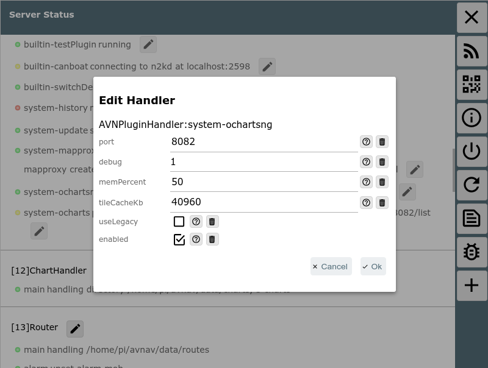

Those are:

|  |  |  |
| --- | --- | --- |
| Name | Bedeutung | Default |
| port | Http port | 8082 |
| debug | Level für das Logging, 0-ERROR,1-INFO,2-DEBUG | 1 |
| memPercent | Der prozentuale Anteil des Systemspeichers, den der Provider maximal nutzen soll. Wenn man diesen nicht setzt (oder zu klein) berechnet der Provider intern einen Minimalwert und nutzt diesen.  Der kann u.U. insbesondere bei der Nutzung von Rasterkarten sehr klein sein und ihn damit zwingen ständig Karten-Dateien zu öffnen und zu schliessen - was die Geschwindigkeit stark reduzieren kann. Wenn man ausreichend Speicher hat (z.B. > 2GB), wird das Arbeiten beschleunigt, wenn man  den Speicher auf 1GB setzt. | 50 |
| tileCachekb | Speicher in KB für die Speicherung von bereits erzeugten Karten-Kacheln (mit  0 erfolgt keine interne Speicherung) | 40960 |
| useLegacy | Nutze auch die Karten, die mit dem alten avnav-ocharts-plugin installiert wurden. | aus |

Android App {: #android}
------------------------

AvNav OchartsNG steht auch für Android zur Verfügung und stellt die
Karten für die [AvNav Android App](../android/android.md)
bereit.  
Dazu gibt es die separate Android App  "avocharts".

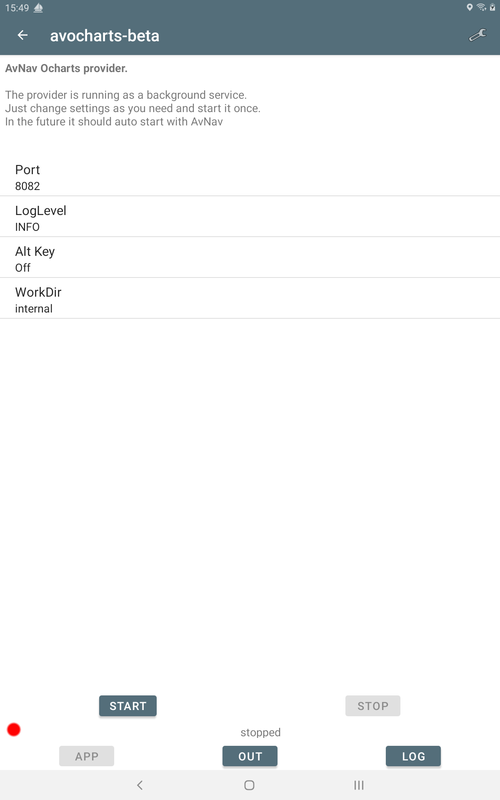

Wenn man die App startet kann man zunächst einige Einstellungen anpassen.  
Wenn man diese Bild sieht (Status rot) läuft der eigentliche Karten-Server
noch nicht. Dieser wird erst durch Klick auf "Start" gestartet.

Später wird es normalerweise nicht mehr
nötig sein, die avocharts App separat zu starten. Das wird automatisch
erfolgen, sobald AvNav startet. Aber mit einem direkten Start kann man
unter Umständen Fehler erkennen, indem man die Ausgabe ("OUT") oder die
Logdatei ("LOG") anschaut.  
**Bitte beachten**: Der automatische Start funktioniert nur bei Apps
vom gleichen Typ - d.h. eine AvNav release App kann nur eine avocharts
release App starten, eine AvNav beta app eine avocharts beta.  
Wenn man also die avocharts beta installiert und mit AvNav (release - aus
dem Store) nutzen möchte, muss man avocharts per Hand starten und auch
noch einmal auf "START" klicken.

### Einstellungen {: #androidsettings}

Um Einstellungen anzupassen kann man auf die angezeigten Einstellungen
oder auf das Einstellungssymbol (oben rechts) klicken.

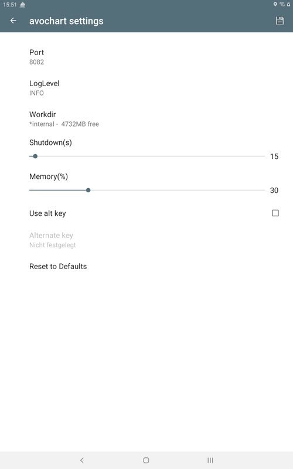

  

|  |  |  |
| --- | --- | --- |
| Name | Bedeutung | Default |
| Port | Der HTTP Port, den der Karten-Server nutzen wird. Wenn man bei Start Fehlermeldungen bekommt und unter "OUT" so etwas wie "address already in use" sieht, muss man diesen Port ändern. | 8082 |
| LogLevel | 0 - errors, 1- info, 2- debug | 1 |
| Workdir | Das [Arbeitsverzeichnis](#workingdirectory) für Karten, Logs und Einstellungen | internal |
| Shutdown | Teit (in Sekunden) die der Karten-Server auf ein Signal von AvNav (Heartbeat) warten, bevor er automatisch stoppt(das ist nur aktive, wenn avocharts automatisch durch AvNav gestartet wurde) | 30 |
| Memory | Erlaubte Speichernutzung (%) vom System Speicher (RAM) | 50 |
| Testmode | für interne Tests | aus |
| Use alt key | Siehe unten [Hinweise](#androidbetarelease) über Release/Beta Versionen |  |
| Disk symbol (upper right) | Key specihern (Siehe unten [Hinweise](#androidbetarelease) über Release/Beta Versionen) |  |

Wenn man die Einstellungen fertig angepasst hat, geht man mit dem Pfeil
zurück wieder auf die Hauptseite.

### Arbeitsverzeichnis (neu ab 20250822) {: #workingdirectory}

AvOcharts speichert Karten, Logs und die Einstellungen von Main Settings
und Detailled Settings unter einem Verzeichnis auf dem Gerät. (Working
Directory). Dieses Verzeichnis ist unabhängig vom [AvNav
Arbeitsverzeichnis](../android/android.md#workingdirectory).

Man hat die folgende Auswahl:

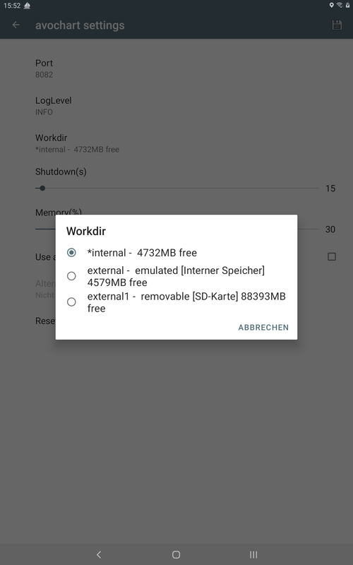

Je nach Gerät können Sie verschiedene Speicherorte für Ihre Daten
auswählen (technische Informationen finden Sie in der [Android-Dokumentation](https://developer.android.com/training/data-storage/app-specific?hl=de)).
Wenn Ihr Gerät über eine SD-Karte verfügt, gibt es die oben gezeigte
Auswahl:

|  |  |
| --- | --- |
| Name | Bedeutung |
| Internal Storage | Dies ist ein Speicherort im internen Flash-Speicher Ihres Geräts. Er ist vollständig privat und (sofern Ihr Gerät nicht gerootet ist) nicht für andere Apps wie z. B. einen Dateimanager zugänglich.  Dies ist die Standardeinstellung.  The "\*" in front of the entry shows that this directory was already used as working directory and contains data. |
| External Storage | Dieser Speicher befindet sich weiterhin im internen Flash-Speicher, wird jedoch vom Android-System anders behandelt (und daher als "extern - emuliert" bezeichnet). Andere Apps können auf diesen Speicherort zugreifen.Der Pfad für einen Dateimanager lautet typischerweise [interner Speicher]/Android/data/de.wellenvogel.avnav.main/files (oder [interner Speicher]/Android/data/de.wellenvogel.avnav.main.beta/files für eine Beta-Version). |
| External Storage-1 | Dieser Pfad ist nur sichtbar, wenn Ihr Gerät eine SD-Karte installiert hat. Als Erklärung wird auch „removable [SD-Karte]“ angezeigt.  Falls verfügbar, befindet sich dieses Verzeichnis tatsächlich auf einer externen SD-Karte. Wenn Sie es verwenden möchten, muss die SD-Karte immer installiert ist, wenn avocharts (oder AvNav) läuft. Falls die SD Karten entfernt wird, während avocharts läuft, kann es zum Absturz kommen.  Andere Apps wie ein Dateimanager können auf die Daten zugreifen.  Der Speicherort ist [SD card]/Android/data/de.wellenvogel.ochartsprovider/files (or [SD card]/Android/data/de.wellenvogel.ochartsprovider.beta/files). |

Wenn man das Arbeitsverzeichnis ändert, werden alle Ihre Daten im alten
Arbeitsverzeichnis für avocharts unsichtbar (sie bleiben jedoch verfügbar
und man kann jederzeit zum alten Verzeichnis zurückkehren).

Beim Start von avocharts wird geprüft, ob das ausgewählte
Arbeitsverzeichnis noch verfügbar ist (und man wird aufgefordert, ein
anderes auszuwählen, falls nicht).  
Wenn avocharts durch Autostart von AvNav gestartet wird, versucht es einen
Fallback auf das interne Arbeitsverzeichnis, falls das gewählte nicht
verfügbar ist (z.B. SD Karte entfernt).

Für externe Verzeichnisse kann man grundsätzlich einen Dateimanager
verwenden, um Daten dorthin und von dort zu kopieren. avocharts erkennt
diese Daten jedoch potentiell nicht, wenn es gerade läuft. Daher empfiehlt
es sich, die Daten direkt in der App hochzuladen. Man kann aber z.B. eine
Zip-Datei mit diesen Daten als Backup erstellen. Und man kann sehr einfach
die Log Dateien von avocharts sehen.

Alle (potentiellen) Abrbeitsverzeichnisse werden gelöscht, wenn man
avocharts deinstalliert (oder seine Daten löscht).

Hinweis: Einstellungen (aus der Tabelle hier darüber) werden nicht im
Arbeitsverzeichnis abgelegt.

### Erster Start

Man kann nun den Karten-Server mit "START" loslaufen lassen.

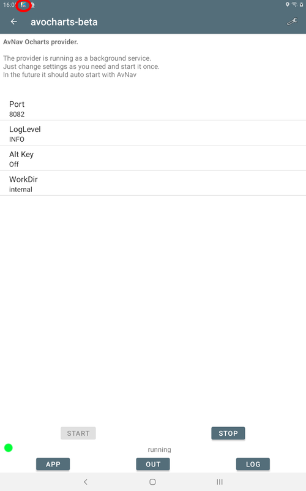

Wenn der Server läuft, wird das in der Benachrichtigungszeile angezeigt.
Wenn der Start nicht erfolgreich ist (Status wird wieder rot) kann man in
die Ausgabe ("OUT") und in das Log ("LOG") schauen.

Ein Klick auf "APP" öffnet ein Browser-Fenster mit der ochartsng Seite -
die gleiche Ansicht, die man auch aus AvNav heraus bekommt.

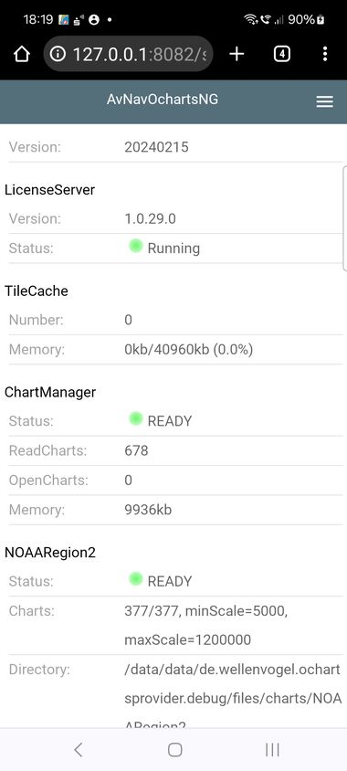

Man kann jetzt z.B. das System im o-charts Shop registrieren (unter
Android geht das nur mit dem [Online Process](#onlineprocess)).

### Beta and Release Versionen {: #androidbetarelease}

Bedingt durch die Arbeitsweise des o-charts Lizenz-Servers kann man
Karten, die man z.B. in der Beta-Version gekauft hat, nicht in der Release
Version verwenden (und umgekehrt).  
Um das zu vermeiden, kann man die benötigte Lizenz-Information (Key) aus
der App exportieren und in der anderen Version wieder imprtieren. Hinweis:
Man kann die Lizenz trotzdem nur auf dem jeweiligen Gerät nutzen!  
Um den Key zu exportieren, klickt man auf der Einstellungsseite oben
rechts auf das Disketten-Symbol und speichert ihn (bitte auch an ein
backup denken, ohne diesen Key kann man später in der anderen App-Version
die Karten nicht mehr nutzen). Wenn man später die andere Version der App
nutzt, dann aktiviert man dort "use alternate key", klickt auf den
alternate key und findet dort einen "Import" Button.  
Man kann leicht prüfen, ob man die korrekte Lizenz hat, indem man sich im
Shop anmeldet und prüft, ob das System korrekt erkannt wird - siehe [Online
Prozeß](#onlineprocess).

Bitte auch die Hinweise zum [automatischen
Start](#androidstartup) beachten.

Technische Details
------------------

Die Karten werden durch einen Server (eigenes Programm) bereitgestellt.  
Die Kommunikation mit AvNav wird durch ein AvNav [Plugin](plugins.md)
unter Linux realisiert und durch die avocharts App auf Android.

Die Web-Oberfläche ist eine Reactjs App und wird auch durch den Server
bereitgestellt. In AvNav ist sie als [User
App](../userdoc/addonpage.md) integriert.

Der komplette Code findet sich auf [GitHub](https://github.com/wellenvogel/ochartsng).

Die Installation erfolgt (unter Linux) in
/usr/lib/avnav/plugins/ochartsng. Das Daten-Verzeichnis ist
/home/pi/avnav/data/ochartsng. Man kann einige weitere Parameter für das
plugin direkt in der [avnav\_server.xml](configfile.md)
setzen. Das sollte im Normalfall aber nicht nötig sein.

Man kann z.B. das Daten-Verzeichnis setzen.

```
<AVNPluginHandler>  
...  
<system-ochartsng dataDir="$DATADIR/ochartsng"/>  
</AVNPluginHandler>
```
  

### Karten Konvertierungen {: #chartconversions}

Unverschlüsselte Vektor Karten wie S57 müssen vor der Benutzung in das
verwendete interne "SENC" Format konvertiert werden.  
Dafür gibt es 2 Optionen:

#### Konvertierung mit AvNav (ab AvNav 20240520)

Das avnav-ochartsng-plugin fügt einen Konverter zu AvNav's [Importer](../userdoc/importerpage.md)
hinzu. Dieser Konverter enthält ein Python Script um S57 in ein zip Archiv
umzuwandeln, was hochgeladen werden kann.  
Um die S57 Karten zu nutzen, kann man einfach ein zip mit den S57 Karten
zu AvNav's [Importer](../userdoc/importerpage.md) hochladen,
nachdem ochartsng installiert wurde.  
Wenn man AvNav und ochartsng unter Linux nutzt, werden die Karten
automatisch in ochartsng verfügbar, wenn die Konvertierung abgeschlossen
wurde.

Wenn man ochartsng auf einem anderen System nutzen möchte (z.B. Android)
brauchtman zusätzlich eine Installation von AvNav unter [Linux](#Installation)
oder unter [Windows](../install.md#Windows).

Ochartsng selbst ist nicht unter Windows lauffähig, aber der Konverter
steht auch für Windows zur Verfügung. Nachdem man AvNav für Windows
installiert hat muss man dort den "Update" Dialog aktivieren und die URL
für den ochartsng-s57 Konverter für Windows angeben:

- release: <https://www.wellenvogel.de/software/avnav/downloads/release-ochartsng/latest/ochartsng-latest.zip>
- daily: <https://www.wellenvogel.de/software/avnav/downloads/daily-ochartsng/latest/ochartsng-latest.zip>

Danach lädt man die S57 Karten zum Konverter hoch und nachdem die
Konvertierung abgeschlossen wurde lädt man die zip Datei mit den
konvertieren Karten herunter. Diese .zip Datei kann dann direkt in
ochartsng installiert werden (Linux und Android).

#### Konvertierung mit OpenCPN

Wenn man bereits einen Computer mit OpenCPN hat, kann man dort die Karten
konvertieren.   
Dafür aktiviert man die Karten in OpenCPN. In den OpenCPN
Einstellungen/Reiter "chart files" klickt man auf "Prepare all ENC
Charts".

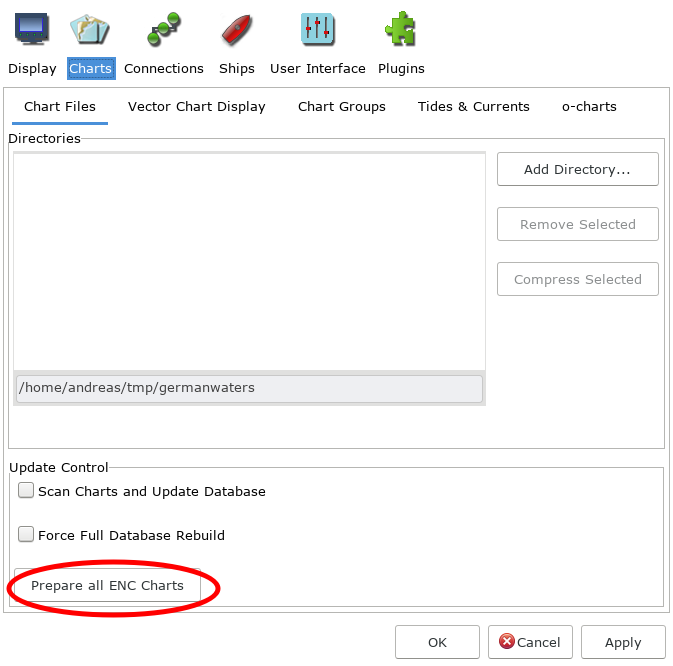

Das erzeugt eine Reihe von Dateien mit der Endung .s57 im OpenCPN
Verzeichznis (unter Linux: ~/.opencpn/SENC). Aus diesem Verzeichnis
kopiert man alle Dateien mit den gleichen Namen wie die S57 Dateien in ein
neues, leeres Verzeichnis. Dieses sollte einen "sprechenden" Namen haben -
der wird später angezeigt. Anschliessend erzeugt man eine Textdatei
"Chartinfo.txt" in diesem Verzeichnis mit genau einer Zeile Text:

ChartInfo: -hier der name der Karte-

Dann erzeugt man ein zip Archive in dem das Kartenverzeichnis als
Unterverzeichnis enthalten ist. Dieses Archive kann man dann zu AvNav
ochartsng hochladen.  
Für Linux gibt es ein [script](https://github.com/wellenvogel/ochartsng/blob/master/tools/collectS57.sh)
um das Einsammeln der Karten zu automatisieren.