Overlays


Avnav Overlays
==============

Ab der Version 20201219 ist AvNav in der Lage, neben der eigentlichen
Karte noch Zusatzinformationen anzuzeigen. Das können z.B. Wegpunkte aus
einer GPX Datei aber auch vorhandene Tracks oder andere Daten (wie z.B.
aktuelle Tonnen von [nautin.nl](https://www.nautin.nl/wb/pages/navigatie/actuele-boeienposities.php))
sein.

Daneben können mit dieser neuen Funktionalität auch mehrere Karten
übereinander gelegt werden (z.B. eine OpenSeamap Karte, die einen weiteren
Bereich abdeckt, unter eine o-charts Karte - oder auch o-charts Karten für
verschiedene Regionen).

Innerhalb von AvNav wird diese Funktion als Overlays bezeichnet.

Im Einzelnen können die folgenden Daten als Overlays genutzt werden:

* GPX Dateien (Wegpunkte,Tracks,Routen)
* [KML
  und KMZ](https://developers.google.com/kml/documentation/kmzarchives) Dateien (google) - ind der KMZ Datei wird eine doc.kml
  erwartet.
* [geojson](https://de.wikipedia.org/wiki/GeoJSON) Dateien
* andere in AvNav vorhandene Karten
* AvNav Routen
* AvNav Tracks

Zu den GPX und KML Dateien können nutzerdefinierte Icons oder auch Daten,
die über "link" Tags erreichbar sind, als zip Dateien gespeichert werden.
KMZ Dateien enthalten diese Icons im Normalfall schon.

Wenn solche Overlays auf einer Karte vorhanden sind, können durch Klick
auf entsprechende Punkte dazu Zusatzinformationen abgerufen werden.

Konfiguration {: #configuration}
--------------------------------

Bevor externe Overlays genutzt werden können, müssen die Dateien in AvNav
hochgeladen werden.

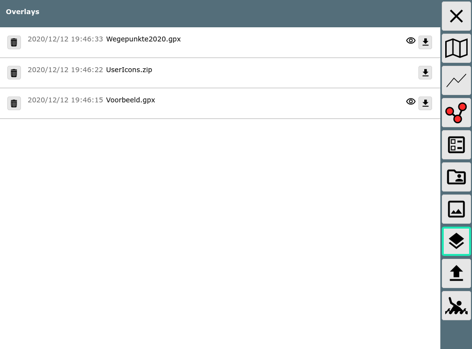

Innerhalb von AvNav wird das Symbol {{BT("OverlaysView")}}für Overlays benutzt.

Nachdem die entsprechenden Dateien hochgeladen wurden, können diese
Overlays den Karten zugeordnet werden. Man kann einen Satz von Overlays
definieren, der für alle Karten genutzt werden soll (default overlays).
Ausserdem kann man für jede einzelne Karte noch definieren, welche
Overlays auf dieser angezeigt werden sollen.

Die Konfiguration der Overlays kann entweder auf der [Files/Download-Seite](../userdoc/downloadpage.md)
im Reiter Karten erfolgen - oder auf der [Hauptseite](../userdoc/mainpage.md).

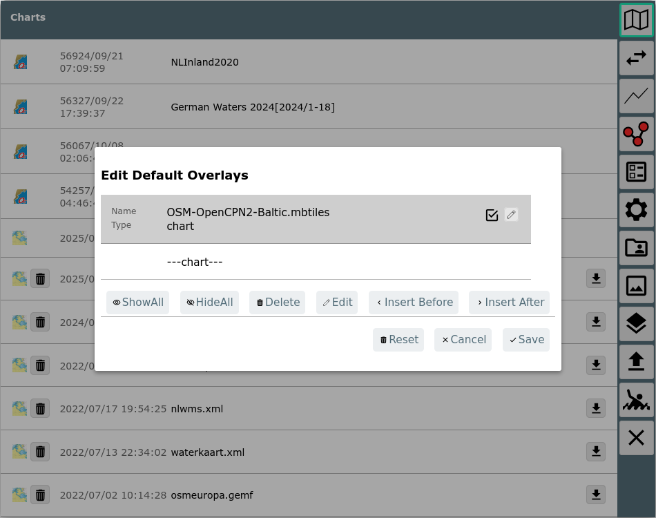

Im Bild ist der Dialog sichtbar, der nach Klick auf "DefaultOverlays" auf
der Files/Download Seite erreichbar ist.

Hier können jetzt Overlays hinzugefügt, verändert oder gelöscht werden.

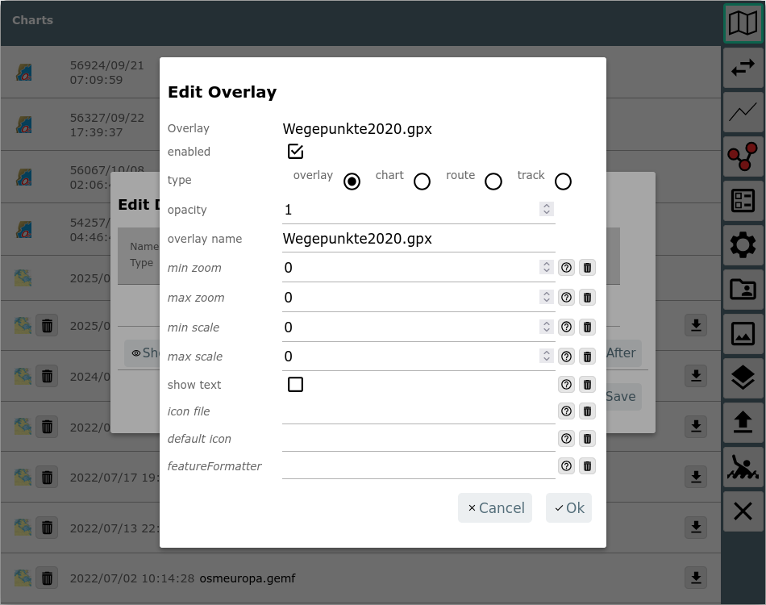

Im Bild wurde hier mit "InsertAfter" die Auswahl der vorhandenen Overlays
aufgerufen.  
Im Beispiel wurde die im overlays Verzeichnis vorhandene Datei
Wegepunkte2024.gpx ([NV
Verlag](https://nvcharts.com/downloads/wegepunkte/2024/Wegepunkte2024_gpx.zip))  gewählt.  
Es können jetzt noch Parameter für die Anzeige eingestellt werden.

|  |  |  |
| --- | --- | --- |
| Name | default | Beschreibung |
| enable | ja | Wenn das deaktiviert wird, ist das Overlay zwar konfiguriert - wird aber aktuell nicht angezeigt. Man hat aber später die Möglichkeit, das mit einem Klick anzuzeigen. |
| type | overlay | Art des Overlays.  overlay: eine Datei, die unter overlays hochgeladen wurde  chart: eine in AvNav vorhandene Karte  route: eine in AvNav vorhandene Route  track: ein in AvNav vorhander Track |
| overlay name | --- | hier wird je nach type die Liste der vorhandenen Elemente zur Auswahl angeboten |
| featureFormatter | --- | Auswahl einer Java Script Funktion zum Aufbereiten von zusätzlichen Informationen bei Klick auf das Element |
| opacity | 1 | Ein Wert zwischen 0...1, der die Farbdeckung angibt (0: unsichtbar) |
| icon file | --- | Hier kann eine zip-Datei angegeben werden, die die Bilder (oder sonstigen Inhalte) entält.  Wenn in einer gpx-Datei eine "sym" Eigenschaft vorhanden ist (z.B. sym="b1"), wird in der Zip Datei zur Darstellung eine Datei b1.png gesucht.  Wenn eine link Eigenschaft vorhanden ist (z.B. link="data/1.html") dann wird in der Zip Datei nach einem Eintrag data/1.html gesucht.  Für KML Dateien gilt das sinngemäss. Allerdings empfiehlt sich hierbei eher die Nutzung des KMZ Formates. |
| min zoom | 0 | der minimale Karten-Zoom bei dem das Overlay noch angezeigt wird (0: immer) |
| max zoom | 0 | der maximale Karten-Zoom bei dem das Overlay noch angezeigt wird (0: immer) |
| min scale | 0 | wenn der Kartenzoom kleiner als min scale ist, werden die Icons verkleinert (0: Funktion deaktiviert) |
| max scale | 0 | wenn der Kartenzoom grösser als max scale ist, werden die Icons vergrößert (0: Funktion deaktiviert) |
| default icon | --none-- | Hier kann eine Bild-Datein (png, svg) ausgewählt werden, die als Icon genutzt werden soll, wenn kein anderes Icon gefunden wurde. Die Bild-Datei muss vorher bei layouts (oder user Dateien oder Images) hochgeladen worden sein.  Mit --DefaultGpxIcon-- kann ein Icon gewählt werden, das AvNav bereits mitbringt. |
| show text | nein | Zeige Text (z.B. Punkt-Namen) |
| feature Formatter | --- | wähle einen [Feature Formatierer](userjs.md#featureFormatter) der benutzt wird, um die Informationen für die Anzeige aufzubereiten, wenn auf der Karte auf das Overlay geklickt wird. |

Falls die Datei andere Inhalte hat als Wegpunkte, werden ggf. noch
weitere Auswahlmöglichkeiten angeboten.

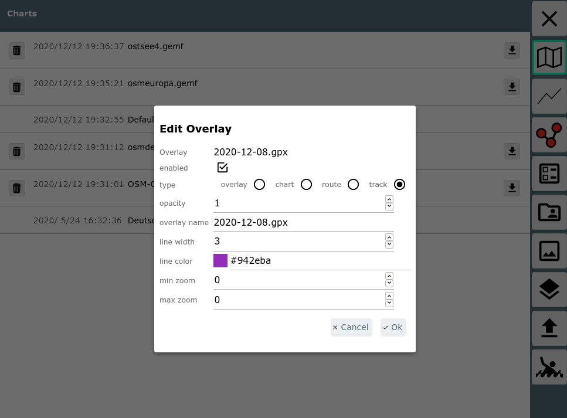

|  |  |  |
| --- | --- | --- |
| Name | default | Beschreibung |
| line width | track/route line width | Die Linienstärke für die Darstellung |
| line color | track/route color | Die Farbe für die Darstellung |

Nach Bestätigung mit Ok ist das Overlay jetzt hinzugefügt.

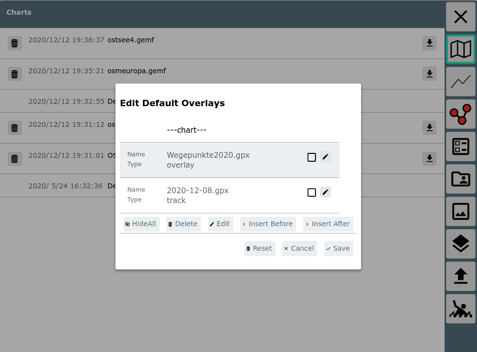  

Die Reihenfolge der Overlays kann in der Liste per drag&drop geändert
werden - sie können auch "unterhalb" der Karten angezeigt werden - dann
vor die ---chart--- Reihe verschieben.

Für die default overlays macht es u.U. Sinn, diese zunächst disabled zu
haben - und dann erst bei den einzelnen Karten (oder wenn sie benötigt
werden) anzuschalten.

Für Karten sieht die Overlay Konfiguration dann so aus:

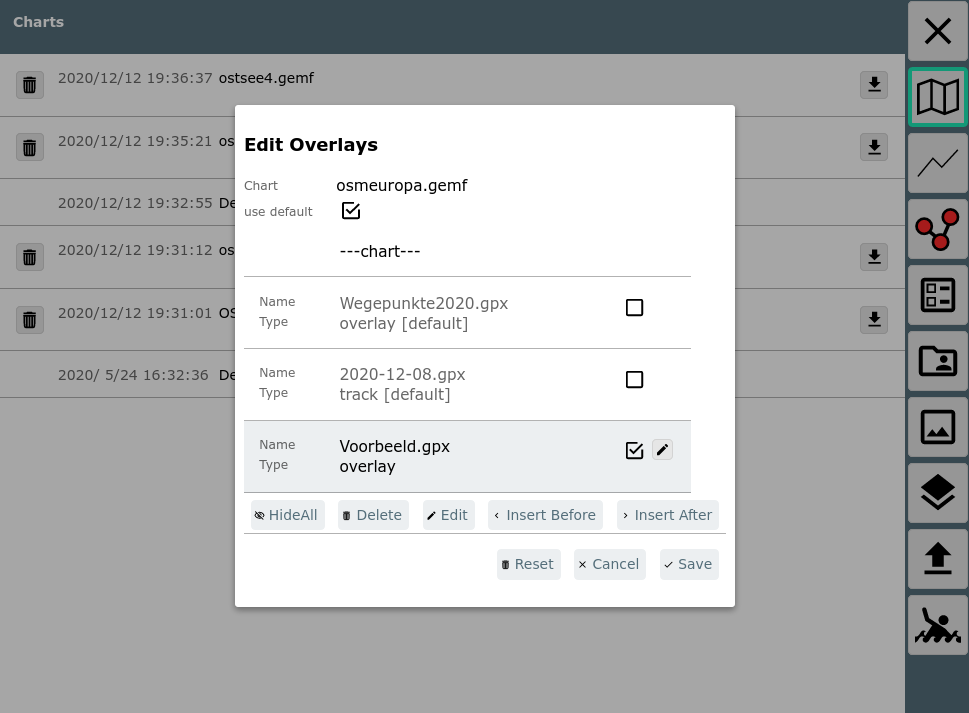

Hier können die unter default konfigurierten Overlays nur verschoben und
an- bzw. abgeschaltet werden, die Overlays nur für diese Karte können
bearbeitet werden.

Die Overlay-Konfiguration kann auch auf der Hauptseite durch Klick auf
den {{BT("OverlaysView")}}Button
neben der jeweiligen Karte erreicht werden.

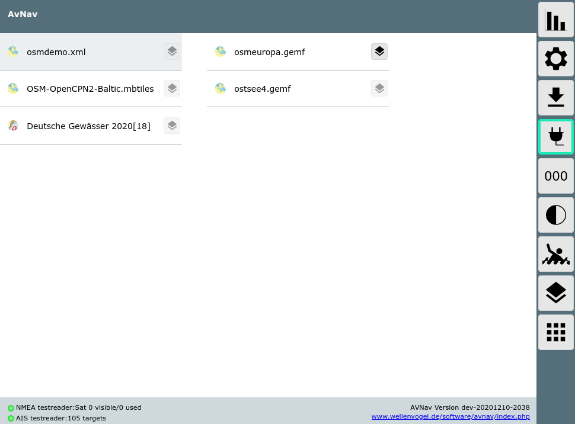

Der Button auf der rechten Seite führt zur Konfiguration der default
overlays.

Für Tracks und Routen kann man die Overlay Konfiguration auch von der
Files/Download Seite starten, indem man eine Route oder einen gpx Track
auswählt.

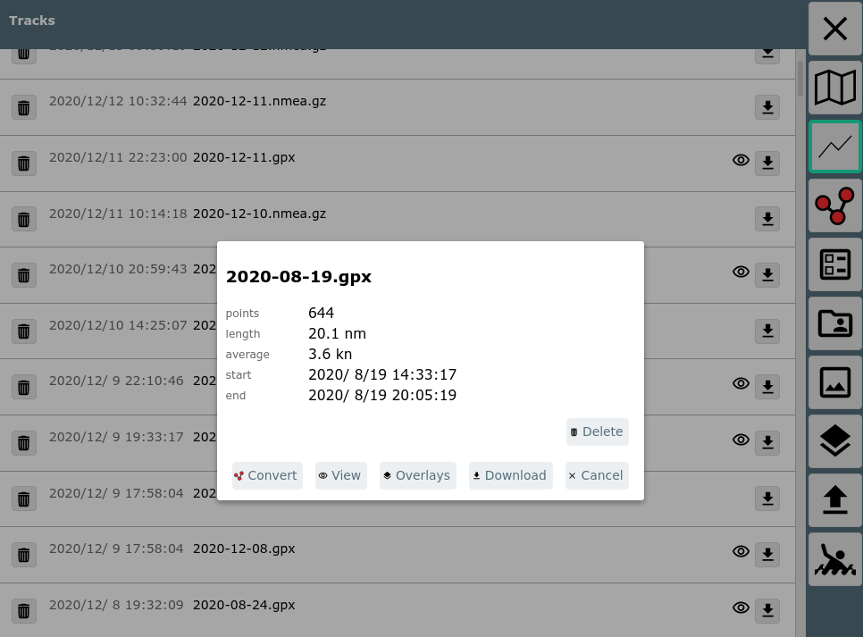

Im Bild wurde auf einen gpx Track geklickt. Durch Auswahl von "Overlays"
kann man diesen Track jetzt overlays zuordnen (oder ihn entfernen).

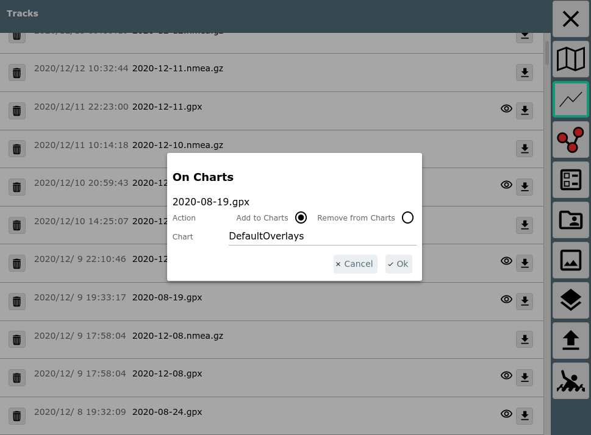

Nachdem man sich entschieden hat, ob man den Track den default overlays
oder einer spezifischen Karte zuordnen möchte, kommt man zur normalen
Overlay Konfiguration.

Wenn man "Remove from Charts" auswählt, wird der Track von allen overlays
entfernt.

Nutzung {: #usage}
------------------

Wenn eine Karte ausgewählt wird, wird sie zusammen mit ihren Overlays
dargestellt.

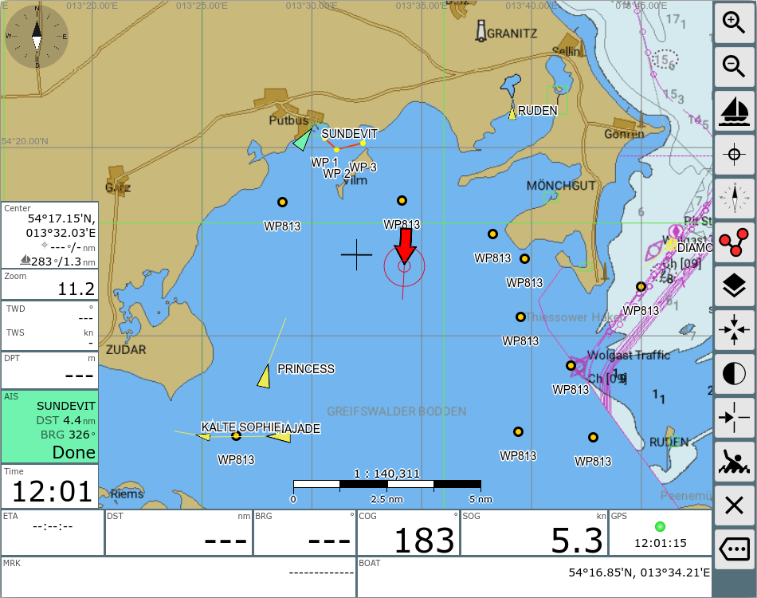

Im Beispiel eine o-charts Karte mit einer OpenStreetMap Karte darunter
und einer Wegpunkt-Datei darüber.  
Als Icon wurde das DefaultGpxIcon gewählt.  
Wenn auf eines der Icons aus dem Overlay geklickt wird, erhält man die
Feature Liste an diesem Punkt (die das Overlay entält), beim Klick auf das
Overlay erscheint ein Info Dialog.

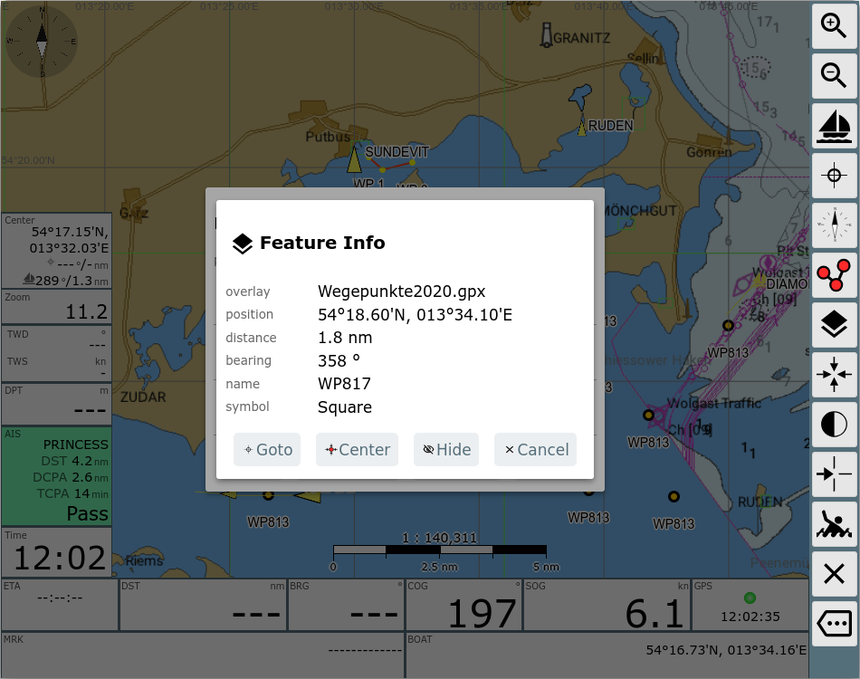

Man erhält die zum Punkt verfügbaren Informationen und die Möglichkeit
z.B. diesen Punkt sofort als Zielpunkt zum Routing zu verwenden (Goto).  
Über "Hide" kann das gesamte Overlay temporär ausgeblendet werden.  
Wenn man sich momentan im [Routen-Editor](../userdoc/editroutepage.md#featureInfo)
befindet, stehen noch weitere Funktionen zur Verfügung.

Auf der [Navigationsseite](../userdoc/navpage.md) und im [Route-Editor](../userdoc/editroutepage.md)
gibt es die Möglichkeit, Overlays aus- und einzublenden.  

Dazu auf der rechten Seite den {{BT("OverlaysView")}}Button verwenden.

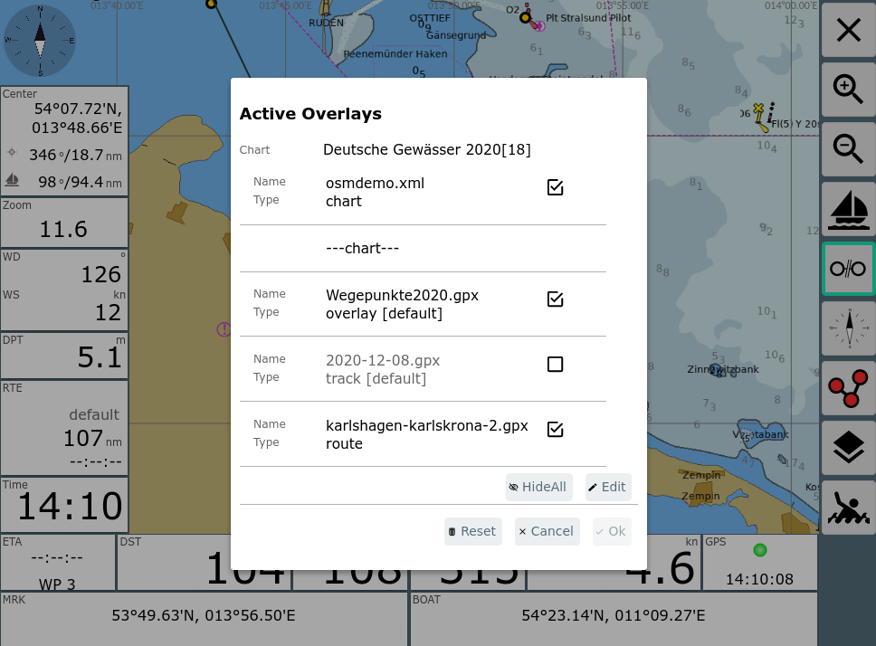

Hier kann man kurzfristig Overlays ein- und ausschalten. Diese
Einstellungen bleiben wirksam, bis die gewählte Karte gewechselt wird. Sie
betreffen auch nur das aktuelle Gerät, auf dem man arbeitet. Alle anderen
Veränderungen an den Overlays finden immer auf dem Server statt und werden
somit für alle Nutzer wirksam.

Über Edit kann man wieder zur normalen Bearbeitung der Overlays wechseln.

**Hinweis:**

Wenn man Overlay-Dateien mit sehr vielen Elementen nutzt, kann das die
Arbeitsgeschwindigkeit stark reduzieren. Momentan ist dort kein festes
Limit eingebaut, Dateien von einigen 100MB werden allerdings mit
Sicherheit Probleme bereiten. 1000 Punkte in einem Overlay sind dagegen
kein Problem.

Änderungen von Overlays
-----------------------

Ab Version 20220225 überwacht AvNav die Overlay Dateien und sorgt dafür,
das die Kartenansicht neu aufgebaut wird, wenn sich ein Overlay ändert.

Anpassungen {: #adaptation}
---------------------------

Ab Version 20210114 kann man die Informationen anpassen, die aus der
Overlay-Datei gewonnen werden und die dann bei "Feature Info" angezeigt
werden. Das kann sinnvoll sein, da manchmal verfügbare Overlay Dateien
Informationen enthalten, die AvNav von sich aus noch nicht kennt.

Zu diesem Zweck kann man beim [Konfigurieren](#configuration)
des Overlays einen "featureFormatter" angeben. Dabei handelt es sich um
eine Java Script Funktion, die entweder in AvNav schon vorhanden ist, die
in der [user.js](userjs.md) eingebaut wird, oder die von
einem [plugin](plugins.md) kommt.

Diese Java Script Funktion bekommt als Parameter die in der Overlay Datei
vorhandenen Eigenschaften des angeklickten Punktes und kann
veränderte/neue Eigenschaften zurückgeben, die dann vom FeatureInfo Dialog
angezeigt werden.

Die folgenden Eigenschaften können zurückgegeben werden:

|  |  |
| --- | --- |
| Name | Bedeutung |
| sym | die URL für ein anzuzeigendes Icon. Das kann eine relative URL sein, diese ist dann eine Icon Datei innerhalb der [konfigurierten](#configuration) userIcons Datei, ein absoluter Pfad wie z.B. /user/images/myImage.png oder eine mit http: beginnende externe URL (natürlich dann nur mit Internet Verbindung nutzbar). |
| name | der anzuzeigende Name |
| desc | der unter "description" anzuzeigende Text |
| htmlInfo | ein html String, der dann bei Klick auf den {{BT("MainInfo")}}Info Button angezeigt wird. |
| time | eine Zeitangabe (String oder java script Date) |
| link | eine URL, die bei Klick auf den {{BT("MainInfo")}}Info Button angezeigt werden soll (alternativ zu htmlInfo). Es gelten die gleichen Regeln wie für "sym". |

Die übergebenen Parameter hängen von der Overlay Datei ab. Zusätzlich
sind in jedem Falle die Werte "lat" und "lon" vorhanden.

Ein Beispiel für die [eingebaute
genericHtmlInfo](https://github.com/wellenvogel/avnav/blob/master/viewer/util/featureFormatter.js) Funktion, die alle vorhandenen Werte als HTML in den
Wert htmlInfo schreibt.

```
let genericHtmlInfo=function(properties,extended){
if (! extended) return {};
let htmlInfo='<div class="featureInfoHtml">';
for (let k in properties){
if (!properties[k]) continue;
if (htmlInfo !== "") htmlInfo+="<br/>";
htmlInfo+=avnav.api.escapeHtml(k)+"="+avnav.api.escapeHtml(properties[k]);
}
htmlInfo+='</div>';
return {htmlInfo:htmlInfo};
}
```

Der zweite Parameter, der an die Funktion übergeben wird, gibt einen
Hinweis, ob alle Parameter erzeugt werden sollen oder nur der "sym"
Parameter. Falls extended auf "false" gesetzt ist, sollte die Funktion
keine zeitraubenden Operationen ausführen, da sie potentiell für jedes
Element aus dem Overlay aufgerufen wird.

Um selbst eine solche Funktion bei AvNav bekannt zu machen, muss sie wie
folgt registriert werden (siehe [user.js](userjs.md)).

```
avnav.api.registerFeatureFormatter('myHtmlInfo',myHtmlInfoFunction);
```

Nachdem die Funktion registriert wurde, kann sie in der Overlay [Konfiguration](#configuration)
ausgewählt werden.