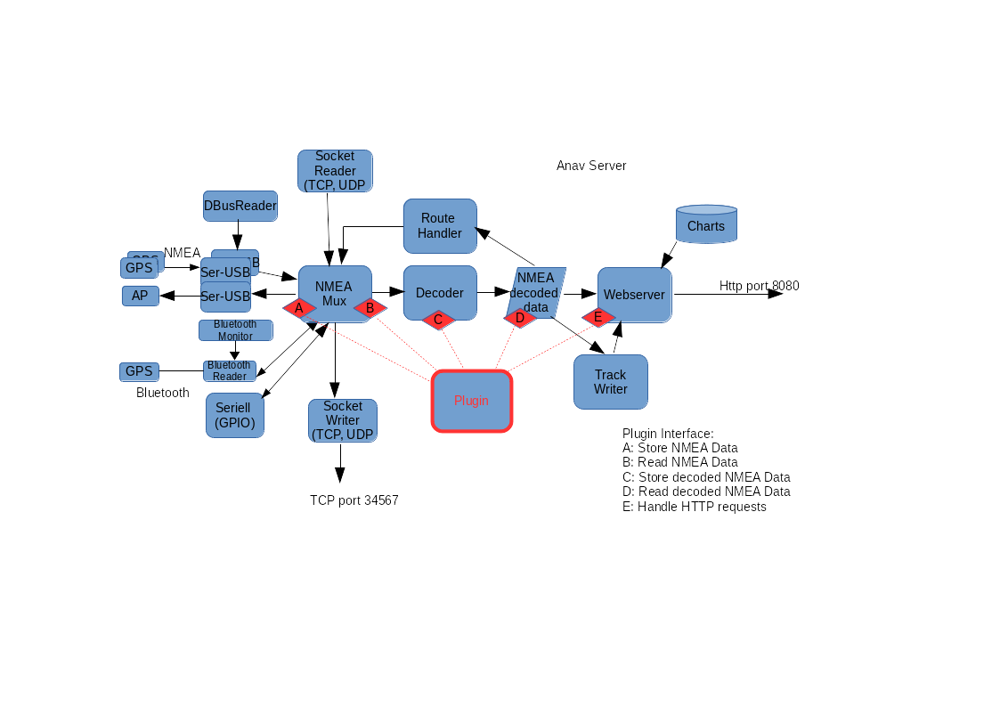

Plugins


Avnav Plugins
=============

=== nicht für Android ===

Um die Funktionalität von AvNav erweitern zu können gibt es Plugins.
Plugins können mit Python code den Server erweitern und sie können mit
Java Script und Css die WebApp erweitern.

Jedes Plugin muss sich in einem eigenen Verzeichnis befinden. Dessen Name
ist gleichzeitig der Plugin Name. Es gibt 2 Wurzelverzeichnisse, die AvNav
nach Plugins durchsucht:

* "systemdir" - ein Verzeichnis für Plugins, die für alle Nutzer auf
  einem System installiert werden (z.B. als Pakete). Dieses ist
  /usr/lib/avnav/plugins.
* "userdir" - ein Verzeichnis für Plugins eines einzelnen Nutzers. Das
  befindet sich unterhalb des "datadir" - also auf dem pi
  /home/pi/avnav/data/plugins, sonst unter Linux $HOME/avnav/plugins.

Daneben gibt es noch ein internes Plugin Verzeichnis (builtin).

Grundsätzlich können die Server-Anteile an verschiedenen Stellen Daten
aus AvNav lesen oder hineinschreiben. Die WebApp Anteile können im
Allgemeinen dazu dienen, diese Daten dann z.B. anzuzeigen. Daneben können
sie aber auch einfach weitere Anzeigen einbringen oder das Aussehen
anpassen.

In einem Plugin Verzeichnis kann es bis zu 3 Dateien geben, die von AvNav
beachtet werden (daneben natürlich weitere Dateien, die das Plugin selbst
benötigt).

Diese sind:

* plugin.py - die Serveranteile des Plugins, optional
* plugin.js - die Java Script Anteile des Plugins, optional
* plugin.css - die CSS Anteile des Plugins, optional

Ein Beispiel für ein Plugin findet man auf [GitHub](https://github.com/wellenvogel/avnav/tree/master/server/plugins/testPlugin).

Installation
------------

Um ein eigenes plugin zu erzeugen kann man entweder eine zip Datei oder
ein debian Paket bereitstellen.  
Wenn man eine zip Datei bereitstellt, sollte diese auf der obersten Ebene
genau einen Ordner mit dem Namen des plugins enthalten ("plugin" oder
"avnav" sollten nicht Bestandteil dieses Namens sein).  
Ein Nutzer des Plugins muss dieses dann im Unterverzeichnis "plugins" des
AvNav Datenverzeichnisses auspacken (z.B. /home/pi/avnav/data/plugins auf
einem Raspberry Pi).  
Auf diese Weise wird das plugin zu einem "user plugin".

Wenn man ein debian Paket bereitstellt, sollte es dem Namensschema
avnav-xxx-plugin folgen. Der Inhalt sollte in das Verzeichnis
/usr/lib/avnav/plugins/<pluginName> entpackt werden.  
Ein solches plugin wird zu einem "system plugin".  
Plugin Pakete sollten den Namen des plugins (d.h. den Verzeichnis-Namen)
als Metadaten Feld mit dem Namen "avnav-plugin" enthalten.  
Beispiel:

avnav-plugin: system-obp-plotterv3

Das unterstützt den AvNav Updater dabei festzustellen, ob ein
Plugin-Paket als Installationskandidat angezeigt werden soll oder nicht.  
Wenn man ausserdem das Metdatenfeld "avnav-hidden" auf true setzt , wird
das Paket im Updater nur angezeigt, wenn das Plugin explizit enabled
wurde.

Liste von Plugins
-----------------

* [ocharts](ocharts.md) - Karten von [o-charts](https://o-charts.org/)
* [ochartsng](ochartsng.md) - Neue Implementierung für [o-charts](https://o-charts.org/), S57 Karten
* [Seatalk
  Remote](https://github.com/wellenvogel/avnav-seatalk-remote-plugin) - in Zusammenspiel mit der Fernbedienung von [AK-Homberger](https://github.com/AK-Homberger/Seatalk-Autopilot-Remote-Control)
* [History](https://github.com/wellenvogel/avnav-history-plugin)
  - Datenspeicherung und Anzeige
* [Update](https://github.com/wellenvogel/avnav-update-plugin)
  - Update von AvNav (und den dazugehörigen Paketen) ohne die
  Kommandozeile nutzen zu müssen.  
  Konfig-Editor und Log-Viewer für AvNav
* [MapProxy](https://github.com/wellenvogel/avnav-mapproxy-plugin)
  - integriert [MapProxy](https://mapproxy.org/) für Zugriff
  und Download verschiedener online Kartenquellen
* [Obp-RC-Remote](https://github.com/wellenvogel/avnav-obp-rc-remote-plugin)
  - plugin für die Nutzung der [Fernbedienung](https://www.segeln-forum.de/thread/78328-fernbedienung-f%C3%BCr-den-raspberry/?postID=2237852#post2237852)
  von [Christian](https://www.segeln-forum.de/cms/user/19350-chrhartz/)
* [Sail-Instrument-Plugin](https://github.com/kdschmidt1/Sail_Instrument)
  - Dekodierung und Berechnung von weiteren Kurs- und Winddaten,Sail
  Instrument
* [rudder-angle](https://gitlab.strukturpunkt.de/kfr/avnav-rudder-angel)
  - Anzeige des Ruderwinkels (über SignalK)
* [Obp-PlotterV3](https://github.com/wellenvogel/avnav-obp-plotterv3-plugin)
  - Spezialfunktionen für den Open Boat Projects 10 Zoll Plotter (V3)

plugin.js
---------

Im Java script code sind genau die gleichen Funktionen verfügbar wie
unter [nutzerspezifischer Java Script code](userjs.md)
beschrieben.

plugin.css
----------

Im CSS code sind die gleichen Möglichkeiten vorhanden wie unter [nutzerspezifisches
CSS](usercss.md) beschrieben.

plugin.py
---------



Die Zeichnung gibt einen groben Überblick über die interne Struktur des
AvNav Servers und die Punkte, an denen ein Plugin Daten auslesen oder
einspeisen kann.

|  |  |  |
| --- | --- | --- |
| Punkt | Funktion | Beispiel |
| A | Einspeisen von NMEA Daten in die interne Liste. Diese stehen dann an allen Ausgängen zur Verfügung.  Hinweis: Solche Daten stehen zunächst nicht für die WebApp zur Verfügung, solange es keinen Dekoder für diesen Datensatz gibt. | Auslesen eines Sensors und Erzeugen des passenden NMEA0183 Datensatzes. |
| B | Auslesen von empfangenen NMEA Daten. Hier können (ggf. mit einem Filter) alle in AvNav durchlaufenden NMEA Daten gelesen werden. | In Zusammenspiel mit Punkt "C" Dekodieren von NMEA Datensätzen |
| C | Einspeisen von Daten in den internen Speicher von AvNav. Die Daten im internen Speicher sind in einer Baumstruktur abgelegt. Jedes Element ist durch einen Schlüssel der Form "a.b.c...." adressiert. Beispiel: "gps.lat".  Alle Schlüsselwerte, die mit "gps." starten, werden automatisch an die WebApp übertragen und sind dann dort unter "nav.gps...." verfügbar. (siehe [Layout Editor](layouts.md) und [nutzerspezifisches Java Script](userjs.md)).  Schlüsselwerte müssen vorher durch das Plugin angemeldet werden, es ist nicht möglich, bereits im System genutzte Schlüssel zu überschreiben. Ausnahme: Der Nutzer konfiguriert für das Plugin den Wert "allowKeyOverride" auf true. | Einspeisen eines von einem Sensor gelesenen Wertes - z.B. gps.temperature.outside oder von dekodierten NMEA Daten. |
| D | Auslesen von Daten aus dem internen Speicher. | Berechnung neuer Daten und Einspeisung unter "C" - oder Weiterreichen an eine externe Verbindung. |
| E | Bearbeiten von HTTP Requests | Die Java script Anteile können einen HTTP request senden, der im python code bearbeitet werden kann.  Anworten typischerweise in Json |

Ein Beispiel für eine plugin.py findet sich auf [GitHub](https://github.com/wellenvogel/avnav/blob/master/server/plugins/testPlugin/plugin.py).

Damit das Plugin von AvNav erkannt wird, müssen folgende Voraussetzungen
eingehalten werden:

1. In plugin.py muss mindestens eine Klasse vorhanden sein (der Name
   sollte Plugin sein)
2. Die Klasse muss eine statische Methode (@classmethod) mit dem Namen
   pluginInfo haben, die ein dictionary zurückgibt.  
   ```
   \* description (mandatory)
   \* data: list of keys to be stored (optional)
   \* path - the key - see AVNApi.addData, all pathes starting with "gps." will be sent to the GUI
   \* description
   ```
     
   Ein Beispiel könnte so aussehen:  
   ```
   @classmethod
   def pluginInfo(cls):  
    return {
   'description': 'a test plugins',
   'data': [
   {
   'path': 'gps.test',
   'description': 'output of testdecoder',
   }
   ]
   }
   ```
3. Der Konstruktor der plugin Klasse muss einen Parameter erwarten.  
   Beim Aufruf wird hier eine Instanz des [API](https://github.com/wellenvogel/avnav/blob/master/server/avnav_api.py)
   übergeben, über das die Kommunikation mit AvNav erfolgt.
4. Die Klasse muss eine run Methode (ohne Parameter) besitzen.  
   Diese wird in einem eigenen Thread aufgerufen, nachdem die
   Initialisierung abgeschlossen ist.  
   Typischerweise wird diese Methode eine Endlosschleife enthalten, um die
   Plugin-Funktion zu realisieren.

Für das Plugin können in der [avnav\_server.xml](configfile.md#plugins)
Parameter konfiguriert werden, diese sind dann über das API
(getConfigValue) abrufbar.

### Plugin API

Am [API](https://github.com/wellenvogel/avnav/blob/master/server/avnav_api.py)
stehen die folgenden Funktionen zur Verfügung

|  |  |
| --- | --- |
| Funktion | Beschreibung |
| log,debug,error | Logging Funktionen. Es werden Zeilen in die AvNav log Datei geschrieben. Man sollte für log und error vermeiden, solche Einträge in grosser Zahl zu schreiben, da sonst im Log potentiell wichtige Informationen verloren gehen (also z.B. nicht jede Sekunde ein Fehlereintrag...) |
| getConfigValue | lies einen config Wert aus der [avnav\_server.xml](configfile.md#plugins). |
| fetchFromQueue | Interface B: lies Daten aus der internen NMEA Liste. Ein Beispiel ist im API code vorhanden. Der filter Parameter funktioniert wie in der [avnav\_server.xml](configfile.md#filter). |
| addNMEA | Interface A: schreibe einen NMEA Datensatz in die interne Liste. Man kann AvNav die Prüfsummenberechnung überlassen und man kann auch eine Dekodierung in AvNav verhindern. Der Parameter source ist ein Wert, der in [blackList parametern](configfile.md#blackList) genutzt werden kann. |
| addData | Interface C: schreibe einen Wert in den internen Speicher. Es können nur Werte geschrieben werden, deren Schlüssel in der Rückgabe der pluginInfo Methode vorhanden waren. |
| getSingleValue | Interface D: lies einen Datenwert aus dem internen Speicher. Zur Zusammenfassung mehrerer solcher Lesevorgänge existiert die Funktion getDataByPrefix |
| setStatus | Hier sollte der aktuelle Zustand des Plugins gesetzt werden. Das ist der Wert, der auf der [Statusseite](../userdoc/statuspage.md) angezeigt wird. |
| registerUserApp | Ein Plugin kann eine [User App](../userdoc/addonconfigpage.md) registrieren. Dafür nötig ist eine URL und eine Icon Datei. Die Icon Datei sollte mit im Plugin Verzeichnis liegen. In der URL kann $HOST verwendet werden, das wird dann durch die korrekte IP Adresse des AvNav Servers ersetzt. |
| registerLayout | Falls das Plugin z.B. eigene Widgets mitbringt, ist es u.U. hilfreich ein vorbereitetes Layout mitzuliefern, das der Nutzer dann auswählen kann. Das Layout dazu nach der Erstellung mit dem [Layout Editor](layouts.md) herunterladen und im Plugin Verzeichnis speichern. |
| registerSettingsFile  (since 20220225) | Registrierung einer eigenen Einstellungsdatei (die vorher von der Settingsseite aus exportiert werden kann).  Der Dateiname (zweiter Parameter) ist relativ zum Plugin-Verzeichnis. Der Name (erster Parameter) wird dem Nutzer angezeigt.  Within this file you can use $prefix$ in the layout name if you want to refer to a layout that you register from the same plugin.  ``` ... "layoutName": "$prefix$.main" .... ``` This will refer to a layout that you registered with the name "main". |
| getDataDir | Das Verzeichnis, in dem AvNav Daten ablegt |
| registerChartProvider | Falls das Plugin Karten bereitstellt, wird hier ein callback registriert, der eine Liste der Karten zurückgibt. |
| registerRequestHandler | Falls das Plugin HTTP requests bearbeiten soll (Interface E) muss hier ein callback registriert werden, der den Request behandelt. Die url für den Aufruf ist:  <pluginBase>/api  Dabei ist pluginBase der unter getBaseUrl zurückgegebene Wert.  Die [java script Anteile](userjs.md) können die API url mit der Variable AVNAV\_BASE\_URL bilden: AVNAV\_BASE\_URL+"/api"  Im einfachsten Fall kann die aufgerufene callback-Funktion ein dictionary zurückgeben, dieses wird als Json zurück gesendet. |
| getBaseUrl | gib die Basis URL für das Plugin zurück |
| registerUsbHandler  (ab 20201227) | registriert einen Callback für ein USB Gerät. Mit dieser Registrierung wird AvNav mitgeteilt, dass es das USB Gerät nicht beachten soll. Der Callback wird mit dem Device-Pfad für das Gerät aufgerufen, wenn das Gerät erkannt wurde.  Die USB-Id kann am einfachsten durch Beobachten der Status-Seite beim Einstecken des Gerätes ermittelt werden. Siehe auch [AVNUsbSerialReader](configfile.md#AVNUsbSerialReader). Damit kann ein Plugin selbst einfach das Handling für ein spezielles Gerät übernehmen, Ein Beispiel findet sich auf [GitHub](https://github.com/wellenvogel/avnav-seatalk-remote-plugin/blob/master/plugin.py). |
| getAvNavVersion  (ab 20210115) | Aktuelle AvNav Version (int) |
| saveConfigValues  (ab 20210322) | Speichere config Werte für das Plugin in avnav\_server.xml. Der Parameter muss ein dictionary mit den Werten sein. Das Plugin muss sicherstellen, dass es später mit diesen Werten wieder starten kann. |
| registerEditableParameters  (ab 20210322) | Registriert eine Liste mit config Werten, die zur Laufzeit geändert werden können. Der erste Parameter ist eine Liste von dictionaries mit den Parameter Beschreibungen, der zweite ein callback, der bei Änderungen mit den geänderten Werten aufgerufen wird (wird typischerweise saveConfigValues rufen).  Die Syntax für die Parameter-Liste ist im S[ource Code](https://github.com/wellenvogel/avnav/blob/master/server/avnav_api.py) beschrieben. |
| registerRestart  (ab 20210322) | Registriere einen Stop Callback. Damit kann das Plugin disabled (deaktiviert) werden. |
| unregisterUserApp  (ab 20210322) | Deregistriere eine User App. |
| deregisterUsbHandler  (ab 20210322) | Deregistriere eine usb device id (siehe registerUsbHandler) |
| shouldStopMainThread  (ab 20210322) | Kann in der Hauptschleife genutzt werden, um zu prüfen, ob das Plugin gestoppt werden soll. In jedem anderen Thread wird immer True zurück gegeben. |
| sendRemoteCommand  (ab 20230426) | Sende ein Fernsteuerungskommando, siehe den [Source Code](https://github.com/wellenvogel/avnav/blob/3a291c2e08bfaa13b12246f9a456a4a896533d52/server/avnav_api.py#L344) für Details. |
| registerSettingsFile  (ab 20230426) | Mache eine Datei mit gespeicherten Einstellungen bekannt. Diese kann vom Nutzer dann geladen werden. |
| registerCommand  (ab 20230426) | Registriere ein Kommando, das von AvNav ausgeführt werden kann. Dieses kann z.B. dafür genutzt werden ein bereits vorhandenes Kommando zu ersetzen. Auch neue Kommandos sind möglich. Siehe den [Source Code](https://github.com/wellenvogel/avnav/blob/3a291c2e08bfaa13b12246f9a456a4a896533d52/server/avnav_api.py#L364) oder die [AVNCommandHandler Konfiguration](configfile.md#AVNCommandHandler) für Details. |
| registerConverter  (since 20240520) | Registriere einen Karten-Konverter  Für ein Beispiel siehe das [ochartsng plugin](https://github.com/wellenvogel/ochartsng/blob/f10d8aa8b10ce89320b939a91e14ceaa822054a0/avnav-plugin/plugin.py#L407) |
| deregisterConverter  (since 20240520) | Deregistriere einen Karten-Konverter |

Aktivieren und Verbergen von System Plugins
-------------------------------------------

(ab 20230426)

Um plugins "unsichtbar" zu machen, die mit debian Paketen installiert
wurden, gibt es ein Script /usr/lib/avnav/plugin.sh.  
Als root kann man dieses Script aufrufen um die Sichtbarkeit von system
plugins zu steuern und default Parameter zu setzen.  
Ein Aufruf ohne Parameter bringt eine Hilfe mit den Aufruf-Optionen.

Spezialfunktionen für den Raspberry Pi {: #scripts}
---------------------------------------------------

(ab 20230426)

Plugins die als debian Pakete für den Raspberry Pi erzeugt werden (system
plugins) können ein Shell Script "plugin-startup.sh" bereitstellen.  
Dieses Script ermöglich es plugins, Systemparameter zu konfigurieren.  
Es wird immer während des Bootprozesses des Systems aufgerufen.  
Ob und mit welchen Parametern ein solches Script aufgerufen wird, hängt
von einem Parameter in der Datei /boot/avnav.conf ab (siehe [Image
Vorbereitung](../install.md#preparation)). Der Parametername ist:  
AVNAV\_<PLUGIN>  
Dabei ist <PLUGIN> der Pluginname (d.h. der Name seines
Verzeichnisses) übersetzt in Großbuchstaben (und ohne alle Zeichen ausser
0-9 und a-z).  
Wenn dieser Parameter auf "yes" gesetzt ist, wird das Pluginscript
gerufen.

Es gibt 3 Aufruf-Varianten:

### plugin-startup.sh enable

Dieser Aufruf findet beim ersten Boot mit dem Parameter in der avnav.conf
auf "yes" statt.  
Das Plugin sollte jetzt alle notwendigen Änderungen am System vornehmen
(wenn möglich so, das sie auch später wieder rückgängig gemacht werden
können).  
Typischerwe betrifft das Anpassungen /boot/config.txt oder anderen
Konfigurationsdateien.  
Das Script sollte 1 zurückgeben, wenn ein Reboot nötig ist, sonst 0 oder
< 0 bei Fehlern.

Es gibt einige [Helper
Funktionen](https://github.com/wellenvogel/avnav/blob/master/raspberry/setup-helper.sh) die im Script genutzt werden können. Diese Helper
Funktionen bindet man mit

. "$AVNAV\_SETUP\_HELPER"

in das Script ein.  
Die Umgebungsvariable AVNAV\_SETUP\_HELPER ist gesetzt, wenn das Script
aufgerufen wird.  
Ein Beispiel findet man im [obp-plotterv3-plugin](https://github.com/wellenvogel/avnav-obp-plotterv3-plugin/blob/master/plugin-startup.sh).

### plugin-startup.sh disable

Dieser Aufruf wird ausgeführt, wenn der Parameter in der avnav.conf von
yes auf einen anderen Wert geändert oder entfernt wird. Das Script sollte
die am System gemachten Änderungen - soweit möglich - wieder zurücknehmen.  
Anmerkung: Da das Handling im Normalfall nur dazu vorgesehen ist, einmalig
bei der ersten Nutzung eines Images stattzufinden, ist es kein grosses
Problem, wenn Änderungen nicht zurückgenommen werden.

### plugin.startup.sh [keine Parameter]

Dieser Aufruf erfolgt bei jedem boot. In diesem Falls sollten keine
Einstellungen im System geändert werden - es könnte sonst sehr
überraschend für den Nutzer sein, wenn bei einem beliebigen Startvorgang
plötzlich Systemeinstellungen geändert werden. Es können aber
beispielsweise notwendige Initialisierungen von Hardware vorgenommen
werden.