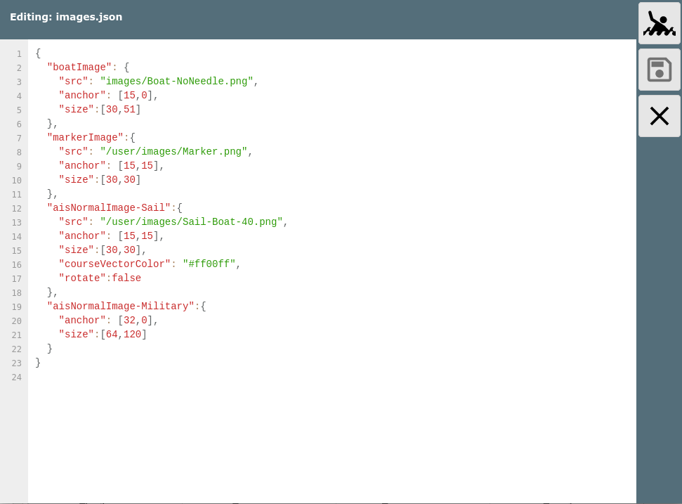

user icons


Nutzer Symbole
==============

Seit Version 20201030.

Eine Reihe der in AvNav genutzten Symbole kann man an die eigenen
Bedürfnisse anpassen. Man kann die vorhanden Symbole in ihrer Größe
ändern, verschiedene Eigenschaften einstellen, oder sie durch eigene
Symbole ersetzen.

Falls man eigene Symbole nutzen möchte, müssen diese als .png Dateien in
das Images Verzeichnis hochgeladen werden - siehe bei der [Beschreibung
zu Nutzer-Dateien](../userdoc/downloadpage.md#userfiles).

Welche Symbole verändert werden sollen (und wie), wird in einer JSON
Datei im Nutzer Verzeichnis beschrieben - images.json.

Diese Datei hat den folgenden Aufbau (Beispiel):

```
{
"boatImage": {
"anchor": [20,0],
"size":[40,71]
},  
 "boatImageHdg:{  
 "src": "/user/images/SpecialBoat.png",
"anchor": [15,15],   
 "size":[30,70]  
 }
"markerImage":{
"src": "/user/images/Marker.png",
"anchor": [15,15],
"size":[30,30]
},
"aisNormalImage-Sail":{
"src": "/user/images/Sail-Boat-40.png",
"anchor": [15,15],
"size":[30,30],
"courseVectorColor": "#ff00ff",
"rotate":false
},
"aisNormalImage-Military":{
"anchor": [32,0],
"size":[64,120]
}
}
```

Ab 20230614 existiert eine [Basis-Konfiguration](https://github.com/wellenvogel/avnav/blob/master/viewer/static/images.json)
die das System nutzt. In der Nutzer-Datei können Einträge überschrieben
werden.

Für jedes zu ersetzende Symbol muss ein Eintrag mit dem entsprechenden
Namen existieren.

Allgemeine Images
-----------------

|  |  |
| --- | --- |
| boatImage | Das Symbol für das Boot auf der Navigationsseite |
| boatImageHdg  (20220421) | Das Symbol für das Boot wenn hdm oder hdt zur Anzeige genutzt werden |
| boatImageSteady  (20220421) | Das Symbol für das Boot, wenn zero SOG detect aktiviert ist und das Boot sich nicht bewegt |
| markerImage | Das Symbol für den aktuellen Ziel-Wegepunkt |
| anchorImage | Das Symbol für den Anker bei aktiviertem Anker-Alarm |
| measureImage | Das Symbol für den Startpunkt der aktuellen Messung |

AIS Images
----------

Bei den AIS Images gibt es eine ganze Reihe von Optionen. Jedes AIS Ziel
kann in einem bestimmten Zustand sein (gekennzeichnet durch eine
entsprechende Farbe)

|  |  |
| --- | --- |
| Zustand | Bedeutung |
| Normal | AIS Ziel |
| Warning | Das nächste AIS Ziel, das die minimal eingestellte CPA unterschreitet |
| Tracking | Das AIS Ziel, das über die AIS Info Seite ausgewählt wurde |
| Nearest | Das nächste AIS Ziel |

Daneben können die AIS Images noch abhängig von der Art (Normal/Aton) und
verschiedenen Parametern (ship type, navigation status, aid type)
unterschieden werden.

Es ist prinzipiell möglich für jede der möglichen Kombinationen ein
eigenes Icon zu definieren. Einfacher ist es jedoch (ab 20230614) , die
Handling des Zustandes (Farbe) AvNav zu überlassen. Dazu müssen die Icons
eine Farbe enthalten, die dann bei der Darstellung durch die entsprechende
Farbe des Zustandes ersetzt wird. Diese Farbe muss dazu AvNav über den
Parameter "replaceColor" mitgeteilt werden (siehe die [defaults](https://github.com/wellenvogel/avnav/blob/master/viewer/static/images.json)
für Beispiele).

Es sind damit im Wesentliche folgende Icon-Angaben möglich (Beispiele):

|  |  |  |
| --- | --- | --- |
| Key | Bedeutung |  |
| aisImage | default Ais icon |  |
| aisImage-status1 | Icon für AIS Ziele mit dem navigational Status 1 (At Anchor), für eine Liste der Werte siehe den [source code](https://github.com/wellenvogel/avnav/blob/d96104c8db58459d24dee180fa19c5360cab3d69/viewer/nav/aisformatter.jsx#L152). |  |
| aisImage-Fishing | Icon für AIS Ziele mit dem ship type 30 (Fishing), [siehe den code](https://github.com/wellenvogel/avnav/blob/d96104c8db58459d24dee180fa19c5360cab3d69/viewer/nav/aisformatter.jsx#L120) für die Werte |  |
| aisImage-Fishing-status1 | Icon für AIS Ziele mit dem navigational Status 1 (At Anchor) und type 30 (Fishing) |  |
| aisatonImage | default AIS Icon für atons |  |
| aisatonImage-type9 | AIS Icon für atons mit type 9 (Beacon, Cardinal N), [siehe den code](https://github.com/wellenvogel/avnav/blob/d96104c8db58459d24dee180fa19c5360cab3d69/viewer/nav/aisformatter.jsx#L256) für die Werte. |  |

Das Setzen der Images folgt Prioritäten :

1. aisImage-Fishing-status1
2. aisImage-Fishing-status\* (since 20250812)
3. aisImage-status1
4. aisImage-Fishing

Man muss daher beachten, das man eventuell mehrere Einträge machen muss,
wenn man z.B. für einen Typ ein bestimmtes Icon haben möchte (insbesondere
vor Version 20250812) - in den defaults gibt es schon Einträge für die
Status-Werte 1,2,3,4,5,6,7 - man muss dann z.B. für den Typ Passenger
Einträge für

* aisImage-Passenger-status1
* aisImage-Passenger-status2
* aisImage-Passenger-status3
* aisImage-Passenger-status4
* aisImage-Passenger-status5
* aisImage-Passenger-status6
* aisImage-Passenger-status7

erzeugen.   
Ab Version 20250812 erlaubt die Definition auch einen "wildcard" Status.
So kann man für das Beispiel angeben:

* aisImage-Passenger-status\*

Falls man nicht mit "replaceColor" arbeiten möchte, kann man
unterschiedliche Icons für die Zustände angeben:

aisWarningImage, aisNormalImage, aisWarningImage-status1, ...

Icon Parameter
--------------

Die folgenden Parameter können für jedes Symbol definiert werden:

|  |  |  |
| --- | --- | --- |
| src | Die URL für die Image Datei. Typisch /user/images/XYZ.png für eine Datei, die über die Download Seite hochgeladen wurde.  Falls dieser Parameter nicht angegeben wird, wird das in AvNav vorhandene Symbol genutzt - man kann aber z.B. mit den anderen Parametern die Größe ändern.  Die Bilddateien sollten ein wenig grösser sein, als das was man bei size angibt - z.B. Faktor 2 (aber nicht zu gross, da sonst die Performance leidet). Wenn man Vektorgrafiken hat, kann man z.B. [inkscape](https://inkscape.org) nutzen, um daraus png's zu erzeugen |  |
| size | [breite,höhe] - muss als Array (siehe Beispiel) angegeben werden. Das beschreibt die Größe des Symbols (die Bilddatei wird auf diese Größe skaliert).  Falls man keinen src Parameter angibt, kann man hiermit die Größe des internen Symbols verändern. |  |
| anchor | [x,y] - der Punkt des Symbols (bezogen auf Breite und Höhe), der auf die aktuelle Position auf der Karte gesetzt werden soll. |  |
| rotate | true oder false - wenn auf false gesetzt, wird das Symbol nicht entsprechend des aktuellen Kurses rotiert | nicht für markerImage |
| courseVector | true oder false - wenn auf false, wird für dieses Symbol kein Voraus-Vektor gezeichnet (auch wenn es über die Einstellungen aktiv ist) | nicht für markerImage |
| courseVectorColor | die Farbe für den course Vektor. Hier kann man eine Farbe wählen, die zu den genutzten Bildern passt. | nicht für markerImage |
| replaceColor  (ab 20230614) | Die Farbe, die je nach Zustand zu ersetzen ist | nur ais...Image |
| textOffset  (ab 20230614) | Ein Array [x,y] für den Basis-Text-Offset. Zusätzlich wird noch ein weiterer Offset je nach Kurs berechnet (primär y). Der X Wert muss sich an der Größe des Icons (size Parameter) orientieren | nur ais...lImage |

Nicht angegebene Parameter werden jeweils durch default Werte ersetzt. Es
ist auch möglich, für bestimmte Kombinationen nur Parameter anzugeben und
kein eigenes Icon - damit kann man z.B. die AIS Symbole unterschiedlich
groß gestalten. Typischerweise muss bei Änderung von size auch anchor
geändert werden.

Bei der Bearbeitung der images.json muss darauf geachtet werden, valides
json zu erzeugen. Wenn man es innerhalb von AvNav auf der Files/Download
Seite {{BT("DBDownload")}}(Unterseite
{{BT("AddonConfigUser")}})
bearbeitet, wird beim Speichern automatisch eine Syntax-Prüfung
vorgenommen.



Nach der Änderung von images.json muss AvNav neu geladen werden.