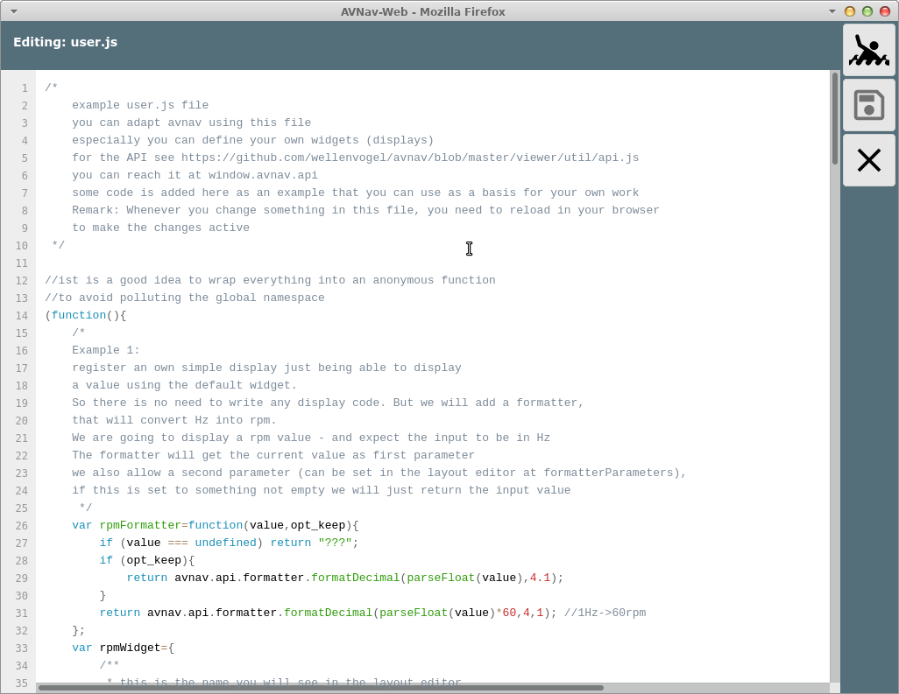

user java script


User Spezifischer Java Script Code
==================================

Um eine einfache Möglichkeit zu bieten, AvNav an seine Bedürfnisse
anzupassen, kann man mit ein wenig Java Script Code AvNav relativ einfach
erweitern.

Dabei ist es zunächst einmal möglich, neue Anzeigen zu definieren, die
dann im Layout Editor ausgewählt werden können. Prinzipiell kann man dort
beliebigen Java Script Code ausführen - muss dabei aber natürlich zusehen,
die Funktionen von AvNav nicht zu stören.

Der Java Script Code liegt in der Datei user.js im Verzeichnis
BASEDIR/user/viewer.  
BASEDIR ist z.B. auf dem pi /home/pi/avnav/data.

Bearbeitung
-----------

Um die Bearbeitung zu erleichtern, kann man über die Files/Download Seite
{{BT("DBDownload")}}und
die Unterseite {{BT("AddonConfigUser")}} auf die Dateien in diesem Verzeichnis zugreifen.


Wie im Bild zu sehen, existiert dort bereits eine Datei user.js. Diese
wird beim erstmaligen Start aus einem Template erzeugt.

Durch einen Klick auf die Datei und die Auswahl von "Edit" kann man die
Datei direkt bearbeiten.



In der Datei sind bereits Beispiele vorhanden für die Möglichkeiten der
Anpassung. Nach dem Bearbeiten die Datei speichern {{BT("SettingsSave")}} und AvNav neu laden.

Es empfiehlt sich, die Datei in regelmäßigen Abständen nach dem
Bearbeiten herunterzuladen und noch einmal irgenwo zu speichern - es gibt
keine Versionsverwaltung in AvNav.  
Ein erprobter Weg zur Bearbeitung ist die Nutzung von 2 Browserfenstern
oder Tabs:

* In einem Fenster macht man die Bearbeitung und speichert die Datei
* Im anderen Fenster lädt man AvNav jeweils neu und testet die
  Änderungen (dabei ist auch die Nutzung der Browser Entwicklerwerkzeuge
  hilfreich, weil man hier u.U. Fehlermeldungen sehen kann - oder sogar
  den Code debuggen kann).

Auf diese Weise kann man recht zügig Änderungen vornehmen und ihre
Funktion testen.

Das aktuelle Template kann man auch [auf
github](https://github.com/wellenvogel/avnav/blob/release-20250822/viewer/static/user.js) finden.

Anzeigen (Widgets) {: #widgets}
-------------------------------

Man kann die folgenden Arten von Anzeigen hinzufügen:

* Widgets mit eigenem Formatter (und ggf. festen Werten) basierend auf
  dem Default Widget (Beispiel 1 - [user.js](https://github.com/wellenvogel/avnav/blob/release-20250822/viewer/static/user.js):
  rpmWidget, [testPlugin](https://github.com/wellenvogel/avnav/blob/master/server/plugins/testPlugin/plugin.js):
  testPluing\_simpleWidget )
* Anpassung/Erweiterung der Grafik Widgets mit [canvas
  gauges](https://canvas-gauges.com/) (Beispiel 2 - [user.js](https://github.com/wellenvogel/avnav/blob/release-20250822/viewer/static/user.js#L69):
  rpmGauge)  
  Hiermit ist es auch möglich, Parameter zugänglich zu machen, die in den
  bisher vorhandenen Widgets nicht enthalten sind
* Widgets mit eigenem HTML code (Beispiel 3 - [user.js](https://github.com/wellenvogel/avnav/blob/release-20250822/viewer/static/user.js):
  userSpecialRpm, [TestPlugin](https://github.com/wellenvogel/avnav/blob/master/server/plugins/testPlugin/plugin.js):
  testPlugin\_courseWidget)
* Widgets mit Grafik in einem Canvas Element (Beispiel im [TestPlugin:](https://github.com/wellenvogel/avnav/blob/master/server/plugins/testPlugin/plugin.js)
  testPlugin\_courseWidget)
* Widgets mit eigenem HTML, die mit dem Server Teil eines Plugins
  interagieren ([TestPlugin](https://github.com/wellenvogel/avnav/blob/master/server/plugins/testPlugin/plugin.js):
  testPlugin\_serverWidget)
* Widgets, die Grafiken auf der Karte darstellen (type: map) - ab
  20220819 z.B. [SailInstrument](https://github.com/kdschmidt1/Sail_Instrument/blob/e1d87186138e5a3ac894916e9b7e85a3218a4c9a/Sail_Instrument/plugin.js#L223)

Das Interface, über das mit AvNav kommuniziert wird, findet sich [auf
github](https://github.com/wellenvogel/avnav/blob/master/viewer/util/api.js) bzw. im Template Code.  
Für map Widgets kann über das Api auf die [zugrunde
liegenden Bibliotheken](https://www.movable-type.co.uk/scripts/geodesy-library.md) für geografische Berechnungen zugegriffen
werden (Funktion LatLon und Dms).

### Canvas Gauges

Für [Canvas Gauge](https://canvas-gauges.com/) Widgets können
bestimmte Parameter (siehe [Canvas
Gauges Beschreibung](https://canvas-gauges.com/documentation/user-guide/configuration)) entweder auf feste Werte gesetzt werden (dann
müssen sie in der Widget Definition vorhanden sein - siehe die Werte im [Beispiel
ab Zeile 134](https://github.com/wellenvogel/avnav/blob/release-20250822/viewer/static/user.js#L134)) oder sie können für den Nutzer im Layout Editor
einstellbar gemacht werden (dann müssen sie als [editable
WidgetParameter](#widgetparameter) gesetzt werden - im [Beispiel
ab Zeile 156](https://github.com/wellenvogel/avnav/blob/release-20250822/viewer/static/user.js#L156)).

Ausserdem kann eventuell ein [eigener Formatter](#formatter)
definiert werden und als default für das Widget gesetzt werden.

Wenn man für bestimmte [vordefinierte
Parameter](#predefinedparameters) vermeiden möchte, das sie im Layout Editor für den Nutzer
sichtbar werden, müssen sie in den editable Parameters mit false angegeben
werden.

```
var rpmGaugeUserParameter = {
...
formatter: false,
formatterParameters: false
};
```

Für jedes gauge widget muss der Parameter "type" angegeben werden -
entweder "radialGauge" oder "linearGauge".  
Ausserdem haben sie den zusätzlichen Parameter

```
drawValue (boolean)
```

Dieser Parameter steuert, ob auch eine numerische Anzeige des Wertes
erfolgen soll. Der originale "valueBox" Parameter der canvas gauges wird
ignoriert!

Neben den Parametern kann auch noch eine translateFunction definiert
werden. Diese erhält als Parameter ein Objekt mit den aktuellen Werten
aller Parameter und kann dieses modifizieren, bevor sie an canvas gauges
übergeben wird ([Beispiel
ab Zeile 104](https://github.com/wellenvogel/avnav/blob/release-20250822/viewer/static/user.js#L104)). Diese Funktion muss "zustandsfrei" sein, d.h. die
Werte der Rückgabe dürfen nur von den übergebenen Werten (und anderen
unveränderlichen Werten) abhängig sein. Andernfalls werden potentiell
Änderungen nicht in der Anzeige sichtbar.

### Eigene Widgets

Für ein selbst geschriebenes Widget können die folgenden
Funktionen/Eigenschaften implementiert werden:

|  |  |  |  |
| --- | --- | --- | --- |
| Name | Typ | Nutzbar bei Typ | Beschreibung |
| name | String | alle | der Name des Widgets |
| type | String  (optional) | alle | Bestimmt, welches Widget erzeugt werden soll.  Werte: radialGauge, linearGauge, map  Wenn der Typ nicht gesetzt ist, wird entweder das default widget genutzt (keine Funktion renderHtml und keine Funktion renderCanvas angegeben) - oder ein nutzer definiertes Widget (userWidget) |
| renderHtml | Funktion  (optional) | userWidget | Diese Methode muss einen String zurückgeben, der dann als HTML code in das Widget eingebaut wird.  Falls eventHandler für Elemente genutzt werden sollen, müssen diese vorher registriert werden (siehe initFunction) und werden im HTML code einfach mit  ``` <button onclick="myHandler">Click!</button> ``` angegeben (das ist keine exakte HTML Syntax, da nur der Name des event handlers angegeben wird, kein java script code).    Die "this" variable innerhalb von renderHtml zeigt auf ein Objekt, das spezifisch für das Widget ist (Kontext).  Wenn der EventHandler aufgerufen wird, zeigt this ebenfalls auf diesen Kontext.    Das als Parameter an renderHtml übergebene Objekt enthält die unter storeKeys definierten Werte.  Die Funktion wird jedesmal erneut aufgerufen, wenn sich die Werte geändert haben. |
| renderCanvas | Funktion  (optional) | userWidget,  map | Mit dieser Funktion kann in das übergebene Canvas Objekt gezeichnet werden.  Das als zweiter Parameter an renderCanvas übergebene Objekt enthält die unter storeKeys definierten Werte.  Die Funktion wird jedesmal erneut aufgerufen, wenn sich die Werte geändert haben.  Die "this" variable innerhalb von renderCanvas zeigt auf ein Objekt, das spezifisch für das Widget ist (Kontext).  Für map widgets ist dieser Canvas ein Overlay, das über die Karte gelegt wird. Am Widget Kontext stehen Funktionen zur Umrechnung von Koordinaten in Canvas Pixel bereit.   Es ist wichtig den Canvas korrekt mit save/restore zu beschreiben, da sich alle map widgets den gleichen Canvas teilen. |
| storeKeys | Object | alle | Hier müssen die Daten angegeben werden, die aus dem zentralen Speicher gelesen und als Parameter den renderXXX Funktionen mitgegeben werden sollen |
| caption | String  (optional) | alle | Eine default Beschriftung |
| unit | String  (optional) | alle | Eine default Einheit |
| formatter | Funktion  (optional) | defaultWidget,  radialGauge, linearGauge | Ein Formatierer für den Wert. Für das defaultWidget muss diese Funktion angegeben werden. |
| translateFunction | Funktion  (optional) | alle ausser map | Diese Funktion wird mit den aktuellen Werten als Parameter aufgerufen (so wie bei storeKeys angegeben) und muss die daraus berechneten Werte zurückgeben.  Falls keine eigene renderXXX Funktion genutzt werden soll, kann hier vor dem Rendern eine Umrechnung von Werten erfolgen - siehe [Beispiel](https://github.com/wellenvogel/avnav/blob/release-20250822/viewer/static/user.js). |
| initFunction | Funktion  (optional) | userWidget,  map | Falls vorhanden, wird diese Funktion einmalig aufgerufen, wenn das Widget erzeugt wird. Als Parameter (und als this) ist der Widget Context vorhanden.  Dieses Objekt hat eine eventHandler Eigenschaft - hier müssen die im renderHTML genutzten eventHandler eingetragen werden.  Mit der Funktion triggerRedraw am Widget Kontext kann ein erneuter Aufruf der renderXXX Funktionen erzwungen werden,  Ab Version 20210422 erhält die initFunction einen 2. Parameter, der die Eigenschaften des Widgets enthält. Das sind insbesondere auch alle editierbaren Widget Parameter, die definiert wurden. |
| finalizeFunktion | Funktion  (optional) | userWidget,  map | Falls vorhanden, wird diese Funktion aufgerufen, bevor das Widget nicht mehr genutzt wird. Die "this" Variable zeigt wieder auf den Widget Kontext.  Ausserdem ist der Kontext auch als erster Parameter vorhanden - wie bei der initFunction. |

Der java script code erhält folgende globale Variablen:

|  |  |  |
| --- | --- | --- |
| Name | plugin.js/user.js | Beschreibung |
| AVNAV\_BASE\_URL | beide | die URL zum Verzeichnis, aus dem die Java script Datei geladen wurde. Diese kann z.B. verwendet werden, um weitere Elemente von dort zu laden. Für die user.js können Dateien aus dem images Verzeichnis über AVNAV\_BASE\_URL+"../images" erreicht werden.  Für plugins kann über AVNAV\_BASE\_URL+"/api" die Kommunikation mit dem Python Anteil erreicht werden. |
| AVNAV\_PLUGIN\_NAME | plugin.js | Der Name des Plugins. |

Nach der Definition muss das Widget bei AvNav bekannt gemacht werden
(avnav.registerWidget).

Widget Context
--------------

User Widgets und Map Widgets bekommen einen WidgetContext. Dieser wird
für jedes Widget erzeugt und den Funktionen:

* initFunction (this und erster Parameter)
* finalizeFunction (this und erster Parameter)
* renderHtml (this)
* renderCanvas (this)

übergeben.  


Damit der Kontext als this Parameter genutzt werden kann, müssen die
Funktionen "klassisch" mittels function definiert werden und nicht als
"arrow function".

Richtig:

```
let userWidget={  
 renderHtml: function(context,props){  
 return "<p>Hello</p>";  
 }  
}
```

Im WidgetContext können Nutzerdaten gespeichert werden, die in
aufeinanderfolgenden Aufrufen benötigt werden.  
Ausserdem enthält er einige Funktionen, die vom Widget Code aufgerufen
werden können.

|  |  |  |  |
| --- | --- | --- | --- |
| Name | Widget | Parameter | Beschreibung |
| eventHandler | userWidget | --- | eventHandler ist keine Funktion sondern ein array. Falls im renderHtml event Handler angegeben werden - z.B. <button onclick="clickHandler"/>, dann muss in der initFunction  eine Funktion clickHandler hier registriert werden:  this.eventHandler.clickHandler=function(ev){...}  Siehe [TestPlugin](https://github.com/wellenvogel/avnav/blob/7035cba511ea400ebcd7a972b6b0baf79deba04d/server/plugins/testPlugin/plugin.js#L150). |
| triggerRedraw | userWidget | --- | Diese Funktion muss gerufen werden, wenn das Widget (z.B. nach einer Kommunikation mit dem Server) möchte, das es neu gezeichnet wird.  Siehe [TestPlugin](https://github.com/wellenvogel/avnav/blob/7035cba511ea400ebcd7a972b6b0baf79deba04d/server/plugins/testPlugin/plugin.js#L160). |
| lonLatToPixel | map | lon,lat | Konvertiert die Koordinaten in pixel Koordinaten für das Zeichnen in renderCanvas.  Gibt ein array mit x,y Koordinate zurück. |
| pixelToLonLat | map | x,y | Berechnet aus den Canvas-Koordinaten x,y longitude und latitude. Gibt ein array mit lon,lat zurück. |
| getScale | map | --- | Gibt den Scaling Faktor für das Display zurück. Hochauflösende Display haben einen scaling Factor > 1. Gezeichnete Objekte (besonders Text) sollten in ihren Dimensionen angepasst werden. |
| getRotation | map | --- | Gibt die Drehung der Karte (in radian!) zurück |
| getContext | map | --- | Gibt den renderingContext2D des Canvas zurück (nur aktiv innerhalb der renderCanvas Funktion) |
| getDimensions | map | --- | gibt die Größe des Canvas zurück [Breite,Höhe] |
| triggerRender | map | --- | gleiche Funktion wie triggerRedraw beim user Widget |

Widget Parameter {: #widgetparameter}
-------------------------------------

Neben der Widget Definition können beim registrieren des Widgets noch
Parameter angegeben werden, die dann im Layout Editor für das Widget
angezeigt werden.

Beispiele sind im [user.js
Template](https://github.com/wellenvogel/avnav/blob/release-20250822/viewer/static/user.js) zu finden. Die Werte, die im Layout Editor für diese
Parameter angegeben werden, stehen später in den renderHtml und
renderCanvas Funktionen zur Verfügung (Ausnahme: Typ KEY, hier wird
der  aus dem Speicher gelesene Wert zur Verfügung gestellt).  
Für jeden Parameter kann man die folgenden Werte angeben:

|  |  |  |
| --- | --- | --- |
| Name | Type | Beschreibung |
|  | key | Der Name des Parameters so wie er im Layout Editor angezeigt werden soll, und wie er den renderXXX Funktionen zur Verfügung stehen soll. |
| type | String | STRING, NUMBER,FLOAT, KEY, SELECT, ARRAY, BOOLEAN, COLOR  Der Typ für den Parameter. Je nach Typ wird er dem Nutzer unterschiedlich angezeigt.  Für COLOR eine Farb-Auswahl, für SELECT eine AuswahlListe und für KEY die Liste der momentan verfügbaren Werte im Store.  Für ein Array kann eine durch Komma getrennte Liste angegeben werden. |
| default | je nach type | Der default Wert.   Für COLOR eine color css Property - also z.B. "rgba(200, 50, 50, .75)" |
| list | Array  (nur für type SELECT) | Ein Array von Strings oder von Objekten {name:'xxx',value:'yyy'} - diese Werte werden  zur Auswahl angezeigt.  Statt eines Arrays kann auch eine Funktion angegeben werden, die ein Array zurückgibt - oder eine Funktion, die eine Promise zurückgibt, deren resolve Funktion dann das Array liefert. |

Es gibt eine
Reihe von vordefinierten Parametern für den Layout Editor. Bei diesen wird
zur Beschreibung kein Objekt mit Eigenschaften angegeben, sonder nur true
oder false (das zeigt, ob sie zum Ändern angeboten werden sollen oder
nicht).

Das sind:

* caption (STRING)
* unit (STRING)
* formatter (SELECT)
* formatterParameters (ARRAY)
* value (KEY)
* className (STRING)

Ein Beispiel für eine Definition:

```
var exampleUserParameters = {
//formatterParameters is already well known to avnav, so no need for any definition
//just tell avnav that the user should be able to set this
formatterParameters: true,
//we would like to get a value from the internal data store
//if we name it "value" avnav already knows how to ask the user about it
value: true,
//we allow the user to define a minValue and a maxValue
minValue: {type: 'NUMBER', default: 0},
maxValue: {type: 'NUMBER', default: 4000},
};
```

Formatierer (Formatter) {: #formatter}
--------------------------------------

Neben den eigentlichen Anzeigen können auch eigene Formatierer
geschrieben werden, die die Werte für die Anzeige aufbereiten.  
Im System sind bereits eine Reihe von Formatierern vorhanden - siehe [Layout
Editor](layouts.md#formatter).

Ab Version 20210106 können eigene Formatierer bei AvNav registriert
werden und stehen dann allen Widgets zur Verfügung. Ein Formatierer ist
eine Funktion, die als ersten Parameter den zu formatierenden Wert
übergeben bekommt und als Ergebnis einen String zurück liefern muss.  
Der String sollte dabei unabhänging vom momentanen Wert immer die gleiche
Länge haben (ggf. Leerzeichen voranstellen) um die Größenanpassung auf den
Dashboard-Seiten nicht zu stören.

Eine Formatierer-Funktion kann zusätzliche Parameter akzeptieren, um die
Umwandlung zu steuern. Diese werden über die Widget Eigenschaft
formatterParameters typischerweise im [Layout
Editor](layouts.md#formatter) gesetzt.

Beispiel:

```
const formatTemperature=function(data,opt_unit){
try{
if (! opt_unit || opt_unit.toLowerCase().match(/^k/)){
return avnav.api.formatter.formatDecimal(data,3,1);
}
if (opt_unit.toLowerCase().match(/^c/)){
return avnav.api.formatter.formatDecimal(parseFloat(data)-273.15,3,1)
}
}catch(e){
return "-----"
}
}
formatTemperature.parameters=[
{name:'unit',type:'SELECT',list:['celsius','kelvin'],default:'celsius'}
]
```
```
avnav.api.registerFormatter("mySpecialTemperature",formatTemperature);
```

Falls ein Formatierer mit dem gleichen Namen schon existiert, wirft
registerFormatter eine Exception.

Jede Formatter Funktion sollte eine Property "parameters" bekommen. Diese
beschreibt die im Layout-Editor sichtbaren Parameter für die Funktion. Die
Werte in dieser Definition haben die gleiche Syntax wie die [editierbaren
Widget-Parameter](#widgetparameter).

Bibliotheken und Bilder
-----------------------

Falls der eigene Java Script code auf libraries oder images zugreifen
soll, können diese in das gleiche Verzeichnis hochgeladen werden - Images
auch in das Images {{BT("AddonConfigImages")}}Verzeichnis.

Das Einbinden von Bibliotheken kann z.B. so erfolgen

```
var fileref=document.createElement('script');
fileref.setAttribute("type","text/javascript");
fileref.setAttribute("src", AVNAV_BASE_URL+"/my_nice_lib.js");
document.getElementsByTagName("head")[0].appendChild(fileref)
```

Es empfiehlt sich, für alle Widgets css Klassen zu vergeben, damit man
diese dann mit [nutzerspezifischem CSS](usercss.md) anpassen
kann. IDs sollten nicht verwendet werden, da die Elemente potentiell
mehrfach auf der Seite auftauchen können.

Falls Daten vom Server geladen werden sollen, empfiehlt sich die
Verwendung von [fetch](https://developer.mozilla.org/en-US/docs/Web/API/Fetch_API/Using_Fetch).
Alle Dateien im user Verzeichnis (oder im plugin Verzeichnis für
plugin.js)  sind nach dem Schema AVNAV\_BASE\_URL+"/"+name abrufbar.

Falls im User-Verzeichnis z.B. eine weitere Text-, Html- oder andere
Datei angelegt werden soll (ohne eine hochzuladen), kann man das auch
direkt mit dem "+" Button unten rechts erledigen - die Datei kann dann
natürlich ebenfalls direkt bearbeitet werden.

Feature Formatierer
(featureFormatter) {: #featureFormatter}
------------------------------------------------------------

Ab Version 20210114 gibt es die Möglichkeit, eigene Funktionen zu
registrieren, die die Anzeige von Daten aus Overlays aufbereiten.  
Solche Funktionen können in der user.js oder in Plugins implementiert
werden.

Mit

```
avnav.api.registerFeatureFormatter('myHtmlInfo',myHtmlInfoFunction);
```

werden sie registriert. Für Details siehe [Overlays](overlays.md#adaptation).