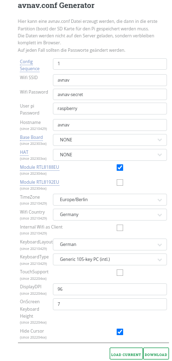
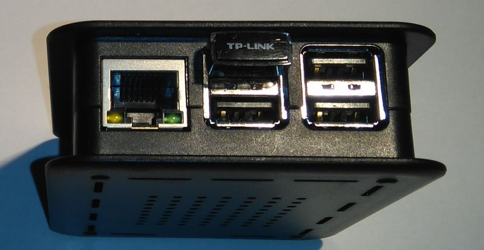
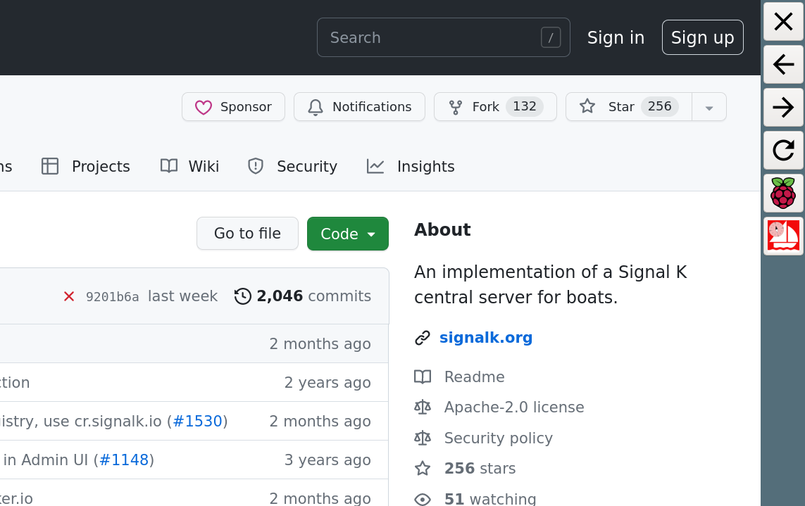
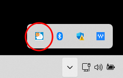
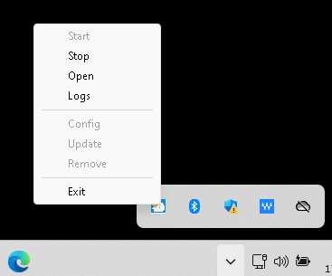
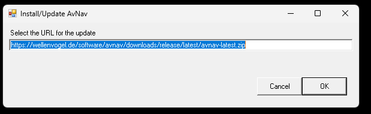
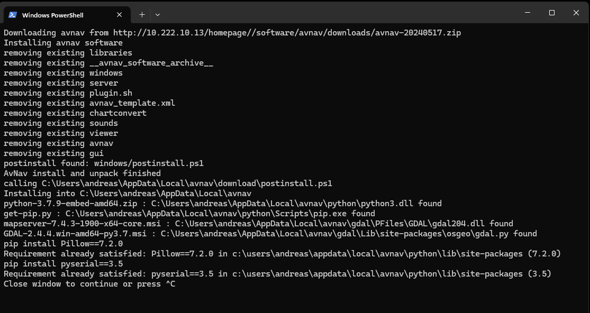

Avnav Installation


AvNav Installation
==================

Software Versionen
------------------

Eine Beschreibung der Versionen und Links zu den Downloads finden sich im
[Release Dokument](release.md).

Für Eilige ist hier der Link zum [aktuellen
Image](https://github.com/free-x/AvNav-Image), zu den [Entwickler-Versionen](../downloads/daily)
und zu den [Release-Downloads](../downloads/release).

Um den Start zu vereinfachen, gibt es fertige Images für den Raspberry
Pi. Ab Version 20220421 unterstützen die Images sowohl den sogenannten
"headless" Betrieb - d.h. es ist weder Tastatur noch Monitor am Pi
angeschlossen, als auch einen Betrieb mit einem angeschlossenen (Touch-)
Bildschirm (gerne auch optional Tastatur und Maus).

AvNav ist von der Bedienung für Touch-Geräte optimiert - aber man kann es
natürlich auch mit Bildschirm, Tastatur und Maus bedienen.

Wie man die Images nutzt, hängt also vom Anwendungsfall ab. Im "headless"
Betrieb wird der Raspberry nur als Server eingesetzt, die Anzeige erfolgt
dann z.B. auf Mobilgeräten. Für diesen Fall reicht ein Raspberry Pi 3B(+).
Wenn ein Monitor und Peripherie wie Tastatur und Maus direkt an den
Raspberry angeschlossen werden, sollte man einen Pi4 oder Pi5 mit
mindestens 2GB Speicher wählen.

Wenn man ein komplettes Desktop-System mit vielen weiteren Anwendungen
haben möchte, kann die [OpenPlotter](#openplotter)-Variante
eine gute Basis sein. Dafür empfiehlt sich ein Pi4 oder Pi5 mit 4GB
Speicher. Auch 2GB Arbeitsspeicher wird ausreichen - dann bleibt aber
nicht viel Raum für zukünftige Anforderungen.

Die früher vorhandenen speziellen AvNav Touch Images werden leider nicht
mehr weiter gepflegt.

AvNav Images(vormals HeadlessImages) {: #Headless}
--------------------------------------------------

Diese Images werden von [BlackSea](https://www.segeln-forum.de/cms/user/27970-blacksea/)
gepflegt (vielen Dank...). Diese werden mit pi-gen gebaut und enthalten
AvNav, SignalK und weitere Software. Eine Beschreibung findet sich im [Repository](https://github.com/free-x/AvNav-Image).

Unter Windows/Linux/OSx lädt man das Image [von
free-x](https://github.com/free-x/AvNav-Image) herunter und transferiert es z.B. mit dem [raspi-imager](https://www.raspberrypi.com/documentation/computers/getting-started.md#raspberry-pi-imager) 
auf eine SD Karte.  
Beim Imager dazu unter "CHOOSE OS" "Use Custom" auswählen und die img
Datei selektieren. Keine "customizations" wählen.

Diese Images enthalten

* avnav
* avnav-raspi
* [avnav-update-plugin](https://github.com/wellenvogel/avnav-update-plugin)
* [avnav-ocharts-plugin](hints/ocharts.md)
* [avnav-mapproxy-plugin](https://github.com/wellenvogel/avnav-mapproxy-plugin)
* [avnav-history-plugin](https://github.com/wellenvogel/avnav-history-plugin)
* [SignalK](hints/CanboatAndSignalk.md)
* [Canboat](hints/CanboatAndSignalk.md)
* Support for [MCS](https://www.gedad.de/projekte/projekte-f%C3%BCr-privat/gedad-marine-control-server/)
* optional einen X-Server mit openbox und firefox im Kiosk Modus
* Unterstützung für verschiedene [HATs](#configHATS)

Die Images sind so vorkonfiguriert, dass NMEA0183-Daten von allen Interfaces
zu AvNav und von dort zu [SignalK](hints/CanboatAndSignalk.md)
geleitet werden. AvNav holt sich zusätzlich alle Daten von SignalK und kann
diese anzeigen. Für Details zur SignalK-Integration siehe die [Beschreibung](hints/CanboatAndSignalk.md#SignalK).  
NMEA2000-Daten laufen über Canboat zu SignalK und zu AvNav.  
Für Details zu Canboat siehe [CanBoatAndSignalK](hints/CanboatAndSignalk.md).

### Image Vorbereitung {: #preparation}

neu ab Version "20210322", erweitert ab Version "20220421"

Bevor die fertig vorbereitete SD-Karte im Raspberry verwendet wird,
sollte man einige Einstellungen anpassen. Das gilt vor allem für
Passwörter:  
Die Images haben eine Konfigurationsdatei "avnav.conf". Sie findet sich in
der ersten Partition der SD-Karte (Boot-Partition). Diese Datei kann mit
einem Texteditor angepasst werden.  
Dort kann auch eingestellt werden, ob ein lokaler Bildschirm genutzt
werden soll ("Touch Variante")

Einfacher geht es mit einer kleinen Web-Oberfläche [hier](../configGen/index.md).

[](../configGen/index.md)

Die Bedeutung der Felder:

|  |  |  |
| --- | --- | --- |
| Name | Default | Beschreibung |
| ConfigSequence | 1 | Wenn man erreichen möchte, dass die Einstellungen aus avnav.conf noch einmal neu im System aktiviert werden sollen, kann man diesen Wert erhöhen. AvNav merkt sich sonst, welche Einstellungen bereits aufgesetzt wurden, und setzt diese nicht erneut. |
| Wifi SSID | avnav | Der Name des WLAN-Netzwerks, das der Raspberry erzeugen soll. Die Images sind so vorbereitet, dass man durch Einstecken von WLAN-Adaptern auch weitere Netzwerke erzeugen kann. Daher wird eine einstellige Nummer an den Namen angefügt. |
| Wifi Password | avnav-secret | Das Passwort für das WLAN-Netzwerk. Das sollte in jedem Falle geändert werden. Jeder, der sich mit dem WLAN verbinden kann, kann damit auch die Navigation beeinflussen! |
| User pi password | raspberry | Das ist das Passwort für den Nutzer "pi". Dieser Standard- User wird genutzt, wenn man sich per SSH verbindet oder wenn man direkt per Monitor und Tastatur auf den Raspberry zugreift. Das Passwort für den User "pi" sollte ebenfalls unbedingt geändert werden. |
| Base Board | None | Hier kann man aus unterstützten Basis-Platinen wählen.   * **MCS:** Wenn diese Option aktiviert ist, wird beim   nächsten Bootvorgang die notwendige Software für den [Marine   Control Server von GeDad](https://www.gedad.de/projekte/projekte-f%C3%BCr-privat/gedad-marine-control-server/) aktiviert. Die Änderung der   Einstellung führt dann zu einem automatischen Reboot, wenn der   Raspberry das erste Mal mit dieser Einstellung startet. * **OBPPLOTTERV3:** Hiermit werden die Einstellungen für den   [Open   Boat Projects Plotter (V3)](https://open-boat-projects.org/de/10-plotter-raspi-4b) gesetzt. |
| HAT | None | Hier kann man einen unterstützten Pi-HAT auswählen. AvNav wird die entsprechenden Einträge für die Overlays in /boot/config.txt machen und die CAN Netzwerk-Schnittstellen anlegen.   * WAVESHAREB: [Waveshare   RS485 CAN HAT (B)](https://www.waveshare.com/wiki/RS485_CAN_HAT_%28B%29) * WAVESHAREA8: [Waveshare   RS485 CAN HAT (8Mhz)](https://www.waveshare.com/wiki/RS485_CAN_HAT) * WAVESHAREA12: [Waveshare   RS485 CAN HAT (12 Mhz)](https://www.waveshare.com/wiki/RS485_CAN_HAT) * WAVESHARE2CH: [Waveshare   2CH CAN HAT](https://www.waveshare.com/wiki/2-CH_CAN_HAT) * PICANM: [PICAN-M](https://cdn.shopify.com/s/files/1/0563/2029/5107/files/pican-m_UGB_20.pdf?v=1619008196) * MCARTHUR: [MacArthur   HAT](https://github.com/OpenMarine/MacArthur-HAT) |
| Module RTL8188EU | aus | Wenn eingeschaltet, wird der [Kernel-Treiber](https://github.com/lwfinger/rtl8188eu/tree/v5.2.2.4) für WLAN-Adapter mit dem Chipsatz RTL8188EU per [DKMS](https://manpages.debian.org/unstable/dkms/dkms.8.en.md) eingerichtet.  Wenn der Kernel des Systems aktualisiert wird (Kommandozeile), wird der Treiber neu übersetzt.  Bisher nicht für Bookworm-Images verfügbar, da es diese Treiber nicht gibt. |
| Module RTL8192EU | aus | Wenn eingeschaltet, wird der [Kernel Treiber](https://github.com/Mange/rtl8192eu-linux-driver) für WLAN-Adapter mit dem Chipsatz RTL8192EU per [DKMS](https://manpages.debian.org/unstable/dkms/dkms.8.en.md) eingerichtet.  Wenn der Kernel des Systems aktualisiert wird (Kommandozeile), wird der Treiber neu übersetzt.  Bisher nicht für Bookworm-Images verfügbar, da es diese Treiber nicht gibt. |
| TimeZone | Europe/Berlin | Die Zeitzone, die im Image genutzt werden soll. |
| WifiCountry | Germany | Das Land (muss für den Wifi Adapter aus rechtlichen Gründen gesetzt werden) |
| InternalWifi as Client | aus | Wenn eingeschaltet, wird der interne Wifi Adapter des Pi nicht als Access Point definiert, sondern kann sich mit anderen Netzwerken verbinden.  Achtung: Das erfordert eine andere Möglichkeit, um auf den Pi zugreifen zu können - siehe [[Verbinden mit dem Raspberry](#access)]. |
| KeyboardLayout | German | Layout für eine angeschlossene Tastatur (Kommandozeile und X) |
| KeyboardType | Generic 105-key PC(intl.) | Typ der angeschlossenen Tastatur |
| TouchSupport  (ab 20220421) | aus | Wenn eingeschaltet, startet ein X-Server mit einem Firefox Browser im Kiosk Modus. Über einen Button in AvNav kann auf einen anderen "Bildschirm" gewechselt werden, über den File Manager, Terminal u.ä. verfügbar sind. |
| Display DPI  (ab 20220421) | 96 | Nur für den lokalen Bilschirm.  Die Auflösung in dots/inch für das angeschlossene Display. Beim Klick öffnet sich ein kleiner Rechner, in dem die Abmessungen des Bildschirmes in mm und Pixel angegeben werden können, daraus wird der DPI-Wert berechnet.  Basierend auf diesem Wert werden einige Anzeige-Elemente skaliert. |
| OnScreen KeyboardHeight  (ab 20220421) | 7 | Die Höhe einer Tastenzeile beim angezeigten OnScreen Keyboard. Bei korrekter DPI-Einstellung sollte dieser Wert ein guter Kompromiss sein.  Wenn man den Wert sehr groß wählt, bleibt u.U. bei angezeigter Tastatur nicht mehr genug Bildschirmfläche... |
| HideCursor  (ab 20220421) | an | Verbergen des Cursors auf dem lokalen Bildschirm. Wenn mit einer Maus gearbeitet werden soll, muss dieser Schalter auf "aus" gesetzt werden. |

Nach dem Eintragen der Werte kann man durch Klick auf den
"download"-Button die "avnav.conf"-Datei herunterladen. Diese muss in die
erste Partition der SD-Karte gespeichert werden. Eine eventuell dort
vorhandene Beispieldatei muss überschrieben werden! Diese Partition muss
dazu natürlich auf dem Computer sichtbar sein. Unter Windows wird man in
der Regel nur die erste Partition sehen können. Eventuell muss man dazu
nach dem Schreiben des Images die SD-Karte noch einmal enfernen und wieder
einstecken.

Es empfiehlt sich daher, die "avnav.conf"-Date noch einmal an einem
sicheren Platz zu speichern, um sie ggf. beim Erzeugen einer neuen
SD-Karte wiederverwenden zu können.

Nun kann man die SD-Karte in den Raspberry stecken und ihn starten. Der
erste Boot kann einige Zeit dauern, da das gesamte Dateisystem auf der
SD-Karte erzeugt werden muss. Je nach den Einstellungen in der
Konfiguration wird der Raspberry noch ein weiteres Mal neu starten.

Wenn der Raspberry seine Systemeinrichtung endgültig abgeschlossen hat,
kann man sich mit ihm verbinden.

### Verbinden mit dem Raspberry Pi {: #access}

Wenn das Image für einen lokalen Bildschirm konfiguriert wurde, kann man
natürlich direkt mit einem angeschlossenen Bildschirm, ggf. noch Tastatur
und Maus arbeiten.

Allerdings sollte man auch diesem Falle eine der hier im Folgenden
beschriebenen Verbindungen vorbereiten - die braucht man eventuell in
Fehlersituationen.

Prinzipiell kann man sich auf mehrere Arten mit dem Raspberry verbinden:

1. per Ethernet-Kabel  
   Das geht entweder durch Anschluss an einen einen Router oder Switch oder
   über eine einfache Verbindung z.B. direkt zu einem Laptop.
2. per internem WLAN  
   Standardmässig macht der Pi einen Access-Point mit der in der
   Konfiguration gewählten SSID auf. Er hängt dort jeweils noch eine Nummer
   an (falls man weitere WLAN-Adapter anschliesst, kann man auch mehrere
   Access Points erzeugen).
3. per USB von einem Android Gerät  
   Moderne Android-Geräte haben meist eine "USB-Tethering" Funktion, über
   die man das WLAN oder die Mobilfunk-Verbindung per USB weitergeben kann
   (leider meist nur Geräte mit Mobilfunk).   
   Über diesen Weg kann man sich auch mit dem Pi verbinden.
4. Über ein anderes WLAN.  
   Das erfordert aber zunächst eine der anderen Verbindungsmöglichkeiten,
   da man die Zugangsdaten einstellen muss. Außerdem erfordert es einen
   zusätzlichen WLAN Adapter, der in eine bestimmte USB-Buchse gesteckt
   werden muss (außer man hat in der Konfiguration "Internal Wifi as
   Client" gewählt).

#### Verbindung per Ethernet-Kabel

Wenn man den Pi mit einem Router verbindet (z.B. im Heimnetz), dann
erhält er von diesem eine IP-Adresse. Über diese Adresse kann man sich mit
dem Pi verbinden.  
Da es oft mühsam ist, diese Adresse herauszufinden, macht sich der Pi im
Netz per [mDNS](https://en.wikipedia.org/wiki/Multicast_DNS)
(Bonjour, Avahi) bekannt.  
Auf diese Weise kann man sich z.B. mit einem Browser einfach zu AvNav
verbinden:

```
http://xxxx.local:8080
```

xxx ist dabei der in der Image-Konfiguration gewählte Hostname.  
Auch ein Zugang per SSH (unter Windows z.B. per [putty](https://www.chiark.greenend.org.uk/%7Esgtatham/putty/))
íst auf diese Weise möglich - das Zugangs-Passwort für den Nutzer pi wurde
bereits in der Image-Konfiguration gesetzt.

Falls man sich mit einem Netzwerkkabel direkt z.B. mit einem Laptop
verbindet, wird der Pi nach einiger Zeit selbständig eine IP-Adresse
aufsetzen. Das kann 1...2 Minuten dauern. Diese gehört zum sogenannten
Automatic Private IP Addressing-Bereich 169.254.x.x. Die meisten Desktop
Systeme unterstützen das ebenfalls (unter Linux muss man es ggf. explizit
anschalten).   
Wenn also der Laptop auch auf seinem Ethernet Interface eine solche
Adresse aufgesetzt hat, sollte eine Verbindung wie beschrieben per
xxxx.local funktionieren.

Falls der Zugriff über die xxx.local Adresse nicht funktionieren sollte,
muss man versuchen, die IP-Adresse des Pi zu ermitteln (z.B. in der
Administration des heimischen Routers).

#### Verbindung über das eingebaute WLAN {: #connect-wifi}

Man kann das WLAN-Netzwerk verwenden, das der Raspberry erzeugt hat. Die
SSID und das Passwort wurden wie oben beschrieben in der Datei
"avnav.conf" definiert (mit noch einer angehängten Nummer).

Auch hier steht man vor dem Problem, zunächst die IP-Adresse des Pi
herauszufinden. Wie schon beim Ethernet-Zugang beschrieben, sollte auch
hier der Zugriff per mDNS funktionieren.

```
http://xxx.local
```

Falls das nicht funktioniert, kann man es mit den festen IP-Adressen
192.168.30.10, 192.168.40.10, 192.168.50.10, 192.168.60.10 versuchen:

```
http://192.168.30.10
```

Das sollte die [Hauptseite](userdoc/index.md) von AvNav
laden. Es sollte auch möglich sein, xxxx.local zu benutzen, wenn man sich
mit dem Raspberry per SSH verbinden will (z.B. [putty](https://www.putty.org/)
unter Windows).

Eine Einschränkung bleibt: Leider funktioniert xxx.local nicht auf
Android-Geräten. Daher empfehle ich, dort ein Tool zu nutzen, das mDNS
nutzen kann - einen [BonjourBrowser](https://play.google.com/store/apps/details?id=de.wellenvogel.bonjourbrowser) . Für IOS gibt es ein  [vergleichbares
Tool](https://apps.apple.com/us/app/bonjour-search-for-http-web-in-wi-fi/id1097517829) - auch wenn dort der Eintrag "xxx.local" im Browser
funktioniert. Man wird seinen Raspberry mit dem AvNav-Image in den
Browsern unter dem Namen "avnav-server" finden. Typischerweise wird man
noch einen zweiten Eintrag "avnav" sehen - dahinter verbirgt sich der [SignalK](hints/CanboatAndSignalk.md)-Server auf dem
Raspberry.  
Wenn man seinen Raspberry im Bonjour-Browser sehen kann, der Aufruf der
Seite dann aber fehlschlägt, kann es an einer Besonderheit von Android
liegen, wenn zusätzlich z.B. per Mobilfunk eine Internet-Verbindung aktiv
ist. In diesem Falle sollte man mobile Daten zeitweilig abschalten.

Ab der Version 1.12 unterstützt die Android BonjourBrowser App auch SSH.
Das AvNav Image (ab 20220421) macht auch seinen SSH Zugang per mDNS
bekannt. Wenn man unter Android dann noch einen passenden SSh Client
installiert (beispielsweise [JuiceSSH](https://play.google.com/store/apps/details?id=com.sonelli.juicessh&hl=de&gl=US)),
kann man sich auf diese Weise auch per SSH mit dem Pi verbinden. Das ist
für ein normales Arbeiten meist nicht so komfortabel - aber für den
Notfall kann man so ein paar Kommandos eingeben.

Wenn man sich per SSH verbindet, ist der Nutzername "pi". Das
Nutzer-Passwort wurde in der Datei "avnav.conf" (hoffentlich) gesetzt. .  

Wenn das in der Konfiguration gesetzte Passwort nicht funktioniert, kann
man noch einmal das Default-Passwort versuchen. Es lautet "raspberry".
Eventuell wurde die avnav.conf zuvor nicht korrekt gespeichert.  
Eine Root-Shell kann man mit sudo -i erhalten.

#### Verbindung von Android über USB {: #connect-usb}

Dazu benötigt man ein Android-Gerät, das USB Tethering unterstützt (meist
bei den Verbindungseinstellungen). Nachdem man das Gerät per USB mit dem
Pi verbunden hat, muss man das USB Tethering einschalten (wird meist
automatisch wieder ausgeschaltet, wenn man die Verbindung trennt).  
Neben der Möglichkeit, den Pi so mit dem Internet zu verbinden, kann man
auch auf den Pi mit dem Browser oder per SSH zugreifen. Da auch wieder die
Ermittlung der IP-Adresse erfolgen muss, empfehle ich wieder die [Bonjour
Browser App](https://play.google.com/store/apps/details?id=de.wellenvogel.bonjourbrowser) zu installieren - siehe unter [WLAN](#connect-wifi).
Für SSH-Zugriffe ebenfalls wieder [JuiceSSH](https://play.google.com/store/apps/details?id=com.sonelli.juicessh&hl=de&gl=US).

Über diesen Weg kann man auch auf den Pi zugreifen, falls z.B. das WLAN
nicht funktioniert. Im BonjourBrowser wird man 2 http:-Adressen finden
(Port 8080 für AvNav und Port 3000 für SignalK), dazu (ab 20220421) noch
einen SSH Zugang.

#### Verbindung über ein anderes WLAN {: #connect-clientwifi}

Wenn man wie unten beschrieben eine WLAN-Verbindung zu einem anderen
Netzwerk eingerichtet hat (erfordert einen WLAN Stick oder Umschaltung des
internen WLANs auf Client), kann man den Zugriff auf den Pi über dieses
Netzwerk freigeben ("external access" beim Aufsetzen).

Das sollte man aber nur in einem geschützten Netzwerk tun (z.B. das Netz
eines eigenen LTE Routers). **Auf keinen Fall sollte man das in einem
öffentlichen WLAN erlauben - der Zugriff ist nicht geschützt und
prinzipiell kann jeder aus dem Netz auf den Pi zugreifen**.

Wenn man mit dem client-Netzwerk verbunden ist, kann man wieder wie unter
[WLAN](#connect-wifi) beschrieben auf den Pi zugreifen.

### Pi mit dem Internet verbinden

Für einige Funktionen (z.B. Update von Software) benötigt der Pi eine
Internet-Verbindung. Diese wird natürlich nicht für die grundlegenden
Navigationsfunktionen benötigt.

Vor der Image-Version 20220421 ist dabei zu beachten, dass der Pi seine
Systemzeit nicht automatisch einstellt, solange kein GPS angeschlossen
ist. Das kann bei vielen Internet-Zugriffen zu Problemen führen.   
Ab der Version 20220421 synchronisiert der Pi nach einer Wartezeit
automatisch seine Systemzeit mit dem Netz (ntp).

Für die Verbindung zum Internet gibt es die folgenden Möglichkeiten:

1. Ethernet-Verbindung zu einem Router
2. Verbindung über ein anderes WLAN
3. Verbindung über ein per USB angeschlossenes Android-Gerät

Der Pi stellt seine Internet-Verbindung grundsätzlich über sein eigenes
WLAN auch verbundenen Geräten zur Verfügung.

#### Verbindung über Ethernet Kabel

Hier wird der Pi über ein Ethernet-Kabel an einen Router angeschlossen.  
Dazu ist auf dem Pi nichts weiter einzurichten, das sollte automatisch
gehen.  
Auf einigen Pi3 kann es vorkommen, dass ein Netzwerkkabel, das erst nach
dem Bootvorgng angeschlossen wird, nicht richtig erkannt wird. In diesem
Falle den Pi mit angeschlossenem Netzwerkkabel neu starten.

#### Verbindung über ein anderes WLAN

Dazu wird ein weiterer WLAN-Adapter (USB-Adapter) benötigt. Bitte vorher
die Kompatibilität mit dem Pi prüfen - z.B. [hier](https://elinux.org/RPi_USB_Wi-Fi_Adapters).

Der Stick muss wie im Bild gesteckt sein (auf dem Pi4/Pi5 die blaue USB
Buchse an der Platinen-Seite).   
Der interne Name des Netzwerk-Interfaces ist wlan-av1.



Alternativ kann in der Image-Konfiguration "InternalWifi as Client"
gesetzt werden, damit wird der interne WLAN Adapter für die Verbindung zu
anderen Netzten verfügbar. Dann benötigt man aber einen anderen Zugriff
zum Verbinden mit dem Pi, da er keinen Access Point mehr aufmacht.

Man kann die Verbindung zu einem WLAN in der [App](userdoc/wpapage.md)
konfigurieren.  
Bei jedem WLAN, mit dem man sich verbindet, kann man auswählen, ob ein
Zugriff auf den Pi von außen möglich sein soll ("external access"). Wenn
das nicht ausgewählt ist, kann über dieses WLAN nicht auf AvNav
zugegriffen werden. Bitte die [Hinweise zum
Zugriff](#connect-clientwifi) beachten.

#### Verbindung über ein per USB angeschlossenes Android Gerät

Wie bereits beim [Zugriff](#connect-usb) beschrieben, kann
man ein Android-Gerät mit USB Tethering verbinden. Intern ensteht ein
Netzwerkinterface usb0.  
Darüber kann der Pi ebenfalls auf das Internet zugreifen.

Das kann eine einfache Möglichkeit sein, wenn man den Zugriff nur
temporär braucht und keinen zusätzlichen WLAN-Adapter zur Verfügung hat.  
Falls man vorher anders mit dem Internet verbunden war, kann es sein, dass
der Pi die USB-Verbindung erst nach einem Neustart wirklich nutzt
(Achtung: USB Tethering auf dem Android-Gerät wieder einschalten, wird
beim Pi-Neustart normalerweise ausgeschaltet).

### Technische Details

Der Raspberry wird ein (oder mehrere) WLAN-Netzwerke aufsetzen, eines mit
dem internen Adapter und weitere mit potenziell gesteckten WLAN-Sticks.
Diese Netzwerke haben die Adressen:192.168.20.0/24, 192.168.30.0/24,
192.168.40.0/24, 192.168.50.0/24. Der Raspberry selbst hat dabei jeweils
die Adresse 192.168.x.10.

Auf dem Raspberry wird dazu ein DHCP-Server und ein DNS-Server
eingerichtet (dnsmasqd).

Wenn der Raspberry über ein Ethernet-Kabel verbunden wird, versucht er
per DHCP eine Adresse aus dem Netzwerk zu erhalten. Er setzt dann eine
NAT-Weiterleitung aus seinem WLAN-Netz zum Ethernet auf. So kann z.B. eine
Internetverbindung aufgebaut werden, während man in das WLAN des Raspberry
eingewählt ist.

Für die meisten Aktionen sollte ein Kommandozeilen-Zugang jedoch nicht
erforderlich sein. Für Updates nutzt man das bereits vorinstallierte [Update-Plugin](https://github.com/wellenvogel/avnav-update-plugin).
Die Server-Konfiguration kann innerhalb der App auf der [Server/Status](userdoc/statuspage.md)-Seite
vorgenommen werden.

Image mit Bildschirm {: #Touch}
-------------------------------

In früheren Versionen gab es ein eigenes AvNav Touch Image.  
Dieses wird jedoch nicht mehr weiter gepflegt.  
Ab der Version 20220421 wurde daher der Support für einen direkt
angeschlossenen Bildschirm (mit dem Schwerpunkt touch) in die AvNav Images
integriert.

Wie unter [Vorbereitung](#preparation) beschrieben, kann man
die Unterstützung für einen Bildschirm dort aktivieren.  
Wenn die Bildschirm-Unterstützung eingeschaltet wurde, startet ein service
"avnav-startx". Dieser erzeugt einen lokalen X Server, eine Nutzer-Sitzung
für den Nutzer pi mit [openbox](https://openbox.org/help/Contents)
als Fenster-Manager und Firefox im Kiosk Mode.

Als Bildschirm-Tastatur (On Screen Keyboard) wird [onboard](http://manpages.ubuntu.com/manpages/bionic/man1/onboard.1.md)
verwendet.

Auf der AvNav-Hauptseite (und auf einigen anderen Seiten) wird ein
"Raspberry" Button angezeigt, mit diesem wechselt man auf einen zweiten
virtuellen Bildschirm, auf dem man einen Dateimanager, ein Terminal und
verschiedene weitere Tools findet.  
Das System ist ganz bewusst nicht als ein komplettes Desktop-System
ausgelegt, um möglichst ressourcenschonend zu arbeiten.

Da man an die Systemtools nur über den Button in der AvNav App
herankommt, ist es sinnvoll, sich einen weiteren Zugang zum Pi wie weiter
oben beschrieben zuzulegen.  
Damit kann man im Fehlerfall auf das System zugreifen.  
Ein Restart der Nutzeroberfläche von der Kommandozeile kann mit

```
sudo systemctl restart avnav-startx
```

erfolgen.  
Falls Firefox einmal nicht mehr richtig starten möchte, kann man das
Nutzerprofil entfernen. Das wird beim nächsten Start automatisch neu
angelegt.  
**Achtung**: AvNav-Einstellungen, die nicht auf dem Server gespeichert
wurden, gehen dabei verloren.

```
sudo systemctl stop avnav-startx  
rm -rf /home/pi/.mozilla/firefox/avnav  
sudo systemctl start avnav-startx
```

Ab Version 20230614 wird auf dem Hauptbildschirm immer dann, wen AvNav
nicht (oder nicht komplett) aktiv ist, ein zusätzliches Panel angezeigt.



Über dieses Panel können einige Navigationsfunktionen in Firefox
gesteuert werden, es kann zum 2. Bildschirm (system) gewechselt werden -
und man kann die (oben beschriebene) Reset-Funktion für das
Firefox-Nutzerprofil ausführen ().

Damit ist eine Bedienung des Systems auch möglich, wenn AvNav wider
Erwarten nicht komplett startet. Die Reset-Funktion findet sich auch auf
dem System-Bildschirm (allerdings nur für komplette Neu-Installationen).

Paket Installation {: #Packages}
--------------------------------

### Repositories

Dank Oleg gibt es  fertige Paket-Repositories, die man in sein
Debian-Linux einbinden kann. Das geht auf dem Raspberry Pi - aber auch auf
jeder anderen Debian-Variante (z.B. Ubuntu).   

Die Paketquellen bindet man wie folgt ein. Das ist nur nötig, wenn man
nicht das AvNav-Image nutzt.

Debian Buster (amd64,armhf,arm64)

```
wget https://www.free-x.de/debian/oss.boating.gpg.key
sudo apt-key add oss.boating.gpg.key
wget https://www.free-x.de/debian/boating-buster.list
sudo cp boating-buster.list /etc/apt/sources.list.d/
```

Debian Bullseye (amd64,armhf,arm64)

```
wget -O - https://www.free-x.de/debian/oss.boating.gpg.key | gpg --dearmor | sudo tee /usr/share/keyrings/oss.boating.gpg
echo "deb [signed-by=/usr/share/keyrings/oss.boating.gpg] https://www.free-x.de/debian bullseye main contrib non-free" | sudo tee -a /etc/apt/sources.list.d/boating.list
```

Debian Bookworm (amd64,armhf,arm64)

```
wget -O - https://www.free-x.de/debian/oss.boating.gpg.key | gpg --dearmor | sudo tee /usr/share/keyrings/oss.boating.gpg
echo "deb [signed-by=/usr/share/keyrings/oss.boating.gpg] https://www.free-x.de/debian bookworm main contrib non-free" | sudo tee -a /etc/apt/sources.list.d/boating.list
```

Debian Trixie (amd64,armhf,arm64)

```
wget -O - https://www.free-x.de/debian/oss.boating.gpg.key | gpg --dearmor | sudo tee /usr/share/keyrings/oss.boating.gpg
echo -e "Types: deb\nURIs: https://www.free-x.de/debian\nSuites: trixie\nComponents: main\nSigned-By: /usr/share/keyrings/oss.boating.gpg" | sudo tee -a /etc/apt/sources.list.d/boating.sources
```

Ubuntu Jammy (amd64)

```
wget -O - https://www.free-x.de/ubuntu/oss.boating.gpg.key | gpg --dearmor | sudo tee /usr/share/keyrings/oss.boating.gpg
echo "deb [signed-by=/usr/share/keyrings/oss.boating.gpg] https://www.free-x.de/ubuntu jammy main" | sudo tee -a /etc/apt/sources.list.d/boating.list
```

Ubuntu Noble (amd64,arm64)

```
wget -O - https://www.free-x.de/ubuntu/oss.boating.gpg.key | gpg --dearmor | sudo tee /usr/share/keyrings/oss.boating.gpg
echo "deb [signed-by=/usr/share/keyrings/oss.boating.gpg] https://www.free-x.de/ubuntu noble main" | sudo tee -a /etc/apt/sources.list.d/boating.list
```

Für die Installation auf einem Linux System muss man nach Einbindung der
Paketquellen die folgenden Schritte ausführen:

```
sudo apt update
sudo apt install avnav
```
  

### Startup

Danach kann man als beliebiger Nutzer mit dem Kommando  
```
avnav
```
den Server starten.  
Mit   
```
sudo systemctl enable avnav
sudo systemctl start avnav
```

kann man AvNav mit dem Benutzer "avnav" automatisch beim Systemstart
aktivieren.

### User Service {: #userservice}

Ab 20240520 kann man AvNav als ein [user
systemd service](https://wiki.archlinux.org/title/Systemd/User) für den eigenen Nutzer automatisch starten lassen.
Um diesen Service zu aktivieren, ruft man

```
avnavservice enable [port]
```

auf. Der Service startet automatisch, wenn sich der Nutzer einloggt, und
stoppt, wenn er sich abmeldet. Um den Service bereits beim Systemstart zu
aktivieren, muss man den "linger" mode für den Nutzer setzen:

```
loginctl enable-linger
```

Für Details siehe die [systemd
Dokumentation](https://wiki.archlinux.org/title/Systemd/User).

Um den Status zu prüfen, nutzt man

```
systemctl --user status avnav
```

AvNav nutzt das (default) Datenverzeichnis $HOME/avnav.

Um den Service wieder zu deaktivieren, nutzt man

```
avnavservice disable
```

### Download

Alternativ kann man auch die Debian-Pakete direkt von der Download-Seite
herunterladen:  

* [Releases](../downloads/release "downloads/releases")
* [Tägliche Builds](../downloads/daily)

Nach dem Herunterladen kann man die Pakete auf einem Raspberry Pi mit

```
sudo apt install ./avnav_xxxxxxxx_all.deb
```
installieren.  

Falls man sein Raspberry Pi-System vergleichbar zu unseren Images
aufsetzen möchte, kann man dazu noch das "avnav-raspi"-Paket installieren.  
Das ändert die Netzwerk-Konfiguration so , wie AvNav das möchte, sorgt
dafür, dass AvNav unter dem Nutzer "pi" startet, und aktiviert das
Einstellen der Systemzeit sowie das Verwalten von WLAN Client-Netzwerken.

Ich würde in jedem Fall empfehlen, das [AvNav
Update-Plugin](https://github.com/wellenvogel/avnav-update-plugin) zu installieren - aus dem Paket Repository mit
```
sudo apt-get install avnav-update-plugin
```

oder mittels Download von  [GitHub.](https://github.com/wellenvogel/avnav-update-plugin)  
**Hinweis**: Die Start/Stop-Funktionen im Update-Plugin funktionieren
(noch) nicht mit einem AvNav, das als systemd user Service gestartet
wurde. Das ist aber kein Problem, da man AvNav auch aus der App selbst
restarten kann.

Wenn man nicht das "avnav-raspi"-Paket installiert, aber AvNav mit einem
anderen Nutzer als "avnav" - also z.B. dem Nutzer pi starten möchte, 
sollte man wie beschrieben den Start als systemd user Service nutzen.

Man kann dann als Nutzer "pi" AvNav einfach von der Kommandozeile starten
lassen.  

Wenn man AvNav als systemweiten Service mit einem anderen Nutzer laufen
lassen möchte, kann man auch folgende Schritte abarbeiten:

```
/usr/lib/systemd/system/avnav.service.d
```
anlegen und dort die Datei anvav.conf mit folgendem Inhalt anlegen:
```
#Overrides for the avnav service
[Service]
User=pi
ExecStart=
ExecStart=/usr/bin/avnav -q -b /home/pi/avnav/data -t /usr/lib/avnav/avnav_template.xml -n /etc/default/avnav
[Unit]
After=avnav-check-parts.service
```
Danach kann man mit den Kommandos
```
sudo systemctl daemon-reload  
sudo systemctl enable avnav  
sudo systemctl start avnav
```

Avnav als Systemdienst starten. Wenn man diese Datei nicht
anlegt/kopiert, wird AvNav nicht mit den Nutzer "pi", sondern mit dem
Nutzer "avnav" arbeiten.

OpenPlotter
-----------

Für [OpenPlotter](https://openmarine.net/openplotter) gibt es
eine komplette Integration von AvNav (Dank an [e-sailing](https://github.com/e-sailing)).
Im Repository <https://www.free-x.de/deb4op/>
, das bereits standardmäßig mit OpenPlotter 2 (und 3) kommt, sind die
notwendigen Pakete bereits vorhanden. Somit kann man sie einfach
installieren:

```
sudo apt update
sudo apt install openplotter-avnav
```

Seit 2021/03 ist AvNav offiziell in OpenPlotter verfügbar. So sollte nach
einem Update von OpenPlotter "openplotter-avnav" bereits verfügbar sein.

Das Paket "avnav-raspi\_xxx.deb" sollte man auf OpenPlotter nicht
installieren, weil es sich nicht mit den Netzwerkeinstellungen von
OpenPlotter verträgt. Innerhalb der OpenPlotter-AvNav-Konfiguration kann
man den HTTP-Port für AvNav ändern, wenn es Probleme mit anderen Apps
geben sollte. Die Defaultwerte sind: :8080 für den Browserzugriff, :8082
für ocharts.

Wenn man AvNav mit der OpenPlotter-App installiert, empfängt AvNav alle
NMEA-Daten von SignalK und sucht nicht selbst nach USB-Geräten. Alle
Geräte-Konfigurationen oder Schnittstellen-Einrichtungen können so direkt
in OpenPlotter und SignalK vorgenommen werden.

Windows {: #Windows}
--------------------

Für Windows gibt es einen Installer (neu ab 20240520). Die aktuelle
Version zum Download findet man [hier](../downloads/release/latest/avnav-service-latest.exe).
Dieser Installer erzeugt eine App "avnavservice" die (als default)
automatisch startet(User autostart). Dieser Service erzeugt eine
Notifikation (Icon), die bei Klick ein Menü mit den wichtigsten Funktionen
zeigt. Dieser Service enhält noch nicht die eigentliche AvNav-Software
(oder die notwendigen Python Pakete). Aber über das Menü können diese
installiert werden.  
Für eine Deinstallation von avnavservice bitte die Systemsteuerung nutzen.





Das Service-Menü hat die folgenden Einträge:

|  |  |
| --- | --- |
| Bezeichnung | Funktion |
| Start | Startet den AvNav Server. Nur aktiv, wenn die AvNav-Software installiert wurde und der Server noch nicht läuft. Der Service merkt sich, ob AvNav gestartet wurde, und wird es beim nächsten Start automatisch wieder starten, wenn nicht zwischenzeitlich "Stop" aktiviert wurde. |
| Stop | Stoppt den AvNav Server. |
| Open | Öffnet den default Browser mit der URL für den AvNav Server. |
| Logs | Öffnet ein Explorer-Fenster im AvNav log-Verzeichnis (PROFILEDIR/AvNav/logs). Dort gibt es das normale avnav.log und zusätzlich die Ausgabe vom Startup(service-err.log).  Um z.B. zur AvNav XML-Konfiguration zu gelangen, muss man nur im Explorer ein Verzeichnis nach oben navigieren. |
| Config | Erlaubt es, den HTTP Port für AvNav zu setzen(default: 8080). |
| Update | Dieser Eintrag ist "Install", wenn die AvNav-Software noch nicht installiert wurde.  Ein Installationsdialog wird geöffnet(siehe [unten](#windowsinstall)). |
| Remove | Entfernt die installierte AvNav-Software (aber alle Nutzerdaten unter PROFILEDIR/AvNav bleiben erhalten).  Vor einer Deinstallation von avnavservice (über Systemsteuerung/Software) sollte das genutzt werden - sonst muss man später das Verzeichnis PROFILEDIR/AppData/Local/avnav per Hand entfernen. |
| Exit | Stoppt AvNav und beendet avnavservice (die Notifikation verschwindet). Um den Service erneut zu starten, nutzt man das Startmenü.  Normalerweise kann man den Service laufen lassen. Wenn der AvNav Server gestoppt ist, werden kaum Systemresourcen verbraucht. Nur nach einer erneuten Installtion von avnavservice muss man diesen einmal stoppen und wieder starten. |

### Installation {: #windowsinstall}

Nach Klick auf Install/Update wird ein kleiner Dialog angezeigt.



Die hier eingetragene URL zeigt auf die aktuelle AvNav-Software. Aber man
kann hier jede URL eingeben, die auf ein aktuelles AvNav-Softwarepaket zeigt
(zip Datei) - z.B. von den [daily](../downloads/daily) oder [release](../downloads/release) Seiten.   

Nach OK wird ein Fenster mit dem Installationsfortschritt angezeigt.



Nachdem man diese Fenster geschlossen hat, kann man den AvNav Server über
"Start" im Menü wieder starten.  

### Windows Hinweise

Der avnavservice erfordert Powershell (>= 5.x) - das sollte auf allen
modernen Windows Systemen verfügbar sein. Wenn die AvNav-Installation in
einen Fehler läuft, kann es sein, dass die neuesten C/C++ Bibliotheken
nicht installiert sind. Diese kann man von [Microsoft](https://learn.microsoft.com/en-us/cpp/windows/latest-supported-vc-redist?view=msvc-170)
herunter laden. Der direkte Link ist normalerweise [hier](https://aka.ms/vs/17/release/vc_redist.x64.exe).

Dieser neue Windows-Service ersetzt die alte AvNavNet-Installation mit
einer eigenen GUI. Releases ab 20240520 sind nicht mehr kompatibel mit der
alten Version. Es wird empfohlen, die alte Installation komplett zu
entfernen, ehe der neue Installer genutzt wird.

Die Karten-Konvertierung ist nun ohnehin komplett in AvNav integriert und
kann so genutzt werden wie in der App-Dokumentation beschrieben.  
Man kann serielle Geräte, die am Windows System angeschlossen sind, ganz
normal benutzen(z.B. einen GPS Stick).

Da der AvNav Server im Hintergrund läuft, kann man ihn zum Beispiel auch
als NMEA-Multiplexer und Logger nutzen.