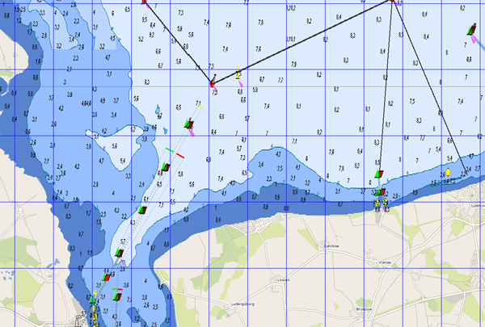

mapsources

Mobile Atlas Creator Mapsources {: #Mobac}
==========================================

2022/04/17  
Anpassungen an mobac 2.2.2

2021/08/22  
Anpassungen an mobac 2.2x, Anpassung an  neue BSH Layer

2020/01/26  
Wieder mal ein paar kleine Modifikationen an den Map-Sources, damit der
Zugriff auf die BSH Server wieder funktioniert.

Sourcen
-------

Für den [Mobile Atlas Creator](https://mobac.sourceforge.io/)
habe ich einige Map-Sources erzeugt, die es erlauben, etwas flexibler per
xml den Zugriff auf Kartendienste zu definieren. Dazu die Datei [avnav-mapsources.zip](../downloads/avnav-mapsources.zip)
im Verzeichnis "mapsources" des Mobile Atlas Creator entpacken.   
Für Mobac Version 2.2.1 bitte die Datei [avnav-mapsources-before222.zip](../downloads/avnav-mapsources-before222.zip)
nutzen.  
Für Mobac Versionen < 2.2.1 bitte die Datei [avnav-mapsources-before22.zip](../downloads/avnav-mapsources-before22.zip)
nutzen.  
Dann erhält man u.a. ein "mashUp" aus den BSH-Kartendiensten (siehe auch [bsh-viewer](../../bshviewer/bshviewer.md)) und OpenSeaMap
("BSH OpenSeaMap 2021 Extended"). Außerdem noch BSH alleine ("BSH 2021
Extended") oder OpenSeaMap + OpenStreetMap ("OWS OpenSeaMap 2021"). Wenn
jemand "spielen" möchte, kann man die .exml entsprechend anpassen.
Spannend sind insbesondere die Layer für die BSH-Abfrage. Die kann man mit
meinem [bsh-viewer](../../bshviewer/bshviewer.md)
ausprobieren (jeweils rechts in der Quelle editieren). Außerdem kann man
bei Bedarf die Farben noch etwas anpassen - ich habe mich bemüht, etwas
mehr Kontrast zu erzeugen. Wenn man etwas ändern will - eine der Karten
z.B. mit paint.net öffnen und dann die Hex-Werte für die Farben aussuchen
und in der .exml Datei eintragen.

Der Download dauert meist ziemlich lange - oft ist der BSH-Server sehr
langsam oder stürzt auch gerne mal ab. Dann einfach wieder neu versuchen
(dazu im Mobac die cache Einstellungen so setzen, dass er die Karten z.B.
1 Monat im Cache lässt) - irgendwann sind sie alle heruntergeladen. Als
Format jetzt immer "OsmdroidGEMF" wählen (das kann man übrigens auch in
anderen Programmen nutzen...).

Wenn man in den exml Dateien ändert (insbesondere bei den Layern) muss
man allerdings unter Tilestore die enstprechenden Caches löschen - sonst
werden die Änderungen nicht wirksam.

Source files auf [github](https://github.com/wellenvogel/avnav/tree/master/mobac/testsrc).

Das Ergebnis sieht z.B. so aus (das ist die Einfahrt nach Greifswald):

Hier nochmal die Dateien:

* [avnav-mapsources.zip](../downloads/avnav-mapsources.zip)
  (die Mapsources BSH, BSH+OpenSeaMap)

  