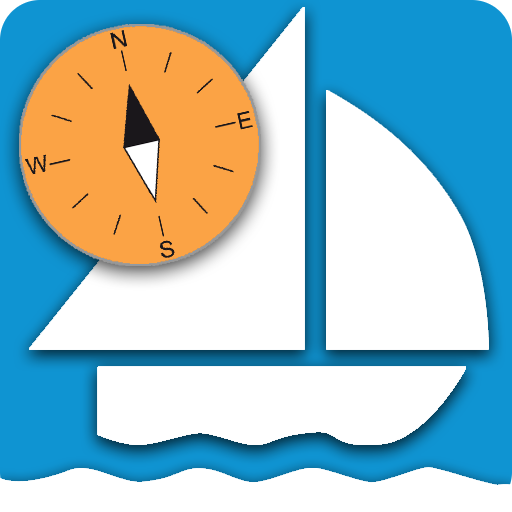
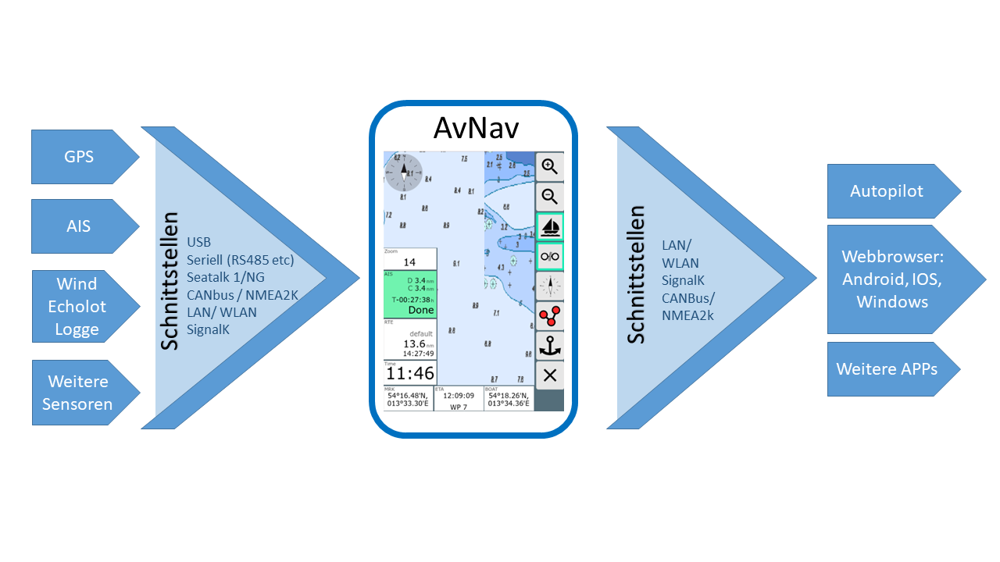

AvNav Quickstart

AvNav Quickstart
================

Ein Hinweis vorweg:

***Ich kann keine Garantie für die Funktion der App übernehmen,
insbesondere die Nutzung zu Navigationszwecken geschieht auf eigenes
Risiko. In jedem Falle empfehle ich einen intensiven Test der
Genauigkeit der Darstellung und des verwendeten Kartenmaterials.***

Eine ausführliche Beschreibung der Konzepte findet man im
Kapitel [Einführung](beschreibung.md).

Generelles
----------

AvNav ist primär ausgelegt für die Bedienung auf Touch-Geräten (auch mit
relativ kleinen Bildschirmen). Es wurde versucht, die Bedienelemente und
Anzeigen so zu gestalten, dass sie auch unter Bord-Bedingungen gut nutzbar
sind.

Eine Bedienung über Maus (und Tastatur) ist natürlich ebenfalls möglich.

Installation und Inbetriebnahme
-------------------------------

AvNav gibt es in 2 Varianten:

1. Client-Server-Variante  
   Dabei wird der Server auf einem Linux- oder Windows-System installiert
   (z.B. einem Raspberry Pi). Als "Client" für die Bedienung dient ein
   beliebiger Browser z.B. auf einem Tablet.
2. Android App  
   Hier ist die gesamte Funktionalität in einer App gebündelt. Auch hier
   können weitere Geräte per Browser zusätzlich zugreifen.

### Client-Server-Variante

AvNav steht als [Paket für verschiedene
Linux-Distributionen](install.md#Packages) (Debian Pakete, Rpm) sowie als [Installer
für Windows](install.md#Windows) zur Verfügung.  
Die Debian-Pakete sind in einem [Repository](https://github.com/free-x/avnav/wiki)
verfügbar und können außerdem von der [Release-Seite](release.md)
heruntergeladen werden.  
Außerdem pflegen wir [Images für den
Raspberry Pi](install.md#Headless). Eine ausführliche Beschreibung findet sich im Kapitel
[Installation](install.md).

Nach Installation und Start der App kann man sich mit dem Browser zu
AvNav verbinden. Dadurch startet die [WebApp](userdoc/index.md).  
Wenn man unsere Images nutzt, erzeugt der Raspberry ein WLAN (Name und
Passwort können angepasst werden). Für Details, wie man sich nach der
Installation mit dem Server verbindet, siehe die [Image
Beschreibung](install.md#connecting).   
Wenn man über einen anderen Weg mit dem AvNav-Server verbunden ist, kann
man http://avnav.local benutzen (oder die IP Adresse des Servers).  
Für IOS- und Android-Geräte ist es empfehlenswert, einen [Bonjour](https://de.wikipedia.org/wiki/Bonjour_%28Apple%29)
Browser zu nutzen. Dieser kann AvNav im lokalen Netz finden, so dass man
ohne Adresseingabe sofort den Browser starten kann.

* IOS: 
* Android: 

### Android App

Die [App](android/android.md) steht im Play Store zur
Verfügung 

Konfiguration
-------------

Nach der Installation oder der Nutzung eines Images wird AvNav in der
Regel ohne weitere Konfiguration starten. An den USB-Anschlüsse werden
serielle Schnittstellen mit ihren Baudraten automatisch ermittelt. Je nach
gewählter Installation ist meist ein Empfänger für UDP-Daten auf Port
34667 aktiv.

Für weitergehende Anforderungen kann eine detaillierte Konfiguration des
Servers über die [Server/Status Seite](userdoc/statuspage.md)
vorgenommen werden. Eine Anpassung des Aussehens kann über die [Einstellungen](userdoc/settingspage.md),
über [Anpassungen des Layouts](hints/layouts.md) und über [nutzerdefinierten Code](hints/userjs.md)/[CSS](hints/usercss.md)
sowie [Plugins](hints/plugins.md) vorgenommen werden.

NMEA-Daten
----------

### Client-Server-Variante

AvNav verarbeitet NMEA0183-Daten, die über angeschlossene USB-Geräte,
serielle Schnittstellen, Bluetooth-Geräte,  TCP (Client und Server)
oder UDP empfangen werden können. Eine Multiplexer-Funktion erlaubt es,
die Daten von allen angeschlossenen Schnittstellen zu empfangen und [konfigurierbar](hints/configfile.md)
an beliebige Schnittstellen wieder auszusenden.

Einen Teil der Daten dekodiert AvNav (Positionsdaten, AIS,...) und nutzt
sie für die eigenen Anzeige-Funktionen.  
Die folgenden NMEA-Datensätze werden von AvNav
dekodiert:

* !AIVDM
* $xxGGA
* $xxGSV
* $xxGLL
* $xxVTG
* $xxRMC (mag. variation seit 20240520)
* $xxMWV (ab 20220225 auch waterSpeed)
* $xxDPT
* $xxDBT
* $xxXDR (seit 20210114)
* $xxHDG (seit 210106xx, mag. variation seit 20240520)
* $xxHDT (seit 20210619)
* $xxHDM (seit 20210619)
* $xxVHW partiell (seit 20210619)
* $xxVWR (seit 20220225)
* $xxMTW (seit 20220225)
* $xxZDA (seit 20220421)
* $xxVDR (seit 20240520)
* $xxGSA (seit 20250723)

Je nach [Konfiguration](hints/configfile.md) kann AvNav
auch NMEA-Daten erzeugen:

* $GPRMB
* $GPAPB
* $AVXDR
* $AVMDA
* $AVMTA

In Zusammenarbeit mit [Canboat and
SignalK](hints/CanboatAndSignalk.md) können auch [NMEA2000-](hints/CanboatAndSignalk.md)
Daten empfangen und genutzt werden. Außerdem können alle Daten für das
eigene Schiff, die in SignalK verfügbar sind, in AvNav angezeigt werden.  
Ab Version 20220421 kann AvNav auch direkt seine Navigationsdaten von
SignalK erhalten.

### Android

Unter [Android](android/android.md) kann das interne GPS
genutzt werden. Außerdem kann eine TCP- oder Bluetooth-Verbindung zum
Empfang von GPS- oder AIS-Daten genutzt werden. Auf Geräten mit
USB-Host-Funktion kann auch ein Seriell-USB-Adapter angeschlossen werden.

Es werden die folgenden NMEA-Daten dekodiert:

* !AIVDM
* $xxGGA
* $xxGSV
* $xxGLL
* $xxGSA
* $xxRMC (mag. variation seit 20240520)
* $xxMWV (ab 20220225 auch waterSpeed)
* $xxDBT
* $xxXDR (seit 20210114)
* $xxHDG (seit 210106xx, mag. variation seit 20240520)
* $xxHDT (seit 20210619)
* $xxHDM (seit 20210619)
* $xxVHW partiell (seit 20210619)
* $xxVWR (seit 20220225)
* $xxMTW (seit 20220225)
* $xxVDR (seit 20240520)

Bei enstprechender Konfiguration kann AvNav $GPRMC und $GPRMB-Sätze (ab
20220225 auch $GPAPB) erzeugen und aussenden.

Karten
------

AvNav verarbeitet grundsätzlich Karten im [Rasterformat](charts.md#Intro).
Diese können aus verschiedenen Quellen im Netz heruntergeladen werden
(z.B. [OpenSeaMap](https://wiki.openstreetmap.org/wiki/DE:Locus#https://wiki.openstreetmap.org/wiki/DE:Locus#Offline-Karten))
oder z.B. mit dem [MobileAtlasCreator](https://mobac.sourceforge.io/)
oder [SASPlanet](https://wiki.openstreetmap.org/wiki/SAS_Planet)
aus Quellen im Netz erstellt werden.

Unmittelbar verarbeiten kann AvNav Karten im ["gemf"-
und "mbtiles"-Format](charts.md#chartformats). Daneben können Karten z.B. im BSB-Format (kap)
in das gemf Format [konvertiert](charts.md#Convert) werden,
entweder direkt auf dem Raspberry - oder besser vorher auf einem
Desktop-System.

Außerdem kann AvNav [o-charts](hints/ocharts.md)- Karten
verarbeiten, unter Android [mit der
avocharts App (ochartsng)](hints/ochartsng.md). Der O-Charts-Shop bietet Karten für
Open-Source-Software zu sehr günstigen Preisen an.

Mit dem [ochartsng](hints/ochartsng.md) Plugin kann AvNav
auch freie S57 Karten anzeigen (nach Konvertierung) - z.b. -  [NOAA](https://nauticalcharts.noaa.gov/charts/noaa-enc.md)..

Karten müssen in AvNav installiert werden, bevor sie genutzt werden
können. Das kann auf der [Files/Download
Seite](userdoc/downloadpage.md), erfolgen - Sektion charts {{BT("DBOpenChart")}}. O-charts Karten müssen über das [o-charts
plugin](hints/ocharts.md) / [ochartsng plugin](hints/ochartsng.md)
hochgeladen werden.

Mit dem [mapproxy-plugin](https://github.com/wellenvogel/avnav-mapproxy-plugin)
kann AvNav darüber hinaus verschiedene Online-Karten einbinden. Für die
Offline-Nutzung einzelner Bereiche von Online-Karten kann das Plugin
ebenfalls genutzt werden.

Weitere Details herzu finden sich im Kapitel [Karten](charts.md).

Anzeigen
--------

Auf der [Seite "Navigation"](userdoc/navpage.md) werden
dargestellt: Die aktuelle Boots-Position, der Kurs, die Route zum nächsten
Wegepunkt, die aktuelle Route, AIS Ziele und deren Kurse,
Navigationskreise und definierte [Overlays](hints/overlays.md).

Weitere Navigationsdaten können dargestellt werden auf der [Seite
"Navigation"](userdoc/navpage.md), im [Routen-Editor](userdoc/editroutepage.md)
und auf bis zu 5 [Dashboard-Seiten,
die selbst konfiguriert werden können.](userdoc/dashboardpage.md) Das schließt auch die in [SignalK](hints/CanboatAndSignalk.md)vorhandenen Werte ein.

Es können einfache Zahlenwerte, [analoge
Anzeigen](hints/layouts.md#gauges) oder auch Grafik-Anzeigen realisiert werden.

Die Darstellung der Navigationsdaten kann in weiten Grenzen an eigene
Bedürfnisse angepasst werden. Dazu dient der [Layout-Editor](hints/layouts.md)
Eigene Anzeige-Layouts können mit ein wenig [JavaScript-Code](hints/userjs.md)
und mit [CSS](hints/usercss.md) erstellt werden.

Diese Layouts beinhalten auch eine Anpassung an unterschiedliche
Bildschirm-Ausrichtungen und -auflösungen.

Routen {: #routes}
------------------

In AvNav können sehr einfach Routen erstellt und bearbeitet werden. Das
erfolgt in der Kartenansicht im [Routen-Editor](userdoc/editroutepage.md).
Im Normalfall verschiebt man die Karte so, dass der Mittelpunkt auf dem
gewünschten Wegepunkt liegt, und fügt diesen dann mit einem Klick der
Route hinzu. Punkte der Route können verschoben, gelöscht und bearbeitet
werden.

Wegepunkte oder andere Routen, die als [Overlays](hints/overlays.md)
angezeigt werden, können im Routen-Editor der aktuellen Route hinzugefügt
werden.

Eine Route kann invertiert werden, alle Wegepunkte können auch gelöscht
werden. Routen werden in AvNav als "gpx"-Dateien gespeichert. Sie können
über die [Files/Download-Seite](userdoc/downloadpage.md)
importiert und exportiert werden. Aus dem Routen-Editor kann die
Navigation direkt gestartet werden. Innerhalb einer Route erfolgt eine
Alarmierung, wenn der nächste Wegepunkt erreicht wird bzw. sobald man sich
innerhalb des "approach" genannten Umkreises befindet. Es erfolgt ein
automatisches Weiterschalten zum nächsten Wegpunkt.

Ab Version 20220819 kann AvNav zwei verschiedene Routing Modi nutzen:

### [great circle](https://en.wikipedia.org/wiki/Great_circle)

Hier wird eine Route so berechnet, dass man den kürzesten Weg zwischen Start
und Ziel hat. Der Nachteil daran ist, dass sich der Kurs im Verlauf der Route
permanent ändert. Eine solche Route ist in der Kartendarstellung keine
Strecke, sondern eine Kurve.  
In älteren Versionen hat AvNav immer great circle Routen berechnet, diese
aber (fälschlich) als Strecken dargestellt.  
Für kürzere Distanzen (< 100nm) spielt das aber praktisch keine Rolle.

### [rhumb line](https://en.wikipedia.org/wiki/Rhumb_line)

Hier wird die Route so berechnet, dass ein konstanter Kurs gesteuert werden
kann. Die Kartendarstellung ist eine Strecke.

Die Umschaltung erfolgt im Router auf der  [Server/Status
Seite](userdoc/settingspage.md). Für das {{BT("Measure")}} Mess-Tool kann der Modus in den Einstellungen der Web
App (unter Navigation/ Measure Display RhumbLine) separat
eingestellt werden. Damit können leicht die beiden Wege verglichen werden.

### Wegepunkt Weiterschaltung {: #nextwp}

Für die automatische Weiterschaltung zum nächsten Wegepunkt in einer
Route müssen immer zwei Bedingungen erfüllt sein:

1. Das Boot muss sich im Annäherungsbereich des Wegepunktes befinden
   (kann man in den Einstellungen der WebApp vor dem Starten einer Route
   definieren). Das wird ersichtlich durch einen ausgelösten
   Wegepunkt-Alarm und eine rote Darstellung im Route-Widget.
2. Je nach eingestelltem Mode (Router auf der  [Server/Status
   Seite](userdoc/settingspage.md): nextWpMode) - neu ab 20220819  
   "late" (der default und in älteren Versionen): Die Entfernung zum
   aktuellen Wegepunkt nimmt nicht mehr ab, aber die Entfernung zum nächsten
   Wegepunkt veringert sich.  
   "90": Der Wegepunkt liegt "querab" (genauer: Das Boot hat eine Linie +/-
   90° zum originalen Wegepunktkurs überquert)  
   "early": Nach dem Wegepunkt-Alarm erfolgt die Weiterschaltung nach einer (einstellbaren) Zeit ohne weitere Bedingungen.

Es ist wichtig zu beachten, dass die Weiterschaltung nur erfolgt, wenn beide
Kriterien erfüllt sind. Falls eine manuelle Weiterschaltung gewünscht ist,
kann man jederzeit durch Klick auf die Widgets links unten die
Wegepunkt-Buttons anzeigen und den {{BT("NavNext")}}Button nutzen.  

Tracks {: #tracks}
------------------

AvNav zeichnet beständig den aktuellen Track auf und zeigt ihn auf der
Karte. Dabei wird versucht, die Zahl der Trackpunkte zu begrenzen, indem
nur bei größeren Änderungen oder nach einer bestimmten Zeit erneut ein
Trackpunkt geschrieben wird (Siehe [Konfiguration
ANVTrackWriter](hints/configfile.md?lang=en#h3:AVNTrackWriter) ). Die Tracks werden in regelmäßigen Abständen als
"gpx"-Datei gespeichert und können auf der [Files/Download-Seite](userdoc/downloadpage.md#tracks)
exportiert und importiert werden (dort ist auch eine Anzeige ihrer Daten -
also Strecke, Zeit, usw. möglich). Pro Tag wird eine separate "gpx"-Datei
erzeugt. Außerdem können vorhandene Tracks auf der Karte als [Overlay](hints/overlays.md)
dargestellt werden.

Vorhandene [Tracks können in Routen](hints/TracksToRoutes.md)
umgewandelt werden. Dabei wird über einen Reduktionsalgorithmus die Zahl
der Wegepunkte automatisch reduziert.

AIS {: #AIS}
------------

In der Kartendarstellung werden AIS-Ziele in einem bestimmten Umkreis
(default: 20nm) mit ihren Positionen und ihren Kursen dargestellt.
Außerdem erfolgt eine Berechnung des nächsten Zieles und eine Warnung,
falls eine einstellbare minimale Begegnungsentfernung unterschritten wird
(CPA).

Für Details siehe die Beschreibung auf der [Navigationsseite](userdoc/navpage.md#ais).

Alarme
------

AvNav kann Alarme erzeugen für:

* eine Ankerwache  
  Sie kann auf den [Dashboard-Seiten](userdoc/dashboardpage.md#anchorwatch)
  aktiviert werden. Abhängig vom Layout werden die Anzeigen angepasst. Bei
  Verlassen des vorgegebenen Bereichs (oder bei Ausfall des GPS-Signals)
  erfolgt eine Alarmierung.
* bei Erreichen des nächsten Wegepunktes
* "Mensch über Bord" (MOB)  
  Für das Auslösen eines MOB-Alarms ist in allen Ansichten von AvNav eine
  separate{{BT("MOB")}}
  [MOB-Taste](userdoc/mainpage.md#mob) vorhanden. Durch diese
  wird die aktuelle Position zum neuen Zielpunkt, alle anderen Routings
  werden beendet. Außerdem wird der Alarm ausgelöst.

Alarme werden in AvNav auf dem Server erzeugt und verwaltet. Insbesondere
z.B. für die Ankerwache können alle Anzeige-Geräte abgeschaltet werden,
aber die Überwachung läuft weiter.

Es kann bei den Alarmen eine akustische Signalisierung sowohl auf dem
Server, als auch in der Client-Anzeige erfolgen. Auf dem Server können
auch weitere Aktionen ausgelöst werden (siehe [Beispiel](https://github.com/wellenvogel/avnav/tree/master/hardware/simple-pi)).
Die Konfiguration erfolgt im  [configfile
- AVNAlarmHandler](hints/configfile.md#AVNAlarmHandler).

Über die [SignalK
Verbindung](hints/CanboatAndSignalk.md#configuration) kann AvNav auch Notifications von SignalK als Alarme
anzeigen (und erzeugen bzw. löschen ).

Nachtmodus
----------

AvNav kann auf der [Hauptseite](userdoc/mainpage.md) in
einen Nachtmodus {{BT("Night")}}
geschaltet werden. Dann sind alle Anzeigen entsprechend angepasst.

Fernsteuerung
-------------

AvNav kann die Anzeigefunktionen auf einem Gerät von einem anderen Gerät
oder vom Server aus steuern. Für Details siehe die [Beschreibung](hints/RemoteControl.md)
dazu.

Anpassung
---------

AvNav kann in unterschiedlicher Weise an eigene Bedürfnisse angepasst
werden. Da die gesamte Darstellung im Browser abläuft, kann man das
Aussehen mit [CSS](hints/usercss.md) anpassen.

Die Konfiguration des Servers erfolgt über die Datei [avnav\_server.xml](hints/configfile.md).
Eine Änderung sollte im Normalfall jedoch nicht direkt in der Datei
erfolgen, sondern über die Bearbeitungsmöglichkeiten auf der [Server/Status-Seite](userdoc/statuspage.md).

Neben der bereits beschriebenen Anpassung der Layouts im [Layout-Editor](hints/layouts.md)
können ohne größeren Aufwand eigene Anzeigen mit ein wenig [Java
Script](hints/userjs.md) Code eingebunden werden.

Es ist auch möglich, weitere externe oder AvNav-interne Webseiten als "[User Apps](userdoc/addonconfigpage.md)" einzubinden und
anzuzeigen.

Die zur Darstellung genutzten Symbole können über eine [Json-Datei](hints/usericons.md)angepasst werden, ebenso die [Tastaturkürzel
für Aktionen](hints/keyboard.md).

Mit Python, JavaScript und CSS können [eigene
Plugins](hints/plugins.md) geschrieben werden, die die Funktionalität von AvNav
erweitern.