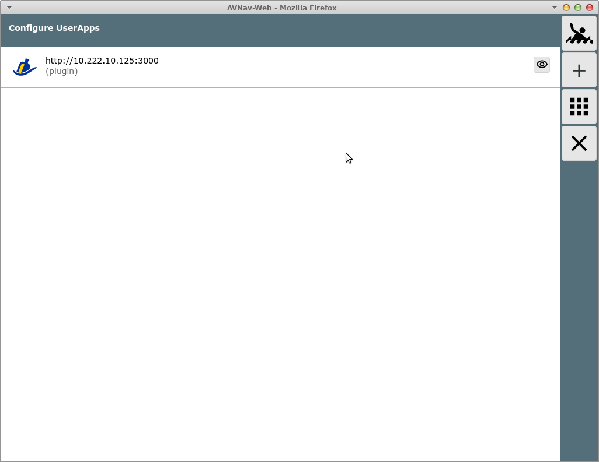
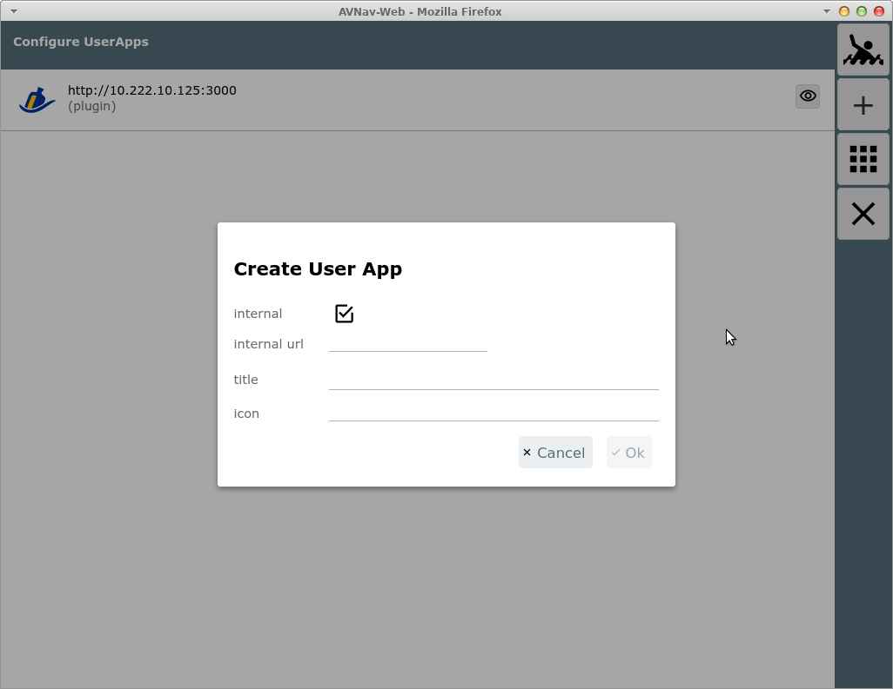
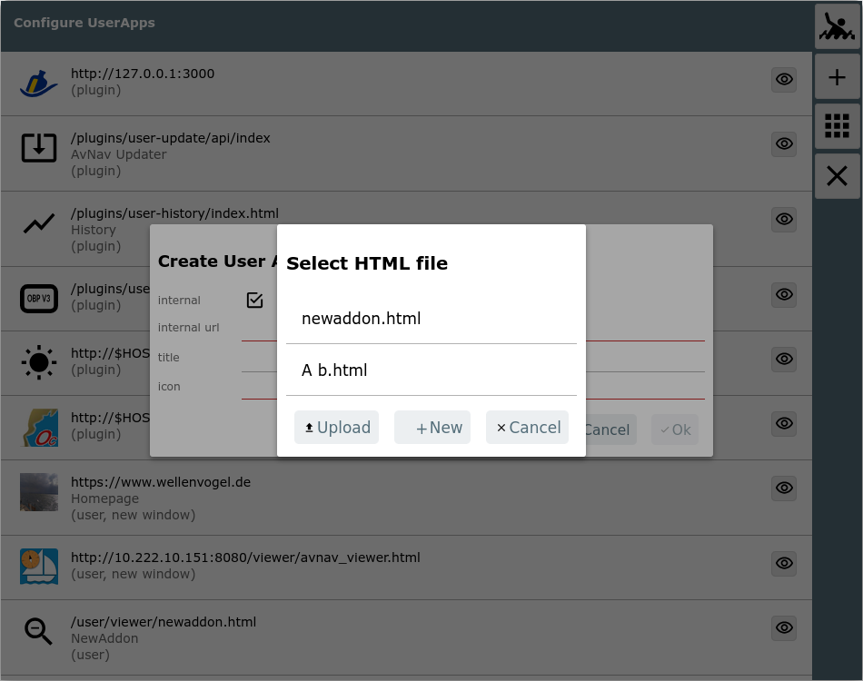
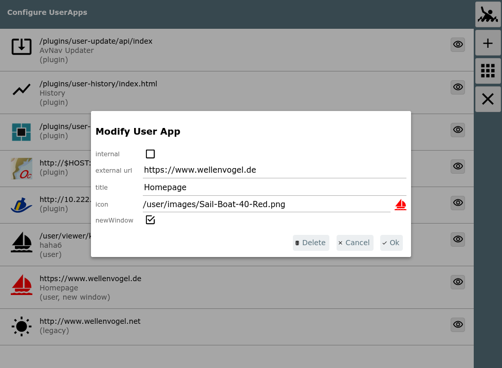
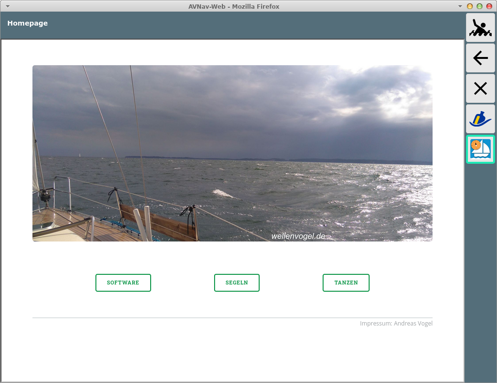

AvNav Konfiguration User Apps

Konfiguration von User Apps
===========================

Von der [Einstellungsseite](settingspage.md) erreicht man
über den Button {{BT("DBUserApp")}}diese
Konfigurationsseite.

Eine "User App" ist eine externe oder interne HTML-Seite, die auf der ["User App" Seite](addonpage.md) in einem iframe angezeigt
wird.

Alle konfigurierten User Apps werden angezeigt.

Buttons
-------

|  |  |  |
| --- | --- | --- |
| Icon | Name | Funktion |
| {{BT("MOB")}} | MOB | Mann über Bord (siehe [Hauptseite](mainpage.md#mob)) |
| + | AddonConfigPlus | Neue Konfiguration hinzufügen |
| {{BT("DBUserApp")}} | AddonConfigAddOns | [User App Seite](addonpage.md) anzeigen |
| {{BT("MainExit")}} | Cancel | zurück zur letzten Seite |

Für jede Konfiguration wird jeweils die URL und der optionale Titel
angezeigt. Außerdem wird angezeigt, woher die Konfiguration stammt (im
Bild z.B. plugin). Falls die Konfiguration nicht gültig ist (z.B. Icon
nicht gefunden), wird sie als"invalid" angezeigt. Durch Klick auf die
Konfiguration kann sie bearbeitet werden (nur User-Konfigurationen). Ein
Klick auf {{BT("DBView")}}
geht zur [User App Seite](addonpage.md), und die
entsprechende Konfiguration wird dort angezeigt.

Beim Hinzufügen einer Konfiguration oder beim Bearbeiten wird ein Dialog
angezeigt.

Hier kann zunächst gewählt werden, ob eine externe oder eine interne HTML-Seite angezeigt werden soll (im Bild: interne aktiv). Externe Seiten
müssen mit einer URL der Form http(s)://... angegeben werden. Falls sie
auf dem gleichen Server liegen wie AvNav, sollte statt des Hostnamens der
String $HOST angegeben werden. Das wird dann von AvNav automatisch in die
richtige Adresse übersetzt.

Wenn man eine interne URL eingeben möchte, erhält man einen
Dialog, der die vorhandenen HTML-Dateien zur Auswahl bietet.

Alternativ kann hier eine neue HTML-Datei (im user-Verzeichnis) angelegt
werden oder eine HTML-Datei vom lokalen Gerät hochgeladen werden.  
Bei Klick auf die "icon" Zeile wird ein Auswahl-Dialog der in AvNav
vorhandenen Icons (inklusive der Nutzer-Icons) angezeigt. Auch in diesem
Dialog kann direkt eine Bilddatei als Icon hochgeladen werden.

  

Nach Auswahl der URL und des Icons kann noch ein Titel angegeben werden.
Wenn dieser leer bleibt, wird kein Titelbalken auf der Seite angezeigt.  

Nach Speichern der Konfiguration kann sie über {{BT("DBView")}} getestet werden.

Wenn "newWindow" (ab Version 20220225) ausgeschaltet ist, wird die Seite
in einem iframe angezeigt, sonst in einem neuen Browserfenster oder
Browsertab.

Wenn eine interne URL gewählt wurde und die Datei wird über die [Files/Download
Seite](downloadpage.md#userfiles) gelöscht, wird auch die User App Konfiguration entfernt.  
Wenn eine Icon-Datei gelöscht wird, wird die User App Konfiguration nicht
entfernt. Sie wird allerdings ungültig und wird auf der[User App Seite](addonpage.md) nicht mehr angezeigt.  
Man kann dann hier die Konfiguration wieder korrigieren.

Wenn eine User App Konfiguration gespeichert wird, schreibt der Server
seine Konfigurationsdatei (avnav\_server.xml) neu.   
Damit er im Fehlerfall noch starten kann, wird beim jedem erfolgreichen
Start eine Datei avnav\_server.xml.ok erzeugt - diese wird beim nächsten
Start genutzt, falls avnav\_server.xml defekt ist.