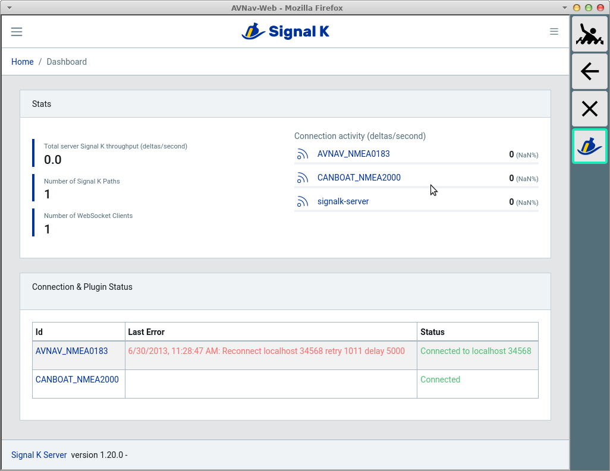

AvNav User Apps

Die User App Seite
==================

Von der [Hauptseite](mainpage.md) erreicht man über den {{BT("DBUserApp")}}Button
die Seite mit den sogenannten User Apps. Der Button ist nur sichtbar, wenn
solche [User Apps konfiguriert](addonconfigpage.md) wurden
(oder z.B. durch Plugins eingerichtet wurden - [signalk](../hints/CanboatAndSignalk.md)).

Buttons
-------

|  |  |  |
| --- | --- | --- |
| Icon | Name | Funktion |
| {{BT("MOB")}} | MOB | Mann über Bord (siehe [Hauptseite](mainpage.md#mob)) |
| {{BT("WpPrevious")}} | Back | Back Button des Browsers, kann für die Navigation in den angezeigten Seiten genutzt werden.  Geht nicht zurück zur vorigen Seiten in AvNav! |
| {{BT("MainExit")}} | Cancel | zurück zur Hauptseite |
| andere Icons | --- | Auswahl der [konfigurierten User App](addonconfigpage.md) |

Auf dieser Seite werden externe oder interne HTML-Seiten angezeigt, die
als [User Apps konfiguriert](addonconfigpage.md) wurden.
Die Anzeige erfolgt dabei in einem iframe. Manche externen Seiten lassen
das nicht zu - das muss man ggf. ausprobieren.

Im Beispiel wird die Signalk-Weboberfläche angezeigt, die durch das[signalk Plugin](../hints/CanboatAndSignalk.md) konfiguriert wurde.