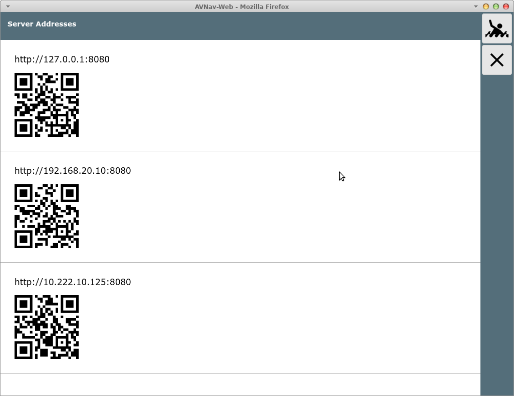

AvNav Adressen-Seite

Die Adressen-Seite
==================

Es werden hier die Adressen angezeigt, über die AvNav externe
Verbindungen annimmt. Im normalen Setup, wenn AvNav als Access Point
arbeitet und man sich mit dem avnav WLAN verbindet, sind es die mit
192.168.... beginnenden Adressen.  
Wenn noch die Verbindung zu [einem externen WLAN](wpapage.md)
konfiguriert wurde, kann auch eine solche Adresse noch sichtbar sein (wie
im Bild).

Durch Scannen dieser Codes mit einem anderen Tablet kann man leicht auf
den gleichen Server (Raspberry) zugreifen. Man muss nur entscheiden,
welche der Adressen zu benutzen ist - je nachdem, in welchem Netzwerk man
mit dem Raspberry verbunden ist.

Diese Möglichkeit der Verbindung ist eine Alternative zu der in der [Einführung](index.md)
genannten Variante der Adresseingabe bzw. der Bonjour-Nutzung.

  
  