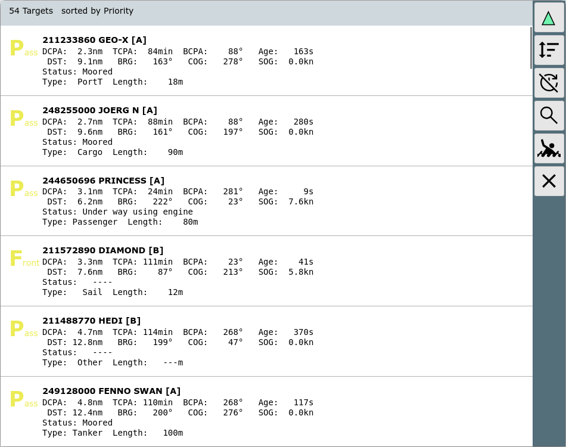

AvNav AIS Liste

Die AIS Liste
=============

Von der [Ais Info](navpage.md#aisinfo) gelangt man über den
Button 
zu dieser Seite.

Buttons
-------

|  |  |  |
| --- | --- | --- |
| Icon | Name | Funktion |
| {{BT("AisNearest")}} | AisNearest | Zurück zum "Normalmodus", auf der [Navigationsseite](navpage.md) wird das nächste Ziel angezeigt. |
| {{BT("AisSort")}} | AisSort | Verändern der Sortierung der Liste |
| {{BT("AisLock")}} | AisLock | Abschalten des automatischen Aktualisierens (toggle) |
| {{BT("AisSearch")}} | AisSearch | Filter für die angezeigten Ziele.  Ein Filterdialog wird angezeigt um einen Suchbegriff einzugeben. Dieser Suchbegriff wird verglichen mit : name, mmsi, callsign, shipname.  Nur Ziele, die den Suchbegriff in einem der Felder enthalten, werden angezeigt.  Der Button ist ein Toggle (ein/aus) - ein zweiter Klick deaktiviert den Filter. |
| {{BT("MOB")}} | MOB | Mann über Bord (siehe [Hauptseit](mainpage.md#mob)e) |
| {{BT("MainExit")}} | Cancel | Zurück zur letzten Seite |

Auf dieser Seite sieht man alle empfangenen AIS Ziele im Umkreis von ca.
10nm zur Bootsposition (sortiert nach Priorität). Mit Klick auf eine Zeile
geht man zur [Ais Info](navpage.md#aisinfo) für dieses Ziel.
Ein Klick auf den grünen Pfeil schaltet wieder in den „Normalmodus“ - d.h.
Anzeige des nächsten AIS Zieles.

Die folgenden Sortierungen kann man auswählen:

|  |  |
| --- | --- |
| Sortierung | Beschreibung |
| Priority | Sortiere nach der Bedeutung für die Navigation. Siehe [AIS Priorität](navpage.md#aispriority). |
| DCPA | Sortiere nach Entfernung am CPA Punkt (Punkt der stärksten Annäherung) |
| TCPA | Sortiere nach der Zeit bis zum CPA Punkt |
| DST | Sortiere nach aktueller Entfernung |
| Name | Sortiere nach Name |
| MMSI | Sortiere nach MMSI |

Durch Klick auf die Überschriftszeile oder den Button {{BT("AisSort")}}kann man die Sortierung verändern.