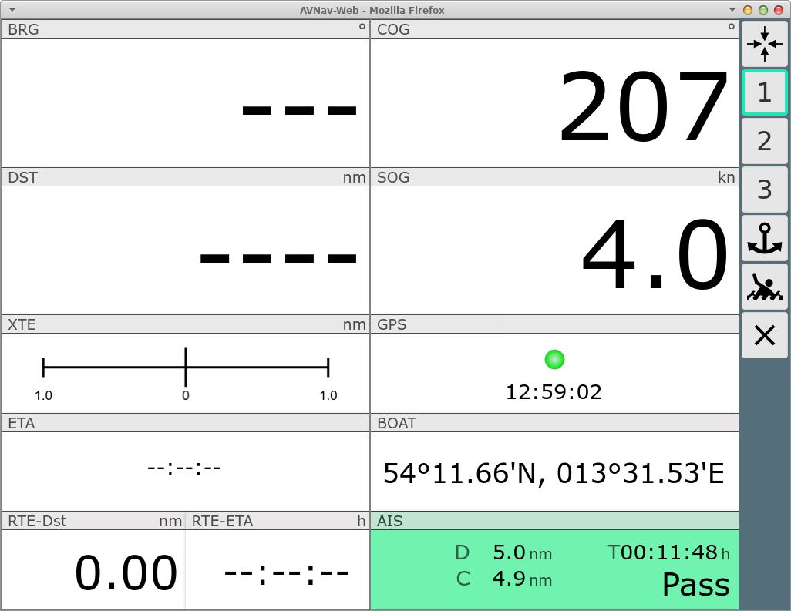
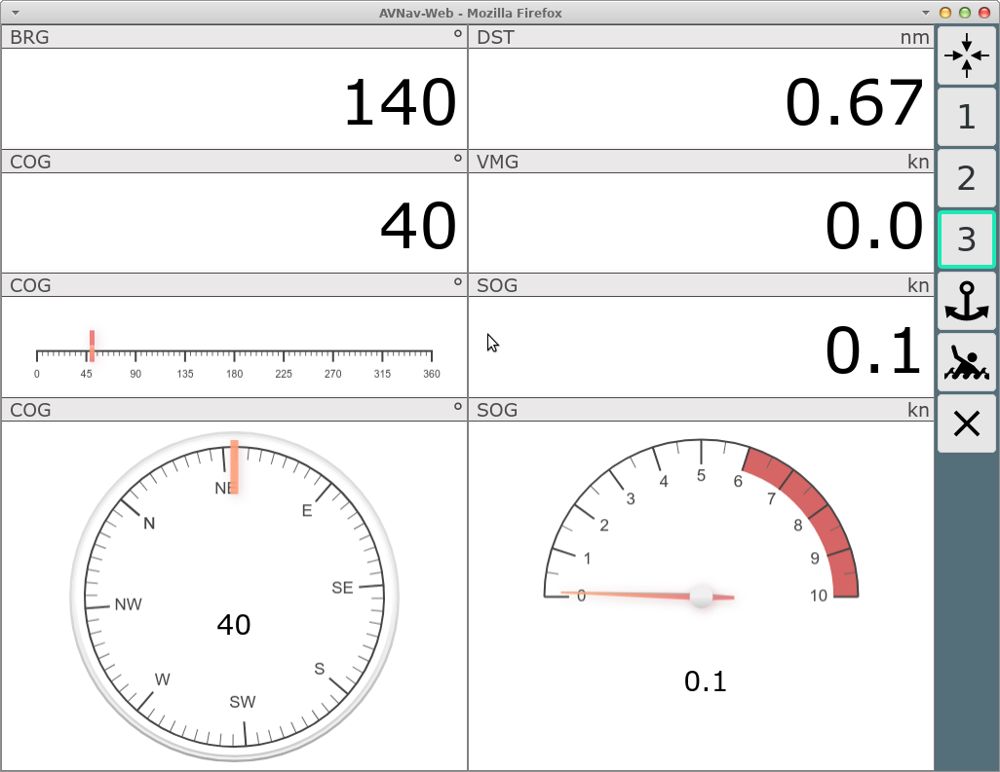
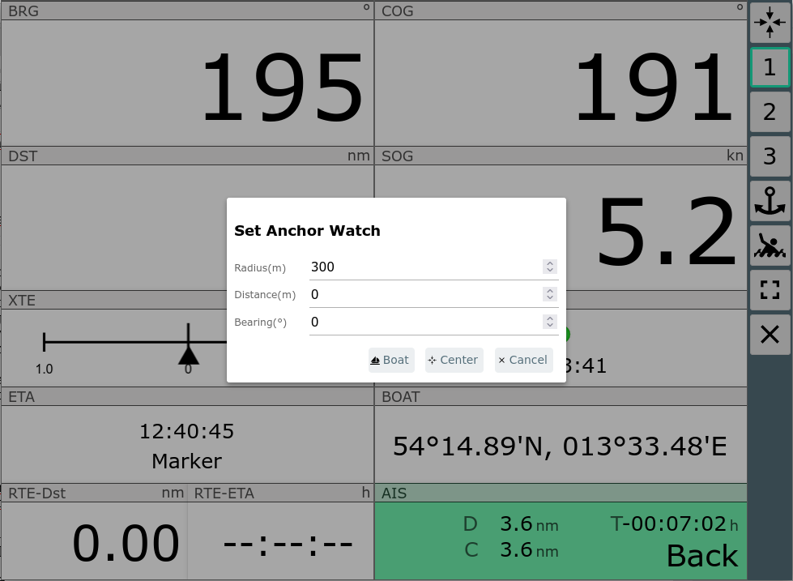
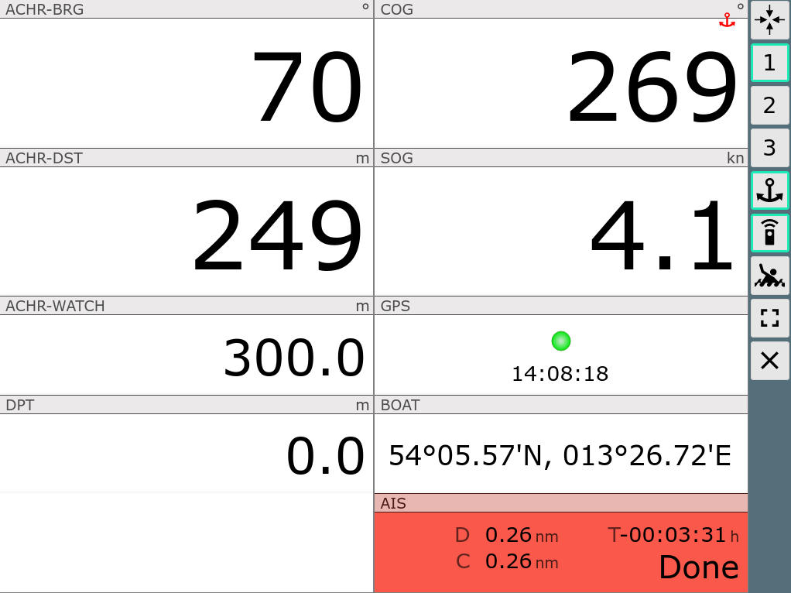
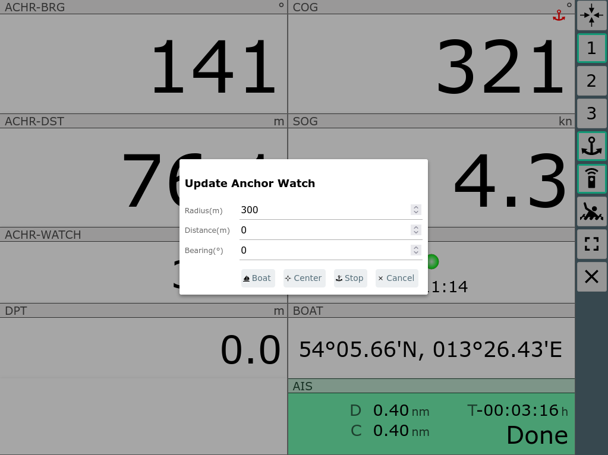

AvNav Dashboard

Die Dashboard Seite
===================

Über den Button (000) auf der [Start-Seite](mainpage.md)
oder einen Klick auf die Position (rechts unten) auf der Navi-Seite
gelangt man zu einer Anzeige der GPS-Daten ohne Karte.

Im [Layout](../hints/layouts.md) können bis zu 5 solcher
Seiten mit verschiedenen Anzeigen konfiguriert werden.

  

Buttons
-------

|  |  |  |
| --- | --- | --- |
| Icon | Name | Funktion |
| {{BT("WpLocate")}} | GpsCenter | Zentriere Karte auf den Wegpunkt und zurück zur vorigen Seite |
| 1,2,... | Gps1, Gps2, ... | Auswahl des anzuzeigenden Dashboards. Die Konfiguration kann durch Auswahl eines Layouts oder Anpassung mit dem [Layout Editor](../hints/layouts.md) geschehen. |
| {{BT("AnchorWatch")}} | AnchorWatch | Aktivieren der Ankerwache, siehe [unten](#anchorwatch) |
| {{BT("FullScreen")}} | FullScreen | Fullscreen ein/aus (nur auf unterstützten Browsern) |
| {{BT("MOB")}} | MOB | Mann über Bord (siehe [Hauptseite](mainpage.md#mob)) |
| {{BT("Overflow")}} | Overflow | Zeige eine zweite Liste von Buttons falls der Bildschirm zu klein für alle Buttons ist. Nur sichtbar, wenn unter Settings/Layout nicht "2 Button columns" ausgewählt ist |
| {{BT("Dim")}} | Dim | Dim Mode. Der Bildschirm wird abgedunkelt und alle Buttons werden inaktiv. Aufheben des Zustandes über Klick auf eine beliebige Stelle auf dem Bildschirm.  Der Button ist nur unter Android oder bei Nutzung des [BonjourBrowsers](https://play.google.com/store/apps/details?id=de.wellenvogel.bonjourbrowser&hl=gsw) (Version 1.5) sichtbar.   Es wird dann auch der Bildschirm insgesamt gedimmt. Darüber kann der Stromverbrauch bei Nicht-Nutzung verringert werden - oder eine Überlast bei großer Helligkeit und hohen Temperaturen vermieden werden. |
| {{BT("MainExit")}} | Cancel | Zurück zur vorigen Seite |

Ein Klick auf die Anzeige des nächsten AIS-Zieles (rechts unten) führt
zur  [Ais Info](navpage.md#aisinfo), ein Klick auf jede
andere Stelle oder den Cancel-Button zurück zur Seite von der man kam.

Spezielle Funktionen
--------------------

### Ankerwache {: #anchorwatch}

Durch Klick auf den {{BT("AnchorWatch")}} Button wird die Ankerwache aktiviert.

Im Dialog kann ausgewählt werden, ob als Anker-Position die Bootsposition
oder alternativ der Kartenmittelpunkt gewählt werden soll. Ausserdem kann
die zulässige Entfernung zur Ankerposition (Radius) und optional noch ein
Offset zur aktuellen Position festgelegt werden (so kann man z.B. die
Länge der Ankerkette und die Richtung in der sie liegt, mit
berücksichtigen).

Nach Aktivierung bekommt der {{BT("AnchorWatch")}}Button einen grünen Rand und die Überwachung
startet. Bei Überschreiten der Entfernung wird ein Alarm ausgelöst.
Ausserdem erfolgt auch eine Alarmierung, wenn während der Ankerwache das
GPS Signal ausfällt. Die Überwachung erfolgt dabei auf dem Server, d.h. es
muss kein aktives Display verbunden sein. Voraussetzung ist natürlich, dass
auf dem Server eine Sound-Ausgabe möglich (und konfiguriert) ist.

Die Ankerwache kann auch nach einem Klick auf die Anzeigen [links
unten auf der Navigationsseite](navpage.md#lowerleftclick) aktiviert werden.

Mit aktiver Ankerwache ändern einige Dashboard Seiten ihren Inhalt.

Ab 20240520: Wenn die Ankerwache aktiv ist, wird das kleine rote
Anker-Symbol auf allen Seiten angezeigt. Beim Klick darauf wird ein Dialog
zum Bearbeiten und Beenden der Ankerwache gezeigt.

Mit "Cancel" wird die Ankerwache unverändert fortgesetzt.