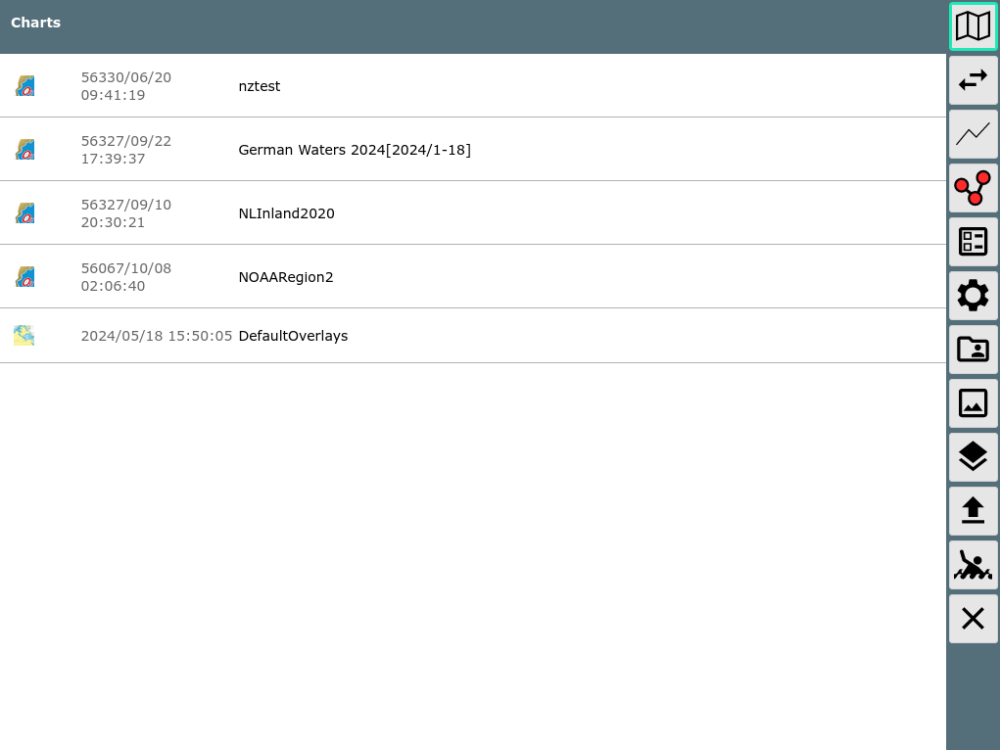
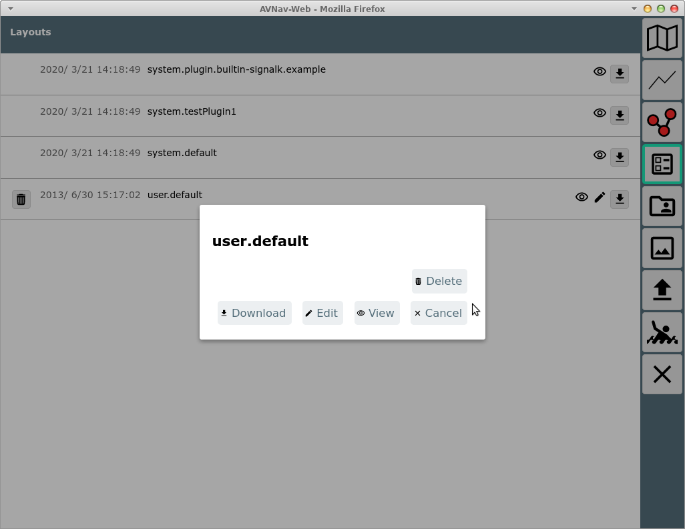
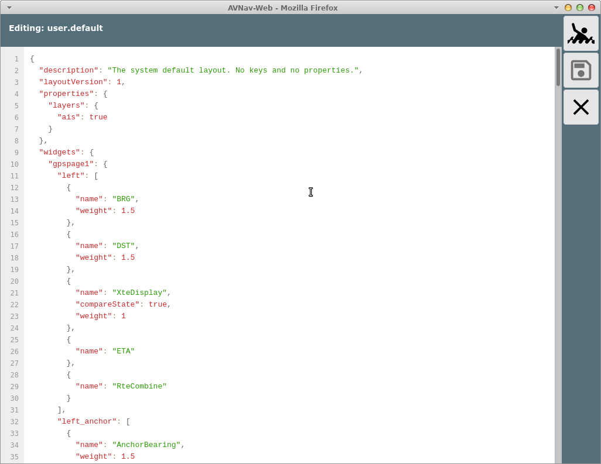
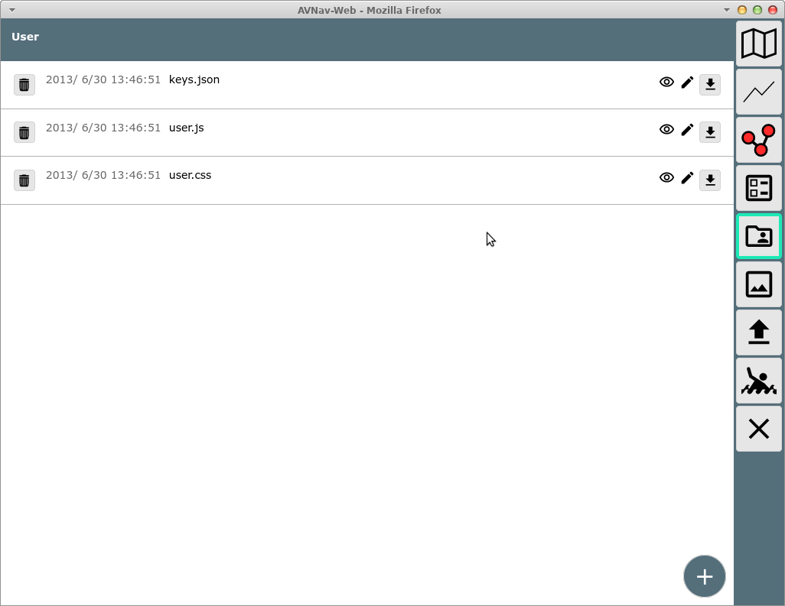
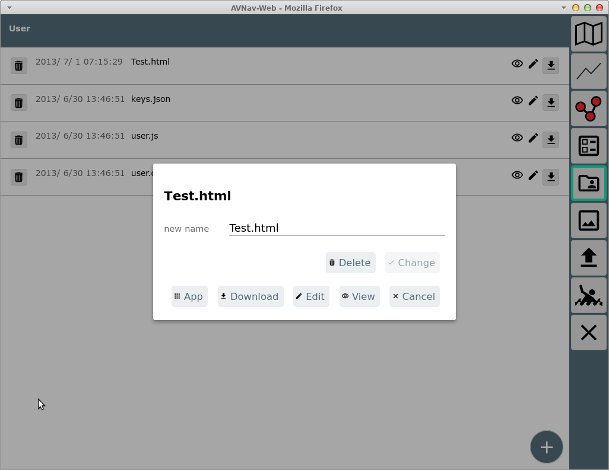
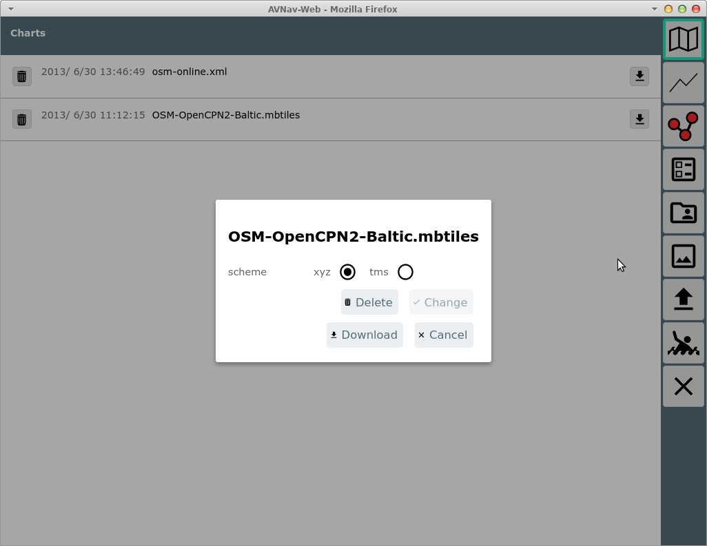
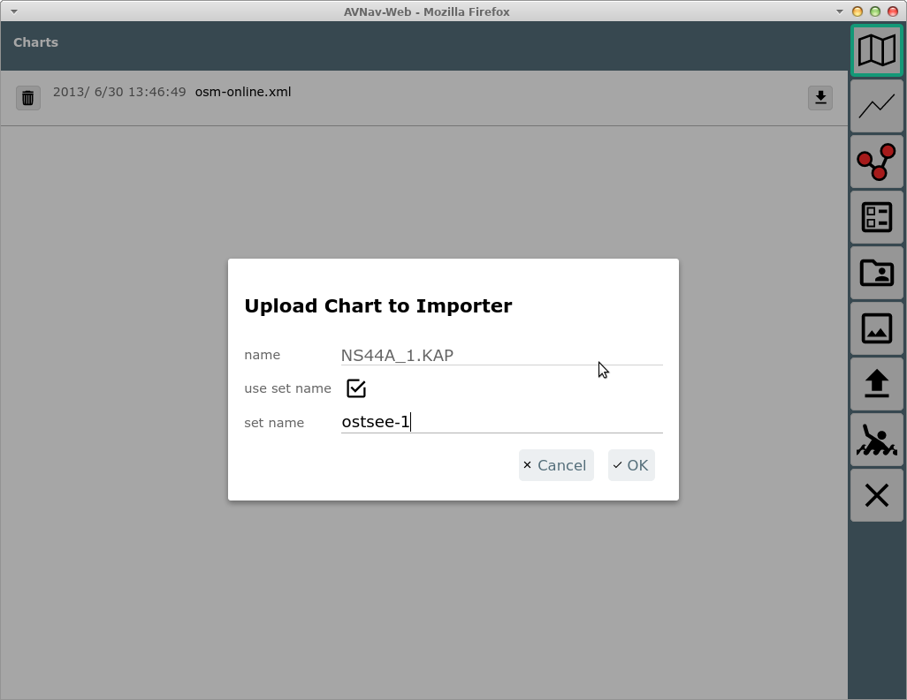
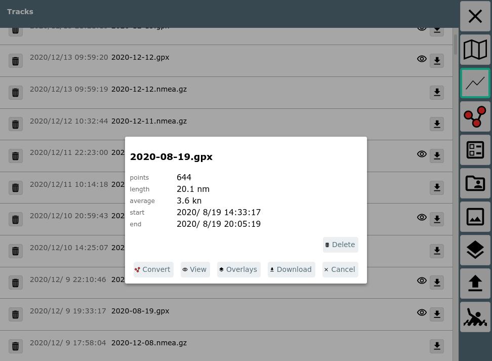

AvNav Files/Download

Die Files/Download Seite
========================

Von der [Startseite](mainpage.md) kommt man mit dem {{BT("DBDownload")}}
Button zur Files/Download Seite. Auf dieser Seite kann man Karten, Tracks,
Routen, Layouts, Nutzer-Dateien, Bilder herunterladen oder auf den
Raspberry (Server) hochladen und sie dort auch löschen. Für einige Dateien
ist auch eine direkte Bearbeitung möglich.

Buttons
-------

|  |  |  |
| --- | --- | --- |
| Icon | Name | Funktion |
| {{BT("DBOpenChart")}} | DownloadPageCharts | Anzeige der Liste der Karten |
| {{BT("ImportsView")}} | DownloadPageImporter | Anzeige der [Import Seite](importerpage.md) |
|  | DownloadPageTracks | Anzeige der Liste der Tracks |
| {{BT("ToRoute")}} | DownloadPageRoutes | Anzeige der Liste der Routen |
| {{BT("LayoutFinished")}} | DownloadPageLayouts | Anzeige der Liste der Layouts |
| {{BT("AddonConfigUser")}} | DownloadPageUser | Anzeige der Liste der [Nutzerdateien](#userfiles) |
| {{BT("AddonConfigImages")}} | DownloadPageImages | Anzeige der Liste der Nutzer-Bilder |
| {{BT("OverlaysView")}} | DownloadPageOverlays | Zeige die Liste der [Overlay](../hints/overlays.md) Dateien |
| {{BT("Upload")}} | DownloadPageUpload | Hochladen einer Datei für die gerade angezeigte Kategorie |
| {{BT("MOB")}} | MOB | Mann über Bord (siehe [Hauptseite](mainpage.md#mob)) |
| {{BT("MainExit")}} | Cancel | Zurück zur vorigen Seite |

In der angezeigten Liste stehen einige Informationen zum jeweiligen
Eintrag und es gibt einen {{BT("SettingsDefaults")}}Löschen und einen {{BT("DBDownload")}}Download Button. Diese aber nur, wenn es das
jeweilige Element erlaubt (z.B. kein Löschen von demo charts oder
system-Layouts).

Potentiell werden noch weitere
Icons angezeigt, die die Bearbeitungsoptionen darstellen. Beim Klick auf
ein Element in der Liste öffnet sich ein Dialog mit den verfügbaren
Optionen.

Falls angeboten ("Edit" / "View"), kann hier zu einer Anzeige- /
Bearbeitungsansicht gewechselt werden. Für Routen öffnet man damit den [Routen-Editor](editroutepage.md).

Auf dieser
Seite können Änderungen vorgenommen werden (Überschrift "Editing") oder
der Inhalt wird angezeigt. Durch Klick auf {{BT("SettingsSave")}}werden Änderungen gespeichert.

Besondere Funktionen
--------------------

### Nutzer Dateien {: #userfiles}

Wenn zur Ansicht {{BT("AddonConfigUser")}} Nutzer Dateien gewechselt wurde, können hier
unter anderem die Datei [user.js](../hints/userjs.md) und [user.css](../hints/usercss.md) angesehen und bearbeitet
werden.

Die Datei keys.json ermöglicht [nutzerspezifische
Tastaturkürzel](../hints/keyboard.md).

Mit der Datei images.json kann man [Symbole
anpassen](../hints/usericons.md).

Auf dieser Seite können auch weitere Dateien hochgeladen werden, die für
die Anpassung von avnav benötigt werden (z.B. css Dateien, java script
files oder auch HMTL Dateien). Diese Dateien sind jeweils über die URL
/user/viewer/<name> erreichbar.  
Bilder sollten vorzugsweise in der Ansicht {{BT("AddonConfigImages")}}hochgeladen werden und sind dann über
/user/images/<name> erreichbar.

Über den "+" Button unten rechts kann eine neue Datei angelegt werden.
Das könnte z.B. eine HTML Datei sein, die dann zu einer [User
App](addonconfigpage.md) gemacht werden soll.

Für eine HTML Datei enthält der Aktionen Dialog den Button "{{BT("DBUserApp")}}App", mit dem direkt eine [User
App](addonconfigpage.md) erzeugt werden kann (vorher muss allerdings ein Icon hochgeladen
worden sein).

### Karten - mbtiles Format {: #mbtiles}

Bei einer Karte im [mbtiles](https://wiki.openstreetmap.org/wiki/MBTiles)
Format kann es sein, dass die Kacheln intern in einer anderen als der
default Ordnung gespeichert sind. Der Default ist "xyz", optional gibt es
"tms". Falls die Karte keine gültige Information enthält, wird "xyz"
angenommen. Wenn eine solche Karte nicht korrekt dargestellt wird, kann
man versuchen auf "tms" umzuschalten.

Diese Information wird dann dauerhaft in der Kartendatei gespeichert.

### Hochladen von Karten {: #chartupload}

In der Kategorie {{BT("DBOpenChart")}}
Karten können auch [Karten Dateien](../charts.md#chartformats)
direkt hochgeladen werden. Dateien, die AvNav direkt verarbeiten kann
(gemf, mbtiles, xml files), werden direkt hochgeladen und können sofort
genutzt werden.

Für Karten, die erst nach [Konvertierung](../charts.md#Convert)
nutzbar sind, wird angeboten, diese in das Eingangsverzeichnis des [Importers](importerpage.md)
zu laden (nicht unter Android).

Hierbei kann noch ein Name für ein "set" vergeben werden. Das wird dann
der Name der erzeugten gemf Datei, es können so mehrere Karten in eine
gemf Datei konvertiert werden. Der Zustand der Konvertierung kann
anschliessend auf der [Import Seite](importerpage.md)
geprüft werden (diese wird automatisch geöffnet).  
Nach einem Upload wartet der Importer noch eine gewisse Zeit, damit hat
man die Möglichkeit nacheinander mehrere Dateien hochzuladen, die dann
alle in einer Konvertierung bearbeitet werden.

### Tracks {: #tracks}

Der Info Dialog für Tracks enthält zusätzliche Informationen.

Ausserdem kann hier über den Button {{BT("ToRoute")}}das [Umwandeln
des Tracks in eine Route](../hints/TracksToRoutes.md) gestartet werden. Über den {{BT("OverlaysView")}}overlay button kann der Track zu [Overlays](../hints/overlays.md)
hinzugefügt oder gelöscht werden.