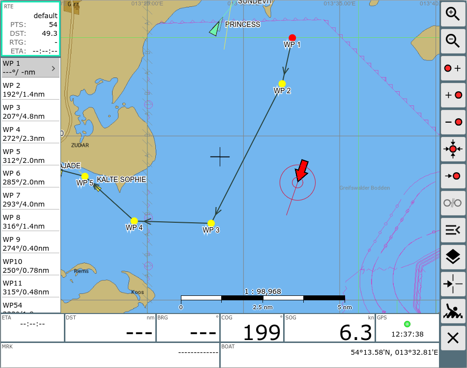
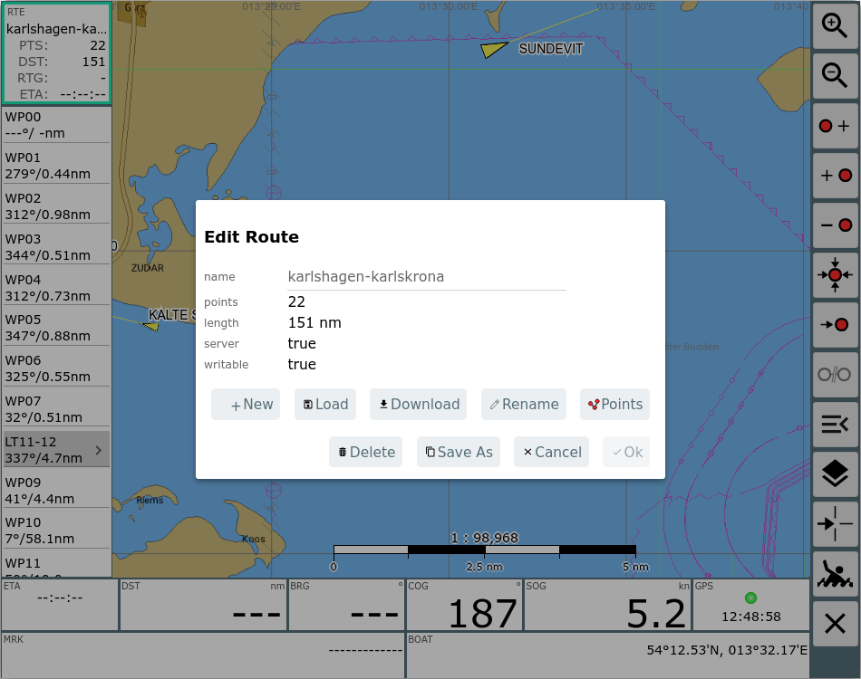
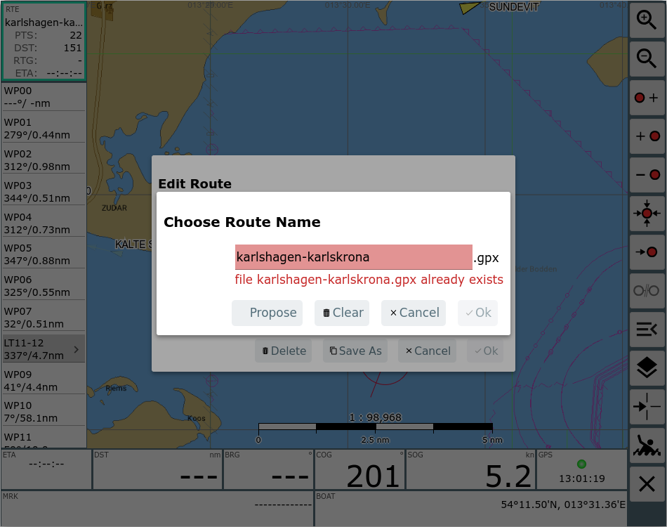
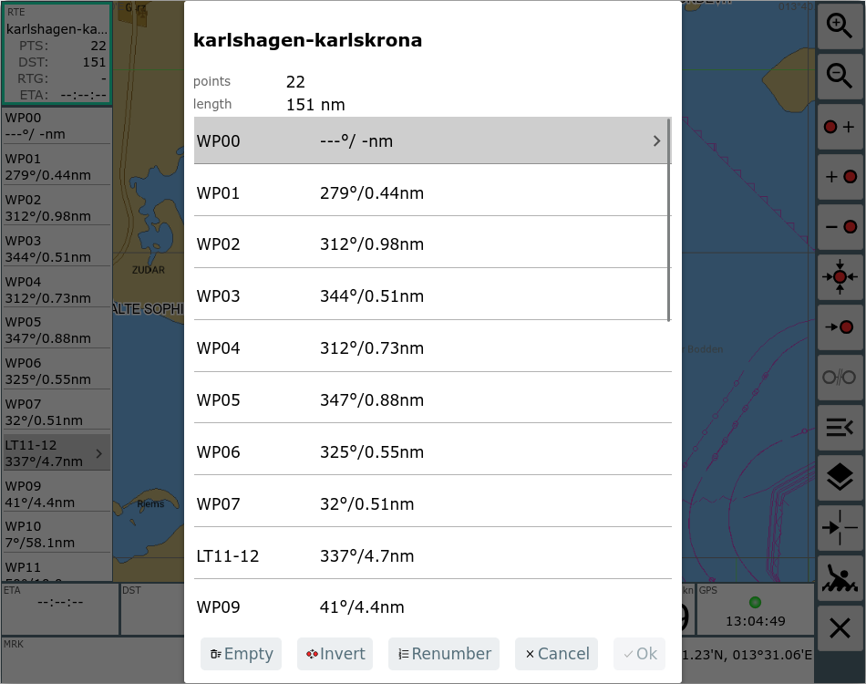
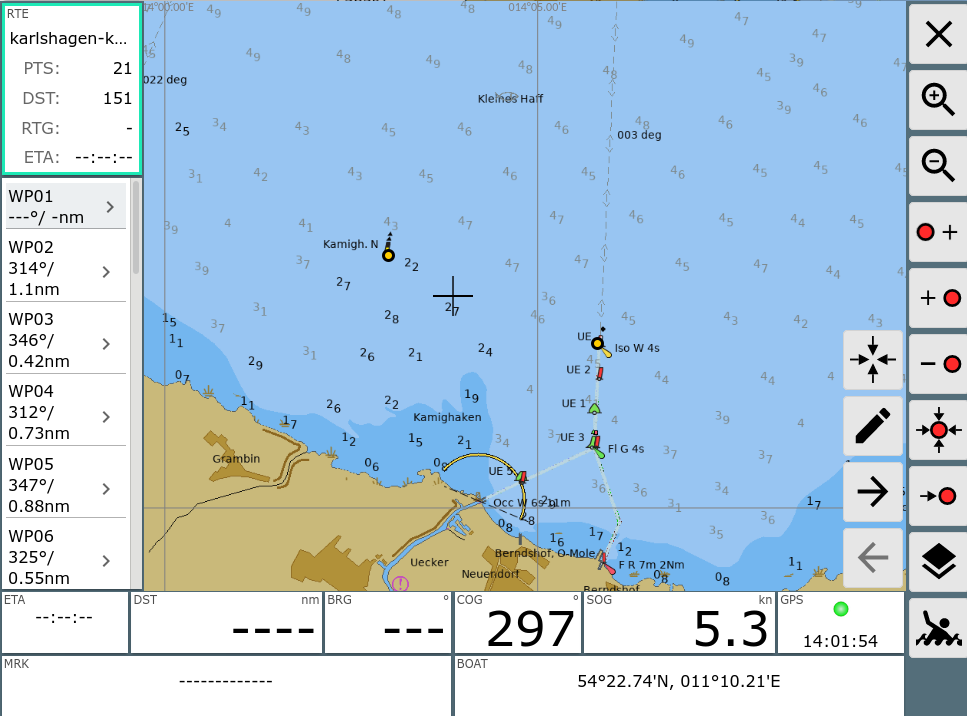
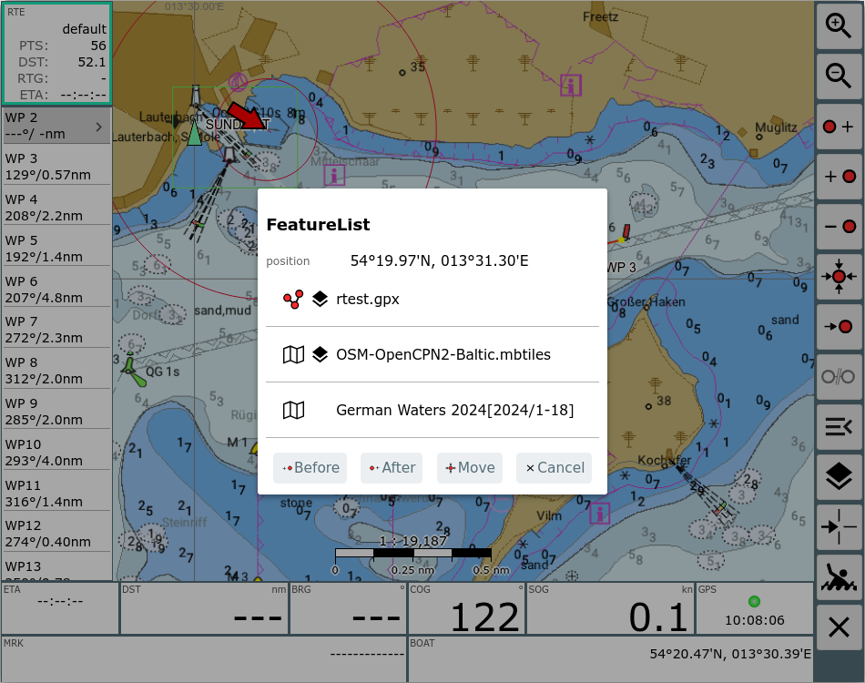
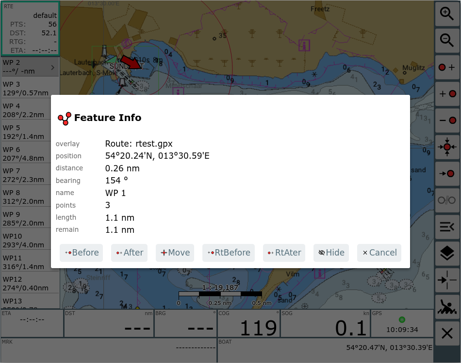
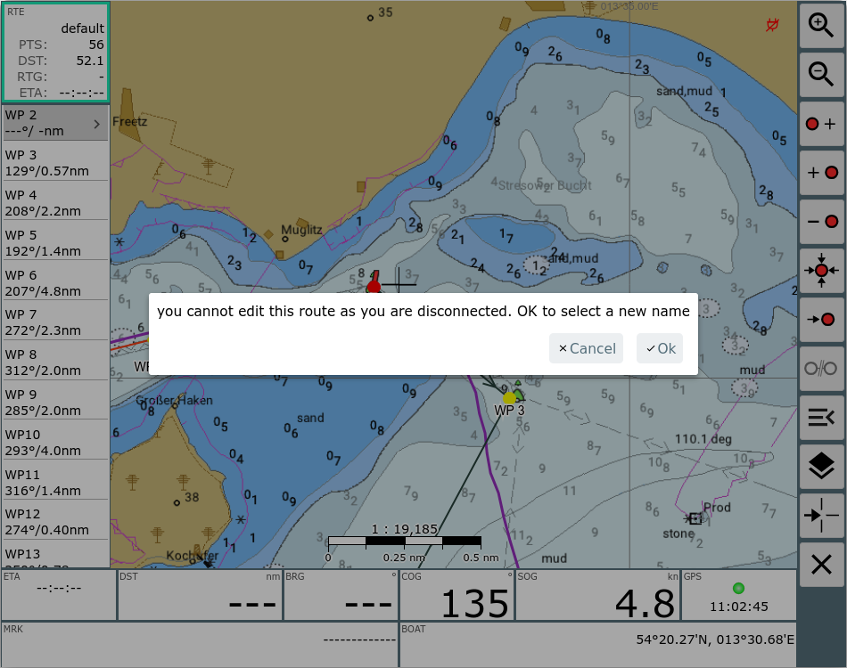
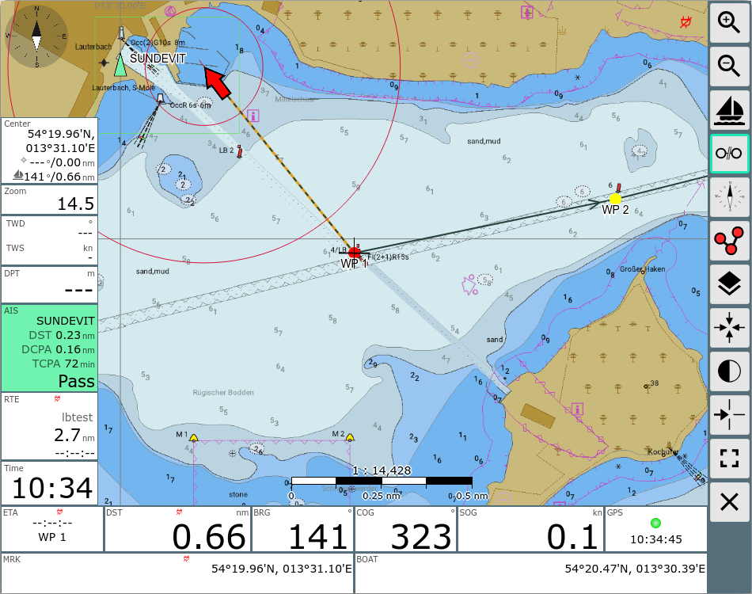

AvNav Routen Editor

Der Routeneditor
================

Übersicht
---------

Der Routen-Editor ist über den Button {{BT("ToRoute")}}von der [Navigationsseite](navpage.md)
erreichbar. Ausserdem kann er über den Button {{BT("WpEdit")}}Edit im Info Dialog zu einer Route auf der [Files/Download](downloadpage.md#filedialog) Seite erreicht
werden.

Buttons
-------

|  |  |  |
| --- | --- | --- |
| Icon | Name | Funktion |
| {{BT("ZoomIn")}} | ZoomIn | Hereinzoomen |
| {{BT("ZoomOut")}} | ZoomOut | Hinauszoomen |
| {{BT("NavAdd")}} | NavAddAfter | Einen neuen Punkt zur Route hinzufügen (insert after)  Der Kartenmittelpunkt (Fadenkreuz) wird als neuer Punkt hinter dem momentan rot markierten Punkt der Route hinzugefügt. |
| {{BT("NavAdd")}} | NavAdd | Einen neuen Punkt zur Route hinzufügen (insert before)  Der Kartenmittelpunkt (Fadenkreuz) wird als neuer Punkt vor dem momentan rot markierten Punkt der Route hinzugefügt. |
| {{BT("NavDelete")}} | NavDelete | Löschen des momentan rot markierten Punktes der Route |
|  | NavToCenter | Verschieben des momentan rot markierten Punktes der Route auf den Kartenmittelpunkt |
| {{BT("NavRestart")}} | NavGoto | Starte die Navigation zum momentan rot markierten Punkt der Route |
| {{BT("StopNav")}} | StopNav | Beende eine laufende Navigation |
| {{BT("RouteMenu")}} | Menu | Zeige den  EditRoute Dialog um eine Route zu erzeugen/zu laden/zu bearbeiten/umzubenennen |
| {{BT("OverlaysView")}} | NavOverlays | Ein- und Ausblenden von [Overlays](../hints/overlays.md) |
| {{BT("CenterAction")}} | CenterAction | Die gleiche Aktion wie ein Klick auf die Kartenmitten (Fadenkreuz) - ein Dialog mit der Feature Liste wird angezeigt |
| {{BT("MOB")}} | MOB | Mann über Bord(siehe [Hauptseite](mainpage.md#mob)) |
| {{BT("MainExit")}} | Cancel | Zurück zur [Navigationsseite](navpage.md) |

Auf dieser Seite kann man eine Route bearbeiten bzw. erzeugen.

Zu jeder Zeit gibt es einen aktiven Wegpunkt (rot dargestellt, links in
der Anzeige grau unterlegt. Die meisten Aktionen beziehen sich auf diesen
Wegpunkt. Er kann durch Anklicken links in der Liste oder durch Anklicken
auf der Karte geändert werden.

Wenn man die momentan aktive Route bearbeitet, wird das durch einen roten
Rahmen links um die Routen-Info angezeigt. Falls eine andere Route
bearbeitet wird, ist dieser grün.

Wenn man den Editor verlässt, geht die Anzeige zur aktiven Route zurück.

Alle Änderungen werden sofort wirksam, es gibt kein undo.

Auf der linken Seite werden die Wegpunkte der aktuellen Route angezeigt.
Dazu jeweils die Kurse und Distanzen für die Abschnitte. Im oberen Teil
sieht man die Gesamtlänge der Route, sowie die Gesamtstrecke und die ETA. Durch
Anklicken kann man einen Wegpunkt aktivieren.

Durch nochmaligen Klick auf einen links bereits markierten Punkt wird
eine Eingabemaske aufgerufen, in der man den Wegpunkt bearbeiten kann.

EditRoute Dialog {: #routedialog}
---------------------------------

Ein Klick auf das Route Info Feld (links oben) oder auf den {{BT("RouteMenu")}}Menu Button  führt zu einem Dialog.

Mit diesem Dialog erhält man die folgenden Aktionen:

|  |  |
| --- | --- |
| Aktion | Beschreibung |
| New | Erzeuge eine neue Route. Der Name der neuen Route wird erfragt. Die neue Route ist leer. |
| Load | Lade eine existierende Route. Das zeigt eine Auswahl mit den auf dem Server gespeicherten Routen (wenn man im connected Modus ist - der Normalfall). Wenn man im "disconnected" Modus ist, werden die Routen angeboten, die lokal gespeichert sind.  Der Dialog enhält auch einen "Upload" Button um eine auf dem lokalen Gerät gespeicherte Route (gpx Datei) zu AvNav zu importieren. |
| Download | Exportiere die aktuelle Route als gpx Datei auf das aktuelle Gerät. |
| Rename | Vergib einen neuen Namen für die Route. |
| Points | Öffne den [RoutePoints Dialog](#pointsdialog) um die Liste der Punkte in der Route zu bearbeiten, zu invertieren oder neu zu nummerieren. |
| Delete | Lösche die aktuelle Route in AvNav. |
| SaveAs | Speichere eine Kopie der aktuellen Route mit neuem Namen. |
| Cancel | Abbruch ohne Speichern. |
| OK | Speichern der Änderungen. |

### Name Dialog

Im EditRoute Dialog zeigen einige Aktionen einen Dialog zur Vergabe
eines neuen Namens an.

Wenn der gewählte Name bereits existiert, kann man die "Propose" Aktion
nutzen, um das System einen noch nicht vorhandenen Namen vorschlagen zu
lassen.

### Points Dialog {: #pointsdialog}

Die "Points" Aktion im EditRoute Dialog zeigt einen Dialog zum Bearbeiten
der Punkte in der Route.

Man kann die Liste leeren, umkehren oder neu nummerieren. Mit Klick auf
einen der angezeigten Punkte kann man ihn bearbeiten (z.B. den Namen
ändern).

Route Point Buttons
-------------------

Ein Klick auf die linken unteren Anzeigen zeigt einige zusätzliche
Buttons.

Mit diesen kann zwischen den Punkten der Route gewechselt werden bzw. der
aktuelle Punkt kann bearbeitet werden.

Ein Klick auf die rechten Anzeigen zentriert die Karte auf die
Bootsposition.

Nutzung der Feature Info {: #featureInfo}
-----------------------------------------

Wenn man auf die Karte oder auf den {{BT("CenterAction")}} CenterAction Button klickt, erhält man die Liste der
Objekte (Features) an dieser Stelle.  
Es gibt einige spezielle Aktionen für das Bearbeiten der Route:

|  |  |
| --- | --- |
| Aktion | Beschreibung |
| Before | Füge den angeklickten Punkt vor dem aktuell selektierten Punkt (rot) ein. |
| After | Füge den angeklickten Punkt nach dem aktuell selektierten Punkt (rot) ein. |
| Move | Verschiebe den aktuell selektierten Punkt (rot) zum angeklickten Punkt. |
| Cancel | Schliesse die Liste |

Mit diesem Dialog kann man durch Klick auf die Karte und "Before"/"After"
Punkte zur Route hinzufügen .

Wenn es eine Overlay-Route in der Liste gibt, bekommt man für diese noch
weitere spezielle Aktionen.

Die Information zeigt den nächsten Punkt der Overlay-Route an und bietet
die folgenden Aktionen:

|  |  |
| --- | --- |
| Aktion | Beschreibung |
| Before | Füge den angezeigten Punkt der Overlay-Route vor dem aktuell selektierten Punkt (rot) ein. |
| After | Füge den angezeigten Punkt der Overlay-Route nach dem aktuell selektierten Punkt (rot) ein. |
| RtBefore | Füge die komplette Overlay-Route ab dem angezeigten Punkt vor dem aktuell selektierten Punkt (rot) ein. |
| RtAfter | Füge die komplette Overlay-Route ab dem angezeigten Punkt nach dem aktuell selektierten Punkt (rot) ein. |
| Hide | Blende die Anzeige der Overlay Route aus |
| Cancel | Schliesse den Dialog |

Mit dieser FeatureInfo kann man z.B. Routen anlegen, die bevorzugte
Wegepunkte enthalten, diese als Overlays anzeigen und dann zur Erstellung
neuer Routen nutzen.  
Hinweis: Um von einer Overlay-Route nur die Punkte anzuzeigen kann man die
"line width" im Overlay auf 0 stellen.

Connected und
Disconnected Mode {: #connectedmode}
--------------------------------------------------

Wenn man auf der Hauptseite den{{BT("DBConnect")}}ConnectedMode ausschaltet
(das {{BT("DBDisconnect")}}disconnected
Symbol wird im Titel angezeigt) heisst das, dass man keine Dinge ändern
kann, die auf dem Server gespeichert sind. Das gilt auch für Routen. Man
kann neue Routen erstellen oder Routen verändern, die man im
"disconnected" Mode erzeugt hat.  
Die Idee dahinter ist es, eine Möglichkeit zu bieten, um Routen z.B.
auszuprobieren ohne die Funktion des Servers zu beeinflussen.  
Wenn man den "disconnected" Mode verlässt, und eine (andere) Route ist auf
dem Server aktiv, dann wird diese auch lokal aktiv.

Der [EditRoute Dialog](#routedialog) zeigt die Information
an, ob eine Route auf dem Server gespeichert ist und ob so momentan
schreibbar ist.  
Wenn man versucht, eine Route zu bearbeiten, die momentan nicht schreibbar
ist, erhält man eine Warnung.

In diesem Fall kann man "OK" wählen, das zeigt den [EditRoute
Dialog](#routedialog) und z.B. mit "SaveAs" eine Kopie erzeugen.  
Im Normalfall zeigt die "Load" Aktion im EditRoute Dialog nur die Liste
der schreibbaren Routen an (aber man kann auch eine nicht schreibbare
Route laden, um sie anzuzeigen).

Wenn man eine Route im "disconnected" Mode erzeugt hat, wird diese lokal
im Browser gespeichert. Um sie auf den Server zu kopieren, verlässt man
den "disconnected" Mode, öffnet die Route im Routen Editor und nimmt eine
Änderung vor. Das speichert die Route auf dem Server.

Wenn man im disconnected Mode eine Route started wird das durch {{BT("DBDisconnect")}}disconnected Symbole in verschiedenen
Anzeigen deutlich gemacht. Diese Informationen beziehen sich dann nur auf
das lokale Display (und beeinflussen z.B. nicht die Ausgabe von RMB/APB
Datensätzen).

