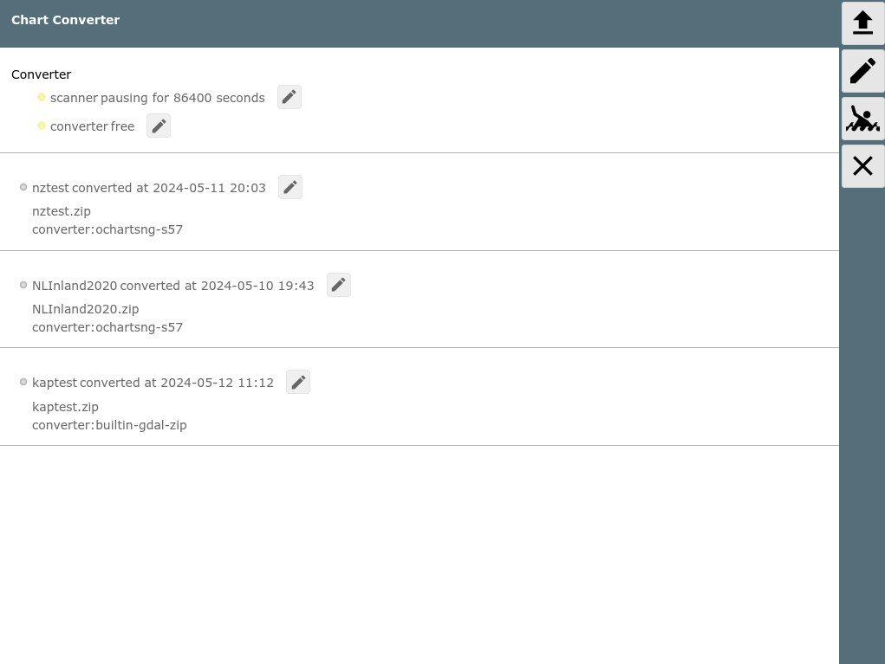
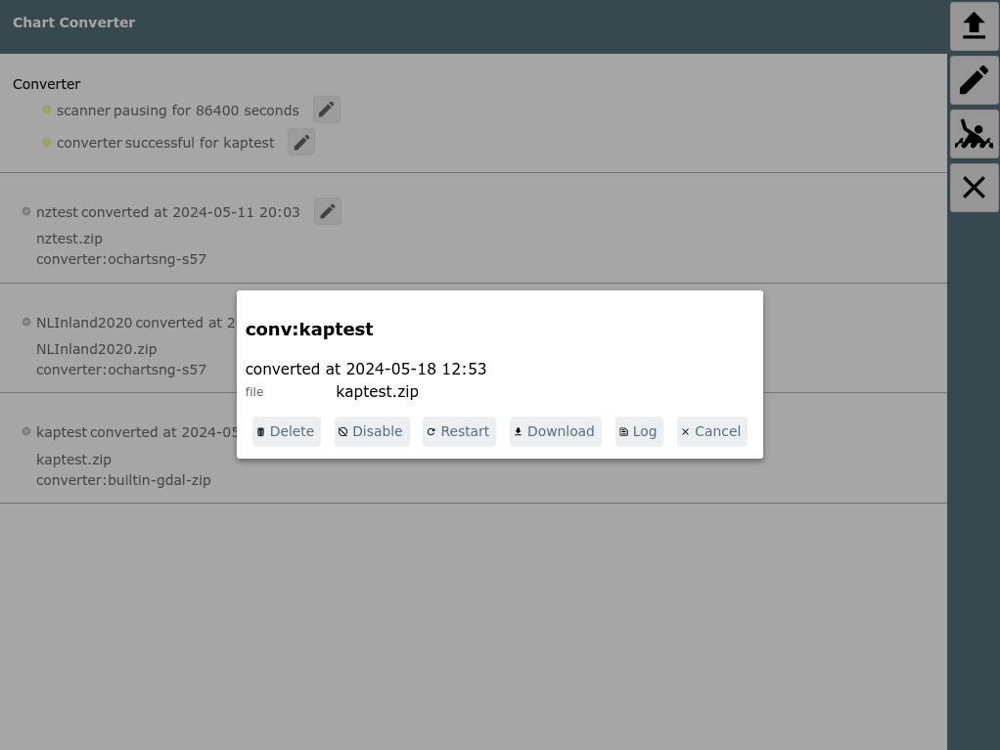
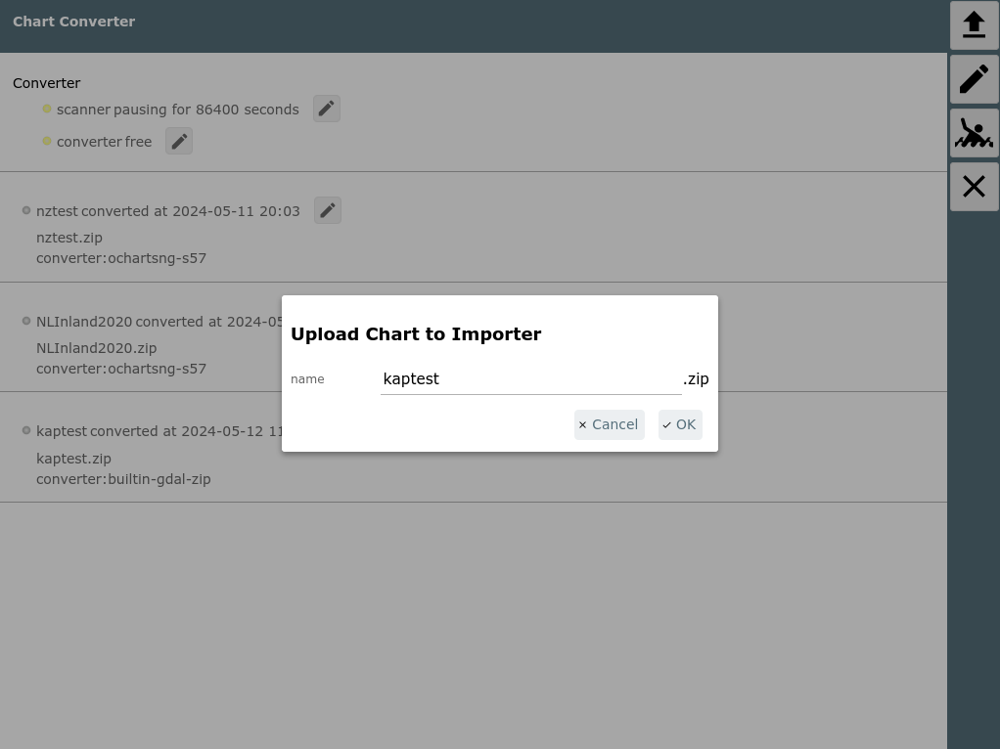
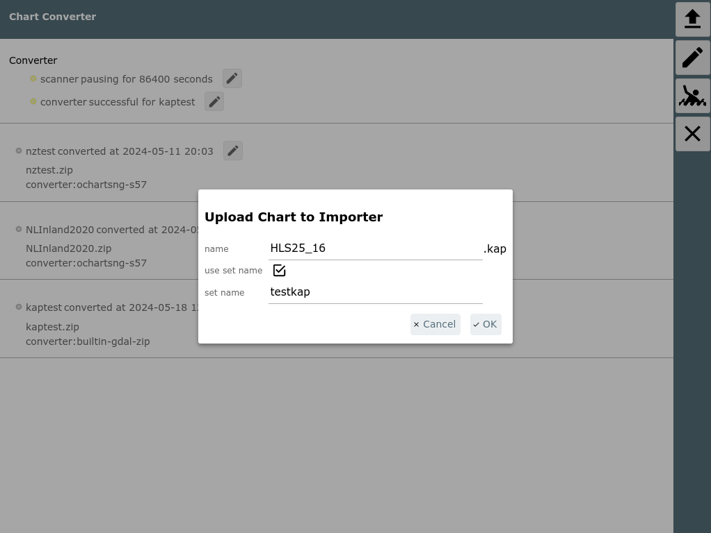
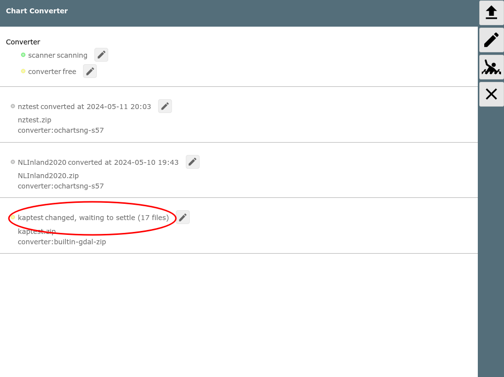
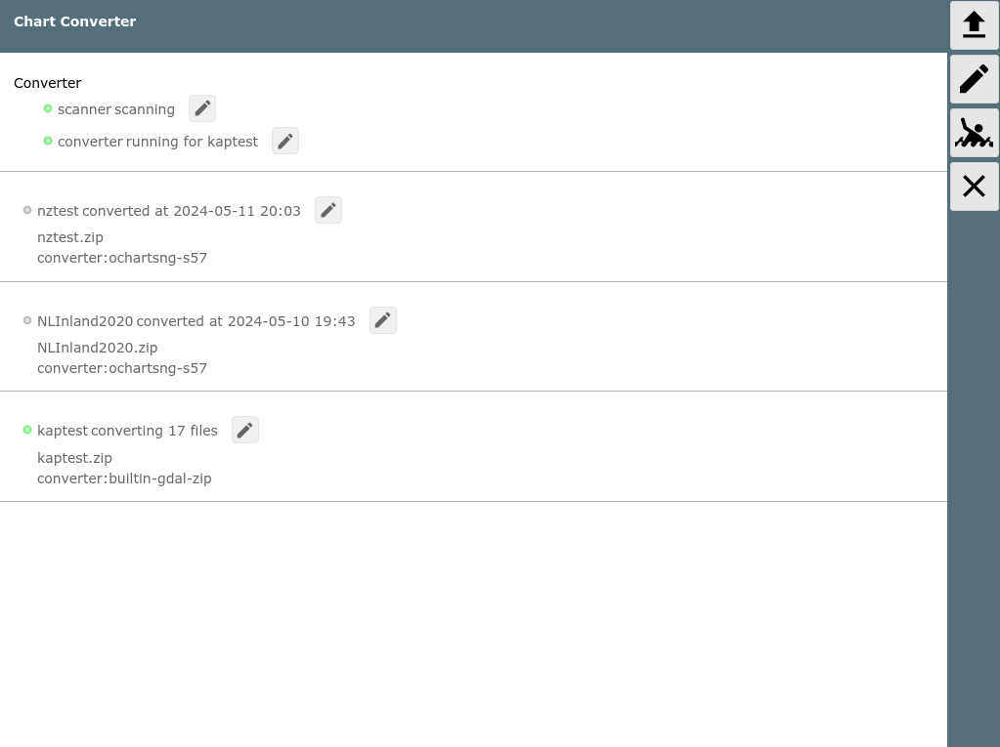
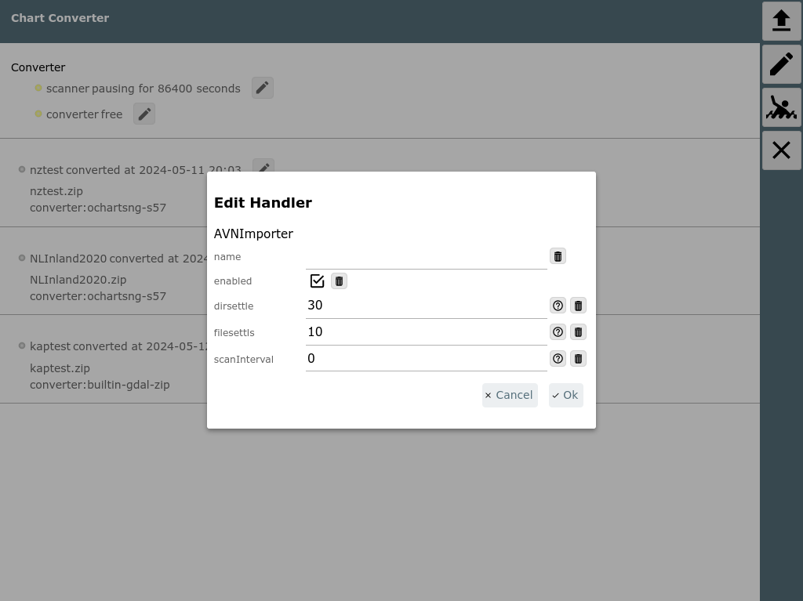

AvNav Chart Import Seite


AvNav Karten Import Seite
=========================

=== **nicht unter Android** ===  

Karten Typen
------------

Der Importer hat eingebaute Konverter für die folgenden Typen:

* BSB Karten (Erweiterung .kap) und Zip Archive mit mehreren .kap
  Dateien
* mbitles Dateien (Aber nur mit der default [Kodierung
  zyz](downloadpage.md#mbtiles) - abweichende Kodierungen können nicht verarbeitet werden)  
  Normalerweise können mbtiles direkt in AvNav gelesen werden (Hochladen
  auf der [Files/Download Seite](downloadpage.md)).Die
  verbleibende Anwendung für eine Konvertierung ist die Möglichkeit gemf
  Dateien unter Android im externen Kartenverzeichnis (z.B. auf einer SD
  Karte) zu nutzen. Mbtiles können unter Android nur im internen
  Kartenverzeichnis genutzt werden.
* navipack Dateien

Plugins können eigene Konverter mitbringen - wie z.B. das [ochartsng](../hints/ochartsng.md#chartconversions)
Plugin (zip's von S57 Dateien).

Benutzung
---------



Die Import Seite kann über die [Files/Download](downloadpage.md)
Seite mit dem  {{BT("ImportsView")}}Button aufgerufen werden.  
Wenn die Seite geladen wurde, zeigt sie eine Liste der momentan bekannten
Import Dateien oder Verzeichznisse (unter DATADIR/import). Für jeden
Eintrag wird der dafür gefundene Konverter angezeigt. Im Bild wurde
bereits alle Dateien erfolgreich konvertiert.

Wenn man auf einen der Einträge klickt, erhält man einen Dialog mir
verschiedenen Aktionen.



Die sichtbaren Aktionen hängen vom Konvertierungszustand ab (konvertiert,
momentan in Bearbeitung,...).

|  |  |
| --- | --- |
| Button | FunKtion |
| Delete | Lösche die Datei/das Verzeichnis im Import Verzeichnis. Erzeugte (konvertierte) Karten werden nicht gelöscht. |
| Disable | Der Eintrag wird disabled. Es wird keine neue Konvertierung gestartet auch wenn er sich verändert (z.B. Hochladen einer weiteren Datei in dieses Verzeichnis). |
| Restart | Neustart der Konvertierung |
| Download  (only when done) | Herunterladen der erzeugten Karte. Für die internen Konverter ist das immer eine gemf Datei. Für andere hängt es vom Plugin ab. |
| Log | Lade das letzte (oder aktuelle) Log der Konvertierung. |
| Stop  (only when running) | Unterbreche eine aktuell laufende Konvertierung. |

Das Ergebnis der Konvertierung wird in das AvNav Kartenverzeichnis
geschrieben (bei Erfolg).

Mit einem Klick auf  {{BT("Upload")}}kann man eine Datei zum Hochladen auswählen
(.kap ,.zip , .navipack, .mbtiles,...).



Im Dialog kann man einen Namen für die Datei im Import Verzeichnis
wählen. Das wird auch der Name der erzeugten Karte.  
Wenn man eine einzelne .kap Datei hochlädt kann man noch einen "set name"
vergeben - das wird ein Verzeichnis im Import Verzeichnis.



Auf diese Weise kann man mehrere .kap Dateien hochladen, die dann
zusammen zu einer Karte konvertiert werden (mit dem Namen des Sets).  
Aber normalerweise ist es bequemmer, die .kap Dateien vorher in ein Zip
Archiv zu packen und diese hochzuladen.

Nach dem Hochladen wartet der Konverter noch einige Zeit bis keine
Änderungen an den hochgeladenen Dateien mehr auftreten.



Wenn keine Änderungen mehr erkannt werden, beginnt die Konvertierung.



Man kann das Log nach Klick auf  {{BT("WpEdit")}}neben dem Eintrag (oder neben dem converter)
einsehen. Nach dem Ende wird das Ergebnis angezeigt. Bei Fehlern kann man
das Log nach Problemen durchsuchen.

Wenn die Konvertierung erfolgreich war, sollte die Karte sofort für AvNav
zur Verfügung stehen. Wenn man sie auf ein anderes System übertragen
möchte (z.B. weil man die Konvertierung auf einem Desktop System gemacht
hat, die Karten aber z.B. auf einem Raspberry Pi oder unter Android
verwedenden möchte) kann man sie wie [oben](#itemdialog)
beschrieben herunter laden.

Mit dem  {{BT("WpEdit")}}Button
rechts erreicht man den Eigenschaften-Dialog für den Importer.



Man kann hier die Wartezeiten für Dateien und Verzeichniss einstellen und
das Scan-Intervall für das Importer Verzeichnis. Mit dem Default von "0"
erfolgt der Scan einmal in 24h und nach jedem Upload oder jheder Änderung
(z.B. restart).

Wenn man Dateien per Hand in das Import-Verzeichnis kopiert muss man über
den  {{BT("WpEdit")}}Button
neben dem scanner einen erneuten Scan asulösen.

Kopieren von Dateien (Experten)
-------------------------------

Wenn man Probleme damit hat, große Dateien zum Import hochzuladen, kann
man diese auch per Hand in das Import-Verzeichnis kopieren (oder auch
komplette Verzeichnisse). Das Import Verzeichnis ist DATADIR/import.
DATADIR ist $HOME/avnav oder $HOME/avnav/data - je nachdem, wie das System
aufgesetzt wurde.  
Wenn man Dateien kopiert hat muss man einen erneuten Scan per Hand
auslösen.

Um das Kopieren großer Dateien zu vermeiden, kann man auch eine Datei mit
der Endung ".clk" (converter link file) im Importverzeichnis erzeugen.  
In diese Datei schreibt man genau eine Zeile mit dem absoluten Pfad zu den
zu konvertierenden Dateien/Verzeichnissen.  
Danach einen erneuten Scan ber Hand auslösen!

Eingebaute Konverter
--------------------

AvNav bringt die folgenden Konverter mit.

### .kap (BSB)

Für kap Dateien werden auch zip Dateien mit mehreren kap Dateien
akzeptiert.  
Die Konvertierung besteht aus den folgenden Schritten:

* Sortierung der Karten in Layer (mit potentieller Umwandlung)
* Erzeugung der Kacheln
* Erzeugung einer GEMF Datei

#### Details (nur für Experten)

Im Folgenden werden die Konvertierungsschritte für den KAP Konverter
beschrieben. Im Normalfall sind diese nicht von Interesse. Aber man kann die
Konvertierung ggf. von der Kommandozeile aufrufen, falls die Ergebnisse
nicht zufriedenstellend sind.  
Die Datei read\_charts.py findet sich unter /usr/lib/avnav/chartconvert.  

Der erste Schritt geht relativ schnell. Alle Kartendateien werden
gelesen, Auflösung und Abdeckung werden ermittelt (falls nötig wird
konvertiert). Im Ergebnis entsteht im workdir/<name> Verzeichnis
eine Datei chartlist.xml. Der Aufruf dazu lautet:

```
read_charts.py -g -o name -m chartlist inputdir [inputdir...]
```

Anschliessend sollte die chartlist.xml noch einmal mit einem Texteditor
überprüft werden, manchmal macht es Sinn, Kartendateien noch einem anderen
Layer zuzuordnen. Das kann einfach durch Verschieben des entsprechenden
XML Elements erfolgen. Man kann sich dazu an den Namen der Karten
orientieren - meist mach es Sinn Karten vergleichbaren Detailgrades in
einen Layer zu verschieben.

Der zweite Schritt ist etwas langwieriger, hier erfolgt die eigentliche
Erzeugung der Kartenkacheln. Der Aufruf:

```
read_charts.py -g -o name -m generate inputdir [inputdir...]
```

Unter workdir/<name> muss bereits eine chartlist.xml existieren.
Die Erzeugung läuft multi-threaded, auf einem Dual Core 2x2Ghz ca. 20 min
für einen Kartensatz mit ca. 20 Karten.

Zum Schluss muss man noch die gemf Datei erzeugen

```
read_charts.py -g -o name -m gemf inputdir [inputdir...]
```

Man kann auch alle Schritte kombinieren – dazu einfach -m all noch vor
den anderen Parametern bei Schritt 1 angeben:

```
read_charts.py -g -m all [-o name] inputdir
```

### .mbtiles

Zwar kann AvNav .mbtiles direkt verarbeiten, aber es kann u.U. nützlich
sein, diese in gemf Dateien umzuwandeln - um sie z.B. unter Android im
externen Kartenverzeichnis nutzen zu können.  
Der Koverter kann bisher nur Dateien mit der Standard-xyz Kodierung
verarbeiten.

### .navipack

Umwandlung in gemf.