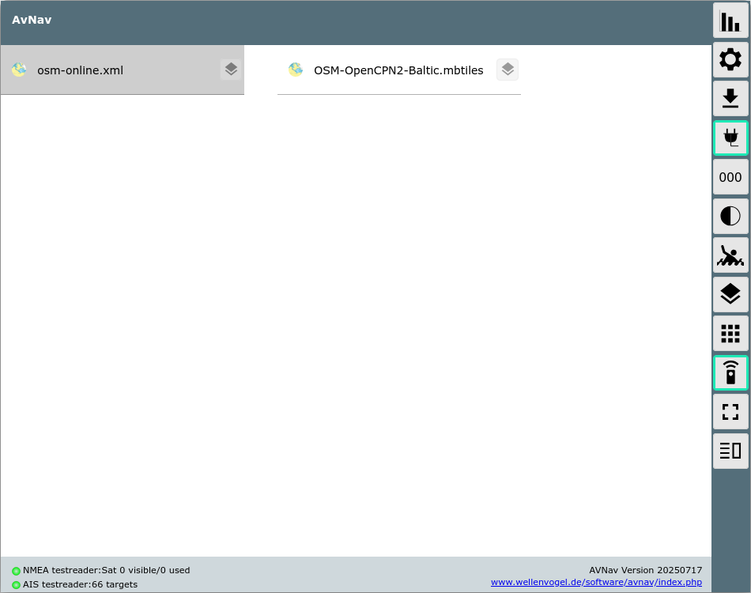
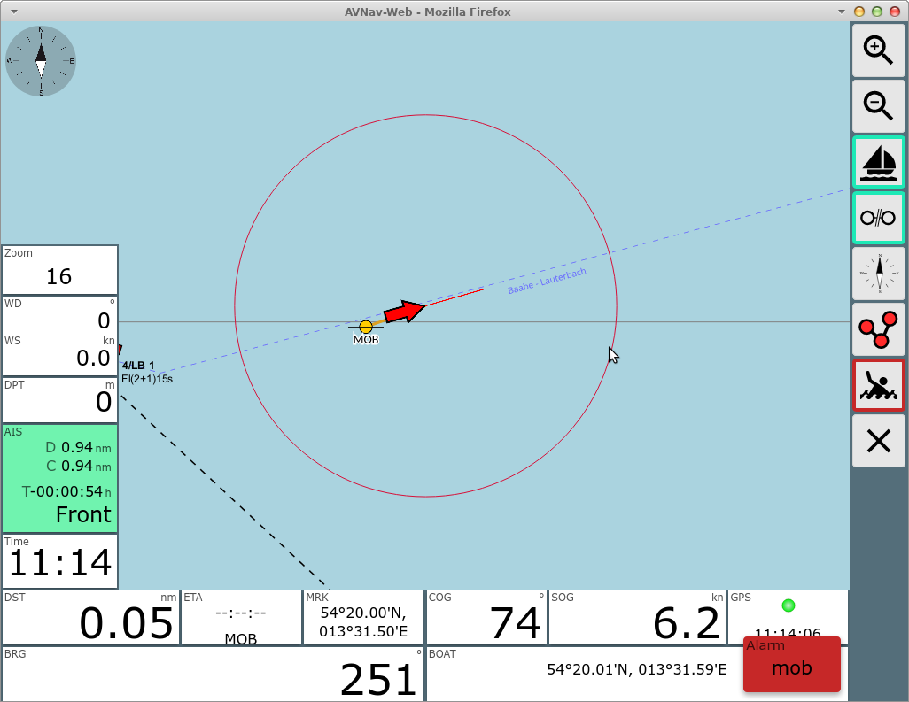
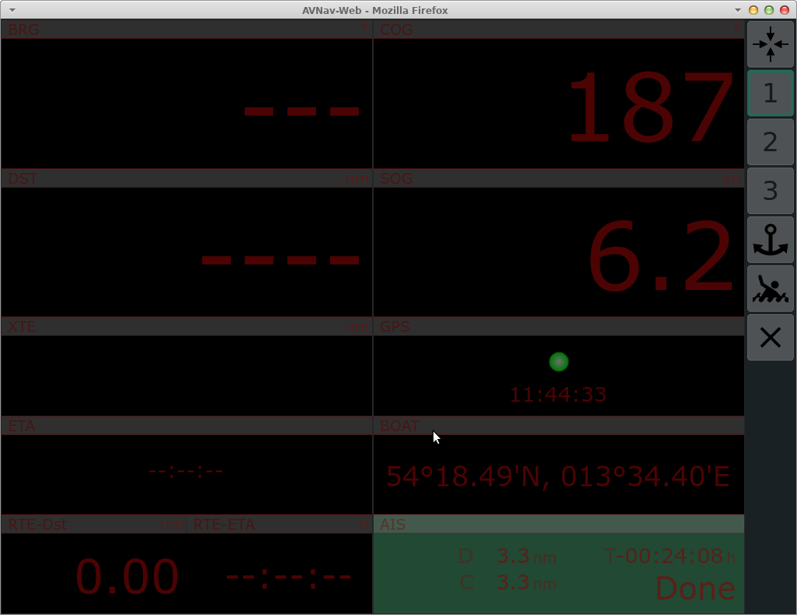
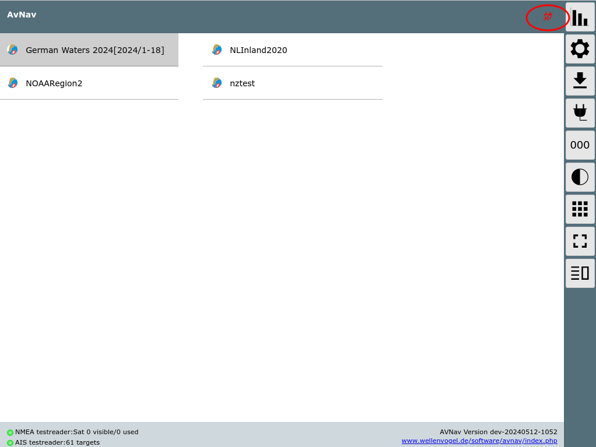
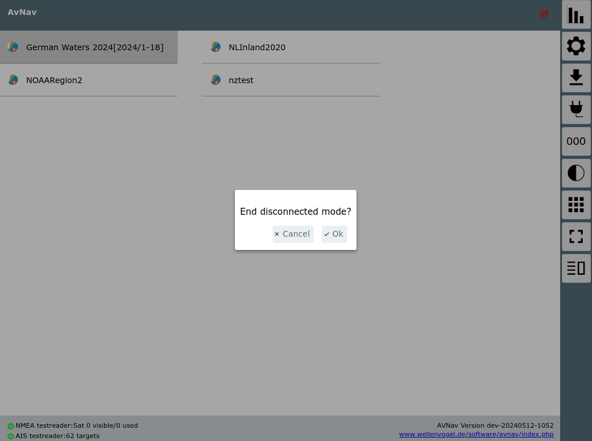
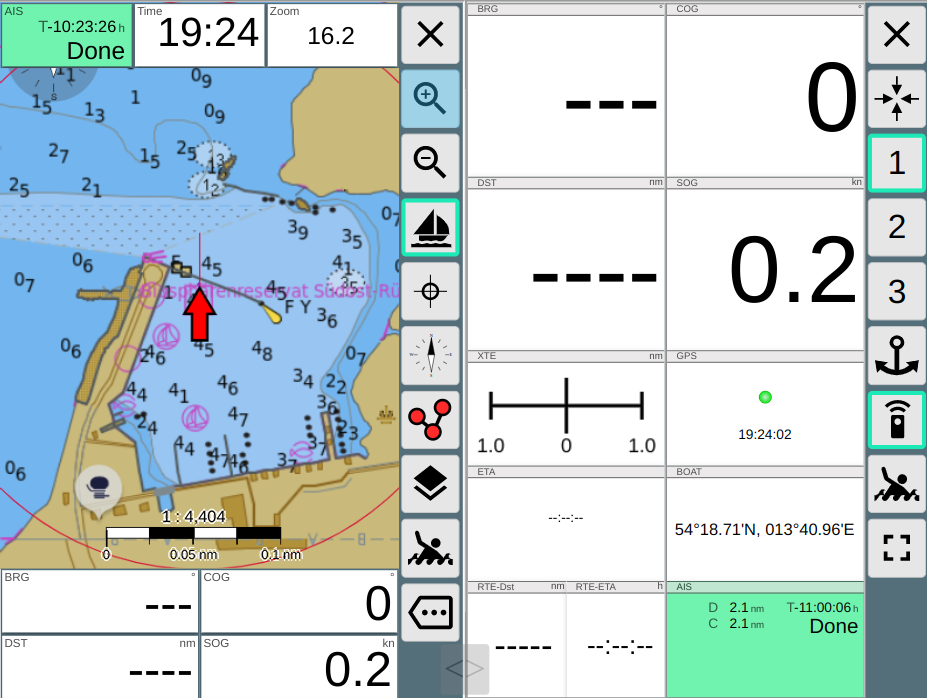

AvNav Hauptseite

AvNav Hauptseite
================

Überblick
---------

**Buttons**
-----------

|  |  |  |
| --- | --- | --- |
| Icon | Name | Beschreibung |
|  | ShowStatus | [Status-Seite](statuspage.md) für den Server |
| {{BT("ShowSettings")}} | ShowSettings | [Einstellungen](settingspage.md) |
| {{BT("DBDownload")}} | ShowDownload | [Files/Downloads](downloadpage.md)  zum Herunterladen und Hochladen von Tracks, Routen, Karten, Layouts, User Files und Images |
| {{BT("DBConnect")}} | Connected | Wenn aktiv wird die Navigation (Wegepunkte, Routen) auch auf dem Server aktiviert, sonst nur lokal |
|  | ShowGps | [Anzeige des Dashboards](dashboardpage.md) |
| {{BT("Night")}} | Night | Nachtmodus aktivieren |
| {{BT("MOB")}} | MOB | [Mann über Bord](#mob) (nur sichtbar, wenn connected und eine gültige GPS-Position vorhanden ist) |
| {{BT("OverlaysView")}} | NavOverlays | Bearbeitung der [Default Overlays](../hints/overlays.md) |
| {{BT("FullScreen")}} | FullScreen | Fullscreen ein/aus (nur auf unterstützten Browsern) |
| {{BT("DBUserApp")}} | MainAddOns | [Anzeige von konfigurierten User Apps](addonpage.md) (z.B. signalK) |
| {{BT("RemoteChannel")}} | RemoteChannel | Erlaubt den [Fernsteuerungskanal](../hints/RemoteControl.md) und -Modus zu wechseln |
| {{BT("Split")}} | Split | Schaltet den [Split Mode](#SplitMode) ein oder aus |

Im Hauptbereich der Seite befindet sich die Liste der auf dem Server
gefundenen Kartensätze (beim Raspi-Server files unter
/home/pi/avnav/data/charts, in der Android App unter charts im gewählten
Verzeichnis).

Nach der ersten Installation sind hier einige Online Demo-Karten
sichtbar. Diese können nur mit Internet-Verbindung genutzt werden.

Weitere Karten kann man über die [Files/Download
Seite](downloadpage.md) hochladen bzw. direkt in das entsprechende Verzeichnis
kopieren (Raspberry) bzw. aus einem externen Verzeichnis lesen (Android).

AvNav kann Karten im [gemf](http://www.cgtk.co.uk/gemf)
Format lesen (bevorzugt), ab Version 202003xx auch im [mbtiles](https://wiki.openstreetmap.org/wiki/MBTiles)
Format. Außerdem kann auch eine Online-Karten-Quelle über ein XML File
eingebunden werden. Details dazu unter [Kartenformate](../charts.md#chartformats).

O-Charts-Karten müssen über das [o-charts
Plugin](../hints/ocharts.md) bzw. das [ochartsng Plugin](../hints/ochartsng.md)
(zu erreichen über den {{BT("DBUserApp")}}Button) hochgeladen werden.

Wenn in [SignalK](../hints/CanboatAndSignalk.md) Karten
installiert sind, werden diese hier ebenfalls angezeigt.

Über den {{BT("OverlaysView")}}Button
neben jeder Karte kann man die [Overlays](../hints/overlays.md)
für diese Karte bearbeiten.

Durch Anklicken eines Eintrags in der Kartenliste gelangt man zur [Navigationsseite](navpage.md)
mit dem entsprechenden Kartensatz.

Spezielle Funktionen
--------------------

### Mann über Bord {: #mob}

Sichtbar auf allen Seiten, aber nur wenn der "connected" Mode aktiv ist -
Button {{BT("DBConnect")}}ist
grün - und eine aktuelle GPS-Position vorhanden ist.  
Durch Klick wird die aktuelle Position zu einem Wegepunkt mit dem Namen
"MOB", ein aktuelles Routing wird abgebrochen, das Routing zum MOB-Wegepunkt
wird aktiviert und es wird auf die Navigationsseite mit der zuletzt
gewählten Karte gewechselt. Die Karte wird auf das Boot zentriert und es
wird eine feste Vergrößerung eingestellt (in den Settings anpassbar).
Außerdem wird ein "MOB"-Alarm ausgelöst. Dieser Alarm kann quittiert
werden. Das Routing bleibt aktiv, bis der MOB Button erneut gedrückt wird.

Falls noch nie eine Karte gewählt wurde, wird das [Dashboard](dashboardpage.md)
angezeigt.

### Nachtmodus

Durch Klick auf den {{BT("Night")}}Button wird der Nachtmodus aktiviert. In den
Einstellungen können die Dimm-Faktoren noch angepasst werden.

### Verbunden/Nicht Verbunden (Connected) {: #disconnected}

Über den {{BT("DBConnect")}}Button
wird gesteuert, wie die Routing-Daten mit dem Server ausgetauscht werden.
Wenn er aktiv ist (grüner Rand), werden alle Änderungen an den
Routing-Daten (Wegepunkt, Starten, Stoppen, Routen-Änderungen) direkt mit
dem Server synchronisiert und sind damit auf allen angeschlossenen Display
sichtbar.

Wenn er ausgeschaltet wird, werden alle Routen-Änderungen nur lokal
ausgeführt. Damit kann man z.B. eine alternative Route testen, ohne den
Rudergänger oder den Autopiloten zu stören. Wenn man sich danach wieder
verbindet, gewinnen im Zweifel die Daten vom Server, man muss also seine
lokalen Änderungen z.B. in einer neuen Route speichern. Wenn eine solche
Route dann akitiviert wird, wird sie auch zum Server hochgeladen. Auf der
[Files/Download](downloadpage.md) Seite wird bei den Routen
durch das {{BT("DBConnect")}}Symbol
angezeigt, ob sie mit dem Server synchronisiert sind. Siehe auch die
Beschreibung beim [Routen
Editor](editroutepage.md#connectedmode).

Im "disconnected" Mode sind verschiedene Funktionen auf der [Files/Download](downloadpage.md)
Seite gesperrt bzw. nicht verfügbar.

Ab 20240520 wird in der Titelzeile ein kleines rotes Icon angezeigt, wenn
man nicht verbunden ist. Ein Klick auf das Icon zeigt einen Dialog zum
Beenden des disconnected mode.

### Ankerwache {: #anchorwatch}

Auf den [Dashboard](dashboardpage.md#anchorwatch) Seiten
kann man eine Ankerwache aktivieren.

### Split Mode {: #SplitMode}

Ab Version 20220819 kann AvNav sein Hauptfenster teilen. Dabei laufen
praktisch 2 Instanzen der AvNav App nebeneinander.

Die beiden Instanzen sind weitgehend unabhängig voneinander und können
jeweils getrennt bedient werden.  
Sie teilen sich zu einem großen Teil die Einstellungen von AvNav.  
Nur einige wenige Einstellungen sind jeweils spezifisch für eine Seite
(rechts/links). Diese werden beim Aufruf der [Einstellungsseite](settingspage.md)
mit einem \* gekennzeichnet.  
Wenn man Einstellungen ändert (ausser die mit dem \*), werden die Änderungen
auch sofort auf der anderen Seite wirksam.

Die folgenden Einstellungen sind jeweils spezifisch pro Seite:

|  |  |
| --- | --- |
| Name | Bedeutung |
| connectedMode | Der "Stecker-Button" - wenn er ausgeschaltet ist, kann die Instanz keine Änderungen auf dem Server vornehmen. Man kann hier z.B. eine eigene Route testen. |
| layoutName | Das zu verwendende Layout |
| remoteChannelName | Der Name für den Fernsteuerungskanal |
| remoteChannelRead | Fernsteuerung lesen |
| remoteChannelWrite | Fernsteuerung schreiben |

Falls man andere/weitere Einstellungen spezifisch je Seite vornehmen
möchte, kann man eine Datei splitkeys.json im User-Verzeichnis anlegen.
Die default-Datei findet man auf [GitHub](https://github.com/wellenvogel/avnav/blob/master/viewer/static/splitkeys.json).
Die Namen für die keys muss man dem [Source
Code im Abschnitt properties](https://github.com/wellenvogel/avnav/blob/16b121112b05308d0f7b3c3e8ae6924375524289/viewer/util/keys.jsx#L265) entnehmen. Alle in dieser Datei
aufgelisteten Eigenschaften sind dann spezifisch pro Seite.  
Die pro Seite spezifisch eingestellten Eigenschaften werden beim Beenden
des Split Modes nicht für die dann laufende Instanz übernommen (bleiben aber
für den nächsten Split Mode Aufruf erhalten).

Alarme werden im Split Mode nur in der rechten Instanz angezeigt.

Über den {{BT("Split")}} Split Button in jeder Instanz kann der Split Mode
wieder verlassen werden.

Mit dem Slider kann die Aufteilung zwischen beiden Instanzen verändert
werden.

Seit 20240616 kann man mit [Settings](settingspage.md)->Layout->"start
with last split mode" erreichen, dass AvNav im gleichen Modus
(geteilt/nicht geteilt) startet wie beim letzten Verlassen.