AvNav Navigationsseite

Die Navigationsseite
====================

Diese Seite ist die im Normalfall für die Navigation genutzte
Darstellung.  
Dieses Bild zeigt einen gesetzten Wegpunkt (Marker locked) – das Boot
ist auf Kurs, und der Kartenmittelpunkt wird permanent auf das Boot
zentriert.

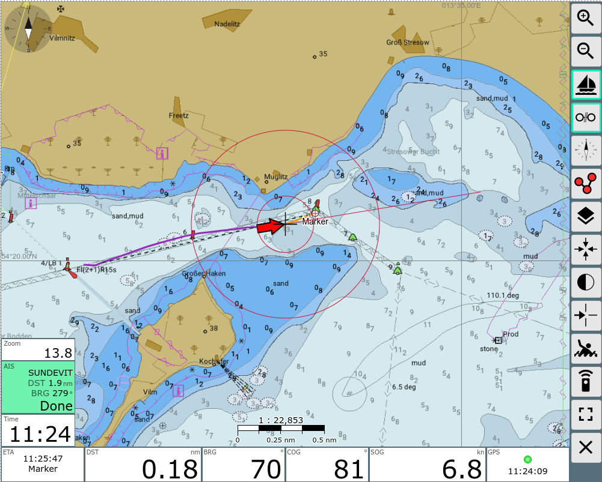

**Buttons**

|  |  |  |
| --- | --- | --- |
| Icon | Name | Funktion |
| {{BT("ZoomIn")}} | ZoomIn | Hereinzoomen |
| {{BT("ZoomOut")}} | ZoomOut | Herauszoomen |
| {{BT("LockPos")}} | LockPos | Kartenmittelpunkt auf Bootsposition setzen und dort halten (Karte bewegt sich mit dem Boot).  Nur aktivierbar bei gültiger Position. |
| {{BT("StopNav")}} | StopNav | Navigation beenden.  Nur sichtbar, wenn momentan ein Wegpunkt oder eine Route aktiv ist. |
| {{BT("WpGoto")}} | LockMarker | [Navigation starten](#waypoint).  Der aktuelle Kartenmittelpunkt (Fadenkreuz) wird zum Ziel-Wegpunkt.  Nur sichtbar, wenn momentan keine Navigation aktiv ist. |
| {{BT("CourseUp")}} | CourseUp | Karte drehen, so das die Kurs-Voraus Richtung oben ist. |
| {{BT("ToRoute")}} | ShowRoutePanel | Wechsel zum [Routen-Editor](editroutepage.md) (auch durch Klick auf eine angezeigte Route) |
| {{BT("FullScreen")}} | FullScreen | Fullscreen ein/aus (nur auf unterstützten Browsern) |
| {{BT("CenterAction")}} | CenterAction | Die gleiche Aktion wie beim Klick auf die Karte (bezogen auf den Kartenmittelpunkt - das Fadenkreuz). Zeigt die [Liste der Features](#featurelist) an dieser Position. |
| {{BT("MOB")}} | MOB | Mann über Bord (siehe [Hauptseite](mainpage.md#mob)) |
| {{BT("Overflow")}} | Overflow | Zeige eine zweite Liste von Buttons falls der Bildschirm zu klein für alle Buttons ist. Nur sichtbar, wenn unter Settings/Layout nicht "2 Button columns" ausgewählt ist |
| {{BT("OverlaysView")}} | NavOverlays | Aktivieren und Deaktivieren von [Overlays](../hints/overlays.md) |
| {{BT("Night")}} | Night | Aktivieren/Deaktivieren des Nachtmodus (ab 20210619, wenn Settings/Buttons/night mode on navpage gesetzt ist) |
| {{BT("WpLocate")}} | GpsCenter | Zentriere die Karte auf die Bootsposition (ab 20210619) |
| {{BT("Dim")}} | Dim | Dim Mode. Der Bildschirm wird abgedunkelt und alle Buttons werden inaktiv. Aufheben des Zustandes über Click auf eine beliebige Stelle auf dem Bildschirm.  Der Button ist nur unter Android oder bei Nutzung des [BonjourBrowsers](https://play.google.com/store/apps/details?id=de.wellenvogel.bonjourbrowser&hl=gsw) (Version 1.5) sichtbar.   Es wird dann auch der Bildschirm insgesamt gedimmt. Darüber kann der Stromverbrauch bei Nicht-Nutzung verringert werden - oder eine Überlast bei großer Helligkeit und hohen Temperaturen vermieden werden. |
| {{BT("RemoteChannel")}} | RemoteChannel | Auswahl des [Fernsteuerungskanals sowie des Fernsteuerungsmodus](../hints/RemoteControl.md) (senden/empfangen). |
| {{BT("MainExit")}} | Cancel | Zurück zur [Hauptseite](mainpage.md) |

Dies ist die Navigationsansicht. In der Mitte befindet sich die
Kartenansicht mit der Schiffsposition (roter Pfeil). Die gelben und
grünen Dreiecke mit Pfeilspitzen sind empfangene AIS Ziele in der Nähe
(10nm, einstellbar) mit ihrem aktuellen Kurs sowie Name oder MMSI. Die
organgefarbene Linie zeigt zum aktiven Wegpunkt. Die gepunktete Linie
zeigt den Kurs vom Start der Navigation zum Wegpunkt (Sollkurs). Die
Karte kann mit den normalen Gesten verschoben oder gezoomt werden, zum
Zoomen können auch die Buttons +/- auf der rechten Leiste benutzt
werden.

Um das Schiff kann man bis zu 3 Kreise in entsprechenden Entfernungen
einstellen um Abstände zu schätzen (Über Einstellungen->Navigation
Display, Standard 300m und 1000m).

(ab 202011xx) In Vorausrichtung ("Course Vector") kann man die Länge
der Linie in den Settings (Navigation/Boat Course Vector Length)
einstellen. Man stellt die Sekunden ein, die Länge berechnet sich dann
aus der aktuellen Geschwindigkeit (default: 10 Minuten).  Die Dicke
der Kursvektoren wird über die Einstellung für die Navigationskreise
bestimmt.

Die gleiche Einstellung gilt auch für die Kursvektoren der AIS Ziele.

Für die Ausrichtung des Schiffes und die Kursvektoren gibt es
verschiedene Modi (ab 20220421) - setzbar unter [Einstellungen](settingspage.md)->Navigation->boat
direction (siehe auch die Diskussion dazu auf [GitHub](https://github.com/wellenvogel/avnav/issues/200)):

|  |  |  |
| --- | --- | --- |
| Einstellung | Bedeutung | [Symbol-Name](../hints/usericons.md) |
| cog | Ausrichtung und Course Vector basieren auf COG | boatImage (Pfeil) |
| hdt | Ausrichtung basiert auf Heading True (fallback auf COG wenn nicht vorhanden), Course Vector auf COG. Optional HDT als gepunktete Linie (Einstellungen->navigation->add dashed vector for hdt/hdm) | boatImageHdg  (Boot) |
| hdm | Ausrichtung basiert auf Heading Magnetic (fallback auf COG wenn nicht vorhanden), Course Vector auf COG. Optional HDM als gepunktete Linie (Einstellungen->navigation->add dashed vector for hdt/hdm) | boatImageHdg  (Boot) |

In den Einstellungen kann ausserdem noch eine Erkennung für "Boot nicht
in Bewegung" aktiviert werden ([Einstellungen](settingspage.md)->Navigation->zero
SOG detect). Wenn das aktiviert ist, wird bei einer Geschwindigkeit <
0.2 kn ([Einstellungen](settingspage.md)->Navigation->zero
SOG detect below (kn)) das Boot Symbol geändert (boatImageSteady, roter
Kreis).

Folge Modus
-----------

Wenn (wie im Bild) der Schiff-Button einen grünen Rand hat ("Schiff
lock"), ist die Karten-Mitte auf die Schiffsposition fixiert und springt
immer wieder dahin zurück.

Ab Version 20230614 kann unter Einstellungen/Map "allow move when
locked" ein Verschieben der Karte im "Lock" Modus zugelassen werden.  
Hierbei kann man die Karte verschieben und nach dem Loslassen wird die
Schiff an der Stelle des Bildschirmes gehalten, wo es sich beim
Loslassen befindet.  
Allerdings wird die Position ggf. so verschoben, das das Schiff wieder
auf der Karte sichtbar ist.

Ab Version 20210619 kann die Boot-Position auch von Anfang an auf eine
beliebige andere Stelle des Bildschirmes fixiert werden. Dazu wählt man
unter [Einstellungen](settingspage.md)/Map/boat lock mode
entweder "current" oder "ask" aus.  
Bei "current" wird das Boot auf der Stelle am Bildschirm fixiert, an der
es sich befindet, wenn "Lock" aktiviert wird. Die Karte wird dann
entsprechend verschoben.  
Bei "ask" wird bei jedem "Lock" Vorgang ein Dialog gezeigt:

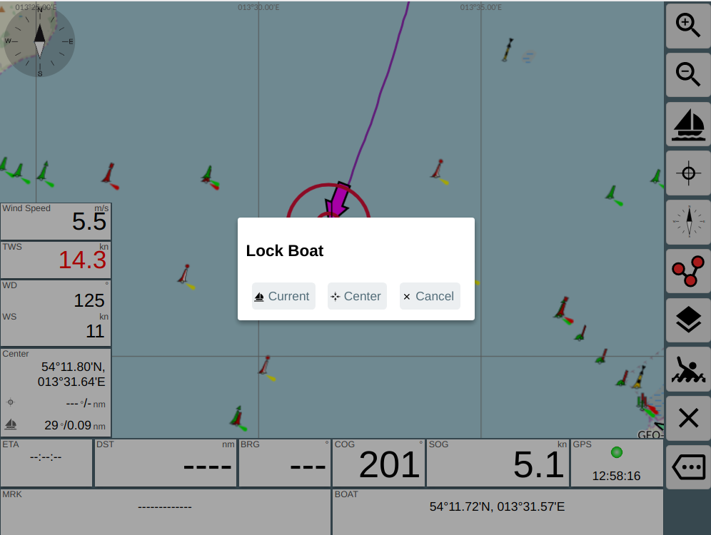  

AIS Ziele {: #ais}
------------------

AIS Ziele bis zu einer bestimmten Entfernung zur aktuellen Position
werden in der Karten zusammen mit einigen Informationen dargestellt.
Diese kann man unter [Einstellungen](settingspage.md), AIS
anpassen. Ausserdem werden einige Bewegungsvektoren und eine berechnete
Position basierend auf dem Alter der AIS Information (als Schatten)
angezeigt.  
Die Symbole für die AIS-Ziele können durch [eigene
Symbole](../hints/usericons.md) angepasst werden, bei Bedarf unterschiedlich je nach
AIS-Schiffsklasse oder navigational status. Für das eigene Boot und für
die AIS-Ziele wird ein Kurs-Vektor gezeichnet, dessen Ende die Position
nach 10 Minuten (einstellbar) markiert.

Ab 20230614 werden auch AIS Atons dargestellt (dazu muss in den [Einstellungen](settingspage.md)/AIS
"only show moving targets" ausgeschaltet und "show other" eingeschaltet
sein). Ausserdem ist es möglich eine geschätzte aktuelle Position des
AIS Ziels abhängig vom Alter der Information, Kurs und Geschwindigkeit
anzuzeigen (Einstellungen/AIS "show estimated position").  
Es kann ausserdem gewählt werden, ob die Ausrichtung des AIS Zieles nach
HDG erfolgt (sofern empfangen - Einstellungen/AIS "use heading for
direction") - sonst nach COG. Der Course Vector eines AIS Zieles wird
immer nach COG ausgerichtet.  
Es gibt unterschiedliche Symbole für die AIS Ziele - für Details siehe
unter "[Nutzerdefinierte Icons](../hints/usericons.md)".

Durch Klick auf ein AIS-Ziel (oder auf die Anzeige des nächsten Zieles
in den Anzeige-Bereichen) erhält man alle [Informationen](#aisinfo)
zu diesem Ziel und kann zur [Liste aller
AIS-Ziele](aispage.md) navigieren.

### AIS Bewegungsvektoren

Eine grundsätzliche Einführung in das Thema true und relative motion
vectors und wie diese in der Navigation verwendet werden, ist zu finden
unter

* <https://msi.nga.mil/Publications/RNMB>
  (Seite 59)
* <https://www.youtube.com/watch?v=8YUic4LdWFg>

True Motion Vectors
-------------------

AvNav stellt für AIS-Targets deren voraussichtlichen Track über Grund
dar, wenn [settings](settingspage.md)->AIS->use-course-vector
aktiviert ist. Dazu wird ausgehend von der zuletzt bekannten Position
des Targets eine Linie gezeichnet in Richtung des Kurs-über-Grund (COG)
des Targets und der Länge Fahrt-über-Grund (SOG) multipliziert mit
boat-course-vector-length. Diese Linie ist der sog. *true motion
vector*, kurz TMV.

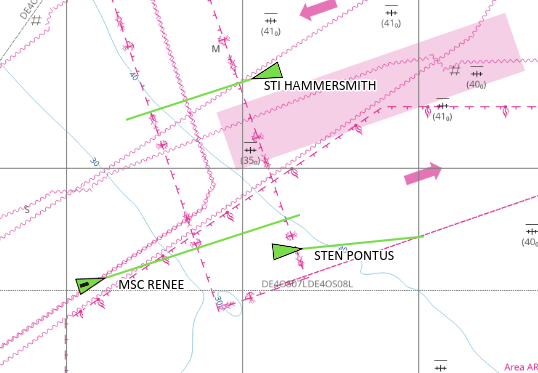

Relative Motion Vectors
-----------------------

Zusätzlich können in AvNav *relative motion vectors*
dargestellt werden. Dazu in [settings](settingspage.md)->AIS->relative-motion-vector-range
einen Wert größer als Null setzen, dann werden für Targets, die sich im
Umkreis dieser Distanz befinden zusätzlich RMVs als gestrichelte Linien
angezeigt.

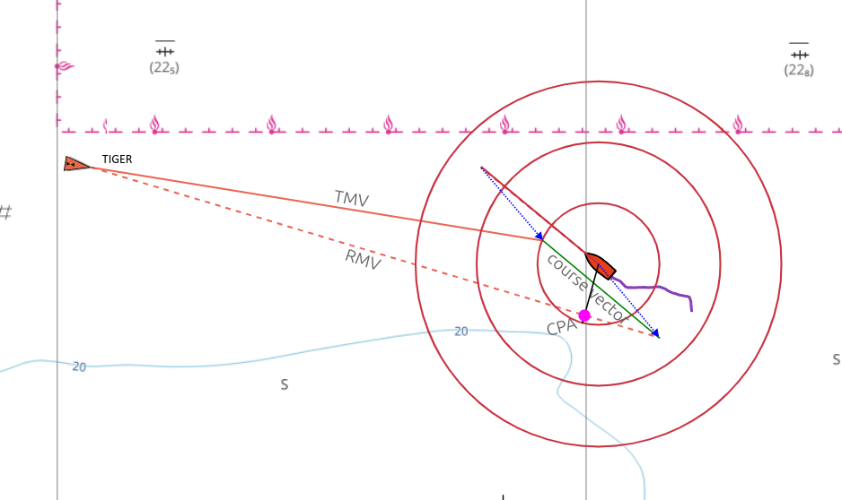

Der RMV zeigt die Bewegung des Targets *relativ* zum eigenen
Schiff, er ergibt sich als Differenz zwischen TMV und dem eigenen
Kurs-Vektor, sodass TMV, RMV und der eigene Kurs-Vektor ein Dreieck
bilden. Zeigt der RMV eines Targets direkt auf das eigene Schiff, dann
besteht die Gefahr einer Kollision. Ebenso kann man die Lage des CPA
direkt aus dem RMV ablesen, man fällt das Lot vom eigenen Schiff auf den
RMV.

Die RMVs entsprechen den Spuren, die die Targets auf einem Radarschirm
hinterlassen würden.

Gekrümmte Vektoren
------------------

Aktiviert man [settings](settingspage.md)->AIS->curved-vectors,
so wird eine eventuell in den AIS-Daten vorhandene rate-of-turn (ROT)
ausgewertet und die Drehung des Targets bei der Darstellung der Vektoren
berücksichtigt. Die TMVs und RMVs werden dann als gekrümmte Linien
dargestellt. Die gekrümmten Vektoren zeigen eine potenzielle Kollision
ggf. viel früher an als die ungekrümmten Vektoren.

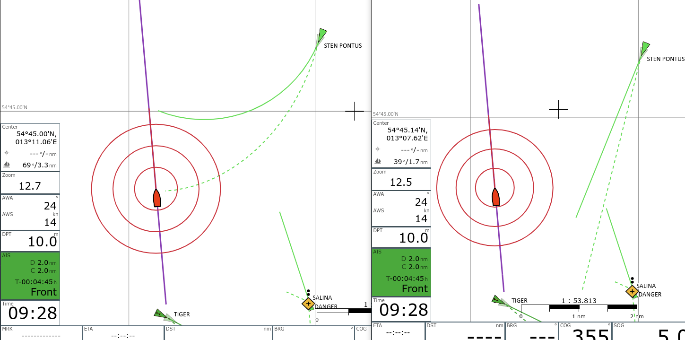

### Berechnung von CPA und Bewegungsvektoren {: #aiscomputations}

Um CPA und Bewegungsvektoren zu berechnen, benutzt AvNav die von einem
AIS Ziel empfangenen Daten (position, COG, SOG) und die Daten des
eigenen Bootes (position, COG, SOG).

Vor Version 20250723 benutzte die Berechnung die Daten der AIS Ziele
so, wie sie auf der Karten angezeigt werden und die Bootdaten von dem
Zeitpunkt, wenn die Berechnung erfolgte.

AvNav berechnet:

* Den Punkt, an dem sich die beiden Kurse treffen (unser Kurs und der
  Kurs vom AIS Ziel - beide COG)
* Den Punkt, an dem wir die minimale Distanz zum AIS Ziel haben - die
  CPA.

Es werden auch die Zeiten berechnet, um diese Punkte zu erreichen.
Negative Zeiten bedeuten dabei, dass wir an diesem Punkt bereits vorbei
sind.  
Abhängig davon wird entschieden, wie wir das Ziel passieren:

* front = wir passieren vor dem Ziel
* back = wir passieren hinter dem Ziel
* pass = wir haben das Ziel bereits passiert - oder es gibt keinen
  Begegnungspunkt - z.B. festliegendes Ziel
* done = wir haben den Kurs bereits gekreuzt und auch den Punkt mit
  dem kleinsten Abstand bereits passiert

Basierend auf der berechneten DCPA (minimale Entfernung am CPA Punkt)
und TCPA (Zeit bis zum CPA Punkt) setzt AvNav eine Warnung für das Ziel,
wenn die Werte unter den konfigurierten Schwellwerten liegen.

#### Priorität {: #aispriority}

Um zu entscheiden, welches Ziel im AisTargetWidget angezeigt wird und
für die Sortierung in der [AIS liste](aispage.md) wird für
jedes Ziel eine Priorität berechnet.  
Die Priorität von hoch zu niedrig:

1. Ziele mit Warnung (d.h. CPA < warning CPA und TCPA < warning
   TCPA aber > 0)  
   Diese werden nach TCPA sortiert, niedrigste TCPA ganz oben.
2. Andere Ziele sortiert nach kleinstem (dx)²+(dy)² .  
   Für TCPA < 0 (also kleinster Abstand schon in der Vergangenheit)
   dx=dy=distance/warningDistance.  
   Für TCPA >= 0 dx=tcpa/warningTime, dy=cpa/warningDistance

Auf diese Weise lassen sich die Ziele nach ihrer Bedeutung für die
Navigation sortieren.

Die bisherige (vor Version 20250723) genutzte Berechnung hat einige
Nachteile:

Ein AIS Ziel befindet sich normalerweise in Fahrt, und AIS Nachrichten
werden nur in relativ großen Zeitabständen gesendet/empfangen. Ausserdem
lädt der Anzeigeteil von AvNav (im Browser) die AIS Daten nur in
bestimmten Abständen (settings/UpdateTimes/AIS - default 5 Sekunden).
Damit werden die AIS Symbole auf der Karte an einer Position
dargestellt, die sie einige Zeit in der Vergangenheit hatten. Und auch
die darauf basierenden (CPA/Distance) Berechnungen sind damit nicht ganz
korrekt - sie nutzen die Boot position/course/speed zur Zeit der
Berechnung, und AIS Ziel position/course/speed von einem Zeitpunkt an
dem die Nachricht vom Ziel versendet wurde.

Wenn man eine typische Situation hat mit einem Ziel, dem man sich
annähert, wird man eine ständige Änderung in den berechneten CPA Werten
erleben - auch wenn das Boot und das Ziel Kurs und Geschwindigkeit
beibehalten.

Ab Version 20250723 bietet AvNav die Option (aktiv als default,
settings/AIS/CPA from estimated), CPA und Bewegungsvektoren aus einer
geschätzten Position des AIS Zieles zu berechnen. Diese Position ist die
selbe, die als Schattensymbol auf der Karte dargestellt wird. Die
Berechnung nimmt dabei an, dass das AIS Ziel Kurs und Geschwindigkeit
beibehält und berücksichtigt das Alter der AIS Information.

Dieses Alter berücksichtigt die folgenden Zeiten:

1. Die Zeit, die eine AIS Nachricht im AvNav server vom Empfang bis zur
   Abholung durch den Browser verbringt. Wenn die Daten von  [SignalK](../hints/CanboatAndSignalk.md) 
   kommen, wird auch die Zeit berücksichtigt, die die Daten bereits in
   SignalK verbracht haben.
2. Die Zeit vom Empfang im Browser bis zur Berechnung (Maximum: AIS
   update time - settings/UpdateTimes/AIS - 5s).

Wenn man diese Berechnung nutzt, erhält man normalerweise einen
konstanten CPA, wenn Boot course/speed und AIS Ziel course/speed gleich
bleiben. In den meisten Fällen erhält man damit ein besseres Resultat.

Es gibt allerdings 2 Probleme, die man damit nicht lösen kann:

1. Wenn die Berechnung der Zeit zwischen dem Empfang der AIS Nachricht
   und der Abholung durch den Browser nicht korrekt ist (z.B. fehlende
   Zeitsynchronisation zwischen AvNav und SignalK), wird man immer
   fehlerhafte Resultate bekommen. Problematisch ist, dass man das u.U.
   nicht bemerkt, da der Fehler über die Zeit konstant bleibt.
2. Wenn das AIS Ziel Kurs oder Geschwindigkeit verändert, ist die
   geschätzte Position falsch. Das ist allerdings im Normalfall nur ein
   temporäres Problem solange diese Änderung andauert.  
   Im Prinzip könnte man auch ROT (rate of turn) eines Zieles
   berücksichtigen - allerdings ist es nicht sehr wahrscheinlich, dass
   ROT über eine längere Zeit konstant ist - daher wird das nicht
   benutzt.

Da beide Berechnungen ihre Limitierungen haben, kann der Nutzer am Ende
entscheiden, welche genutzt werden soll.

Ab Version 20250723 werden alle AIS Berechnungen in einem separaten
Thread (worker) im Browser durchgeführt und werden bei jeder
Positionsänderung wiederholt. In älteren Versionen wurden die
Berechnungen nur ausgeführt, wenn neue AIS Daten abgerufen wurden.

Anzeigen (Widgets)
------------------

Links befinden sich (von oben nach unten):

* Die aktuelle Zoom-Stufe der Karte (bei aktiviertem Auto Zoom ist in
  Klammern die gewünschte)
* Das nächste AIS Ziel (ggf. rot bei Warnung) oder das ausgewählte AIS
  Ziel (gelb)
* Die aktuelle Uhrzeit

Die Darstellung des nächsten AIS Zieles (geringste momentane
Entfernung) färbt sich rot, wenn eine CPA von 500m (einstellbar)
unterschritten wird. Gelb bedeutet, dass nicht das nächste Ziel, sondern
ein separat ausgewähltes Ziel (siehe unten AIS) angezeigt wird. Ein
Klick auf diese Fläche oder ein AIS Ziel in der Feature Liste (nach
Klick auf die Karte) [AIS Info](#aisinfo)  .

(ab 202011xx) Die verwendeten Symbole für das Boot und die AIS Ziele
können bei Bedarf über eine Datei [images.json](../hints/usericons.md)
angepasst werden. Ausserdem können die AIS Symbole in den Einstellungen
(AIS/Icon Scale) in ihrer Größe verändert werden, ein Rand kann
ebenfalls hinzugefügt werden (AIS/Border Width). Falls die Berechnungen
der AIS Kursvektoren zu aufwändig ist (Browser wird zu langsam), kann
sie in den Einstellungen abgeschaltet werden (AIS/AIS Use Course
Vector).

Im unteren Bereich der Navigationsseite befindet sich die Anzeige der
wichtigsten Navigationsdaten ("Widgets"). Links die Daten des aktuellen
Wegpunktes (Marker):

* Position
* ETA
* Kurs
* Distanz (nm)

Danach folgen die Schiffsdaten:

* Kurs
* Geschwindigkeit (kn)
* Position
* aktuelle (lokale) Zeit vom GPS
* GPS Indikator: grün – GPS Daten vorhanden, rot: keine Daten

Je nach Breite des Bildschirms und den Einstellungen für die
Schriftgröße der "Widgets" werden bis zu 2 Reihen an Daten angezeigt
(unter Settings einstellbar). Daten, die nicht mehr auf den Bildschirm
passen, werden unterdrückt.

Für die Schiffsposition, Kurs und Geschwindigkeit kann eine
Mittelwertbildung eingestellt werden (Settings->Navigation). Wenn
diese eingestellt ist, sind die Bezeichner rot.

Die Anzeigen auf der Seite können über den [Layout
Editor](../hints/layouts.md) angepasst werden.

Ein Klick auf die rechten unteren Anzeigen führt zum [Dashboard](dashboardpage.md).

Ein Klick auf die
linke Seite (Wegpunkt) zeigt einige zusätzliche Wegpunkt-Buttons.

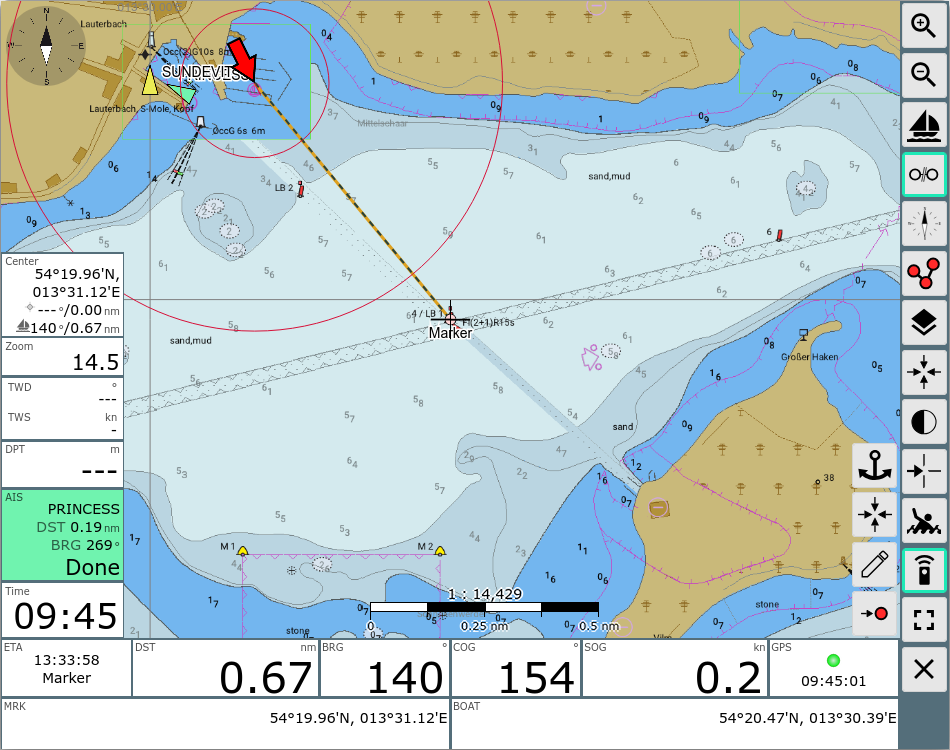

|  |  |  |
| --- | --- | --- |
| Icon | Name | Funktion |
|  | AnchorWatch | Einschalten der Ankerwache (siehe [Dashboard](dashboardpage.md#anchorwatch)) |
| {{BT("WpLocate")}} | WpLocate | Zentrieren des Mittelpunktes auf den Wegpunkt |
| {{BT("WpEdit")}} | WpEdit | Bearbeiten des Wegpunktes.  Im angezeigten Dialog kann der Name und die Position des Wegpunktes editiert werden |
| {{BT("NavRestart")}} | NavRestart | Restarte die Navigation zum aktuellen Wegepunkt. Damit wird insbesondere der Soll-Kurs und damit die XTE Berechnung neu gestartet.  Wird nur angezeigt, wenn eine Navigation aktiv ist. |

Falls momentan eine Route aktiv ist, werden etwas andere Buttons beim
Klick auf die Wegpunkt-Daten angezeigt.

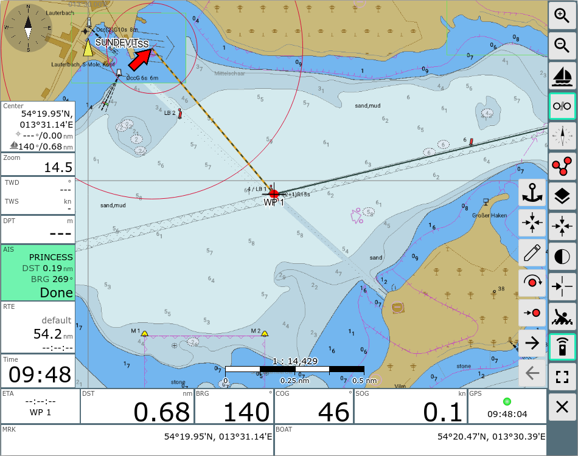

Die zusätzlichen Buttons haben folgende Funktionen

|  |  |  |
| --- | --- | --- |
| Icon | Name | Funktion |
| {{BT("NavNext")}} | NavNext | Navigiere zum nächsten Wegpunkt der Route |
| {{BT("WpNext")}} | WpNext | Zentriere den Kartenmittelpunkt auf den nächsten Wegpunkt |
| {{BT("WpPrevious")}} | WpPrevious | Zentriere den Kartenmittelpunkt auf den vorigen Wegpunkt |
| {{BT("NavRestart")}} | WpGoto | Wenn man mit den  {{BT("WpNext")}} oder {{BT("WpPrevious")}} Buttons eine Punkt in der Route selektiert hat, der nicht der aktuelle Zielpunkt ist, kann man direkt die Navigation zu diesem Punkt starten. |
| {{BT("NavRestart")}} | NavRestart | Restarte die Navigation zum aktuellen Wegepunkt. Damit wird insbesondere der Soll-Kurs und damit die XTE Berechnung neu gestartet.  Wird nur angezeigt, wenn eine Navigation aktiv ist. |

Wenn eine Route aktiv ist, hat man wie im Bild links eine Anzeige der
Daten für die aktuelle Route (Name,verbleibende Distanz, Ankunftszeit).

In diesem Modus erfolgt eine automatische Weiterschaltung zum nächsten
Wegpunkt, wenn die folgenden Bedingungen erfüllt sind:

* Das Boot befindet sich im "Fangbereich" (default 200m -
  settings->route->approach)
* Die weitere Bedingung entsprechend des eingestellten modes
  (early/90/late) ist erfüllt - siehe [Wegepunkt
  Weiterschaltung](../quickstart.md#nextwp).

Die Anzeige der Routen-Parameter wird rot und zeigt den Kurs zum
nächsten WP an, wenn das Boot im "Fangbereich" ist. Ausserdem erfolgt
eine Alarmierung mit einem akustischen Signal und einer Anzeige.

Falls keine automatische Weiterschaltung erfolgt (z.B. weil man nicht
dicht genug am WP ist), kann man auf den Wegpunkt klicken und mit dem
dann sichtbaren {{BT("NavNext")}} Button weiterschalten. Danach die Karte ggf.
wieder auf die Bootposition fixieren (LockPos).

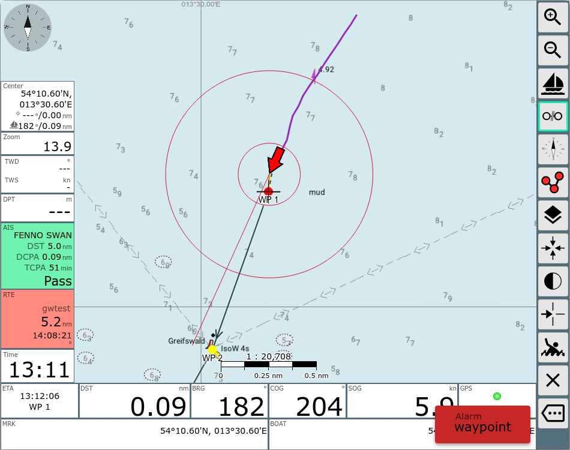

Feature Info {: #featurelist}
-----------------------------

Wenn man auf die Karte klickt (und settings/map/"Feature Info on Click"
aktiviert ist) - oder man den  {{BT("CenterAction")}} CenterAction klickt wird ein Dialog mit
den an dieser Position verfügbaren Features angezeigt.  
Das können sein:

* AIS Targets
* die aktuelle Route
* der aktuelle track
* die aktuelle Messlinie
* das Boot
* ein (oder mehrere) Overlays
* die aktuelle Karte

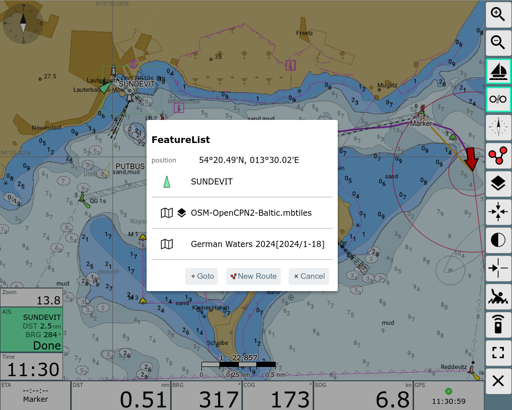

In diesem Dialog kann man sofort eine einfache Wegepunkt-Navigation
starten ("Goto") oder eine neue Route mit dem angeklickten Punkt als
Startpunkt erzeugen ("New Route").

Beim Klick auf eines der angezeigten Features wird ein neuer Dialog mit
detaillierten Informationen und weiteren Aktionen geöffnet.

### AIS Ziele {: #aisinfo}

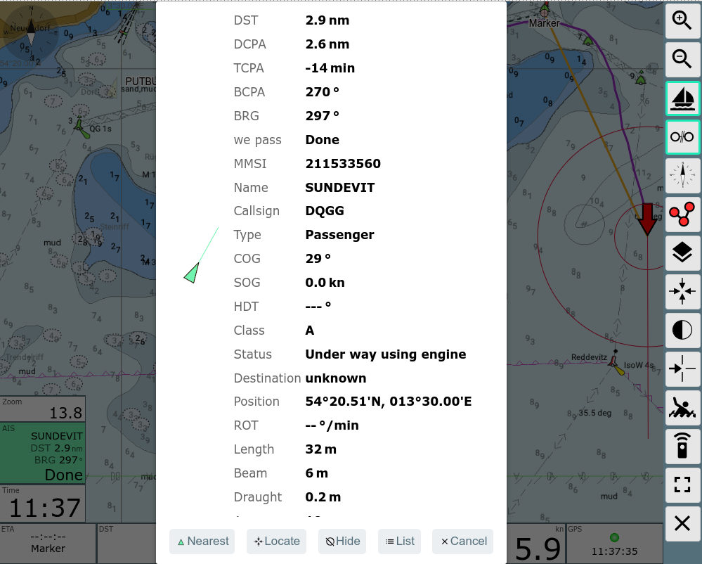

Die AIS info zeigt detaillierte Informationen zu einem AIS Ziel an. Die
folgenden Aktionen stehen zur Verfügung:

|  |  |  |
| --- | --- | --- |
|  | Name | Action |
| {{BT("AisNearest")}} | AisNearest | Kehre zur normalen AIS Funktion zurück bei der im AisTargetWidget das Ziel mit der höchsten Priorität angezeigt wird und ein Tracking beendet wird. |
| {{BT("WpLocate")}} | AisInfoLocate | Verfolge (Tracking) das ausgewählte AIS Ziel und zentriere die Karte auf dieses Ziel. |
| {{BT("DBDisable")}} | AisInfoHide | Verberge das Ziel für eine gewisse Zeit (settings/ais/hide time) |
|  | AisInfoList | zeige die  [AIS listen Seite](aispage.md) |
| {{BT("MainExit")}} | Cancel | Schliesse den Dialog |

### Vektor Karten

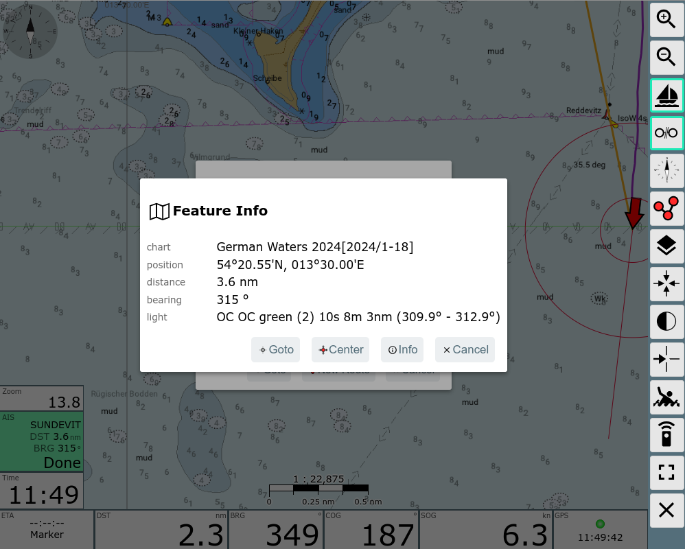

Wenn es ein wichtiges Objekt an der Position gibt (Tonne, Licht), wird
eine Zusammenfassung angezeigt. Mit "Info" bekommt man eine detaillierte
Auflistung der Kartenobjekte.

### Aktueller Track

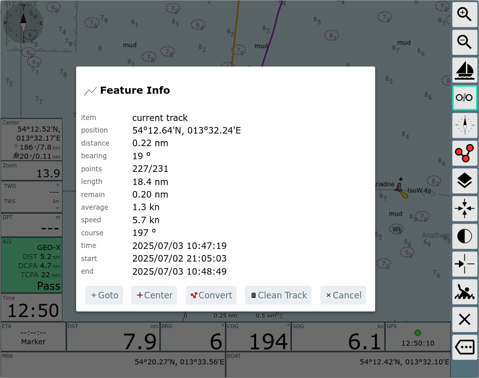

Wenn man in die Nähe des aktuellen Tracks geklickt hat, und dieser in
der Feature Liste enthalten ist, können wir die Feature Info für ihn
bekommen.  
Die verfügbaren Aktionen:

|  |  |  |
| --- | --- | --- |
|  | Name | Action |
| {{BT("WpGoto")}} | goto | Starte eine Wegepunkt Navigation zum nächsten Punkt im Track. |
|  | center | Zentriere die Karten zum nächsten Punkt im Track |
| {{BT("ToRoute")}} | toroute | Wandle den aktuellen Track in eine Route um(siehe [Tracks zu Routen](../hints/TracksToRoutes.md)) |
| {{BT("SettingsDefaults")}} | Delete | Lösche den aktuellen Track. Diese Aktion löscht die Track-Anzeige und benennt die aktuelle Trackdatei um (z.B. von 2025-07-03.gpx zu 2025-07-03-1.gpx). Zusätzlich werden potentiell auch die Trackfiles vergangener Tage umbenannt, wenn diese Daten enthalten, die im aktuellen Track angezeigt würden. Das Track-Schreiben wird danach normal fortgesetzt. |
| {{BT("MainExit")}} | Cancel | Schliesse den Dialog |

Aktuelle Route
--------------

Wenn wir auf einen Punkt der aktuellen Route klicken, wird sie in der
Feature Liste angezeigt. Mit Klick darauf bekommen wir einen Route
Feature Info Dialog.

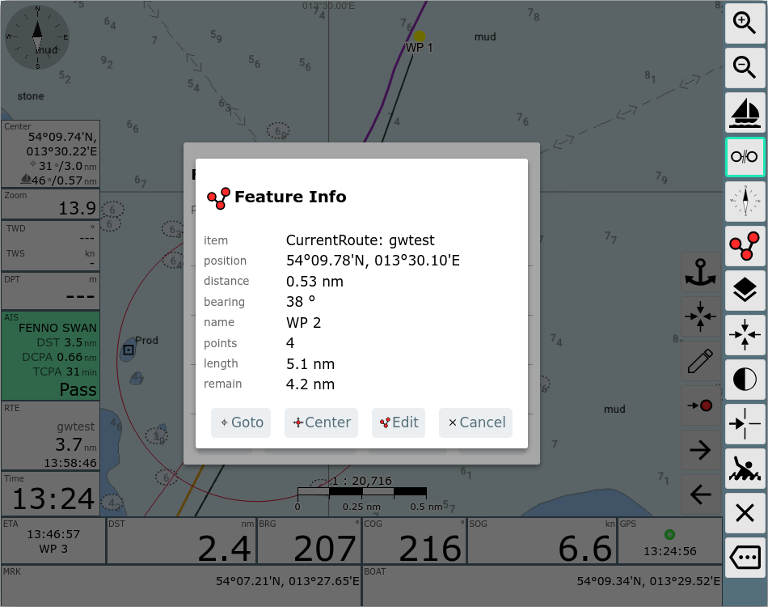

|  |  |  |
| --- | --- | --- |
|  | Name | Action |
| {{BT("WpGoto")}} | goto | Starte eine Routen-Navigation ab dem angezeigten Punkt der Route. |
|  | center | Zentriere die Karte auf den angezeigten Punkt der Route. |
| {{BT("ToRoute")}} | editRoute | Öffne den [Routeneditor](editroutepage.md) mit der aktuellen Route |
| {{BT("MainExit")}} | Cancel | Schliesse den Dialog. |

### Messung

Mit einem Klick auf die Karten oder den  {{BT("CenterAction")}} CenterAction button kann man eine Messung
starten/erweitern. Diese Funktion ist nur verfügbar, wenn die Karte
nicht auf die Boot-Position gelockt ist.

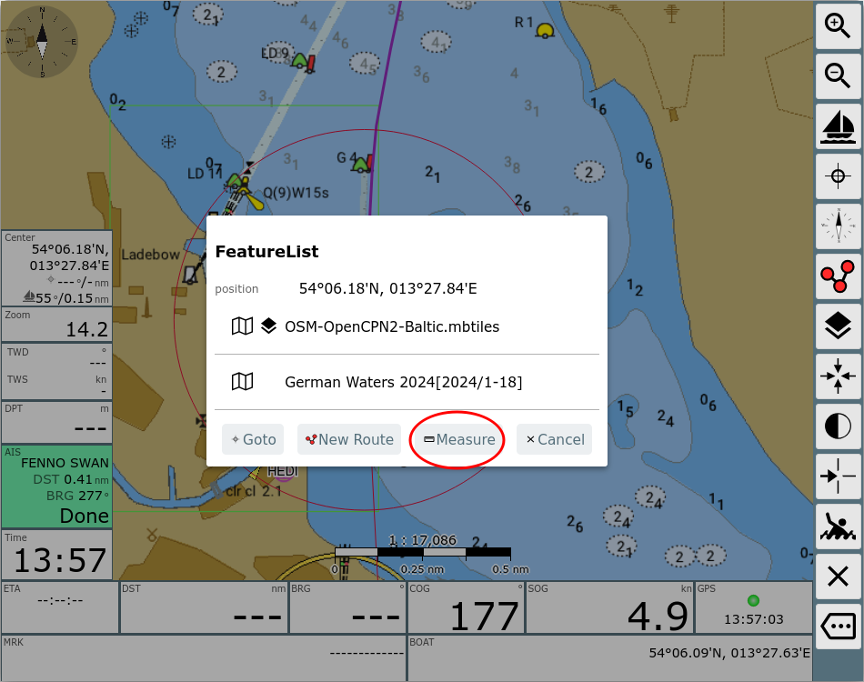

Mit Klick auf den "Measure" button wird auf der aktuellen Position ein
Icon platziert (see usericons) und zum Kartenmittelpunkt wird eine Linie
angezeigt mit der Richtung und dem Abstand vom Startpunkt. Auch im
Center Widget werden die entsprechenden Daten angezeigt.

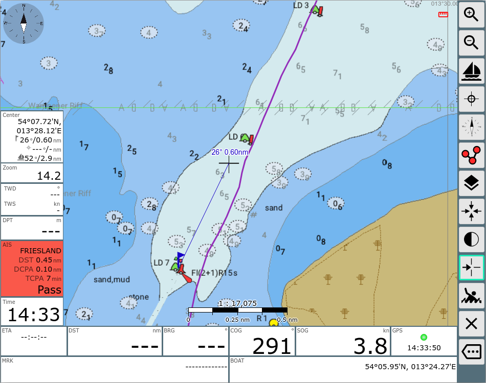

Bei erneutem Klick auf den  {{BT("CenterAction")}} CenterAction (oder auf die Karte) erhält
man Aktionen um die Messung zu beenden oder zu erweitern. Man kann die
Messung auch durch Klick auf das kleine rote Messungs-Icon oben rechts
auf der Karte beenden.

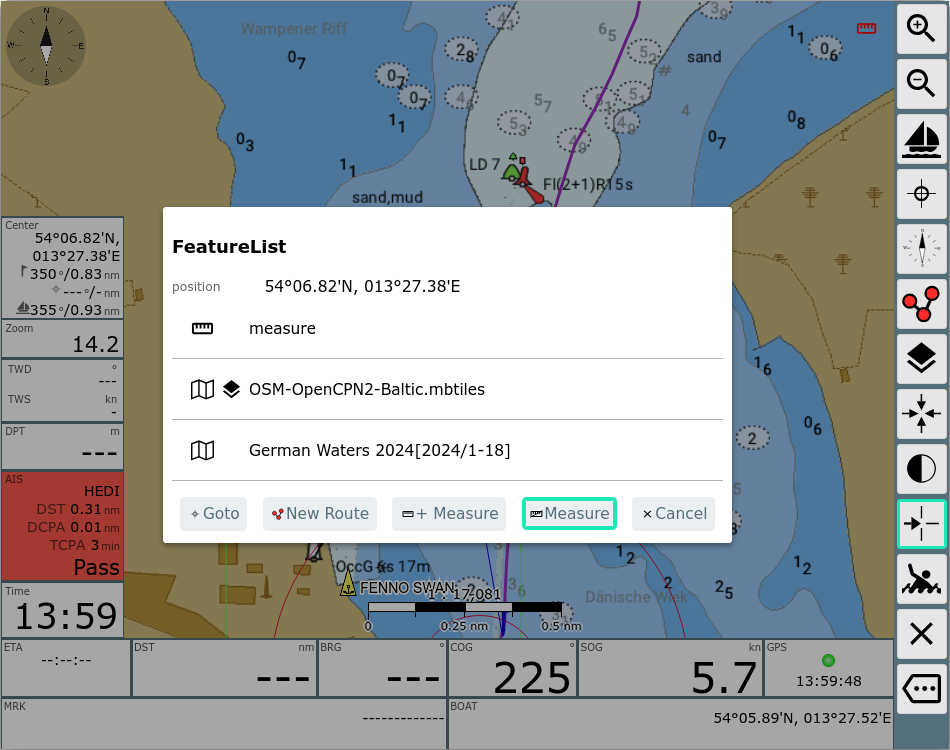

Actions:

|  |  |  |
| --- | --- | --- |
|  | Name | Action |
| {{BT("Measure")}}+ | Measure | +Measure: Erweitere die Messung um den aktuellen Punkt. Die Anzeige summiert die Distanzen. |
| {{BT("MeasureOff")}} | MeasureOff | Beende die aktive Messung. |

Wenn es eine aktive Messung gibt, und man in der Feature Liste auf
"measure" klickt, erhält man die Option, die Messung in eine Route
umzuwandeln.

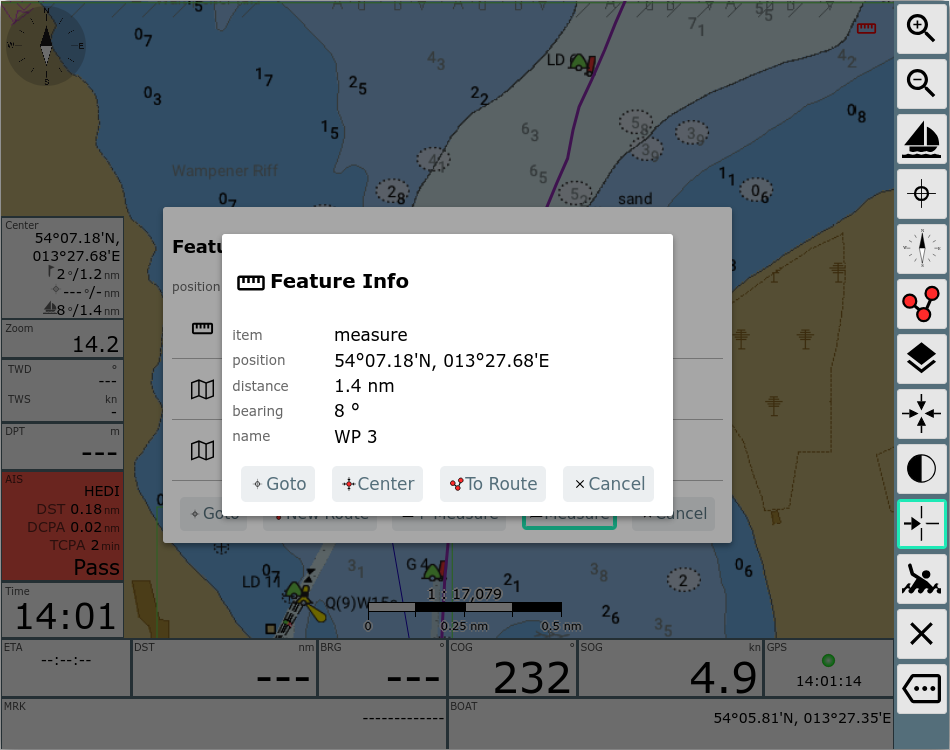

Spezielle Funktionen
--------------------

### Simple Wegpunkt Navigation {: #waypoint}

Schritte:

1. Unlock Boot (falls an)
2. Stop Nav
3. Karte verschieben bis Mittelpunkt (Fadenkreuz) auf gewünschter
   Position (Zoom nutzen)
4. LockMarker
5. Lock Boot

Alternative Schritte:

1. Klick auf die Karten oder {{BT("CenterAction")}} CenterAction button. Die Feature Liste
   wird angezeigt.
2. Klick auf "Goto"

### Peilungen

Wenn man einen Wegpunkt aktiv hat (Marker Button grün) und die Karte
nicht auf das Schiff "gelockt" ist (Schiffsbutton nicht grün), wird beim
Bewegen der Karte ein Fadenkreuz im Zentrum gezeigt, und links erscheint
eine Anzeige des aktuellen Abstandes vom Marker bzw. Schiff zum
Kartenmittelpunkt. Damit kann man einfache Peilungen machen - das
Peilziel auf den Mittelpunkt verschieben und die Peilung ablesen.

Für das Starten einer Route wechselt man zunächst mittels {{BT("ToRoute")}}zum [Routen
Editor](editroutepage.md).