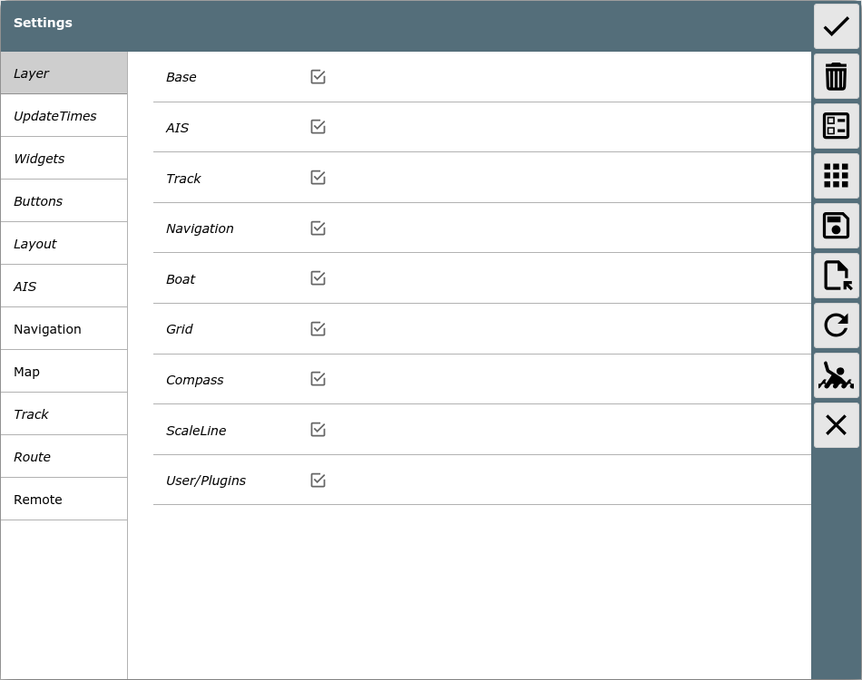

AvNav Einstellungsseite

Die Einstellungsseite
=====================

Von der [Hauptseite](mainpage.md) erreicht man über {{BT("ShowSettings")}}die Einstellungsseite.

Buttons

|  |  |  |
| --- | --- | --- |
| Icon | Name | Funktion |
| {{BT("DBUpdate")}} | SettingsOK | Akzeptieren der Änderungen und zurück zur vorigen Seite |
| {{BT("SettingsDefaults")}} | SettingsDefaults | Rücksetzen aller Einstellungen auf Default-Werte |
| {{BT("LayoutFinished")}} | SettingsLayout | Start des [Layout Editors](../hints/layouts.md) |
| {{BT("DBUserApp")}} | SettingsAddons | Wechsel zur [Konfiguration von User Apps](addonconfigpage.md) |
| {{BT("SettingsSave")}} | SettingsSave  (ab 20220225) | Speichern der aktuellen Einstellungen auf dem Server |
| {{BT("SettingsLoad")}} | SettingsLoad  (ab 20220225) | Laden von Einstellungen vom Server (eine Auswahl wird angezeigt) |
| {{BT("StatusRestart")}} | SettingsReload | Lade AvNav im Browser erneut |
| {{BT("MOB")}} | MOB | Mann über Bord (siehe [Hauptseite](mainpage.md#mob)) |
| {{BT("MainExit")}} | Cancel | zurück zur vorigen Seite, Verwerfen der Änderungen |

Auf dieser Seite können viele Parameter gesetzt werden, die die
Darstellung beeinflussen. Alle diese Einstellungen werden für den
aktuell genutzten Browser (und die aktuelle URL von AvNav) gespeichert. Sie sind
also nicht auf dem Server gespeichert, sondern im Browser.

Die meisten Werte können separat auf ihre Defaultwerte zurückgesetzt werden -
das globale Rücksetzen kann über {{BT("SettingsDefaults")}}erfolgen. Wenn die Seite ohne Speichern
verlassen werden soll, erfolgt eine Rückfrage.

Viele Einstellungen sollten selbst erklärend sein, einige etwas
speziellere Einstellungen werden hier beschrieben.

|  |  |  |  |
| --- | --- | --- | --- |
| Kategorie | Wert | Beschreibung | Default |
| Buttons | auto hide buttons on NavPage | Verberge die Button-Leiste auf der Navigationsseite nach einer einstellbaren Zeit  Ein Klick auf den rechten Rand bringt dann die Button-Leiste zurück. | aus |
| Buttons | auto hide buttons on Dashboard Pages | Verberge die Button-Leiste auf den Dashboard-Seiten nach einer einstellbaren Zeit  Ein Klick auf den rechten Rand bringt dann die Button-Leiste zurück. | aus |
| Buttons | time(s) to hide buttons on enabled pages | Zeit (in Sekunden) für das Verbergen der Button Leiste auf der Navigationsseite oder den Dashboard-Seiten | 30 |
| Buttons | show shade when buttons hidden | Zeige einen abgedunkelten Bereich auf der rechten Seite, wenn die Button-Leiste unsichtbar ist. Das markiert den Bereich auf der Karte, der geklickt werden muss, um die Button-Leiste zurück zu holen. | an |
| Layout | red icons in title | Zeige kleine rote Icons in der oberen rechten Seitenecke für Ankerwache und den "disconnected mode" | on |
| Layout | title icons on dashboard page | Zeige die roten Icons auch auf den Dashboard-Seiten | on |
| Layout | start with last split mode | Wenn aktiviert startet die WebApp im gleichen Modus (geteilt/nicht geteilt) wie beim letzten Verlassen (seit 20240616). | off |
| Navigation | boat direction | Bestimmt, welcher NMEA Wert für die Anzeige der Richtung des Boot-Symbols genutzt wird. COG, HDT,HDM. Wenn HDT oder HDM gewählt wurde, aber der Wert nicht verfügbar ist, wird COG genutzt. Der Kursvektor wird in jedem Falle durch COG bestimmt!  Ab 20220421: Wenn HDT oder HDM genutzt wird, wird das Boot als Boots-Symbol dargestellt, bei COG als Pfeil.  Kann durch [user icons](../hints/usericons.md) angepasst werden. | COG |
| Navigation | add dashed vector for hdt/hdm | Zeige einen gestrichelten Kursvektor für HDT/HDM am Boot-Symbol an, wenn HDT/HDM für "boat direction" gewählt wurde | an |
| Navigation | Rotation Tolerance | Wenn Course Up gewählt wurde, wird die Kartenausrichtung nicht schnellstmöglich an den aktuellen Kurs angepasst, solange die Kurs-Änderung unter dem hier einzustellenden Wert bleibt. Das führt zu einer deutlich ruhigeren Anzeige. | 15 |
| Navigation | zero SOG detect  (20220421) | Wenn das Boot nach COG ausgerichtet wird, kann entschieden werden, ab welchem Mindestwert für SOG keine Kurs-Vektoren mehr gezeigt werden. Dann wird das Boot als Kreis dargestellt | aus |
| Navigation | zero SOG detect below  (20220421) | Schaltet die Anzeige des Kursvektors und die Kartenausrichtung ab, wenn SOG unter dem angezeigten Wert bleibt. Das Boot wird dann als Kreis dargestellt (nur, wenn "zero SOG detect" angeschaltet ist) |  |
| AIS | Class B rel size | Class B AIS Ziele können kleiner (oder grösser) als andere Ziele dargestellt werden. | 0.6 |
| AIS | reduce details in AIS list | In der Listen-Anzeige kann die Menge der angezeigten Informationen pro Ziel begrenzt werden. Besonders empfehlenswert, wenn auf langsamen Mobilgeräten die Anzeige der Liste träge wird. | aus |
| AIS | First AIS label  Second AIS label  Third AIS label | Auswahl der Informationen, die in der Nähe eines AIS Zieles auf der Karte gezeigt werden sollen. | first: name/mmsi |
| AIS | only show moving AIS targets | Wenn eingeschaltet, werden nur bewegliche AIS Ziele angezeigt | aus |
| AIS | min speed (kn) for AIS target display | nur wenn "only show moving AIS targets" aktiv ist - Die minimale Geschwindigkeit, um ein AIS Ziel als bewegt zu definieren. | 0.5kn |
| Map | automatic zoom | Wenn die Karte mit der Boot-Position verschoben wird, wird der Zoom angepasst, wenn sie in einen Bereich bewegt wird, auf dem z.B. auf dem aktuellen Zoom Level keine Kacheln vorhanden sind. | an |
| Map | start with last map | Wenn aktiv, zeigt die WebApp beim Aufruf direkt die [Navigationsseite](navpage.md) mit der zuletzt genutzten Karte (seit 20240616). | aus |
| Map | float map behind buttons | Wenn dieser Schalter aktiv ist, "schweben" die Buttons und Anzeigen über der Karte und haben keinen dunklen Hintergrund. | aus |
| Map | Increase Fonts on High Res | Vergrößere die Symbole und Texte auf hochauflösenden Displays | an |
| Map | scale the map display | Manche Rasterkarten haben eine sehr feine Darstellung, so dass u.U. Schrift schlecht lesbar ist. Mit dieser Einstellung kann die Anzeige der Karten-Kacheln vergrößert (oder auch verkleinert) werden, um sie an die eigenen Bedürfnisse anzupassen. | 1 |
| Map | zoom up lower layers | Wenn in einer Karte für den aktuell gewählten Zoom-Level keine Kacheln vorhanden sind, werden niedriger aufgelöste Kacheln geladen und entsprechend vergrößert. Da das jeweils neue Abfragen zum Server erfordert, kann das u.U. die Performance negativ beeinflussen. Der Wert gibt an, wieviele kleinere Zoom-Level probiert werden, um eine geeignete Kachel zu finden. | 4 |
| Map | zoom up lower layers for online sources | Das gleiche Verhalten wie "zoom up lower layers" für Karten, die direkt aus dem Netz geladen werden (wirkt auch für o-charts). In den meisten Fällen macht es für solche Quellen keinen Sinn - daher im default aus (0). | 0 |
| Map | Click Tolerance | Der "Einfangbereich" in Pixeln für den Click auf Kartenobjekte. Ein grosser Bereich führt u.U. dazu, dass die falschen Objekte angeklickt werden. Ein zu kleiner Bereich macht den Klick sehr mühsam auf Touch-Geräten. | 60 |
| Map | lock boat mode | Hier kann das Verhalten des Lock Buttons {{BT("LockPos")}} auf der Navigationsseite beeinflusst werden, d.h. an welcher Stelle auf dem Bildschirm das Boot festgehalten werden soll.  center: Bildschirm-Mitte  current: aktuelle Position des Bootes  ask: zeige einen Auswahldialog an | center |
| Route | Approach | Entfernung zum Wegpunkt (in Metern), ab der ein potenzielles Weiterschalten zum nächsten Wegpunkt erfolgt, wenn:  - die Entfernung zum Wegepunkt  zunimmt  - die Entfernung zum nächsten Wegepunkt abnimmt |  |
| Remote | ... | Siehe die [Beschreibung](../hints/RemoteControl.md) |  |