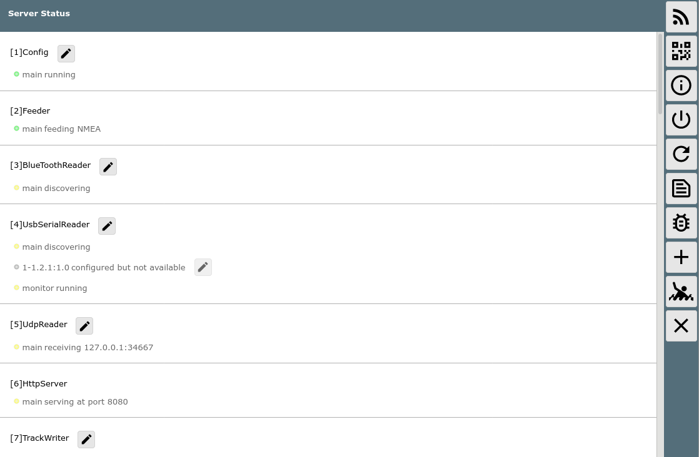
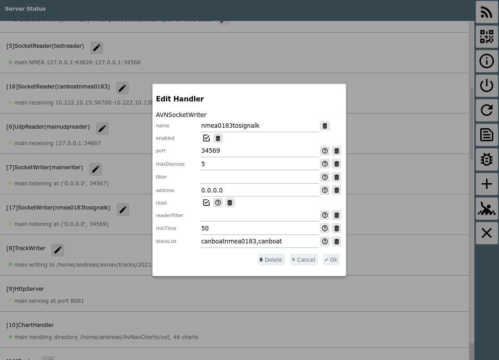

AvNav Statusseite

Die Server/Status Seite
=======================

Von der [Startseite](mainpage.md) kann man über  
die Server/Status-Seite erreichen – hier werden interne
Status-Informationen des Servers angezeigt.

Buttons

|  |  |  |
| --- | --- | --- |
| Icon | Name | Funktion |
|  | StatusWpa | Zur [Wifi Konfiguration](wpapage.md) für die Verbindung mit einem externen WLAN  (nicht unter Android, nur sichtbar wenn konfiguriert) |
| {{BT("StatusAddresses")}} | StatusAddresses | Zur [Anzeige der Server Adressen](addresspage.md). Es werden QR codes angezeigt, die sich einfach mit einem anderen Gerät scannen lassn, um dieses zu verbinden. |
| {{BT("StatusAndroid")}} | StatusAndroid | Zu den [Android Einstellungen](../android/android.md) wechseln (nur Android) |
| {{BT("StatusShutdown")}} | StatusShutdown | Starte ein Herunterfahren des Servers (nicht Android). Der Server wird geordnet heruntergefahren.  Es erfolgt eine Sicherheitsabfrage. Danach sollte gewartet werden, bis die Titelzeile sich rot färbt. |
| {{BT("StatusRestart")}} | StatusRestart | Restart der AvNav Server Software (neu 20210322, nicht Android) |
| {{BT("StatusLog")}} | StatusLog | Anzeige des Server Logs (ca. 300000kByte vom Ende), auch ein Download ist möglich (neu 20210322, nicht Android) |
| {{BT("StatusDebug")}} | StatusDebug | Anzeige eines Dialogs um für eine gewisse Zeit den debug Modus im Server anzuschalten. Ausserdem kann ein Filter für die Log-Ausgabe gesetzt werden. (nicht Android) |
| {{BT("MainInfo")}} | MainInfo | Anzeige von Lizenz- und Datenschutz-Informationen |
| {{BT("StatusAdd")}} | StatusAdd | Hinzufügen eines neuen Handlers (z.B. serieller Input/Output, Socket Verbindung,...) |
| {{BT("MOB")}} | MOB | Mann über Bord (siehe [Hauptseite](mainpage.md#mob)) |
| {{BT("MainExit")}} | Cancel | zurück zur vorigen Seite. |

In der Liste werden die Status Informationen der verschiedenen
Bestandteile des Servers angezeigt.  
Man kann hier erkennen, ob z.B. Verbindungen vorhanden sind, ob NMEA Daten
empfangen werden oder ob bestimmte Vorgänge ablaufen. Das ist insbesondere
zur Fehlersuche wichtig.  
Die Seite aktualisiert sich ständig.

Server Konfiguration {: #serverconfig}
--------------------------------------

Neu 20210322, Android ab 20210424 - siehe [Android-Beschreibung.](../android/android.md#MuxConfig)

Der Server hat eine Reihe von internen "Handlern". Die meisten können auf
dieser Seite konfiguriert werden. Dazu nutzt man {{BT("WpEdit")}}neben der Status Information. Das erzeugt
einen Dialog um die Einstellungen des Handlers anzupassen.

Für die meisten Einstellungen ist ein Hilfe Button verfügbar, der eine
kurze Erklärung liefert. Mit dem {{BT("SettingsDefaults")}}Button kann man einen Wert auf seinen Default
zurücksetzen. Wenn der Handler das unterstützt, kann er hier auch gelöscht
werden. Die meisten Handler untertsützen auch ein enable/disable. So kann
man einen Handler meist einfach auf disabled setzen, ohne ihn direkt zu
löschen. Eine ausführlichere Beschreibung der Handler und ihrer Parameter
findet sich in der [Konfigurationsbeschreibung](../hints/configfile.md).

Alle Änderungen, die auf dieser Seite vorgenommen werden, werden in die
Datei avnav\_server.xml geschrieben, werden aber ohne Restart sofort
wirksam. Die Anzeige auf der Seite benötigt typischerweise einige Sekunden
bis die neuen Werte sichtbar werden.

Ein neuer Handler kann mit dem {{BT("StatusAdd")}}Button hinzugefügt werden.

Wenn man einen Port für eine IP Verbindung oder ein serielles Interface
auswählt, prüft AvNav, dass diese Resource nicht mehrfach genutzt wird.  
Wenn die Speicherung unter Umständen zu einer korrupten avnav\_server.xml
führt, wird AvNav beim nächsten Start auf die letzte funktionierende
Version zurückfallen. In der Sektion "Config" wird dann ein entsprechender
Fehler angezeigt.