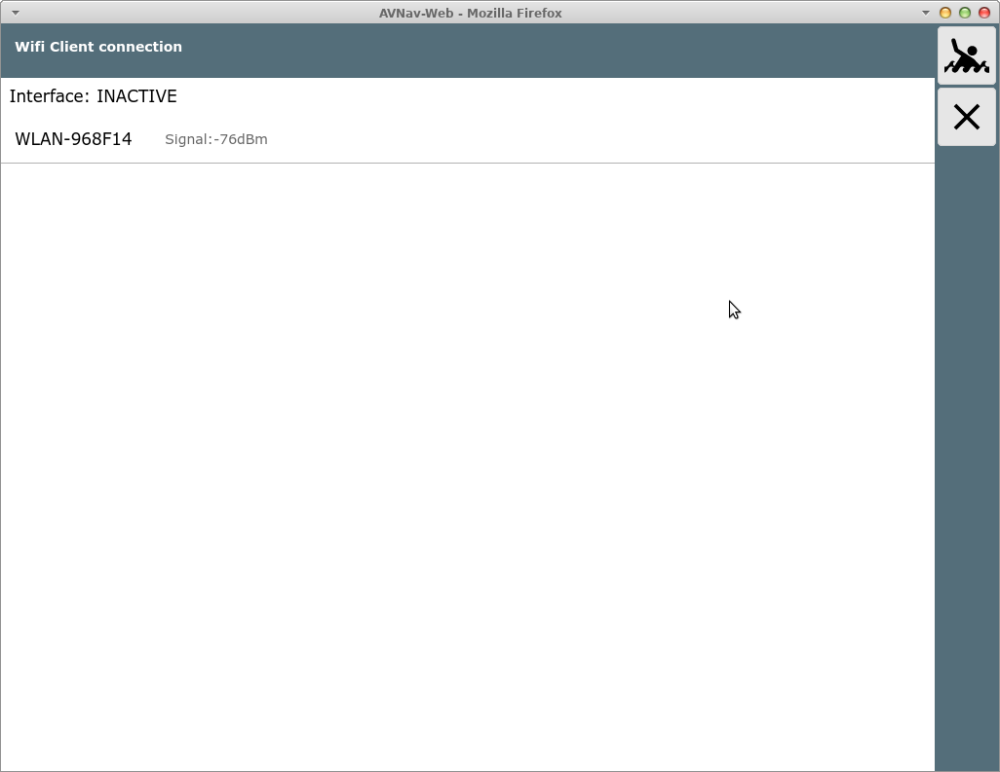
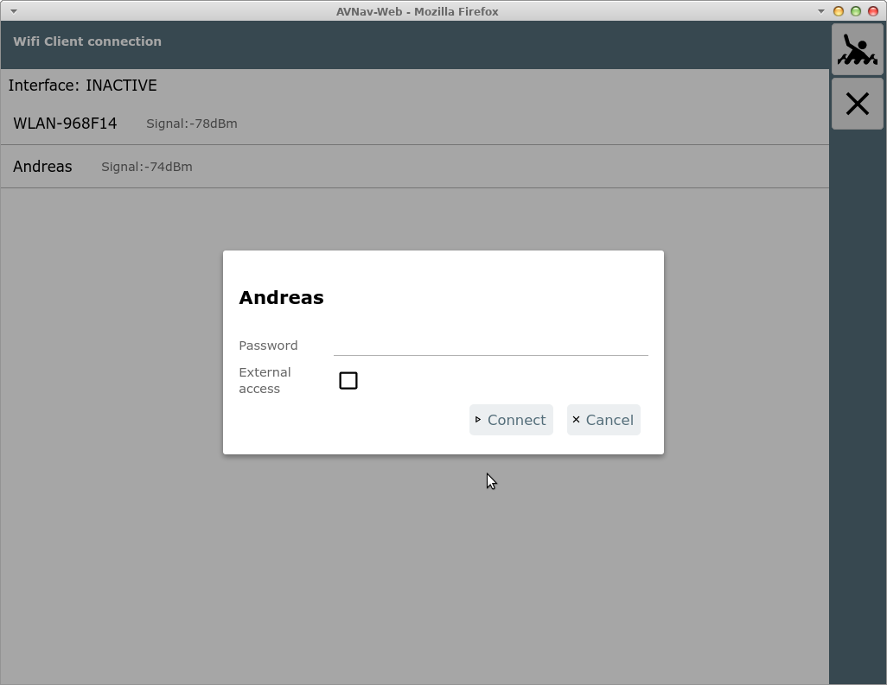
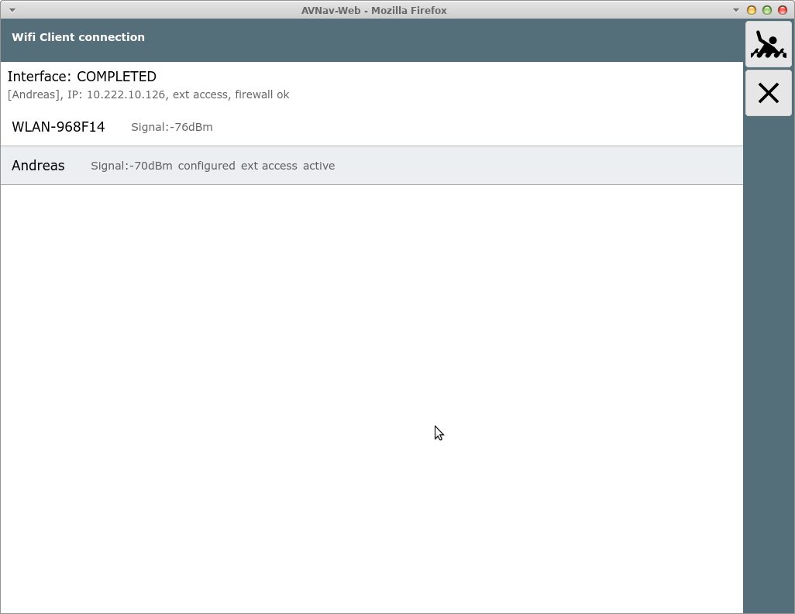
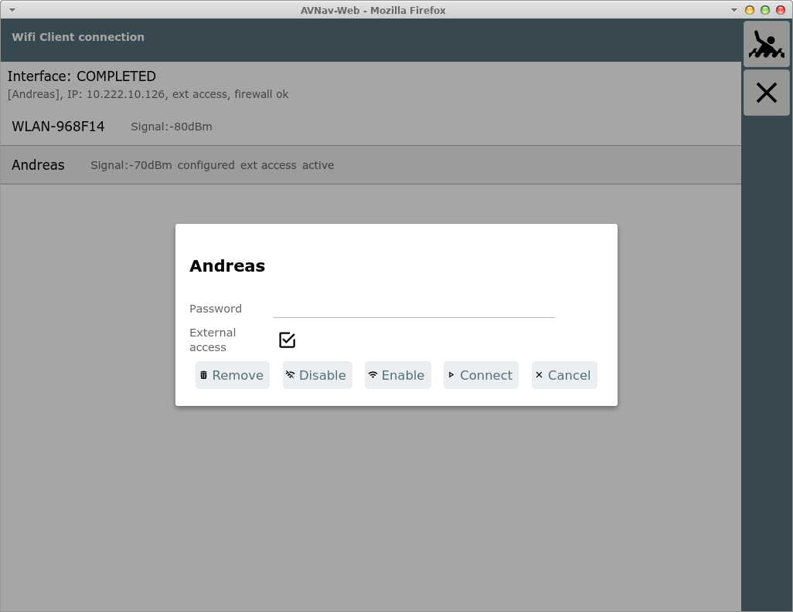

AvNav Wifi Konfiguration


Die Wifi-Konfigurationsseite
============================

- nicht auf Android -

Von der [Statusseite](statuspage.md) kommt man mit dem
Button zu
dieser Seite.



Diese Seite wird nur angezeigt, wenn das Wifi Client Handling
in der avnav\_server.xml  konfiguriert ist (als default an). Man kann
nur Verbindungen konfigurieren, wenn ein WLAN-Adapter in der richtigen
USB-Buchse eingesteckt wurde oder in der [avnav.conf](../install.md#preparation)
InternalWifi as Client auf "yes" gesetzt wurde.


Im Bild gezeigt hier ein Raspberry Pi 3. Bei den neueren mit USB 3.0
(blaue Buchsen) muss der Adapter in der blauen Buchse auf der Leiterplatten-Seite
stecken.

Auf Systemebene muss ein WLAN "wlan-av1" angezeigt werden. In der
Konfiguration (avnav\_server.xml) muss eine Eintrag der Form

```
<AVNWpaHandler wpaSocket="/var/run/wpa_supplicant/wlan-av1">
</AVNWpaHandler>
```

vorhanden sein.

Auf der Seite werden alle in Reichweite befindlichen oder konfigurierten
WLANs angezeigt.

Durch Klick auf ein angezeigtes WLAN kann die Verbindung hergestellt
werden.



Falls ein Zugriff von außen auf den Raspberry erfolgen soll, kann hier
"External Access" eingeschaltet werden.

**Achtung: Das sollte nicht in öffentlichen WLANs aktiviert werden, da
AvNav keinen besonderen Schutz bietet und sonst jeder im gleichen WLAN
ungehindert zugreifen kann.**   
Es kann aber z.B. genutzt werden, wenn man einen LTE Router nutzt und
seine Geräte direkt mit diesem verbunden sein sollen.

Wenn die Verbindung hergestellt wurde, wird das entsprechend angezeigt,
das verbundene Netzwerk ist grau hinterlegt.



Während des Verbindungsaufbaus werden bei "Interface"
Zustandsinformationen angezeigt.

Falls man das WLAN trennen möchte, kann man durch erneuten Klick auf das
Netzwerk dieses trennen, deaktivieren oder auch komplett aus der
Konfiguration entfernen.



Die WLAN-Informationen werden in der Datei
/etc/wpa\_supplicant/wpa\_supplicant.conf gespeichert.

  