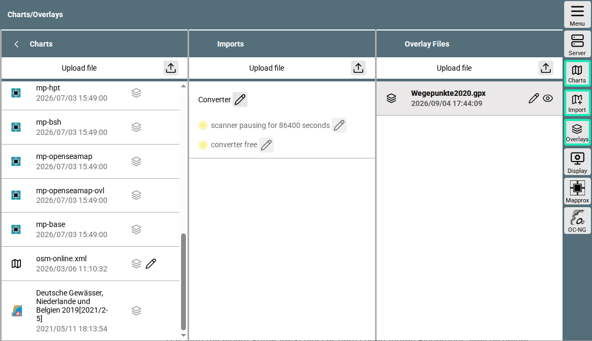

---
  tags:
    - Karten
---
# Karten

[Hier]({{VURL("charts")}}){.videolink} geht es zu einem Einführungsvideo zum Thema Karten in AvNav.

## Formate {: #formats}

AvNav unterstützt verschiedene Kartenformate, beispielsweise:

### Rasterkarten
  Formate: GEMF, MBTiles und PMTiles
  
  Frei verfügbare Rasterkarten gibt 
  es unter anderem von OpenSeaMap und FreeNauticalChart. 
  Rasterkarten aus verschiedenen Quellen können auch selbst hergestellt und in AvNav hochgeladen oder mit der Mapproxy-App erzeugt werden. Näheres dazu findet man in der [Dokumentation](../special/charts.md).
  Mit dem Tool [Mobile Atlas Creator](https://mobac.sourceforge.io/) können Karten verschiedener Online-Quellen heruntergeladen werden und danach in AvNav installiert werden. Hinweise dazu findet man unter [Mobile Atlas Creator](../special/mapsources.md).
  Man findet im Internet auch weitere Tools, die das Herunterladen von Karten ermöglichen.

### Vektorkarten

Vor allem von O-Charts mit dem passenden [PlugIn](../special/ochartsng.md). 
  Mit den O-Charts-Karten können alle gängigen Seegebiete in Europa zu günstigen Preisen abgedeckt werden. Sie basieren auf den amtlichen Karten der jeweiligen Länder und enthalten alle Informationen, die du für die Navigation mit Sportbooten benötigst. Die O-Charts-Karten laufen leider nicht auf Windows-Systemen.
  Außerdem lassen sich Karten von  Binnenwasserstraßen im iENC-Format und Vektorkarten von NOAA kostenlos herunterladen.

### Online-Kartenquellen
  Die Karten erfordern eine Internetverbindung. Das wäre dann
  z.B. wieder OpenSeaMap in der Online-Version ohne vorherigen Download.

### Plugins
  Mit entsprechenden Plugins lassen sich weitere Kartenformate, zum Beispiel 
  Vektorkacheln, verwenden. Das braucht allerdings einiges an Vorarbeit und soll im Video kein Thema werden. In der [Dokumentation](../special/charts.md#insertingdefs) findet man dazu weitere Unterstützung.

## Verwaltung

Mit der Installation von AvNav werden bereits einige Karten z.B. vom BSH oder von OpenSeaMap bereit gestellt. Man erreicht die Übersicht über bereits vorhandene Karten direkt aus der Navigationsseite über den Button {{BT("NavSelectChart")}}. Über den Select Charts-Dialog kann man alle bereits installierten Karten sehen.

Im Bereich 

{{MM("MMchartspage")}}

kann man Karten verwalten.

///caption
Karten-Seite
///

Auch hier sieht man in der "Charts"-Spalte die bereits installierten Karten. 

Über "Upload File" {{SB("Upload")}} in dieser Spalte kann man Rasterkarten in den unterstützten Formaten zum AvNav-Server hochladen.

Die Spalte "Import" ist für Karten vorgesehen, die vorab gewandelt werden müssen. Wie das im Einzelnen abläuft, kann man in der detaillierten [Dokumentation](../special/charts.md#converter) nachlesen. 

Und die rechte Spalte “Overlays” ist in einem separaten [Kapitel](TODO: overlays.md) beschrieben.

In der Buttonleiste sieht man unten die Schaltfläche OC-NG 
{: .inline-image }.

Sie ist für die Installation von O-Charts-Karten zuständig. Im [Video]({{VURL("charts")}}){.videolink} wird die Installation von o-charts Karten gezeigt, zum Nachlesen kann man die [detaillierte Dokumentation](../special/ochartsng.md) benutzen.

## Links
* [Details zu den Karten und Kartentypeb](../special/charts.md)
* [Mobile Atlas Creator Sources](../special/mapsources.md)