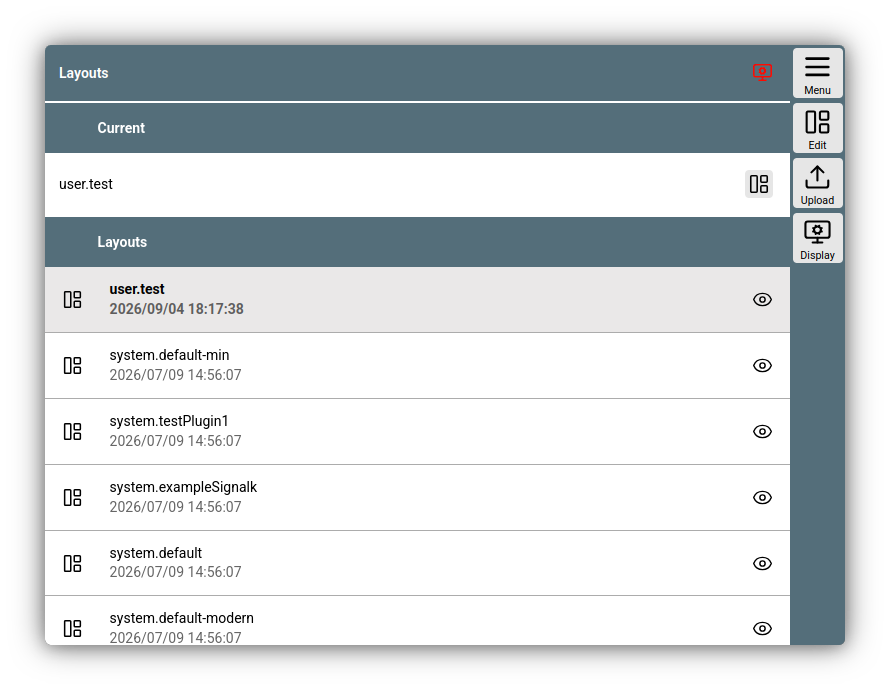
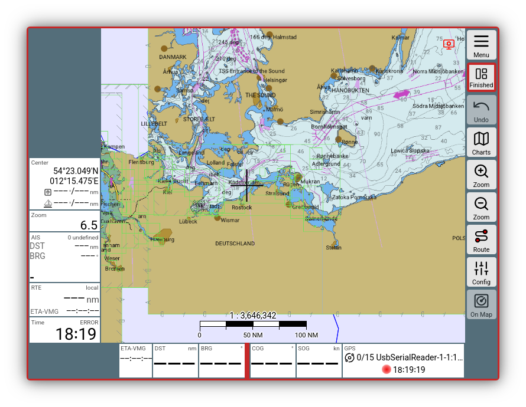
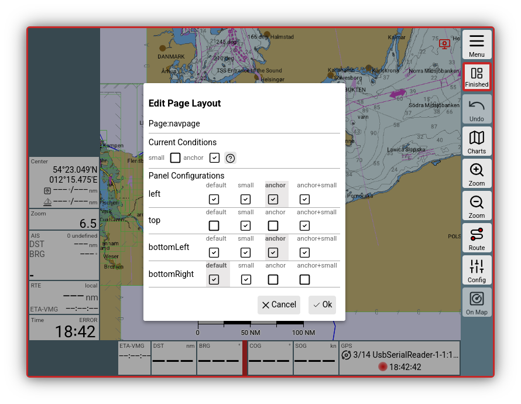
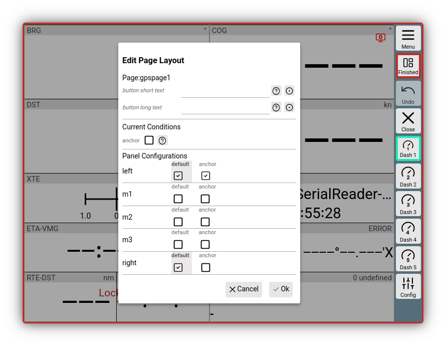
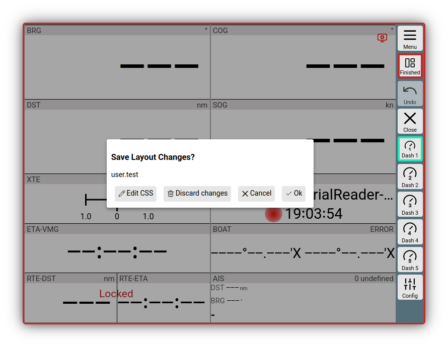

# Layout

[Hier]({{VURL("layouts")}}){.videolink} geht es zum Video, das die wichtigsten Layout-Funktionen erklärt.

Layouts bestimmen in AvNav, wie die Anzeigen ([Widgets](navpage.md#widgets)) auf der Navigationsseite und auf den Dashboard-Seiten angeordnet werden. Es gibt von AvNav vordefinierte Layouts und man kann beliebig weitere Layouts erzeugen und anpassen. 
Für jedes Anzeige-Gerät kann man das Layout auswählen - so kann man bei Bedarf verschiedene Anzeigen zusammenstellen.

Beim erstmaligen Start von AvNav in einem neuen Browser (Anzeige-Gerät) wird man gefragt, welches Layout man nutzen möchte.

Die Layouts werden als (json-) Dateien auf dem AvNav Server gespeichert (siehe auch die [Details](../special/layout.md#save) dazu.)

## Layout Seite

Um Layouts zu verwalten oder zu bearbeiten wechseln wir auf die Layout Page.

{{MM("MMlayoutspage")}}.

Es kann immer nur das aktuelle, das „current“ Layout editiert werden. Das wird prominent in der ersten Zeile dargestellt. 

Im Augenblick ist das Layout user.test aktiviert. In der Liste darunter finden sich alle anderen gespeicherten Layouts.

Das vorangestellte „user“ macht klar, das ist ein vom User erzeugtes Layout. Die Layouts mit vorangestelltem „system“ sind voreingestellt und nicht editierbar.

Auch [Plugins](../special/plugins.md) können Layouts mitbringen. Diese sind dann am Prefix "plugin" erkennbar - und ebenfalls nicht editierbar.

Über die Edit-Schaltfläche kann man nun das Editieren des aktiven Layouts starten. Ein kurzer Dialog bietet das Eingeben eines neuen Namens an, wenn es sich um ein System-Layout handelt.  Ansonsten wird nach Klick auf Edit das aktuelle Layout editiert.

Nun erscheint etwas verkleinert die NavPage rot umrahmt, um anzuzeigen, dass etwas besonderes passiert, außerdem hat sich die Buttonleiste rechts verändert.

///caption
Layout Editor Navigationsseite
///

Wie man den Layout-Editor nutzt, kann man im [Video]({{VURL("layouts")}}){.videolink} sehr gut sehen.

## Navigationsseite bearbeiten {: #navpage }
Hier nun einige Funktionen in Kurzform, falls man das Video nicht komplett anschauen möchte.

Noch einmal zur Erinnerung: Es geht nun nur darum, die Widgets rund um die Kartendarstellung auf der Navigationspage oder die Widgets auf den Dashboard-Seiten anzupassen.

Wenn man direkt auf ein Widget klickt, kann man Änderungen vornehmen. Am wichtigsten dürfte die Zeile „New Widget sein“, denn hier kann man eine anderes Widget auswählen.

Ein Klick auf den aktuellen Namen öffnet eine Auswahlliste aller verfügbaren Widgets. 

Als Beispiel wird COG ausgewählt. Wenn man nun direkt auf „Update“ klickt, ändert man das aktuelle Widget, das zuvor ausgewählt wurde. 

Wichtig: Über die Schaltflächen Before und After fügt man ein neues COG-Widget vor oder nach dem aktuellen hinzu. Das aktive bleibt unverändert.

Wenn man von vornherein ein neues Widget einfügen möchte, klickt man in den leeren Bereich neben der Karte und wirst dann durch die Einrichtung eines neuen Widgets geführt.

Weitere Einstellmöglichkeiten für das editierte Widgets sind (je nach Widget):

  * "Caption"
    das ist der Text, der zum dargestellten Wert im Widget zu sehen ist.
  * "Formatter"
    Dort wird die Darstellung des Wertes zusammen mit der Zeile Unit festgelegt. Das Format ist in der Regel bereits festgelegt.

Über die Zeile ganz oben, nämlich "Panel", wird festgelegt, wo das Widget auf der Seite abgelegt wird.
je nach Seiten (Navigationsseite/Dashboard Seiten) gibt es verschiedene Bereiche, in den Widgets plaziert werden können.

### Seitenkonfiguration {: #config-nav }
Über {{BT("EditPage")}} wird ein Konfigurationsdialog geöffnet.

///caption
Layout Konfiguration Navigationsseite
///

Hier kann ich genau festlegen, welche Bereiche rund um die Karte überhaupt Widgets aufnehmen sollen. Außerdem können verschiedene Konditionen für die Darstellung festgelegt werden. Je nachdem, welche Kondition gerade zutrifft, kann man verschiedene Widgets plazieren. Das ist z.B. sinnvoll, wenn die Ankerwache läuft - dann kann man statt der Wegepunkt-Informationen die Daten der Ankerwache anzeigen (wird in den System-Layouts genutzt).
Für die Navigationsseite sind zwei Konditionen verfügbar:

  * small

    Falls das genutzte Anzeigegerät beispielsweise zwischen horizintaler und vertikaler Ausrichtung wechseln kann, ist es sinnvoll für die vertikale Ausrichtung (="small" - also kleines Display) andere Widgets zu konfigurieren als für den horizontalen Modus.
    Der Wert der Bildschirmbreite (in Pixeln) unter dem "small" aktiv ist, kann man in den Einstellungen
    {{MM("MMsettingspage")}}->"General"->"portrait layout below"
    setzen.

  * anchor

    Wird aktiv sobald man die [Ankerwache](TODO: Ankerwache) aktiviert.

Während man im Layout-Editor arbeitet, werden diese Konditionen **nicht automatisch** gesetzt - d.h. ein Drehen des Displays aktiviert nicht den "small" Modus. Um die Konditionen zu aktivieren muss man den Konfigurationsdialog nutzen.

Unter "Panel Configurations" findet man die Liste der zur Verfügung stehenen Panele, die Widgets aufnehmen können. Die Haken bedeuten jeweils, ob das Panel im Modus angezeigt wird. Die graue Hinterlegung zeigt an, ob das Panel eine eigene Konfiguration für den Modus hat.

Im Beispielbild bedeutet das:

  1. Kondition "anchor" ist aktiv, "small" ist inaktiv
  2. Panel "left" und "bottomLeft" haben eine separate Konfiguration für die Kondition
  3. Panel "top" wird nicht angezeigt
  4. Panel "bottomRight" hat keine spezielle Konfiguration - d.h. es wird die Konfiguration ohne Konditionen genutzt

Wenn die Konfiguration abgeschlossen ist, kann man die Dialog mit {{DB("DBOk")}} verlassen. 

**Hinweis:**Je nach gewählten Konditionen bearbeitet man jetzt die Panels für diese Koditionen!

### Widgets verschieben

Man kann im Layout-Editor Widgets per Drag and Drop verschieben. Das geht sowohl innerhalb eines Panels als auch zwischen den Panelen.

### Undo

Mit dem Button {{BT("RevertLayout")}} kann man schrittweise die letzten Änderungen zurücknehmen.

## Dashboard Seiten

Über 
{{MM("MMgpspage")}} 
wechselt man im Layout-Editor zu den Dashboard-Seiten. Die Bearbeitung der Widgets ist erfolgt identisch zur Bearbeitung auf der [Navigationsseite](#navpage).

### Seitenkonfiguration {: #config-gps}

Über {{BT("EditPage")}} wird wieder der Konfigurationsdialog geöffnet.

///caption
Seitenkonfiguration Dashboard
///

Das Konditionshandling erfolgt wie auf der [Navigationsseite](#config-nav). Allerdings wird auf den Dashboard-Seiten nur die Kondition "anchor" unterstützt.

Im Konfigurationsdialog kann man ausserdem noch Texte für den Button angeben, der die aktuelle Dashboard-Seite öffnet. Der "button short text" wird auf dem Button angezeigt (max. 7 Zeichen), der "button long text" als Tooltip oder im Hauptmenü. Diese Texte werden ebenso im Layout gespeichert.

Im Default sind 5 Dashboard Seiten verfügbar. Seiten ohne Widgets erscheinen ausserhalb des Layout-Editors nicht als Button.

Man kann diese Anzahl auf bis zu 10 vergrößern:

{{MM("MMsettingspage")}}->"General"->"number of bashboards".

Wenn diese Einstellung im Layout gespeichert werden soll, muss man sie im Layout-Editor Modus vornehmen (siehe [Details](../special/layout.md#display-settings)).

## Beenden des Editors

Mit dem Button {{BT("LayoutFinished")}} wird die Bearbeitung des Layouts beendet.

///caption
Beenden Dialog
///

Man kann sich hier noch einmal entscheiden, alle gemachten Änderungen zu verwerfen. Mit {{DB("DBOk")}} wird das Layout auf dem Server gespeichert und auch lokal aktiviert.

Die Nutzung von {{DB("DBEditCss")}} wird in den [Details](../special/layout.md#layoutcss) beschrieben.

## Weitere Details

Einige spezielle Hinweise zu den Layouts - auch zum importieren und exportieren- findet man [hier](../special/layout.md).

