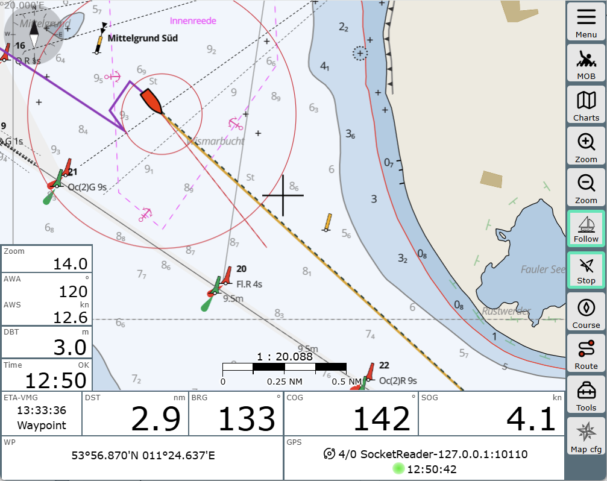
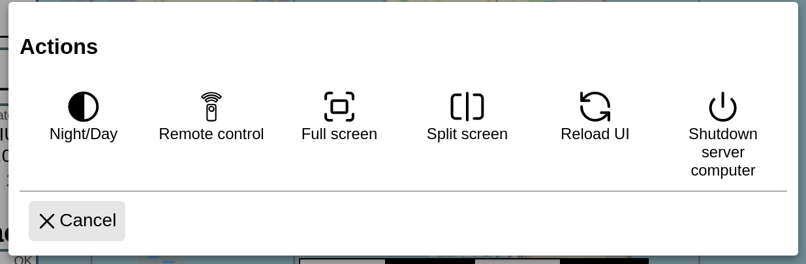
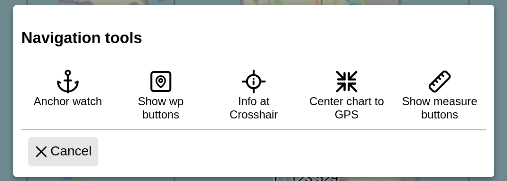
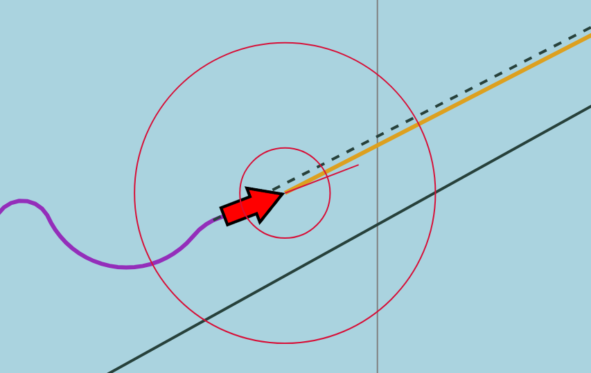
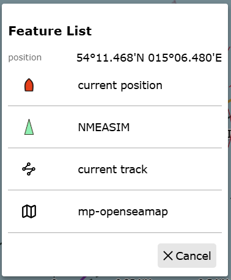

# Navigationsseite 

 Ein Teil der Inhalte dieses Abschnittes wird auch im **[Video hier]({{VURL("navigation")}}){.videolink}** vorgestellt

 Beim Start von AvNav landet man sofort in der Navigationsansicht,
 in der die zuletzt benutzte Karte geladen wird. Lässt sich diese nicht feststellen, folgt die Aufforderung zur Auswahl einer Karte.

## Widgets
 Das Programmfenster ist so gestaltet, dass alle relevanten Daten und Anzeigewerte schnell zugänglich sind. Dafür sorgen die sogenannten "Widgets". Die Widgets können oben und unten und auch links auf der Navigationsseite erscheinen. Um Platz für weitere Anzeigen zu bieten, gibt es darüber hinaus die Dashboardseiten. Alle Widgets lassen sich frei konfigurieren, um die bevorzugten Informationen stets im Blick zu haben. Wie das im Einzelnen geht, und was es mit den Dashboardseiten auf sich hat, thematisiert das Kapitel zum Editieren von [Layouts](layout.md).

## Buttonleiste
In der rechten Seitenleiste liegt die Buttonleiste, die die wichtigsten Funktionen der jeweiligen AvNav-Seite zur Verfügung stellt. 

| Button | Funktion |
| ------ | -------- |
| {{BT("MainNav",False)}} | Eine der grundlegendsten Neuerungen 2026 ist das "Main Menu" oben rechts, welches bei Klick eine Übersicht der verfügbaren Funktionsbereiche von AvNav öffnet. Diese lassen sich direkt auswählen oder über {{ICON("MNCollapsed")}} aufklappen. Durch das Aufklappen eines Funktionsbereichs sieht man die dort relevanten Schaltflächen, hier aber mit längerem und aussagekräftigerem Text.    Der Funktionsbereich "Actions" öffnet ein Spezialmenü, welches besondere Aktionen auslöst, die übergreifend von sämtlichen Funktionsbereichen erreichbar sein sollen. Mehr dazu [weiter unten](#actions-buttons).    Über [Settings/Main Menu](settings.md) oder direkt im Menü über den Button {{ICON("Settings")}} lässt sich das Menü verkürzen, um es für Navigationsaufgaben unterwegs handlicher zu machen, denn viele Funktionsbereiche werden mit hoher Wahrscheinlichkeit nicht täglich benötigt. |
| {{BT("MOB",False)}} |Der Mob-Button befindet sich immer an gleicher Stelle auf jeder Seite. Ein Klick auf ihn erzeugt erst einmal einen lauten Alarm, sofern ein lautgebendes Element an das Gerät angeschlossen ist. Es gibt zudem einen visuellen Alarm. Die aktuelle Position wird angesprungen und deutlich markiert. In den zuständigen Widgets werden die Entfernung und der Kurs zum MOB angezeigt. Ein weiterer Klick auf MOB deaktiviert den Mob Alarm wieder.  |
| {{BT("ChartsView")}} |Durch Klick auf den Charts-Button können zuvor hochgeladene Karten aktiviert werden. Näheres dazu im Abschnitt [Karten und Overlays](charts.md) Neben der Kartenauswahl bietet AvNav die Möglichkeit, unterschiedliche Overlays hinzuzufügen. Mit Overlays können neben der reinen Karte weitere Elemente in die Kartenansicht eingeblendet werden. Das können Satellitenbilder sein, bereits gefahrene Tracks, weitere Karten oder Dateien mit Tonnenpositionen. Das ist besonders hilfreich, wenn man z.B. im Grenzbereich zweier Karten navigieren und die Karten nicht immer wechseln will.|
| {{BT("ZoomIn")}} {{BT("ZoomOut")}} | Hiermit wird der Kartenausschnitt vergrößert und verkleinert. Dabei bleibt (anders etwa als bei Nutzung des Mausrads) das eigene Boot zentriert.|
| {{BT("LockPos")}} | Mit dem Follow-Button erreicht man, dass die Karte immer auf die Bootsposition fixiert bleibt und ihr folgt. Der Button erhält einen grünen Rand, wenn er aktiv ist. Die Bootsposition kann zentral (am Fadenkreuz) oder an einer beliebigen Stelle des Bildschirms fixiert werden. Die eigene Präferenz stellt man in den [Settings/Map](settings.md) ein.|
| {{BT("WpGoto")}} |Klickt man auf Start, wird ein Wegepunkt auf die Position des Fadenkreuzes gesetzt,und im Widget tauchen sofort Informationen auf, wie weit es zu diesem Punkt ist, mit welchem Kurs er erreichbar ist, und wie lange das in etwa dauern wird. Diese Funktion lässt sich also nutzen, um schnell und effektiv zu einem bestimmten Punkt, eine Ansteuerung, einer bestimmten Tonne zu navigieren oder sich einfach über den Weg dorthin zu informieren. Das ersetzt aber nicht die Routenfunktion. Das bedeutet, es gibt zwar einen Annäherungsalarm, aber kein automatisches Deaktivieren des Punktes, wenn er erreicht ist. Das geht nur über die Routenfunktion, dazu mehr im Abschnitt [Routen](routes.md).|
| {{BT("CourseUp")}} | Dieser Button dient dazu, die Ausrichtung der Karte entweder auf den aktuellen Kurs des eigenen Bootes oder nach Nord auszurichten. Dabei führt das Klicken zur kursbezogenen Ausrichtung. Standardeinstellung ist die Ausrichtung nach Nord.|
| {{BT("ShowRoutePanel",False)}} |Eines der wichtigsten Tools in AvNav ist die Routenverwaltung, die man mit diesem Button erreichen kann. Mit ihr lassen sich komplexe Routen planen, Wegepunkte setzen und verändern, Routen speichern und starten. Zu diesem Themenbereich mehr im nächsten Kapitel [Routen](routes.md)|
|{{BT("NavActions",False)}} |Eine weitere Neuerung in AvNav 2026 ist der Tools-Button. Er blendet über einen Dialog zusätzliche Werkzeuge ein, die nicht ständig gebraucht werden. Dies sind die Tools Buttons, wie unten beschrieben|
| {{BT("Dim",False)}} |Nur für Android: der Bildschirm wird abgedunkelt, um Strom zu sparen. Dies ist eine andere Funktion als die Day/Night|Umschaltung im Actions Menü, welche ein anderes Farbschema aufruft.|

## Actions Buttons

Über die Buttons des Action Menüs werden spezielle Aktionen auslöst, die übergreifend von sämtlichen Funktionsbereichen erreichbar sein sollen. 

| Button | Funktion |
| ------ | -------- |
| {{BT("Night",True)}} | Es wird ein sehr dunkles Farbschema aktiviert bzw. deaktiviert, welches für Nachtfahrt geeignet ist.  |
| {{BT("RemoteChannel",True)}} | Erlaubt den Fernsteuerungskanal und -Modus zu wechseln. Das bietet die Möglichkeit, die Anzeige eines Displays durch ein anderes Gerät oder vom Server aus fernzusteuern. Dieses fortgeschrittene Thema wird [hier](../special/remotecontrol.md) erklärt.|
| {{BT("FullScreen",True)}} | Falls vom Browser unterstützt, schaltet dieser Butten den Fullscreen Modus ein oder aus.|
| {{BT("Split",True)}} | Hier kann der Split Mode ein- und ausgeschaltet werden. Einfach gesagt laufen in dieser Betriebsart zwei AvNav-Instanzen auf dem Display nebeneinander. Dazu gibt es spezielle Hinweise und Anleitungen [hier](../special/splitmode.md). |
| {{BT("ReloadUI",True)}} | Neuerliches Laden Browserfensters mit den Daten vom AvNav Server|
| {{BT("StatusShutdown", True)}} | Läuft das System auf einem Raspberry Image, startet dieser Button das geordnete Herunterfahren des Systems. |
|  {{BT("MainExit",True)}} | Nur Android: Beendet die [AvNav App](TODO) oder setzt sie in den Hintergrund-Modus. |

## Navigation Tools Buttons

| Button | Funktion |
| ------ | -------- |
| {{BT("AnchorWatch",True)}} | Mit Anchorwatch startet man die AvNav-interne Ankerwache. |
| {{BT("ABShowWpButtons",True)}} |Show Waypoint Buttons startet eine kleine zusätzliche Buttonleiste, die direkt rechts unten in die Karteneinsicht eingeblendet wird und bezogen auf aktive Waypoints zusätzliche Tools anbietet.|
| {{BT("CenterAction", True)}} |Mit Info at Crosshair  lassen sich verschiedene Informationen zur angewählten Kartenposition anzeigen. 
| {{BT("GpsCenter",True)}} |Center Chart GPS macht genau das, was es sagt. Ein Klick zentriert die Karte, visualisiert durch das Fadenkreuz, auf die aktuelle GPS Position, wenn sie denn vorhanden ist.|
| {{BT("ABShowMeasure",True)}} |Mit Show Measure Buttons kann man sich eine Toolbox mit Instrumenten zum Messen von Entfernungen anzeigen lassen. Dieser Button ist nur aktiv, wenn der Follow-Button (siehe oben) nicht aktiv ist.|

## Darstellungen auf der Karte

Standardmäßig wird das Boot auf der Karte als { .inline-image }
angezeigt, sobald ein GPS Signal verfügbar ist (das Icon kann [angepasst](../special/usericons.md) werden). Es kennzeichnet die eigene Position und Bewegungsrichtung. 

Darüber hinaus gibt es eine Reihe von Linien: sie bezeichnen Abstände, Richtungen und Vektoren. Hier die wichtigsten:

* die roten Kreise sind Abstandskreise, per default in 300 und in 1000 Meter  
* die rote Linie von der Spitze des Pfeils ist der Kursvektor zu COG. Seine Länge zeigt an, wie weit wir uns bei der aktuellen Geschwindigkeit innerhalb 10 Minuten bewegen  
* die lila Linie ist der Track - der Weg, den wir zurückgelegt haben  
* die schwarz gestrichelte Line kennzeichnet die Richtung zum Wegepunkt, die beim Aktivieren der Routenberechnung oder beim Start zu einem einzelnen Wegepunkt berechnet wurde  
* die ockerfarbene Linie ist die Richtung zum aktiven Wegepunkt
* die dunkelgrüne Linie stellt die gespeicherte Route dar  

In den [Settings / Navigation](settings.md) können die Parameter dieser Darstellungen vielfältig beeinflusst und verändert werden.  

## Kartenobjekte: Feature List und Feature Info

Mit einem Click oder Touch auf die Karte, können zusätzliche Informationen zu Objekten an dieser Stelle angefordert werden. Wenn raue Bedingungen den exakten Click erschweren, kann man die Karte auch so verschieben, dass der Punkt im Fadenkreuz liegt und dann über den Button {{BT("CenterAction", True)}} aus den Navigation Tools die Abfrage starten.

Die angezeigte Liste enthält alle Objekte an dieser Stelle, zu denen AvNav nach Selektion (je nach Art) weitere [Aktionen oder Informationen](../special/featureinfo.md) anbieten kann. In diesem Beispiel sind das die eigene Position, ein AIS Objekt, der aktuelle Track sowie die Karte selbst. 
