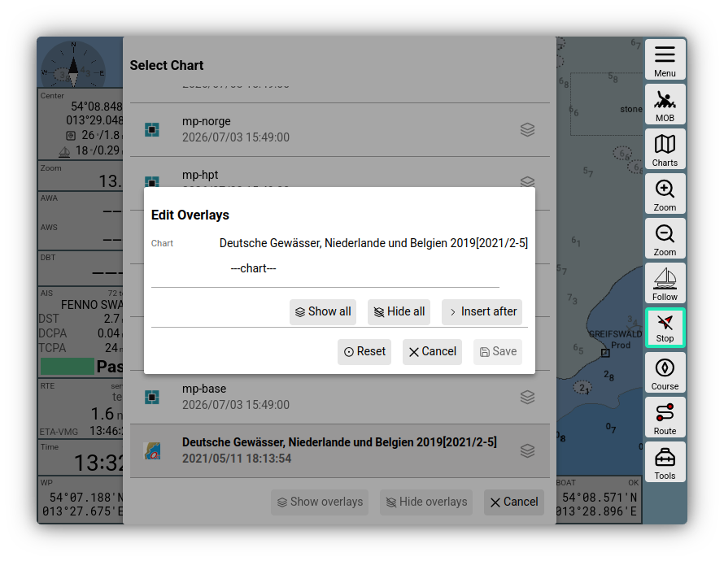
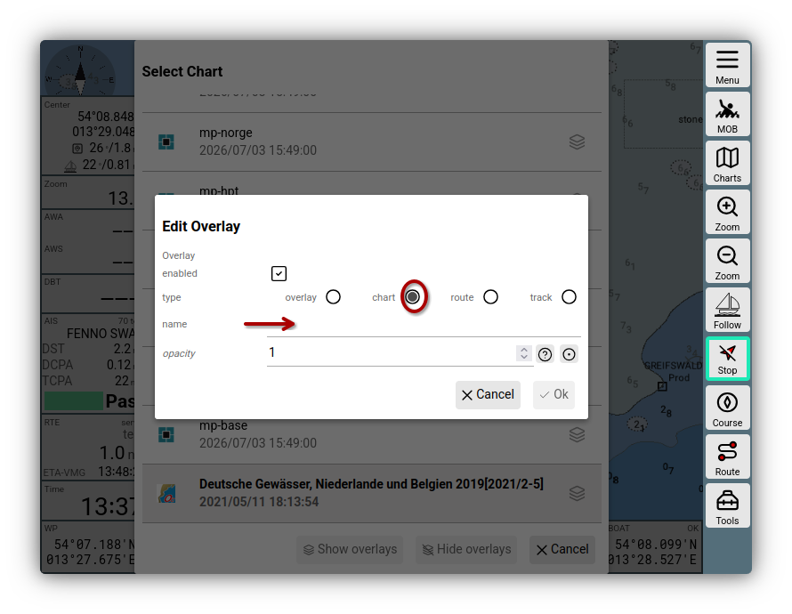
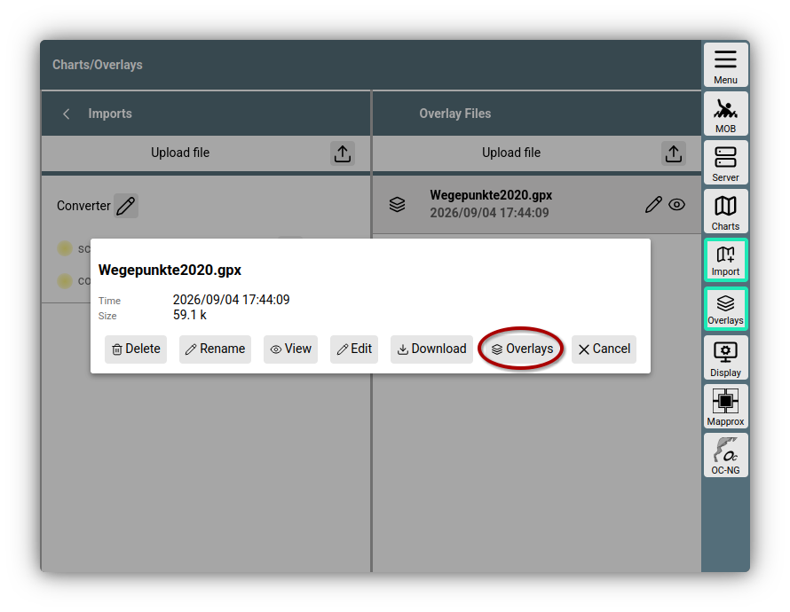
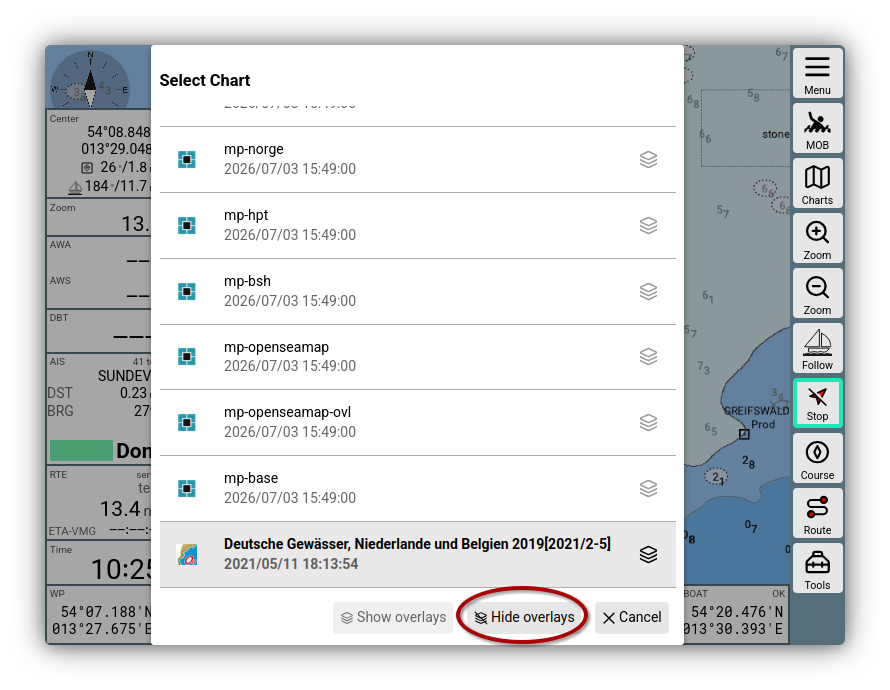
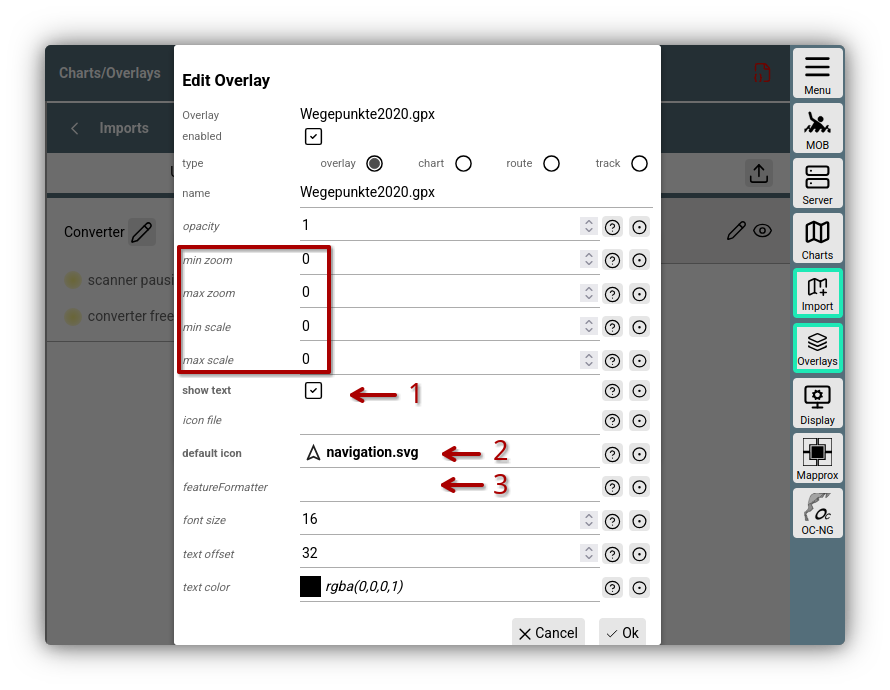

# Overlays

[Hier]({{VURL("overlays")}}){.videolink} geht es zu einem Video, das die Basisfunktionen erklärt.

## Einführung

Overlays dienen dazu, Karten in AvNav mit weiteren Informationen zu ergänzen.
Das bedeutet, dass Karten mit weiteren Daten und Darstellungen hinterlegt werden, um in der Karte zusätzliche Informationen anzuzeigen oder die aktuelle Karte sinnvoll zu erweitern.

Ein Beispiel ist die Nutzung einer Karte für Deutschland - das Fahrtgebiet ist aber der  Grenzbereich zwischen Deutschland und Dänemark in der Flensburger Förde.

Das würde bedeuten, je nach Kurs und Position immer wieder zwischen einer dänischen und einer deutschen Karte hin- und her zu schalten. Um das zu vermeiden, kannt man in AvNav einer Karte eine weitere Karte als Overlay zufügen. So werden beide Karten in der Navigationsansicht sichtbar und erzeugen einen nahtlosen Übergang.

Ebenso kann man Informationen aus anderen Quellen herunterladen, um ein Wegepunktverzeichnis in der Karte darzustellen oder zum Beispiel ein Verzeichnis dänischer Ankerbojen und vieles mehr.

Auch ist es möglich, Routen und Tracks in die Karte zu holen, um sie zu vergleichen oder als Vorlage für eine neu zu erstellende Route zu verwenden.

Auch Satellitenbilder lassen sich in AvNav-Karten überlagern, dazu ist allerdings eine Quelle für Satellitenkarten notwendig und eine gewisse Vorbereitung. Dieses Verfahren kannst du in der Doku nachlesen.

## Zuordnung {: #assign}

Wie werden Overlays bestimmten Karten zugeordnet?
Um zwei im System vorhandene Karten nebeneinander zu legen, kann man einen sehr schnellen Weg wählen, nämlich direkt aus der  Navigationsseite heraus über den Button {{BT("NavSelectChart")}}.

Bei einer der Karten, die man nebeneinander legen möchte, klickt man rechts auf den Overlay Button. Dann öffnet sich der Edit-Overlay Dialog.

///caption
Overlay Dialog
///

Dort klickt man die Schaltfläche {{DB("DBInsertAfter")}}, um der Basiskarte eine weitere Karte hinzuzufügen.

Es öffnet sich dann ein weiterer Dialog, dort wählt man die Option „chart“ und klickt auf die Zeile „name“. Nun kann man aus einer der installierten Karten auswählen.

///caption
Karte als Overlay
///

Nach Klick auf {{DB("DBOk")}} landet man wieder im Ausgangsdialog „Edit Overlay“ und bestätigt das neue Overlay nun mit {{DB("DBSave")}}.

Das war es schon. In der Kartenliste erkennt man das Overlay nun am geschwärzten Icon rechts neben dem Kartennamen.

Um eine Route, eine Wegepunktliste oder ein Bojenverzeichnis als Overlay einzufügen, muss man die entsprechenden Dateien zuvor irgendwo herunter laden und in AvNav einfügen. AvNav akzeptiert solche Dateien mit den Formaten GPX, KML, KMZ, GEOJSON.

Nachdem du die Quelldateien auf deinem Rechner gespeichert hast, wechselst du in AvNav in den Bereich 

{{MM("MMchartspage")}}

In der Spalte "Overlays" kann man die Dateien dann hochladen.
Als Beispiel wird hier die Wegepunktliste des NV-Verlags genutzt, die kostenlos zum Download zur Verfügung steht.

Man klickt auf "Upload" {{SB("Upload")}}, wählt die Datei aus und überprüft, ob sie in der Liste unter Overlay sichtbar wird. Nun kann man den gleichen Weg gehen, der eben für die Karten bereits beschrieben wurde.

Da man aber sowieso schon im Bereich Charts/ Overlays ist, kann man direkt aus der Overlay-Liste eine Datei einer Karte zuordnen, also quasi der umgekehrte Weg zu eben. 
Dazu klickt man auf das Stiftsymbol neben der gewählten Datei, klickt dann auf Overlays und sucht über den aufklappenden Dialog die Karte aus, der man das Overlay zuordnen will.

///caption
Wegepunkte als Overlay
///

Die sollten natürlich zusammen passen. Die Bojen des dänischen Tursejlerverbands werden auf einer deutschen oder niederländischen Karte kaum zu finden sein…

Nach der Zuordnung erhält man einen Dialog, der es ermöglicht, verschiedene Einstellungen für das Overlay vorzunehmen. Für einige Hinweise dazu siehe weiter [unten](#paremeters).

Ist die Zuordnung Overlay zu Karte erzeugt, bestätigt man im Edit Overlay-Dialog mit {{DB("DBSave")}}. 

In der Kartenliste auf der Navigationspage findet man nun das aktive Overlaysymbol neben der eben zugeordneten Karte.  

Die Einstellungen eines Overlays kann man jederzeit anpassen, wenn man im Edit-Overlay-Dialog auf das {{SB("Edit")}} Symbol eines Overlays klickt. 

Nun sind beide Wege, wie Karten und Overlays zusammengefügt und editiert werden können, gezeigt worden.

## Ein- und Ausblenden

Ein kurzer Hinweis am Ende zum Umgang mit Overlays zum Beispiel während eines Törns. Da kann es gut vorkommen, dass die überlagerten Informationen durch Overlays die Kartendarstellung auch stören. Um die Overlays schnell abschalten zu können, hat man direkt auf der Navigationspage über den Charts-Button und die angezeigte Kartenliste die Möglichkeit dazu, indem man auf „Hide Overlays“ klickt.

///caption
Verbergen von Overlays
///

Show Overlays würde danach die Overlays der gewählten Karte schnell wieder aktivieren. Damit man nicht durcheinander kommt, ist immer nur die jeweilige Möglichkeit aktiv, die andere ausgegraut.

## Einstellungen {: #parameters}

///caption
Overlay Einstellungen
///

Bei der [Zuordnung](#assign) von Overlays oder durch Klick auf das {{SB("Edit")}} Symbol im Overlay-Dialog erhält man die Möglichkeit Einstellungen für die Anzeige des Overlays auf der gewählten Karte anzupassen. Wenn man ein Overlay mehreren Karten zuordnet, kann man jeweils separate Einstellungen vornehmen.

Die angezeigten Werte sind vom Typ des Overlays abhängig und haben jeweils eine  Hilfe-Funktion, die ihre Funktion beschreibt.

Die `opacity` ist in Dezimalschritten von 0-1 einstellbar.

Die (eingerahmten) Werte `min zoom` und `max zoom` steuern den Auflösungsbereich, in dem das Overlay sichtbar wird. 

`min scale` und `max scale` steuern die Größe von icons. Bei Auflösungen kleiner als `min scale` werden die icons verkleinert, bei Auflösungen größer `max scale` vergrößert.
`show text` (1) steuert, ob die Beschriftungen in der Karte sichtbar werden.

Mit `default icon` (2) kann ein Icon ausgewählt werden, das für Punkte genutzt werden soll, die in der Overlay-Datei kein eigenes Icon definiert haben (oder wenn das definierrte Icon nicht in AvNav verfügbar ist). Man kann auch mit `icon file`eine (ZIP-) Datei wählen, die Symbole für ein Overlay enthält. Diese muss vorher zu den Overlay-Dateien in AvNav hochgeladen werden.

Für weitere Informationen (auch zur Beschreibung von `feature formatter`(3)) siehe die [Detail-Beschreibungen](../special/overlays.md).