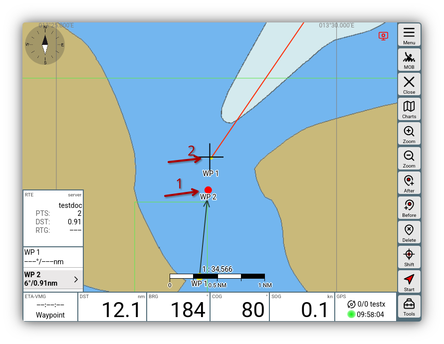
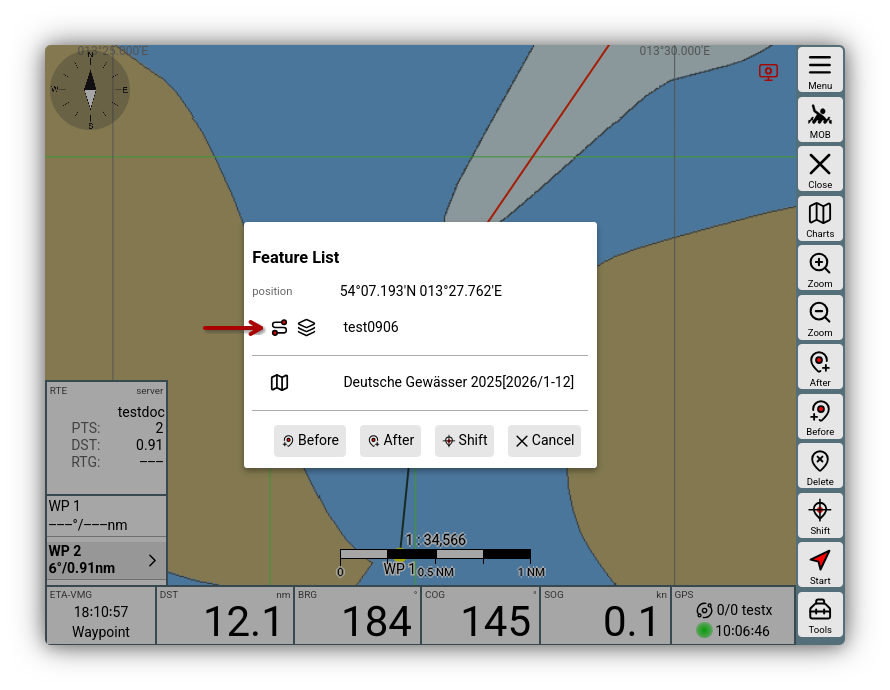
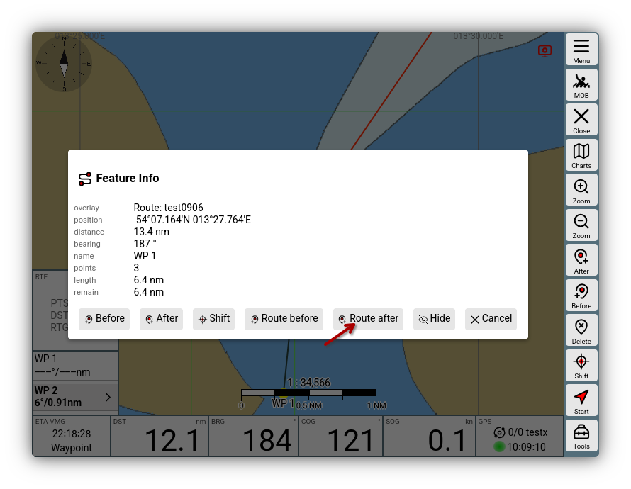

---
  tags:
    - Route
---
# Routen
Beschäftigen wir uns nun mit der Routen-Funktion. Die Abläufe werden **[in diesem Video]({{VURL("routes")}}){.videolink}** gezeigt.

## Der Routeneditor {: #editor }

Das Erstellen einer Route geht am einfachsten direkt aus der [Navigationsseite](navpage.md) über die Schaltfläche {{BT("ToRoute")}}. 

Die Kartenansicht bleibt, aber die Buttonleiste rechts hat sich verändert. 

- ### Neue Route  
Man klickt links unten in das Routen Widget (RTE) und legt eine neue Route an, indem man nach Klick auf {{DB("DBNewRoute")}} der Route einen neuen Namen (z.B. "Test") gibt und zweimal mit {{DB("DBOk")}} bestätigt.  Anschließend zeigt der Dialog im Widget, dass nun die Route „Test“ geladen ist und diese noch keinerlei Wegepunkte enthält. 

- ### Wegepunkte setzen   
Das Setzen von Wegepunkten erfolgt in AvNav, indem das Fadenkreuz auf die Position geschoben wird, wo der Wegepunkt gesetzt werden soll. Das geschieht mit einem  Klick auf {{BT("NavAddAfter")}}. Dabei beziehen sich 'After' und 'Before' auf den aktuell aktivierten Wegepunkt. Dieser ist auf der Karte rot und in der WP-Liste des RTE Widgets fett hervorgehoben. In diesem Beispiel erstellt man am Fadenkreuz über den Button {{BT("NavAddAfter")}} die Route WP1->WP2-WP3. Über den Button {{BT("NavAdd")}} entsteht folglich die Route WP1->WP3->WP2  

- ### Wegepunke bearbeiten
Um einen Wegepunkt zu verschieben, muss er zunächst direkt markiert werden. Das geht etwa in der Karte durch Klick oder durch Auswahl seines Listeneintrags im RTE Widget. Anschließend die gewünschte Position unter das Fadenkreuz setzen und den Wegepunkt mit {{BT("NavToCenter")}} verlegen. Analog kann man den Wegepunkt löschen - dafür nutzt man den Button {{BT("NavDelete")}}. Die Arbeit mit dem Fadenkreuz mag im ersten Augenblick etwas umständlich wirken im Vergleich zu direkten Klicks auf den Touchscreen. In Situationen mit einem sich stark bewegenden Schiff, auf einem kleineren Bildschirm, und mit klammen Fingern wird man diese Art der Bedienung aber zu schätzen lernen.

## Routen speichern und laden
Änderungen an Routen werden in der Regel sofort am AvNav Server gespeichert. Ist dieses Systemverhalten unerwünscht, weil man beispielsweise die gerade aktive Route bearbeitet, bietet sich der sogenannte disconnected Mode an: dabei bleiben Änderungen lokal im Browser und werden bis auf Weiteres nicht zum Server synchronisiert. Diese Trennung erreicht man durch Deaktivieren des connected Mode über den Button {{BT("DBConnect")}} im Display des Funktionsbereich "Routes". Änderungen bleiben solange lokal, bis man den connected Mode wieder aktiviert - dann wird gefragt, was mit den Änderungen geschehen soll - sie können übernommen oder verworfen werden.

In der zweiten Spalte sind die gespeicherten Routen gelistet. Sie können dort unter anderem gelöscht, kopiert, heruntergeladen, von gpx Dateien importiert oder editiert werden. Auf schmalen Bildschirmen ist diese zweite Spalte eventuell nicht sichtbar - man erreicht sie dann über Wischen.

## WP Buttons {: #wp-buttons}
Beim Bearbeiten, aber auch beim Nutzen einer Route bieten sich weitere Möglichkeiten, wenn man die Schaltfläche {{BT("NavActions",False)}} und in "Navigation tools" {{BT("ABShowWpButtons", True)}} anklickt. Die Schaltflächen {{BT("WpNext",False)}} und {{BT("WpPrevious",False)}} bewegen die Markierung von Wegepunkt zu Wegepunkt, wenn die Arbeit im Widget oder in der Karte als ungünstiger empfunden wird. Über {{BT("Edit",False)}} kann jeder einzelne Wegepunkt editiert werden, etwa um einen neuen Namen zu vergeben. Mit {{BT("WpLocate",False)}} kann man den angewählten Wegepunkt schnell wieder ins Kartenfenster holen, wenn die Karte aus irgendwelchen Gründen woanders hin verschoben wurde. Das geht allerdings auch mit Anklicken des Wegepunkts im RTE Widget. 

## Route aktivieren
Sind alle Eingaben erledigt, kann die Route aktiviert werden. Das geht über den Klick auf den Start-Button {{BT("NavGoto",False)}}. Bevor das passiert, sollte noch einmal geprüft werden, welcher Wegepunkt aktuell aktiv ist - dorthin startet die Route. Wir legen also WP 1 als erstes Leg von unserer Position aus fest und klicken auf {{BT("NavGoto",False)}}.  

Die Route wird nun aktiv, die Ansicht springt zurück in das normale Navigationsfenster. Aus 
dem {{BT("NavGoto",False)}} wird {{BT("StopNav",False)}}. Damit lässt sich die Aktivierung der Route wieder zurücknehmen. Dass die Route nun aktiv ist, erkennt man außerdem daran, dass die Richtung zum WP als ockerfarbige Linie angezeigt wird, und die Widgets die routenbezogenen Werte beinhalten, also die Distanz zum nächsten Wegepunkt (DST), den Kurs (BRG) dorthin, im RTE Widget die Länge der Route und die ETA.   

Die [WP Buttons](#wp-buttons) bieten auch während des Abfahrens der Route nützliche Funktionen. Sollte man sich spontan entscheiden, einen Wegepunkt auszulassen, ohne die Route gleich in ihrem Ablauf ändern zu wollen, ist der {{BT("NavNext",False)}} die richtige Wahl: klickt man darauf, springt die Route auf den nächsten Wegepunkt. Das kann hilfreich sein, wenn man einen Wegepunkt in einer so großen Entfernung passiert, dass das Erreichen des Wegepunktes vom System nicht automatisch quittiert wird.   

Der Kurs zum nächsten Wegepunkt wird automatisch aktualisiert und im Standard als ockerfarbene Linie dargestellt. Der bei der bei Beginn des Legs festgelegte Kurs zeigt sich als [gestrichelte schwarze Line](./navpage.md#vectors). Der Button {{BT("NavRestart",False)}} führt (etwa nach Verschieben des Wegepunkts unterwegs) eine neue Erstberechnung aus - dabei wird XTE zurückgesetzt: die gestrichelte und die ockerfarbene Linie liegen wieder zusammen.

## Details

### Wegepunkt Weiterschaltung {: #nextwp}

Für die automatische Weiterschaltung zum nächsten Wegepunkt in einer
Route müssen immer zwei Bedingungen erfüllt sein:

1. Das Boot muss sich im Annäherungsbereich des Wegepunktes befinden. 
   Die Entfernung wird unter 
   {{MM("MMroutepage")}}->{{BT("ShowSettings")}}->"Approach" 
   eingestellt. 
   Das Erreichen des Annäherungsbereiches wird ersichtlich durch einen ausgelösten
   Wegepunkt-Alarm und eine rote Darstellung im Route-Widget.

2. Je nach eingestelltem Mode unter
   
   {{MM("MMroutepage")}}->"Router" {{SB("Edit")}}->"nextWpMode"
   
   - "late" (der default und in älteren Versionen): Die Entfernung zum
   aktuellen Wegepunkt nimmt nicht mehr ab, aber die Entfernung zum nächsten
   Wegepunkt veringert sich.  
   - "90": Der Wegepunkt liegt "querab" (genauer: Das Boot hat eine Linie +/-
   90° zum originalen Wegepunktkurs überquert)  
   - "early": Nach dem Wegepunkt-Alarm erfolgt die Weiterschaltung nach einer (einstellbaren) Zeit ohne weitere Bedingungen.

Es ist wichtig zu beachten, dass die Weiterschaltung nur erfolgt, wenn beide
Kriterien erfüllt sind. Falls eine manuelle Weiterschaltung gewünscht ist,
kann man jederzeit durch Klick auf die Widgets links unten oder über 

{{BT("NavActions")}}->{{BT("ABShowWpButtons",True)}}

die Wegepunkt-Buttons anzeigen und den 

{{BT("NavNext")}}

Button nutzen.  

### Routen Modus (: #mode )

#### [great circle](https://en.wikipedia.org/wiki/Great_circle)

Hier wird eine Route so berechnet, dass man den kürzesten Weg zwischen Start
und Ziel hat. Der Nachteil daran ist, dass sich der Kurs im Verlauf der Route
permanent ändert. Eine solche Route ist in der Kartendarstellung keine
Strecke, sondern eine Kurve.  
In älteren Versionen hat AvNav immer great circle Routen berechnet, diese
aber (fälschlich) als Strecken dargestellt.  
Für kürzere Distanzen (< 100nm) spielt das aber praktisch keine Rolle.

#### [rhumb line](https://en.wikipedia.org/wiki/Rhumb_line)

Hier wird die Route so berechnet, dass ein konstanter Kurs gesteuert werden
kann. Die Kartendarstellung ist eine Strecke.

Die Umschaltung erfolgt über

{{MM("MMroutepage")}}->"Router"->{{SB("Edit")}}->"useRhumbLine" 

Für das {{BT("Measure")}} Mess-Tool kann der Modus in den Einstellungen der Web App 

{{MM("MMsettingspage")}}->"Navigation"->"Measure rhumbLine"

separat eingestellt werden. Damit können leicht die beiden Wege verglichen werden.

### Routen kombinieren

Wenn man Teile einer Route zu einer anderen Route hinzufügen möchte, geht das indem man die Route, aus der man Teile hinzufügen möchte, auf der aktuellen Karte als [Overlay]() konfiguriert.

Danach wechselt man in den [Routen Editor](#editor) , aktiviert den Punkt der Route (1), hinter dem man die andere Route einfügen möchte und klickt auf den Punkt der Overlay-Route (2) ab dem man einfügen möchte.

Nach Klick auf die Overlay-Route kann man dann mit 

{{DB("DBInsertRouteAfter")}}

die Route einfügen.

Die Punkte der Overlay-Route werden dann in die aktuelle Route kopiert.

