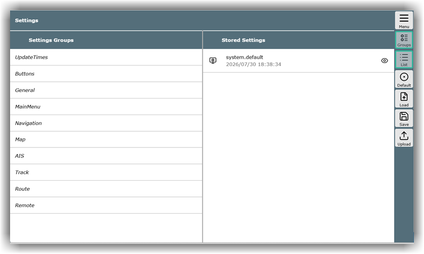
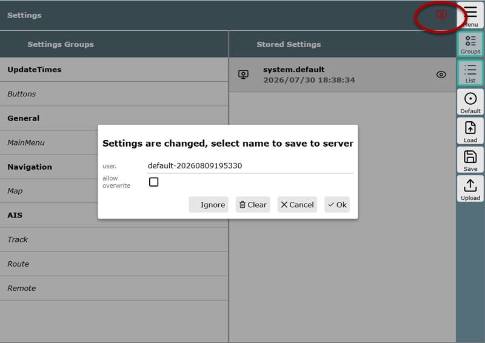
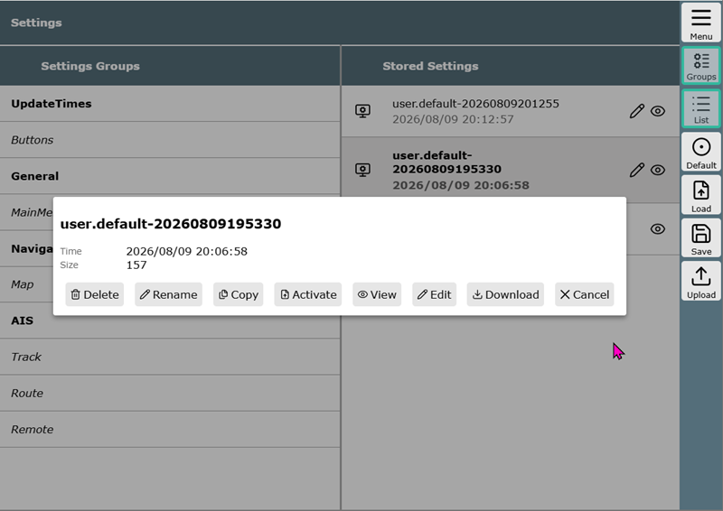

[Hier]({{VURL("settings")}}){.videolink} geht es zum Video, das einige Punkte aus diesem Kapitel visualisiert.

## Display Settings vs. Layout

Die Display Settings umfassen alle Einstellungen, die eine Anpassung der Benutzeroberfläche bzw. des Erscheinungsbilds von AvNav ermöglichen. Das beginnt bei der Größe der Schaltflächen und der Schriftgröße auf Buttons oder in anderen Bereichen des Programms. Es setzt sich fort bei den Farben von Routen oder Tracks, Abständen, der Länge des Kursvektors und vielem mehr. 

[Layouts](layout.md) hingegen fassen zusammen, wie die [Widgets](navpage.md#widgets) auf der Navigationsseite, der Routenseite und im Dashboard angeordnet werden sollen. Im Layout lässt sich festlegen, welche Widgets wo angezeigt werden und wie diese konfiguriert sind. 

## Display Settings

Der Zugriff auf die Display Settings ist auf verschiedenen Wegen möglich: zum einen über die Schaltfläche {{BT('ShowSettings')}} in der Buttonleiste jener Seiten, die eigene Einstellungen besitzen – oder alternativ über {{BT("ShowSettings",True)}} im Hauptmenü des jeweiligen Abschnitts. Um den Zugriff zu erleichtern und den Blick auf das Wesentliche zu lenken, wird in diesen Fällen nur die für die aktuelle Seite zutreffende Kategorie (*Settings Group*) angezeigt.  

Die zentrale Stelle erreicht man hingegen im Hauptmenü über {{MB("MMsettingspage")}}, wo eine vollständige Übersicht über sämtliche verfügbaren Kategorien geboten wird.

Es sind zwei Bereiche sichtbar: links die Settings Groups und rechts die Stored Settings. Auf kleinen Bildschirmen, wie beispielsweise bei Smartphones, ist der rechte Bereich durch Wischen oder Klick auf {{BT('SettingsItems')}} erreichbar.

Die Settings Groups gliedern die Kategorien, innerhalb derer Anpassungen vorgenommen werden können – für jede Gruppe öffnet sich jeweils eine Dialogbox. Die Felder darin verfügen weitestgehend über einen erklärenden Hilfetext. Über {{DB('DBReset')}} stellt man die Defaultwerte wieder her. Hier eine grobe Übersicht über die Inhalte:

| Settings Group | Inhalte |
| -------------- | ------- |
| Update Times | definiert die Intervalle, in denen Daten wie Position, AIS oder andere abgefragt werden |
| Buttons | definiert das Icon-Set, aber auch Aussehen, Systemverhalten und Beschriftung der Buttons. Hier kann man beispielsweise einstellen, ob sich die Buttonleiste bei Nichtnutzung versteckt oder ob ein Tooltip angezeigt werden soll |
| General | definiert die Basisschriftgrößen, die maximale Anzahl von Dashboardseiten, die Abdunkelung bei Nacht, Alarmlautstärke, Verhalten des roten Warn-Icons |
| Main Menu | definiert Verhalten und Umfang des Hauptmenüs |
| Navigation | definiert die navigationsrelevanten Merkmale wie Länge und Farbe der Kurse und des Bewegungsvektors, Abstandskreise, Größe des Boots-Icons, Mittelwertbildung für COG, SOG und Position, Parameter der Ankerwache |
| Map | definiert vielfältige Parameter zum Verhalten der Kartenanzeige, wie Anzeige der Gitternetzlinien, Kompass, Maßstabsanzeige, Zoomstufen, Fadenkreuzstärke und -farbe. Manche dieser Einstellungen werden [im Kapitel Karten](./charts.md) näher erläutert |
| AIS | definiert, ob und wie AIS-Objekte dargestellt werden, Distanzen, Abstände für Warnungen nach CPA und TPA. Manche dieser Einstellungen werden [im Kapitel AIS](../special/ais.md) näher erläutert |
| Track | definiert, wie Tracks dargestellt werden |
| Route | definiert, wie Routen dargestellt werden |
| Remote | definiert, wie die AvNav-Fernsteuerung eingerichtet ist. Diese Einstellungen werden [im Spezial Kapitel Fernsteuerung](../special/remotecontrol.md) erläutert |

## Settings speichern

Sobald eine Einstellung geändert ist, wird die Gruppe fett markiert, und es erscheint oben rechts ein kleines rotes Settings-Symbol – sozusagen als ständige Erinnerung daran, dass Änderungen zu speichern sind. Nach dem Klick darauf kann direkt ein Name für das neue Setting eingegeben oder der vorgeschlagene Name belassen und anschließend zum Speichern auf {{DB('DBOk')}} geklickt werden:

**Hinweis:** Dieses Symbol erscheint auch, wenn das Layout geändert wurde. Der Grund dafür ist, dass die gespeicherten Settings sowohl Informationen zu den Display Settings als auch zum Layout enthalten.

## Gespeicherte Settings

In der rechten Spalte ('Stored Settings') der Settings-Seite sind alle bisher gesicherten Settings aufgelistet. Das Stiftsymbol zeigt an, dass sich die jeweilige Einstellung bearbeiten und löschen lässt. Weitere Funktionen sind in der Dialogbox und direkt über die Buttonleiste auf der rechten Seite erreichbar.

Die Einstellung 'system.default' besitzt kein Stiftsymbol; dabei handelt es sich um feste Standardeinstellungen, die nicht verändert werden können. Der Grund hierfür ist, dass AvNav immer einen dauerhaft funktionierenden Satz an Einstellungen vorhält, auf den jederzeit zurückgegriffen werden kann, falls eine Konfiguration fehlerhaft angepasst wurde.