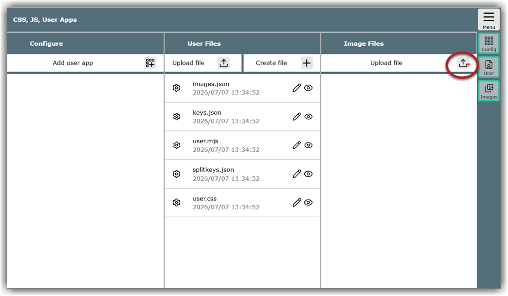
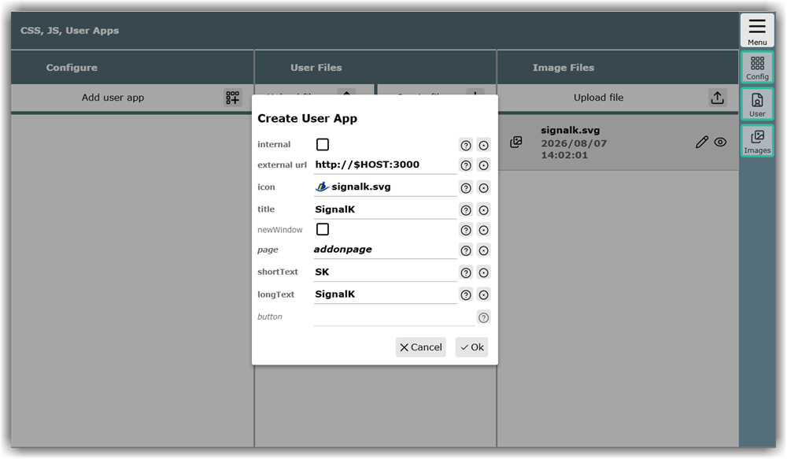

---
  tags:
    - Erweiterungen
    - User Apps
---
Ein Teil der Inhalte dieses Abschnittes wird auch im **[Video hier]({{VURL("userapps")}}){.videolink}** vorgestellt.   
## User Apps vs. Plugins

AvNav lässt sich vielseitig anpassen und erweitern - zu den Erweiterungen zählen die sogenannten User Apps. Das sind eigenständige Anwendungen, deren Benutzeroberfläche über einen Webbrowser aufrufbar ist. Beispiele hierfür sind der Datenserver SignalK oder der AIS-Catcher. Damit ein ständiger Wechsel zwischen verschiedenen Browser-Tabs vermieden wird, lassen sich diese Anwendungen nahtlos als Schaltflächen direkt in die Bedienoberfläche von AvNav integrieren. 

Zur Einordnung: neben den User Apps gibt es in AvNav auch Plugins.  Diese sind Programme, die eigenständig direkt mit den internen AvNav-Daten arbeiten (wie etwa das History-, das o-Charts- oder das Update-Plugin). Viele dieser Plugins bringen ebenfalls eine eigene Weboberfläche zur Bedienung mit. Wenn das der Fall ist, verhalten sie sich aus Sicht der Benutzeroberfläche wie User Apps und können auch so eingerichtet sein. (Mehr zu Plugins und auch, wie sie programmiert werden können, in einem separaten, tieferführenden  [Kapitel](special/plugins-extensions.md)).

Im Folgenden wird am Beispiel SignalK beschrieben, wie sich eine solche User App in AvNav definieren und in die Oberfläche integrieren lässt.

## Icon vorbereiten und hochladen

Damit die neue App in der AvNav-Oberfläche zu erkennen ist, muss man ihr ein eigenes, aussagekräftiges Symbol (Icon) zuweisen. Dafür wird zunächst ein passendes Bild (idealerweise im SVG- oder PNG-Format 50x50 px) benötigt. Über {{MB("MMaddonpage")}} betritt man die Seite "CSS, JS, User Apps".

 Werden auf einem kleineren Display nicht alle Spalten angezeigt, erreicht man die Spalte "Image Files" durch Wischen oder  {{BT('AddonConfigImages')}} in der Buttonleiste.
 Nach Klicken des Upload file icons {{ICON("Upload")}} lädt man das gewünschte Icon, sodass es dem System bei der Konfiguration zur Verfügung steht.

## User App definieren

Das eigentliche Definieren der User App erfolgt über den Dialog "Create User App". Dieser öffnet sich über das Icon {{ICON("AddonConfigPlus")}}

Zu den Feldinhalten erhält man über {{ICON("Help")}} einen kurz gefassten Hilfetext. Der Button {# {{ICON("SettingsDefaults")}}  geht nicht? #} {{BT("SettingsDefaults")}} setzt den Feldinhalt auf den Defaultwert zurück. Hier ausführlichere Hinweise:

| Feld | Bedeutung |
| ------ | -------- |
| internal | Wenn die Checkbox **markiert** ist, fungiert AvNav als einfacher Webserver und zeigt eine auf dem Gerät gespeicherte HTML-Seite an. Im Abschnitt [Details](../special/userfiles.md#userappexample) findet sich die Beschreibung, wie als fortgeschrittenere Anwendung etwa eigene PDF-Bootsdokumente angezeigt werden können.  Wenn die Checkbox **nicht markiert** ist, werden Webadressen aufgerufen. |
| internal url| Wird nur angezeigt, wenn das Feld "internal" **markiert** ist: Beim Betreten des Feldes wird eine Liste von bereits hochgeladenen HTML-Dateien angezeigt. Es muss eine davon ausgewählt oder eine neue hochgeladen werden. |
| external url| Wird nur angezeigt, wenn die Checkbox "internal" **nicht markiert** ist: Beliebige Webadresse für Geräte im Netzwerk oder im Internet. Diese muss mit http:// oder https:// beginnen. Befindet sich der Dienst auf dem AvNav-Server, sollte anstelle der IP-Adresse $HOST eingesetzt werden. Nur so ist sichergestellt, dass Browser das Ziel auch erreichen, wenn sie über eine andere Netzwerkverbindung zugreifen. |
| icon | Hier wird das Icon für die App ausgewählt. Die Anzahl der Listeneinträge lässt sich durch Abwählen der Option "builtin" deutlich reduzieren. Befindet sich das gewünschte Bild noch nicht in der Liste, kann eine neue Datei über {{DB("Upload")}} am Ende der Liste hochgeladen werden. |
| title | Dieser Text wird im Titelbalken der User App angezeigt. |
| new window | Wird nur angezeigt, wenn die Checkbox "internal" **nicht markiert** ist: Ist diese Checkbox markiert, wird die User App in einem neuen Browserfenster oder Tab geöffnet. |
| page| In der Vorbesetzung werden User Apps auf der Seite "User Apps" in der Buttonleiste angezeigt. Es ist allerdings auch möglich, die Schaltfläche auf anderen Seiten unterzubringen, wo sie dann je nach Kontext besser zu finden ist. Die gebräuchlichsten Seiten sind in Anlehnung an die Menüeinträge:  navpage - Navigations-Seite gpspage - Dashboard-Seiten aispage - AIS-Seite addonpage - User App-Seite serverpage - Server-Seite |
| short text| Dies ist der Text, den die Schaltfläche in der Buttonleiste anzeigt. Naturgemäß passen hier nur wenige Zeichen. |
| long text | Dies ist der Text, den der Eintrag im jeweiligen Hauptmenüabschnitt anzeigt. |
| button | Dieses Feld ist nicht änderbar. Es wird vom System automatisch befüllt und enthält einen Identifikator, der fortgeschrittene Anpassungen via CSS ermöglicht. |

