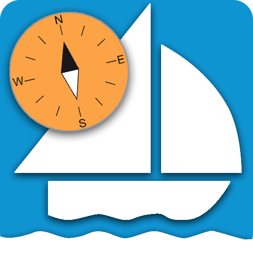

# AvNav Dokumentation
Hier findet man die AvNav Dokumentation für Version {{config.extra.version}}.
Für andere Versionen bitte in der Kopfzeile die Version auswählen.

{.small}

* [Demo](special/demo.md)


## Autoren

[Andreas(Wellenvogel)](https://www.segeln-forum.de/cms/user/14117-wellenvogel)

Kontakt über das [Segeln Forum](https://www.segeln-forum.de/board/195-open-boat-projects-org/) oder per [mail](mailto:avnav@wellenvogel.de).

Besonderer Dank geht an die fleissigen Helfer, die diese Dokumentation ermöglichen:

* [Moeritsen](https://www.segeln-forum.de/cms/user/20863-moeritsen/) - besonders auch für die Videos und Icons
* [NoStress](https://www.segeln-forum.de/cms/user/31846-nostress/)
* [BlackSea](https://www.segeln-forum.de/cms/user/27970-blacksea/)

