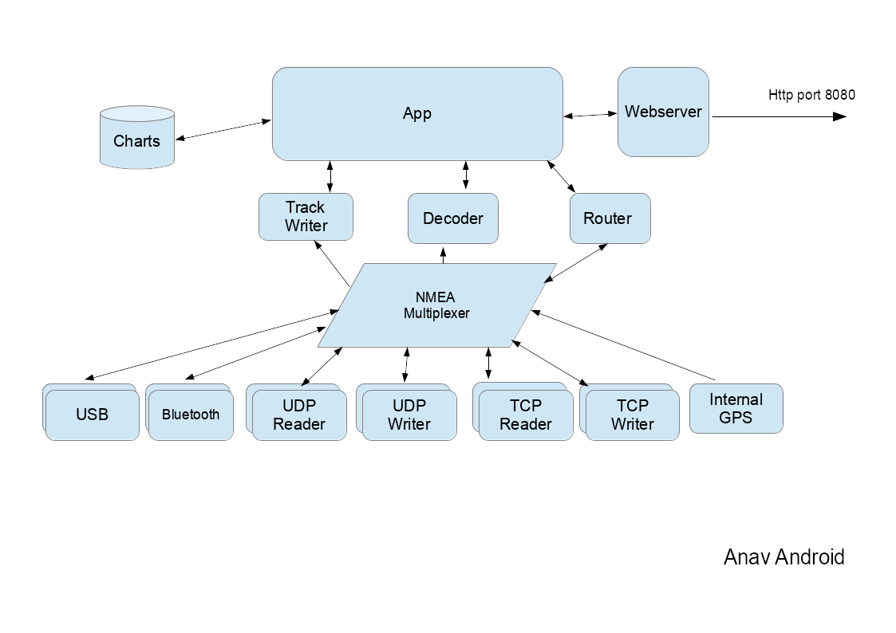
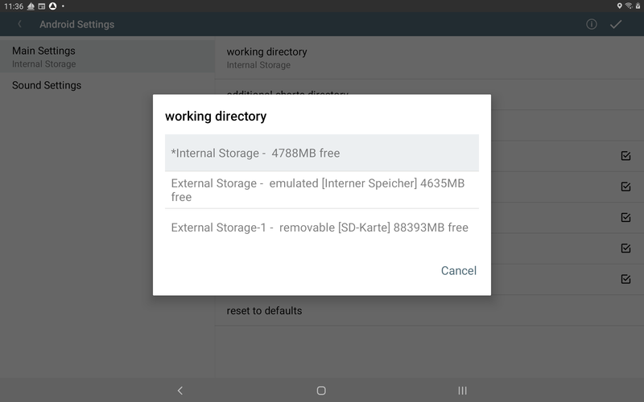
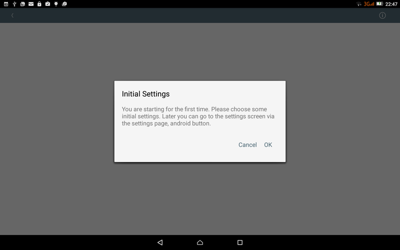
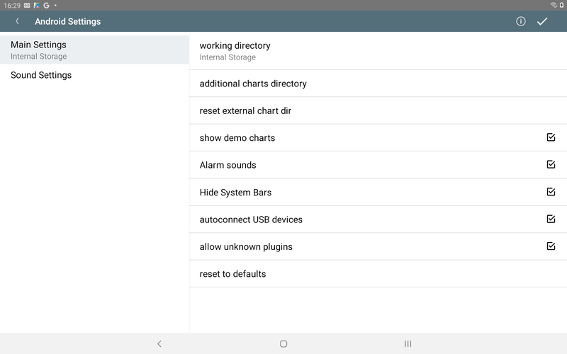

---
  tags:
    - Installation
    - Android
---

# Android

Auf dieser Seite wird die Installation von AvNav als Android-App beschrieben. Ausserdem wird auf einige Besonderheiten dieser AvNav-Variante eingegangen.

## Überblick

Als Alternative zur Installation des AvNav Servers auf einem [Linux](linux.md)/[Raspberry](raspberry.md) oder [Windows](windows.md) System und der Nutzung eines Android Gerätes zu Anzeige kann man AvNav auch als App auf einem Android Gerät installieren. Damit kann man sowohl den Server-Teil wie auch den Anzeige-Teil direkt auf diesem Gerät laufen lassen.

Als Einstieg ist das u.U. einfacher als die anderen Varianten.

Man kann die App über die Release-Seite als `.apk`Datei herunterladen und installieren - oder direkt aus dem [Play Store](https://play.google.com/store/apps/details?id=de.wellenvogel.avnav.main) installieren.

Intern besteht die App im Wesentlichen aus den gleichen Funktionsblöcken, wie die anderen AvNav Versionen.

Der NMEA-Multiplexer verarbeitet NMEA0183-Daten von den verschiedenen
Quellen. Neben dem internen Geräte-GPS können die Daten von Quellen wie
TCP-Verbindungen, UDP Ports, USB-Geräten oder Bluetooth-Verbindungen
kommen. Die meisten Quellen unterstützen das gleichzeitige Senden und
Empfangen von Daten. Es können jeweils mehrere Quellen des gleichen Typs
konfiguriert werden (in der App-Konfiguration existiert für jede Quelle
ein sogenannter "Handler").
Die Konfiguration erfolgt wie auch in den anderen AvNav-Varianten über

{{MM("MMchannelspage")}}

bzw. über 

{{MM("MMserverpage")}}

[Unter diesem Link](../special/configfile.md#android) findet man die Beschreibung der konfigurierbaren Werte.

Die eigentliche [Anzeige mit der Kartendarstellung und den Widgets](../base/navpage.md) kann
einerseits ganz normal in der App genutzt werden. Parallel dazu können andere Geräte per Browser zugreifen - siehe dazu die [Hinweise](#external) was dafür konfiguriert werden muss.

Da der Server-Teil der Android-App eine separate Implementierung ist, können [Plugins](../special/plugins.md), die Python-Anteile besitzen, unter Android nicht genutzt werden. In der [Liste der Plugins](../special/plugin-list.md) ist jeweils angegeben, ob sie auch unter Android nutzbar sind.

Der Anzeige-Teil der App kann beendet werden, sodass der Multiplexer
allein im Hintergrund weiter läuft. Damit kann AvNav auch genutzt werden,
um NMEA-Daten für andere Android-Apps bereitzustellen. In AvNav
konfiguriert man dazu einen TcpWriter, in den zugreifenden Apps verbindet
man sich über die Adresse 127.0.0.1 und den beim TcpWriter konfigurierten Port.

## Karten und gespeicherte Daten (Arbeitsverzeichnis)

AvNav speichert alle
seine Daten und die Karten in einem Arbeitsverzeichnis.

Von den Android Einstellungen

{{MM("MMserverpage")}} -> {{BT("StatusAndroid")}}

 kann man das Arbeitsverzeichnis (working
directory) auswählen.

Je nach Gerät kann man verschiedene Speicherorte für die Daten
auswählen (technische Informationen finden Sie in der [Android-Dokumentation](https://developer.android.com/training/data-storage/app-specific?hl=de)).
Wenn das Gerät über eine SD-Karte verfügt, wird die oben gezeigte Auswahl
angezeigt:

| Name | Erklärung |
| --- | --- |
| Internal Storage | Dies ist ein Speicherort im internen Flash-Speicher Ihres Geräts. Er ist vollständig privat und (sofern das Gerät nicht gerootet ist) nicht für andere Apps wie z. B. einen Dateimanager zugänglich.  Dies ist die Standardeinstellung. Es ist auch in Versionen vor 20250822 verfügbar.  Das "\*" vor dem Eintrag zeigt an, dass dieses Verzeichnis bereits als Arbeitsverzeichnis verwendet wurde und Daten enthält. |
| External Storage | Dieser Speicher befindet sich weiterhin im internen Flash-Speicher, wird jedoch vom Android-System anders behandelt (und daher als "extern - emuliert" bezeichnet). Andere Apps können auf diesen Speicherort zugreifen.  Man kann diesen Speicherort auswählen, wenn andere Apps (z. B. ein Dateimanager) auf die Daten zugreifen sollen. Der Pfad für einen Dateimanager lautet typischerweise [interner Speicher]/Android/data/de.wellenvogel.avnav.main/files (oder [interner Speicher]/Android/data/de.wellenvogel.avnav.main.beta/files für eine Beta-Version). |
| External Storage-1 | Dieser Pfad ist nur sichtbar, wenn das Gerät eine SD-Karte installiert hat. Als Erklärung wird auch „removable [SD-Karte]“ angezeigt.  Falls verfügbar, befindet sich dieses Verzeichnis tatsächlich auf einer externen SD-Karte. Wenn man es verwenden möchte, muss die SD-Karte immer installiert ist, wenn AvNav läuft. Falls die SD Karten entfernt wird, während AvNav läuft, kann es zum Absturz kommen.  Andere Apps wie ein Dateimanager können auf die Daten zugreifen.  Der Speicherort ist [SD-Karte]/Android/data/de.wellenvogel.avnav.main/files (oder [SD-Karte]/Android/data/de.wellenvogel.avnav.main.beta/files).  |

Wenn man das Arbeitsverzeichnis ändert, werden alle Ihre Daten im alten
Arbeitsverzeichnis für AvNav unsichtbar (sie bleiben jedoch verfügbar und
man kann jederzeit zum alten Verzeichnis zurückkehren).

Beim Start von AvNav wird geprüft, ob das ausgewählte Arbeitsverzeichnis
noch verfügbar ist (und man wird aufgefordert, ein anderes auszuwählen,
falls nicht).

Für externe Verzeichnisse kann man grundsätzlich einen Dateimanager
verwenden, um Daten dorthin und von dort zu kopieren. AvNav erkennt diese
Daten jedoch potentiell nicht, wenn es gerade läuft. Daher empfiehlt es
sich, die Daten direkt in der App hochzuladen. Man kann aber z.B. eine
Zip-Datei mit diesen Daten als Backup erstellen.

Alle WorkDir-Verzeichnisse werden geleert, wenn man AvNav deinstalliert
(oder die Daten bereinigt).

Wichtiger Hinweis: Einstellungen (z. B. die Konfiguration des
Multiplexers und andere Android-Einstellungen) werden nicht im WorkDir
gespeichert.

Wenn man ein zusätzliches Kartenverzeichnis wählt, befindet sich dieses
außerhalb von AvNav. Dort kann man Karten im Gemf- oder XML-Format
speichern. Dieses Verzeichnis kann außerhalb von AvNav erstellt und
aufgerufen werden. Es wird bei der Deinstallation von AvNav oder beim
Entfernen der Daten nicht berührt.

Um O-Charts (oder S57-Karten) zu verwenden, muss man die separate App [avocharts](../special/ochartsng.md#android)
installieren und die Karten dort installieren.

## Erster Start

Nach dem erstmaligen Start der App befindet man sich auf einer
Einführungsseite:

 

Nach dem Klick kommt man auf die Einstellungsseite:  

  

Hier können neben anderen Einstellungen z. B. das interne oder externe
Arbeitsverzeichnis gewählt sowie das externe Karten-Verzeichnis gesetzt
werden.  
Außerdem können hier auch alle Einstellungen zurückgesetzt werden.  
Eine Liste aller Android spezifischen Einstellungen findet sich [hier](#Settings).  

Die "Settings"-Seite kann über den "OK"-Button (oben rechts) oder über
den "Zurück"-Button verlassen werden.   
Immer wenn die Einstellungen verlassen werden, prüft AvNav, ob die
notwendigen Berechtigungen erteilt wurden.  
AvNav braucht die folgenden Berechtigungen:

* genauer Standort (GPS) während der Nutzung der App
* Benachrichtigungen für eine Anzeige, dass AvNav läuft, auch wenn es im
  Hintergrund ist

Zusätzlich prüft AvNav, ob der Energiesparmodus aktiv ist. Falls ja, kann
AvNav im Hintergrund nicht das interne GPS des Gerätes nutzen. AvNav zeigt
dann eine Warnung an.

Anschließend wird die [Navigationsseite](../base/navpage.md)
der App aufgerufen. 

Bei weiteren Starts erreicht man sofort die Navigationsseite.    
  

## Externer Zugriff {: #external}

Die App ermöglicht es, dass man sich mit einem Browser von anderen
Geräten verbinden kann. Dazu muss in der App der Web-Server aktiviert
werden:

{{MM("MMserverpage")}} -> WebServer -> {{SB("Edit")}}

Bei der Aktivierung des Web-Servers muss `external`
aktiviert werden. Mit `mdnsEnabled` wird dafür gesorgt, dass sich eine
Bonjour-fähige App (z.B. [BonjourBrowser](https://play.google.com/store/apps/details?id=de.wellenvogel.bonjourbrowser))
mit dem Server der App verbinden kann.

Das ermöglicht beispielsweise auch den Zugriff von einem Laptop oder Computer aus - das kann das Hochladen und Bearbeiten von Dateien oder auch das Anpassen des Layouts vereinfachen.

## Hintergrund

Der NMEA-Multiplexer und auch der Web-Server von AvNav können ohne
Anzeige auch im Hintergrund laufen. Das kann genuzt werden, wenn die
Anzeige für Benutzer auf einem anderen Gerät erfolgen soll - oder wenn
eine andere App für die Navigation genutzt wird und nur der Multiplexer
von AvNav benötigt wird.  

Dazu wird nach dem Start auf der Hauptseite über 

{{MMA("MainExit")}}

der Beenden-Dialog aufgerufen und dort
"BACKGROUND" ausgewählt.  
Im Hintergrund ist die Track-Aufzeichnung und der Router weiter aktiv, auch eine potentielle Ankerwache bleibt aktiv und erzeugt u.U. Alarme.
Über die Benachrichtigung (in der Android-Nachrichtenzeile) kann die App
wieder in den Vordergrund geholt - oder direkt beendet werden.
Über die Benachrichtigung kann auch ein potentiell ausgelöster Alarm beendet werden.
  

## Einstellungen {: #Settings}

Zusätzlich zu den normalen Einstellungen, die man über

{{MM("MMsettingspage")}}

{{MM("MMchannelspage")}}

oder

{{MM("MMserverpage")}}

erreicht, gibt es Android spezifische Einstellungen, die man über

{{MM("MMserverpage")}} -> {{BT("StatusAndroid")}}

erreicht.

### Android Main Einstellungen

| Name | Bedeutung | Default |
| --- | --- | --- |
| working directory | man kann auswählen, wo das AvNav [Arbeitsverzeichnis](#workingdirectory) liegen soll (internal storage oder external storage) | internal storage |
| additional charts directory | ein zusätzliches Kartenverzeichnis, das sinnvollerweise auf einer externen SD-Karte angelegt werden sollte | --- |
| reset external chart dir | setze das zusätzliche Kartenverzeichnis zurück |  |
| show demo charts | Anzeige der Demo-Karten. Das erfordert eine aktive Internetverbindung) | ein |
| Alarm-Sounds | Hier können die durch den Server erzeugten Alarm-Sounds abgeschaltet werden. Im Browser müssen diese ggf. zusätzlich abgeschaltet werden. | ein |
| Hide System Bars | Verberge die Android Kopf- und Fußzeile | ein |
| autoconnect USB devices | Wenn eingeschaltet wird AvNav gestartet, sobald ein unterstütztes USB-Gerät verbunden wird. Falls dieser Schalter ausgeschaltet ist, kann man USB-Geräte auch über den + Button auf der Server/Status Seite konfigurieren. | ein |
| allow unknown plugins | AvNav hat ein (experimentelles) Plugin Interface, das es anderen Apps ermöglicht, AvNav über bereitgestellte Funktionen zu informieren (im Moment nur Karten). Mit diesem Schalter können das auch Plugins, die noch nicht in AvNav bekannt sind. Anmerkung: avocharts benötigt das nicht. | ein |
| reset to defaults | Rücksetzen der Multiplexer-Einstellungen auf Default-Werte |  |

### Android Sound-Einstellungen

| Name | Bedeutung | Default |
| --- | --- | --- |
| Sound for XXX alarm | Hier kann der Ton für die verschiedenen Alarme gewählt werden |  |
| reset to defaults | Rücksetzen der Sound-Einstellungen auf Defaults |  |
