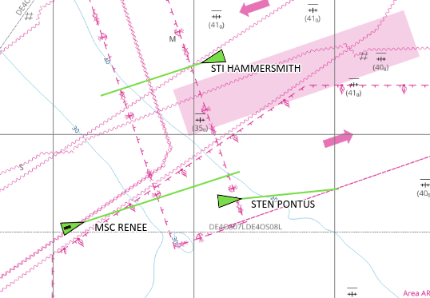
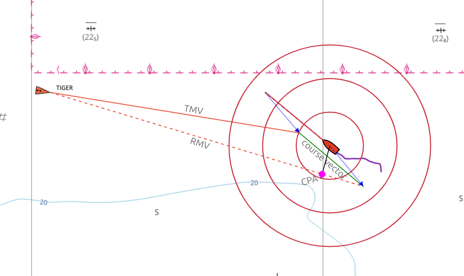
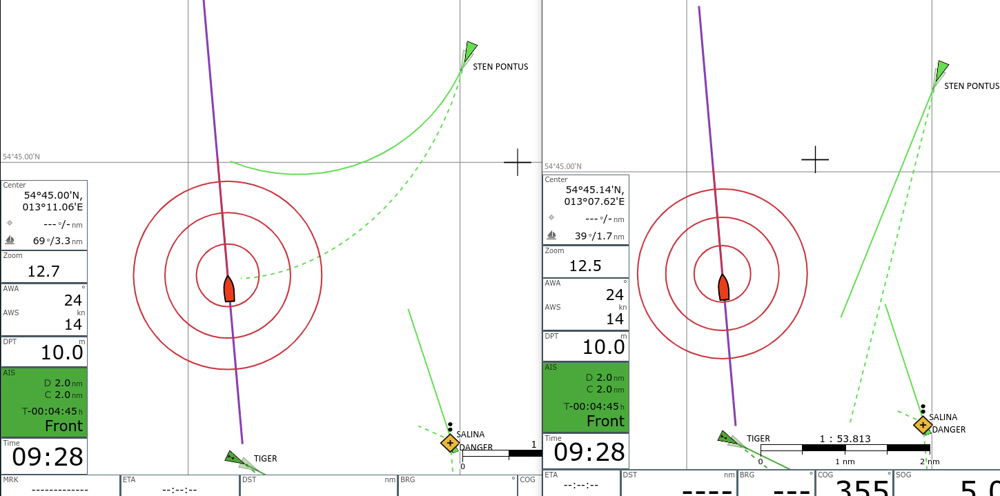
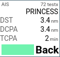
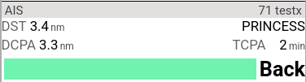
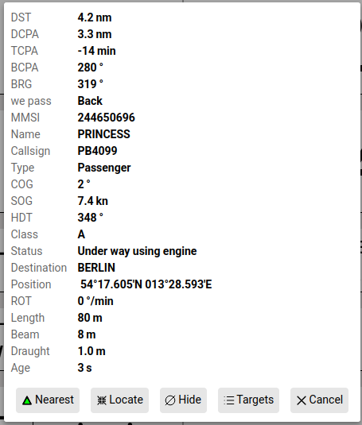
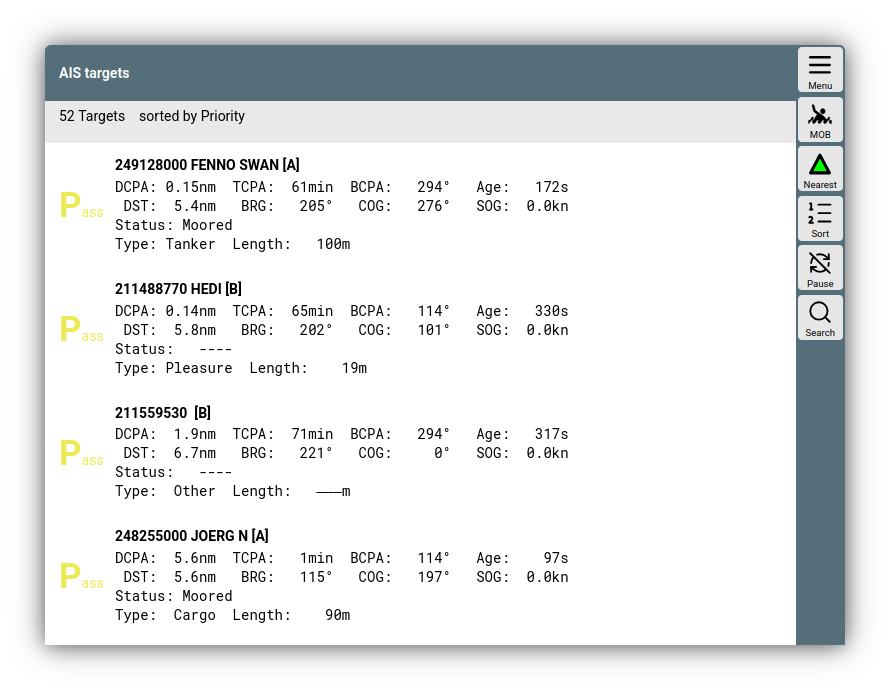

---
  tags:
    - Ais
---

# AIS Details
AIS Ziele bis zu einer bestimmten Entfernung zur aktuellen Position
werden in der Karten zusammen mit einigen Informationen dargestellt.
Alle Einstellungen, die diese Anzeige beeinflussen, erreicht man unter

{{MM("MMsettingspage")}}->AIS

oder unter

{{MM("MMaiscfgpage")}} -> {{BT("ShowSettings")}}

Ausserdem werden einige Bewegungsvektoren und eine berechnete
Position basierend auf dem Alter der AIS Information, Kurs und Geschwindigkeit (als Schatten)
angezeigt (Einstellungen "show estimated position").  
Die Symbole für die AIS-Ziele können durch [eigene Symbole](usericons.md) angepasst werden, bei Bedarf unterschiedlich je nach
AIS-Schiffsklasse oder navigational status. Für das eigene Boot und für
die AIS-Ziele wird ein Kurs-Vektor gezeichnet, dessen Ende die Position
nach 10 Minuten (einstellbar) markiert.

Auch AIS Atons werden dargestellt (dazu muss in den Einstellungen
"only show moving targets" ausgeschaltet und "show other" eingeschaltet
sein). 

Es kann ausserdem gewählt werden, ob die Ausrichtung des AIS Zieles nach
HDG erfolgt (sofern empfangen - Einstellung "use heading for
direction") - sonst nach COG. Der Course Vector eines AIS Zieles wird
immer nach COG ausgerichtet.  
Es gibt unterschiedliche Symbole für die AIS Ziele - für Details siehe
unter "[Nutzerdefinierte Icons](usericons.md)".
Die AIS Symbole können in ihrer Größe verändert werden (Einstellungen "Icon Scale"), ein Rand kann ebenfalls hinzugefügt werden ("Einstellungen "Border Width"). Falls die Berechnungen
der AIS Kursvektoren zu aufwändig ist (Browser wird zu langsam), kann
sie in den Einstellungen abgeschaltet werden (Einstellungen "Use Course
Vector").

Durch Klick auf ein AIS-Ziel (oder auf die Anzeige des nächsten Zieles
in den Anzeige-Bereichen) erhält man alle [Informationen](#aisinfo)
zu diesem Ziel und kann zur [Liste aller
AIS-Ziele](#aislist) navigieren.

## AIS Bewegungsvektoren

Eine grundsätzliche Einführung in das Thema true und relative motion
vectors und wie diese in der Navigation verwendet werden, ist zu finden
unter

* <https://msi.nga.mil/Publications/RNMB>
  (Seite 59)
* <https://www.youtube.com/watch?v=8YUic4LdWFg>

True Motion Vectors
-------------------

AvNav stellt für AIS-Targets deren voraussichtlichen Track über Grund
dar, wenn in den Einstellungen "use-course-vector"
aktiviert ist. Dazu wird ausgehend von der zuletzt bekannten Position
des Targets eine Linie gezeichnet in Richtung des Kurs-über-Grund (COG)
des Targets und der Länge Fahrt-über-Grund (SOG) multipliziert mit
boat-course-vector-length. Diese Linie ist der sog. *true motion
vector*, kurz TMV.

Relative Motion Vectors
-----------------------

Zusätzlich können in AvNav *relative motion vectors*
dargestellt werden. Dazu in den Einstellungen "relative-motion-vector-range" auf
einen Wert größer als Null setzen, dann werden für Targets, die sich im
Umkreis dieser Distanz befinden zusätzlich RMVs als gestrichelte Linien
angezeigt.

Der RMV zeigt die Bewegung des Targets *relativ* zum eigenen
Schiff, er ergibt sich als Differenz zwischen TMV und dem eigenen
Kurs-Vektor, sodass TMV, RMV und der eigene Kurs-Vektor ein Dreieck
bilden. Zeigt der RMV eines Targets direkt auf das eigene Schiff, dann
besteht die Gefahr einer Kollision. Ebenso kann man die Lage des CPA
direkt aus dem RMV ablesen, man fällt das Lot vom eigenen Schiff auf den
RMV.

Die RMVs entsprechen den Spuren, die die Targets auf einem Radarschirm
hinterlassen würden.

Gekrümmte Vektoren
------------------

Aktiviert man in den Einstellungen "curved-vectors",
so wird eine eventuell in den AIS-DateScreenshot_20260802_120043n vorhandene rate-of-turn (ROT)
ausgewertet und die Drehung des Targets bei der Darstellung der Vektoren
berücksichtigt. Die TMVs und RMVs werden dann als gekrümmte Linien
dargestellt. Die gekrümmten Vektoren zeigen eine potenzielle Kollision
ggf. viel früher an als die ungekrümmten Vektoren.

## Berechnung von CPA und Bewegungsvektoren {: #aiscomputations}

Um CPA und Bewegungsvektoren zu berechnen, benutzt AvNav die von einem
AIS Ziel empfangenen Daten (position, COG, SOG) und die Daten des
eigenen Bootes (position, COG, SOG).

AvNav berechnet:

* Den Punkt, an dem sich die beiden Kurse treffen (unser Kurs und der
  Kurs vom AIS Ziel - beide COG)
* Den Punkt, an dem wir die minimale Distanz zum AIS Ziel haben - die
  CPA.

Es werden auch die Zeiten berechnet, um diese Punkte zu erreichen.
Negative Zeiten bedeuten dabei, dass wir an diesem Punkt bereits vorbei
sind.  
Abhängig davon wird entschieden, wie wir das Ziel passieren:

* front = wir passieren vor dem Ziel
* back = wir passieren hinter dem Ziel
* pass = wir haben das Ziel bereits passiert - oder es gibt keinen
  Begegnungspunkt - z.B. festliegendes Ziel
* done = wir haben den Kurs bereits gekreuzt und auch den Punkt mit
  dem kleinsten Abstand bereits passiert

Basierend auf der berechneten DCPA (minimale Entfernung am CPA Punkt)
und TCPA (Zeit bis zum CPA Punkt) setzt AvNav eine Warnung für das Ziel,
wenn die Werte unter den konfigurierten Schwellwerten liegen.

### Priorität {: #aispriority}

Um zu entscheiden, welches Ziel im AisTargetWidget angezeigt wird und
für die Sortierung in der [AIS liste](#aislist) wird für
jedes Ziel eine Priorität berechnet.  
Die Priorität von hoch zu niedrig:

1. Ziele mit Warnung (d.h. CPA < warning CPA und TCPA < warning
   TCPA aber > 0)  
   Diese werden nach TCPA sortiert, niedrigste TCPA ganz oben.
2. Andere Ziele sortiert nach kleinstem (dx)²+(dy)² .  
   Für TCPA < 0 (also kleinster Abstand schon in der Vergangenheit)
   dx=dy=distance/warningDistance.  
   Für TCPA >= 0 dx=tcpa/warningTime, dy=cpa/warningDistance

Auf diese Weise lassen sich die Ziele nach ihrer Bedeutung für die
Navigation sortieren.

## Berechnungsoptionen

Vor Version 20250723 benutzte die Berechnung die Daten der AIS Ziele
so, wie sie auf der Karten angezeigt werden und die Bootdaten von dem
Zeitpunkt, wenn die Berechnung erfolgte.

Diese Berechnung hat einige Nachteile:

Ein AIS Ziel befindet sich normalerweise in Fahrt, und AIS Nachrichten
werden nur in relativ großen Zeitabständen gesendet/empfangen. Ausserdem
lädt der Anzeigeteil von AvNav (im Browser) die AIS Daten nur in
bestimmten Abständen (settings/UpdateTimes/AIS - default 5 Sekunden).
Damit werden die AIS Symbole auf der Karte an einer Position
dargestellt, die sie einige Zeit in der Vergangenheit hatten. Und auch
die darauf basierenden (CPA/Distance) Berechnungen sind damit nicht ganz
korrekt - sie nutzen die Boot position/course/speed zur Zeit der
Berechnung, und AIS Ziel position/course/speed von einem Zeitpunkt an
dem die Nachricht vom Ziel versendet wurde.

Wenn man eine typische Situation hat mit einem Ziel, dem man sich
annähert, wird man eine ständige Änderung in den berechneten CPA Werten
erleben - auch wenn das Boot und das Ziel Kurs und Geschwindigkeit
beibehalten.

Ab Version 20250723 bietet AvNav die Option (aktiv als default,
Einstellungen "CPA from estimated"), CPA und Bewegungsvektoren aus einer
geschätzten Position des AIS Zieles zu berechnen. Diese Position ist dieselbe, die als Schattensymbol auf der Karte dargestellt wird. Die
Berechnung nimmt dabei an, dass das AIS Ziel Kurs und Geschwindigkeit
beibehält und berücksichtigt das Alter der AIS Information.

Dieses Alter berücksichtigt die folgenden Zeiten:

1. Die Zeit, die eine AIS Nachricht im AvNav server vom Empfang bis zur
   Abholung durch den Browser verbringt. Wenn die Daten von  [SignalK](signalk.md) 
   kommen, wird auch die Zeit berücksichtigt, die die Daten bereits in
   SignalK verbracht haben.
2. Die Zeit vom Empfang im Browser bis zur Berechnung (Maximum: AIS
   update time - settings/UpdateTimes/AIS - 5s).

Wenn man diese Berechnung nutzt, erhält man normalerweise einen
konstanten CPA, wenn Boot course/speed und AIS Ziel course/speed gleich
bleiben. In den meisten Fällen erhält man damit ein besseres Resultat.

Es gibt allerdings 2 Probleme, die man damit nicht lösen kann:

1. Wenn die Berechnung der Zeit zwischen dem Empfang der AIS Nachricht
   und der Abholung durch den Browser nicht korrekt ist (z.B. fehlende
   Zeitsynchronisation zwischen AvNav und SignalK), wird man immer
   fehlerhafte Resultate bekommen. Problematisch ist, dass man das u.U.
   nicht bemerkt, da der Fehler über die Zeit konstant bleibt.
2. Wenn das AIS Ziel Kurs oder Geschwindigkeit verändert, ist die
   geschätzte Position falsch. Das ist allerdings im Normalfall nur ein
   temporäres Problem solange diese Änderung andauert.  
   Im Prinzip könnte man auch ROT (rate of turn) eines Zieles
   berücksichtigen - allerdings ist es nicht sehr wahrscheinlich, dass
   ROT über eine längere Zeit konstant ist - daher wird das nicht
   benutzt.

Da beide Berechnungen ihre Limitierungen haben, kann der Nutzer am Ende
entscheiden, welche genutzt werden soll.

Alle AIS Berechnungen werden in einem separaten
Thread (worker) im Browser durchgeführt und werden bei jeder
Positionsänderung wiederholt. In älteren Versionen wurden die
Berechnungen nur ausgeführt, wenn neue AIS Daten abgerufen wurden.

## Anzeigen (Widgets)

Neben der Anzueige auf der Karte gibt es das "AisTargetWidget", das entweder das AIS Ziel mit der höchten Priorität oder ein ausgewähltes Ziel (das im [AIS Dialog](#aisinfo) über {{DB("AisInfoLocate")}} ausgewählt wurde)

{.small}
///caption
Navigationsseite.
///

{.small}
///caption
Dashboard.
///

Die Darstellung des nächsten AIS Zieles (geringste momentane
Entfernung) färbt sich rot, wenn eine CPA von 500m (einstellbar)
unterschritten wird. Gelb bedeutet, dass nicht das nächste Ziel, sondern ein separat ausgewähltes Ziel (siehe unten AIS) angezeigt wird. 

## AIS Info Dialog { #aisinfo }

Ein Klick auf as AIS Widget oder ein AIS Ziel in der [Feature Liste](featureinfo.md) (nach Klick auf die Karte) zeigt eine detaillierte Information zum AIS Ziel an.

///caption
AIS Info Dialog
///

| Button | Funktion |
| --- | --- |
| {{DB("AisNearest")}} | Setzt das Widget wieder auf Anzeige des Ziels mit höchster [Priorität](#aispriority) und zentriert die Karte auf dieses Ziel, falls nicht der Modus {{BT("LockPos")}} aktiv ist.|
| {{DB("AisInfoLocate")}} | Setzt das Widget in den Folgemodus. Damit werden ständig die Werte für dieses Ziel angezeigt und das Ziel auf der Karte wird orange gefärbt (Farbe: Einstellungen "Tracking"). Die Karte wird auf dieses Ziel zentriert.|
| {{DB("AisInfoHide")}} | Verberge diese AIS Ziel für eine gewisse Zeit (Einstellungen "hide time") |
| {{DB("AisItems")}} |  Zeige die [Liste](#aislist) aller AIS Ziele |

## Liste der AIS Ziele { #aislist }

Über einen Klick auf {{DB("AisItems")}} im [AIS Info Dialog](#aisinfo) oder auf der AIS-Seite

{{MM("MMaiscfgpage")}}-> {{BT("AisItems")}}

erhält man die Liste der AIS Ziele.

///caption
AIS Ziele
///
Durch Klick auf die Zeile "sorted by..." kann man die Sortierreihenfolge verändern. Die Zahl der anzuzeigenden Werte pro Ziel kann unter Einstellungen "reduce details in list" verringert werden.
Ein Klick auf ein Ziel in der Liste öffnet wieder den [AIS Info Dialog](#aisinfo).

| Button | Funktion |
| --- | --- |
| {{BT("AisNearest")}} | Setzt das AIS Widget wieder auf Anzeige des Ziels mit höchster [Priorität](#aispriority) und zentriert die Karte auf dieses Ziel, falls nicht der Modus {{BT("LockPos")}} aktiv ist. |
| {{BT("AisSort")}} | Ändere die Sortierreihenfole in der Liste |
| {{BT("AisLock")}} | Pausiere das automatischen Aktualisieren der Liste |
| {{BT("AisSearch")}} | Suche in den Zielen. Der eingegebene Text wird in MMSI, Name, Callsign und Shipname gesucht. Nur die gefundenen Ziele werden angezeigt. Ein nochmaliger Klick beendet die Filterung.|

