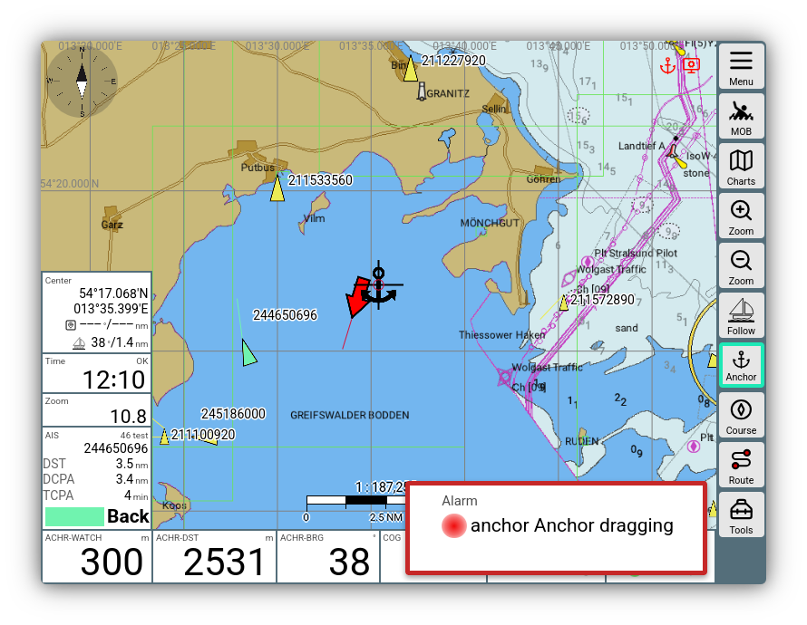
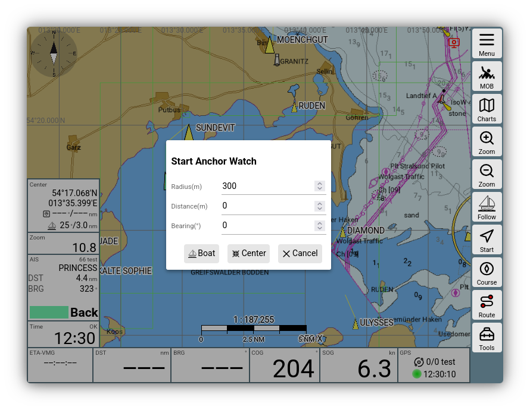
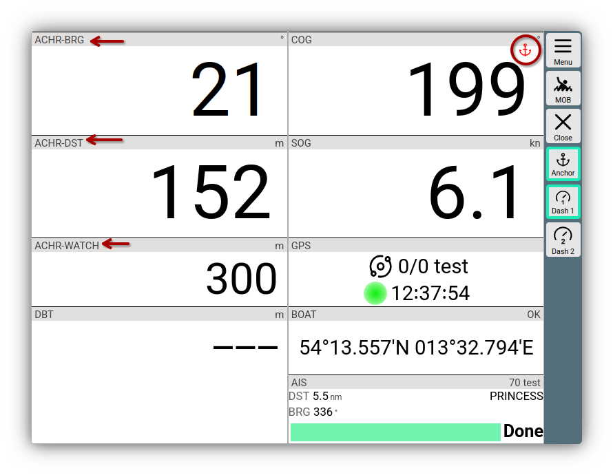
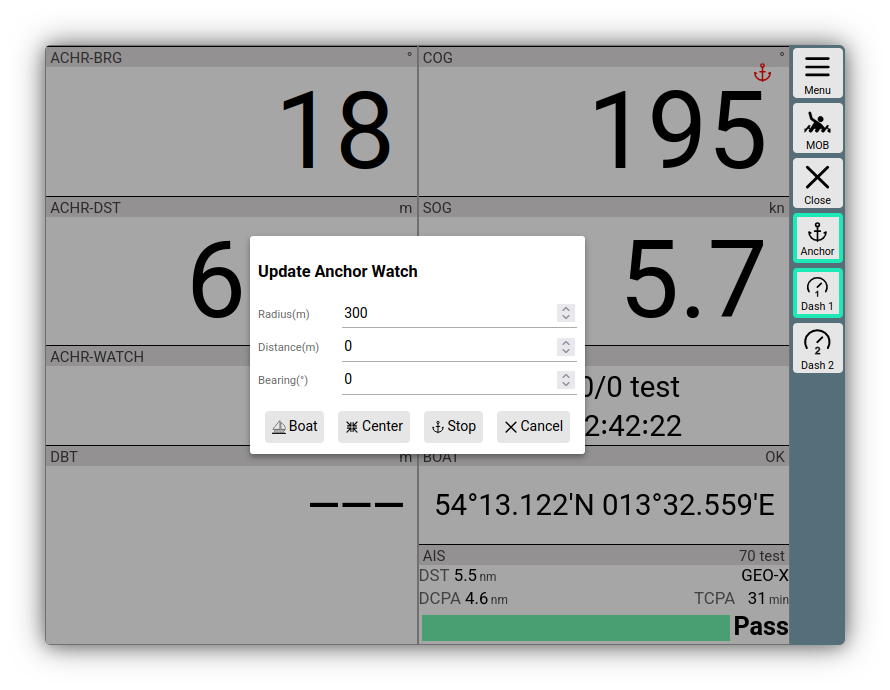

---
  tags:
    - Anker
    - Ankerwache
    - Alarm
---

# Ankerwache

AvNav hat eine Ankerwache. Die Funktion läuft komplett auf dem AvNav Server (bzw. unter Android in der AvNav App). Auch wenn kein Anzeigegerät aktiv ist (oder unter Android AvNav im Hintergrund läuft) bleibt die Funktion aktiv.

Wenn der definierte Bereich verlassen wird, wird ein Anker-Alarm ausgelöst. 

///caption
Ankerwache Alarm
///

## Alarm Android
Unter Android wird der Alarm angezeigt, wenn ein Anzeigegerät verbunden ist (oder AvNav im Vordergrund läuft).
Ausserdem wird ein Alarm-Sound ausgelöst ([konfigurierbar](../installation/android.md#android-sound-einstellungen)).
Der Alarm kann über die Anzeige oder durch Öffnen der AvNav Benachrichtigung quittiert werden.

## Alarm Linux/Raspberry/Windows
Auf einem verbundenen Anzeigegerät (Browser) wird ein akustischer Alarm und ein Alarm-Widget angezeigt. Dort kann der Alarm auch quittiert werden.
Wie für alle Alarme kann auf dem Server das [Kommando angepasst](configfile.md#avncommandhandler) werden, das bei einem Alarm gerufen wird (um z.B. einen Sound abzuspielen).
Auf den AvNav [Images](../installation/raspberry.md#images) ist alles so konfiguriert, das der Sound am Raspberry Audio Ausgang zur Verfügung steht. Damit kann dort z.B. ein Lautsprecher angschlossen werden, um die Alarme auszugeben.
Ausserdem kann in der [Konfiguration des AlarmHandlers](configfile.md#avnalarmhandler) eine spezielle Aktion definiert werden (ein Kommando, was ausgeführt wird). Damit kann man z.B. auch externe Hardware ansteuern. 
Auf den AvNav [Images](../installation/raspberry.md#images) ist auch ein Plugin vorhanden, um Alarme mittels eines GPIO Pins zurückzusetzen.

## Aktivierung

Auf der Navigationsseite kann die Ankerwache über

{{BT("NavActions")}}->{{BT("AnchorWatch",True)}}

aktiviert werden.
Auf den Dashboard Seiten durch Klick auf den Button {{BT("AnchorWatch")}}.

///caption
Start Ankerwache
///

Im Dialog kann ausgewählt werden, ob als Anker-Position die Bootsposition
oder alternativ der Kartenmittelpunkt gewählt werden soll. Ausserdem kann
die zulässige Entfernung zur Ankerposition (Radius) und optional noch ein
Offset zur aktuellen Position festgelegt werden (so kann man z.B. die
Länge der Ankerkette und die Richtung in der sie liegt, mit
berücksichtigen).

Nach Aktivierung bekommt der {{BT("AnchorWatch")}}Button einen grünen Rand und die Überwachung startet. Bei Überschreiten der Entfernung wird der beschriebene Alarm ausgelöst.

Ausserdem erfolgt auch eine Alarmierung, wenn während der Ankerwache das
GPS Signal ausfällt. 

Mit aktiver Ankerwache wird die [Layout-Kondition](../base/layout.md) "anchor" aktiv und einige Anzeigen ändern ihren Inhalt.

///caption
Ankerwache Widgets
///

## Bearbeiten/Beenden

Wenn die Ankerwache aktiv ist, wird das kleine rote
Anker-Symbol auf allen Seiten angezeigt. Beim Klick darauf wird ein Dialog
zum Bearbeiten und Beenden der Ankerwache gezeigt.

///caption
Ankerwache Stop Dialog
///

Mit {{DB("DBAnchorBoat")}} und {{DB("DBAnchorCenter")}} kann die Anker-Position modifiziert werden.

Mit {{DB("DBCancel")}} wird die Ankerwache unverändert fortgesetzt.