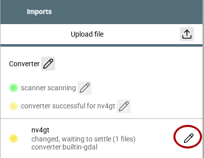

---
  tags:
    - Karten
    - Erweiterungen
---
# Details zum Kartenhandling
In diesem Dokument werden einige Details beschrieben, die erklären, wie AvNav mit Karten umgeht, welche Kartentypen es gibt, wie man neue Karten anlegen kann und wie man das Karten-Handling erweitern kann. Der erste Teil richtet sich an alle Nutzer und beschreibt ein wenig genauer, welche Karten genutzt werden können und wie man sie in AvNav installieren bzw. importieren oder konvertieren kann. Im [zweiten Teil](#definitions) werden die Möglichkeiten beschrieben, wie man eigene Kartenquellen erzeugen kann und wie man das Kartenhandling in AvNav erweitern kann. Dieser Teil richtet sich an fortgeschrittene Nutzer.

## Grundaufbau
Die Karten in AvNav sind entweder auf dem AvNav Server gespeichert oder können (je nach Typ) auch während der Nutzung direkt aus dem Internet geladen werden. Mit dem [mapproxy-plugin](TODO: mapproxy) gibt es ein Mischform, die Karten aus dem Internet lädt, anzeigt und gleichzeitig auf dem AvNav Server speichert. Unter Andorid ist der AvNav Server direkt in der App integriert.

Die Anzeige der Karten erfolgt immer in einem Browser - so wie die gesamte Bedienoberfläche von AvNav. Wie im [Technischen Hintergrund](#background) beschrieben, werden dazu entsprechende JavaScript Bibliotheken genutzt.

## Karten und Overlays {: #overlays }
Typischerweise benötigt man für die Navigation nicht nur eine Karte sonder auf dieser Karte auch noch verschiedene Zusatz-Informationen. Neben den Informationen, die AvNav selbst bereitstellt - wie die Bootsposition, Kurslinien, die aktuelle Route oder AIS Ziele (siehe [Navigationsseite](../base/navpage.md)) kann man auch sogenannte "Overlays" über die Karte legen.
Diese Overlays sind im Normalfall Dateien die geografische Informationen sowie Informationen zur Darstellung enthalten. AvNav kann Daten im [GPX Format](https://de.wikipedia.org/wiki/GPS_Exchange_Format), im [GEOJSON Format](https://geojson.org/) oder im [KML/KMZ Format](https://de.wikipedia.org/wiki/Keyhole_Markup_Language) verarbeiten. Daneeben können auch in AvNav bereits vorhandene Daten wie Tracks und Routen als Overlays genutzt werden.
Um komplett flexibel zu sein, kann man auch andere Karten als Overlay zu einer bestimmten Karte hinzufügen. Das kann sehr hilfreich sein, wenn die Karten getrennte Bereiche abdecken - so bekommt man eine übergangsfreie Darstellung.
Eine Zuordnung, welche vorhandenen Overlays auf einer Karte angezeigt werden sollen, kann im [Overlay Editor](overlays.md) erfolgen.


## AvNav Kartentypen {: #owntypes }

AvNav kann einige Kartentypen direkt selbst verarbeiten. Man muss dazu nur eine der unterstützten Karten-Datei-Typen über

{{MM("MMchartspage")}}->"Charts"->{{SB("Upload")}}

zu AvNav hochladen.
AvNav unterstützt die folgenden Kartentypen

| Typ | Datei-Endung | Beschreibung |
| --- | --- | --- |
| [GEMF](http://www.cgtk.co.uk/gemf) | .gemf | Ein für das Lesen optimiertes Kartenformat, das intern ein Verzeichnis der vorhandenen Kacheln enthält. Dieses Format wird auch vom [AvNav Importer](#importer) aus verschiedenen anderen Formaten erzeugt. Dieses Format kann intern mehrere Layer mit unterschiedlichen Auflösungen enthalten. |
| [mbtiles](https://wiki.openstreetmap.org/wiki/MBTiles) | .mbtiles | Eine [sqlite](https://sqlite.org/) Datenbank, die neben den Kartenkacheln auch noch Metadaten enthält. Leider gibt es hier verschiedene Kodierungen der y Koordinate - die aber nicht immer korrekt bezeichnet werden. Daher kann man diese per [Hand umstellen](TODO: #scheme). |
| [PMTiles](https://docs.protomaps.com/pmtiles/) | .pmtiles | Ein modernes binäres Dateiformat, das insbesondere für die Nutzung über einfache Webserver optimiert ist. |
| XML | .xml | Wie oben beschrieben kann man mit xml Dateien direkt eine Kartendefinition erstellen. Die XML Datei enthält dabei noch nicht die eigentlichen Kartendaten sonder nur einen Verweis auf diese - und Informationen zur Nutzung |

## Plugin Kartentypen

Plugins können im Prinzip beliebige weitere Kartentypen zu AvNav hinzufügen. Die folgenden Karten-Plugins sind für AvNav standardmäßig vorhanden.

| Plugin | Kartentyp | Beschreibung |
| --- | --- | --- |
| [ochartsng](TODO ochartsng) | Vektor Karten | Das ochartsng Plugin dient zur Anzeige von [o-charts](https://o-charts.org/?lng=de) **Vektorkarten**. Diese müssen im o-charts Shop gekauft werden und wie im Plugin beschrieben hochgeladen werde. **Hinweis**: Das Hochladen kann nicht auf der "Charts" Seite in AvNav erfolgen. Daneben können auch noch unverschlüsselte ENC (S57) nach einer [Konvertierung](#converter) angezeigt werden. _Nur Linux und Android._|
| [ocharts](TODO: ocharts) | Verktor- und Raster Karten | Das ocharts (legacy) Plugin dient eben falls zur Anzeige von Karten aus dem [o-charts](https://o-charts.org/?lng=de). Es kann auch Rasterkarten aus dem Shop nutzen. Auf neueren Systemen steht es nicht mehr zur Verfügung. _Nur Linux_ |
| [mapproxy](https://github.com/wellenvogel/avnav-mapproxy-plugin) | Online Karten | Das mapproxy Plugin erlaubt über eigene Definitionen den Zugriff auf online Kartendienste. Die Karten werden im AvNav Server zwischengespeichert und stehen damit auch ohne Internet zur Verfügung. _Nur für Linux_ |

## Karten Konvertierung {: #converter }

Einige Karten können in AvNav erst nach einer Konvertierung angezeigt werden. Dabei werden diese Karten meist in .gemf Dateien umgewandelt, so das sie anschliessend effizient genutzt werden können.
Plugins können zusätzliche Konverter installieren.
Der Konverter ist nur für Linux und Windows verfügbar, nicht unter Android.
Es können die folgenden Kartentypen umgewandelt werden:

| Kartentyp | Datei-Endung | Beschreibung |
| --- | --- | --- |
| [BSB](https://www.gisbox.com/en/articles/v1/25k7r9xewlwy/) | .kap | Rasterkarten. Typischerweise viele einzelne Dateien. Bei Hochladen zum Konverter kann man ein Verzeichnis angeben, das wird dann zum Namen der erzeugten Karte. Bei vielen Karten ist der Prozeß langwierig - insbesondere auf einem RaspberryPi |
| [BSB](https://www.gisbox.com/en/articles/v1/25k7r9xewlwy/) | .zip | Ein zip Archiv mit BSB Karten, die zu einer gemeinsamen Karte umgewandelt werden |
| [S57 ENC](https://de.wikipedia.org/wiki/IHO-S-57) | .zip | Mit plugin [ochartsng](TODO ochartsng). Die S57 ENC werden in ein OpenCPN spezifisches Binärformat (senc) umgewandelt und direkt dem ochartsng Plugin übergeben. _Auf Linux und Windows_. Ochartsng selbst läuft nicht auf Windows, aber der Konverter ist verfügbar und kann installiert werden. Damit können z.B. S57 Karten für Android dort konvertiert werden (unter Android ist der Konverter nicht vorhanden) |

Um Karten zum Konverter hochzuladen nutzt man

{{MM("MMchartspage")}}->"Imports"->{{SB("Upload")}}

Der Konverter wird nach gewisser Zeit die hochgeladenen Dateien erkennen (bei Einzeldateien wird noch etwas gewartet um weitere Uploads zu ermöglichen), danch startet die Konvertierung.

{.small}
///caption
Konverter
///

Wenn man das rot markierte {{ICON("Edit")}} Icon klickt, öffnet sich ein Dialog um das Log einzusehen, den Import zu löschen, zu restarten oder auch die konvertierten Karten noch einmal herunterzuladen.

## Kartenquellen

* Download von fertigen Rasterkarten (z.B. von [OpenSeamap](https://ftp.gwdg.de/pub/misc/openstreetmap/openseamap/charts/mbtiles/)
  , [NOAA](https://distribution.charts.noaa.gov/ncds/index.html)
  - mbtiles)
* Download mit dem [Mobile
  Atlas Creator](http://mobac.sourceforge.net/).
* Kaufen von Karten bei [o-charts](https://o-charts.org/)
  und Nutzung mit dem [ochartsng](TODO:ochartsng.md)
  Plugin
* Download von S57 und Konvertierung/Nutzung mit dem [ochartsng](TODO: ochartsng.md)
  plugin
* Nutzung von Karten vom [SignalK
  Chart Provider](https://github.com/SignalK/charts-plugin)   (wenn die [SignalK-Integration](signalk.md) aktiv ist).

## Erweiterte Kartendefinitionen {: #definitions }

### Einführung
Um eine Karte in AvNav zu nutzen, muss für diese Karte eine sogenannte Kartendefinition erzeugt werden. Für die [eigenen Kartentypen](#owntypes) macht  AvNav das selbständig, für andere Karten kann das durch den Nutzer oder durch ein [Plugin](plugins-extensions.md) erfolgen.

Eine solche Definition beschreibt, aus welchen Schichten (Layern) diese Karte besteht, welchen Typ diese Layer haben und wo die Daten dafür herkommen. Siehe auch [Technischer Hintergrund](#background).

Der einfachste Fall einer solchen Definition in Form einer XML Datei für den online Zugriff auf [OpenStreetMap Karten](https://www.openstreetmap.de/) kann z.B. so aussehen
``` xml
<?xml version="1.0" encoding="UTF-8" ?>
 <TileMap 
    type="zxy"
    href="http://a.tile.openstreetmap.org"
    minzoom="4"
    maxzoom="20">
    <BoundingBox minlon="-20" minlat="10" maxlon="30" maxlat="70"/>
 </TileMap>
```
Man kann diese Definition in eine XMLDatei (z.B. `SimpleOSM.xml`) schreiben, sie über 

{{MM("MMchartspage")}}->"Charts"->{{SB("Upload")}}

in AvNav hochladen und die OpenStreetMaps Karte steht unter dem Name SimpleOSM.xml zur Anzeige bereit.

Dieses Beispiel enthält genau einen Kartenlayer, die Kartenkacheln kommen vom Server unter `http://a.tile.openstreetmap.org` - und sie haben die Default-Größe von 256x256 Pixeln. 

Über "profile" wird der Typ des Layers ausgewählt - dieser bestimmt, wie aus der angegebenen URL die URLs für die einzelnen Kartenkacheln gebildet werden - und wie diese dargestellt werden.

Die Beschreibung einer Kartendefinition ist entweder eine XML Darstellung wie im Beispiel oder ein JavaScript/JSON Objekt. Das obige Beispiel als JSON Objekt:
``` json
[
    {
        "profile": "zxy",
        "href": "http://a.tile.openstreetmap.org",
        "minzoom": "4",
        "maxzoom": "20",
        "boundingbox": {
            "minlon": "-20",
            "minlat": "10",
            "maxlon": "30",
            "maxlat": "70"
        }
    }
]
```
Bei den Parametern ist die Groß-/Kleinschreibung irrelevant.


### Layer Typen {: #layertyes }

AvNav hat eine Reihe von eingebauten Karten-Layer Typen. Diese erwarten die Kartendaten jeweils in einem bestimmten Format und laden sie über bestimmte URLs. [Plugins](plugins-extensions.md) oder [Nutzer-JavaScript](userjs.md) können weitere Layer Typen ergänzen.
Diese Layer erzeugen intern jeweils ein Kartenlayer für [openlayers](http://www.openlayers.org/) oder [MapLibre](https://maplibre.org/).
Die Implementierung der Kartenlayer findet man in [chartlayers.js](https://github.com/wellenvogel/avnav/blob/master/viewer/map/chartlayers.js)

**Parameter**

Paremeter, die von mehreren Layern verstanden werden:

  * url (alternativ kann "href" genutzt werden)

    Dieser kann weggelassen werden, wenn die Kartendaten unter der gleichen Basis-URL wie die Kartenbeschreibung gefunden werden. Für Details siehe die Java Script Interface [Beschreibung](#interface).

  * minzoom - Integer, der minimale Zoomlevel
  * maxzoom - Integer, der maximale Zoomlevel
  * boundingbox - Objekt

    der Bereich der Karte mit den Parametern minlat, maxlat, minlon, maxlon
    ```
    "boundingbox": {
        "minlon": "-180",
        "minlat": "-66.477366283",
        "maxlon": "179.955",
        "maxlat": "85.05112878",
        "title": "bounding"
    },
    ```

  * layerzoomboundings - Objekt oder Array
    Dieser Wert beschreibt für die verschiedenen Zoom-Stufen, welche x/y Bereiche vorhanden sind.
    Beispiel:
    ```
    "layerzoomboundings": [
            {
                "zoom": "2",
                "boundingbox": {
                    "minx": "0",
                    "maxx": "3",
                    "miny": "0",
                    "maxy": "2"
                }
            },
            {
                "zoom": "3",
                "boundingbox": {
                    "minx": "1",
                    "maxx": "7",
                    "miny": "0",
                    "maxy": "4"
                }
            },
    ]
    ```
    
    Die `boundingbox` Einträge bei jedem zoom Level können auch ein Array von Objekten sein, falls es mehrere nicht zusammenhängende Bereiche gibt.
    Dieser Parameter wird meist nur bei Karten erzeugt, die AvNav selbst kennt. Der Vorteil der Angabe ist, das nicht versucht wird, Kacheln zu laden, die es nicht gibt. 

  * upzoom 

    wenn keine Kacheln für einen Zoom Level verfügbar sind, versuche Kacheln von kleineren Zoom Leveln zu nehmen - maximal bis herunter zu `zoom - upzoom`


**Layer xzy**

Das ist der default Layer, der auch genutzt wird. Die URLs werden nach dem [OSM Schema](https://wiki.openstreetmap.org/wiki/Slippy_map_tilenames) erzeugt.
`https://xxxxxx/zoom/x/y.png`. y started mit 0 im Norden. Die Kachelgröße ist 256x256.


Parameter

| Name | Optional | Beschreibung |
| --- | --- | --- |
| profile | ja | zxy oder leer |
| url | siehe oben | Die Basisurl für die Kartendaten. `zoom/y/x.png` werden für jede Kachel ergänzt. Alternativ kann die URL Platzhalter `{z} {x} {y}` enthalten, dann werden die Werte dort eingefügt. |
| minzoom | ja | |
| maxzoom | ja | |
| boundingbox | ja | |
| upzoom | ja | |
| layerzoomboundings | ja | |

**Layer tms**

Dieser Layer ist fast identisch zum Layer zxy - nur die y Koordinate ist invertiert. 0 ist im Süden.
Die Parameter sind ebenfalls identisch zum Typ zxy, der Parameter type muss auf `tms` gesetzt werden.

**Layer wms**

Dieser Layer kann genutzt werden, um Kartenkacheln von einem [Web Map Service](https://de.wikipedia.org/wiki/Web_Map_Service) zu laden. Ein solcher Service adressiert nicht direkt die Kacheln, sondern es werden die Eck-Koordinaten angegeben und die Größe des zu ladenden Bildes. Meist gehören auch noch weitere Parameter dazu.
Der Layer erzeugt `GetMap` Requests an den konfigurierten Service.

Parameter

| Name | Optional | Beschreibung |
| --- | --- | --- |
| profile | nein | wms |
| url | siehe oben | Die angegebene URL wird mit einer Reihe von [Parametern](#wmsparameters) ergänzt. |
| minzoom | ja | |
| maxzoom | ja | |
| boundingbox | ja | |
| upzoom | ja | |
| layerzoomboundings | ja | |
| projection | ja | Die Projektion, die der Service nutzt. Default `EPSG:4326` |
| wmsparameter | ja | Ein Array von Objekten name, value `[{"name":"TRANSPARENT","value":"TRUE"}]`. Diese werden als [Parameter](#wmsparameters) an die URL angefügt. |
| layermapping | ja | Ein Array von Objekten zooms,layers, das es erlaubt je nach Zoom unterschiedliche WMS Layer abzufragen. Zooms und Layers können jeweils durch , getrennte Werte enthalten. Beispiel: `[{"zooms":"1,2,3,4,5","layers":"Overview,Special"},{"zooms":"6,7,8","layers":"Details"}]` |

Die finale URL für die Abfrage des WMS wird dann durch die bei "url"angegebene URL sowie eine Liste von Parametern gebildet.
{ #wmsparameters }

| Parameter | Quelle |
| --- | --- |
| SERVICE | fix: `WMS` |
| REQUEST| fix: `GetMap` |
| FORMAT | fix: `image/png` |
| SRS | Parameter `projection` |
| WIDTH | fix: Kachelgröße 256 |
| HEIGHT | fix: Kachelgröße 256 |
| BBOX | die berechnete Boundingbox für die Kachel |
| LAYERS | wenn der Parameter `layermapping` angegeben war, wird dieser Parameter in Abhängigkeit vom Zoom versorgt, sonst nicht |
| XXX... | alle name,value Paare, die bei `wmsparameter` angegeben wurden |

**Layer encrypt**

Dieser Layer ist ein Speziallayer für das [ochartsng](TODO: ochartsng) und das ocharts Plugin. Als "profile" werden die Werte `'encrypted-zxy','encrypted-zxy-mercator'` akzeptiert.

**Layer PMTiles**

Dieser Layer kann für [PMTiles](https://docs.protomaps.com/pmtiles/) Raster Quellen genutzt werden.

Parameter

| Name | Optional | Beschreibung |
| --- | --- | --- |
| profile | nein | `PMTiles` |
| url | siehe oben | Die Basisurl für die Kartendaten|
| minzoom | ja | |
| maxzoom | ja | |

Eine Beispiel für die Nutzung von PM Raster Quellen:
```
<?xml version="1.0" encoding="UTF-8" ?>
 <TileMap 
   profile="PMTiles"
   href="https://pmtiles.io/stamen_toner(raster)CC-BY+ODbL_z3.pmtiles" 
    minzoom="2"
    maxzoom="4">
 </TileMap>

```

**Layer mapLibreVector**

Dieser Layer kann für Vektorkarten genutzt werden. Diese werden mit [MapLibre](https://maplibre.org/) dargestellt. 

Vektorkarten benötigen neben den Kartendaten im Allgemeinen noch mindestens 3 weitere Datentypen:

  * ein "style" Dokument - im Allgemeinen eine .json Datei. Diese beschreibt im Detail, wie die Daten dargestellt werden sollen. Für genauere Informationen siehe die Beschreibung bei [MapLibre](https://maplibre.org/maplibre-style-spec/).
  * die auf der Karte anzuzeigenden Symbole (sprites). Der Link dazu ist im "style" Dokument enthalten.
  * die Fonts für die Textdarstellung. Auch dazu sind die Links im "style" Dokument enthalten.

Die darzustellenden Kartendaten (tiles) werden normalerweise durch Links auf ein oder mehrere [TileJSON](https://docs.mapbox.com/help/glossary/tilejson/) APIs beschrieben. Die Kacheln (tiles) selbst werden für Vektorkarten meist im [pbf](https://github.com/mapbox/pbf) Format genutzt. Sie können dabei von einem Server geladen werden oder zu.B. aus einer PMTiles Datei.

Neben diesen Grunddaten kann man für diesen Karten-Layer noch weitere KOnfigurationen angeben, die dann direkt in Paremeter für [MapLibre](https://maplibre.org/maplibre-gl-js/docs/API/classes/Map/#properties) umgesetzt werden.


Parameter

| Name | Optional | Beschreibung |
| --- | --- | --- |
| profile | nein | `maplibreVector` oder `maplibre``|
| style | nein | siehe [unten](#styleparameter) |
| maplibre | ja | ein Objekt, das direkt als Eigenschaften an die [MapLibre Map](https://maplibre.org/maplibre-gl-js/docs/API/classes/Map/) übergeben wird |
| useProxy | ja | Wenn Vektordaten von einem Server geladen werden erfordert das korrekte [CORS](https://developer.mozilla.org/de/docs/Web/HTTP/Guides/CORS) Einstellungen auf diesem Server. Sonst verweigert der Browser das Laden der Daten. Da man diese Server nicht immer unter Kontrolle hat, gibt es die Möglichkeiten, die Anfragen über den AvNav Server zu leiten. Da die AvNav Webseite ja auch von diesem Server kam, tritt dabei das CORS Problem nicht auf. Das funktioniert natürlich nur, wenn der AvNav Server den Kartenserver auch direkt erreichen kann |

Der **style** Parameter kann auf verschiedene Arten angegeben werden:
{: #styleparameter }

  * als Parameter `style` oder `url`oder `styleUrl`
  * als Wert `style` im Parameter `maplibre`

Der Wert des Parameters kann dabei ein String sein - in diesem Fall wird er als eine URL interpretiert und das Style Dokument wird von dieser URL geladen. Alternativ kann der Wert auch ein Objekt sein - in diesem Falle wird der Wert direkt als `style` Parameter an MapLibre übergeben.

Als Erweiterung zu MapLibre kann das Style-Dokument auch ein [yaml Dokument](https://de.wikipedia.org/wiki/YAML) sein. Das kann durch die Nutzung von Ankern und anderen YAML Funktionen die Arbeit beim Schreiben von solchen Dokumenten erleichtern. Nach dem Laden wird das Dokument in JSON umgewandelt und dann an MapLibre übergeben.

## Erweiterungen (eigene Karten-Layer) {: #extensions }

!!! Experten
    Das Erstellen eigener Kartenlayer erfordert JavaScript Know How und auch eine gewisse Einarbeitung in das Handling der Kartenbibliotheken. Daher wird eine solche Erweiterung meist in [Plugins](plugins-extensions.md) eingebaut.

Eigene Kartenlayer erweitern die vorhandenen Kartenlayer. Damit kann man z.B. vor der Nutzung noch mit dem Kartenserver kommunizieren (z.B. einen [GetCapabilities](https://docs.geoserver.org/main/en/user/services/wms/reference/) Request an einen WMS Server schicken, um die verfügbaren Layer zu ermitteln ), man kann Nutzer-Präferenzen setzen oder z.B. Karteninformationen abrufen und aufbereiten für die [FeatureListe](TODO: featurelist).

### Registrierung {: #registerlayer }

Im JavaScript API von AvNav (das für [Plugins](plugins-extensions.md) und [Nutzer-JavaScript-Code](userjs.md) zur Verfügung steht) gibt es dazu die Funktion [`registerUserMapLayer`](https://github.com/wellenvogel/avnav/blob/66f12023f6f863fcbb24d18efe1ed40494421782/viewer/api/api.interface.ts#L684).

Mit dieser Funktion regsitriert man ein neues Profil, das dann in [Kartendefinitionen](#definitions) verwendet werden kann.

Die Funktion hat die folgenden Parameter:

| Name | Typ | Beschreibung |
| --- | --- | --- |
| baseName | String | Der Kartenlayer, der erweitert werden soll. Einer der Profilnamen wie unter [Layer Typen](#layertypes) angegeben. |
| name | String | Der Profilname für den neuen Layer. Wenn die Funktion in [user.mjs](userjs.md) aufgerufen wird, wird intern dem Namen noch `user_` vorangestellt, wenn sie in einem Plugin gerufen wird, wird `plugin_` vorangestellt. In einer Kartendefinition muss man also `"profile":"user-myprofile"` schreiben. |
| callback | Funktion | Eine Funktion, die aufgerufen wird, sobald ein Kartenlayer mit diesem Profil angelegt werden soll. Für die Beschreibung siehe [unten](#usermaplayercallback) |

### Callback {: #usermaplayercallback }

Im [API](https://github.com/wellenvogel/avnav/blob/66f12023f6f863fcbb24d18efe1ed40494421782/viewer/api/api.interface.ts#L467) sieht man die Definition der Callabck Funktion, die beim Erzeugen eines Kartenlayers aufgerufen wird.

Der `context` Parameter erlaubt die Speicherung von Werten, die spezifisch für diesen Aufruf sind. Er wird auch in allen weiteren Callbacks übergeben.

Die Funktion darf async sein oder auch eine Promise zurückgeben.

Der Rückgabewert der Funktion unterscheidet sich, je nachdem ob man einen [Vektorlayer](https://github.com/wellenvogel/avnav/blob/66f12023f6f863fcbb24d18efe1ed40494421782/viewer/api/api.interface.ts#L425) oder einen [Rasterlayer](https://github.com/wellenvogel/avnav/blob/66f12023f6f863fcbb24d18efe1ed40494421782/viewer/api/api.interface.ts#L397) erweitert.

Das Resultat kann in beiden Fällen modifizierte Parameter (`options`) zurückgeben - diese ersetzen dann die in der Kartenkonfiguration angegebenen.
Ausserdem können verschiedene Callback-Funktionen angegeben werden.

| Callback | Typ | Beschreibung |
| --- | --- | --- |
| finalizeFunction | alle | wird gerufen, bevor die Karte geschlossen wird |
| sequenceFunction | alle | wird in regelmässigen Abständen gerufen um zu prüfen, ob sich die Karte geändert hat und neu geladen werden muss. Sobald sich der zurückgegebene String verändert, wird die Karte neu geladen |
| loadCallback | Vektor | wird nach dem Laden der MapLibre Map gerufen und erlaub den direkten Zugriff auf das Map-Objekt |
| featureListFormatter | Vektor | Wird gerufen, wenn der Nutzer auf die Karte klickt. Als Parameter wird eine Liste der Vektor-Objekte im Klick-Bereich übergeben. Siehe [unten](#featurelistformatter) |
| createTileUrlFunction | Raster | Die Rasterlayer erzeugen die URL zum Laden einer Kachel mit einer [URLFunction](https://openlayers.org/en/latest/apidoc/module-ol_Tile.html#~UrlFunction). Dieser callback kann genutzt werden, um eine eigene URLFunction zurückzugeben. Damit können z.B. weitere Parameter eingefügt werden, die der Server benötigt |
| tileLoadFunction | Raster | Diese Funktion ermöglicht es, das Laden der Serverdaten in ein JavaScript Image zu beeinflussen. |


Eine besonders interessante Möglichkeit ist die Aufbereitung von Vektor-Kartendaten für den Nutzer mit der `featureListFormatter` Funktion.
{: #featurelistformatter }

Die übergebene Liste von Objekten .... TODO


## Technischer Hintergrund {: #background }

Damit Karten in AvNav im Browser angezeigt werden können, müssen sie in einem
„Kachelformat“ vorliegen. Das ist das Format, das durch Dienste wie
OpenStreetMaps oder GoogleMaps benutzt wird. Eine Kartenkachel ist meist 256x256 Pixel gross. Die Welt wird dabei auf eine ebene Fläche projiziert (das
kann man sich wie einen Papierzylinder vorstellen, der senkrecht steht und
am Äquator um die Erde gewickelt wird). Jeder Punkt mit seinen Koordinaten
(Länge/Breite) wird dann auf diesen Zylinder projiziert. Wie man das
macht, welche Einheiten in der Projektion verwendet werden und ob die
Erde als Kugel oder Ellipsoid mit verschiedenen Parametern modelliert
wird, beschreiben die verschiedenen Projektionen. Die WebApp benutzt die
sogenannte Google-Mercator-Projektion (die Erde wird dabei als Kugel
betrachtet) - mit dem EPSG Code 900913. Die Einheiten auf dem Papier sind
dabei Meter (die man natürlich in die entsprechenden Koordinaten umrechnen
kann). Karten in einem anderen Format (z.B. WGS84 – Erde als Ellipsoid,
immer in Grad) müssen daher ggf. reprojiziert werden.

Die gesamte Projektionsfläche wird bei der Google-Projektion in Kacheln
unterteilt. Der Zoom Level gibt an, in wieviele Kacheln die Fläche
unterteilt wird. Zoom Level 0 bedeutet: die gesamte Erde (von -85° bis
+85° Breite – darüber ist die Projektion nicht definiert) auf einer Kachel
von 256x256 Pixel. Mit jedem weiteren Zoom Level wird feiner unterteilt:
Zoom Level 1: 2x2 Kacheln, 2: 4x4 Kacheln usw. Für uns reichen die
interessanten Zoom Level von ca. 7 bis 18..19. Das bedeutet (Level 19)
2^19x2^19 Kacheln.

Zur Darstellung wird die Library [openlayers](http://www.openlayers.org/)
verwendet. Diese lädt die entsprechenden Kartenkacheln je nach Zoom Level
vom Server und zeigt sie an. OpenStreetMaps verwendet typischerweise
diese Library.
Es ist dabei möglich innerhalb einer Karte mehrere sogenannte Layer (Schichten) übereinander zu legen - auf diesem können z.B. unterschiedliche Auflösungen verwendet werden - oder auch in einem Layer die Basis-Karten und in einem anderen Layer die Seezeichen.
Zusätzlich können auch Kartenlayer mit [MapLibre](https://maplibre.org/) genutzt werden. Damit lassen sich z.B. Verktorkarten darstellen. Das erfordert jedoch typischerweise zusätzliche Daten und erfordert damit spezielle [Kartendefinitionen](TODO: #chartdefinitions) oder [Plugins](plugins-extensions.md).

Man kann sich leicht vorstellen, dass bei hohen Zoom Levels schnell große
Datenmengen zusammenkommen. Daher müssen wir für unsere Kartenkacheln
ähnlich vorgehen, wie es auch bei den Papierkarten ist: für Übersichten
ein kleinerer Zoom Level, Detailkarten größer und z.B. Hafenpläne dann mit
Level 18 oder 19 (60cm/pixel bzw. 30cm/pixel). Um damit arbeiten zu
können, werden die verschiedenen Detailgrade dann in Layern (Schichten)
übereinandergelegt. Wenn es für ein Gebiet einen Layer mit besserem
(größerem) Zoom Level gibt, wird dieser angezeigt - wenn nicht, der mit
der geringeren Auflösung (ggf. noch vergrössert). Um unsere Anzeigegeräte
nicht zu überlasten, kann man typisch mit 3-5 Kartenlayern arbeiten (je
nach Gerät...).
