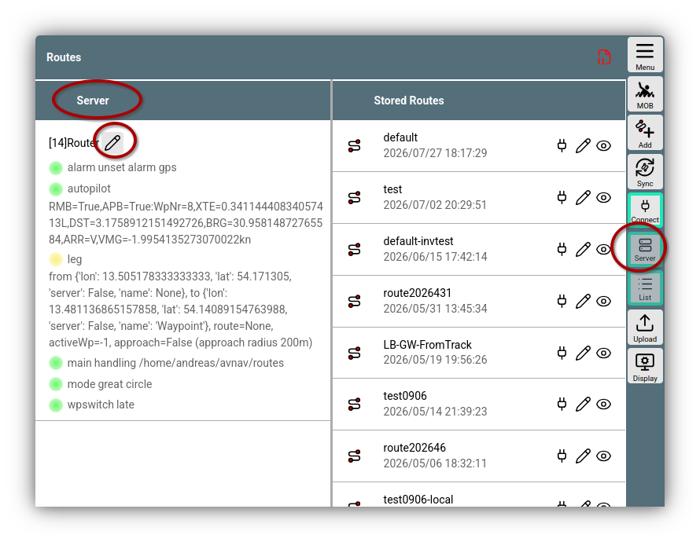
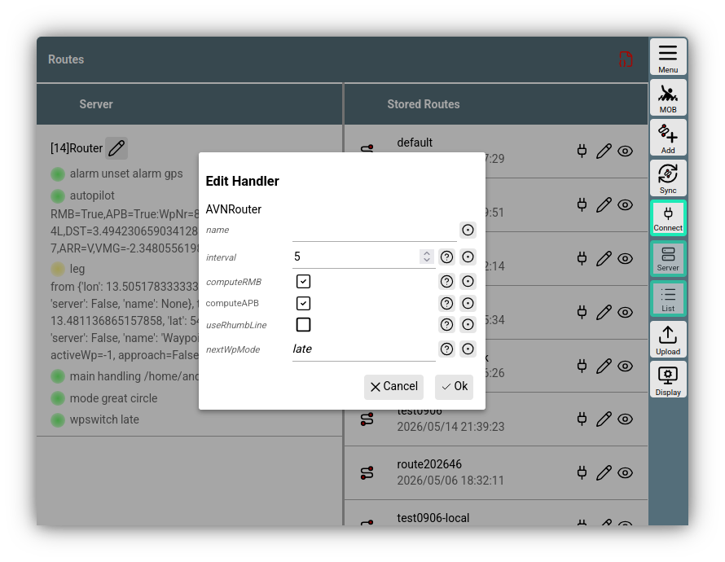
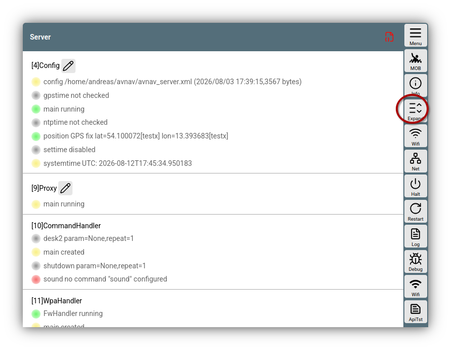

---
  tags:
   - Konfiguration
   - Server
   - Verbindungen
---

# AvNav Server Konfiguration

## Einführung

### Linux/Raspberry/Windows

Der AvNav server liest beim Start seine Konfiguration aus einer xml Datei `avnav_server.xml`.  
Diese Datei befindet sich normalerweise unter /home/pi/avnav/data auf dem
Raspberry, sonst unter $HOME/avnav. Unter Windows im Nutzer-Profil im Ordner avnav.

mit den Einträgen in dieser Datei kann man das Verhalten des AvNav_Servers in weiten Teilen anpassen. Im Normalfall muss man diese Datei jedoch nicht direkt bearbeiten sonder kann innerhalb von [AvNav die Server Konfiguration](#configure) bearbeiten. Die Details zu den einzelnen Funktionseinheiten findet man unter [Konfiguration Linux/Windows](#linux)

### Android

Unter Android wird die Konfiguration des AvNav Servers in den Nutzerdaten der App gespeichert. Diese kann man unter Android im Normalfall nicht sehen - daher steht hier nur die [Anpassung der Konfiguration innerhalb von AvNav](#configure) zur Verfügung. Prinzipiell hat der Server der Android Version weitgehend die gleichen Funktionen wie die anderen Versionen. Die Namen der einzelnen Funktionseinheiten unterscheiden sich aber teilweise. Die Details zu den Funktionseinheiten findet man unter [Konfiguration Android](#android).

## Konfiguration innerhalb von AvNav {: #configure }

In AvNav kann in verschiedenen Bereichen das zugehörige Verhalten des Servers angepasst werden.


///caption
Server Einstellungen Routen
///

Falls der Server Tab nicht direkt sichtbar ist, erreicht man ihn durch den Button {{BT("ServerView")}} oder durch Wischen.

Im Server Bereich werden die für die jeweilige Funktion benötigten Server-Bestandteile (Handler) aufgelistet (im Beispiel: Router). Sofern man diesen Handler bearbeiten kann, ist der entsprechende {{SB("Edit")}} Button vorhanden.

Dieser öffnet einen Dialog für die Einstellungen.


///caption
Bearbeiten eines Handlers
///

Die Parameter, die hier bearbeitet werden können, stimmen (unter Linux/Windows) mit den Eigenschaften diese Knotens in der `avnav_server.xml` Datei überein.

Wenn die Einstellungen mit {{DB("DBOk")}} gespeichert werden, werden sie sofort wirksam. Unter Linux/Raspberry/Windows werden sie in der `avnav_server.xml` gespeichert, unter Android in den Nutzerdaten.

Für eine Übersicht über alle Server-Funktionen kann man die Seite 

{{MM("MMserverpage")}}

nutzen. 


///caption
Alle Servereinstellungen
///

Nach Aufruf werden hier zunächst nur die Funktionseinheiten (Handler) angezeigt, die nicht auf anderen Seiten sichtbar sind. Über {{BT("StatusAll")}} werden alle angezeigt.

Über {{BT("StatusAdd")}} können neue Handler (die das unterstützen) hinzugefügt werden. Im Allgemeinen sind das Handler für neue Verbindungen.


## Beschreibung der Funktionseinheiten (Linux/Windows) {: #linux }

### Initiale Werte und Fehlerbehandlung

Wenn die Datei `avnav_server.xml` beim ersten Start noch nicht existiert, wird sie aus
einem Template erzeugt - passend für den [Raspberry](https://github.com/wellenvogel/avnav/blob/master/raspberry/avnav_server.xml)
oder [andere
Systeme](https://github.com/wellenvogel/avnav/blob/master/linux/avnav_template.xml).  
Dieses Template ist auf dem Raspberry Pi die Datei `/etc/avnav_server.xml`. Wenn diese nicht existiert,
wird eine Datei aus dem Paket als Template genutzt.  
Falls AvNav von der Kommandozeile über das Kommando "avnav" gestartet
wird, kann mit der Option -t ein Template angegeben werden.

Bei Updates der AvNav Software wird diese Datei im Allgemeinen nicht
geändert. Es kann aber sein, dass für neue Funktionen neue Einträge nötig
werden. Dann wird in den [Release Notes](../installation/release.md)
darauf hingewiesen.

Mit jedem erfolgreichen Start schreibt AvNav eine
Kopie diese Datei mit der Endung .ok. Falls beim nächsten Start das Parsen
der xml Datei fehlschlägt, liest er stattdessen die .ok Datei. Diese
Funktion soll verhindern, dass nach einer Änderung, die AvNav in manchen
Situation selbst vornimmt, der nächste Start ggf. scheitert.

Wenn AvNav nicht mehr starten kann wegen Fehler in der Konfiguration,
kann man die `avnav_server.xml` komplett entfernen und danach noch einmal
starten. AvNav startet dann wieder von einem "sauberen" Template.

### Spezielle Werte

In den folgenden Beschreibungen wird in der Spalte "online" angezeigt, ob
die Parameter direkt [innerhalb von AvNav](#configure) geändert werden können.

Falls Parameter geändert werden müssen, die nicht direkt bearbeitbar sind,
sollte das [avnav-update-plugin](https://github.com/wellenvogel/avnav-update-plugin) genutzt werden, um die Datei direkt im Browser zu bearbeiten.  
Das Plugin kann auf der {{MM("MMserverpage")}} erreicht werden.

Wenn man Änderungen an der `avnav_server.xml` direkt per Editor vornimmt, muss AvNav danach neu gestartet werden.
Wenn AvNav als Systemdienst läuft, macht man das mit dem Kommando

```
sudo systemctl restart avnav
```

Es empfiehlt sich jedoch, nach einer Änderung AvNav zunächst einmal nur
von der Kommandozeile zu starten, um zu sehen, ob es schwerwiegende Fehler
gibt. Die Kommandofolge ist dann

```
sudo systemctl stop avnav  
avnav -e  
^C  
sudo systemctl start avnav
```

Die Option -e verhindert, dass im Fehlerfall die `avnav_server.xml.ok` geladen wird. ^C bricht das laufende
AvNav wieder ab.

### Funktionseinheiten (Handler)

Innerhalb der Konfiguration sind Einträge für die einzelnen Handler enthalten.

Grundsätzlich gibt es 3 Kategorien von solchen Handlern:

  1. Anteile, die nur genau einmal auftreten dürfen, die aber unbedingt in
     der `avnav_server.xml` stehen müssen  
  2. Anteile, die im Normalfall nicht in der `avnav_config.xml` stehen
     müssen, nur wenn etwas Spezielles konfiguriert werden soll  
     Beispiele: AVNAlarmHandler, AVNChartHandler,...
  3. Anteile, die ein- oder mehrfach in der `avnav_server.xml` stehen können.
     Das sind insbesondere die Eingangs- und Ausgangskanäle. Wenn kein
     solcher Eintrag vorhanden ist, steht die Funktion nicht zur Verfügung.

Es gibt einige Eigenschaften, die an mehreren Bestandteilen auftauchen,
für diese hier eine Erklärung.

|  |  |  |
| --- | --- | --- |
| Name | Beschreibung | Beispiel |
| enabled | Viele Handler können auf der Server/Status Seite mit diesem Parameter ein- bzw. ausgeschaltet werdem | ein |
| name | Name eines Input oder Output Kanals. Dieser wird auf der Status-Seite angezeigt und kann auch im Parameter [blackList](#blackList) für Filterungen genutzt werden | nmea0183tosignalk |
| filter | Filterung von NMEA Daten. hier können durch Komma getrennte Filter angegeben werden, die bestimmen, welche NMEA Daten durchgelassen werden. Um sie unabhängig von Talker Ids zu machen, werden die 2 Zeichen nach einem $ nicht berücksichtigt. Ein Filter für $GPRMC sieht dann so aus: $RMC.  Wenn dem Filter ein ^ vorangestellt wird, wird er negiert, also ^$RMC heisst: keine RMC records. AIS Daten kann man mit dem Filter "!" oder "!AIVDM" matchen.  Mehrere Enträge müssen durch , getrennt werden. | $RMC,^$RMB,!AIVDM |
| readFilter | Für kombinierte Reader/Writer ein Filter für die Eingangsseite. Siehe [filter](#filter) |  |
| blackList | Liste von Kanal-Namen, deren Daten nicht ausgesendet werden sollen. Schreibweise beachten (grosses L) | nmea0183tosignalk |
| priority  (since 20220421) | Alle NMEA Input Kanäle haben ein priority Feld. Dieses beeinflusst, welcher Wert gewinnt, wenn die gleichen Werte von mehreren Kanälen dekodiert werden. Die default priority ist 50, sie kann nach oben und unten geändert werden. Die SignalK Integration hat die default Priority 40. | 50 |

Im Folgenden sind die wichtigsten Bestandteile mit ihren Parametern
aufgeführt. Falls Parameter hier nicht beschrieben sind, aber ggf. in
einem Template auftauchen, sollte sie so belassen werden, wie sie dort
sind.

### AVNConfig

Basis Konfiguration und Systemzeit, Kategorie 2 (1x,optional)

| Name | Online | Beschreibung | default/template |
| --- | --- | --- | --- |
| settimecmd |  | Ein Kommando, das aufgerufen wird, um die Systemzeit zu setzen. Der Parameter ist ein Zeitstempel in UTC so wie er für date -u benötigt wird. | nur gesetzt mit dem avnav-raspi Paket |
| settime  (ab 203304xx) | X | Wen ein, setze die Systemzeit (settimecmd muss ebenfalls gesetzt sein) | ein |
| maxtimeback | X | maximale Zeit, die die Systemzeit rückwärts gesetzt wird, bevor alle internen Daten gelöscht werden (s) | 5 |
| systimediff | X | maximale Zeitabweichung der Systemzeit von der gps-Zeit bevor die Systemzeit neu gesetzt wird (s) | 5 |
| settimeperiod | X | Zeit in s bevor die Systemzeit erneut gesetzt wird | 3600 |
| ntphost  (ab 20220421) | X | Ein ntp server. Dieser wird befragt, wenn keine gültige GPS Zeit vorhanden ist und settime aktiv ist | pool.ntp.org |
| switchtime  (ab 20220421) | X | Zeit(in s) die nach dem Setzen der Zeit mindestens gewartet wird, bevor von gps zu ntp oder zurück gewechselt wird. Diese Zeit wird auch nach dem Start auf eine gültige GPS Zeit gewartet wird | 60 |
| expiryTime | X | Zeit (in s) die empfangene NMEA Daten gültig bleiben | 30 |


### AVNAisWorker

AIS Konfiguration, Kategorie 2 (1x, optional)

| Name | Online | Beschreibung | default/template |
| --- | --- | --- | --- |
| ownMMSI | X | MMSI des eigenen Bootes, diese wird aus den AIS Daten ausgefiltert |  |
| aisExpiryTime | X | Zeit (in s) die empfangene AIS Daten gültig bleiben | 1200 |

### AVNDecoder
Dekoder, Kategorie 2 (1x, optional)

| Name | Online | Beschreibung | default/template |
| --- | --- | --- | --- |
| decoderFilter | X | Filter für den Decoder |  |


### AVNQueue

Die interne NMEA Warteschlange . category 2 (einmal, optional).

|  |  |  |  |
| --- | --- | --- | --- |
| Name | online | Description | default/template |
| maxList | X | max number of NMEA records in the queue | 300 |
| naxAge | X | max age in seconds an entry is kept in the queue. Older entries are discarded.  This prevents slow outputs to send out data that is already very old. | 3 |

### AVNHttpServer

Der interne HTTP server. Kategorie 2 (einmal, optional).

Die Parameter können nicht innerhalb von AvNav geändert werden.
Neben den Parametern für AVNHttpServer gibt es einige Unter-Einträge, die
sich mehrfach wiederholen können. Im Normalfall sollten hier aber keine
Änderungen nötig sein (Directory,MimeType).

Ausser dem httpPort sollten normalerweise keine Änderungen erforderlich
sein.

#### Parameter für AVNHttpServer

|  |  |  |
| --- | --- | --- |
| Name | Beschreibung | default/template |
| httpPort | der Port, auf dem der HTTP Server Anfragen annimmt | 8080 |
| httpHost | Die Bind Adresse, man kann hier z.B. auf ein bestimmtes Netzwerk beschränken | 0.0.0.0 |

#### Parameter für Directory

Diese Werte werden meist durch den Aufruf (Parameter -u bei avnav)
überschrieben und sollten nicht geändert werden.

|  |  |  |
| --- | --- | --- |
| Name | Beschreibung | default/template |
| urlpath | die URL (ohne /) |  |
| path | der reale Pfad auf dem System |  |

#### Parameter für MimeType

Hier werden mime types für Dateinamensendungen konfiguriert. Falls eine
eigene Anwendung hier ggf. etwas spezielles benötigt, kann man das
ergänzen.

|  |  |  |
| --- | --- | --- |
| Name | Beschreibung | default/template |
| extension | Namens-Endung (z.B. .avt) |  |
| type | Mime type (z.B. text/plain) |  |

### AVNBlueToothReader

Lesen von Bluetooth Geräten mit seriellem Profil. Kategorie 3 (einmal
möglich, optional)  
Nur möglich, wenn das Gerät ein Bluetooth Device hat.

|  |  |  |  |
| --- | --- | --- | --- |
| Name | online | Beschreibung | default/template |
| maxDevices | X | Anzahl der maximal gleichzeitig verbundenen Bluetooth Geräte | 5 |
| deviceList | X | Komma-separierte Liste von Bluetooth Geräte-Ids. Wenn gesetzt, werden nur diese Geräte verbunden. |  |
| filter | X | [filter](#filter) für NMEA Daten |  |
| name | X |  |  |
| enabled | X |  |  |
| priority | X |  |  |

### AVNSerialReader {: #AVNSerialReader}

Lesen von seriellen Geräten. Kategorie 3 (mehrfach, optional). Dieser
Reader sollte nur für direkt per Hardware (UART) verbundene Geräte genutzt
werden, für Geräte, die per USB angeschlossen sind ist der [AVNUsbSerialReader](#AVNUsbSerialReader)
zuständig.

|  |  |  |  |
| --- | --- | --- | --- |
| Name | online | Beschreibung | default/template |
| name | X | Kanal Name für die Nutzung in blackList und für die Anzeige | intern gebildeter Name |
| port | X | Gerätename, z.B. /dev/ttyAMA0 |  |
| baud | X | Baudrate. Wenn minBaud auch angegeben ist, die maximale Baudrate, die für das automatische Feststellen der Baudrate genutzt wird | 4800 |
| minbaud | X | Minimale Baudrate, die für eine automatische Erkenung genutzt wird. Wenn nicht gesetzt oder 0 - automatische Erkennung aus |  |
| timeout | X | Timeout in s, nach dem das Gerät ohne Daten geschlossen und wieder geöffnet wird | 2 |
| bytesize | X | serielle Byte Größe | 8 |
| parity | X | Parity | N |
| stopbits | X | Anzahl der Stopbits | 1 |
| xonxoff | X | Nutzung xon/xoff Protokoll (0: aus) | 0 |
| rtscts | X | RTS/CTS Nutzung (0: aus) | 0 |
| numerrors | X | Anzahl der Fehler, nach der das Gerät geschlossen und neu geöffnet wird. | 20 |
| autobaudtime | X | Zeit in s, die versucht wird, ein Newline in den Daten zu erkennen (während der automatischen Baudraten-Erkennung) | 5 |
| filter | X | NMEA Filter, siehe [filter](#filter) |  |
| enabled | X |  |  |
| priority | X |  |  |

### AVNSerialWriter {: #AVNSerialWriter}

Ausgang über ein serielles Gerät. Auch kombiniert Ein- und Ausgang.
Kategorie 3 (optional)  
Nur für direkte serielle Geräte, nicht für USB-Wandler ([AVNUsbSerialReader](#AVNUsbSerialReader)
für diese)

|  |  |  |  |
| --- | --- | --- | --- |
| Name | online | Beschreibung | default/template |
| name | X | channel name |  |
| combined | X | wenn "true", dann gleichzeitig Eingang und Ausgang | false |
| readFilter | X | [filter](#filter) für die Eingangsrichtung. Der Parameter "filter" bezieht sich auf die Ausgangsrichtung! |  |
| blackList | X | [blackList](#blackList), Komma getrennte Liste von Kanalnamen, deren Daten nicht ausgegeben werden sollen. |  |
| .... |  | alle Parameter von [AVNSerialReader](#AVNSerialReader) |  |

### AVNUsbSerialReader

Behandelt über USB angeschlossene serielle Geräte. Kategorie 3(einmal,
optional).  
Dieser Worker sucht alle über USB verbundenen Geräte. Solche mit einem
seriellen Profil versucht er zu öffnen, automatische die Baudrate
einzustellen und dann NMEA Daten zu lesen. Damit werden solche Geräte
normalerweise komplett automatisch von AvNav erkannt.  
Man kann für einzelne Geräte Regeln definieren, um sie speziell zu
behandeln. Als Identifikation für ein Gerät wird dabei eine ID genutzt,
die die enstprechende USB Buchse identifiziert. Mann kann diese ID am
einfachsten ermitteln, indem man bei Einstecken des Gerätes die [Status
Seite](../userdoc/statuspage.md) beobachtet.

Die Parameter gliedern sich in 2 Teile:

* Attribute für den Eintrag selbst
* Darunter liegende Einträge des Types UsbDevice

Beispiel

```
<AVNUsbSerialReader maxDevices="5" allowUnknown="true" baud="38400" minbaud="4800">
<UsbDevice usbid="1-1.2.1:1.0" baud="38400" minbaud="4800" filter="$RMC"/>  
</AVNUsbSerialReader>
```

#### Parameter für AVNUsbSerialReader

|  |  |  |  |
| --- | --- | --- | --- |
| Name | online | Beschreibung | default/template |
| maxDevices | X | maximale Zahl von gleichzeitig verbundenen USB Geräten | 5 |
| allowUnknown | X | nur wenn dieser Eintrag auf "true" steht, werden Geräte eingebunden, die nicht explizit mit UsbDevice konfiguriert sind | true |
| ... | X | alle Parameter von [AVNSerialReader](#AVNSerialReader) bis auf port. Diese werden für nicht explizit konfigurierte Geräte gesetzt. |  |

#### Parameter für UsbDevice

|  |  |  |  |
| --- | --- | --- | --- |
| Name | online | Beschreibung | default/template |
| usbid | X | USB Port identifikation z.B. "1-1.2.1:1.0", erforderlich |  |
| type | X | Type des Gerätes reader, writer, combined, ignore, setze ignore, wenn das Gerät nicht genutzt werden soll | reader |
| ... |  | alle Parameter von [AVNSerialReader](#AVNSerialReader) wenn der type = "reader" ist (bis auf port, dieser wird intern gesetzt) |  |
| ... |  | alle Parameter von [AVNSerialWriter](#AVNSerialWriter)wenn der type combined oder writer ist (bis auf port, dieser wird intern gesetzt) |  |

### AVNUdpReader

Öffnet einen UPD port und verarbeitet dort hereinkommende Daten.
Kategorie 3(optional, mehrfach).

|  |  |  |  |
| --- | --- | --- | --- |
| Name | online | Beschreibung | default/template |
| name | X | Kanalname für die Nutzung in [blackList](#blackList) und in der Anzeige | intern berechnet |
| port | X | UDP port |  |
| host | X | Bind Adresse für den Port. Damit kann der Empfang z.B. auf localhost begrenzt werden. | 0.0.0.0 |
| minTime | X | wenn gesetzt: Wartezeit in s bevor ein weiterer Datensatz empfangen wird. Hiermit kann u.U. die Datenrate begrenzt werden. | 0 |
| filter | X | [filter](#filter) für NMEA Daten |  |
| enabled | X |  |  |
| priority | X |  |  |
| stripLeading | X | Entferne alle Zeichen vor $ oder ! in einer Zeile. | aus |
| joinMulticast | X | Tritt einer [Multicast](https://de.wikipedia.org/wiki/Multicast) Gruppe bei, das ermöglich den Empfang von Multicast Nachrichten. | aus |
| multicastAddr | X | Multicast Adresse. Damit wird der Empfang von Multicast Nachrichten auf dieser Adresse ermöglicht. | 224.0.0.1 |

### AVNUdpWriter

Sendet NMEA Daten per UDP. Kategorie 3 (optional, mehrfach)

|  |  |  |  |
| --- | --- | --- | --- |
| Name | online | Beschreibung | default/template |
| name | X | Kanalname | intern berechnet |
| port | X | UDP Ziel port | 2000 |
| host | X | UDP Zieladresse | localhost |
| filter | X | [filter](#filter) NMEA Daten, die gesendet werden |  |
| broadcast | X | muss auf true gesetzt werden, wenn die Daten als broadcast geschickt werden sollen | false |
| blackList | X | [blackList](#blackList) für Kanalnamen, deren Daten nicht gesendet werden sollen |  |
| enabled | X |  |  |

### AVNSocketWriter

Ein Ausgang, der auf einem Port auf Verbindungen wartet und an diese die
NMEA Daten ausgibt (TCP server). Kategorie 3 (mehrfach, optional).

|  |  |  |  |
| --- | --- | --- | --- |
| Name | online | Beschreibung | default/template |
| name | X | Kanalname | intern berechnet |
| port | X | der Listener Port |  |
| address | X | wenn gesetzt, binde auf diese Adresse (sonst any: 0.0.0.0) |  |
| filter | X | [filter](#filter) für NMEA Daten |  |
| read | X | wenn true, werden auch Daten vom Socket gelesen | false |
| priority | X | nur wenn read aktiv ist |  |
| readFilter | X | falls auch gelesen wird, NMEA [filter](#filter) für die Eingangsrichtung |  |
| blackList | X | [blackList](#blackList) durch Komma getrennte Liste von Kanalnamen, für die keine Daten ausgegeben werden |  |
| minTime | X | minimale Zeit in s zwischen 2 gesendeten Nachrichten. Damit kann die Datenrate begrenzt werden. | 0 |
| avahiEnabled | X | wenn eingeschaltet, wird der Service über avahi als \_nmea-0183.\_tcp bekannt gemacht | aus |
| avahiName | X | der Name für den avahi service | avnav-server |
| enabled | X |  |  |
| sendOwn | X | sende empfangene Daten auf der gleichen Verbindung | aus |

### AVNSocketReader

Ein Eingang, der sich mit einem TCP Server verbindet und von dort Daten
liest (TCP client). Kategorie 3 (mehrfach, optional)

|  |  |  |  |
| --- | --- | --- | --- |
| Name | online | Beschreibung | default/template |
| name | X | Kanalname | intern berechnet |
| port | X | TCP Port zu dem eine Verbindung aufgebaut wird |  |
| host | X | TCP Zieladresse zu der eine Verbindung aufgebaut wird |  |
| timeout | X | Verbindungs-timeout in s | 10 |
| minTime | X | Minimale Zeit zwischen 2 empfangenen Nachrichten | 0 |
| filter | X | [filter](#filter) für NMEA Daten | leer |
| writeOut | X | sende NMEA Daten auf dieser Verbindung | aus |
| writeFilter | X | [Filter](#filter) für gesendete NMEA Daten | leer |
| blackList | X | , separierte Liste von Source-Namen, deren Daten nicht gesendet werden | leer |
| enabled | X |  |  |
| priority | X |  |  |
| stripLeading | X | Entferne alle Zeichen vor $ oder ! in einer Zeile. | aus |
| sendOwn | X | sende empfangene Daten auf der gleichen Verbindung | aus |

### AVNNmea0183ServiceReader

Dieser handler ist dem AVNSocketReader sehr ähnlich. Aber anstelle der
Konfiguration von host und port wird hier der Name des Services
konfiguriert. AvNav sucht im Netz nach (MDNS/Bonjour/Avahi) Services vom
Typ\_nmea-0183.\_tcp . Wenn der Eintrag über die Web Oberfläche erfolgt,
bietet AvNav die Liste der gefundenen Services zur Auswahl an. MIt diesem
Handler kann eine Verbindung auch dann wieder aufgebaut werden, wenn sich
z.B. die IP Adressen ändern.

|  |  |  |  |
| --- | --- | --- | --- |
| Name | online | Description | default/template |
| serviceName | X | Der Name des Services (AvNav bietet eine Liste) | -- |
| timeout | X | Verbindungstimeout in Sekunden | 10 |
| minTime | X | minimale Zeit zwischen 2 empfangenen Nachrichten. | 0 |
| filter | X | [Filter](#filter) für NMEA Daten | leer |
| writeOut | X | sende NMEA Daten auf dieser Verbindung | aus |
| writeFilter | X | [Filter](#filter) für gesendete NMEA Daten | leer |
| blackList | X | , separierte Liste von Source-Namen, deren Daten nicht gesendet werden | leer |
| sendOwn | X | sende empfangene Daten auf der gleichen Verbindung | aus |
| name | X |  |  |
| priority | X |  |  |
| enabled | X |  |  |

### AVNBME280Reader

Reader für BME280 per I2C. Kategorie 3 (optional)  
Schreibt MDA und XDR Datensätze.  
Nur sichtbar, wenn python3-smbus installiert ist.

|  |  |  |  |
| --- | --- | --- | --- |
| Name | online | Beschreibung | default/template |
| name | X | Kanalname | intern berechnet |
| addr | X | I2C Adresse des Sensors | 0x77 |
| interval | X | Zeit zwischen 2 NMEA Datensätzen in s | 5 |
| writeXdr | X | Schreibe XDR wenn true | true |
| writeMda | X | Schreibe MDA wenn true | true |
| namePress | X | XDR Transducer Name für Luftdruck | Barometer |
| offsetPress | X | addiere diesen Wert (in hPa) zum gemessenen Druck | 0 |
| nameHumid | X | XDR Transducer Name für Feuchtigkeit | Humidity |
| nameTemp | X | XDR transducer Name für Temperatur | TempAir |
| enabled | X |  |  |
| priority | X |  |  |

### AVNBMB180Reader

Reader für BMP180 per I2C. Kategorie 3 (optional)  
Schreibt MDA und XDR Datensätze.

|  |  |  |  |
| --- | --- | --- | --- |
| Name | online | Beschreibung | default/template |
| name | X | Kanalname | intern berechnet |
| addr | X | I2C Adresse des Sensors | 0x77 |
| interval | X | Zeit zwischen 2 NMEA Datensätzen in s | 5 |
| writeXdr | X | Schreibe XDR wenn true | true |
| writeMda | X | Schreibe MDA wenn true | true |
| namePress | X | XDR Transducer Name für Luftdruck | Barometer |
| offsetPress | X | addiere diesen Wert (in hPa) zum gemessenen Druck | 0 |
| nameTemp | X | XDR transducer Name für Temperatur | TempAir |
| enabled | X |  |  |
| priority | X |  |  |

### AVNSenseHatReader

Reader für SenseHat I2C. Kategorie 3 (optional)  
Schreibt MDA und XDR Datensätze.  
Erfordert python3-sense-hat

|  |  |  |  |
| --- | --- | --- | --- |
| Name | online | Beschreibung | default/template |
| name | X | Kanalname | intern berechnet |
| interval | X | Zeit zwischen 2 NMEA Datensätzen in s | 5 |
| writeXdr | X | Schreibe XDR wenn true | true |
| writeMda | X | Schreibe MDA wenn true | true |
| namePress | X | XDR Transducer Name für Luftdruck | Barometer |
| offsetPress | X | addiere diesen Wert (in hPa) zum gemessenen Druck | 0 |
| nameHumid | X | XDR Transducer Name für Feuchtigkeit | Humidity |
| nameTemp | X | XDR transducer Name für Temperatur | TempAir |
| nameRoll  (ab 20220421) | X | XDR transducer Name für Roll | Roll |
| namePitch  (ab 20220421) | X | XDR transducer Name für Pitch | Pitch |
| enabled | X |  |  |
| priority | X |  |  |

### AVNTrackWriter

Schreiben von Tracks im gpx Format und einem simplen ASCII Format.
Kategorie 2 (einmal, optional)

|  |  |  |  |
| --- | --- | --- | --- |
| Name | online | Beschreibung | default/template |
| interval | X | minimaler Abstand in s zwischen dem Schreiben von 2 Einträgen | 10 |
| mindistance | X | minimaler Abstand in m zwischen 2 Track Punkten | 50 |
| trackdir | X | Verzeichnis für tracks | <datadir>/tracks |
| cleanup | X | Maximale Länge des intern vorgehaltenen Tracks in Stunden. Trackdaten werden weiter in Dateien geschrieben, aber die App kann maximal diese Zeit (rückwärts) als Track bekommen. | 25 |
| writeFile | X | Schreibe eine Track Datei. Wenn ausgeschaltet Aufzeichnung nur im Speicher. | ein |

### AVNRouter

Verwalten von Routing Daten (Wegpunkte, Routen, Ankeralarm). Berechnung
der AP Daten. Kategorie 2 (einmal, optional).

|  |  |  |  |
| --- | --- | --- | --- |
| Name | online | Beschreibung | default/template |
| name | X | Kanalname (genutzt für AP Daten) | intern berechnet |
| routesdir |  | Verzeichnis für routen | <datadir>/routes |
| interval | X | Intervall (in s) zwischen RMB Datensätzen | 5 |
| computeRMB | X | berechne einen RMB Datensatz wenn ein Wegpunkt aktiv ist | true |
| computeAPB | X | berechne einen APB Datensatz | false |
| useRhumbLine  | X | benutze den [rhumb line Modus](TODO: rhumbline) für Routen | false |
| nextWpMode  | X | Auswahl des [Weiterschaltungs-Modus für den nächsten Wegepunkt](TODO: nextwp) in einer Route (late, 90, early) | late |
| nextWpTime  | X | Die Wartezeit nach dem Wegepunktalarm (in Sekunden) bis zur Weiterschaltung zum nächsten Wegepunkt (nur nextWpMode = early) | 10 |

### AVNNmeaLogger

Schreibt NMEA logs in das track Verzeichnis. Kategorie 3 (einmal,
optional).

|  |  |  |  |
| --- | --- | --- | --- |
| Name | online | Beschreibung | default/template |
| maxfiles | X | Anzahl der Dateien (1 pro Tag), die aufgehoben werden | 100 |
| filter | X | [filter](#filter) für NMEA Daten | "$RMC,$DBT,$DBP" |
| interval | X | Minimale Zeit in s bevor ein Satz des gleichen Typs erneut geschrieben wird | 5 |
| enabled | X |  |  |

### AVNImporter

Importiert Karten, die noch konvertiert werden müssen. Kategorie 2
(einmal, optional)

|  |  |  |  |
| --- | --- | --- | --- |
| Name | online | Beschreibung | default/template |
| filesettle | X | Zeit in s, die nach dem Finden einer Datei im Import-Verzeichnis gewartet wird, bevor der Konverter startet | 30 |
| dirsettle | X | Zeit in s, die nach dem Finden eines Verzeichnisses im Import-Verzeichnis gewartet wird, bevor der Konverter startet | 10 |
| scanInterval |  | Zeit (in s) zwischen 2 automatsichen Scans des Import Verzeichnisses. 0: kein automatischer Scan (aber ausgelöst beim Hochladen) | 0 |
| enabled | X |  |  |

### AVNWpaHandler

Konfiguration von externen WLAN Verbindungen - Raspberry. (Legacy: nicht für Versionen ab debian trixie). Kategorie 3 (einmalig,
optional)

|  |  |  |
| --- | --- | --- |
| Name | Beschreibung | default/template |
| wpaSocket | die Steuerverbindung zu wpa\_supplicant | /var/run/wpa\_supplicant/wlan-av1 |
| ownSsid | eigene SSIDs, diese werden ausgeblendet | avnav,avnav1,avnav2 |
| firewallCommand | wenn konfiguriert, kann damit der externe Zugriff über ein WLAN freigeschaltet werden | sudo -n $BASEDIR/../raspberry/iptables-ext.sh wlan-av1 |
|  |  |  |

### AVNCommandHandler

Ausführen von Kommandos, u.a. für Alarme. Kategorie 2 (einmalig, nicht
notwendig).

Der AVNCommandHandler selbst hat keine Parameter. Es können jedoch
verschiedene Kommandos konfiguriert werden, die dann jeweils per Name
angesprochen werden. Die default Konfiguration ist:

```
<AVNCommandHandler>
<Command name="sound" command="mpg123 -q" repeat="1"/>
</AVNCommandHandler>
```

#### Parameter für Command

|  |  |  |
| --- | --- | --- |
| Name | Beschreibung | default/template |
| name | Name des Kommandos |  |
| command | Auszuführender Befehl |  |
| repeat | Zahl der Wiederholungen | 1 |

### AVNAlarmHandler

Management von Alarmen. Kategorie 2 (einmal, nicht notwendig).

Die default Konfiguration ist:

```
<AVNAlarmHandler>
<Alarm name="waypoint" category="info" repeat="1"/>  
 <Alarm name="connectionLost" category="info" repeat="1"/>
<Alarm name="anchor" category="critical" repeat="20000"/>
<Alarm name="gps" category="critical" repeat="20000"/>
<Alarm name="mob" category="critical" repeat="2"/>  
</AVNAlarmHandler>
```

Ab der Version 20220421 sollten vorhandene Alarm-Einträge in
`avnav_server.xml` gelöscht werden, falls nicht ein spezielles Kommando dort
eingetragen werden soll.  
Damit können die Sounds über die Sound Auswahl für die Kategorie definiert
werden.

Falls mit Alarmen spezielle Kommandos ausgelöst werden sollen, können
diese jedoch in der `avnav_server.xml` explizit gesetzt werden.

```
<AVNAlarmHandler>  
 <!-- legacy way of configuring alarms - still supported but not recommended, use category at least and optionally parameter -->
<Alarm name="gps" category="critical" command="gpsAlarm" parameter="$BASEDIR/../sounds/anchorAlarm.mp3" repeat="20000"/>  
 <!-- with the next line we configuer a special command that will be called when we receive a "sinking" notification from SignalK  
 the sound is determined by the category - and this is also the parameter that the command will receive -->
<Alarm name="sk:sinking" command="sinkingAlarm" category="critical" repeat="2"/>  
</AVNAlarmHandler>
```

#### Parameter für Alarm

|  |  |  |
| --- | --- | --- |
| Name | Beschreibung | default |
| name | Name des Alarms | leer, erforderlich |
| category | Kategorie (info,critical) | leer |
| command | Kommando, das ausgeführt werden soll (muss bei AVNCommandHandler konfiguriert sein) | leer |
| autoclean | Schalte den Alarm ab, wenn das Kommando beendet wurde | aus |
| sound | Der Name einer Sound Datei - wenn angegeben wird diese genutzt (relative Namen beziehen sich auf das interne Sound Verzeichins oder auf das user-Verzeichnis).  Wenn nicht gesetzt, wird der sound aus der Kategorie ermittelt oder wenn nicht gesetzt aus dem 'parameter' | leer |
| repeat | Anzahl der Kommando (und sound) Wiederholungen | 1 |
| parameter | Falls angegeben wird dieser Parameter dem Kommando übergeben. Falls weder sound noch category gesetzt sind, wird der Name als der Pfad zu einer Sound-Datei interpretiert. |  |

#### Parameter für AlarmHandler

|  |  |  |  |
| --- | --- | --- | --- |
| Name | online | Beschreibung | default/template |
| infoSound | X | Name einer mp3 Datei für den Sound in der Kategorie info.  Kann aus einer Liste von eingebauten sounds und Dateien im user-Verzeichnis gewählt werden (über Download Seite hochladbar) | waypointAlarm.mp3 |
| criticalSound | X | Name einer mp3 Datei für den Sound in der Kategorie critical.  Kann aus einer Liste von eingebauten sounds und Dateien im user-Verzeichnis gewählt werden (über Download Seite hochladbar) | anchorAlarm.mp3 |
| defaultCommand | X | Kommando für Alarme die nicht explizit ein Komando definiert haben.  Dieses Kommando muss beim AVNCommandHandler konfiguriert werden. | sound |
| stopAlarmPin | X | Nur auf Raspberry Pi. Wenn gesetzt (board Nummerierung), schaltet ein Low an diesem Pin Alarme aus.  Ab Version 2025xxxx gibt es ein separates plugin "[resetAlarm](#pluginResetAlarm)" und eine Konfiguration muss dort erfolgen. Eine vorhandene Einstellung wird bei der Installation migriert. | leer |

### AVNPluginHandler {: #plugins}

Management von plugins. Kategorie 2 (einmalig, optional).  
Der AVNPluginHandler verwaltet [Plugins](plugins.md), die in
verschiedenen Verzeichnissen installiert werden können. Es gibt 3
Verzeichnisse in denen Plugins gesucht werden:

* builtin: /usr/lib/avnav/server/plugins
* system: /user/lib/avnav/plugins
* user: $DATADIR/plugins

Neben den Parametern für den Plugin Handler selbst können die jeweiligen
Plugins Parameter erwarten. Der Name für das Plugin ergibt sich dabei aus
der Kategorie und dem plugin Verzeichnis. Beispiel:

```
<AVNPluginHandler>
<builtin-signalk enabled="true"/>
<builtin-canboat enabled="true" allowKeyOverwrite="true" autoSendRMC="30" sourceName="canboatgen"/>
</AVNPluginHandler>
```

#### Parameter für AVNPluginHandler

|  |  |  |
| --- | --- | --- |
| Name | Beschreibung | default/template |
| builtinDir | Verzeichnis für eingebaute Plugins, nicht änderbar | /usr/lib/avnav/server/plugins |
| systemDir | Verzeichnis für Plugins, die als separate Pakete installiert werden | /usr/lib/avnav/plugins |
| userDir | Verzeichnis für Nutzer Plugins | $DATADIR/plugins |

#### Parameter für [builtin-canboat](CanboatAndSignalk.md)

|  |  |  |  |
| --- | --- | --- | --- |
| Name | online | Beschreibung | default/template |
| enabled | X | Nur wenn auf true, ist das Plugin aktiv | aus |
| allowKeyOverride | X | Muss gesetzt werden, wenn Datum und Zeit von canboat gelesen werden sollen | aus |
| port | X | canboat json Port | 2598 |
| host | X | Host für den n2kd | localhost |
| autoSendRMC | X | falls für diese Zeit in Sekunden kein RMC im NMEA-Datenstrom gesehen wird, aber gültige Positionsdaten + Zeit von canboat vorhanden sind: sende RMC (ist wichtig für Datum/Zeit auf NMEA0183) | 0 (aus) |
| readPos | X | Lese die Position von PGN 129025 und cog/sog von PGN 129026 | ein |
| sourceName | X | Kanalname, der für RMC genutzt wird | plugin-Name |
| timeInterval | X | minimale Zeit zwischen 2 NMEA2000 Zeit Werten, bevor diese gespeichert werden (Sekunden) | 0.5 |
| timePGNs | X | PGNs, die für das Setzen der Zeit genutzt werden | 126992,129029 |

#### Parameter für system-resetAlarm (nur mit dem Paket avnav-raspi-base) {: #pluginResetAlarm}

|  |  |  |  |
| --- | --- | --- | --- |
| Name | online | Beschreibung | default |
| gpio | X | GPIO pin (Bord Nummerierung) an dem ein Taster zum Rücksetzen von Alarmen angeschlossen ist | -- |
| lowActive | X | Wenn gesetzt ist der Eingang L-aktiv, d.h. die Alarme werden mit einem L an diesem Eingang zurück gesetzt | true |
| pullUpDown | X | Wenn gesetzt wird für den Eingang ein pull-up bzw. pull-down Widerstand aktiviert, so dass nur ein externer Taster angeschlossen werden muss. | true |

### AVNChartHandler

Verwaltung der Karten. Kategorie 2 (einmal, muss nicht enthalten sein)

|  |  |  |
| --- | --- | --- |
| Name | Beschreibung | default/template |
| period | Zeitintervall zwischen 2 Lesevorgängen für das Kartenverzeichnis (Sekunden) | 30 |
| upzoom | Anzahl von zoom Stufen über der höchsten vorhandenen Stufe | 2 |

### AVNUserHandler

Verwaltung der Nutzer-Dateien. Kategorie 2 (einmal, muss nicht enthalten
sein)

|  |  |  |
| --- | --- | --- |
| Name | Beschreibung | default/template |
| interval | Zeitintervall zwischen 2 Lesevorgängen für das Verzeichnis (Sekunden) | 5 |

### AVNImagesHandler

Verwaltung der Nutzer-Images. Kategorie 2 (einmal, muss nicht enthalten
sein)

|  |  |  |
| --- | --- | --- |
| Name | Beschreibung | default/template |
| interval | Zeitintervall zwischen 2 Lesevorgängen für das Verzeichnis (Sekunden) | 5 |

### AVNUserAppHandler

Verwaltung der konfigurierten [UserApps](../base/userapps.md). Kategorie 2 (einmal, muss nicht enthalten sein)

Dieser Handler ist etwas speziell. Initial sind hier keine
Konfigurationen zu finden, über die WebApp können aber Konfigurationen
angelegt werden. Eine händische Änderung ist nicht empfohlen.

### AVNAvahiHandler

Steuert die Registrierung von AvNav bei Avahi(MDNS/Bonjour).

|  |  |  |  |
| --- | --- | --- | --- |
| Name | online | Beschreibung | default/template |
| serviceName | X | Der Name der in Tools sichtbar wird.  Das ist nicht der Host Name, den man z.B. in avnav.local benutzt! | avnav |
| maxRetries | X | Wie viele Wiederholungen macht AvNav, wenn der gewählte Name bereits vergeben ist. Wiederholungen hängen ein "-nn" suffix an den Namen an. | 20 |
| timout | X | Timeout bei der Verbindung mit dem  avahi daemon (s) | 10 |
| enabled | X |  |  |

### AVNSignalKHandler

Für eine Beschreibung siehe die [SignalK Dokumentation](signalk.md).

## Beschreibung der Funktionseinheiten (Android) {: #android }

Einige Parameter tauchen bei mehreren Handlern auf:

|  |  |  |
| --- | --- | --- |
| Name | Beschreibung | default |
| enabled | aktviert/deaktiviert diesen Handler | je nach Handler |
| name | Name für den Handler. Dieser kann in Blacklists verwendet werden. | leer |
| port | TCP- oder UDP-Port |  |
| filter/readerFilter/ sendFilter | Das ist ein NMEA-Filter. Hier kann definiert werden, welche NMEA-Daten durchgelassen werden sollen. Mehrere Filter werden durch ein Komma (,) getrennt. Für Datensätze, die mit dem Dollarzeichen ($) beginnen, werden die nächsten beiden Zeichen ignoriert (die Talker-Id). Ein Filter für alle RMC-Sätze sieht z.B. so aus:  $RMC  Ausschließlich für alle AIS-Daten:  !  Alle RMC- und RMB-Sätze:  $RMC,$RMB  Falls der Filter negiert werden soll, muss ein ^ dem Ausdruck vorangestellt werden.  ^$RMB,^$APB | leer |
| blacklist | eine durch Kommas (,) getrennte Liste von Namen. NMEA-Daten von diesen Quellen werden nicht ausgesendet. |  |
| priority | Falls dieser Handler Daten liest (oder erzeugt), werden sie vom Dekoder potenziell gelesen und in den internen Speicher von AvNav geschrieben. Falls mehrere Handler die gleichen Daten liefern (z.B. Position), muss entschieden werden, welche davon in den internen Speicher geschrieben werden sollen. Dazu wird diese Einstellung genutzt. Daten mit höherer Priorität gewinnen. |  |
| queueAge | AvNav hat eine interne Warteschlage (queue), die empfangene Daten aufnimmt und an die Ausgänge weiterreicht. Wenn ein Ausgang zu langsam ist, kann er potenziell nicht alle einlaufenden Daten sofort weiterleiten und diese verbleiben längere Zeit in der Warteschlange. Wenn die Daten älter sind als die hier eingestellte Zeit (in ms), werden sie aus der Warteschlange gelöscht. | 3000 |

Die vorhandenen "Handler" und ihre Parameter. Es werden nur die
spezifischen Parameter beschrieben.

### Decoder

| Parameter | Beschreibung | default |
| --- | --- | --- |
| ownMMSI | eigene MMSI, diese wird in der AIS-Anzeige ausgeblendet | leer |
| posAge | erlaubtes Alter für die GPS-Position (in sec), nach dieser Zeit wird der Eintrag gelöscht, wenn keine neuen GPS-Daten empfangen wurden | 10 |
| nmeaAge | erlaubtes Alter für NMEA-Daten (in sec), die keine Positionsdaten enthalten | 600 |
| aisAge | erlaubtes Alter für AIS-Daten (in sec) | 1200 |

### Route

| Parameter | Beschreibung | default |
| --- | --- | --- |
| computeRMB | erzeuge NMEA-RMB-Datensätze, wenn ein Routing aktiv ist. | an |
| computeAPB | rezeuge NMEA-APB Datensätze, wenn ein Routing aktiv ist | an |
| useRhumbLine | setze den [Routing Mode](TODO: rhumbline) auf rhumbLine | aus |
| nextWpMode | setze den [Modus zum Wegepunkt Weiterschalten](TODO: nextwp) - late/early/90 | late |
| nextWpTime | im Modus "early" die Zeit (in s) nach dem Wegepunkt-Alarm bis zum Weiterschalten auf den nächsten Wegepunkt | 10 |

### Track

| Parameter | Beschreibung | default |
| --- | --- | --- |
| interval | Intervall (in sec) für das Schreiben des Tracks als "gpx"-Datei. | 300 |
| distance | Minimaler Abstand (in m), bevor ein neuer Trackpunkt geschrieben wird | 25 |
| minTime | Minimale Zeit (in sec), bevor ein neuer Trackpunkt geschrieben wird | 10 |
| length | Länge des angezeigten Tracks in Stunden (h). | 25 |

### Logger

NMEA-Logger

### WebServer

| Parameter | Beschreibung | default |
| --- | --- | --- |
| port | der TCP-Port, auf dem der Server Verbindungen annimmt. | 8080 |
| external | Wenn aktiv, dann können sich auch andere Geräte verbinden (sonst nur auf dem eigenen Gerät).   Hinweis: Dieser Parameter sollte mit Vorsicht und nur in vetrauenswürdigen Netzen aktiviert werden. Innerhalb der App gibt es keinen weiteren Schutz! | aus |
| mdnsEnabled | macht den Service per "mDNS" (Bonjour) bekannt. | an |
| mdnsService | Der Name, unter dem die App per mDNS/Bonjour erreichbar ist. | avnav-android |

### InternalGPS

Das GPS des Gerätes.

### MDNSResolver

Der Handler für die Auflösung und das Bekanntmachen von "mDNS"
(Bonjour/Avahi) Services.

### Remote Channel

Der Handler für die [Fernsteuerung](remotecontrol.md)
.

### TcpReader

| Parameter | Beschreibung | default |
| --- | --- | --- |
| ipAddress | Die IP-Adresse oder der Hostname für den Server, der kontaktiert werden soll. Das kann auch ein mDNS Name wie z.B. avnav.local sein. | --- |
| port | Der Ip-Port, zu dem eine Verbindung aufgebaut werden soll. | --- |
| sendOut | Wenn aktiviert, werden auch NMEA-Daten gesendet. Ansonsten wird nur emfangen. | aus |
| readTimeout | Markiere die Verbindung als inaktiv, wenn keine Daten nach der eingestellten Zeit (sec) eingegangen sind. | 10 |
| writeTimeout | Schließe die Verbindung, wenn ein NMEA-Datensatz nicht innerhalb der eingestellten Zeit (sec) geschrieben werden konnte. | 5 |
| connectTimeout | Timeout für den Verbindungsaufbau (in sec, 0 = System-default) | 0 |
| closeOnTimeout | Schließe die Verbindung und öffne sie erneut, wenn das readTimeout erreicht wird. | an |
| stripLeading | entfernt alle Zeichen in einer empfangenen Zeile vor einem ! oder $ | aus |

### TcpWriter

Ein TCPWriter stellt die NMEA-Daten für andere Anwendungen bereit.

| Parameter | Beschreibung | default |
| --- | --- | --- |
| port | Der Port, auf dem der Server Verbindungen annimmt | --- |
| externalAccess | Wenn aktiv, können sich auch andere Geräte verbinden. Andernfalls können sich nur Apps auf dem selben Gerät verbinden. | aus |
| writeTimeout | Schließe die Verbindung, wenn ein NMEA-Datensatz nicht innerhalb der eingestellten Zeit (sec) geschrieben werden konnte. | 5 |
| readData | Wenn aktiv, empfängt AvNav auch NMEA-Daten über eine aufgebaute Verbindung | aus |
| stripLeading | entfernt alle Zeichen in einer empfangenen Zeile vor einem ! oder $ (nur wenn readData aktiv ist) | aus |
| sendOwn | Sende Daten, die auf der gleichen Verbindung empfangen wurden (nur sichtbar, wenn readData an ist). Normalerweise sollte man das nicht einschalten, weil man sonst sehr leicht Schleifen erzeugen kann. | an |
| mdnsEnabled | mache den Service per mDNS im Netz bekannt (type: \_nmea-0183.\_tcp) | aus |
| mdnsService | Der Name, unter dem dieser Server per mDNS erreichbar ist |  |

### UdpReader

Ein UDP-Reader empfängt Daten von anderen Apps/Systemen.

| Parameter | Beschreibung | default |
| --- | --- | --- |
| port | der UDP-Port, auf dem Daten empfangen werden | --- |
| externalAccess | wenn aktiv, können Daten von anderen Geräten empfangen werden, sonst nur innerhalb des selben Gerätes. | aus |
| readTimeout | zeige die Verbindung als inaktiv, wenn für die eingestellte Zeit (sec) keine Daten empfangen wurden. | 10 |
| stripLeading | entfernt alle Zeichen in einer empfangenen Zeile vor einem ! oder $ | aus |

Wichtiger Hinweis: Aufgrund von
Einschränkungen des Android Systems können UDP Nachrichten an eine
Broadcast-Adresse nicht empfangen werden, wenn das Gerät in den
Standby-Modus (Bildschirm aus) geht. Nachrichten direkt an die IP Adresse
des Gerätes werden auch im Standby weiterhin empfangen. Falls also solche
Broadcast UDP Sender genutzt werden sollen, muss des Gerät aktiv bleiben.
Man kann aber den {{BT("Dim")}}Dim Button in AvNav nutzen um die
Hintergrundbeleuchtung zu dimmen und den Stromverbrauch zu reduzieren.
Siehe auch das [GitHub
Issue #510](https://github.com/wellenvogel/avnav/issues/510).

### UdpWriter

Ein UDP-Writer sendet NMEA-Daten per UDP an eine andere App.

| Parameter | Beschreibung | default |
| --- | --- | --- |
| ipaddress | die IP-Adresse oder der Hostname des Ziel-Computers. Es kann auch ein mDNS-Name wie "avnav.local" genutzt werden. | --- |
| port | Der Ziel-Port , an den Daten gesendet werden sollen | --- |
| broadcast | Sende die Daten als Broadcast, die IP-Adresse muss dann eine gültige Broadcast-Adresse sein. | aus |

### NMEA0183Service

Ein NMEA0183-Service arbeitet im Wesentlichen wie ein TcpReader.
Allerdings werden hier nicht Zieladresse und Port vorgegeben. Stattdessen
wird der Name eines (mDNS) Services (type: \_nmea-0183.\_tcp) aus einer
Liste der verfügbaren Services gewählt. Falls z.B. im Netz ein
SignalK-Server oder ein AvNav-Server (> 20210415) vorhanden sind, geben
diese ihre NMEA-Ausgänge auf diese Weise im Netzwerk bekannt.  
Der Vorteil ist, dass auch bei Wechsel des Netzwerkes der Zugriff im
Normalfall wieder funktionieren wird und Verbindungen so automatisch
wieder aufgebaut werden können.

| Parameter | Beschreibung | default |
| --- | --- | --- |
| service | der Name des Service (Auswahl aus der Liste der gefundenen) | --- |
| sendOut | sende NMEA-Daten auf dieser Verbindung |  |
| readTimeout | Markiere die Verbindung als inaktiv, wenn keine Daten nach der eingestellten Zeit (sec) aufgelaufen sind. | 10 |
| writeTimeout | Schließe die Verbindung, wenn ein Satz nicht innerhalb der eingestellten Zeit (sec) geschrieben werden konnte | 5 |
| connectTimeout | Timeout für den Verbindungsaufbau (in sec, 0 = System-default) | 0 |
| closeOnTimeout | Schließe die Verbindung und öffne sie erneut, wenn das readTimeout erreicht wird. | an |

### UsbConnection

AvNav wird aktiv, wenn ein USB-Gerät angeschlossen wird (wenn man das in
den Einstellungen aktiviert hat). Es ist daher sinnvoll, zunächst AvNav zu
starten und danach das USB-Gerät anzuschließen. Das Gerät kann dann direkt
so konfiguriert werden, dass AvNav immer auf dieses Gerät zugreifen darf.
AvNav startet dann sofort den Dialog zur Konfiguration des Gerätes.

| Parameter | Beschreibung | default |
| --- | --- | --- |
| device | Das angeschlossene USB-Gerät, genauer: der Anschluss des Gerätes, Auswahl aus einer Liste | --- |
| baud rate | Die Baudrate | 9600 |
| flowControl | none|xon/xoff|rts/cts - Auswahl der Flusssteuerung (muss vom Adapter unterstützt werden) | none |
| sendOut | sende NMEA-Daten auf dieser Verbindung | aus |
| readTimeout | Markiere die Verbindung als inaktiv, wenn keine Daten nach der eingestellten Zeit (sec) aufgelaufen sind. | 10 |

### Bluetooth

Zum Verbinden z.B.  mit einem Bluetooth-GPS. Das Gerät muss zunächst
über die Bluetooth-Einstellungen des Android-Geräts verbunden werden
("pairen").  

| Parameter | Beschreibung | default |
| --- | --- | --- |
| device | Das Bluetooth-Gerät. Bei der Einrichtung werden alle Geräte angeboten, die bereits bekannt sind, erst danach wird versucht, das Gerät zu erreichen. | --- |
| sendOut | sende NMEA-Daten auf dieser Verbindung | aus |
| readTimeout | Markiere die Verbindung als inaktiv, wenn keine Daten nach der eingestellten Zeit (sec) aufgelaufen sind. | 10 |