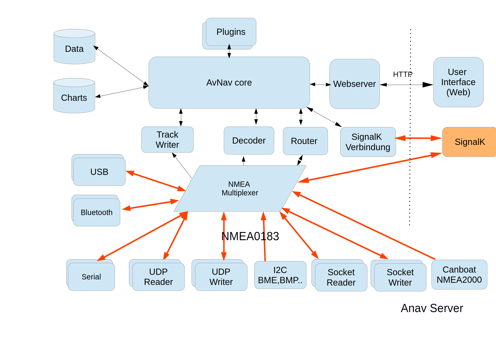
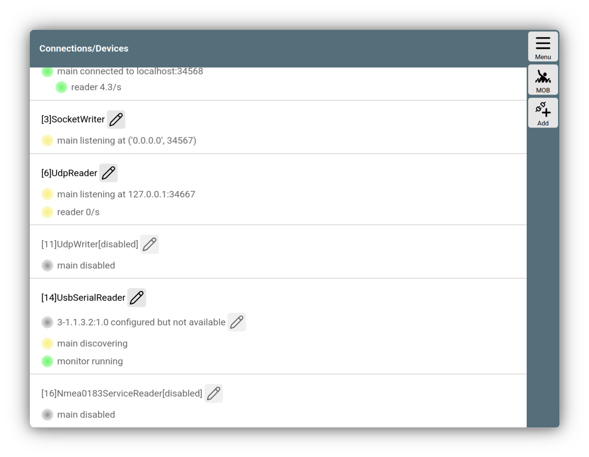

---
  tags:
    - Verbindungen
    - Multiplexer
    - NMEA
    - NMEA0183
---

# Verbindungen

Damit AvNav die Daten von Instrumenten verarbeiten kann, können Verbindungen zu den Bord-Netzwerken hergestellt werden. Eine Einführung dazu findet man unter [Datenfluss](../base/dataflow.md).

In diesem Kapitel werden einige weitere Details beschrieben.

## Struktur 

Wie bereits in der [Einführung](../concept/clientserver.md) kurz beschrieben besteht AvNav aus einem Server-Teil, der die Navigationsdaten und Karten verarbeitet und speichert und einem Anzeige-Teil (Client), der in einem Browser läuft. Die Verbindungen zu den Bordnetzwerken werden im Server-Teil hergestellt.

///caption
Server Struktur
///

Das Bild zeigt eine grobe Struktur der Bestandteile, aus denen die Server-Software besteht. Zum Verständnis der Verbindungen ist insbesondere der "NMEA Multiplexer" wichtig. Dieser empfängt und verteilt NMEA0183 Daten von und zu verschiedenen Ein- und Ausgängen. Diese Verteilung erfolgt unabhängig davon, ob AvNav selbst mit diesen Daten etwas anfangen kann.

Dieser Multplexer arbeitet mit dem "AvNav Core" zusammen - das ist der Teil, der die NMEA-Daten dekodiert und speichert, Routing-Funktionen und weitere Navigationsfunltionen ausführt. 

Der Multiplexer bietet eine Reihe von Filter-Funktionen.

Um nun Daten aus den Bord-Netzwerken in AvNav verfügbar zu machen (oder von AvNav erzeugte Daten in diese einzuspeisen) müssen Verbindungen konfiguriert werden (im Bild rot markiert).

AvNav selbst kann nur NMEA0183 Daten verarbeiten. Zur Verbindung mit NMEA2000 Bus-Systemen findet man unter [NMEA2000](nmea2000.md) weitere Informationen.

Besondere Hinweise zur Zusammenarbeit mit SignalK findet man in einer [separaten Beschreibung](signalk.md).

## Verbindungsseite {. #channelspage}

Die Konfiguration von Verbindungen in AvNav erfolgt über

{{MM("MMchannelspage")}}

///caption
Verbindungsseite
///

Auf dieser Seite kann man alle bereits konfigurierten Verbindungen sehen, bearbeiten, löschen und neue Verbindungen hinzufügen.

Die Bezeichnungen der Verbindungen unterscheiden sich etwas zwischen Android und Linux/Windows, die Funktionen sind jedoch weitgehend identisch.

Neben den verbindungs-spezifischen Parametern (wie den Port für eine TCP Verbindung) kann man auch eine Reihe von Parametern definieren, die die Behandlung der Daten beeinflussen. Das betrifft insbesondere die Filter-Funktionen, die der Multiplexer besitzt.

| Parameter | Beschreibung |
| --- | --- 
| name | Ein Name für diese Verbindung. Dieser Name kann genutzt werden, falls man die über diese Verbindung empfangenen Daten auf bestimmten Verbindungen nicht ausgeben möchte (blacklist) |
| filter, readFilter | Ein Filter der nur bestimmte Nachrichten durchlässt. Siehe [Filter](configfile.md#filter)|
| priority | Falls z.B. über mehrere Verbindungen Positionsdaten empfangen werden, würden die Werte sich im internen Datenspeicher von AvNav gegenseitig überschreiben. Falls diese sich unterscheiden führt das zu Sprüngen in der Anzeige. Mit der Priorität kann man steuern, welche Daten jeweils gewinnen (höhere Priorität). Erst wenn einige Zeit keine solche Daten mehr empfangen werden, werden Daten mit niedriger Priorität verwendet. Der Multiplexer gibt aber die Daten in jedem Falle weiter. |

## Verbindungstypen

In der folgenden Tabelle kann man durch Klick auf den Type-Namen zur Beschreibung der konfigurierbarene Parameter gelangen.
Hinweis: An einigen Stellen unter Linux/Windows haben die Namen noch ein vorangestelltes "AVN" - das ist in der Tabelle weggelassen.

| Name Linux/Windows| Name Android | Beschreibung |
| --- | --- | --- |
| [USBSerialReader](configfile.md#avnusbserialreader) | --- | Nur unter Linux. Eine Verwaltung von erkannten USB-Geräten mit einem seriellen Profil. AvNav erkennt solche Geräte automatisch und konfiguriert sie zum Daten-Empfang mit einer automatischen Baudraten-Ermittlung. Man kann für einzelne Geräte noch spezielle Parameter festlegen |
| --- | [UsbConnection](configfile.md#usbconnection) | Nur Android. Wenn ein USB Gerät mit einem seriellen profil angeschlossen wird, bietet AvNav an, es zu nutzen. Dafür müssen die Berechtigungen erteilt werden. Anschliessend kann das Gerät in AvNav konfiguriert und als Ein- oder Ausgang genutzt werden |
| [BluetoothReader](configfile.md#avnbluetoothreader)| [Bluetooth](configfile.md#bluetooth)| Unter Linux: Ähnlich wie für USB Geräte werden Bluetooth-Geräte mit einem serielle Profil erkannt und zum Datenempfang konfiguriert. Unter Android: Wenn ein Bluetooth Gerät verwendet werden soll, muss es zunächst verbunden ("paired") werden. Danach kann eine Verbindung zu einem solchen Gerät angelegt werden |
| [SocketWriter](configfile.md#avnsocketwriter)|[TcpWriter](configfile.md#tcpwriter)| Es wird ein TCP Server konfiguriert. Der Port auf dem AvNav Verbindungen annehmen soll, muss angegeben werden. Dazu kann ausgewählt werden, ob nur lokal zugegriffen werden kann oder auch Zugriff von anderen Computern aus möglich sein soll (Android: `externalAccess`, Linux/Windows: `host 0.0.0.0`). Senden und empfangen ist möglich - default: senden.|
| [SocketReader](configfile.md#avnsocketreader) | [TcpReader](configfile.md#tcpreader) | Es wird eine TCP Client Verbindung konfiguriert zu einem anderen System, das als Server konfiguriert ist. Die IP Adresse und der Port müssen angegeben werden. Statt der IP Adresse kann auch ein Hostname angegeben werden. Es kann insbesondere auch ein Name der Form `name.local` - also eine MDNS Adresse genutzt werden. Daten können empfangen und gesendet werden. Default: empfangen|
| [Nmea0183ServiceReader](configfile.md#avnnmea0183servicereader) | [NMEA0183 service](configfile.md#nmea0183service)| Die gleiche Funktion wie ein SocketReader. Statt IP und Port wirde jedoch der Name eines Bonjour-Services angegeben (Auswahl aus einer Liste). Der Vorteil dieser Konfiguration ist, das die Verbindungen automatisch immer wieder aufgebaut werden, auch wenn sich z.B. das Wifi Netzwerk ändert, das genutzt wird. |
| [UdpReader](configfile.md#avnudpreader)|[UdpReader](configfile.md#udpreader)| AvNav öffnet einen UDP Socket und empfängt Nachrichten. Es kann entschieden werden, ob nur Nachrichten vom eigenen Computer oder auch von anderen Computern emfangen werden.(Android: `externalAccess`, Linux/Windows: `host 0.0.0.0`) |
| [UdpWriter](configfile.md#avnudpwriter) | [UdpWriter](configfile.md#udpwriter)| AvNav sendet UDP Nachrichten zu einem anderen System. Ip Adresse und port müssen angegeben werden.|
| [SignalKhandler](configfile.md#avnsignalkhandler)| --- | Eine spezielle Verbindung zu [SignalK](signalk.md). Die von dort empfanenen Daten gehen **nicht** in den Multiplexer sondern nur in den internen Datenspeicher|

## Sensor-Verbindungen

Unter Linux auf den [AvNav Images](../installation/raspberry.md#images) können auch einige I2C Sensoren konfiguriert werden.
Diese speisen spezifische NMEA Telegramme in den Multiplexer ein.
Siehe dazu die Beschreibung der jeweiligen Konfiguration.

* [BME280](configfile.md#avnbme280reader)
* [BMP180](configfile.md#avnbmb180reader)
* [SenseHat](configfile.md#avnsensehatreader)