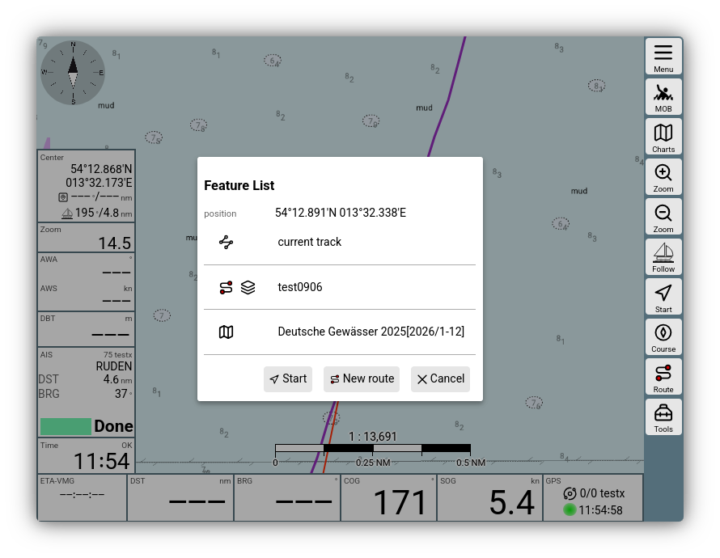
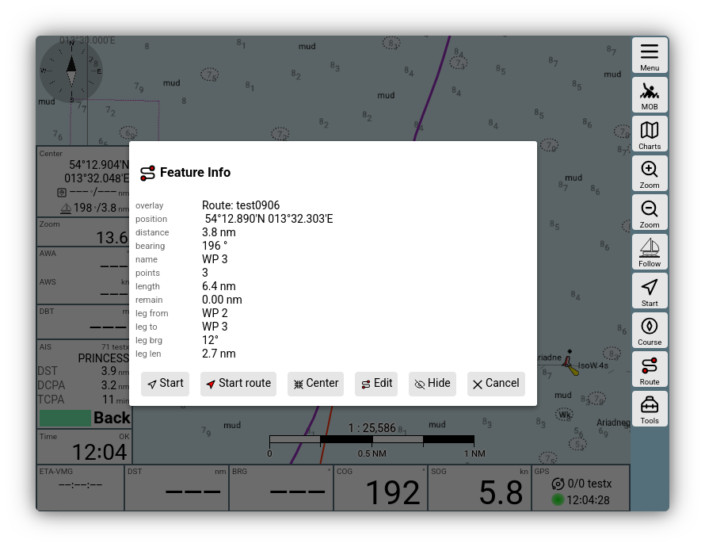
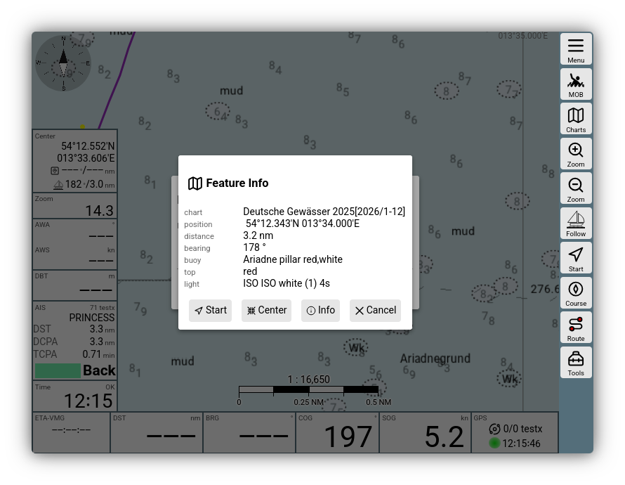

---
  tags:
    - Feature Liste
    - Feature Info
---

# Feature Liste und Feature Info

## Feature Liste

Bei einem Klick auf die [Kartenansicht](../base/navpage.md) erhält man einen Dialog mit einer Übersicht der in der Umgebung befindlichen Kartenobjekte.

.
///caption
Feature Liste
///

In dieser Liste findet man alle Anzeige-Layer, die an der angeklickten Position Objekte haben. Ein Klick auf einen dieser Layer öffnet einen zweiten Dialog mit den Details.

## Feature Info

Der Inhalt der Detail-Information ist vom Anzeige-Layer (also z.B. vom [Overlay](overlays.md#featureinfo)) abhängig.

///caption
Feature Info Route
///

Hier wurde auf die Route "test0906", die als Overlay auf der Karte eingerichtet ist, geklickt. Der Dialog zeigt Informationen über die Route und eine Reihe von Aktionen, die möglich sind. Diese sind wieder vom ausgewählten Objekt abhängig. Alle Feature-Info-Dialoge bieten einen 

{{BT("WpGoto")}}

Button an, der eine sofortige Wegepunkt-Navigation zum ausgewählten Objekt startet.

Falls man auf eine [o-charts](ochartsng.md) Vektor-Karte klickt, bekommt man direkt weitere Informationen zu den Karten-Objekten.

///caption
Feature Info Vektorkarte
///

Über {{DB("DBInfo")}} erhält man hier noch komplette Informationen über die Kartenobjekte. Siehe auch die [Ocharts Beschreibung](ochartsng.md#featureinfo).

## Anpassungen

Die in einer Feature-Info angezeigten Informationen können sowohl durch [Nutzer-JavaScript](userjs.md#featureformatter) als auch durch [Plugins](plugins.md) angepasst werden. 

Auch [Zusätzliche Kartentypen](charts.md#owntypes) können die Anzeige in der Feature-Info beeinflussen. Über die {{DB("DBInfo")}} Funktion lassen sich auch Webseiten oder externe Links hinterlegen.
