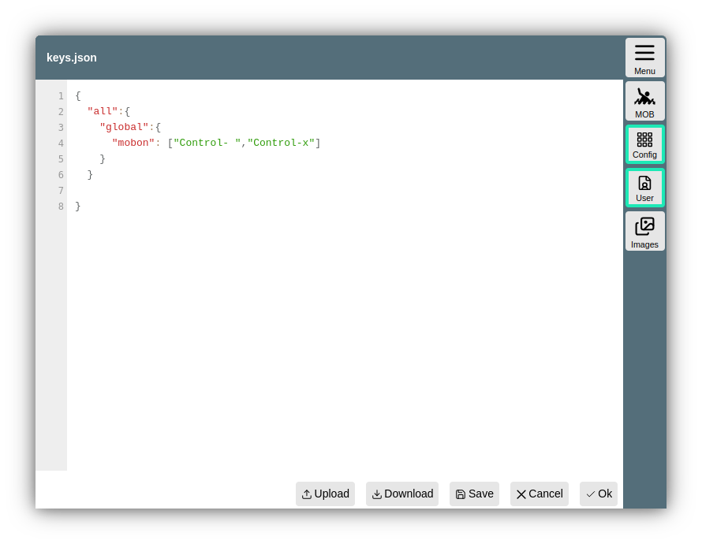

--- 
  tags:
    - Tastatur
    - Konfiguration
---
Tastatur Unterstützung
======================

AvNav hat eine Unterstützung für die Bedienung wichtiger Funktionen über
Tastenkürzel.  
Die Zuordnung zwischen Tasten und Funktionen kann dabei relativ frei
konfiguriert werden.

Prinzip
-------

Die Zuordnung erfolgt dabei über 3 Stufen:

1. Seite  
   Das ist die in AvNav momentan angezeigte Seite. Eine Liste der Seiten in AvNav findet man [im Code](https://github.com/wellenvogel/avnav/blob/master/viewer/util/pageids.ts).
   Über den speziellen Namen "all" kann die Funktion auf allen Seiten
   zugeordnet werden.
2. Gruppe  
   Hier sind die Funktionen noch einmal gruppiert - z.B. "button"
3. Funktion  
   Die eigentliche Funktion, die ausgelöst werden soll (z.B. der Klick auf
   einen Button)

Es kann dabei den jeweiligen Funktionen eine oder mehrere Tasten
zugeordnet werden. Ein spezifischere Konfiguration gewinnt dabei (also
wenn es z.B. eine Zuordnung für die Seite "all" gibt und eine andere für
z.B. die Seite "navpage", dann gewinnt die letztere).

Konfiguration
-------------

Die Zuordnung der Tasten erfolgt über eine Datei keys.json im [Nutzer-Verzeichnis](userfiles.md).
Diese Datei kann dort direkt bearbeitet werden. Es gibt dazu noch eine in
AvNav [eingebaute
Datei](https://github.com/wellenvogel/avnav/blob/master/viewer/static/keys.json) mit den default-Zuordnungen.

In der Datei im user Verzeichnis können die Werte aus der default-Datei
überschrieben werden.



Mit diesem Beispiel werden auf allen Seiten dem Button "Mann über Board"
die Tasten Ctrl-Leer und Ctrl-x zugeordnet.  
Wenn nur eine Taste zugeordnet werden soll, müssen keine eckigen Klammern
angegeben werden. Nach dem Speichern der Änderungen muss die AvNav Seite
neu geladen werden z.B. über {{BT("MainNav")}}->Actions->{{BT("ReloadUI")}}

Seiten Gruppen und Funktionen
-----------------------------

Die Liste der Seiten, Gruppen und Funktionen ist hier immer nur der
aktuelle Stand beim Erstellen der Dokumentation. Es werden Stück für Stück
weitere hinzu kommen.

Die Namen für die Keys entsprechen den Werten laut der [Dokumentation](https://developer.mozilla.org/en-US/docs/Web/API/KeyboardEvent/key).
Wenn die Control (Strg) Taste dazu gedrückt ist, wird ein "Control-" vor
den Namen gesetzt.  
Die Namen der Funktion in der Gruppe "button" sind jeweils die Namen der
Buttons, so wie sie in der [Buttonliste](../../buttons/buttons.md)
dokumentiert sind.  
Ein Klick auf ein Widget kann über die Gruppe "widgets" und den Namen des
Widgets erreicht werden (die Namen sieht man im [Layout
editor](layouts.md)). Ein SOG widget wäre z.B. mit

```
"all":{  
 "widgets": {  
 "SOG": "s"  
 }  
}
```

mit der Taste s auf allen Seiten anklickbar.

Die Buttons in Dialogen sind über die Gruppe "dialogButton" und den Namen
des buttons erreichbar. Diesen kann man leicht aus dem HTML code z.B. mit
den Entwicklertools des Browsers ablesen. Man sollte allerdings nur
spezielle Keys den dialogButtons zuordnen, da sonst potentiell keine
normale Werte-Eingabe mehr möglich ist.

In der folgenden Tabelle sind die Gruppen und Funktionen aufgelistet, die
entweder in den default Einstellungen bereits eine Taste zugewiesen haben
- oder aber weder button, dialogButton noch widget sind. Texte in Klammern
in der Tabelle sind Hinweise zur Funktion.

Zuweisungen
-----------

| Seite | Gruppe | Funktion | Default Keys | Funktion |
| --- | --- | --- | --- | --- |
| all  | map | zoomIn | ["+","PageUp"] |
|  |  | zoomOut | ["-","PageDown"] |
|  |  | up | "ArrowUp" |
|  |  | down | "ArrowDown" |
|  |  | left | "ArrowLeft" |
|  |  | right | "ArrowRight" |
|  |  | lockGps (Kartenmitte auf Position) | "l" |
|  |  | unlockGps | "u" |
|  |  | toggleGps | ["t","Control-a"] |
|  |  | toggleCourseUp | "b" |
|  |  | centerToGps (einmalig Boot in Kartenmitte) |  |
|  | alarm | stop | "a" |
|  | global | mobon | ["Control- "] |
|  |  | moboff |  |
|  |  | mobtoggle |  |
|  |  | anchoron (Anker Alarm an an aktueller Position, seit 20220421) | "i" |
|  |  | anchoroff(seit 20220421) | "Control-i" |
|  |  view | Cancel | "Escape" | Geht zurück zur vorigen Seite |
|  |  | gpspage | "d" | geht zur dashboard Seite |
|  |  | navpage | "n" | geht zur Kartenansicht |
|  |  | ... | ... | weitere Seiten können hier auch direkt erreicht werden, wenn Tasten dafür konfiguriert werden |
|  | addon | signalk | "Control-0" | als Gruppe muss hier der Name des addons angezeigt werden, so wie man ihn auf der [UserApp Konfigurationsseite](TODO) sehen kann|
|  |  | system-ochartsng-ui | "Control-1" |
|  |  | system-history-ui | "Control-2" |
|  |  | system-mapproxy-ui | "Control-3" |
|  | chartSelectList | previous | "ArrowUp" | selektiere vorige Karte|
|  |  | next | "ArrowDown" | selektiere nächste Karte |
|  |  | select | "Enter" | wähle selektierte Karte |
|  | mainMenu | previous | "ArrowUp" | voriger Eintrag |
|  |  | next | "ArrowDown" | nächster Eintrag |
|  |  | select | "Enter" | wähle selektierten Eintrag und schliesse das Menü |
|  |  | Cancel | "x" | Schließe das Menü |
|  |  | page:navpage |  "n" | Öffne die Kartenansicht |
|  |  | page:gpspage |  "d" | Öffne die Dashboard Ansicht |
|  | multiview | left | "ArrowLeft" | Scrolle die Anzeige so, das links eine neue Spalte angezeigt wird |
|  |  | right | "ArrowRight" | Scrolle die Anzeige so, das rechts eine neue Spalte angezeigt wird |
|  |  | first | "Control-ArrowLeft" | Zeige die erste Spalte (links) |
|  |  | last | "Control-ArrowRight" | Zeige die letzte Spalte (rechts) |
| gpspage (Dashboard) | button | Cancel | ["d","Escape"] |
|  |  |  Gps1 | "1" | Dashboard #1 |
|  |  |  Gps2 | "2" | Dashboard #2 |
|  |  |  Gps3 | "3" | Dashboard #3 |
|  |  |  Gps4 | "4" | Dashboard #4 |
|  |  |  Gps5 | "5" | Dashboard #5 |
|  |  |  Gps6 | "6" | Dashboard #6 |
|  |  |  Gps7 | "7" | Dashboard #7 |
|  |  |  Gps8 | "8" | Dashboard #8 |
|  |  |  Gps9 | "9" | Dashboard #9 |
|  |  |  Gps10 | "0" | Dashboard #10 |
| navpage (Navigationsseite) | widget | AisTarget | "a" | geht zur [Ais Info](../userdoc/navpage.md#aisinfo)) |
|  |  | COG | "d" |geht zum [Dashboard](../userdoc/dashboardpage.md), mit d kann man so zwischen Navigationsseite und Dashboard hin- und herschalten |
|  | button | LockMarker  | "g" | starte Navigation zur Kartenmitte|
|  |  | StopNav | "s" |
|  |  | ShowRoutePanel  | ["Control-r","r"] | (gehe zum [Routen-Editor](../userdoc/editroutepage.md)) |
|  | map | centerToGps  | "c" | einmalig Boot in Kartenmitte |
|  | page | centerToTarget  | "w" | aktuellen Wegpunkt in Kartenmitte |
|  |  | navNext  | ["n","Control-n"] | Navigation zum nächsten Punkt in der Route |
|  |  | toggleNav  | ["Control-g"] | Navigation ein/aus |
|  | dialogButton | Cancel | "Escape" |
