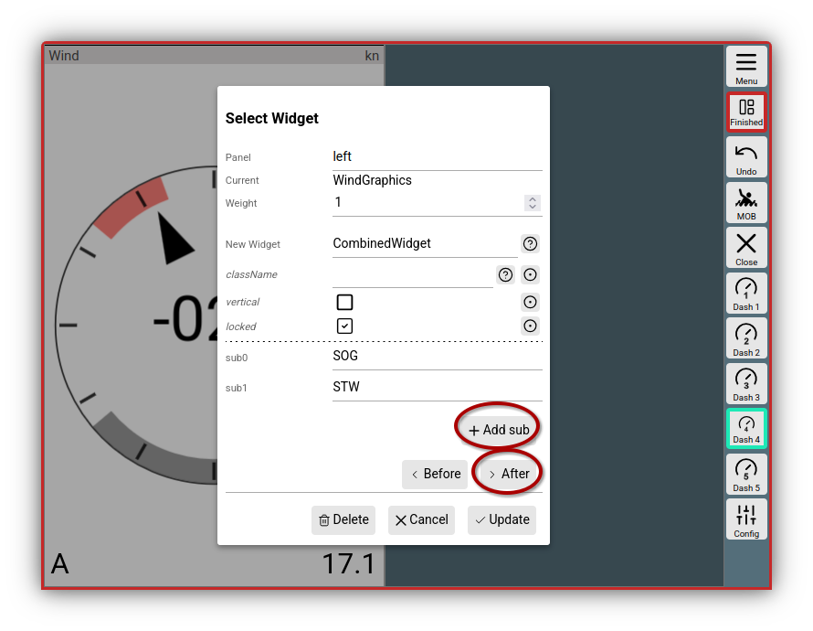
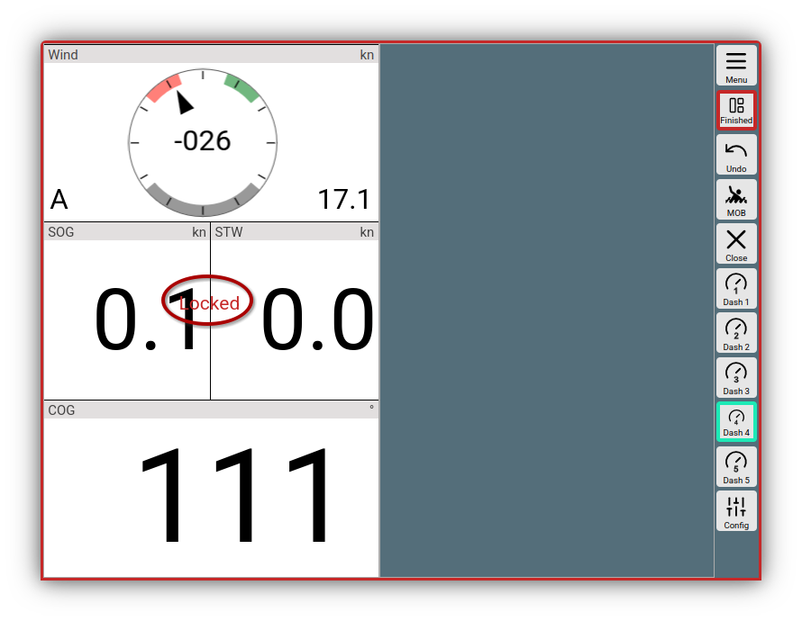
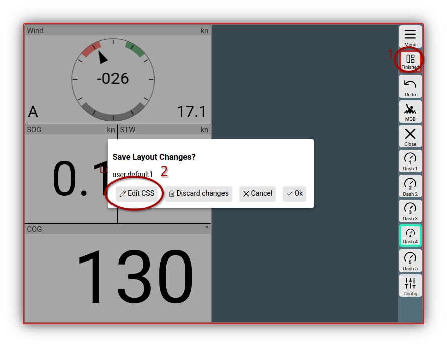
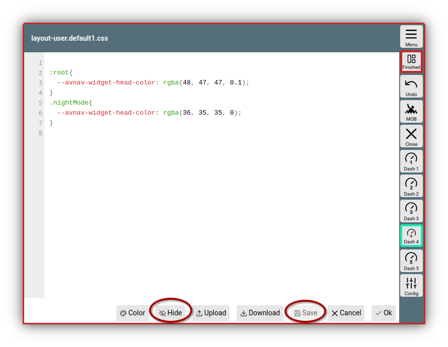
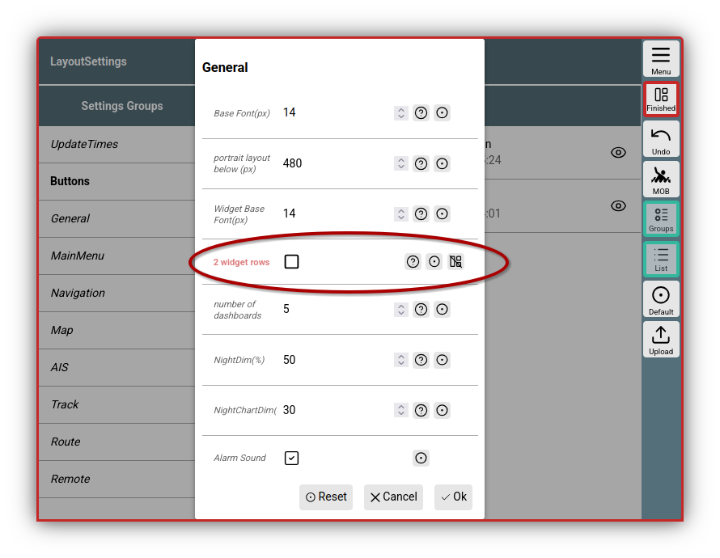

---
  tags:
    - Layout
    - CSS
---

# Details zu Layouts

Eine Einführung zu Layouts mit einem Video findet man [hier](../base/layout.md). In diesem Dokument werden einige weitere Details zu den Layouts beschrieben.

## Formatierer (Formatter) {: #formatter}

Die meisten Widgets benötigen für die Darstellung einen Formatierer, der
den internen Wert in die gewünschte Darstellung wandelt. Meist ist der
beim Widget fest vorgegeben. Einige Formatierer akzeptieren Parameter um
ihr Verhalten anzupassen (z.B. m/s statt kn).

Die Parameter für einen Formatierer sind im Dialog mit dem Prefix "fmt:"
sichtbar - "fmt:unit" im Beispiel.  
Die Liste der verfügbaren Parameter wird in der Implementierung des
Formatierers definiert (siehe [Benutzer
Formatierer](userjs.md#formatter)).

Wenn ein Formatierer einen "unit" Parameter hat, wird der Wert dieses
Parameter benutzt, um ihn als "unit" in der Anzeige darzustellen (Einige
Anzeigen erlauben ein Überschreiben dieses Wertes im Dialog).

Die folgenden Formatierer sind vorhanden:

|  |  |  |
| --- | --- | --- |
| Name | Beschreibung | Parameter |
| formatDecimal | einfache Formatierung als Dezimalzahl | fix: minimale Zahl der ganzzahligen Ziffern  fract: Zahl der Ziffern nach dem Komma  addSpace: setze ein Leerzeichen vor positive Zahlen  prefixZero: setze 0 als Prefix, um die Zahl der Vorkommastellen zu erreichen |
| formatDecimalOpt | Formatierung einer Dezimalzahl. Nachkommastellen werden nur für nicht ganzzahlige Werte dargestellt. | wie bei formatDecimal |
| formatDistance | Entfernung in nm|m|km | unit:  nm - Enterfnung in nm  m - Entfernung in m statt nm  km - Entfernung in km statt nm |
| formatSpeed | Geschwindigkeit in kn|m/s|km/h | unit:  kn - knoten  ms - m/s statt kn  kmh - km/h statt kn |
| formatDirection | Formatiere einen Gradwert | inputRadian: - Input in rad statt Grad  range180: zeige +/- 180° statt 0...360°  leadingZero: zeige immer 3 Stellen |
| formatDirection360 | Formatiere einen Gradwert | leadingZero: zeige immer 3 Stellen |
| formatTime | Formatiere einen Zeitwert (Wert muss intern ein Date Wert sein) (`hh:mm:ss`) |  |
| formatClock | Formatiere einen Zeitwert (Wert muss intern ein Date Wert sein) (`hh:mm`) |  |
| formatDateTime | Formatiere Datum und Uhrzeit (Wert muss intern ein Date Wert sein) |  |
| formatDate | Formatiere Datum (Wert muss intern ein Date Wert sein) |  |
| formatString | gibt den Input unverändert weiter |  |
| formatTemperature | Formatiere eine Temperatur (seit 20210106), Input in Kelvin | unit:  celsius, kelvin |
| formatPressure | Formatiere einen Druck (seit 20210106), input in Pa | unit:  pa, hpa, bar |

[Plugins](plugins.md#jscode) oder eigene [Erweiterungen](userjs.md) können ggf. weitere Formatierer
hinzufügen.

## Ändern von System-Layouts

System Layouts können nicht direkt geändert werden. Man kann aber eine Kopie dieser Layouts erstellen und diese dann anpassen. Das geht auf zwei Wegen:

  1. Wenn man ein System Layout gerade geladen hat.
     Unter {{MM("MMlayoutspage")}} sieht man im oberen Bereich unter "Current" das momentan aktive Layout. Wenn man den {{SB("Layout")}} Button klickt kann man über {{DB("DBEditLayout")}} den Layout-Editor starten.

     Man wird nach einem neuen Namen für das zu bearbeitende Layout gefragt. Wenn man einen Namen gewählt hat, wird eine Kopie des System-Layouts mit diesem Namen erzeugt und der Layout-Editor gestartet.

  2. Man kann in der Liste der Layouts auf ein System-Layout klicken und mit      
     {{DB("DBCopy")}} eine Kopie anlegen. Diese kann dann direkt geladen und editiert werden.

## Combined Widget {: #combinedwidget }

Mit den bereits in der [Einführung](../base/layout.md) gezeigten Möglichkeiten kann man schon recht flexibel Anzeigen nach seinen Wünschen zusammenstellen. Manchmal kann es aber den Wunsch geben z.B. auf den Dashboard-Seiten das einfache mehrspaltige Layout zu durchbrechen und Widgets über verschieden viele Spalten zu verteilen. Das `Combined Widget`kann einem dabei helfen. Es wirkt als Container in dem man beliebig viele "Kinder" horizontal oder vertikal anordnen kann.

///caption
Combined Widget
///

Im Bild wurde das Combined Widget als neues Widget gewählt und es wurden per {{DB("DBAddSub")}} `SOG` und `STW` hinzugefügt. Mit {{DB("DBAfter")}} wird das `Combined Widget` eingefügt.

///caption
Combined Widget eingefügt
///

Man hat damit erreicht, das die Widgets für `STW` und `SOG` nur jeweils eine halbe Spaltenbreite einnehmen - das `WindGraphics` und `COG` Widget aber die volle Breite nutzen.

Das `Combined Widget` ist momentan im _Locked_ Zustand - man kann es jetzt insgesamt verschieben und alle enthaltenen Kinder wandern mit. Wenn man im Dialog den _Locked_ Zusand aufhebt, können die Kinder einzeln verschoben werden und man kann auch andere Widgets direkt hineinschieben. 

Im Prinzip kann man sogar mehrere `Combined Widgets` ineinander schachteln - das wird jedoch etwas unübersichtlich während der Konfiguration.

## CSS {: #layoutcss }

Für Anpassungen mit [CSS](usercss.md) kann es manchmal Sinn machen, diese direkt in ein Layout aufzunehmen - dann werden sie nur wirksam, wenn dieses Layout geladen wurde und verschiedene Displays können verschiedene Layouts nutzen. Dazu kann über

{{BT("LayoutFinished")}}->{{DB("DBEditCss")}}

ein CSS-Editor aufgerufen werden.

///caption
Aufruf Layout CSS Editor
///

Es empfiehlt sich, den Aufruf auf der Seite zu tätigen, auf der man auch die Layout-Anpassungen sehen möchte. Im Gegensatz zum Handling bei [Nutzer-CSS](usercss.md) werden Änderungen im CSS nach dem Speichern **nur** im aktuellen AvNav Fenster wirksam.

///caption
Layout CSS Editor
///

Wie unter [Nutzer-CSS](usercss.md) kann man hier die gewünschten Anpassungen vornehmen. Nach dem Speichern kann man mit {{DB("DBHide")}} das Editor-Fenster transparent machen und so seine CSS-Änderungen direkt überprüfen.

Man kann z.B. auch die Breite (`--avnav-left-widgets-width`) (oder Höhe - `--avnav-horizontal-widgets-height`) der Widget-Container auf der Navigationsseite anpassen - und diese dann mit dem [Combined Widget](#combinedwidget) sehr flexibel gestalten.

Die CSS Daten werden direkt im Layout gespeichert und sind nicht als separate Dateien in AvNav sichtbar.

Alle Änderungen werden erst dann permanent gespeichert, wenn das Layout am Ende der Bearbeitung gespeichert wird.

## Einstellungen (Display Settings)

Es gibt einige [Einstellungen](../base/settings.md), die ein Layout u.U. massgeblich beeinflussen. Ein typischer Kandidat ist die Einstellung "2 widget rows" unter "General". Diese enstcheidet, ob auf der Navigationsseite unten zwei Zeilen mit Widgets angezeigt werden, wenn sonst der Platz nicht ausreicht. Wenn man das für ein bestimmtes Layout verhindern möchte, kann man **während man das Layout bearbeitet** die Einstellungen z.B. mit

{{MM("MMsettingspage")}}

aufrufen und den gewünschten Wert ändern.

///caption
Layout Display Settings
///

Wenn man jetzt die Einstellungen mit {{DB("DBOk")}} speichert, werden sie direkt im Layout gespeichert. Sie werden beim Editieren dann rot dargestellt. Wenn man {{SB("SettingsLayoutOff")}} klickt, wird die Einstellung wieder aus dem Layout entfernt - und es gilt die vom Nutzer gewählte Einstellung.

Man sollte mit dieser Funktion sehr eingeschränkt umgehen und wirklich nur Einstellungen direkt im Layout setzen, die unbedingt nötig sind. Wenn man den Layout-Editor verlässt, können diese Einstellungen nicht mehr über die normalen Menüs geändert werden - nur durch erneuten Aufruf des Layout-Editors.

## Laden und Speichern vom/zum Server

Wenn man ein Layout bearbeitet wird es lokal geändert und wird auch auf dem Server gespeichert (den Namen hat man ja beim Start des Layout-Editors gewählt). Es wird jedoch **nicht** sofort auch auf allen anderen Anzeige-Geräten wirksam. Dort wird es nur wirksam, wenn die AvNav Seite neu geladen wird 

{{MMA("ReloadUI")}} 

- oder das Layout explizit noch einmal ausgewählt und aktiviert wird:

{{MM("MMlayoutspage")}}

{{DB("DBActivate")}} nach Klick auf das Layout in der Liste.

Die anderen Anzeige-Geräte haben ihr Layout noch im Browser im [localStorage](https://developer.mozilla.org/de/docs/Web/API/Window/localStorage) gespeichert.

Wenn ein Layout auf dem Server gelöscht wird, werden die Anzeige-Geräte noch mit dem lokal gespeicherten Layout weiter arbeiten. Nur wenn ein solches nicht mehr vorhanden sein sollte, werden sie auf das `system-default` Layout zurückgehen.

Falls nach dem Löschen ein solches, noch vorhandenes Layout auf einem Anzeige-Gerät bearbeitet wird (Layout-Editor) wird es wieder auf dem Server gespeichert.

Um die Layouts zu sichern, kann man sie nach dem Klick auf ein Layout als JSON Datei herunterladen. Über den {{BT("Upload")}} kann man ein solches lokal gespeichertes Layout auch wieder in AvNav importieren (d.h. zum Server hochladen).

