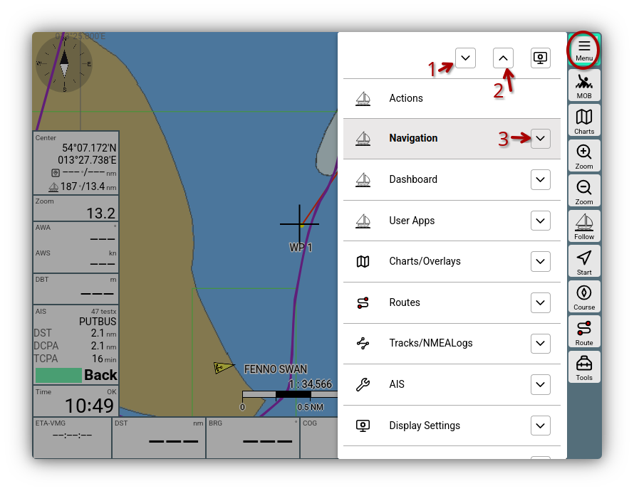
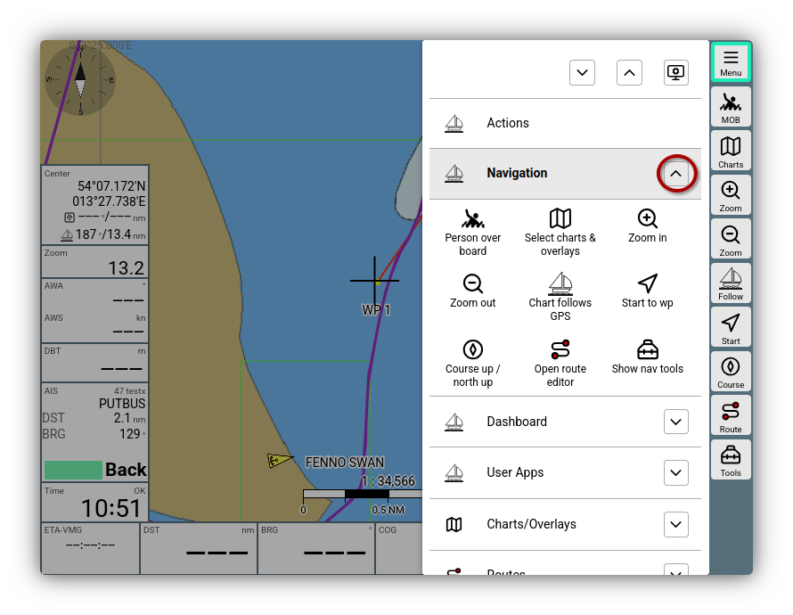

---
  tags:
    - Haupmenü
    - Seiten
---

# Hauptmenü

Auf allen Seiten in AvNav kann man mit dem Button {{BT("MainNav")}} das Haup-Menü erreichen.

///caption
Hauptmenü
///

## Buttons

Die Haupteinträge lassen sich scrollen. Über die im Bild markierten Buttons kann man weitere Funktionen auslösen:

  * (1) {{ICON("MNCollapsed")}}: Öffne für alle Einträge die erweiterte Ansicht. Diese zeigt die wichtigsten Buttons der jeweiligen Seite für einen schnellen Zugriff.
  * (2) {{ICON("MNExpanded")}}: Schließe alle erweiterten Ansichten.
  * (3) {{ICON("MNCollapsed")}}: Öffne die erweiterte Ansicht für diese Seite.

Der Button {{ICON("Settings")}} ermöglicht die [Display Settings](../base/settings.md) für das Hauptmenü anzupassen.

## Erweiterte Ansicht

Nach dem Öffnen der erweiterten Ansicht erhält man die wichtigsten Buttons der Seite (mit einem längeren Beschreibungstext - so wie auch in einem ToolTip angezeigt).

///caption
Hauptmenü erweiterte Ansicht
///

Mit einem Klick auf den jeweiligen Button wird die entsprechende Seite in AvNav geöffnet und die Button-Funktion wird ausgeführt.

## Einträge

| Eintrag | Beschreibung |
| --- | --- |
| {{MB("MM:actions")}} | Aufruf des [Action Menüs](../base//navpage.md#actions-buttons)
| {{MB("MMnavpage")}} | Aufruf der [Navigationsseite](../base/navpage.md) |
| {{MB("MMgpspage")}} | Aufruf der [Dashboard Seiten](../base/navpage.md#dashboards)|
| {{MB("MMaddonpage")}} | Aufruf der [User App Seite](../base/userapps.md)|
| {{MB("MMchartspage")}} | Aufruf der [Kartenverwaltung](../base/charts.md#management) |
| {{MB("MMroutepage")}} | Aufruf der [Routenverwaltung](../base/routes.md#mangement) |
| {{MB("MMtrackspage")}} | Aufruf der [Verwaltung von Tracks und NMEA Logs](TODO: tracks) |
| {{MB("MMaiscfgpage")}} | Aufruf der [AIS Konfiguration und Anzeige](ais.md) |
| {{MB("MMsettingspage")}} | Aufruf der [Display Settings](../base/settings.md) |
| {{MB("MMlayoutspage")}} | Aufruf der [Layoutverwaltung](../base/layout.md) (auch Start des Layout Editors) |
| {{MB("MMpluginspage")}} | Aufruf der [Pluginverwaltung](plugins.md#installation) | 
| {{MB("MMaddonconfigpage")}} | Aufruf der Seite für die Konfiguration von [UserApps](../base/userapps.md), für [Nutzer-CSS](usercss.md), für [Nutzer-JavaScript](userjs.md) und die Konfiguration von [Tastaturbefehlen](keyboard.md) oder [Icons](usericons.md) |
| {{MB("MMchannelspage")}}| Aufruf der [Verwaltung von (NMEA) Verbindungen](configfile.md#channelspage) |
| {{MB("MMserverpage")}} | Aufruf der [Serververwaltung](TODO: serverpage) |
| {{MB("MMremotepage")}} | Aufrufe der [Verwaltung für die Fernsteuerung](remotecontrol.md)|

