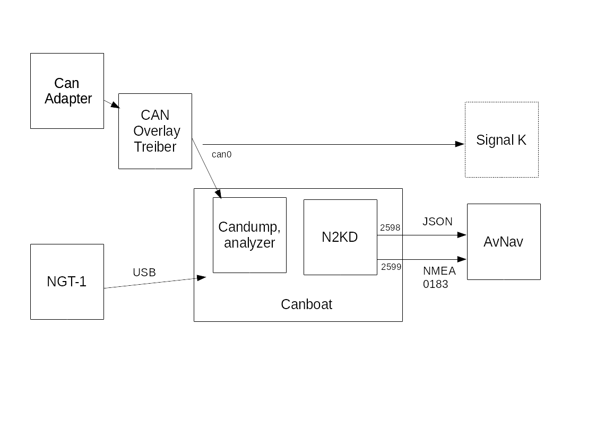

---
  tags:
    - Canboat
    - Nmea2000
---
# AvnNav und NMEA2000
AvNav kann von sich aus nicht direkt NMEA2000 Daten verarbeiten. Um mit NMEA2000 Systemen zusammenzuarbeiten, gibt es mehrere Möglichkeiten

| Variante | Beschreibung | System |
| --- | --- | --- |
| [Canboat](#Canboat) | AvNav kann NMEA2000 Daten über [canboat](https://github.com/canboat/canboat) **empfangen** (senden ist nicht möglich). | [RaspberryPi](../installation/raspberry.md), [Linux](../installation/linux.md) |
| [SignalK](#SignalK) | AvNav kann alle Daten von [SignalK](https://signalk.org/) empfangen. Über SignalK können auch Daten, die von AvNav kommen (z.B. Wegepunkt) als NMEA2000 gesendet werden. | [RaspberryPi](../installation/raspberry.md), [Linux](../installation/linux.md), [Windows](../installation/windows.md) (wenn SignalK auf einem erreichbaren System läuft) |
| [externe Umsetung](#extern)| Ein externer Umsetzer kann die NMEA2000 Daten auf NMEA0183 übersetzen (und meist auch zurück) und kann per TCP, UDP oder USB verbunden werden| alle Systeme |

Canboat {: #Canboat}
-------------------------------

Mit [canboat](https://github.com/canboat/canboat) können an
den Raspberry (oder ein anderes Linux System) angeschlossene CAN-Adapter (z.B. mit [MCP2515](https://www.reichelt.de/entwicklerboards-can-modul-mcp2515-mcp2562-debo-can-modul-p239277.md)
oder ein [Waveshare
RS485 CAN-HAT](https://www.waveshare.com/wiki/RS485_CAN_HAT) ) oder per USB angeschlossene Adapter (z.B. Actisene
NGT-1) genutzt werden. Für die einfachen CAN-Adapter muss darauf geachtet
werden, dass sie 2 Spannungsversorgungen haben (3,3V und 5V) - viele ganz
einfache haben das nicht!



Im Bild ist das prinzipielle Setup zu sehen, so wie es von den 
[headless Images](../installation/raspberry.md#images) bereitgestellt wird.

Für einen per [SPI](https://www.raspberrypi.org/documentation/hardware/raspberrypi/spi/README.md)
angeschlossenen [CAN-Adapter](https://www.raspberrypi.org/forums/viewtopic.php?t=141052)
muss meist noch ein Overlay in /boot/config.txt eingeschaltet werden. Für
den MCP2515 sind entsprechende Einträge bereits vorbereitet, diese müssen
auskommentiert werden. Gegebenenfalls müssen die Taktfrequenz und der für den Interrupt
genutzte GPIO Pin geändert werden.

Dieser CAN-Adapter erscheint dann als Netzwerk-Interface (ggf. muss er
noch entsprechend konfiguriert werden - in den Images ist das bereits
vorbereitet).

Das Interface sollte mit

```
ip link show can0
```

sichtbar sein.

Für einen per USB angeschlossenen Actisense NGT-1 siehe die [Beschreibung
bei Canboat](https://github.com/canboat/canboat/wiki/actisense-serial).

AvNav kommuniziert mit dem [n2kd](https://github.com/canboat/canboat/wiki/n2kd).
Dieser konvertiert empfangene NMEA2000 Daten in NMEA0183 (nicht ganz
vollständig). Die Konfiguration für n2kd erfolgt über die Datei

```
/etc/default/n2kd
```

In den Images ist hier eine Verbindung zu can0 vorbereitet. Für einen per
USB angeschlossenen Adapter muss diese Datei geändert werden. Falls ein
solcher USB-Adapter für NMEA2000 angeschlossen wird, sollte er in der Konfiguration für den USBSerialReader auf "ignore" gesetzt werden, damit er dort nicht genutzt wird
- beim Einstecken die [Connection/Devices Seite](TODO) beobachten und entsprechend konfigurieren.

Wenn alles korrekt konfiguriert ist, sollten auf den Ports 2599 und 2598
NMEA-Daten bzw. json-Daten zu sehen sein, wenn auf dem Bus NMEA2000-Datenverkehr vorhanden ist. Kontrolle z.B.

```
nc localhost 2599
```

Sonst den Zustand von Canboat mit

```
sudo systemctl status canboat
```

prüfen.

Für AvNav sollten 2 Verbindungen zum n2kd konfiguriert werden. Über eine
Verbindung (Port 2599) empfängt der Server die NMEA0183-Daten und über die andere
Verbindung (Port 2598)  direkt einige JSON-Daten. Das ist notwendig,
da n2kd keinen NMEA-Datensatz mit Datum ausgibt (z.B. RMC). Um das Datum
zu erhalten, kann AvNav direkt die pgns 126992,129029 lesen, um intern
Datum und Zeit zu setzen. AvNav kann daraus auch einen RMC Datensatz
generieren (wenn über NMEA gültige Positionsdaten empfangen werden).

Die direkte Abfrage der NMEA2000-Daten erfolgt über ein Plugin, daher
muss unter "Plugins" das Plugin builtin-canboat enabled sein (in den Images vorhanden).
Für den Empfang von NMEA Daten muss ein AVNSocketReader angelegt werden (unter Connections/Devices) - als host "localhost" und als Port "2599". Es sollte ein Name wie canboatnmea vergeben werden.

In den [Images](../installation/raspberry.md#images) ist das bereits vorkonfiguriert.
Wenn die NMEA2000 Daten auch direkt zu SignalK geleitet werden, sollte für den SocketWriter auf Port 34568 potentiell eine blacklist mit den Namen vom Socketreader auf Port 2599 und vom builtin-canboat Plugin damit die NMEA2000 Daten nicht auch noch einmal per NMEA0183 zu SignalK gesendet werden. 

Ein Senden von Daten über NMEA2000 ist bisher nicht vorgesehen, das kann
ggf. über SignalK konfiguriert werden.

SignalK {: #SignalK}
--------------------
Die Linux und Windows Versionen von AvNav können Daten auch von einem SignalK Server empfangen. Dieser kann auf dem gleichen System laufen oder auf einem anderen System, das per Netzwerk erreichbar ist. Für Details siehe die Beschreibung der [SignalK Integration](signalk.md).

Externe Wandler {: #extern}
-------
Es gibt verschiedene Produkte, mit denen NMEA2000 Daten in NMEA0183 Daten (und zurück) umgewandelt werden können. Je nach Produkt werden sie über das Wifi Netzwerk (UDP oder TCP) oder über USB bzw. NMEA0183 seriell verbunden.

Neben kommerziellen Lösungen gibt es auch Open Source Projekte dafür. Ein Beispiel ist der [NMEA2000 Gateway auf ESP32](https://github.com/wellenvogel/esp32-nmea2000). Mit diesem Projekt kann man mit einigen wenigen Komponenten ohne Lötarbeiten einen Umsetzer NMEA2000 <-> NMEA1083 zusammenstecken. Dieses System ist explizit mit AvNav getestet. Man kann den Umsetzer sowohl per Wifi mit AvNav verbinden als auch z.B. per USB. Insbesondere für die AvNav Android App ist das eine einfache Lösung.
