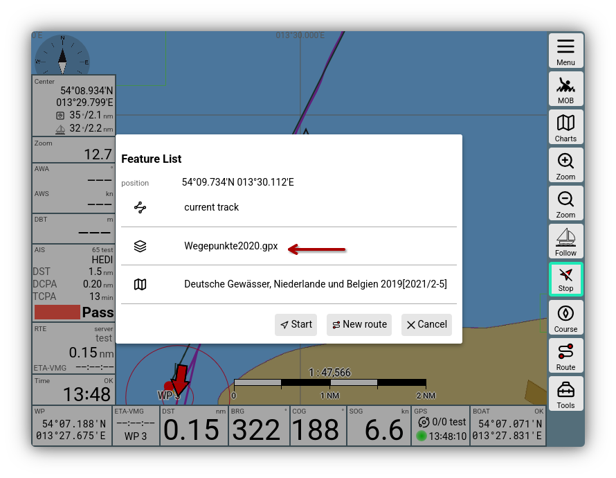
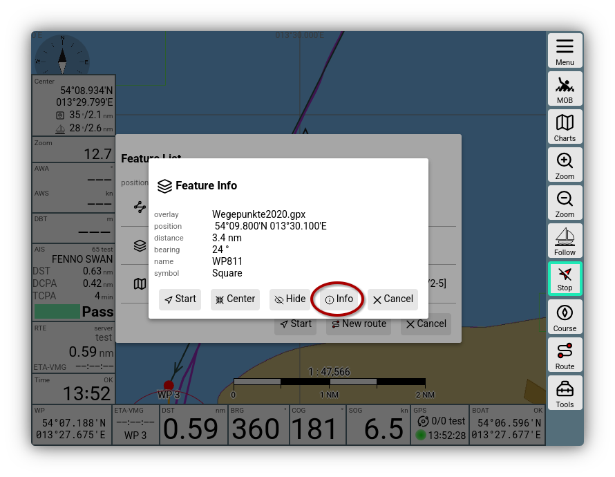

---
  tags:
    - Overlays
    - Karten
---
# Overlay Details

Wie in der [Einführung zu Overlays](../base/overlays.md) beschrieben, kann man zu einer Karte weitere Anzeige-Schichten (Overlays) hinzufügen.

Diese Overlays sind im Normalfall Dateien die geografische Informationen sowie Informationen zur Darstellung enthalten. AvNav kann Daten im [GPX Format](https://de.wikipedia.org/wiki/GPS_Exchange_Format), im [GEOJSON Format](https://geojson.org/) oder im [KML/KMZ Format](https://de.wikipedia.org/wiki/Keyhole_Markup_Language) verarbeiten. Daneben können auch in AvNav bereits vorhandene Daten wie Tracks und Routen als Overlays genutzt werden.
Um komplett flexibel zu sein, kann man auch andere Karten als Overlay zu einer bestimmten Karte hinzufügen. Das kann sehr hilfreich sein, wenn die Karten getrennte Bereiche abdecken - so bekommt man eine übergangsfreie Darstellung.

In der [Einführung](../base/overlays.md#parameters) wird erklärt, wie man die Einstellungen von Overlays bearbeitet. Hier werden einige Details dazu beschrieben.

## Overlay Geometrien und Eigenschaften {: #geometry}

In allen Overlay-Dateien sind sogenannte Geometrie-Objete vorhanden. Das sind beispielsweis Punkte, Linien, Linien aus mehreren Segmenten (wie Tracks oder Routen) oder Flächen (die durch Polygone beschrieben sind).
Solche Geometrie-Objekte haben Eigenschaften, die beschreiben, wie sie auf der Karte dargestellt werden sollen. Das sind z.B. Farben, Punkt-Größen, Linienstärken, Texte, Text-Größen usw.

Je nach Overlay-Typ haben diese Eigenschaften feste Werte oder die Werte müssen erst vom Nutzer festgelegt werden.

Dabei können im [Eigenschaften-Dialog](../base/overlays.md#parameters) immer nur die Werte für alle Objekte eines Typs in einer Overlay-Datei festgelegt werden (also z.B. die Strichstärke oder -Farbe für alle Linien). In den Dateien selbst können diese Eigenschaften aber u.U. für jedes Objekt verschieden sein (z.B. KML Dateien).

Neben den Eigenschaften, die direkt die Anzeige beeinflussen, können die Geometrie-Objekte noch weitere Eigenschaften haben (also z.B. einen erläuternden Text - oder ganze HTML Seiten). Diese werden im Normalfall nicht auf der Karte angezeigt, können aber (nach Klick auf die Karte) über die [Feature Info](#featureInfo) angezeigt werden. Siehe dazu auch unter [Feature Formatter](#featureformatter).

## Anzeige-Eigenschaften

In der [Einführung](../base/overlays.md#parameters) wurden schon einige Anzeige-Eigenschaften erklärt. Weitere Eigenschaften erscheinen im Overlay-Dialog, wenn die Overlay-Datei Geometrie-Objekte mit einem entsprechenden Type enthält (`line width` wird z.B. nur angezeigt, wenn es auch Linien-Objekte gibt). Die Parameter haben jeweils einen kurzen Hilfe-Text.

## Symbole (Icons)

Einige Overlay-Dateitypen (z.B. KML/KMZ) unterstützen die Angabe einer Icon-Url für Punkte. Diese URLs können entweder absolute (externe) URLs sein - oder relative oder absolute interne URLs (d.h. URLs die auf den AvNav Server zeigen). 

Damit diese Icons angezeigt werden können, müssen sie natürlich vorhanden sein. Für externe URLs muss im Dialog `allow online` gesetzt werden, damit diese angezeigt werden. Für relative URLs müssen die Icons entweder in das Overlay-Verzeichnis (als Overlay Datei) hochgeladen werden - oder sie müssen in einer Zip-Datei eingepcakt sein (mit Pfaden so, wie sie in der Overlay Datei stehen). Diese Zip Datei muss dann ebenfalls als Overlay-Datei zu AvNav hochgeladen werden und als Parameter `icon file` im Dialog angegeben werden.

Die Objekt-Eigenschaftt, die das Icon beschreibt ist `sym`. Unter [Feature Formatierer](#featureformatter) ist noch beschrieben, wie man die Ermittlung der Icon-URL beeinflussen kann.

## Feature Info {: #featureInfo }

Wenn man auf der Karte auf ein angezeigtes Overlay-Objekt klickt, wird dieses in der [Feature-Info-Liste](featureinfo.md) erscheinen.

///caption
Overlay Feature Info
///

Nach Klick auf das Overlay erhält man eine Information zum gerade angeklickten Objekt aus dem Overlay.

///caption 
Overlay Detail
///
Hier werden einige der [Eigenschaften](#geometry) des Objektes angezeigt. 
Welche Eigenschaften angezeigt werden, hängt vom Overlay-Type und vom [Feature-Formatierer](#featureFormatter) ab.

Die default Eigenschaften sind:

  * `name`
  * `desc` (angezeigt als `description`)
  * `time`
  * `sym` (angezeigt als `symbol`)

Daneben können [Feature Formatierer](#featureFormatter) noch weitere Eigenschaften setzen:

  * `buoy`
  * `top`
  * `light`
  * `link`: 
    eine URL, wenn dieser Wert gesetzt ist, wird wie im Bild der Button {{DB("DBInfo")}} angezeigt, der einen Dialog mit der HTML Seite öffnet
  * `htmlInfo`: 
    zeigt ebenfalls den Button {{DB("DBInfo")}} und öffnet einen Dialog, der den Wert des Parameters als HTML anzeigt
  * `linkText` - ein Titel für die HTML Anzeige

## Feature Formatierer {: #featureFormatter}

Da AvNav nicht alle denkbaren Formate und Spezial-Inhalte von Overlays bereits kennen kann, gib es die Möglichkeit, die Anzeige von Informationen aus den Overlays zu beeinflussen. 

Dazu ist es erforderlich einige Zeilen Java-Script Code zu schreiben und diesen bei AvNav bekannt zu machen.

Ein solcher Formatierer ist eine Java-Script-Funktion, die die Eigenschaften des Geometrie-Objektes als Parameter erhält und veränderte Eigenschaften zurückgibt.
Diese zurückgegebenen Eigenschaften können dann sowohl die Anzeige auf der Karte beeinflussen (`sym`für die Symbol-URL,`name`) oder die Anzeige in der [Feature Info](#featureInfo).

Im Wesentlichen muss man dazu die Datei `user.mjs` bearbeiten:

{{MM("MMaddonconfigpage")}}->"User Files" -> "user.mjs" -> {{DB("Edit")}}

und dort einen Eintrag für den Formatierer hinzufügen, so wie unter [Nutzer-Java-Script](userjs.md#featureformatter) beschrieben.

Auch [Plugins](plugins.md) können solche Feature Formatierer mitbringen.

Der Name des Feature-Formatierers muss dann im Overlay-Dialog unter `feature formatter` aus der angezeigten Liste ausgewählt werden.
